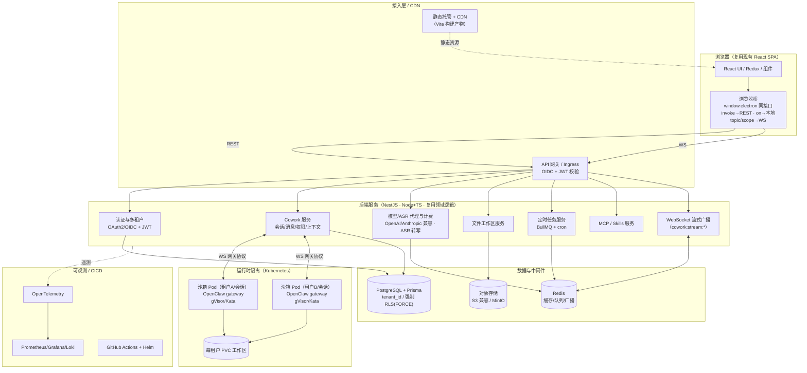
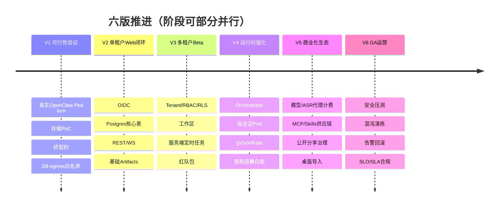
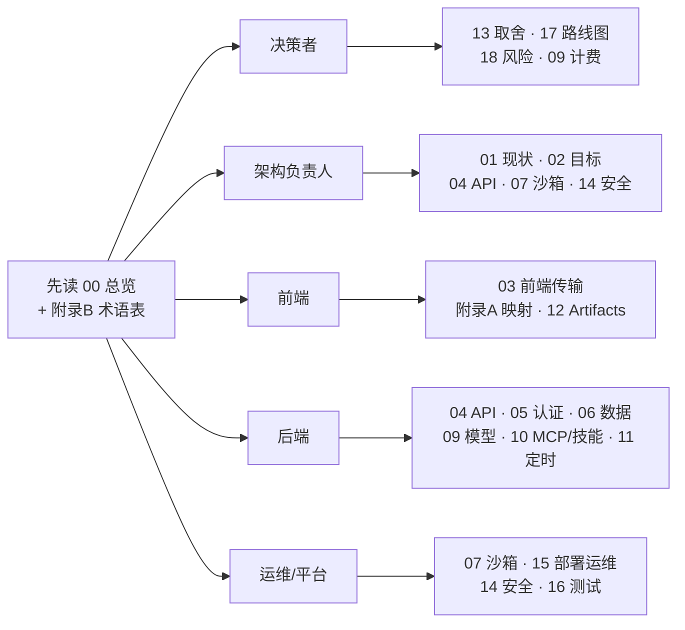

# 总览与执行摘要

> 本文档是整套「LobsterAI 桌面端 → 多租户 SaaS Web 应用」改造计划的入口与执行摘要，面向**决策者、架构负责人、以及需要快速建立全局认知的工程/运维骨干**。它回答四个问题：为什么做、做到什么程度、总体怎么做、投入多大代价与风险。技术细节请按文末「文档导航」下钻到对应分册。

---

## 1. 背景与目标

### 1.1 现状一句话

LobsterAI 是一款 **Electron + React 桌面应用**（当前仓库 `package.json` 版本为 `2026.7.7`）。产品层称为 **Cowork**（会话/消息/权限/UI 状态/本地持久化），Agent 运行时称为 **OpenClaw**（本地 Node 网关进程）。当前它是**单机单用户**形态：

- 所有数据存在本机 SQLite 单文件（`src/main/sqliteStore.ts`，无 `tenant_id`、无 `user_id` 分区）。
- 渲染层通过唯一桥 `window.electron` 与主进程通信（`src/main/preload.ts`）。注意：`window.electron` **并非**收口在 `src/renderer/services/*`——组件直连 **245** 处 > services 层 **207** 处，过半调用绕过 services，故浏览器桥须 **1:1 实现整个 `window.electron` 全局表面**（见附录 C A4/B10）。
- Agent 能力依赖本地拉起的 OpenClaw 网关（`src/main/libs/openclawEngineManager.ts`，监听 `ws://127.0.0.1:{port}`，默认端口 `18789`）。
- 账号、模型代理、配额计费、HTML 分享、技能商店、更新等云能力挂在 youdao 云（`src/main/libs/endpoints.ts`，如 `https://lobsterai-server.youdao.com`）。

### 1.2 目标一句话

把 LobsterAI 改造为**公网可访问、多用户共享、按租户隔离的多租户 SaaS Web 应用**，几乎所有功能 Web 化，并**全部自建新后端**（不再依赖现有 youdao 云；账号、模型代理、计费、存储、分享全部重建）。

### 1.3 为什么这次改造是可行的（核心判断）

现有架构对 Web 化其实相当友好，主要有三点结构性红利：

| 结构特征 | 对 Web 化的意义 |
|---|---|
| 渲染层与主进程之间**只有一座桥** `window.electron` | 同接口浏览器桥能最大化复用核心 React UI/Redux 调用面；但租户、工作区路径、计费、导入向导和 Electron-only 降级仍是显式产品/服务改造，不能当作前端原样复用 |
| OpenClaw 已经是**独立进程 + WebSocket 网关**（非进程内库） | 具备服务化基础；但不能只把 loopback WS 换成远程地址，还必须完成运行时编排、Config Sync 渲染链路、PVC/state 映射、secret 注入、egress 与隔离验证 |
| 业务逻辑用 **TypeScript** 写在 `src/main/libs/*`、`src/main/*Store.ts` 等模块 | 后端沿用 Node.js + TypeScript，纯 `libs/` 逻辑可 lift-as-is 复用；但复用须**按文件分级**——深度耦合 `better-sqlite3`/`electron` 的 `coworkStore.ts`、`openclawConfigSync.ts` 属**必须重写/移植**，非直接复用（见附录 C D15）|

真正的难点不在「能不能」，而在**多租户运行时沙箱隔离**（见第 3 节与 `07-OpenClaw运行时编排与沙箱隔离.md`）。

---

## 2. 范围与非目标（V1-V6 GA 主线）

> 注意：本文和 `17` 中的 **第一版 V1** 是“可行性验证版”，不是传统产品语境里的“商业 v1”。因此范围口径统一写作 **V1-V6 GA 主线范围**。

### 2.1 V1-V6 GA 主线覆盖范围（做）

| 能力域 | 说明 | 对应文档 |
|---|---|---|
| 核心对话 / Agent | Cowork 会话、消息流式、多 Agent、权限交互、上下文用量/压缩 | `04`、`07` |
| Artifacts 与预览 | html/svg/image/video/mermaid/code/markdown/document 等 | `12` |
| Skills（技能/Kits） | 技能同步、安装/升级、安全扫描、启用态、路由提示 | `10` |
| MCP | stdio / sse / http 三种传输；stdio 需服务端沙箱 | `10` |
| 文件工作区读写 | 每租户工作区（PVC + 对象存储镜像），每会话 Pod 绑定工作区租约 | `08` |
| 定时任务 | 经后端 BullMQ 调度（沙箱内 OpenClaw cron 禁用）的调度与投递 | `11` |
| 认证 + 多租户账户 | OAuth2/OIDC + JWT，租户隔离 | `05` |
| 模型代理与计费 | 自建模型网关 + ASR 上游代理 + 配额/计费 | `09` |

### 2.2 非目标（本次不做 / 后续再做）

| 项 | 决策 | 理由 |
|---|---|---|
| IM 渠道（微信/飞书/钉钉/QQ/Telegram/Discord/邮件/NIM 等） | **GA 后续** | 多为 OpenClaw connector 常驻连接（`src/main/im/imGatewayManager.ts`），多租户下的连接编排复杂，不阻塞 V1-V6 主线 |
| 第三方 OAuth 代持（GitHub Copilot / OpenAI Codex device-code） | **GA 后续** | 凭据代持和刷新责任更重，需单独做授权、撤销、审计和合规评估；GA 主线只做平台 key 与 BYOK API key |
| computer-use 桌面自动化（`src/main/computerUse/`） | **不做** | 依赖用户本机桌面（仅 Windows x64），SaaS 形态无宿主桌面 |
| VM / 后台浏览器自动化 | **不做** | 需要每会话常驻浏览器 VM，成本与隔离风险高，不纳入 V1-V6 GA 主线 |

> 降级与取舍的完整清单（含被砍能力的替代/占位方案）见 `13-功能取舍与降级清单.md`。

---

## 3. 核心结论（决策者必读）

### 3.1 迁移最大杠杆 = 「同接口的浏览器桥」顶替 `window.electron`

- 现状：渲染层实测 **481 处调用、72 个文件**通过 `window.electron` 走 IPC，**并未收口在 `src/renderer/services/*`**——组件直连 **245** 处 > services 层 **207** 处，过半绕过 services（见附录 C A4/B10）；请求走 `ipcRenderer.invoke`，流式走主进程 `webContents.send('cowork:stream:*')` + 渲染层 `ipcRenderer.on`。
- 结论：**不重写前端**。浏览器桥须 **1:1 实现整个 `window.electron` 全局表面**（而非只替换 services 层，因过半组件直连桥）：`invoke(channel, ...)` → REST(HTTP)；`on(...)` 先登记桥本地 topic/scope 回调表，其中 `cowork:stream:*` 只登记本地回调，会话级 WS `subscribe/unsubscribe {sessionId,sinceSeq?}` 由 `activeSessionIds` registry 统一发出；文件资源走 `subscribeEvent`，用户级事件随 auth 自动恢复，`api:stream` 按 `requestId` 本地分发。收到 `StreamEnvelope.type` 后回调旧 channel。核心对话 UI/Redux/组件应尽量只因传输层替换而少改；但租户、工作区路径、计费、导入向导和 Electron-only 能力降级必须显式改造，不能宣称全前端零改。
- 收益：把「重写整个前端」的巨大工作量，压缩为「实现一层适配桥 + 改造服务封装」。详见 `03-前端与传输层改造.md` 与 `附录A-IPC通道与接口映射.md`。

### 3.2 OpenClaw 已是 WS 网关，服务化友好

- 现状：OpenClaw 是独立 Node 进程（`utilityProcess.fork` / `spawn`，`src/main/libs/openclawEngineManager.ts:596-623`），监听 `ws://127.0.0.1:{port}`，token 鉴权，配置由 `openclawConfigSync.ts` 写入 `openclaw.json` + 工作区文件（`AGENTS.md`/`MEMORY.md` 等）。
- 结论：把「本机 loopback WS」升级为「云端服务网格内的 WS」，逻辑变化小；主要工作是**编排（谁在何处拉起、如何寻址）**与**隔离**，而非重写网关本身。

### 3.3 真正难点 = 多租户运行时沙箱隔离（最难一章）

- OpenClaw 网关会执行工具、读写文件工作区、跑 stdio MCP（本地 `npx` 子进程）、跑技能脚本——这些在 SaaS 下必须**强隔离**，否则一个租户可越权访问他人数据/资源。
- 方案基调：**Kubernetes，每会话一个沙箱 Pod** 跑 OpenClaw 网关，Pod 绑定 `tenant_id`、`session_id` 与工作区租约，用 **gVisor/Kata** 加固，每租户 **PVC** 工作区；配额、生命周期、冷启动、驱逐策略是核心设计点。
- 这是全项目风险与成本的最大来源，详见 `07-OpenClaw运行时编排与沙箱隔离.md` 与 `14-安全合规与多租户隔离.md`。

### 3.4 与「容器改造计划」的关系

原「容器改造计划」验证的是另一种过渡形态：把完整 Electron 桌面应用放进 Docker，容器内用 Xvfb/noVNC 暴露像素级远程桌面，每实例保留自己的 SQLite、`HOME` 与 OpenClaw 本地回环网关。它能证明 Linux 打包、OpenClaw runtime 镜像化、单卷状态持久化、资源密度和 noVNC 入口安全等问题，但**不等同于最终 Web SaaS 架构**。

本计划吸收它的有效部分：

| 容器计划内容 | 并入本计划的位置 | 处理口径 |
|---|---|---|
| Linux 构建、原生模块、OpenClaw runtime 打包 | `07`、`15`、`16`、`17` | 作为 V1 Sandbox 镜像 PoC 与 CI 构建门槛 |
| 独立 `HOME` / 单卷状态 / SQLite WAL / 优雅停机 | `07`、`08`、`15` | 拆分为 Pod `/state` 运行时动态 state、PVC 工作区和 drain/落盘流程 |
| Xvfb/noVNC | `07`、`14`、`16` | 仅允许作为受控调试或旧 GUI PoC，不进入 GA 产品入口 |
| 50 实例资源密度与错峰启动 | `07`、`15`、`18` | 转化为每会话 Pod 容量、水位、压测和成本风险 |
| 入口认证、卷加密、最小权限、凭据泄漏风险 | `14`、`15`、`18` | 纳入 Sandbox 安全与运维门禁 |

---

## 4. 目标架构（一张图）

> 目标架构的分层职责、组件边界与技术选型理由，详见 `02-目标架构与技术选型.md`。

高层鉴权口径：REST 使用短时 access token；WebSocket 通过 REST 申请一次性短期 ticket，连接建立后首帧校验并消费 ticket，不直接使用长效 JWT 建连，也不把 token 放 URL query。

---

## 5. 分版本路线图概览

每一行是一版可验收交付；**路线图权威定义见 `17-分阶段路线图与工作量估算.md` §1.1，本表为概览**。旧 M0-M9 不再作为权威推进顺序，仅按 `17` §1.2 的映射理解。

**V1 前置门**：当前仓库仍是 Electron + React 桌面端结构，尚无目标 SaaS 所需 `apps/`、`libs/`、`prisma/`、`charts/`、`docker/` 与契约/CI 脚手架。进入 V1 的 4-6 周 PoC 周期前，必须先完成 `19-开工前补件与工程脚手架冻结.md` 定义的 PR-0~PR-4（scaffold、contracts、Prisma/RLS、Docker/Helm/supply-chain、V1 PoC harness）与 Day-0 平台决策冻结；这些是 V1 前置准入，不算 V1 业务交付物。

| 版本 | 名称 | 核心交付物 | 验收信号 |
|---|---|---|---|
| **第一版 V1** | 可行性验证版 | 真实 OpenClaw gVisor Pod 跑通一条 turn；RWX/PVC+S3 存储 PoC；Web 桥契约冻结；Config Sync golden；provider 直连封锁 + D8 egress 白名单 PoC | V1 go/no-go 评审通过；沙箱、存储、桥、配置、egress 均有实测证据 |
| **第二版 V2** | 单租户 Web 闭环版 | OIDC 登录、Postgres 核心 schema、Cowork Service 最小链路、浏览器桥、REST/WS、基础 Artifacts | 浏览器可完成登录→发消息→流式响应→查看 artifact；仅内部 Alpha，不对外承诺多租户安全 |
| **第三版 V3** | 多租户 Beta 版 | Tenant/RBAC/RLS、工作区文件 API、Artifacts 多租户存储、服务端 BullMQ 定时任务、Beta 审计与删除/导出请求受理最小闭环 | 邀请制外部租户可试用；API/WS/S3/Redis/PVC/任务均通过跨租户红队测试；删除/导出请求可审计、可支持处理，但完整导出包/删除凭证归 V6 |
| **第四版 V4** | 运行时强化版 | Runtime Orchestrator、每会话 Pod、gVisor/Kata、NetworkPolicy、egress、预热容量、Pod 自愈、资源配额 | 多租户并发压测、沙箱逃逸、egress、冷启动、自愈和容量门槛通过 |
| **第五版 V5** | 商业化与生态版 | 模型网关计费、ASR 上游代理与 `asr_transcription` 账务、短期 model token、MCP/Skills 供应链治理、公开分享 abuse 治理、桌面导入工具 | 付费试点可用；模型/ASR 上游调用不可绕过网关/代理；stdio MCP 不在宿主执行；公开分享有治理流程 |
| **第六版 V6** | GA 上线运营版 | 全链路安全压测、混沌演练、可观测告警、发布回滚、on-call、状态页/客户支持、SLO/SLA 同源口径、合规与数据生命周期 | P0/P1 清零；DR/Chaos/回滚/on-call/状态页演练通过；SLO/SLA 与合规生命周期满足 GA 准入 |

---

## 6. Top 5 风险与应对

| # | 风险 | 影响 | 应对（详见分册） |
|---|---|---|---|
| **R1** | **多租户运行时隔离不足**：一个租户越权访问他人工作区/网络/资源 | 严重（数据泄露、安全事故） | 每会话独立 Pod + gVisor/Kata + 每租户 PVC 工作区子路径 + NetworkPolicy；跨租户越权用例纳入必过测试。见 `07`、`14` |
| **R2** | **沙箱冷启动与成本**：每会话拉 Pod 导致首字延迟高、资源费用失控 | 高（体验差 + 烧钱） | 预热容量 + 活跃会话续用、按空闲驱逐、租户级配额与并发上限、冷/预热容量/热三态。见 `07`、`15` |
| **R3** | **数据迁移正确性**：SaaS schema/RLS 错误或启用桌面导入工具时数据映射错配 | 高（数据错乱/串户） | V3 做 Prisma migrate/DDL/RLS/幂等校验并以 **强制 RLS(FORCE)** 兜底；启用 V5 桌面导入工具时再做 dry-run、双读校验与可回滚快照。见 `06`、`05`、`18` R-DATA-01 |
| **R4** | **前端桥与流式契约漂移**：481 调用点中有隐藏的 Electron-only 假设或流式时序差异 | 中高（功能性 bug 隐蔽难查） | 以 `附录A` 为契约基线逐通道映射；Electron-only 通道（window/shell/dialog/clipboard/log）显式降级；契约测试覆盖 `cowork:stream:*` 与 `api:stream:*`。见 `03`、`附录A` |
| **R5** | **自建云能力交付超期**：账号/计费/分享/技能商店全部重建，范围大 | 中（进度风险） | 按六版切分，先证伪高风险假设，再交付 Beta、运行时硬化与商业化；非必需（完整技能市场 UI 等）延后；只复用可分级迁移的 TS 语义、类型和测试资产，`coworkStore`/`openclawConfigSync` 等深耦合模块仍按 D15 重写/移植。见 `09`、`17`、`18` |

> 完整风险登记册（含概率/影响评级、触发信号、明确 owner 与缓解证据）见 `18-风险登记册.md`。

---

## 7. 工作量与周期粗估

> 以下为**区间级**粗估，用于决策与排期沟通，非承诺；精确分解见 `17-分阶段路线图与工作量估算.md`。假设团队具备 Node/TS + K8s 经验，且现有代码可复用。
>
> **口径说明**：工作量以 `17-分阶段路线图与工作量估算.md` §1.1 与 §4.4 为**唯一权威估算来源**。本文只摘录结论：`17` 的 560 pd 是未加缓冲的 Story 风险基线，不单独折算为对外承诺人月；经跨域联调、评审返工、运行时/计费高不确定性加成后，中位约 **38 人月**，决策沟通统一使用 **30–45 人月** 区间。后续如更新人月，只改 `17` 后同步本文摘要。

| 维度 | 估算 |
|---|---|
| 总周期（V1–V6 到 GA） | **约 7–10 个月** |
| 技术 PoC（V1，可行性验证） | 约 1–1.5 个月 |
| 单租户 Alpha（V2） | 约 1–1.5 个月 |
| 多租户 Beta（V3） | 约 1.5–2 个月 |
| 运行时硬骨头（V4） | 约 1.5–2.5 个月（最大不确定性） |
| 商业化与 GA 收口（V5–V6） | 约 2–3 个月 |
| 人力总投入 | 约 **30–45 人月** |

**推荐团队规模（并行推进）：约 6–8 人**

| 角色 | 人数 | 主要负责 |
|---|---|---|
| 后端（Node/TS/NestJS） | 2–3 | Cowork/认证/模型代理/文件/定时任务服务 |
| 平台 / DevOps / K8s | 1–2 | 沙箱编排、gVisor/Kata、Helm、可观测（R1/R2 攻坚） |
| 前端 | 1 | 浏览器桥、传输适配、Electron-only 降级 |
| 数据 / 迁移 | 0.5–1 | Postgres 多租户 schema + 迁移（可与后端复用） |
| 安全 / QA | 1 | 多租户越权测试、合规、压测、验收 |

关键不确定性集中在 **V1（可行性验证）** 和 **V4（运行时强化）**：若 V1 无法证明沙箱、存储、桥契约、provider 直连封锁与 D8 egress 白名单可行，应暂停或调整路线；若团队 K8s/gVisor/RWX 存储经验不足，V4 周期与人月应向区间上限取值。

---

## 8. 文档导航

本目录共 24 份 Markdown：README + 20 篇正文（00-19）+ 3 篇附录。建议按角色选读，交叉引用见各处「见 XX 文档」。**关键跨文档口径（决策基线 D1–D16、源码订正、接口契约）以附录 C 为准。**

### 8.1 全部文档清单

| 编号 | 文档 | 内容一句话 |
|---|---|---|
| 00 | 总览与执行摘要 | 本文档：全局与决策入口 |
| 01 | 现状架构调研 | 桌面端现状深度调研（知己） |
| 02 | 目标架构与技术选型 | 目标形态、分层、选型理由 |
| 03 | 前端与传输层改造 | 浏览器桥、REST/WS、静态托管 |
| 04 | 后端服务与 API 设计 | 服务按域拆分与 API 契约 |
| 05 | 认证与多租户账户 | OAuth2/OIDC + JWT + 租户模型 |
| 06 | 数据模型迁移 | SQLite → Postgres 多租户 |
| 07 | OpenClaw 运行时编排与沙箱隔离 | 最难一章：每会话 Pod 隔离 + 每租户工作区/PVC |
| 08 | 文件工作区与对象存储 | 工作区读写 + S3 兼容 |
| 09 | 模型代理与计费 | 自建模型网关 + ASR 上游代理 + 配额/计费 |
| 10 | MCP 与技能改造 | MCP 传输/沙箱化、Skills/Kits |
| 11 | 定时任务调度 | 经后端 BullMQ 调度（沙箱内 OpenClaw cron 禁用） |
| 12 | Artifacts 与预览改造 | 预览类型与隔离/沙箱化 |
| 13 | 功能取舍与降级清单 | 做/不做/降级的完整清单 |
| 14 | 安全合规与多租户隔离 | 隔离模型、合规、审计 |
| 15 | 部署运维与可观测性 | K8s/Helm、OTel/Prom/Grafana/Loki |
| 16 | 测试策略与验收标准 | 契约/集成/隔离/压测与验收 |
| 17 | 分版本路线图与工作量估算 | 第一版到第六版、任务分解、人月 |
| 18 | 风险登记册 | 全量风险与应对 |
| 19 | 开工前补件与工程脚手架冻结 | V1 前置 PR-0~PR-4、Day-0 平台决策、目标 SaaS 脚手架与 CI 门禁 |
| 附录 A | IPC 通道 → REST/WS 接口映射清单 | 映射导航；通道分母以附录 C B9/B14 为准（`main.ts` 内 217、全 `src/main` 约 283、去重事件约 29） |
| 附录 B | 术语表与阅读指南 | 名词与阅读路径 |
| 附录 C | 决策基线与接口契约总纲 | 权威层：D1–D16 决策、源码订正、schema/DDL 契约 |

### 8.2 按角色的阅读路径

| 角色 | 必读 | 建议扩展 |
|---|---|---|
| **决策者** | 00、13、17、18 | 09（成本相关）、02 |
| **架构负责人** | 00、01、02、04、07、14 | 全部（把关一致性） |
| **前端** | 00、03、附录 A、12 | 04（后端契约）、附录 B |
| **后端** | 00、04、05、06、09、10、11 | 07（运行时协作）、附录 A |
| **运维 / 平台** | 00、07、15、14、16 | 02、18 |

---

## 9. 一页纸速览（TL;DR）

- **做什么**：把单机桌面 LobsterAI 改成多租户 SaaS Web 应用，后端全部自建。
- **V1-V6 GA 主线范围**：认证多租户 + 模型代理与计费（含 ASR 上游代理与账务）+ 对话/Agent/Artifacts/Skills/MCP + 文件工作区读写 + 定时任务；**不做** IM（GA 后续）、computer-use、VM/后台浏览器。
- **最大杠杆**：用「同接口的浏览器桥」顶替 `window.electron`，让核心对话链路尽量少受传输层改造影响；但新增 SaaS 概念和桌面专属能力降级仍需显式产品改造。OpenClaw 已是 WS 网关，具备服务化基础，但仍要经过 `07` 的编排、配置和隔离改造。
- **最大难点**：多租户运行时沙箱隔离（K8s + 每会话 Pod + gVisor/Kata + 每租户 PVC 工作区）。
- **技术栈**：React SPA + 浏览器桥 / REST + WS / NestJS(Node+TS) / Postgres+Prisma / Redis+BullMQ / S3(MinIO) / K8s / OIDC+JWT / OTel+Prometheus+Grafana+Loki / GitHub Actions+Helm。
- **代价**：约 7–10 个月、约 30–45 人月、6–8 人团队；风险集中在 V1 可行性验证、V4 运行时强化、V5 计费与供应链治理。
