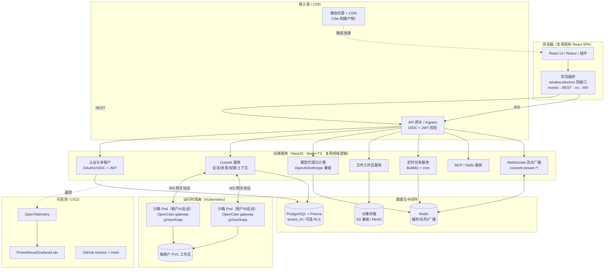
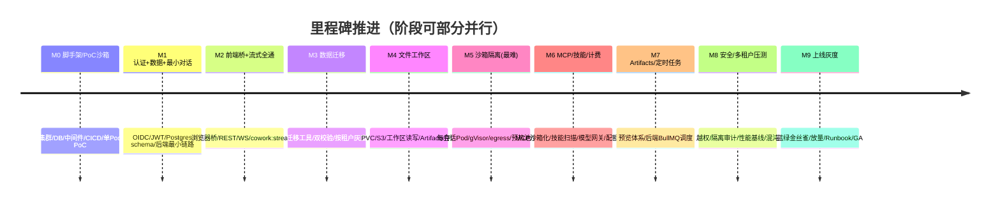
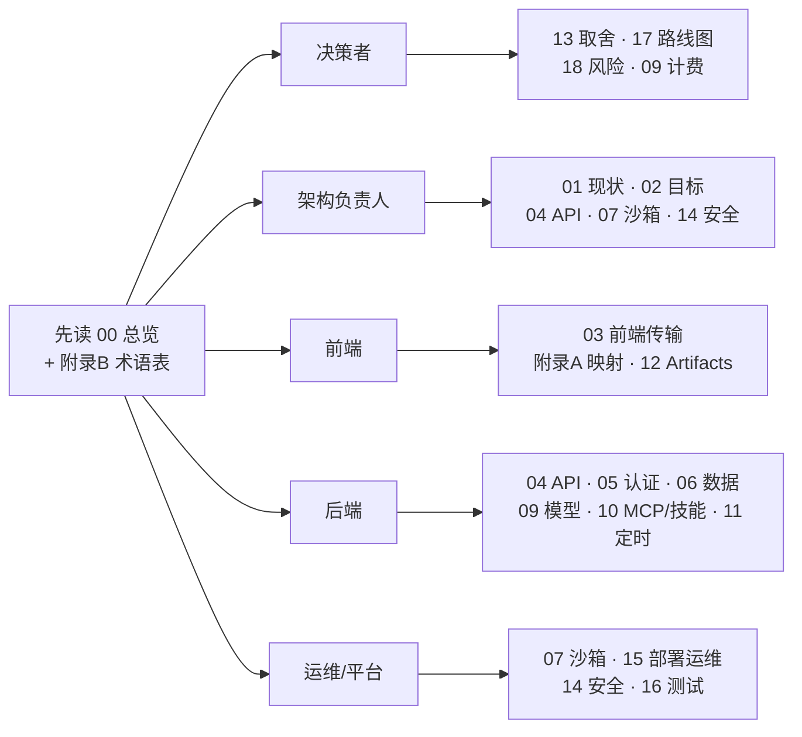

# 总览与执行摘要

> 本文档是整套「LobsterAI 桌面端 → 多租户 SaaS Web 应用」改造计划的入口与执行摘要，面向**决策者、架构负责人、以及需要快速建立全局认知的工程/运维骨干**。它回答四个问题：为什么做、做到什么程度、总体怎么做、投入多大代价与风险。技术细节请按文末「文档导航」下钻到对应分册。

---

## 1. 背景与目标

### 1.1 现状一句话

LobsterAI 是一款 **Electron + React 桌面应用**（版本 `2026.6.30`，见 `package.json`）。产品层称为 **Cowork**（会话/消息/权限/UI 状态/本地持久化），Agent 运行时称为 **OpenClaw**（本地 Node 网关进程）。当前它是**单机单用户**形态：

- 所有数据存在本机 SQLite 单文件（`src/main/sqliteStore.ts`，无 `tenant_id`、无 `user_id` 分区）。
- 渲染层通过唯一桥 `window.electron` 与主进程通信（`src/main/preload.ts:1-1068`，contextBridge 收口于 `src/renderer/services/*`）。
- Agent 能力依赖本地拉起的 OpenClaw 网关（`src/main/libs/openclawEngineManager.ts`，监听 `ws://127.0.0.1:{port}`，默认端口 `18789`）。
- 账号、模型代理、配额计费、HTML 分享、技能商店、更新等云能力挂在 youdao 云（`src/main/libs/endpoints.ts`，如 `https://lobsterai-server.youdao.com`）。

### 1.2 目标一句话

把 LobsterAI 改造为**公网可访问、多用户共享、按租户隔离的多租户 SaaS Web 应用**，几乎所有功能 Web 化，并**全部自建新后端**（不再依赖现有 youdao 云；账号、模型代理、计费、存储、分享全部重建）。

### 1.3 为什么这次改造是可行的（核心判断）

现有架构对 Web 化其实相当友好，主要有三点结构性红利：

| 结构特征 | 对 Web 化的意义 |
|---|---|
| 渲染层与主进程之间**只有一座桥** `window.electron` | 只要提供一个「同接口的浏览器桥」，前端几乎可以**原样复用** |
| OpenClaw 已经是**独立进程 + WebSocket 网关**（非进程内库） | 天然可服务化——把 loopback WS 换成远程 WS/服务网格即可 |
| 业务逻辑用 **TypeScript** 写在 `src/main/libs/*`、`src/main/*Store.ts` 等模块 | 后端沿用 Node.js + TypeScript，可**大量复用领域逻辑**而非重写 |

真正的难点不在「能不能」，而在**多租户运行时沙箱隔离**（见第 3 节与 `07-OpenClaw运行时编排与沙箱隔离.md`）。

---

## 2. 范围与非目标（v1）

### 2.1 v1 覆盖范围（做）

| 能力域 | 说明 | 对应文档 |
|---|---|---|
| 核心对话 / Agent | Cowork 会话、消息流式、多 Agent、权限交互、上下文用量/压缩 | `04`、`07` |
| Artifacts 与预览 | html/svg/image/video/mermaid/code/markdown/document 等 | `12` |
| Skills（技能/Kits） | 技能同步、安装/升级、安全扫描、启用态、路由提示 | `10` |
| MCP | stdio / sse / http 三种传输；stdio 需服务端沙箱 | `10` |
| 文件工作区读写 | 每租户/每会话工作区，读写 + 对象存储 | `08` |
| 定时任务 | 经后端 BullMQ 调度（沙箱内 OpenClaw cron 禁用）的调度与投递 | `11` |
| 认证 + 多租户账户 | OAuth2/OIDC + JWT，租户隔离 | `05` |
| 模型代理与计费 | 自建模型网关 + 配额/计费 | `09` |

### 2.2 非目标（本次不做 / 后续再做）

| 项 | 决策 | 理由 |
|---|---|---|
| IM 渠道（微信/飞书/钉钉/QQ/Telegram/Discord/邮件/NIM 等） | **后续** | 多为 OpenClaw connector 常驻连接（`src/main/im/imGatewayManager.ts`），多租户下的连接编排复杂，v1 不阻塞主线 |
| computer-use 桌面自动化（`src/main/computerUse/`） | **不做** | 依赖用户本机桌面（仅 Windows x64），SaaS 形态无宿主桌面 |
| VM / 后台浏览器自动化 | **不做** | 需要每会话常驻浏览器 VM，成本与隔离风险高，v1 不纳入 |

> 降级与取舍的完整清单（含被砍能力的替代/占位方案）见 `13-功能取舍与降级清单.md`。

---

## 3. 核心结论（决策者必读）

### 3.1 迁移最大杠杆 = 「同接口的浏览器桥」顶替 `window.electron`

- 现状：渲染层约 **446 处调用、约 74 个文件**通过 `window.electron` 走 IPC，收口在 `src/renderer/services/*`；请求走 `ipcRenderer.invoke`，流式走主进程 `webContents.send('cowork:stream:*')` + 渲染层 `ipcRenderer.on`。
- 结论：**不重写前端**。提供一个实现了同一套接口的浏览器桥：`invoke(channel, ...)` → REST(HTTP)；`on('...:stream:*')` → WebSocket 订阅。前端 UI/Redux/组件几乎零改动。
- 收益：把「重写整个前端」的巨大工作量，压缩为「实现一层适配桥 + 改造服务封装」。详见 `03-前端与传输层改造.md` 与 `附录A-IPC通道与接口映射.md`。

### 3.2 OpenClaw 已是 WS 网关，服务化友好

- 现状：OpenClaw 是独立 Node 进程（`utilityProcess.fork` / `spawn`，`src/main/libs/openclawEngineManager.ts:596-623`），监听 `ws://127.0.0.1:{port}`，token 鉴权，配置由 `openclawConfigSync.ts` 写入 `openclaw.json` + 工作区文件（`AGENTS.md`/`MEMORY.md` 等）。
- 结论：把「本机 loopback WS」升级为「云端服务网格内的 WS」，逻辑变化小；主要工作是**编排（谁在何处拉起、如何寻址）**与**隔离**，而非重写网关本身。

### 3.3 真正难点 = 多租户运行时沙箱隔离（最难一章）

- OpenClaw 网关会执行工具、读写文件工作区、跑 stdio MCP（本地 `npx` 子进程）、跑技能脚本——这些在 SaaS 下必须**强隔离**，否则一个租户可越权访问他人数据/资源。
- 方案基调：**Kubernetes，每用户/每会话一个沙箱 Pod** 跑 OpenClaw 网关，用 **gVisor/Kata** 加固，每租户 **PVC** 工作区；配额、生命周期、冷启动、驱逐策略是核心设计点。
- 这是全项目风险与成本的最大来源，详见 `07-OpenClaw运行时编排与沙箱隔离.md` 与 `14-安全合规与多租户隔离.md`。

---

## 4. 目标架构（一张图）

> 目标架构的分层职责、组件边界与技术选型理由，详见 `02-目标架构与技术选型.md`。

---

## 5. 分阶段路线图概览

每一行是一个阶段（里程碑）；**里程碑权威定义见 `17-分阶段路线图与工作量估算.md` §1.1，本表为概览**；详细任务分解、依赖与工作量估算亦见 17。

| 里程碑 | 名称 | 核心交付物 | 验收信号 |
|---|---|---|---|
| **M0** | 脚手架 + PoC 沙箱 | K8s 集群、Postgres、Redis、S3/MinIO、CI/CD、可观测栈 + 单 gVisor 沙箱 Pod PoC | 空壳环境可部署、健康检查通过；PoC 内一条 turn 经内网 WS 跑通、逃逸测试全拦截 |
| **M1** | 认证 + 数据层 + 最小对话 | OAuth2/OIDC 登录、JWT、租户模型、Postgres 多租户 schema、后端最小对话链路 | 多用户可登录、JWT 携带 `tenant_id`；核心表全带 `tenant_id`；后端可跑通一条 turn |
| **M2** | 前端桥 + 流式全通 | `window.electron` 同接口桥、REST/WS 网关、静态托管、`cowork:stream:*` 全通道 | 前端在浏览器中原样加载并调通对话；流式九类事件端到端有序、complete 必达 |
| **M3** | 数据迁移 | SQLite→Postgres 迁移工具、双校验、按租户灰度迁移 | 逐表行数/内容零差异，`tenant_id` 归属正确，回滚演练成功 |
| **M4** | 文件工作区 | 每租户 PVC + S3 工作区读写、Artifacts 存储与预览闭环 | 文件读写/预览/分享闭环；PVC/S3 按租户隔离无越权 |
| **M5** | 沙箱隔离加固（最难） | 每会话 Pod 编排、gVisor/Kata、NetworkPolicy、egress、预热池、Pod 级自愈 | 多租户并发、跨租户越权测试全绿；冷启达标、自愈无损 |
| **M6** | MCP / 技能 / 计费 | sse/http/stdio MCP 沙箱化、技能安全扫描、模型代理网关 + 配额/计费门控 | 三域功能在多租户下可用；计费准确、超额拦截生效 |
| **M7** | Artifacts / 定时任务 | Artifacts 预览体系（隔离化）、定时任务经后端 BullMQ 调度（沙箱内 OpenClaw cron 禁用） | 各预览类型隔离可用；定时任务经额度门控与后端调度、运行历史可查 |
| **M8** | 安全 / 多租户压测 | 越权/隔离测试、性能基线、混沌演练、合规基线 | 越权测试全绿；容量/延迟 SLA 达标；混沌自愈无损；合规基线签署 |
| **M9** | 上线灰度 | 蓝绿/金丝雀、按租户灰度放量、Runbook、on-call、GA | 满足 `16` 验收标准，可对外开放；一键回滚演练通过 |

---

## 6. Top 5 风险与应对

| # | 风险 | 影响 | 应对（详见分册） |
|---|---|---|---|
| **R1** | **多租户运行时隔离不足**：一个租户越权访问他人工作区/网络/资源 | 严重（数据泄露、安全事故） | 每租户/会话独立 Pod + gVisor/Kata + PVC + NetworkPolicy；跨租户越权用例纳入必过测试。见 `07`、`14` |
| **R2** | **沙箱冷启动与成本**：每会话拉 Pod 导致首字延迟高、资源费用失控 | 高（体验差 + 烧钱） | Pod 预热池/复用、按空闲驱逐、租户级配额与并发上限、冷/温/热三态。见 `07`、`15` |
| **R3** | **数据迁移正确性**：SQLite→Postgres 多租户，历史列名与无租户模型残留 | 高（数据错乱/串户） | 全表补 `tenant_id`、迁移脚本 + 双读校验、可选 RLS 兜底、灰度回滚。见 `06`、`05` |
| **R4** | **前端桥与流式契约漂移**：446 调用点中有隐藏的 Electron-only 假设或流式时序差异 | 中高（功能性 bug 隐蔽难查） | 以 `附录A` 为契约基线逐通道映射；Electron-only 通道（window/shell/dialog/clipboard/log）显式降级；契约测试覆盖 `cowork:stream:*` 与 `api:stream:*`。见 `03`、`附录A` |
| **R5** | **自建云能力交付超期**：账号/计费/分享/技能商店全部重建，范围大 | 中（进度风险） | 按里程碑切分、优先 v1 必需能力（对话/计费门控），非必需（技能商店 UI 等）延后；复用现有 TS 逻辑降低重写量。见 `09`、`17`、`18` |

> 完整风险登记册（含概率/影响评级、触发信号、责任人占位）见 `18-风险登记册.md`。

---

## 7. 工作量与周期粗估

> 以下为**区间级**粗估，用于决策与排期沟通，非承诺；精确分解见 `17-分阶段路线图与工作量估算.md`。假设团队具备 Node/TS + K8s 经验，且现有代码可复用。

| 维度 | 估算 |
|---|---|
| 总周期（到可对外灰度，M0–M9） | **约 6–9 个月** |
| MVP（M0–M4，单租户端到端跑通） | 约 2.5–3.5 个月 |
| 多租户隔离硬骨头（M5） | 约 1.5–2.5 个月（最大不确定性） |
| 人力总投入 | 约 **28–45 人月** |

**推荐团队规模（并行推进）：约 6–8 人**

| 角色 | 人数 | 主要负责 |
|---|---|---|
| 后端（Node/TS/NestJS） | 2–3 | Cowork/认证/模型代理/文件/定时任务服务 |
| 平台 / DevOps / K8s | 1–2 | 沙箱编排、gVisor/Kata、Helm、可观测（R1/R2 攻坚） |
| 前端 | 1 | 浏览器桥、传输适配、Electron-only 降级 |
| 数据 / 迁移 | 0.5–1 | Postgres 多租户 schema + 迁移（可与后端复用） |
| 安全 / QA | 1 | 多租户越权测试、合规、压测、验收 |

关键不确定性集中在 **M5（沙箱隔离）**：若团队 K8s/gVisor 经验不足，周期与人月应向区间上限取值。

---

## 8. 文档导航

本计划共 21 份文档（19 篇正文 + 2 篇附录）。建议按角色选读，交叉引用见各处「见 XX 文档」。

### 8.1 全部文档清单

| 编号 | 文档 | 内容一句话 |
|---|---|---|
| 00 | 总览与执行摘要 | 本文档：全局与决策入口 |
| 01 | 现状架构调研 | 桌面端现状深度调研（知己） |
| 02 | 目标架构与技术选型 | 目标形态、分层、选型理由 |
| 03 | 前端与传输层改造 | 浏览器桥、REST/WS、静态托管 |
| 04 | 后端服务与 API 设计 | 服务按域拆分与 API 契约 |
| 05 | 认证与多租户账户 | OAuth2/OIDC + JWT + 租户模型 |
| 06 | 数据模型迁移 | SQLite → Postgres 多租户 |
| 07 | OpenClaw 运行时编排与沙箱隔离 | 最难一章：每租户/会话 Pod 隔离 |
| 08 | 文件工作区与对象存储 | 工作区读写 + S3 兼容 |
| 09 | 模型代理与计费 | 自建模型网关 + 配额/计费 |
| 10 | MCP 与技能改造 | MCP 传输/沙箱化、Skills/Kits |
| 11 | 定时任务调度 | 经后端 BullMQ 调度（沙箱内 OpenClaw cron 禁用） |
| 12 | Artifacts 与预览改造 | 预览类型与隔离/沙箱化 |
| 13 | 功能取舍与降级清单 | 做/不做/降级的完整清单 |
| 14 | 安全合规与多租户隔离 | 隔离模型、合规、审计 |
| 15 | 部署运维与可观测性 | K8s/Helm、OTel/Prom/Grafana/Loki |
| 16 | 测试策略与验收标准 | 契约/集成/隔离/压测与验收 |
| 17 | 分阶段路线图与工作量估算 | 里程碑、任务分解、人月 |
| 18 | 风险登记册 | 全量风险与应对 |
| 附录 A | IPC 通道 → REST/WS 接口映射清单 | ~260 通道逐条映射基线 |
| 附录 B | 术语表与阅读指南 | 名词与阅读路径 |

### 8.2 按角色的阅读路径

| 角色 | 必读 | 建议扩展 |
|---|---|---|
| **决策者** | 00、13、17、18 | 09（成本相关）、02 |
| **架构负责人** | 00、01、02、04、07、14 | 全部（把关一致性） |
| **前端** | 00、03、附录 A、12 | 04（后端契约）、附录 B |
| **后端** | 00、04、05、06、09、10、11 | 07（运行时协作）、附录 A |
| **运维 / 平台** | 00、07、15、14、16 | 02、18 |

---

## 9. 一页纸速览（TL;DR）

- **做什么**：把单机桌面 LobsterAI 改成多租户 SaaS Web 应用，后端全部自建。
- **v1 范围**：认证多租户 + 模型代理与计费 + 对话/Agent/Artifacts/Skills/MCP + 文件工作区读写 + 定时任务；**不做** IM（后续）、computer-use、VM/后台浏览器。
- **最大杠杆**：用「同接口的浏览器桥」顶替 `window.electron`，前端近乎零改；OpenClaw 已是 WS 网关，服务化友好。
- **最大难点**：多租户运行时沙箱隔离（K8s + 每租户/会话 Pod + gVisor/Kata + PVC）。
- **技术栈**：React SPA + 浏览器桥 / REST + WS / NestJS(Node+TS) / Postgres+Prisma / Redis+BullMQ / S3(MinIO) / K8s / OIDC+JWT / OTel+Prometheus+Grafana+Loki / GitHub Actions+Helm。
- **代价**：约 6–9 个月、约 28–45 人月、6–8 人团队；风险集中在沙箱隔离与数据迁移。
