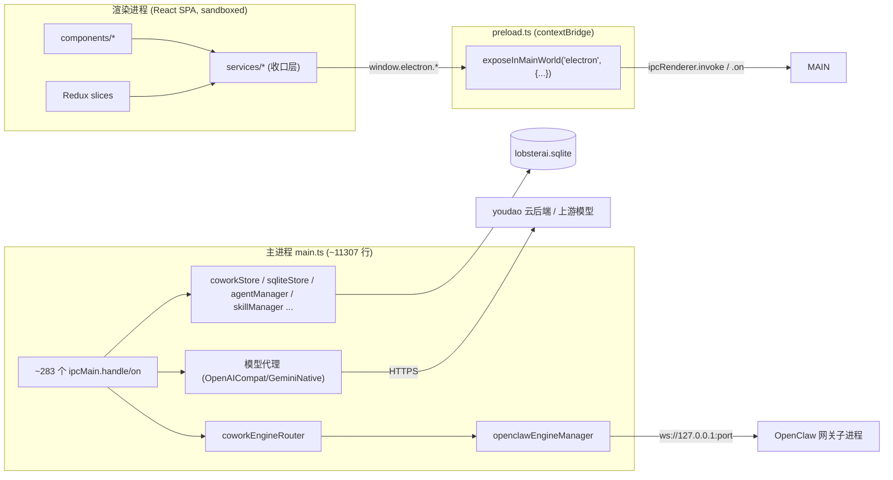
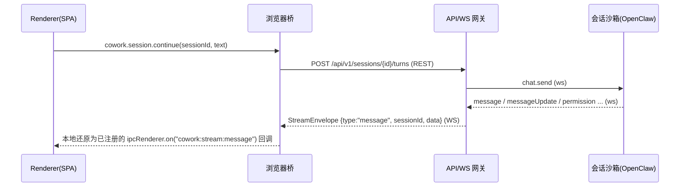

# 现状架构深度调研（知己）

> 本文档用途：在动手 SaaS 改造之前，先把 LobsterAI 当前桌面版的进程模型、IPC 面、流式机制、渲染层耦合、运行时/数据层、云后端依赖与认证方式彻底盘清楚，作为后续所有改造文档（02–19、附录 A/B/C）的事实基线；跨文档决策与源码订正以附录 C 为最终裁决层。
> 适合读者：负责整体架构评审的技术负责人，以及即将着手前端桥接（03）、后端 API 拆分（04）、认证多租户（05）、数据迁移（06）、运行时编排（07）的核心开发。
> 阅读方式：本文只做「知己」——描述现状、给出 `path:line` 依据、并给每个功能一个「可迁移性分级」结论。具体的目标形态与落地步骤请转到对应专题文档。

---

## 1. 一页纸速览

LobsterAI 是一个 **Electron + React** 桌面 AI Agent 应用。其架构可以用一句话概括：

> 一个巨型的 Electron **主进程**（`src/main/main.ts`，约 **11307** 行，全 `src/main` 约 **283** 个 IPC handler、其中 `main.ts` 内约 **217** 个）通过单一的 `window.electron` **preload 桥**为 React 渲染层提供全部能力；主进程内嵌一个 **OpenClaw 本地 Node 网关**（loopback WebSocket）作为 Agent 运行时，所有会话/消息/配置落在 **单机 SQLite 文件**，并依赖 **youdao 云后端**做登录、模型目录、配额计费、HTML 分享、技能商店与更新。

改造为多租户 SaaS 的三条主线也由此确定：

| 现状要素 | SaaS 化后的归宿 | 详见 |
| --- | --- | --- |
| `window.electron` preload 桥 | 浏览器桥（同接口，REST + WebSocket） | 03 |
| `src/main` 约 283 个 handler（`main.ts` 内约 217 个） | 后端服务（NestJS 按域拆分）+ REST/WS | 04、附录 A |
| SQLite 单机文件 | PostgreSQL + Prisma（`tenant_id` 隔离） | 06 |
| OpenClaw 本地网关 + fs 工作区 | K8s 每会话沙箱 Pod + PVC/对象存储 | 07、08 |
| youdao 云后端（登录/模型/计费/share/store/更新） | 全部自建新后端 | 05、09、10、12 |
| loopback OAuth（127.0.0.1 回调） | 标准 Web 重定向 OAuth2/OIDC | 05 |

---

## 2. 进程模型：main / preload / renderer

Electron 三层结构清晰，安全边界严格（`contextIsolation` 开、`nodeIntegration` 关、renderer 沙箱开）。renderer 与 main 之间**唯一**通道是 preload 用 `contextBridge` 暴露的 `window.electron`。



### 2.1 主进程职责（`src/main/main.ts`）

主进程是整个系统的「万能后端」，一个文件承载了绝大多数业务编排：

- **规模**：`src/main/main.ts` 约 **11307 行**（核对日期 2026-07-08；行号随代码漂移，引用现状请优先用符号名）。
- **IPC 表面**：`main.ts` 内 `ipcMain.handle` **211** + `ipcMain.on` **6** = **217** 个；全 `src/main` 合计 `handle` **277** + `on` **6** ≈ **283** 个（**无「259」口径**，见附录 C §2-B9）。其中 **42 个 `im:*` handler 全部内联在 `main.ts`**（并非分布在独立域模块），拆后端时须一并从 main.ts 抽出。
- **主→渲染推送**：`src/main` 内 `.send(` 调用点约 **51** 处；其中 `webContents.send` 约 **36** 处；去重后 renderer 事件通道约 **29** 个（引用须区分「调用点 / `webContents.send` / 去重通道」三种口径，见附录 C §2-B14）。
- 承载的职责域：Electron 生命周期与窗口、IPC 路由、认证与配额、日志、OpenClaw 启动/转发、Cowork 会话路由、IM 网关、定时任务、Skills/MCP、更新、Artifact 预览/分享、shell/dialog 桥。

> 这是**全仓最大的单文件**。根 `AGENTS.md` 明确禁止对大型遗留文件做机会主义式拆分。SaaS 改造时它天然按「域」被切成后端模块（见 04），拆分动作与迁移动作合并进行，避免为拆而拆。

关键子模块（主进程内被 `main.ts` 编排）：

| 模块 | 路径 | 职责 |
| --- | --- | --- |
| OpenClaw 网关管理 | `src/main/libs/openclawEngineManager.ts` | spawn/健康检查/端口/token/日志/重启 |
| 配置同步 | `src/main/libs/openclawConfigSync.ts` | 渲染 LobsterAI 状态 → `openclaw.json` + 工作区文件 |
| 运行时适配 | `src/main/libs/agentEngine/openclawRuntimeAdapter.ts` | 网关事件 ↔ Cowork 流事件 |
| 引擎路由 | `src/main/libs/agentEngine/coworkEngineRouter.ts` | Cowork 面运行时路由（当前仅 OpenClaw） |
| 会话/消息存储 | `src/main/coworkStore.ts` | 会话、消息、配置、agents、记忆元数据的 SQLite CRUD |
| DB 初始化/迁移 | `src/main/sqliteStore.ts` | 建表与 ad-hoc 迁移 |
| 模型代理 | `src/main/libs/coworkModelApi.ts`、`coworkOpenAICompatProxy.ts` | 上游模型请求 + 格式转换 |

### 2.2 preload 桥（`src/main/preload.ts`）

- 约 **1068 行**，单个 `contextBridge.exposeInMainWorld('electron', {...})`（`preload.ts` 的 `exposeInMainWorld` 调用，按符号定位，核对日期 2026-07-08）。
- 内部：**252** 处 `ipcRenderer.invoke`（请求/响应）+ **32** 处 `ipcRenderer.on`（订阅推送）。
- 结构：按域组织成嵌套对象，如 `electron.skills.list()` → `ipcRenderer.invoke('skills:list')`，`electron.store.get(key)` → `ipcRenderer.invoke('store:get', key)`（按符号定位，行号随代码漂移）。
- 这是**改造的关键切点**：只要用一个「同接口的浏览器桥」顶替 `window.electron`，renderer 代码几乎不动（详见 03、附录 A）。

### 2.3 渲染进程（React SPA）

- React + Redux Toolkit + Tailwind，`src/renderer/App.tsx`（约 1117 行）做顶层视图路由。
- **部分业务逻辑收口在 `src/renderer/services/*`**：`cowork.ts`、`auth.ts`、`api.ts`、`mcp.ts`、`skill.ts`、`kit.ts`、`im.ts`、`store.ts`、`config.ts`、`scheduledTask.ts` 等约 25 个服务文件承载了核心封装。
- 但组件层并未严格遵守“只调 services”：实测 components 直连 `window.electron` 的调用点已过半（见下节）。因此 SaaS 桥接的基础不是“先把组件全部收口”，而是 **1:1 实现完整 `window.electron` 全局表面**；service/platform 收口只能作为局部加固。

---

## 3. 渲染层耦合：`window.electron` 单一桥

这是判断「能否 web 化」最重要的一组数字：

| 指标 | 数量 | 来源 |
| --- | --- | --- |
| `window.electron` 调用处 | **481** | `rg -o "window\.electron" src/renderer`（2026-07-08） |
| 涉及文件数 | **72** | 同上 |
| components 直连 / services 收口 | **245 / 207**（组件直连过半） | `rg -o "window\.electron" src/renderer/{components,services}` |
| 收口服务文件（`electron.*` 直接使用者） | ~12 个核心 services | `rg "electron\." src/renderer/services` |

结论要点：

1. **调用并非全部经 services 收口**：实测 components 直连 `window.electron` **245** 处，已超过 services 的 **207** 处——**过半调用绕过 services**（见附录 C §2-A4）。因此不能假设「只改 services 层」即可，前端桥必须 **1:1 实现整个 `window.electron` 全局表面**，而不是仅替换 services。直接使用 `electron.*` 的核心 services 有十来个（`cowork.ts`、`auth.ts`、`api.ts`、`mcp.ts`、`skill.ts`、`kit.ts`、`im.ts`、`store.ts`、`i18n.ts`、`nimQrLogin.ts`、`logReporter.ts`、`voiceInput/realtimeAsrClient.ts` 等），但组件层的直连同样多。
2. 因此改造成本集中：**把 `window.electron` 的实现从「IPC 桥」换成「HTTP+WS 桥」**，只要保持全局表面同接口，核心对话链路的组件与 slice 可少改；但这只覆盖传输层替换，租户、工作区路径、计费、导入向导和 Electron-only 降级仍需按 `03`/`13` 显式改造。组件内直连 `window.electron` 的调用与 services 一样依赖该全局桥，不能遗漏（03 会给清单）。
3. 桥接层要同时覆盖两种语义：
   - **请求/响应**：`ipcRenderer.invoke(channel, ...args)` → REST（统一 `/api/v1/*`，动作型接口按附录 C §3.3 改为子资源 `POST`，不沿用冒号 action path）。
   - **订阅推送**：`ipcRenderer.on(channel, cb)` → WebSocket 消息路由到同名回调（见 §5）。

---

## 4. IPC 面：按域分类统计

主进程注册的 IPC 通道全 `src/main` 合计约 **283** 个（`main.ts` 内约 217 个，含 42 个内联 `im:*`；见附录 C §2-B9）。下表按域给出通道数量级与代表通道；完整「通道 → REST/WS 接口」映射见 **附录 A**。

| 域 | 通道数 | 代表通道 |
| --- | --- | --- |
| **cowork**（会话/消息/配置/记忆/权限） | 30+ | `cowork:session:{start,continue,stop,delete,get,list,rename,pin,fork,remoteManaged}`、`cowork:session:contextUsage`、`cowork:session:compactContext`、`cowork:config:{get,set}`、`cowork:memory:*`、`cowork:dreaming:*`、`cowork:bootstrap:*`、`cowork:permission:respond`、`cowork:media:cancel` |
| **agent** | 8 | `agents:{list,get,create,update,delete,presets,presetTemplates,addPreset}` |
| **config** | 6 | `store:{get,set,remove}`、`cowork:config:{get,set}`、`enterprise:getConfig` |
| **artifact** | 7 | `artifact:{watchFile,unwatchFile,createPreviewSession,createOfficePreviewSession,destroyPreviewSession}`、`artifact:browser:{clearCookies,clearCache}` |
| **file+dialog** | 12 | `dialog:{selectDirectory,selectFile,selectFiles,saveInlineFile,readFileAsDataUrl,statFile,readTextFile,generateThumbnail,showMessageBox}`、`get-recent-cwds` |
| **model+api** | 10 | `auth:{getModels,getProfileSummary,getQuota}`、`get-api-config`、`check-api-config`、`save-api-config`、`generate-session-title`、`api:stream`、`api:stream:cancel` |
| **mcp** | 8 | `mcp:{list,create,update,delete,setEnabled,retryLaunchResolution,fetchMarketplace,changed}` |
| **skills** | 13 | `skills:{list,setEnabled,delete,download,upgrade,confirmInstall,getRoot,autoRoutingPrompt,getConfig,setConfig,testEmailConnectivity,fetchMarketplace,detectFromOpenClaw,syncFromOpenClaw,refreshPluginSkillIds}` |
| **kits** | 4 | `kits:{fetchStore,install,uninstall,listInstalled}` |
| **im** | 50+ | `im:config:{get,set,sync}`、`im:gateway:{start,stop}`、`im:status:get`、`im:{weixin,popo,qq,dingtalk,feishu,wecom,telegram,discord,email,nim}:*`、`im:{platform}:instance:{add,delete,config:set}`、`im:pairing:*` |
| **scheduledTask** | 15 | `scheduledTask:{list,get,create,update,delete,toggle,runManually,stop,listRuns,countRuns,listAllRuns,resolveSession,listChannels,listChannelConversations}` |
| **auth** | 9+ | `auth:{login,logout,getUser,getQuota,refreshToken,getAccessToken,exchange}`、`auth:callback`、`auth:getPricingCatalog` |
| **store** | 3 | `store:{get,set,remove}` |
| **plugins** | 8+ | `plugins:{list,detect,sync,install,uninstall,setEnabled,getConfigSchema,saveConfig,checkUpdates,update}` |
| **window** | 5 | `window-{minimize,maximize,close}`、`window:isMaximized`、`window:showSystemMenu` |
| **shell** | 6 | `shell:{openPath,showItemInFolder,openExternal,openHtmlInBrowser,getAppsForFile,openPathWithApp}` |
| **log** | 4 | `log:{getPath,openFolder,exportZip,fromRenderer}` |
| **asr**（语音） | 1 | `asr:realtime:createSession` |
| **permissions**（系统权限） | 2 | `permissions:{checkCalendar,requestCalendar}` |
| **enterprise** | 1 | `enterprise:getConfig` |
| **htmlShare** | 10 | `htmlShare:{createFromHtmlFile,updateFromHtmlFile,getByHtmlFile,createFromArtifactFile,updateFromArtifactFile,getByArtifactFile,updateStatus,updateAccessMode,disable,get}` |
| **browser**（OpenClaw 浏览器） | 4 | `openclaw:browser:{getStatus,listProfiles,test,resetProfile}` |
| **localWebServices** | 1 | `localWebServices:list` |
| **clipboard** | 3 | `clipboard:{writeText,writeImageFromFile,writeImageFromDataUrl}` |
| **appSettings** | 4 | `app:{getAutoLaunch,setAutoLaunch,getPreventSleep,setPreventSleep}` |
| **appUpdate** | 6 | `appUpdate:{getState,checkNow,retryDownload,cancelDownload,installReady,stateChanged}` |
| **appInfo** | 3 | `app:{getVersion,getSystemLocale,relaunch}` |
| **openclaw**（引擎/迁移） | 11 | `openclaw:{engine:{getStatus,install,retryInstall,restartGateway,repairGatewayState},session:patch,dataMigration:{backup,restore},sessionPolicy:{get,set}}` |
| **media** | 2 | `media:{getModels,getTaskStatus}` |
| **copilot / codex**（第三方 OAuth） | 9 | `github-copilot:{request-device-code,poll-for-token,cancel-polling,sign-out,refresh-token}`、`openai-codex-oauth:{start,cancel,logout,status}` |
| **feishu/dingtalk 安装** | 6 | `feishu:install:{qrcode,poll,verify}`、`dingtalk:install:{qrcode,poll,verify}` |

> 说明：以上通道名多来自根 `AGENTS.md` 的「字符串常量」约定与 `src/shared/*/constants.ts`，部分仍是散落字面量。附录 A 会逐条给出映射与幂等/权限要求。

---

## 5. 流式机制：`webContents.send('cowork:stream:*')` + `ipcRenderer.on`

请求/响应走 `invoke`；**流式**（token 流、状态变化、权限请求等）走「主进程 push → 渲染层订阅」。

### 5.1 Cowork 流事件（核心，10 个）

主进程在 `runtime.on(...)` 回调里对所有窗口 `webContents.send(...)`，事件枚举如下（均在 `src/main/main.ts` 的 runtime→IPC 转发块，按通道常量定位；行号随代码漂移，核对日期 2026-07-08）。原文漏列 `cowork:stream:goal`（`CoworkIpcChannel.StreamGoal`），已补齐为 **10 个**；目标态契约的完整穷举以 `libs/shared/contracts` / 附录 C §3.2 为准（见附录 C §2-B13）：

| 事件（IPC 通道） | 负载 | 语义 |
| --- | --- | --- |
| `cowork:stream:message` | `{ sessionId, message, beforeMessageId? }` | 新消息（user/assistant/tool） |
| `cowork:stream:messageUpdate` | `{ sessionId, messageId, content, metadata? }` | 消息内容增量更新 |
| `cowork:stream:sessionStatus` | `{ sessionId, status }` | running/idle/error |
| `cowork:stream:contextUsage` | `{ sessionId, usage }` | token/上下文用量（runtime 事件真名 `contextUsageUpdate`） |
| `cowork:stream:contextMaintenance` | `{ sessionId, active }` | 上下文压缩进行中 |
| `cowork:stream:permission` | `{ sessionId, request }` | 工具权限请求 |
| `cowork:stream:goal` **（原漏）** | `{ sessionId, goal }` | 会话目标更新（`CoworkIpcChannel.StreamGoal`） |
| `cowork:stream:complete` | `{ sessionId, claudeSessionId }` | 会话回合结束 |
| `cowork:stream:error` | `{ sessionId, error }` | 运行时错误 |
| `cowork:stream:permissionDismiss` | `{ requestId }` | 撤销一个待响应权限请求 |

> 注意该 runtime→IPC 转发块对内容做了 IPC 截断（`truncateIpcString`）、权限对象做了脱敏（`sanitizePermissionRequestForIpc`）。SaaS 化后这些处理要保留到 WS 网关层。

### 5.2 模型 API 流事件（参数化，基于 `requestId`）

模型代理走另一套「参数化通道」，每个并发请求独立管道：

```
api:stream:${requestId}:data    # 流数据块
api:stream:${requestId}:done    # 完成
api:stream:${requestId}:error   # 错误
api:stream:${requestId}:abort   # 取消
api:stream:cancel               # renderer→main 请求取消
```

### 5.3 其它 push 事件（非会话流）

全仓 `send('...')` 的通道去重后如下（会话流之外的部分）：

`artifact:file:changed`、`auth:quotaChanged`、`im:message:received`、`im:status:change`、`skills:changed`、`mcp:changed`、`window:state-changed`、`app:newTask`、`app:openSettings`、`github-copilot:token-updated`、`scheduledTask:{statusUpdate,runUpdate,refresh}`、`plugins:install-log`、`openclaw:engine:onProgress`、`cowork:sessions:changed`、`cowork:media:statusPollUpdate`、`cowork:session:openFromNotification`。

### 5.4 SaaS 传输映射（概念）



关键点：**所有 `cowork:stream:*` / `api:stream:*` 要经由 tenant/session scoped 鉴权的 WebSocket 分发**，wire 层使用 `StreamEnvelope.type`，旧 IPC channel 只作为浏览器桥本地 topic；且需要 Redis 做多副本广播（同一用户多标签页/多副本网关）。详见 03、04、07。

---

## 6. OpenClaw 运行时机制（概述）

Agent 运行时不是云服务，而是**主进程内嵌的本地 Node 网关子进程**：

- **启动**：`src/main/libs/openclawEngineManager.ts` 用 `utilityProcess.fork`（macOS/Linux）或 `spawn + ELECTRON_RUN_AS_NODE`（Windows）拉起网关，命令形如 `gateway --bind loopback --port {port} --token {token}`。
- **传输**：`getGatewayConnectionInfo()` 返回 `ws://127.0.0.1:${port}`（按符号定位，核对日期 2026-07-08），token 鉴权。RPC 真名为 `chat.send / chat.abort / chat.history` 与 `sessions.list / patch / compact / goal / delete`（**`session.start/continue/delete/history` 均不存在**）；寻址单元是 `sessionKey`，1 个 `sessionId` 对应多个 sessionKey（`getSessionKeysForSession()` 返回数组），LobsterAI 侧 `continueSession` 是对 `chat.send` 的封装（见附录 C D6）。
- **状态目录**：`{userData}/openclaw/state/`，含 `gateway-token`、`gateway-port.json`、`openclaw.json`。
- **文件工作区**：`workspace-main/`（主 agent）与 `workspace-{agentId}/`（非主 agent），内含 `AGENTS.md`、`MEMORY.md`、`SOUL.md`、`IDENTITY.md`、`memory/YYYY-MM-DD.md` 等。
- **配置同步**：`src/main/libs/openclawConfigSync.ts` 把 LobsterAI 的 providers/models、agents、plugins、`mcp.servers`、channels、cron 渲染进 `openclaw.json` 并写工作区文件。
- **事件适配**：`openclawRuntimeAdapter.ts` / runtime forwarder 把网关的 `message/messageUpdate/sessionStatus/contextUsageUpdate/goalUpdate/contextMaintenance/permissionRequest/complete/error` 以及权限撤销类事件翻译为 §5.1 的 **10 个** Cowork 流事件；`permissionDismiss` 的旧桥 payload 只有 `{ requestId }`，SaaS `StreamEnvelope` 顶层必须补 `tenantId/sessionId`（见 `07` §1.3、附录 C §3.2/D7）。`chat.send` 的应用层拦截线是安全线常量 `OPENCLAW_CHAT_SEND_PAYLOAD_SAFE_LIMIT_BYTES`；`30MB`（`30*1000*1000`，十进制）是 WS 帧硬限，超限触发 close 1009（见附录 C §2-B15）。

> **这是整个 SaaS 改造最难的部分**：本地单实例 loopback 网关 + 本地文件工作区，要变成 K8s 每会话沙箱 Pod（gVisor/Kata）+ 每租户 PVC/对象存储、按租户隔离的 ws 鉴权、可回收/可迁移的会话生命周期。**完整机制与编排方案见 07 文档**，工作区/对象存储见 08。

---

## 7. 数据层：SQLite 单机文件

数据落在 Electron `userData/lobsterai.sqlite`，由 `src/main/sqliteStore.ts` 建表（多为 ad-hoc `PRAGMA table_info()` 迁移）。**全部表无 `tenant_id`/`user_id` 分区**——这是天生单用户设计，也是 06 文档要解决的核心。

**16 张活跃业务表**（另有历史遗留/迁移期表不计入，见下），来源：主库 `src/main/sqliteStore.ts` 13 张 + IM `src/main/im/imStore.ts` 2 张 + meta `src/scheduledTask/metaStore.ts` 1 张。一行一表：

| 表 | 目的 |
| --- | --- |
| `kv` | 全局 JSON 键值（app 配置/认证标志/`app_config` 等） |
| `cowork_sessions` | 本地会话记录（含历史列名 `claude_session_id`、fork 字段、`cwd`、`agent_id`） |
| `cowork_messages` | 会话消息（`type`、`content`、`metadata`、`sequence` 双排序） |
| `cowork_session_capsules` | 连续性/上下文胶囊（fork 与压缩用） |
| `cowork_config` | Cowork 设置（工作目录、执行模式、记忆/dreaming/embedding 等） |
| `agents` | 自定义/预设 agent（system_prompt、model、skill_ids、per-agent 工作目录、启用/置顶） |
| `user_memories` | 用户记忆（SHA-1 指纹去重、显式/隐式、状态） |
| `user_memory_sources` | 记忆溯源（memory→session/message 关系） |
| `mcp_servers` | MCP 服务器配置（`transport_type` stdio/sse/http、`config_json`） |
| `mcp_launch_resolutions` | MCP 启动决议（resolver 类型、命令、args、env、探针） |
| `user_plugins` | 用户安装的 OpenClaw 插件（source、spec、version、enabled、config） |
| `subagent_runs` | 子 agent 运行跟踪 |
| `subagent_messages` | 子 agent 会话历史 |
| `im_config` | IM 平台配置（`src/main/im/imStore.ts`） |
| `im_session_mappings` | IM 会话 ↔ Cowork/OpenClaw 会话映射（agent_id、session key，`src/main/im/imStore.ts`） |
| `scheduled_task_meta` | OpenClaw cron 任务的本地来源/绑定元数据（`src/scheduledTask/metaStore.ts`） |

> **历史遗留/迁移期表与测试表（当前建表 schema 不含，不计入活跃表）**：`scheduled_tasks`、`scheduled_task_runs` 只出现在迁移逻辑中（实际定时任务定义与运行历史现状由 OpenClaw cron 管理，SaaS 目标口径见 **11**）；`cowork_user_memories` **仅出现在 `coworkStore.test.ts`，是测试表**——生产只建 `user_memories` / `user_memory_sources`，附录 B / 13 §2.1 勿为该不存在的表写迁移（见附录 C §2-C17）。迁移期表处置与判定依据见 **附录 B**。

> 迁移策略、多租户改写、RLS/Prisma schema 见 **06 文档**；定时任务调度的现状/目标口径见 **06/11**。

---

## 8. 已有云后端能力（youdao）——本次「全部自建」的重建清单

当前应用**并非纯本地**，它强依赖一套 youdao 云后端。切换测试/生产由 `app_config.app.testMode` 决定（`src/main/libs/endpoints.ts:12-23`）。这些能力在 SaaS 版**必须全部自建**：

| 能力 | 当前端点/函数（`src/main/libs/endpoints.ts`） | 自建归宿 |
| --- | --- | --- |
| 服务端 API 基址 | `getServerApiBaseUrl()` → `lobsterai-server[.inner].youdao.com`（`endpoints.ts:29`） | 新后端网关（04） |
| 登录 token 交换/刷新 | `auth:exchange`、`auth:refreshToken`（走上面基址） | 认证服务（05） |
| 模型目录 | `auth:getModels` / `loadServerModels` | 模型代理服务（09） |
| 配额与计费 | `auth:getQuota`、`getPricingCatalog`（`src/main/authQuota.ts`） | 计费服务（09） |
| HTML 分享 | `getHtmlSharePublicBaseUrl()`（`endpoints.ts:35`）+ `htmlShare:*` | Artifact 分享服务（12） |
| 技能商店 | `getSkillStoreUrl()`（`endpoints.ts:57`） | Skill/Kit store（10） |
| Kit 商店 | `getKitStoreUrl()`（`endpoints.ts:71`） | 同上（10） |
| 更新检查 | `getUpdateCheckUrl()`（`endpoints.ts:39`）、`getFallbackDownloadUrl()` | SaaS 无需（Web 自动最新）（13） |
| 用户 Portal | `getPortalTasksUrl()`（`endpoints.ts:69`） | 新账户中心（05） |

> 结论：`endpoints.ts` 的每个 `getXxxUrl()` 都是一处云依赖，SaaS 版要么由新后端提供等价 API，要么随功能取舍下线（更新检查在 Web 下天然消失，见 13）。

---

## 9. 认证现状：loopback OAuth（127.0.0.1 回调）

桌面版登录采用**回环地址 OAuth**：

- 主进程起一个本地 HTTP 服务器监听 `127.0.0.1`（`authLocalCallbackServer.ts`），回调路径 `/auth/callback`。
- 生成 CSRF `state`（`crypto.randomBytes(24).toString('base64url')`），校验 `return_to` 仅允许 youdao/localhost/127.0.0.1（均在 `authLocalCallbackServer.ts`，按符号定位，核对日期 2026-07-08）。
- 同时支持 deep link 协议回调 `auth://auth/callback?code=...`（`authCallbackRouter.ts`），并缓存 pending code 直到 renderer 就绪。
- renderer 侧监听 `electron.auth.onCallback`，登录后监听 `auth:quotaChanged` 刷新配额（`src/renderer/services/auth.ts`）。
- **token 不存 renderer `localStorage`**：由主进程 `saveAuthTokens` 写入 SQLite `kv` 表（`getStore().set('auth_tokens', ...)`，**明文**），renderer 经 IPC 按需取；renderer 侧无 `localStorage`。**真实风险点是 `kv` 表明文存储**（并非「XSS 读 localStorage」这一形态，「删 localStorage 代码」并不存在），SaaS 化后须改为服务端会话 / 加密存储（见附录 C §2-A1、05）。

```mermaid
sequenceDiagram
  participant App as Electron App
  participant Loop as 127.0.0.1 回调server
  participant IDP as youdao 授权
  App->>Loop: 起本地 server + 生成 state
  App->>IDP: 打开系统浏览器授权
  IDP-->>Loop: GET /auth/callback?code&state
  Loop->>App: 校验 state → 换 token → 刷新配额
```

> SaaS 化后这套要改成**标准 Web 重定向 OAuth2/OIDC**：登录由 SPA fetch 取 `{ code }` 后自行跳转、`code` 再换 token（PKCE、绑定 `redirect_uri`+CSRF state），刷新走 `HttpOnly` cookie 承载的 refresh token（带 grace window + family 版本）；回调是后端公网 URL 而非 127.0.0.1。认证主流程已拍死，见附录 C D11；多租户账户模型见 **05 文档**。

---

## 10. 模型代理与本地服务（现状要点）

- **模型请求经主进程代理**：`api:stream`（IPC）→ `src/main/libs/coworkModelApi.ts` / `coworkOpenAICompatProxy.ts`。协议支持 Anthropic 与 GeminiNative，并做 OpenAI↔Anthropic 消息与工具调用状态机转换，Gemini 特殊 schema 清洗。
- **OpenAI 兼容代理监听 loopback**：`coworkOpenAICompatProxy` 起 `127.0.0.1:proxy_port` 供 OpenClaw/沙箱回连，带 DNS rebinding 防护（Host 头仅允许回环）。
- **HTML 预览 = 本地 http server**：`src/main/libs/htmlPreviewServer.ts` 起 `127.0.0.1` 服务器，按 `sessionId` 隔离 + token 校验（按符号定位，核对日期 2026-07-08），提供 html/pptx/图片/视频 MIME。
- **computer-use / 后台浏览器**：`src/main/computerUse/`（Windows x64 桌面自动化）与 OpenClaw 浏览器 profile。**本次不做**（见 13）。

---

## 11. 功能清单与可迁移性分级

对每个功能给出结论：**W = Web 可直接移植**（改桥即可）、**S = 需服务端沙箱/后端重建**、**D = 降级或不做**。

| 功能域 | 现状实现 | 分级 | 原因 / 处置 | 详见 |
| --- | --- | --- | --- | --- |
| 核心对话 / 会话管理 | `cowork:*` + 流事件 | **W→S** | 前端改桥即可（W）；但会话执行体（OpenClaw）需服务端沙箱（S） | 03、07 |
| Agent 管理 | `agents:*` + `agents` 表 | **W/S** | CRUD 可移植；per-agent 工作区落沙箱 | 04、07 |
| Artifacts 展示 | `artifactParser.ts` | **W** | 纯前端解析，直接移植 | 12 |
| Artifact HTML/office 预览 | 本地 http server | **S** | 本地 server 换成后端预览服务 + 对象存储 | 12 |
| HTML 分享 | `htmlShare:*` + youdao | **S** | 重建分享后端（公链 + token） | 12 |
| Skills（技能） | `skills:*` + fs 扫描 + youdao store | **S** | 安全扫描/安装/store 全部后端化；执行落沙箱 | 10 |
| Kits | `kits:*` + youdao store | **S** | 同 Skills | 10 |
| MCP（sse/http） | `mcp:*` 远程传输 | **W/S** | 远程 MCP 后端可直连 | 10 |
| MCP（stdio） | 本地 `npx` 子进程 | **S** | 必须在沙箱内起子进程 | 10 |
| 文件工作区读写 | fs（cwd/workspace） | **S** | 每租户 PVC + 对象存储 | 08 |
| 定时任务 | `scheduledTask:*` + OpenClaw cron | **S** | 后端调度（BullMQ/cron）+ 会话唤醒 | 11 |
| 模型代理/计费 | `api:stream` + youdao | **S** | 自建模型网关 + 计量计费 | 09 |
| 认证/账户 | loopback OAuth + youdao | **S** | 标准 Web OAuth2/OIDC + 多租户 | 05 |
| 配额展示 | `auth:getQuota` | **S** | 新计费服务 | 09 |
| 记忆 / dreaming | `user_memories` + MEMORY.md | **S** | 落沙箱工作区 + Postgres | 06、07 |
| IM 渠道 | `im:*` + OpenClaw connectors | **D（后续）** | 常驻长连接，GA 主线不做 | 13 |
| computer-use 桌面自动化 | `src/main/computerUse/` | **D（不做）** | 需操控用户桌面，SaaS 无意义 | 13 |
| VM / 后台浏览器 profile | OpenClaw browser | **D（不做）** | 资源/安全成本高 | 13 |
| 应用更新 | `appUpdate:*` + youdao | **D（不做）** | Web 天然最新 | 13 |
| 窗口控制 | `window-*` | **D（不做）** | 无原生窗口 | 13 |
| 系统 shell/dialog | `shell:*`、`dialog:*` | **D（改造）** | 换成 Web 文件上传/下载 + 只读链接 | 03、08 |
| 剪贴板 | `clipboard:*` | **W（降级）** | 浏览器 Clipboard API | 03 |
| 本地日志文件访问 | `log:*` | **D** | 换成后端结构化日志（Loki） | 15 |
| 系统权限（日历） | `permissions:*` | **D（不做）** | 无桌面权限概念 | 13 |
| 语音输入 ASR | `asr:realtime:createSession` | **W/S** | 后端 ASR 代理，浏览器采音 | 13 |
| 第三方 OAuth（Copilot/Codex） | device-code / oauth | **D（GA 后续）** | 后端代持凭据，非 GA 主线、GA 后续再建（与 README/00/09/13 统一口径，见附录 C §2-C20） | 13 |
| 开机自启/防休眠 | `app:setAutoLaunch` 等 | **D（不做）** | 无桌面进程 | 13 |

> 概览：**核心链路（对话/Agent/Artifacts/Skills/MCP/文件工作区/定时任务）全部落在 W 或 S**，V1-V6 GA 主线可覆盖；D 类要么后续（IM、第三方 OAuth 代持）、要么明确不做（computer-use/VM/更新/窗口/系统权限）。完整取舍与降级方案见 **13 文档**。

---

## 12. 构建打包现状 —— 能否作为纯 SPA 构建？

- **渲染层构建**：Vite（`package.json` 中 `"dev": "vite"`、`"build": "tsc && vite build"`，`package.json:74-76`），产物是标准 React SPA 静态资源。
- **主进程构建**：单独的 `compile:electron`（TS → `dist-electron/main.js`，`package.json:69` 指定 `"main"`）。
- **打包分发**：electron-builder（`dist:mac/win/linux`），并绑定 OpenClaw 运行时（`vendor/openclaw-runtime/`、打包进 `Resources/cfmind`）。
- **OpenClaw 版本固定**：`package.json` 的 `openclaw` 段（`version: v2026.6.1` + 插件清单，`package.json:10-68`）。

**结论：渲染层能作为纯 SPA 构建。** Vite 已产出与 Electron 无关的静态 bundle；SPA 化的唯一硬依赖是运行时的 `window.electron` 全局。因此改造路径明确：

1. 保留现有 Vite React 构建，静态托管 + CDN。
2. 提供一个**与 `window.electron` 同接口的浏览器桥**（REST + WS 实现），在应用启动早期注入 `window.electron`。
3. 主进程/electron-builder 相关脚本在 SaaS 版被后端服务（NestJS）与 K8s/Helm 部署替代；OpenClaw 运行时从「打包进 app」变为「沙箱镜像」。

前端/传输层的具体改造步骤（桥 API 契约、WS 复用 `on()` 语义、鉴权注入）见 **03 文档**；后端服务拆分见 **04**；部署见 **15**。

---

## 13. 对后续文档的交接要点

| 你要做的事 | 现状关键事实 | 去哪份文档 |
| --- | --- | --- |
| 顶替 `window.electron` | 481 调用 / 72 文件；components 直连 245 > services 207（过半绕过 services，须 1:1 实现全局表面）；252 invoke + 32 on | 03、附录 A |
| 拆后端 | `src/main` 约 283 handler（main.ts 内约 217，含 42 内联 `im:*`），按域聚合 | 04、附录 A |
| 建账户体系 | loopback OAuth + youdao；无多租户列 | 05 |
| 迁数据 | 16 张活跃业务表（无 tenant_id；另有历史遗留/迁移期表不计入） | 06 |
| 编排运行时 | 本地 loopback ws 网关 + fs 工作区 | 07 |
| 存文件 | cwd/workspace/预览 server 全本地 fs | 08 |
| 代理/计费 | `api:stream` + youdao quota | 09 |
| 改 Skills/MCP | fs 扫描 + youdao store + stdio 子进程 | 10 |
| 调度定时任务 | `scheduledTask:*` + OpenClaw cron | 11 |
| Artifacts/预览 | 本地 http server + youdao share | 12 |
| 取舍降级 | IM/computer-use/VM/更新/窗口 | 13 |

---

*（术语解释见 附录 B；IPC→接口逐条映射见 附录 A。）*
