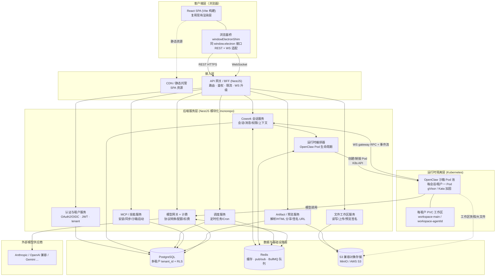
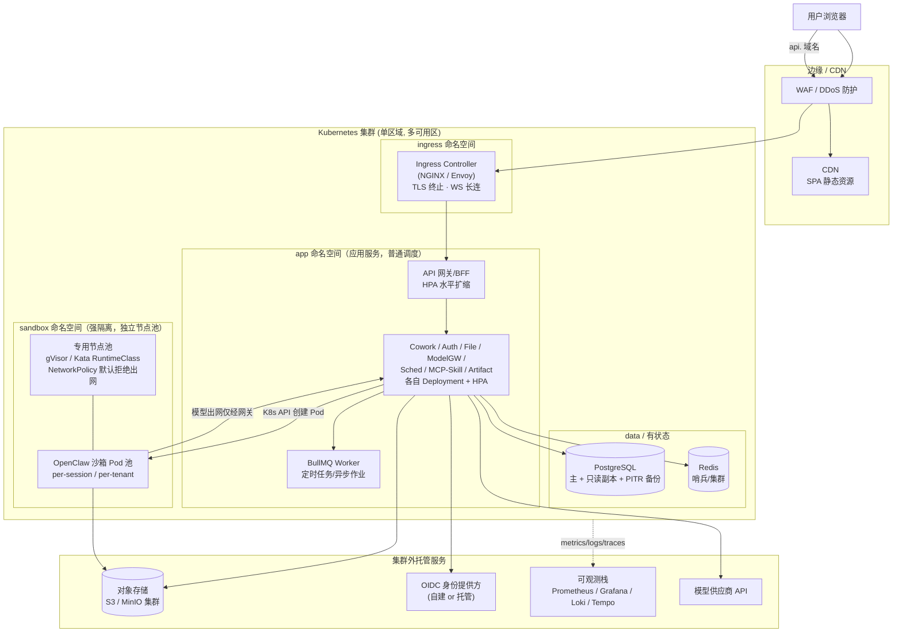
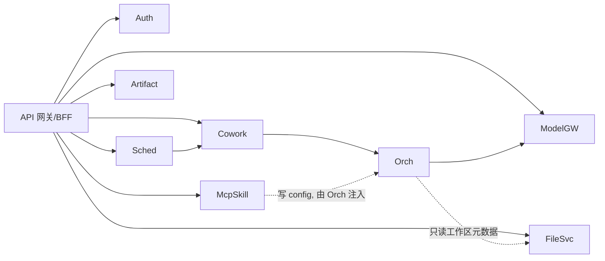
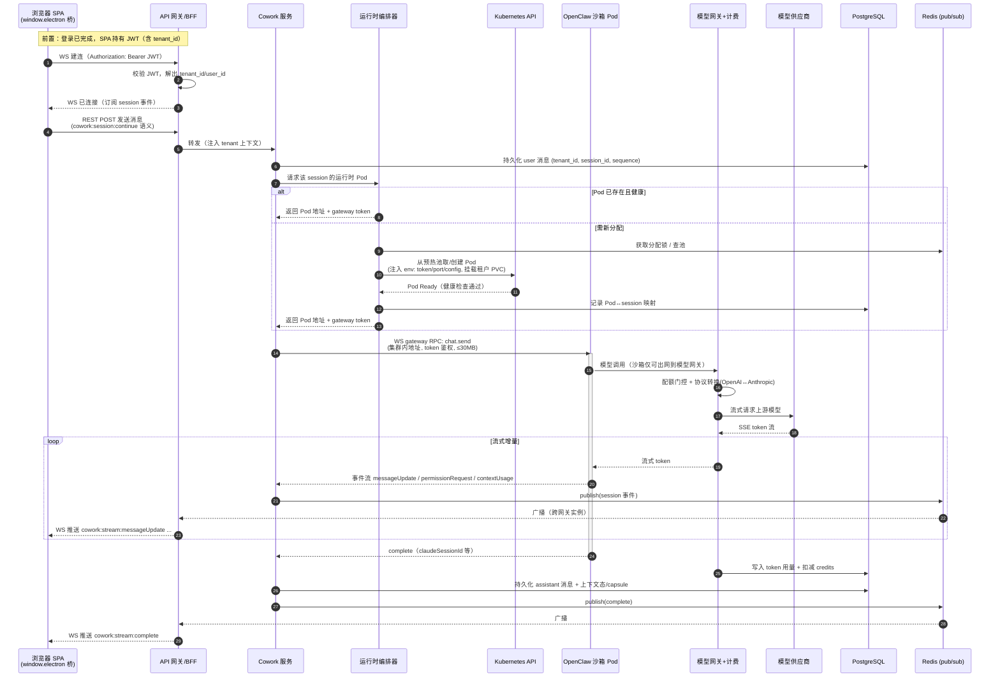

# 目标架构与技术选型

> 本文档定义 LobsterAI 从「单机 Electron 桌面应用」改造为「多租户 SaaS Web 应用」后的**目标架构蓝图与技术选型**，是整个改造计划的技术总纲。适合读者：架构师、后端/前端/平台工程 lead、SRE/运维、以及需要评审技术决策的技术负责人。阅读本文前建议先看 `00-总览与执行摘要.md`；本文只给「目标形态 + 为什么」，各模块的详细改造步骤见 `03`~`16` 各章。

---

## 0. 文档定位与约束边界

本文档只回答三个问题：

1. **目标架构长什么样**（组件、边界、部署拓扑）。
2. **每一层选什么技术、为什么、备选是什么**。
3. **一次典型请求/对话如何在新架构中流动**。

它**不**回答具体迁移步骤（见各专题章）。所有选型必须与本改造计划共享的推荐技术栈一致，不得另选。已定关键决策（本文的硬约束）：

| 维度 | 决策 | 说明 |
|---|---|---|
| 部署形态 | 多租户 SaaS | 公网、多用户共享云端、按 `tenant_id` 隔离 |
| 后端归属 | 全部自建 | 不依赖现有 `*.youdao.com` 云；账号/模型代理/计费/存储/更新全部重建 |
| v1 范围 | 核心对话/Agent/Artifacts/Skills/MCP + 文件工作区读写 + 定时任务 | 见 `13-功能取舍与降级清单.md` |
| 后续/不做 | IM 渠道（后续）、computer-use 桌面自动化（不做）、VM/后台浏览器（不做） | 见 `13`、`14` |

> 现状认知（「知己」）见 `01-现状架构调研.md`。本文只在需要对比「现状 → 目标」时引用现状事实。

---

## 1. 目标架构总览

### 1.1 一句话架构

> 浏览器里的 **React SPA**（复用现有代码，靠「浏览器桥」顶替 `window.electron`）通过 **REST + WebSocket** 访问一组按域拆分的 **NestJS 后端服务**；后端把原来跑在用户机器上的 **OpenClaw gateway** 迁移到 **Kubernetes 上按会话/租户隔离的沙箱 Pod 池** 里运行；状态从单机 SQLite/文件系统迁移到 **PostgreSQL + Redis + S3 兼容对象存储**。

现状与目标的核心映射（详细见后文各章）：

| 现状（单机 Electron） | 目标（多租户 SaaS） | 详见 |
|---|---|---|
| 渲染层↔主进程唯一桥 `window.electron`（`src/main/preload.ts:45` contextBridge，~446 调用处/~74 文件） | 浏览器桥（同接口）→ REST/WS | `03`、附录A |
| 请求 `ipcRenderer.invoke` / 流式 `webContents.send('cowork:stream:*')` | REST(HTTP) / WebSocket | `03`、附录A |
| `src/main/main.ts`（~10560 行，259 个 `ipcMain.handle/on`，47 处 `send`） | 拆成 8+ 个后端服务模块 | `04` |
| 本地 OpenClaw gateway（`src/main/libs/openclawEngineManager.ts`，`ws://127.0.0.1:{port}` `openclawEngineManager.ts:344`，本地 state dir + 工作区） | K8s 沙箱 Pod 池（每会话/租户一个 Pod，gVisor/Kata 加固，租户 PVC 工作区） | `07`、`08` |
| 单机 SQLite（`src/main/sqliteStore.ts`，16 张活跃业务表（另有历史遗留/迁移期表不计入），无 `tenant_id`） | PostgreSQL + Prisma（`tenant_id` + 可选 RLS） | `06` |
| 云后端 `lobsterai-server.youdao.com`（`src/main/libs/endpoints.ts:31`）：登录/模型目录/配额计费/HTML share/skill store/更新 | 自建认证/模型网关/计费/Artifact/技能商店服务 | `05`、`09`、`12` |
| 登录 = OAuth loopback（`127.0.0.1` 回调，`src/main/libs/authLocalCallbackServer.ts`） | 标准 web 重定向 OAuth2/OIDC + JWT | `05` |
| 模型 API 经 main 代理（`api:stream`、`src/main/libs/coworkOpenAICompatProxy.ts`） | 模型网关服务（统一鉴权/计费/协议转换） | `09` |

### 1.2 总体架构组件图

### 1.3 与现状的关键差异（架构层面）

1. **进程边界变网络边界**：现状 IPC（同机进程内调用）→ 目标 REST/WS（跨网络、需鉴权、需超时/重试/幂等）。
2. **单例变多租户**：现状「一个用户、一个 SQLite、一个本地 gateway」→ 目标「N 租户、共享 PG、Pod 池」。每一条数据、每一个 Pod、每一个对象存储路径都必须带 `tenant_id`。
3. **本地文件系统假设被打破**：OpenClaw 现在**深度耦合** `userData` 目录（token/port/config/工作区/logs 全在本地磁盘）。目标要把这套「本地文件契约」映射到「PVC + 对象存储 + 配置注入」，这是最难的一章（`07`、`08`）。
4. **本地服务改为签名 URL**：现状 HTML 预览是本地 http server（`src/main/libs/htmlPreviewServer.ts`）；目标改为对象存储 + 短时签名 URL / 隔离预览服务（`12`）。

---

## 2. 部署拓扑

### 2.1 部署拓扑图（生产单区域）

### 2.2 命名空间与节点池划分

| 命名空间 | 内容 | 调度/隔离策略 |
|---|---|---|
| `ingress` | Ingress Controller、证书 | 边缘节点，公网入口 |
| `app` | 全部无状态后端服务 + BullMQ worker | 普通节点池，HPA 弹性伸缩 |
| `sandbox` | OpenClaw 沙箱 Pod 池 | **专用节点池** + gVisor/Kata `RuntimeClass`；`NetworkPolicy` 默认拒绝出网，仅放行到模型网关；不可访问 `app`/`data` 内部服务。详见 `07`、`14` |
| `data` | PostgreSQL、Redis（若自托管） | 有状态，反亲和 + 持久卷 |

> 沙箱 Pod 与应用服务**物理隔离到不同节点池**，是多租户安全的核心（`14-安全合规与多租户隔离.md`）。沙箱内运行的是不完全可信的 Agent 代码（用户可能诱导 Agent 执行任意命令），必须假设它会被攻破。

---

## 3. 服务职责边界

按域拆分为 8 个后端服务 + 1 个接入层。**一服务一行**，说明职责、对应现状代码、上游依赖、状态归属、扩展模型。

| 服务 | 核心职责 | 对应现状代码 | 主要依赖 | 状态归属 | 扩展模型 |
|---|---|---|---|---|---|
| **API 网关 / BFF** | HTTP 路由、WS 升级与广播、JWT 校验、限流、请求聚合、把 `window.electron` 语义映射到后端调用 | `src/main/preload.ts:45` contextBridge；`src/main/main.ts` 259 个 `ipcMain.handle/on` | Auth（校验 token）、Redis（WS 广播/限流计数） | 无状态 | HPA 水平扩缩；WS 连接经 Redis pub/sub 跨实例广播 |
| **认证与租户服务** | OAuth2/OIDC 登录（web 重定向）、JWT 签发/刷新、租户与用户/成员管理、RBAC | `authLocalCallbackServer.ts`、`authCallbackRouter.ts`、`src/renderer/services/auth.ts`、`auth:*` IPC | PG（`tenants`/`users`）、IdP、Redis（会话/刷新令牌） | PG | 无状态，可多副本 |
| **Cowork 会话服务** | 会话/消息 CRUD、权限请求流转、上下文用量/压缩、fork/capsule、把用户消息转发给运行时并广播回流事件 | `coworkStore.ts`、`coworkEngineRouter.ts`（`coworkEngineRouter.ts:21`）、`cowork:*` IPC/`cowork:stream:*` send | Orch（拿 Pod 地址）、PG、Redis、沙箱 Pod（WS RPC） | PG（会话/消息） | 无状态服务层；会话状态在 PG，实时态在 Redis |
| **运行时编排器** | OpenClaw 沙箱 Pod 生命周期（创建/健康检查/回收）、端口/token/config 注入、Pod↔会话映射、扩缩容与配额 | `openclawEngineManager.ts`（spawn→改为 K8s API）、`openclawConfigSync.ts`（config 生成） | K8s API、PG（Pod↔session 映射）、Redis（分配锁/池状态）、对象存储（工作区） | PG + Redis | 池化：预热 Pod、按需分配、空闲回收（详见 `07`） |
| **文件工作区服务** | 工作区文件树/读写、上传/下载、生成对象存储签名 URL、路径校验（防越权/穿越） | `dialog:*`、`artifact:watchFile`、`src/main/coworkStore.ts` 工作区路径 | S3、PG（文件元数据）、PVC（沙箱侧挂载） | S3 + PG | 无状态；大文件直传对象存储 |
| **模型网关 + 计费** | 上游模型供应商代理、协议转换（OpenAI↔Anthropic、Gemini schema 清洗）、流式转发、按 token/credits 计量与扣费、配额门控 | `coworkModelApi.ts`、`coworkOpenAICompatProxy.ts`、`api:stream`、`authQuota.ts` | 模型供应商、PG（用量/账单）、Redis（配额计数/限速） | PG + Redis | 无状态；供应商密钥集中托管在服务端（详见 `09`） |
| **调度服务** | 定时任务 CRUD、Cron/every/at 触发、投递、运行历史 | `src/scheduledTask/cronJobService.ts`、`scheduledTask:*` IPC、`scheduled_task_*` 表 | Redis + BullMQ（触发）、PG（任务/历史）、Cowork（发起 Agent turn） | PG | BullMQ 分布式调度，worker 可扩（详见 `11`） |
| **MCP / 技能服务** | MCP 服务器配置与启动解析、技能/Kit 安装/同步/安全扫描、写入 OpenClaw config | `src/main/mcp/*`、`skillManager.ts`、`mcp:*`/`skills:*`/`kits:*` IPC | PG、对象存储（技能包）、沙箱（stdio MCP 子进程） | PG + S3 | stdio MCP 需在沙箱内起子进程；sse/http MCP 远程直连（详见 `10`） |
| **Artifact / 预览服务** | Artifact 解析、HTML/文档预览、HTML 分享公开链接、预览沙箱/签名 URL | `artifactParser.ts`、`htmlPreviewServer.ts`、`htmlShare:*` IPC | S3、PG（分享记录）、隔离预览域 | S3 + PG | 预览在独立沙箱域名，签名 URL 时效控制（详见 `12`） |

> 落地建议：以上服务放在**一个 NestJS monorepo**（`apps/gateway`、`apps/cowork`、`apps/orchestrator`…）中，共享 `libs/`（复用现有 `src/shared/*` 与从 `src/main/libs/*` 抽取的纯 TS 业务逻辑）。v1 可先合并为「网关 + 单体应用」，随负载再拆分独立部署单元——服务边界先定清楚，物理拆分可延后。拆分粒度与 API 契约见 `04-后端服务与API设计.md`。

### 3.1 服务间依赖（避免环）

依赖方向原则：**网关 → 域服务 → 编排器/数据层**，禁止域服务反向依赖网关；编排器是唯一直接操作 K8s 的服务；模型出网统一收敛到模型网关（沙箱 Pod 不允许直连公网模型 API）。

---

## 4. 技术选型逐项

每项给出 **推荐方案 / 为什么 / 备选 / 取舍**。所有推荐与本改造计划共享推荐栈严格一致。

### 4.1 前端

| 项 | 内容 |
|---|---|
| **推荐** | 复用现有 React SPA（React + Redux Toolkit + Tailwind），Vite 构建，产物静态托管 + CDN。新增一个与 `window.electron` **同接口**的「浏览器桥」`windowElectronShim`，在 SPA 启动时注入 `window.electron`。 |
| **为什么** | 渲染层有 ~446 处 `window.electron` 调用、~74 个文件，且已收口于 `src/renderer/services/*`。用「同接口桥顶替」可让绝大多数业务组件**零改动**，改造集中在桥这一层。Vite 已是现有构建工具，无需换。 |
| **备选** | ① 逐个改写 service 层直接 fetch（工作量大、易漏）；② 换 Next.js SSR（收益低、迁移成本高，SPA 已够用）。 |
| **取舍** | 桥必须精确复刻 IPC 语义（`invoke` 的请求/响应、`on` 的事件订阅、流式事件命名如 `cowork:stream:*`）。Electron-only 通道（`window-*`、`shell:*`、`dialog:*`、`clipboard:*`、本地 `log:*`）在桥里降级为浏览器等价实现或 no-op（详见 `03`、`13`、附录A）。 |

### 4.2 传输层

| 项 | 内容 |
|---|---|
| **推荐** | **REST(HTTP)** 用于请求/响应（对应现状 `ipcRenderer.invoke`）；**WebSocket** 用于流式（对应 `cowork:stream:*`、`api:stream:${requestId}:*`、`scheduledTask:*` 等 send 事件）。 |
| **为什么** | 现状是「invoke=请求响应 + send=服务端推送」的清晰二分，天然映射到 REST + WS。对话/权限/上下文用量是**服务端主动多次推送**，WS 双向长连最贴合；一次性请求用 REST 简单、可缓存、易观测。 |
| **备选** | ① 全部走 SSE（单向推送足够，但对话中还有客户端取消/权限响应等上行，需另开通道，不如 WS 统一）；② gRPC-Web（浏览器支持与调试成本高，收益不明显）。 |
| **取舍** | WS 需处理：跨网关实例广播（经 Redis pub/sub）、断线重连与事件补发、`requestId` 参数化流的多路复用、鉴权（连接时 JWT + 订阅时 `tenant_id`/`sessionId` 授权校验）。`chat.send` 现有 30MB 硬限（`openclawRuntimeAdapter.ts:123`），大 payload 走对象存储引用而非 WS 帧。 |

### 4.3 后端框架

| 项 | 内容 |
|---|---|
| **推荐** | **Node.js + TypeScript**，框架 **NestJS**（模块化、DI、契合按域拆分）。 |
| **为什么** | 现有业务逻辑全是 TS（`coworkStore`、`openclawConfigSync`、`artifactParser`、mcp/skill 等），用 Node 后端可**直接复用**这些纯逻辑模块，避免用其它语言重写。NestJS 的 module/provider 模型天然对应「按域拆服务」，内置 WS gateway、拦截器（鉴权/多租户上下文）、管道（校验），团队协作和分层清晰。 |
| **备选** | **Fastify**（更轻量、吞吐更高，但需自建模块化/DI 约定；作为编排器等对性能敏感、逻辑相对简单的服务的备选）。 |
| **取舍** | NestJS 抽象层略重、启动稍慢，但换来一致的工程结构。约定：把可复用纯逻辑放 `libs/`，不要把 Electron-only API（如 `electron-log`）带进后端（现有测试也遵循此规避，见项目测试约定）。 |

### 4.4 数据库

| 项 | 内容 |
|---|---|
| **推荐** | **PostgreSQL + Prisma**，多租户以 `tenant_id` 列隔离，敏感表可选启用 **RLS（Row Level Security）** 作为纵深防御。 |
| **为什么** | 现状 16 张活跃业务表（另有历史遗留/迁移期表不计入）（`cowork_sessions`/`cowork_messages`/`agents`/`mcp_servers`…，见 `src/main/sqliteStore.ts`）都是关系型结构，映射到 PG 直接自然。Prisma 提供类型安全 schema、迁移工具（替代现状 `PRAGMA table_info()` 的 ad-hoc 迁移）、良好 TS 集成。PG 支持 JSONB（承接现状 `metadata`/`config_json` 等 JSON 列）、全文/向量扩展（承接记忆/embedding）、RLS。 |
| **备选** | ① MySQL/MariaDB（JSON/RLS 生态弱于 PG）；② 每租户独立 schema/库（隔离更强但运维复杂、连接数爆炸，适合超大租户，非 v1 默认）。 |
| **取舍** | 共享库 + `tenant_id` 是 v1 默认（成本低、弹性好）；RLS 增加一层「即使代码漏加 `where tenant_id` 也不越权」的保险，但需在连接上设置 `SET app.tenant_id` 且注意连接池复用下的会话变量清理。迁移映射（SQLite→PG，含 `claude_session_id` 等历史列名）见 `06-数据模型迁移.md`。 |

### 4.5 缓存 / 队列 / 流式广播

| 项 | 内容 |
|---|---|
| **推荐** | **Redis**，承担三职：① 缓存（配额计数、会话热态、限流令牌桶）；② **pub/sub** 跨网关实例广播 WS 事件；③ **BullMQ** 任务队列（定时任务触发、异步作业如工作区快照/技能安装）。 |
| **为什么** | WS 在多实例网关下必须有共享广播总线，Redis pub/sub 是标准解。定时任务（现状 `cronJobService`）在 SaaS 下需分布式可靠调度，BullMQ（基于 Redis）提供延迟任务、重试、并发控制、可观测。配额/限速需要低延迟原子计数，Redis 原生支持。 |
| **备选** | ① 广播用 NATS/Kafka（吞吐更强但运维更重，v1 过度设计）；② 队列用独立 RabbitMQ/云队列（多一套组件，BullMQ 已够）。 |
| **取舍** | Redis 单点风险 → 用哨兵/集群；pub/sub 无持久化 → 关键事件（如权限请求）在 PG/Redis Stream 留痕以便断线补发（见 `03`、`11`）。 |

### 4.6 对象存储

| 项 | 内容 |
|---|---|
| **推荐** | **S3 兼容对象存储**：自托管用 **MinIO**，云上用 **AWS S3**（或等价）。存放：工作区大文件/快照、Artifact 产物、技能/Kit 包、HTML 分享内容、上传附件。 |
| **为什么** | 现状文件都在本地 `userData`；SaaS 下必须外置到可横向扩展、多副本、带生命周期策略的存储。S3 兼容协议让「本地 MinIO 开发 / 云 S3 生产」代码一致。签名 URL 支持浏览器直传/直下，避免大文件穿过后端。 |
| **备选** | 直接用云厂商专有对象存储 SDK（锁定厂商，放弃 MinIO 本地开发一致性）。 |
| **取舍** | 对象存储 key 必须带 `tenant_id` 前缀并配桶策略/IAM 做租户隔离；PVC 与对象存储的分工（热工作区在 PVC、冷/共享/产物在 S3）见 `08-文件工作区与对象存储.md`。 |

### 4.7 运行时隔离（最关键）

| 项 | 内容 |
|---|---|
| **推荐** | **Kubernetes**；每用户/每会话一个**沙箱 Pod** 跑 OpenClaw gateway，用 **gVisor 或 Kata Containers** 做内核级加固；每租户一个 **PVC** 作为工作区。 |
| **为什么** | 现状 gateway 是本地 spawn/utilityProcess（`openclawEngineManager.ts` 的 `doStartGateway`），直接访问本地文件系统与网络。SaaS 下多租户共享节点，Agent 会执行不完全可信的命令（用户可诱导），**必须假设沙箱会被攻破**。K8s 提供 Pod 编排/扩缩/网络策略；gVisor/Kata 提供比普通容器更强的内核隔离，阻断容器逃逸；PVC 隔离每租户文件。 |
| **备选** | ① 普通容器 + seccomp/AppArmor（隔离弱于 gVisor/Kata，成本低，可作过渡）；② Firecracker microVM（隔离最强但集成/冷启动成本高）；③ 共享进程多会话（**禁止**，破坏隔离）。 |
| **取舍** | 每会话一 Pod 隔离最强但资源开销大、冷启动慢 → 用**预热 Pod 池 + 空闲回收**平衡（见 `07`）。需把现状「本地文件契约」（token 文件、port 文件、`openclaw.json`、`workspace-*`）映射为「注入的 env/挂载卷 + PVC」，并把 gateway 连接从 `ws://127.0.0.1:{port}` 改为集群内经编排器发现的 Pod 地址（现状连接信息见 `openclawEngineManager.ts:344`）。这是全计划最难的一章，见 `07-OpenClaw运行时编排与沙箱隔离.md`。 |

### 4.8 鉴权

| 项 | 内容 |
|---|---|
| **推荐** | **OAuth2 / OIDC + JWT**，标准 web 重定向流（授权码 + PKCE）。 |
| **为什么** | 现状是 OAuth loopback（`127.0.0.1` 回调，`authLocalCallbackServer.ts`），这是桌面应用特有形态，web 化后天然回归标准重定向流。JWT 携带 `tenant_id`/`user_id`/角色，供网关无状态校验并注入多租户上下文；OIDC 便于对接自建或托管 IdP、支持企业 SSO。 |
| **备选** | 纯 session cookie（服务端有状态，横向扩展需共享 session store；JWT 更适合多服务）。 |
| **取舍** | JWT 撤销困难 → 用短时 access token + 刷新令牌轮换 + Redis 黑名单/刷新令牌存储。所有请求（REST 头 + WS 连接时）都要校验并解出 `tenant_id`，作为后续 DB/存储/Pod 隔离的根据。详见 `05-认证与多租户账户.md`、`14`。 |

### 4.9 可观测性

| 项 | 内容 |
|---|---|
| **推荐** | **OpenTelemetry**（trace/metric/log 统一埋点）→ **Prometheus**（指标）+ **Grafana**（面板/告警）+ **Loki**（日志）+ Tempo/Jaeger（分布式追踪）。 |
| **为什么** | 现状日志是 `electron-log` 本地文件（`src/main/logger.ts`），SaaS 下需集中式、可查询、带 `tenant_id`/`session_id`/`trace_id` 关联的可观测。OTel 是厂商中立标准，一次埋点多后端可用；对话链路跨「网关→Cowork→编排器→Pod→模型网关」，分布式追踪对定位延迟/失败至关重要。 |
| **备选** | 商业 APM（Datadog 等，功能强但成本高、锁定）；ELK（替代 Loki，重）。 |
| **取舍** | 全链路追踪有采样/成本权衡；日志必须结构化并带租户维度（用于计费核对与安全审计，见 `14`、`15`）。落地细节见 `15-部署运维与可观测性.md`。 |

### 4.10 CI/CD

| 项 | 内容 |
|---|---|
| **推荐** | **GitHub Actions**（构建/测试/镜像/发布流水线）+ **Helm**（K8s 部署编排）。 |
| **为什么** | 仓库已在 GitHub、CI 已用 GitHub Actions（现状 `npm test` = Vitest）。Helm 用 values 管理 dev/staging/prod 差异，配合各服务的 Deployment/HPA/NetworkPolicy/RuntimeClass 模板，一套 chart 多环境部署。 |
| **备选** | Argo CD（GitOps 声明式部署，更现代，可作后续演进）；Kustomize（替代 Helm 模板，轻但功能少）。 |
| **取舍** | v1 用 Helm + Actions 推送即可；镜像分层构建（后端 monorepo 各服务共享基础层），OpenClaw 运行时镜像单独构建并 pin 版本（现状 pin `v2026.6.1`，见 `package.json` `openclaw.version`）。详见 `15`。 |

### 4.11 选型总表（速查）

| 层 | 推荐 | 关键备选 |
|---|---|---|
| 前端 | React SPA + Vite + `window.electron` 浏览器桥 | Next.js SSR |
| 传输 | REST + WebSocket | SSE / gRPC-Web |
| 后端框架 | NestJS (Node + TS) | Fastify |
| 数据库 | PostgreSQL + Prisma（`tenant_id` + 可选 RLS） | MySQL / 每租户独立 schema |
| 缓存/队列/广播 | Redis（+ BullMQ + pub/sub） | NATS/Kafka / RabbitMQ |
| 对象存储 | S3 兼容（MinIO / AWS S3） | 云厂商专有存储 |
| 运行时隔离 | K8s + 每会话 Pod + gVisor/Kata + 每租户 PVC | 普通容器+seccomp / Firecracker |
| 鉴权 | OAuth2/OIDC + JWT（web 重定向） | Session cookie |
| 可观测 | OpenTelemetry + Prometheus/Grafana/Loki | Datadog / ELK |
| CI/CD | GitHub Actions + Helm | Argo CD / Kustomize |

---

## 5. 数据流：一次对话的端到端时序

下图展示用户在浏览器发一条消息，到 Agent 流式回复的完整链路，覆盖鉴权、Pod 分配、WS 流式回传、模型出网收敛。

关键点说明：

1. **鉴权前置**：WS 建连即校验 JWT 并锁定 `tenant_id`；后续所有操作在该租户上下文内进行（`05`、`14`）。
2. **Pod 按需分配 + 池化**：编排器优先从预热池取 Pod，miss 才创建；Pod↔session 映射持久化，续聊直接复用（`07`）。
3. **模型出网收敛**：沙箱 Pod 的 `NetworkPolicy` 只放行到模型网关，Pod **不能**直连模型供应商公网——保证密钥集中托管、计费准确、防数据外泄（`09`、`14`）。
4. **跨实例广播**：Cowork 把事件 publish 到 Redis，任意网关实例上的该用户 WS 连接都能收到——支撑网关水平扩展（`03`）。
5. **计费闭环**：模型网关在流结束写入 token 用量并扣 credits；配额门控在调用前拦截超额（`09`）。

---

## 6. 环境划分与扩展思路

### 6.1 dev / staging / prod

| 维度 | dev | staging | prod |
|---|---|---|---|
| 目标 | 本地/共享开发，快速迭代 | 预生产验收，贴近 prod | 对外服务 |
| K8s | 本地 kind/minikube 或共享 dev 集群 | 独立集群/命名空间 | 独立集群，多可用区 |
| 沙箱隔离 | 可用普通容器（降级，加速开发） | gVisor/Kata（与 prod 一致） | gVisor/Kata（强制） |
| PostgreSQL | 单实例（Docker） | 主+副本，日备份 | 主+只读副本，PITR，跨 AZ |
| 对象存储 | 本地 MinIO | MinIO 集群 / 云 S3 | 云 S3 / MinIO 集群，多副本 |
| Redis | 单实例 | 哨兵 | 集群/哨兵 |
| 模型供应商 | mock / 小额真实 key | 真实 key（限额） | 生产 key，配额与计费开启 |
| 域名 | `*.dev.local` | `staging.<domain>` | `<domain>` |
| 配置管理 | Helm values-dev | values-staging | values-prod（Secret 经 Vault/K8s Secret） |
| 可观测 | 本地/轻量 | 全栈（低采样） | 全栈 + 告警 + on-call |

配置差异全部由 Helm values 驱动，代码不含环境分支（对比现状用 `app.testMode` 切 `*.inner.youdao.com`/`*.youdao.com` 的做法 `src/main/libs/endpoints.ts:31`，新架构改为环境化配置注入，见 `05`、`15`）。

### 6.2 扩展与多区域思路

- **无状态服务水平扩展**：网关、Cowork、模型网关等按 CPU/QPS/WS 连接数 HPA 扩缩；WS 广播经 Redis pub/sub 解耦实例。
- **沙箱池弹性**：编排器维护预热 Pod 数量，按活跃会话趋势预扩容；空闲 Pod 定时回收，控制成本（`07`）。
- **数据层扩展**：PG 先读写分离（读走副本）；单库压力大时按 `tenant_id` 分片或迁大租户到独立 schema/库；对象存储天然水平扩展。
- **多区域（后续演进）**：
  - 就近接入：CDN + 多区域 Ingress，用户路由到最近区域。
  - 数据主权/合规：按租户归属区域放置数据（`14` 合规），跨区仅同步必要元数据。
  - 沙箱本地化：Pod 在用户所在区域调度，避免跨区高延迟与出境数据问题。
  - v1 单区域多可用区起步，多区域作为规模化后的演进项，不在 v1 范围。

---

## 7. 落地顺序与交叉引用

本文只定「目标形态」。各层的**现状→目标→步骤→接口→验收→风险**在专题章展开，建议按依赖顺序推进：

| 主题 | 文档 |
|---|---|
| 现状架构深度调研 | `01-现状架构调研.md` |
| 前端浏览器桥 + REST/WS 传输 | `03-前端与传输层改造.md` |
| 后端服务拆分与 API 契约 | `04-后端服务与API设计.md` |
| 认证与多租户账户 | `05-认证与多租户账户.md` |
| SQLite → Postgres 多租户迁移 | `06-数据模型迁移.md` |
| OpenClaw 运行时编排与沙箱隔离（最难） | `07-OpenClaw运行时编排与沙箱隔离.md` |
| 文件工作区与对象存储 | `08-文件工作区与对象存储.md` |
| 模型代理与计费 | `09-模型代理与计费.md` |
| MCP 与技能改造 | `10-MCP与技能改造.md` |
| 定时任务调度 | `11-定时任务调度.md` |
| Artifacts 与预览 | `12-Artifacts与预览改造.md` |
| 功能取舍与降级 | `13-功能取舍与降级清单.md` |
| 安全合规与多租户隔离 | `14-安全合规与多租户隔离.md` |
| 部署运维与可观测 | `15-部署运维与可观测性.md` |
| 测试与验收 | `16-测试策略与验收标准.md` |
| 路线图与工作量 | `17-分阶段路线图与工作量估算.md` |
| 风险登记册 | `18-风险登记册.md` |
| IPC → REST/WS 接口映射清单 | `附录A-IPC通道与接口映射.md` |
| 术语表与阅读指南 | `附录B-术语表与阅读指南.md` |

---

## 8. 目标架构验收标准（架构级）

本文档层面的「做对了」判据（各模块细化验收在专题章）：

1. **接口零改动可跑**：SPA 通过浏览器桥能完成登录/对话/查看 Artifacts，业务组件不因传输层改造而大规模改写。
2. **多租户隔离可证**：任意 API/WS/存储/Pod 操作都能追溯到 `tenant_id`；跨租户访问在 DB（`tenant_id`/RLS）、存储（key 前缀/策略）、Pod（命名空间/NetworkPolicy）三层均被拒。
3. **沙箱隔离达标**：沙箱 Pod 无法访问 `app`/`data` 内部服务，只能出网到模型网关；容器逃逸有 gVisor/Kata 兜底（`14`)。
4. **流式端到端通**：对话的 `messageUpdate`/`permissionRequest`/`contextUsage`/`complete` 事件在多网关实例下都能正确送达对应浏览器。
5. **计费闭环**：每次模型调用产生可核对的 token 用量与 credits 扣减，配额门控生效。
6. **环境一致**：dev/staging/prod 同一套 Helm chart + 差异化 values 部署，无代码内环境分支。
7. **可观测可定位**：一次对话的跨服务链路可用 `trace_id` 串起，日志/指标带 `tenant_id`。

---

## 9. 架构级风险速览

（完整风险登记见 `18-风险登记册.md`；此处仅列与「目标架构选型」直接相关者）

| 风险 | 影响 | 缓解 | 详见 |
|---|---|---|---|
| OpenClaw 本地文件契约难以云化 | 运行时无法正常启动/工作区错乱 | 精确映射 env 注入 + PVC 挂载 + 对象存储；先做单会话 PoC | `07`、`08` |
| 沙箱逃逸 / 跨租户数据泄漏 | 严重安全事故 | gVisor/Kata + NetworkPolicy 默认拒绝 + 专用节点池 + RLS | `07`、`14` |
| WS 多实例广播丢事件 | 对话卡住/权限请求丢失 | Redis pub/sub + 关键事件持久化补发 + 断线重连 | `03` |
| 每会话一 Pod 成本/冷启动 | 体验差 / 成本高 | 预热池 + 空闲回收 + 资源配额 | `07`、`15` |
| 模型密钥集中托管被滥用 | 计费失控 | 出网收敛到模型网关 + 配额门控 + 用量审计 | `09`、`14` |
| 复用现有 TS 逻辑夹带 Electron 依赖 | 后端无法运行 | 抽 `libs/` 纯逻辑，剥离 `electron-*` 依赖 | `04` |

---

> 小结：目标架构 = **复用前端 + 同接口浏览器桥** 抹平传输层差异；**NestJS 按域拆服务** 复用现有 TS 业务逻辑；**PG/Redis/S3** 替换单机 SQLite/文件系统；**K8s 沙箱 Pod 池（gVisor/Kata）+ 每租户 PVC** 承接原来跑在用户机器上的 OpenClaw 运行时。三条硬主线：一切带 `tenant_id`、沙箱假设被攻破、模型出网收敛到网关。
