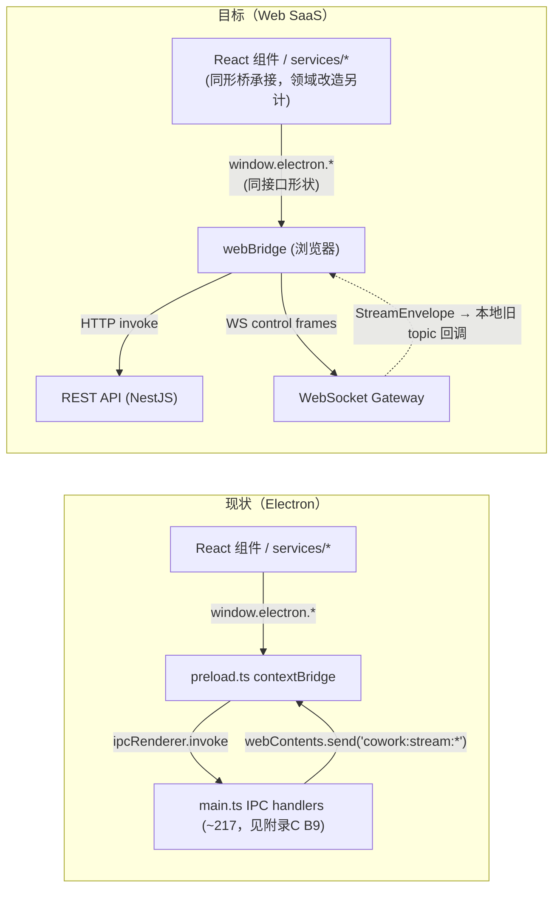
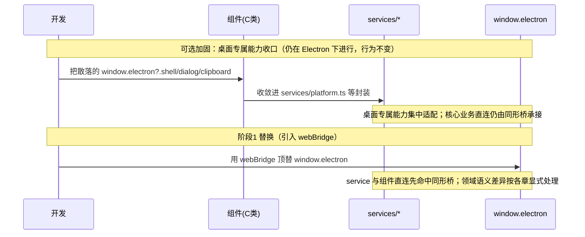
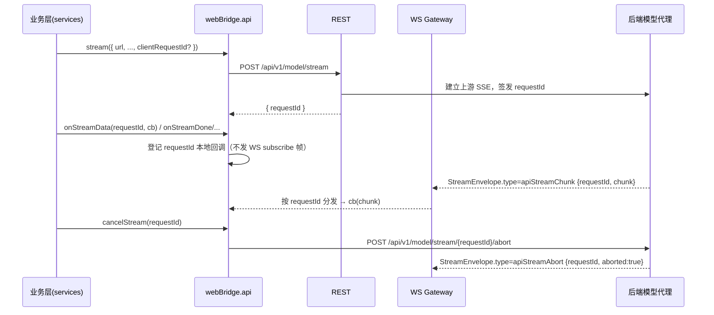
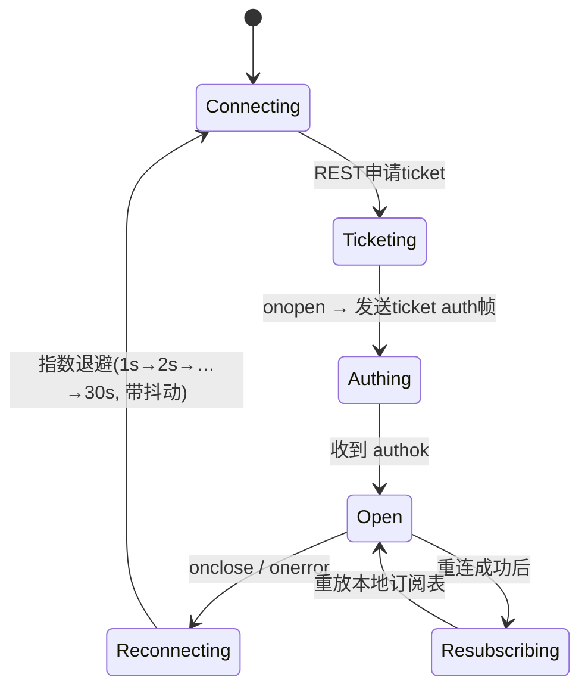
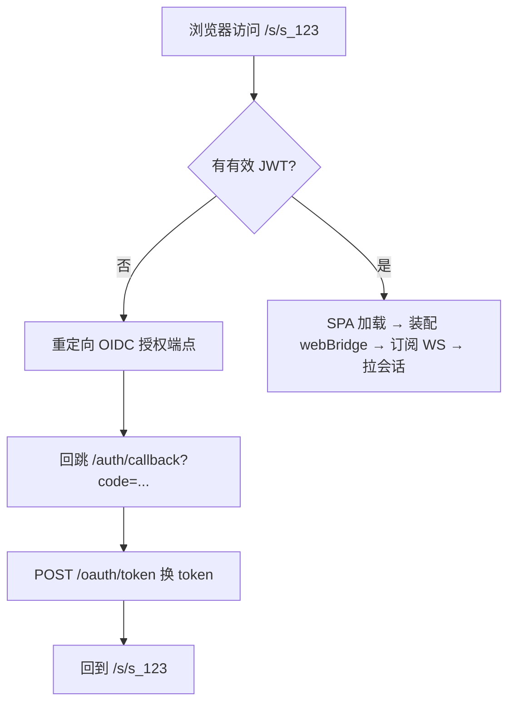
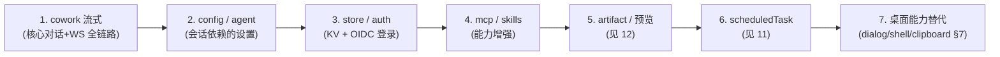

# 前端与传输层改造

> 本文档面向前端与全栈工程师，讲解如何把 LobsterAI 现有的 Electron 桌面渲染层，改造为运行在标准浏览器里的多租户 SaaS Web 前端。核心命题只有一个：**桥必须 1:1 实现整个 `window.electron` 全局表面**（同名、同签名、同返回类型的“Web 桥”，REST + WebSocket），而**不是“替换 services 层”**——因为渲染层组件直连 `window.electron` 的点数已过半于经 `services/*` 的点数（**245 > 207**，见附录 C A4/B10）。补齐整张全局表面只能把传输层替换影响压到桥内；租户、工作区路径、计费、导入向导和 Electron-only 降级仍需显式改造，不能被理解为 React 业务代码原样不动。
>
> 阅读顺序建议：先读 `01-现状架构调研.md` 建立整体认知，再读本文；本文与 `04-后端服务与API设计.md`（服务端接口）、`05-认证与多租户账户.md`（token 获取）、`07-OpenClaw运行时编排与沙箱隔离.md`（流式后端来源）、`12-Artifacts与预览改造.md`（预览替代）强耦合，交叉引用处会明确标注“见 XX 文档”。

---

## 1. 设计总纲：一句话与一张图

**改造的第一性原理**：现有 **481 处**渲染层调用、**72 个文件**（见附录 C B10；现状核对以 `IElectronAPI` / `preload.ts` 暴露表面 / 组件调用点交叉为准，禁止只靠字面量 grep 计数）全部经由 `window.electron.*` 这一个 `contextBridge` 暴露对象访问（`src/main/preload.ts` 的 `contextBridge.exposeInMainWorld`）。其中**组件直连 245 处 > 经 `services/*` 的 207 处，过半绕过 services**（见附录 C A4）——因此桥必须 **1:1 补齐整个 `window.electron` 全局表面**，而非只替换 service 底层。只要该实现**同名、同签名、同返回类型**，核心对话链路就能把传输层替换影响压在桥内；但租户、工作区路径、计费、导入向导和 Electron-only 降级仍需显式产品改造，不能宣称业务组件完全无感。

因此整个前端 Web 化 = 用 `webBridge` 顶替 `preload.ts` 暴露的整张对象表面（含组件直连、未经 service 的方法）。



**四条硬约束**（贯穿全文，来自项目已定决策）：

1. 前端仍是**现有 React SPA**，Vite 构建，静态托管 + CDN。不迁 Next.js、不换框架。
2. 请求/响应走 **REST(HTTP)**；流式（`cowork:stream:*`、`api:stream:*`、`*:changed`）走 **WebSocket**。
3. 后端为 **NestJS + TS**，复用现有 TS 语义、类型与测试资产；代码复用必须按 D15 分级，深耦合 SQLite/Electron 的 `coworkStore`、`openclawConfigSync` 等模块按 `04` 重写/移植。
4. 鉴权用 **OAuth2/OIDC + JWT**（见 `05-认证与多租户账户.md`）。

---

## 2. 现状收口分析：桥同形优先，收口作为加固

### 2.1 收口现状盘点

渲染层对桥的依赖并非均匀分布。按“是否已经过 `services/*` 封装”把调用分成三类：

| 分类 | 描述 | 典型位置 | 迁移友好度 |
|---|---|---|---|
| A. 已充分收口 | 组件只调用 `services/*` 里的函数，`window.electron` 只出现在 service 内部 | `services/cowork.ts`（40+ 处集中调用，`src/renderer/services/cowork.ts:168` 起）、`services/auth.ts`、`services/agent.ts`、`services/mcp.ts`、`services/skill.ts`、`services/config.ts`、`services/store.ts`、`services/scheduledTask.ts` | 高：优先替换 service 底层，组件调用点少改；若涉及租户、路径、计费、导入或降级语义仍按对应章节改造 |
| B. 半收口 | 有 service 封装，但组件里仍有零散直呼 `window.electron?.xxx` | `services/clipboard.ts` 存在，但 `MediaMentionPicker.tsx`、`ArtifactPanel.tsx` 等仍直接调 `window.electron?.clipboard` / `shell` | 中：Web 桥先按同形表面兜住；桌面专属能力按需收敛进 `platform.ts` |
| C. 未收口 | 组件直接调用桥，无 service 中间层 | `window.electron?.dialog`、`window.electron?.shell`、`window.electron?.window`、`window.electron?.clipboard` 分散在 ~26 处（实测 `localFileActions.ts`、`DocumentRenderer.tsx`、`SheetRenderer.tsx`、`ArtifactPreviewCard.tsx` 等） | 低：多为桌面专属能力，需逐个改 Web 替代（见 §7） |

**关键事实（订正）**：整体上**组件直连 `window.electron` 的点数（245）已超过经 `services/*` 的点数（207，见附录 C A4）**，并非“核心链路都已收口在 service”。cowork/agent/config 等核心链路确有 `services/cowork.ts` 这类集中封装（承载会话 CRUD、流式订阅编排 `setupStreamListeners`、Redux 派发），但仍有过半调用点从组件直连桥。因此 Web 化的正确策略是**桥补齐整张 `window.electron` 表面**，让“直连”与“经 service”的调用同时无感切换，而不是只替换 A 类的 service 底层；C 类桌面专属能力（§7）另需逐项 Web 替代。

### 2.2 分阶段策略：1:1 桥是主线，service/platform 收口是加固

不要把“组件不再直呼 `window.electron`”写成 V1 前置门。正确的主线是先冻结并实现 1:1 `ElectronBridge` 表面；对桌面专属能力的 `platform.ts` 收口只作为降低维护成本的加固项，尤其服务于 §7 的移除/降级能力。



**可选收口步骤（非 V1/V2 阻断门，可在现有 Electron 应用里安全完成并回归测试）**：

1. 建立 `src/renderer/services/platform.ts`（新增，唯一封装桌面能力）：把 `dialog.*`、`shell.*`、`clipboard.*`、`window.*`、`log.*` 全部包一层导出函数，如 `openExternal(url)`、`copyText(text)`、`saveFile(...)`。
2. 用 `rg` 找出所有 `window.electron?.(dialog|shell|clipboard|window)` 直呼点（~26 处），逐个改为调用 `platform.ts` 的函数。此阶段行为完全不变，纯粹搬运。
3. 补齐 B 类：把 `MediaMentionPicker.tsx`、`ArtifactPanel.tsx` 等对 `clipboard`/`shell` 的直呼收进 `services/clipboard.ts` / `platform.ts`。

**订正**：由于组件直连点（245）已过半于经 service 的点（207，见附录 C A4/B10），把全部直连都收口进 `services/*` 是一次巨量改造，**不是 Web 化的前置条件**。真正落地的主线是**桥 1:1 实现整个 `window.electron` 表面**——直连组件与经 service 的调用都命中同一张同形表面，无需先收口即可切换。上面的收口步骤仅定位为**可选加固**（尤其对 §7 那些散落 ~26 处的桌面专属能力有价值：把它们收进 `platform.ts` 便于统一 Web 替代），而非“替换 services 层”式的强制前置。

> 收口本身不是白干：即便某天要出 Electron + Web 双端，`platform.ts` 也是天然的“平台适配层”。

---

## 3. webBridge：与 window.electron 同形的 Web 实现

### 3.1 目录与分层

```
src/renderer/bridge/
├── index.ts              # createWebBridge()，装配并挂到 window.electron
├── httpClient.ts         # REST client（fetch 封装、JWT 注入、错误规约）
├── wsClient.ts           # WebSocket client（多路复用、重连、背压、订阅表）
├── invokeMap.ts          # 逻辑通道名 → HTTP method+path 的映射表
├── streamMap.ts          # 桥本地 topic → scope / StreamEnvelope.type 的映射表
└── modules/              # 按域拼装 store/skills/mcp/cowork/api/... 子对象
    ├── cowork.ts
    ├── store.ts
    ├── ...
```

装配入口在 SPA 启动最早期执行（`main.tsx` 顶部，早于任何 React 渲染），保证 `services/*` 首次访问 `window.electron` 时它已就绪：

```ts
// src/renderer/bridge/index.ts
import { createHttpClient } from './httpClient';
import { createWsClient } from './wsClient';
import { buildCoworkModule } from './modules/cowork';
// ...其余模块

export function installWebBridge(): void {
  const http = createHttpClient({ baseUrl: import.meta.env.VITE_API_BASE });
  const ws = createWsClient({ url: import.meta.env.VITE_WS_URL });

  const electron: ElectronBridge = {
    platform: 'web',           // 原来是 process.platform
    arch: 'web',
    store: buildStoreModule(http),
    skills: buildSkillsModule(http, ws),
    mcp: buildMcpModule(http, ws),
    cowork: buildCoworkModule(http, ws),
    api: buildApiModule(http, ws),
    agents: buildAgentsModule(http),
    // dialog/shell/clipboard/window → Web 替代实现（见 §7）
    ...buildPlatformShims(),
  };

  (window as unknown as { electron: ElectronBridge }).electron = electron;
}
```

### 3.2 接口骨架示例

关键在于**每个方法的签名与返回值必须与 `preload.ts` 逐字对齐**。PR-1 前以现有 `IElectronAPI` / `preload.ts` 作为抽取基线；PR-1 起应把桥表面提升到 `libs/client/bridge` 的共享 `ElectronBridge` 类型，并逐步用 `libs/shared/contracts` 生成 DTO，避免两处漂移。不得再新建一份 `src/shared` 里的目标接口作为稳定事实源。下面给出几个域的骨架。

**store（最简单，纯 KV 请求/响应）**

对应 `preload.ts:48`：

```ts
// modules/store.ts
export function buildStoreModule(http: HttpClient) {
  return {
    get: (key: string) => http.invoke('store:get', { key }),        // GET /api/v1/kv/:key
    set: (key: string, value: unknown) =>
      http.invoke('store:set', { key, value }),                     // PUT /api/v1/kv/:key
    remove: (key: string) => http.invoke('store:remove', { key }),  // DELETE /api/v1/kv/:key
  };
}
```

**skills（请求 + `*:changed` 订阅）**

对应 `preload.ts:53`：

```ts
// modules/skills.ts
export function buildSkillsModule(http: HttpClient, ws: WsClient) {
  return {
    list: () => http.invoke('skills:list'),
    setEnabled: (o: { id: string; enabled: boolean }) => http.invoke('skills:setEnabled', o),
    delete: (id: string) => http.invoke('skills:delete', { id }),
    download: (source: string) => http.invoke('skills:download', { source }),
    upgrade: (skillId: string, downloadUrl: string) =>
      http.invoke('skills:upgrade', { skillId, downloadUrl }),
    confirmInstall: (pendingId: string, action: string) =>
      http.invoke('skills:confirmInstall', { pendingId, action }),
    // Web 下无本地技能根目录；保留同形方法但不得发 HTTP，也不得进入 route registry。
    getRoot: () =>
      Promise.resolve({ supported: false, code: 'desktop_only', messageKey: 'web.unsupported.desktopOnly' }),
    autoRoutingPrompt: () => http.invoke('skills:autoRoutingPrompt'),
    getConfig: (skillId: string) => http.invoke('skills:getConfig', { skillId }),
    setConfig: (skillId: string, config: Record<string, string>) =>
      http.invoke('skills:setConfig', { skillId, config }),
    testEmailConnectivity: (skillId: string, config: Record<string, string>) =>
      http.invoke('skills:testEmailConnectivity', { skillId, config }),
    fetchMarketplace: () => http.invoke('skills:fetchMarketplace'),
    detectFromOpenClaw: () => http.invoke('skills:detectFromOpenClaw'),
    syncFromOpenClaw: () => http.invoke('skills:syncFromOpenClaw'),
    refreshPluginSkillIds: () => http.invoke('skills:refreshPluginSkillIds'),
    // 与 preload 完全一致：返回 unsubscribe 函数；用户级事件不发会话 subscribe 帧
    onChanged: (cb: () => void) => ws.subscribe('skills:changed', { kind: 'user' }, cb),
  };
}
```

**mcp（同样是请求 + `mcp:changed` 订阅）**

对应 `preload.ts:80`。结构同 skills，`onChanged: (cb) => ws.subscribe('mcp:changed', { kind: 'user' }, cb)`。MCP 的 stdio 传输在 Web 侧改由服务端沙箱承载，前端桥无差异；细节见 `10-MCP与技能改造.md`。

**cowork（请求 + 10 类流式事件订阅，最核心）**

对应 `preload.ts` 的 cowork 段。请求方法照搬；**10 个** `onStream*`（含原文档漏列的 `onStreamGoal`，即 `CoworkIpcChannel.StreamGoal`，见附录 C B13）先登记为**桥本地回调**，真正发往服务端的会话订阅只能由 §5.3 的 `activeSessionIds` registry 生成 canonical `subscribe/unsubscribe {sessionId,sinceSeq?}`；`onSessionsChanged` 这类用户级事件随 WS auth 自动恢复或走 `{kind:'user'}` 订阅。不得把 `onStream*` 直接翻译成无作用域 `ws.subscribe(channel)` 或 wildcard。PR-1 必须把这些真实桥表面沉淀为 `libs/shared/contracts` 下的 `CoworkStreamChannel` 注册表，再由注册表生成 AsyncAPI 和桥类型；下列代码为示意而非事实源：

```ts
// modules/cowork.ts
export function buildCoworkModule(http: HttpClient, ws: WsClient) {
  const stream = <T>(topic: CoworkStreamTopic, cb: (payload: T) => void) =>
    ws.registerSessionStreamHandler(topic, cb); // 只登记本地回调；wire subscribe 由 activeSessionIds registry 统一发出

  return {
    // ---- 请求/响应（→ REST）----
    startSession: (o: StartSessionOptions) => http.invoke('cowork:session:start', o),
    continueSession: (o: ContinueSessionOptions) => http.invoke('cowork:session:continue', o),
    stopSession: (sessionId: string) => http.invoke('cowork:session:stop', { sessionId }),
    deleteSession: (sessionId: string) => http.invoke('cowork:session:delete', { sessionId }),
    listSessions: (o?: ListSessionsOptions) => http.invoke('cowork:session:list', o ?? {}),
    getSession: (sessionId: string) => http.invoke('cowork:session:get', { sessionId }),
    getSessionMessages: (o: { sessionId: string; limit?: number; cursor?: string; direction?: 'backward' | 'forward' }) =>
      http.invoke('cowork:session:getMessages', o),
    getContextUsage: (sessionId: string) => http.invoke('cowork:session:contextUsage', { sessionId }),
    setConfig: (c: CoworkConfig) => http.invoke('cowork:config:set', c),
    getConfig: () => http.invoke('cowork:config:get'),
    respondToPermission: (o: { sessionId: string; requestId: string } & (
      | { kind: 'tool'; result: unknown }
      | { kind: 'ask'; answers: Record<string, string> }
    )) =>
      http.invoke('cowork:permission:respond', o),
    // ...其余 CRUD 同理

    // ---- 流式（登记本地回调；会话 subscribe 由 activeSessionIds registry 统一发出，返回 unsubscribe）----
    onStreamMessage: (cb: (d: { sessionId: string; message: unknown; beforeMessageId?: string }) => void) =>
      stream('cowork:stream:message', cb),
    onStreamMessageUpdate: (cb: (d: { sessionId: string; messageId: string; content: string; metadata?: Record<string, unknown> }) => void) =>
      stream('cowork:stream:messageUpdate', cb),
    onStreamSessionStatus: (cb: (d: { sessionId: string; status: string }) => void) =>
      stream('cowork:stream:sessionStatus', cb),
    onStreamContextUsage: (cb: (d: { sessionId: string; usage: unknown }) => void) =>
      // 注意：runtime/adapter 侧该事件真实名为 contextUsageUpdate（非 contextUsage，见附录 C B13）
      stream('cowork:stream:contextUsage', cb),
    onStreamContextMaintenance: (cb: (d: { sessionId: string; active: boolean }) => void) =>
      stream('cowork:stream:contextMaintenance', cb),
    onStreamPermission: (cb: (d: { sessionId: string; request: unknown }) => void) =>
      stream('cowork:stream:permission', cb),
    onStreamPermissionDismiss: (cb: (d: { requestId: string }) => void) =>
      stream('cowork:stream:permissionDismiss', cb),
    onStreamComplete: (cb: (d: { sessionId: string; claudeSessionId: string | null }) => void) =>
      stream('cowork:stream:complete', cb),
    onStreamError: (cb: (d: { sessionId: string; error: string }) => void) =>
      stream('cowork:stream:error', cb),
    // 第 10 个流式事件：原文档漏列（CoworkIpcChannel.StreamGoal，见附录 C B13 / §3.2）
    onStreamGoal: (cb: (d: { sessionId: string; goal: unknown }) => void) =>
      stream('cowork:stream:goal', cb),
    onSessionsChanged: (cb: () => void) =>
      ws.subscribe('cowork:sessions:changed', { kind: 'user' }, cb),
  };
}
```

> 与 `preload.ts:464` 对照可见：签名、payload 形状、返回 `unsubscribe` 的约定必须保持一致；目标是让 `services/cowork.ts` 的 `setupStreamListeners` 继续按旧 `onStream*` 回调工作。但这不等于桥层零改，也不保证 `services/cowork.ts` 永远一行不动：若 `activeSessionIds` 无法完全由 `startSession` / `continueSession` / `getSession` / 深链恢复推导，必须在 service/router 生命周期里补最小的 `activate/deactivateSession` 调用，并由桥契约测试锁住旧回调形状。

**api（参数化 requestId 的 SSE 代理，最需要小心）**

对应 `preload.ts:117`。原设计用**动态事件名** `api:stream:${requestId}:{data|done|error|abort}`（`preload.ts:139`）。Web 目标态仍按 `requestId` 多路分发，但 canonical `requestId` 必须由服务端在 `POST /api/v1/model/stream` 时签发（对齐 `04` §6.4 / `09` §5.3 的计费幂等），前端若为兼容旧桥需要预生成 ID，只能作为 bridge 内部 `clientRequestId` 相关性，不得写入账单幂等键或 abort 路径。

```ts
// modules/api.ts
export function buildApiModule(http: HttpClient, ws: WsClient) {
  return {
    fetch: (o: { url: string; method: string; headers: Record<string, string>; body?: string }) =>
      http.invoke('api:fetch', o),                     // 非流式，走 REST 后端代理
    stream: (o: { url: string; method: string; headers: Record<string, string>; body?: string; clientRequestId?: string }) =>
      http.invoke('api:stream', o),                    // 触发后端建立上游 SSE，返回服务端签发 requestId
    cancelStream: (requestId: string) => http.invoke('api:stream:cancel', { requestId }),

    // 服务端签发 requestId → 桥本地回调表；wire 侧只接收 apiStream* envelope，不发送 api:stream 订阅帧
    onStreamData: (requestId: string, cb: (chunk: string) => void) =>
      ws.onApiStream(requestId, 'data', (d: { chunk: string }) => cb(d.chunk)),
    onStreamDone: (requestId: string, cb: () => void) =>
      ws.onApiStream(requestId, 'done', () => cb()),
    onStreamError: (requestId: string, cb: (e: string) => void) =>
      ws.onApiStream(requestId, 'error', (d: { error: string }) => cb(d.error)),
    onStreamAbort: (requestId: string, cb: () => void) =>
      ws.onApiStream(requestId, 'abort', () => cb()),
  };
}
```

> 模型代理的上游转发、计费扣减在后端完成，见 `09-模型代理与计费.md`。前端桥只负责“把参数化事件名映射到本地回调表”，wire 层接收 `apiStream*` envelope，不新增 `api:stream:*` 订阅帧。

### 3.3 通用 ElectronBridge 类型来源

不要在 webBridge 里重新手写类型。当前仓库已经有一份完整桥表面类型：`src/renderer/types/electron.d.ts` 的 `IElectronAPI`。PR-1 应把它**迁移/提升**为共享 `ElectronBridge` 类型（建议 `libs/client/bridge/src/electronBridge.ts`，必要时从 `libs/shared/contracts` 生成其中的 DTO 部分），preload 与 webBridge 都 `satisfies ElectronBridge`，任一处漂移即编译期报错。迁移规则：先把现有 `IElectronAPI` 作为基线完整搬迁并加快照测试，再逐步把 request/response DTO 替换为 OpenAPI/AsyncAPI 生成类型；禁止在 webBridge 里另手写一份缩水接口。

---

## 4. invoke → HTTP 映射规则

### 4.1 统一映射约定

`invoke(channel, payload)` 的通道名是 `域:动作[:子动作]` 形式。映射到 REST 遵循一张显式表（`invokeMap.ts`），**不做隐式约定推导**，因为 IPC 通道语义并非天然 RESTful。

映射的默认规约：

| IPC 语义 | HTTP 动词 | 路径模式 | payload 去向 |
|---|---|---|---|
| `*:list` / `*:get*` | `GET` | `/api/v1/{域}/...` | query string（分页/过滤） |
| `*:create` / `*:start` / `*:continue` | `POST` | `/api/v1/{域}` | JSON body |
| `*:update` / `*:set*` / `*:rename` / `*:pin` | `PUT`/`PATCH` | `/api/v1/{域}/:id` | JSON body |
| `*:delete` | `DELETE` | `/api/v1/{域}/:id` | path/query |
| 动作型（无 CRUD 对应，如 `compactContext`、`stop`） | `POST` | `/api/v1/{域}/:id/{动作}` | JSON body；禁止冒号式 action path |

**示例映射表片段**：

| invoke 通道 | HTTP | 备注 |
|---|---|---|
| `store:get` | `GET /api/v1/kv/:key` | key 走 path；与附录 A 的 store/config 域统一，禁止另起 `/api/v1/store/*` |
| `store:set` | `PUT /api/v1/kv/:key` | value 走 body |
| `cowork:session:list` | `GET /api/v1/sessions?limit&cursor&agentId&searchQuery` | |
| `cowork:session:start` | `POST /api/v1/sessions` | 返回 sessionId；流式后续走 WS |
| `cowork:session:continue` | `POST /api/v1/sessions/:id/turns` | 后续轮次；不要再用 `/messages` 触发生成 |
| `cowork:session:stop` | `POST /api/v1/sessions/:id/stop` | |
| `cowork:session:getMessages` | `GET /api/v1/sessions/:id/messages?limit&cursor` | 只读消息分页 |
| `cowork:session:compactContext` | `POST /api/v1/sessions/:id/compact-context` | |
| `cowork:config:get` / `set` | `GET`/`PATCH /api/v1/cowork/config` | 租户级配置；set 是部分更新，和附录 A 的 `PATCH /api/v1/cowork/config` 对齐 |
| `agents:list` / `create` / `update` / `delete` | `GET`/`POST`/`PATCH`/`DELETE /api/v1/agents[/:id]` | `update` 对齐附录 A 的 `PATCH /api/v1/agents/{id}`；注意 §4.2 返回解包 |
| `mcp:list` / `create` / ... | `/api/v1/mcp/servers[/:id]` | |
| `skills:list` / `setEnabled` / ... | `/api/v1/skills[/:id]` | |
| `api:fetch` | `POST /api/v1/model/proxy` | 后端代理上游模型 |
| `api:stream` | `POST /api/v1/model/stream` | 建立 WS 子流，见 §5.4 |
| `get-api-config` / `check-api-config` / `save-api-config` | `GET /api/v1/model/config` / `POST /api/v1/model/config/check` / `PUT /api/v1/model/config` | 旧桥兼容入口；密钥写入归一到 BYOK/secref |

**契约事实源 = `libs/shared/contracts`（OpenAPI 3.1 REST + AsyncAPI 2.6 WS，见附录 C D1）**：字段级 request/response/error/事件 payload 一律以 contracts 为权威，由 CI 生成后端 DTO 校验、前端桥类型、契约测试三方。`附录A-IPC通道与接口映射.md` 与 `04` **降级为“导航与任务清单”**（只到“动词+路径”级），不作字段级事实源；本文只给映射规则与代表样例。

### 4.2 返回值形状必须与 preload 逐字一致

注意 `agents` 模块在 `preload.ts:253` 里做了**解包**：`invoke` 返回 `{ success, agents }`，但桥对外只返回 `agents`（失败返回 `[]`/`null`）。webBridge 必须复刻这套解包逻辑，否则 `agentSlice` 会拿到意料之外的形状：

```ts
// modules/agents.ts —— 复刻 preload 的解包语义
list: async () => {
  const r = await http.invoke('agents:list');       // 后端仍返回 { success, agents }
  return r?.success ? r.agents : [];
},
get: async (id: string) => {
  const r = await http.invoke('agents:get', { id });
  return r?.success ? r.agent : null;
},
```

**规则**：webBridge 每个方法的“输入参数 + 输出形状”在 PR-1 前以 `preload.ts` / `IElectronAPI` 作为**初始抽取基线**；PR-1 后字段级事实源必须切到 `libs/shared/contracts` + 共享 `ElectronBridge` 类型。后端 REST 仍返回“桥内部消费的原始形状”（如 `{ success, agents }`），解包留在桥里做，保证后端契约与业务层解耦；但不得把 `preload.ts` 继续当成稳定态唯一事实源。

### 4.3 HTTP invoke 的实现要点

```ts
// httpClient.ts（简化）
export function createHttpClient(cfg: { baseUrl: string }): HttpClient {
  async function invoke(channel: string, payload?: unknown): Promise<any> {
    const route = INVOKE_MAP[channel];               // { method, path(payload) → url, bodyFrom(payload) }
    if (!route) throw new Error(`[webBridge] unmapped channel: ${channel}`);
    const url = cfg.baseUrl + route.path(payload);
    const res = await fetch(url, {
      method: route.method,
      headers: {
        'Content-Type': 'application/json',
        Authorization: `Bearer ${getAccessToken()}`,  // §6 token 注入
      },
      body: route.hasBody ? JSON.stringify(route.bodyFrom(payload)) : undefined,
      credentials: 'include',
    });
    if (res.status === 401) { await refreshOrRedirect(); /* 重试一次 */ }
    if (!res.ok) throw await normalizeHttpError(res);  // 统一成主进程 handler 抛错的形状
    return res.status === 204 ? undefined : res.json();
  }
  return { invoke };
}
```

要点：
- **错误规约**：主进程 `ipcMain.handle` 抛错时渲染层 catch 到的是 `Error`。HTTP 侧要把 4xx/5xx body 规约成同样形状（`normalizeHttpError`），避免业务层 `catch` 逻辑失效。
- **分页**：`getSessionMessages` 目标态只接受 `cursor + direction`（默认 `direction=backward`），不得继续暴露旧 offset 类分页参数。后端返回体必须带上 `messages` + `{nextCursor,hasMore,limit}` 分页信封，消息游标按 `04` §4.3 / 附录 C D10 的不可变 `(created_at,id)` 或等价 ksuid，桥层负责适配旧调用方的“加载更早消息”语义。
- **租户隔离**：`tenant_id` 不进 payload，由后端从 JWT 解析（见 `05` 与 `14-安全合规与多租户隔离.md`）。前端桥完全不感知租户。

---

## 5. webContents.send(事件) → WS 事件映射规则

### 5.1 三类推送事件

主进程的推送口径需区分“调用点”与“去重通道”（见附录 C B14）：`src/main` 内 `webContents.send` **调用点**约 **36**，全部 `.send(` **调用点**约 **51**（含非 webContents）；**去重后的 renderer 事件通道**约 **29**。下文按“去重通道”维度组织，按用途分三类，全部走 WS：

| 类别 | 事件示例 | 桥本地 topic / wire 映射 | 归属维度 |
|---|---|---|---|
| 会话流式 | `cowork:stream:{message,messageUpdate,sessionStatus,contextUsage,contextMaintenance,permission,permissionDismiss,complete,error,goal}`（**10 类**，含原漏的 `goal`，见附录 C B13） | 桥本地 topic 沿用旧通道名且只登记回调；wire 订阅由 `activeSessionIds` registry 发 `subscribe {sessionId,sinceSeq?}`，下行为 `StreamEnvelope.type=message/messageUpdate/...` | 按 `sessionId` 过滤 |
| 参数化流 | `api:stream:${requestId}:{data,done,error,abort}` | 桥本地 topic 沿用旧通道名；wire 为 `StreamEnvelope.type=apiStreamChunk/apiStreamDone/apiStreamError/apiStreamAbort`，以 `requestId` 关联 | 按 `requestId` |
| 变更通知 | `skills:changed`、`mcp:changed`、`auth:quotaChanged`、`scheduledTask:{statusUpdate,runUpdate,refresh}`、`files:changed`（桥兼容别名 `artifact:file:changed`）、`cowork:sessions:changed`、`openclaw:engine:onProgress` | 桥本地 topic 可沿用旧通道名；wire 为用户级自动订阅或 `subscribeEvent`；文件事件以 `files:changed` 为 canonical | 按租户/资源 |

### 5.2 单条 WS 多路复用协议

一个租户会话只开**一条** WS 连接，内部用简单信封做多路复用（避免每个 `onStream*` 各开一条连接）：

> 正式 wire protocol 以 `04-后端服务与API设计.md` §5 为准，判别字段统一为 `type`，事件信封对齐附录 C `StreamEnvelope`。`channel`/`scope` 只存在于浏览器桥本地订阅表，不作为会话流 wire 字段；旧 `cowork:stream:*` channel 本身不携带 `sessionId`，只能登记桥本地回调。浏览器桥另由 `activeSessionIds` registry 生成会话级 `subscribe {sessionId, sinceSeq?}`，把需要资源过滤的文件事件映射为 `subscribeEvent {channel:'files:changed', params}`，收到 canonical envelope 后再本地回调旧 channel。

```jsonc
// 客户端 → 服务端（认证成功后）
{ "type": "subscribe", "sessionId": "s_123", "sinceSeq": "1719900000000-0" }
{ "type": "unsubscribe", "sessionId": "s_123" }
{ "type": "subscribeEvent", "channel": "files:changed", "params": { "workspaceId": "11111111-1111-4111-8111-111111111111", "path": "docs/a.html" } }

// 服务端 → 客户端（推送）
{ "type": "messageUpdate", "version": 1, "tenantId": "t_1", "sessionId": "s_123", "seq": "1719900000001-0", "emittedAt": "2026-07-08T12:00:01.000Z",
  "data": { "messageId": "m_9", "content": "…", "metadata": {} } }
{ "type": "apiStreamChunk", "version": 1, "tenantId": "t_1", "requestId": "r_abc", "seq": "1719900000002-0", "emittedAt": "2026-07-08T12:00:02.000Z", "data": { "chunk": "…" } }
```

`wsClient` 对外必须分两类注册口，避免把旧桥 callback 误当成 wire 订阅：

- `registerSessionStreamHandler(topic, cb)`：只用于 `cowork:stream:*`；只登记桥本地回调，不发送任何 wire control frame。会话级 wire 订阅只能由 `activeSessionIds` registry 在会话进入/离开/重连时统一发 `subscribe/unsubscribe {sessionId,sinceSeq?}`。
- `subscribe(topic, scope, cb)`：只用于用户级事件和资源事件。`scope.kind === 'user'` 只登记本地回调，随 auth/ticket 自动恢复；`scope.kind === 'resource'` 才按 refcount 发送 `subscribeEvent/unsubscribeEvent {channel,params}`。

返回的 `unsubscribe` 都先注销本地 callback；只有资源订阅 refcount 降为 0 才发 `unsubscribeEvent`。不得因为某个 `onStream*` callback 注销而发无 session 的取消订阅帧。这样对上层就是 `preload` 里 `ipcRenderer.on/removeListener` 的等价物；wire 层不暴露旧 IPC channel 包壳。

```ts
// wsClient.ts（订阅表核心）
registerSessionStreamHandler(topic: CoworkStreamTopic, cb: (payload: any) => void): () => void {
  const key = sessionStreamKey(topic);
  const set = this.handlers.get(key) ?? new Set();
  set.add(cb);
  this.handlers.set(key, set);
  return () => {
    set.delete(cb);
  };
}

subscribe(topic: string, scope: SubscriptionScope, cb: (payload: any) => void): () => void {
  const key = subscriptionKey(topic, scope);
  const set = this.handlers.get(key) ?? new Set();
  if (set.size === 0 && scope.kind === 'resource') {
    this.sendControl(toSubscribeEventFrame(scope));
  }
  set.add(cb);
  this.handlers.set(key, set);
  return () => {
    set.delete(cb);
    if (set.size === 0 && scope.kind === 'resource') {
      this.sendControl(toUnsubscribeEventFrame(scope));
    }
  };
}
onFrame(frame: StreamEnvelope) {
  const topic = topicFromStreamType(frame.type); // 如 message -> cowork:stream:message
  const payload = { ...frame.data, sessionId: frame.sessionId, requestId: frame.requestId };
  dispatchToMatchingLocalHandlers(topic, frame, payload);
}
```

### 5.3 sessionId 归属过滤

现有渲染层收到 `cowork:stream:*` 后自己按 `sessionId` 分发到对应会话（`src/renderer/services/cowork.ts:175` 起的 handler 内部判断）。Web 侧有两种做法，**推荐服务端过滤**：

- 服务端过滤（推荐）：客户端 `subscribe {sessionId, sinceSeq?}`，服务端只推该会话的事件。省带宽、防越权（配合 `14` 的租户校验，杜绝跨会话/跨租户偷听）。
- 客户端过滤（仅限本地单租户 mock/开发兜底）：前端在回调里丢弃不匹配的。该模式不得进入 PR-1 contracts、共享联调环境、V1 证据包或任何多租户环境；一旦接入真实后端/沙箱，必须切回服务端按 `sessionId` 过滤。

**同形桥的关键约束**：现有 `IElectronAPI.onStream*` 方法本身不带 `sessionId` 参数，因此 `onStream*` 只能登记桥本地回调，不能直接发无 scope 的 `subscribe(channel)`。浏览器桥必须另维护 `activeSessionIds`：`startSession` / `continueSession` / `getSession` / 深链恢复会把会话加入 registry，路由离开或组件卸载时移除；registry 变化才发 canonical `subscribe/unsubscribe {sessionId, sinceSeq?}`。禁止为了省事把所有会话流改成用户级全量推送或 `{channel:'cowork:stream:*'}` wildcard。

为最大化复用现有 handler（它们已经按 `sessionId` 判断），即便服务端过滤，payload 仍保留 `sessionId` 字段，业务层无需改动。

### 5.4 api:stream 的取消与 requestId 生命周期

参数化流是特例：现状 `preload.ts:132` 的入参含 `requestId`，但目标 SaaS 合约改为**服务端签发 canonical `requestId`**。若旧渲染层仍在 `stream()` 前准备本地 ID，webBridge 只能把它当 `clientRequestId` 暂存并在收到服务端 `requestId` 后建立映射；对 REST abort、WS 事件、计费幂等与审计而言，权威 ID 一律是服务端返回值。流程：



要点：`api:stream:cancel` 的 canonical 映射固定为 REST `POST /api/v1/model/stream/{requestId}/abort`（见 `04` / `09` / 附录 A），不再另设 WS 控制帧分支；后端据**服务端签发的** requestId 掐断上游 SSE，并通过既有参数化流回吐 `api:stream:{requestId}:abort` 事件。客户端生成的临时 ID 只可作为 bridge 本地 correlation，不能作为账单 request_id、幂等键或跨租户唯一性依据。

---

## 6. 鉴权、断线重连与背压、流式取消

### 6.1 token 与 WS ticket 注入

- **HTTP**：每个 `fetch` 带 `Authorization: Bearer {accessToken}`（§4.3）。access token 短 TTL，401 时用 refresh token 静默续期后重试一次，失败则跳登录页。token 获取/刷新的完整 OIDC 流程见 `05-认证与多租户账户.md`。
- **WebSocket**：不直接把 access token 放 URL query，也不把长效 bearer token 作为首帧正式方案。正式方案为**一次性短期 WS ticket**：
  1. Web bridge 用 access token 调 `POST /api/v1/stream/ticket`，申请 `ticket`。
  2. OpenAPI 请求体只使用 `sessions[]` 与 `resourceSubscriptions[]`；ticket 内部 claim 绑定 `tenantId/userId`、由 `sessions[]` 派生的授权会话集合、`resourceSubscriptions`、`expiresAt/nonce`，TTL 建议 30-60 秒，只能消费一次；用户级事件随 auth 自动恢复，不进入显式 scope 列表。
  3. 浏览器连接建立后立即发送 `{ type:'auth', ticket }`；服务端校验并消费 ticket 后回 `{ type:'authok' }`，之后才接受 `subscribe`。
  4. ticket 不放 query，避免代理日志和浏览器历史泄露；access token 只走 HTTPS REST header。

```ts
const { ticket } = await http.post('/api/v1/stream/ticket', {
  sessions: Array.from(activeSessionIds),
  resourceSubscriptions: ws.resourceSubscriptionsForTicket(), // 例如 files:changed；用户级事件随 auth 自动恢复
});
ws.onopen = () => ws.send(JSON.stringify({ type: 'auth', ticket }));
// 服务端校验后回 { type:'authok' }，之后才接受 subscribe；未认证连接超时关闭
```

- ticket 过期/失效时服务端关闭连接或返回 `{ type:'protocolError', code:'TICKET_EXPIRED' }`。客户端先刷新 access token（如需要），重新申请 ticket、重连并重放订阅表（§6.2）。`protocolError` 是 WS 控制面错误，业务流里的 `cowork:stream:error` 仍按 canonical `StreamEnvelope {type:'error', ...}` 下发。

### 6.2 WS 断线重连



重连策略：
- **指数退避 + 抖动**：`min(30s, 2^n * 1s) ± rand`，避免雪崩（大量客户端同时重连）。
- **订阅表重放**：`wsClient` 内部持有 `handlers`（`subscriptionKey(topic, scope)`→回调集合）、`activeSessionIds`、资源订阅（如 `files:changed`）和每个会话/资源最后成功处理的 `seq`。重连前用 `activeSessionIds` + 资源订阅申请新 ticket；认证后只重放会话级 `subscribe {sessionId, sinceSeq}` 与资源级 `subscribeEvent {channel, params, sinceSeq}`。用户级事件随 auth 自动恢复；`apiStream*` 仅按 `requestId` 本地分发，不发订阅帧。字段名统一为 `sinceSeq`（见 `04` §5），不得回退到旧字段名。
- **流式续传缺口**：`cowork:stream:*` 断线期间可能丢事件，主路径由 Redis Stream 按 `sinceSeq` 补发；若补发窗口过期或服务端返回 `STREAM_GAP_EXPIRED`，前端再对当前会话做一次 `getSessionMessages` 拉取对齐并恢复增量。`services/cowork.ts` 已有 `loadSessions`/`getPagedSessionMessages` 逻辑可复用，只能作为 fallback，不替代 `sinceSeq` 协议。
- **心跳**：客户端每 20s 发 ping，服务端回 pong；45s 无 pong 判定死连并重连（穿透中间代理的空闲超时）。

### 6.3 背压（backpressure）

流式增量（尤其 `messageUpdate` 高频到达）在弱网/慢渲染时会堆积。前端两道防线：

1. **合帧渲染**：`wsClient` 对同一 `(topic, sessionId, messageId)` 的 `messageUpdate` 做 `requestAnimationFrame` 节流合并，只 dispatch 最新累积内容。现状是全增量 dispatch（`src/renderer/services/cowork.ts:215`），Web 下建议在桥或 service 层加节流，减少 Redux/React 抖动。
2. **服务端限速与丢弃策略**：见 `15-部署运维与可观测性.md`；对超过阈值的连接，服务端可合并/降采样 `contextUsage` 等非关键事件。

WS 发送侧背压：控制帧（`subscribe`/`unsubscribe`/`subscribeEvent`/`unsubscribeEvent`/`ping`/`ack`）量小可忽略；上行大 payload（如 `startSession` 带图片附件）**不走 WS**，走 HTTP（甚至直传对象存储，见 `08-文件工作区与对象存储.md`）。注意现有 `chat.send` 的真实拦截线是安全阈值常量 `OPENCLAW_CHAT_SEND_PAYLOAD_SAFE_LIMIT_BYTES`（`openclawRuntimeAdapter.ts`），而 **30MB（`30*1000*1000`，十进制）是 WS 帧硬限，超限触发 close 1009**（见附录 C B15）。Web 侧大附件应改为“先传对象存储拿 URL，再把 URL 放进 payload”，避免撑爆 HTTP body / WS 帧。

---

## 7. 去除桌面假设清单（逐项 Web 替代）

这是 C 类（§2.1）的核心工作。每一项都在 `platform.ts` 里给 Web 实现，或明确降级/后续。

| 桥能力 | preload 位置 | 桌面语义 | Web 替代方案 | 状态 |
|---|---|---|---|---|
| `window.minimize/toggleMaximize/close` | `preload.ts:176` | 原生窗口控制 | 无窗口概念，直接**移除**自定义标题栏组件，用浏览器原生窗口 | 移除 |
| `window.isMaximized` / `onStateChanged` | `preload.ts:180` | 窗口状态 | 移除；若有依赖布局的逻辑改用 CSS/`matchMedia` | 移除 |
| `window.showSystemMenu` | `preload.ts:181` | 系统右键菜单 | 移除或用 Web 右键菜单组件 | 移除 |
| `dialog.selectDirectory` | `preload.ts:546` | 选本地目录作 cwd | **改语义**：cwd 不再是用户本地目录，而是**服务端租户工作区 `/workspace/project` 子树**里的路径。用自定义“工作区目录选择器”UI（后端提供目录树 API），见 `08` | 改造 |
| `dialog.selectFile(s)` | `preload.ts:547` | 选本地文件 | `<input type="file">` / 拖拽，上传到对象存储；返回的是对象存储 key/URL 而非本地路径 | 改造 |
| `dialog.saveInlineFile` | `preload.ts:555` | 保存到本地磁盘 | 保存到服务端工作区：桥调用 `POST /api/v1/workspaces/:wid/files/upload`，再把响应适配回 `{success,path}`；不得改成浏览器下载或 File System Access API，否则会打断 Artifact/CodeRenderer 的工作区引用 | 改造 |
| `dialog.readFileAsDataUrl` / `readTextFile` / `statFile` | `preload.ts:561` | 读本地文件 | 走后端工作区文件 API（读服务端 PVC 上的文件），返回内容/元信息 | 改造 |
| `dialog.generateThumbnail` | `preload.ts:567` | 本地缩略图 | 后端生成缩略图并存对象存储，返回 URL | 改造 |
| `dialog.showMessageBox` | `preload.ts:569` | 原生弹窗 | Web 模态组件（已有 UI 体系可复用） | 改造 |
| `shell.openPath` | `preload.ts:576` | 用系统默认程序打开本地文件 | 无本地文件概念。改为：预览（见 `12`）或下载 | 改造/降级 |
| `shell.showItemInFolder` | `preload.ts:577` | 在访达/资源管理器中显示 | 无对应；改为“在工作区文件树中定位”UI | 改造 |
| `shell.openExternal` | `preload.ts:578` | 外部浏览器打开 URL | `window.open(url, '_blank', 'noopener')` | 简单替代 |
| `shell.openHtmlInBrowser` | `preload.ts:579` | 本地起 http 打开 HTML | 走 HTML 预览服务（云端），见 `12` | 改造 |
| `shell.getAppsForFile` / `openPathWithApp` | `preload.ts:581` | 选本地 App 打开 | **移除**（无本地 App 概念） | 移除 |
| `clipboard.writeText` | `preload.ts:586` | 系统剪贴板写文本 | `navigator.clipboard.writeText`（需用户手势 + HTTPS） | 简单替代 |
| `clipboard.writeImageFromFile` | `preload.ts:588` | 从本地文件写图 | 先取到 Blob（来自对象存储 URL），`navigator.clipboard.write([ClipboardItem])` | 改造 |
| `clipboard.writeImageFromDataUrl` | `preload.ts:590` | 从 dataURL 写图 | dataURL→Blob→`ClipboardItem` | 简单替代 |
| 拖拽本地文件入应用 | 分散 | 拿到本地绝对路径 | HTML5 `DataTransfer` 只给 File 对象（无路径），改为“拖入即上传对象存储” | 改造 |
| `log.*`（本地日志文件） | 调研清单 | 读/导出本地日志 | 前端日志走 `logReporter` 上报后端；导出改为后端接口下载 | 改造 |
| `asr.createRealtimeSession` | `preload.ts:649` | 语音输入 | 浏览器 `getUserMedia` 采音 + WS 送后端 ASR；无麦克风权限则降级 | 改造 |

**桥 shim 形状必须对齐现状真实签名（对应附录 C §3.4 / P1-7）**：这些 Electron-only 通道即便在 Web 下降级，也**必须存在于 `window.electron` 全局表面**（组件直连它们、不经 service，见附录 C A4），由 `buildPlatformShims()` 以**同形 shim** 承接。桥的职责是**把新后端响应适配回旧契约形状**，不改方法签名，避免打断上层渲染器。两个高频文件读写通道的签名尤其不得改：

- `saveInlineFile({ dataBase64, fileName, mimeType, cwd }) -> { success, path }`（现状 **25MB 上限**）：Web 下后端把内容落对象存储 / 租户工作区 `/workspace/project` 子树后，桥须把返回**适配回 `{ success, path }`**（`path` 改为 `workspaceId + project/relPath` 的逻辑路径），以免打断 `ArtifactPanel`。
- `readFileAsDataUrl(...) -> { success, dataUrl }`：Web 下后端 `GET /api/v1/workspaces/:wid/files/download?path=&as=url` 返回签名 URL，桥层 fetch 后转成 data URL 并**适配回 `{ success, dataUrl }`**，以免打断 `CodeRenderer` / `ImageRenderer`。
- 其余 Electron-only 通道（`window.*` / `shell.*` / `dialog.*` / `clipboard.*` / `log.*`）在表面上**显式降级**：无 Web 对应者必须 resolve 安全 no-op 或 `13` §5 的 `UnsupportedFeatureResult`，不得在正常降级路径 `throw`/`reject`；有对应者按上表给 Web 实现。**方法必须在表面存在**，绝不能让直连组件访问到 `undefined`。

**关键语义变化提醒**：现有代码里到处以“本地绝对路径字符串”为一等公民（cwd、artifact filePath、`watchFile(filePath)`）。Web 化后这些路径统统变成**服务端租户工作区 `/workspace/project` 子树内的相对/逻辑路径**，`/workspace/state`、`.trash/` 等控制目录不进入普通文件 API。这不是桥层能完全屏蔽的——需要在 `services/*` 与 artifact 解析层把“本地路径”概念替换为“工作区路径 + 对象存储 URL”，详见 `08-文件工作区与对象存储.md` 与 `12-Artifacts与预览改造.md`。桥层能做的是保证方法签名不变（仍传字符串），语义解释权交给后端。

---

## 8. SPA 托管与前端路由

### 8.1 从单窗口到多路由浏览器

现状是单 `BrowserWindow` 加载本地 `index.html`，App 内部靠 Redux state 做视图切换（`App.tsx` 顶层 view 路由）。Web 化后需要真正的浏览器路由，支持：地址栏 URL、刷新、前进后退、深链、分享链接。

| 需求 | 现状 | Web 方案 |
|---|---|---|
| 视图切换 | Redux 内部 state | 引入 `react-router`，URL 反映当前视图 |
| 刷新保持状态 | 无（单页内存态） | 路由承载 sessionId 等关键上下文：`/s/:sessionId`、`/agents/:id`、`/skills`、`/mcp`、`/tasks` |
| 深链/分享 | 无 | 可直接打开 `/s/:sessionId`，未登录跳 OIDC 登录后回跳 |
| 静态托管 | 本地文件 | CDN + 对象存储；`vite build` 产物纯静态 |
| 路由回退 | N/A | history 模式需服务端/CDN 把未知路径回退到 `index.html`（SPA fallback） |

### 8.2 构建与托管

- `vite build` 产出静态资源；`base` 配置为 CDN 前缀。
- 环境注入：`VITE_API_BASE`、`VITE_WS_URL`、`VITE_OIDC_*` 通过构建期环境变量或运行时 `config.json`（推荐运行时拉取，避免每环境重打包）。
- CDN 规则：静态资源长缓存 + 内容 hash；`index.html` 与运行时 `config.json` 短缓存/不缓存；未匹配路径 fallback 到 `index.html`。
- 深链鉴权：进入受保护路由前检查 token，无则重定向 OIDC 授权端点，回跳时用标准 Web redirect（**取代**现有 loopback 127.0.0.1 回调，`authLocalCallbackServer.ts` 整体废弃，见 `05`）。



---

## 9. 国际化（i18n）落地

Web 化不引入新的 i18n 框架，沿用现有双词典机制，只重新划分“谁在什么时机出文案”的归口。

### 9.1 前端 / 后端两套 t() 的 SaaS 对应

- **前端 `t()`**（`src/renderer/services/i18n.ts`）保持不变：SPA 内所有静态 UI 文案仍由前端词典渲染，桥替换对它零影响。当前语言从用户设置（`store:get` 读取的语言偏好）或浏览器 `navigator.language` 初始化。
- **后端 `t()`**（原 `src/main/i18n.ts`）随主进程业务逻辑迁入 NestJS（见 `04-后端服务与API设计.md`），仅用于**服务端产出的用户可见文案**：通知、IM 推送标题、会话默认标题、定时任务展示名等。桌面态的托盘/菜单文案在 Web 下无对应，直接废弃。
- 划分原则不变：能在前端用 `t()` 出的文案就留在前端；只有后端才知道内容的（如推送到 IM 的消息）才由后端 `t()` 出，且后端出文案时按请求语言（§9.4）选择 zh/en。

### 9.2 错误码 message 的 zh/en 词典归口

`normalizeHttpError`（§4.3）规约后端错误时，**HTTP body 走附录 C §3 的统一错误信封**，只把稳定错误码与结构化参数作为前端分类依据；`message` 仅作默认/调试 fallback，不回已本地化的整句，也不能作为业务分支判断：

```jsonc
{
  "error": {
    "code": "SESSION_NOT_FOUND",
    "message": "Session not found",
    "requestId": "req_123",
    "details": { "sessionId": "s_123" }
  }
}
```

- 错误码→文案的 zh/en 词典归口到**前端** i18n 词典（新增 `errors.*` 命名空间），由前端按 `code` 映射渲染，例如 `SESSION_NOT_FOUND` → `t('errors.SESSION_NOT_FOUND', details)`。这样同一错误在不同语言用户下自动本地化，且后端无需感知语言。
- 错误码清单归口到 `libs/shared/contracts/src/errors.ts`（附录 C D1 / §3，`as const` + Zod enum），并生成 OpenAPI/AsyncAPI 错误响应、前端错误类型与测试断言；现有 `src/shared/*/constants.ts` 中的错误码只作为 PR-1 抽取输入，不能作为目标态错误码事实源。
- 例外：IM/邮件等**由后端直接投递**给终端用户、不经 SPA 渲染的文案，仍由后端 `t()` 出整句（§9.1）。

### 9.3 plan.*.name / displayNameKey 等 i18n key 的来源

计费套餐、能力档位等**数据驱动**的展示名不硬编码整句，而是由后端返回 i18n **key**，前端 `t()` 渲染：

- 后端 plan/quota 接口（见 `09-模型代理与计费.md`）返回 `displayNameKey: 'plan.pro.name'` 之类的稳定 key，而非 `displayName: '专业版'`。
- 前端词典维护 `plan.*.name` / `plan.*.desc` 的 zh/en 文案；新增套餐先加 key 再加词条。
- 好处：套餐文案改动不需要改数据库/后端；多语言天然覆盖；与错误码归口（§9.2）风格一致——**后端出 key，前端出文案**。

### 9.4 语言协商（Accept-Language / 用户设置）

优先级：**用户显式设置 > 请求 `Accept-Language` > 默认 `zh`**。

- 前端每个 HTTP 请求带 `Accept-Language: {当前语言}`；`POST /api/v1/stream/ticket` 也带该 header。WS 首帧 `auth` 仍**只携带 ticket**（见 `04` §5.2/§5.3 与 `16` §4.2），不额外塞 `lang`，避免和帧契约漂移。
- 用户在设置里切换语言后：前端 `t()` 立即切换，并把偏好写入 `store:set`（服务端持久化到租户/用户配置）；后续 HTTP 请求头与新申请的 WS ticket 按新语言签发。既有 WS 连接若需要后端文案立即切换，应断开重连或由用户级配置变更事件触发重连，不修改 `auth` 帧形状。
- 后端出用户可见文案时，语言解析优先取用户持久偏好 / ticket 申请时的 `Accept-Language`，再无则 `zh`。SPA 内静态文案完全由前端决定，不依赖后端协商。

---

## 10. 按域迁移顺序与渐进式双跑

### 10.1 迁移优先级

依据“价值最高 + 收口最好 + 依赖最少”排序：



1. **cowork 流式先行**：它同时验证 HTTP invoke、WS 多路复用、断线重连、`sessionId` 归属过滤四大机制。跑通即证明整套桥设计成立。
2. **config / agent**：会话启动依赖 agent 与 cowork config，紧随其后。
3. **store / auth**：auth 换 OIDC（见 `05`），store 是简单 KV，风险低但被广泛依赖。
4. **mcp / skills**：能力域，后端沙箱相关见 `10`。
5. **artifact / 预览**：涉及对象存储与云预览服务，见 `08` / `12`。
6. **scheduledTask**：见 `11`。
7. **桌面能力替代**：收尾，逐个落 `platform.ts` 的 Web 实现。

### 10.2 渐进式双跑方案

在同一套 React 代码里，用**桥工厂 + 环境开关**让 Electron 与 Web 两种桥并存，逐域切换：

```ts
// bootstrap
if (isElectronRuntime()) {
  // 仍用 preload 注入的 window.electron（原样）
} else {
  installWebBridge();   // Web 桥
}
```

更细粒度的“逐域双跑”（推荐用于灰度）：webBridge 内部按域开关，未迁移的域可临时抛“未实现”或走桌面回退（仅限本地混合调试环境，不能进入 SaaS 环境、V1 证据包、contract fixture 或共享联调）。SaaS 目标桥必须按 `13` §5 resolve no-op / `UnsupportedFeatureResult` 或返回统一错误信封适配后的桥形状。双跑主要用于：

- **契约验证**：同一 service 分别对接两套桥，用同一批 e2e 用例跑，确保 Web 桥行为与 Electron 桥一致（见 `16-测试策略与验收标准.md`）。
- **灰度切流**：后端就绪一个域，就把该域从“桌面回退”切到“Web 实现”，出问题可回切。

桥契约测试（保证两桥同形）是双跑的支柱：以迁移后的 `IElectronAPI`/`ElectronBridge` 共享接口为基线，写一套“形状 + 行为”测试，Electron 桥与 Web 桥都要通过。

---

## 11. 验收标准

### 11.1 功能验收

| 项 | 验收标准 |
|---|---|
| 桥同形 | webBridge `satisfies ElectronBridge`，TS 编译零错误；所有 `preload.ts` 暴露的方法在 webBridge 中存在且签名一致；共享接口初始由现有 `src/renderer/types/electron.d.ts` 的 `IElectronAPI` 提升而来 |
| 核心对话 | 浏览器中可 `startSession` → 收到 `cowork:stream:message/messageUpdate` 增量 → `complete`；权限请求 `onStreamPermission` 可弹出并 `respondToPermission` 生效 |
| 传输同形少改 | `services/cowork.ts` 的 `setupStreamListeners`（`src/renderer/services/cowork.ts:167`）及核心对话 slice 不因 IPC→HTTP/WS 替换而重写；但租户/工作区/计费/导入向导与 Electron-only 降级仍按 §7、`13` 显式改造 |
| 请求映射 | `libs/shared/contracts` 中每条 invoke 通道均有 REST 映射且返回形状与 preload 一致（含 `agents` 解包语义）；`附录A` / `04` 仅作导航（字段级事实源为 contracts，见附录 C D1） |
| 流式映射 | 全部 `cowork:stream:*`（**10 类**，含 `goal`，见附录 C B13）经会话 registry 发出的 `subscribe {sessionId}` 收到；`api:stream:${requestId}:*`（4 类）经 `apiStream*` envelope + requestId 本地回调收到；各 `*:changed`（skills/mcp/auth/scheduledTask/files/sessions）经用户级自动订阅或 `subscribeEvent` 收到；不得出现无 scope 的旧 channel 订阅 |
| 参数化流取消 | `stream()` 返回/确认服务端签发 `requestId` → `cancelStream(requestId)` → 收到 `abort`，上游 SSE 确实被后端掐断 |
| 桌面能力替代 | §7 每一项均有 Web 实现或明确移除/降级；无任何组件仍直呼被移除的桥方法（`rg window.electron?.(window|shell.getAppsForFile|...)` 为空） |
| 路由 | 刷新 `/s/:sessionId` 后会话恢复；未登录深链跳 OIDC 后回跳原路由；SPA fallback 生效 |

### 11.2 非功能验收

| 项 | 验收标准 |
|---|---|
| 鉴权 | HTTP 全部带 Bearer；WS 通过 REST 申请一次性短期 ticket，首帧只发送 ticket；ticket 校验通过后才接受 subscribe；ticket 过期可重新申请并重放订阅 |
| 重连 | 主动断网 30s 后自动重连（指数退避），订阅表携 `sinceSeq` 全量重放；Redis Stream 补发后无缺口/无重复，补发窗口过期时才触发当前会话消息 REST 对齐兜底 |
| 背压 | 高频 `messageUpdate` 下 UI 不卡死（合帧节流生效），CPU 无持续满载 |
| 隔离 | 无法通过伪造 `sessionId`/`requestId` 订阅到其它租户/会话的事件（服务端归属校验，联动 `14`） |
| 大附件 | 超过 HTTP body/WS 帧阈值的附件走对象存储直传，不触发 30MB 类硬限失败（见 `08`） |
| 契约测试 | 桥契约测试套件对 Electron 桥与 Web 桥均通过（见 `16`） |

### 11.3 可选收口验收（不作为 Web 化前置门）

- 本节只验收「桌面专属能力」的可选加固：`dialog.*`、`shell.*`、`clipboard.*`、`window.*`、`log.*` 等直呼点已收敛到 `services/platform.ts` 或已登记白名单。
- 不要求 `rg 'window.electron' src/renderer/components` 全量为空；核心业务组件仍可直接调用同形 `window.electron` 表面，前提是 webBridge 已 1:1 实现 `IElectronAPI` 并通过桥契约测试。
- 收口后在 Electron 下针对被搬运能力做回归测试，行为与收口前一致（纯搬运，无行为变更）。

---

## 12. 风险与缓解（摘要）

详见 `18-风险登记册.md`；本文相关的高频风险：

| 风险 | 影响 | 缓解 |
|---|---|---|
| 两个桥接口漂移 | 组件在 Web 下运行时崩溃 | 先迁移现有 `IElectronAPI` 为 `ElectronBridge` 共享接口，再用契约测试锁住两桥形状（§3.3 / §10.2） |
| 本地路径语义泄漏 | artifact/cwd 在 Web 下拿到无意义路径 | §7 语义改造 + `08`/`12`；桥层保签名，后端解释路径 |
| WS 断线丢流式事件 | 消息缺口/UI 不一致 | 重连后优先 `sinceSeq` 补发（§6.2）；补发窗口过期再按会话拉取对齐，消息以 Postgres 为准 |
| 高频增量压垮渲染 | 卡顿 | 合帧节流 + 服务端降采样（§6.3） |
| 跨租户事件越权订阅 | 数据泄漏 | 服务端 scope 校验（§5.3 / `14`） |
| 大附件走 WS/HTTP body | 请求失败/内存爆 | 直传对象存储，payload 只带 URL（§6.3 / `08`） |
| 深链未登录处理不当 | 白屏/回跳丢失 | 路由守卫 + OIDC 回跳保存 `return_to`（§8.2 / `05`） |

---

## 13. 交叉引用索引

- 跨文档决策基线、源码订正、契约事实源政策（本文所有订正的权威来源）→ `附录C-决策基线与接口契约总纲.md`
- 契约字段级事实源（OpenAPI/AsyncAPI）→ `libs/shared/contracts`（见附录 C D1）
- IPC 通道映射导航（仅“动词+路径”级，非字段级事实源）→ `附录A-IPC通道与接口映射.md`
- 后端 REST/WS 服务如何实现这些映射 → `04-后端服务与API设计.md`
- OIDC 登录、JWT、token 刷新 → `05-认证与多租户账户.md`
- 流式事件的真正来源（OpenClaw gateway → Cowork 事件）→ `07-OpenClaw运行时编排与沙箱隔离.md`
- 本地路径 → 工作区路径 / 对象存储 → `08-文件工作区与对象存储.md`
- `api:*` 上游模型代理与计费 → `09-模型代理与计费.md`
- MCP stdio 沙箱化、skills 云端化 → `10-MCP与技能改造.md`
- 定时任务 WS 事件 → `11-定时任务调度.md`
- artifact 预览、HTML 预览云化 → `12-Artifacts与预览改造.md`
- 桌面能力移除/降级的产品口径 → `13-功能取舍与降级清单.md`
- 租户隔离、事件越权防护 → `14-安全合规与多租户隔离.md`
- 背压/限速/CDN/可观测 → `15-部署运维与可观测性.md`
- 桥契约测试、双跑验证 → `16-测试策略与验收标准.md`
