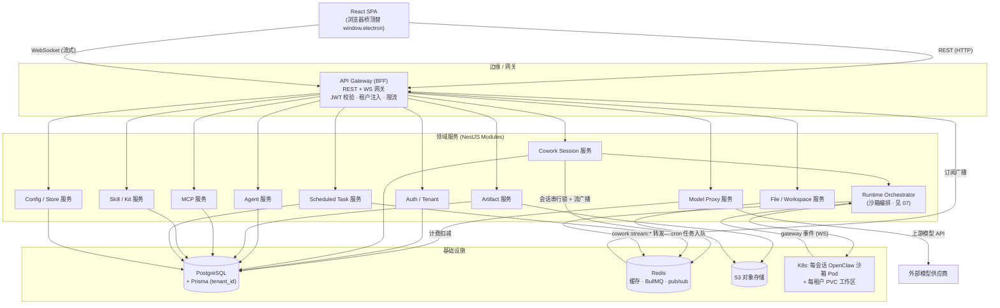
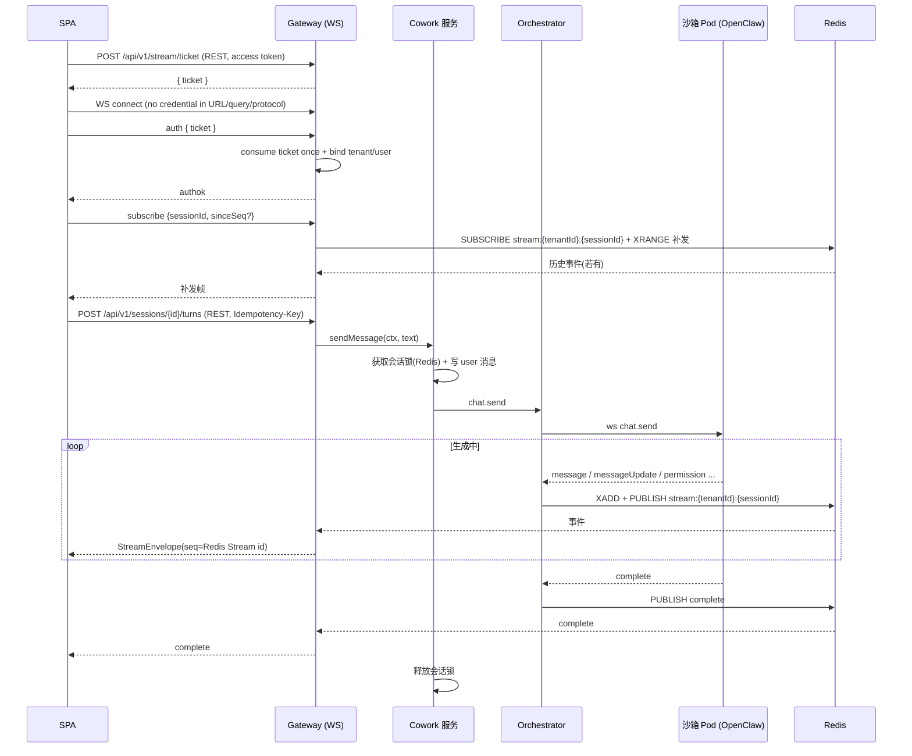

# 后端服务拆分与 API 设计

> 本文档面向后端架构师与服务端工程师，定义 LobsterAI 从「Electron 主进程一体化」改造为「多租户 SaaS 后端」时的服务边界、模块拆分策略、REST 资源约定、WebSocket 流式协议与并发一致性方案。它是 03（前端与传输层）与 07（OpenClaw 运行时编排）之间的「服务端契约层」文档。完整的 IPC→REST/WS 逐条映射见 `附录A-IPC通道与接口映射.md`；目标整体架构与技术选型见 `02-目标架构与技术选型.md`。**契约事实源见附录 C D1**：字段级 DTO / 事件 payload 一律以 `libs/shared/contracts`（OpenAPI 3.1 + AsyncAPI 2.6）为权威，本文与附录 A 降级为「导航与任务清单」，代表性 schema 见附录 C §3。

---

## 0. 一句话背景与本文范围

现状（计数以附录 C §2 核对值为准，2026-07-08）：渲染层通过唯一桥 `window.electron`（`src/main/preload.ts`）向主进程发起调用，实测 **481 处 / 72 文件**，且组件层直连过半、并非「收口在 services」（见附录 C A4/B10）；主进程 `src/main/main.ts`（约 `11307` 行）注册的 IPC 处理器为 **`main.ts` 内 `ipcMain.handle 211 + on 6 = 217`、全 `src/main` 约 `283`**（旧稿沿用的 `259` 无一对得上，见附录 C B9）；并通过 `webContents.send('cowork:stream:*' 等)` 向渲染器推送流式/事件（`.send(` 调用点约 `51` 处、其中 `webContents.send` 约 `36` 处；去重后 renderer 事件通道约 `29` 个，见附录 C B14）。这一层在桌面端既是「BFF」也是「领域服务」也是「本地运行时宿主」，三者混在一个进程里。

目标：把这批 IPC 处理器（口径见附录 C B9）按业务域拆成一组**无状态、可水平扩展、带 `tenant_id` 隔离**的后端服务；用 REST 承载请求/响应、用 WebSocket 承载流式；把 OpenClaw 运行时从「本进程 fork」外移到「每会话沙箱 Pod」（见 `07-OpenClaw运行时编排与沙箱隔离.md`）。

本文只解决「服务如何拆、API 如何设计、业务逻辑怎么搬」。不重复：认证细节见 `05`，数据模型见 `06`，运行时编排见 `07`，模型代理/计费见 `09`。

---

## 1. 总体服务拓扑

### 1.1 分层原则

采用 **BFF + 领域服务** 两层，NestJS 单体仓（monorepo，`apps/` + `libs/`）起步，按域拆成模块，运行时可先合并部署、后按负载拆分独立进程。这样既复用现有 TS 生态里的类型、协议、测试与纯逻辑资产，又保留后续微服务化的边界。

**物理 deployable 冻结口径（承接 `19`）：**

- PR-0~PR-4 前置与 V1-V3 的物理 app 只有 `apps/web`、`apps/api`、`apps/worker`、`apps/runtime-orchestrator`。本文下文的 `AuthTenantModule`、`CoworkModule`、`ModelProxyModule` 等都是 `apps/api` 内的逻辑模块，不等于独立 `apps/auth` / `apps/cowork` / `apps/modelgw`。
- 镜像名初始统一为 `lobster-web`（或 CDN 静态产物）、`lobster-api`、`lobster-worker`、`lobster-runtime-orchestrator`、`lobster-openclaw-runtime`。V2/V3 不默认拆出 `lobster-gateway`、`lobster-cowork`、`lobster-auth` 等多服务镜像。
- `apps/runtime-orchestrator` 从 PR-0 起单独存在，是因为它持 K8s 写权限和沙箱租约状态；这不是“全面微服务化”的信号。
- V5/V6 或规模化后如需拆 `apps/gateway`、`apps/cowork`、`apps/auth`、`apps/modelgw`，必须先有 RFC、指标证据与 Helm/CI 矩阵更新；不能让文档、镜像和 service 名称提前漂移。

- **BFF/API Gateway 层**：面向前端 SPA 的统一入口。负责鉴权（JWT 校验、租户上下文注入）、请求校验、限流、REST 路由、WebSocket 网关、聚合。**不含核心业务逻辑**，只做编排与协议转换。
- **领域服务层**：每个域一个 NestJS Module。持有业务逻辑（大量从 `main.ts` 抽取），通过 Prisma 访问 Postgres、通过 Redis 做缓存/pub-sub、通过「运行时编排服务」与 OpenClaw 沙箱 Pod 通信。
- **横切基础设施**：Postgres(Prisma)、Redis(缓存+BullMQ+pub/sub)、S3(对象存储)、Kubernetes(沙箱编排)、OIDC/JWT(鉴权)、OTel(可观测)。

### 1.2 拓扑图



关键数据流（对话流式）：`SPA -WS-> GW -> COWORK(写库+加会话锁) -> ORCH -> 沙箱Pod(OpenClaw gateway ws) -> 事件回 ORCH -> XADD + PUBLISH 到 Redis Stream/PubSub channel stream:{tenantId}:{sessionId} -> GW 订阅并推给对应 WS 连接`。不得使用无租户前缀的 `session:{id}` / `session:{sessionId}` 频道；该键名同时受 `14` 的 PEN-ISO-5 检查约束。

---

## 2. 后端模块拆分（对应全部 IPC handler 的域）

下表把全部 IPC handler（计数见附录 C B9）的域映射到目标 NestJS 模块。列「搬迁难度」区分「纯 Node 直接搬」「需适配」「必须重写」（详见第 3 节）。「GA 主线」列标注是否进入 V1-V6 GA 主线（IM 与 computer-use 见 `13-功能取舍与降级清单.md`）。

| 目标模块 | 覆盖 IPC 域 | 现状核心文件 | 主要职责 | 搬迁难度 | GA 主线 |
|---|---|---|---|---|---|
| **AuthTenantModule** | `auth:*` | `authQuota.ts`、`authLocalCallbackServer.ts`、`authCallbackRouter.ts`、`endpoints.ts` | OIDC 登录、JWT 签发、租户/用户、配额读取 | 重写为主 | ✔ |
| **CoworkModule** | `cowork:session:*`、`cowork:config:*`、`cowork:memory:*`、`cowork:dreaming:*`、`cowork:bootstrap:*`、`cowork:permission:*`、`cowork:media:*` | `coworkStore.ts`、`agentEngine/coworkEngineRouter.ts`、`agentEngine/openclawRuntimeAdapter.ts` | 会话/消息 CRUD、上下文用量、权限响应、连续性胶囊、记忆、流式编排 | 迁移语义/测试，重写 PG/RLS 多租户数据层 | ✔ |
| **AgentModule** | `agents:*` | `agentManager.ts` + `coworkStore.ts` 的 `agents` 表 | Agent CRUD、预设安装、绑定工作区 | 语义可搬；数据访问随 `coworkStore→PG` 重写 | ✔ |
| **ArtifactModule** | `artifact:*`、`htmlShare:*`、`localWebServices:*` | `artifactParser.ts`(渲染层)、`htmlPreviewServer.ts` | 产物解析/去重、预览会话、HTML share | 重写预览服务 | ✔ |
| **FileWorkspaceModule** | `dialog:*`、部分 `shell:*` | 分散在 `main.ts` | 工作区文件读写、上传/下载、缩略图 | 重写（走 S3/PVC） | ✔ |
| **ModelProxyModule** | `api:stream`、`get/save/check-api-config`、`auth:getModels`、`media:*`、`generate-session-title` | `coworkModelApi.ts`、`coworkOpenAICompatProxy.ts` | 模型目录、格式转换、上游代理、计费扣减 | 纯转换/URL helper 可搬；本地 HTTP 代理外壳与计费门控重写 | ✔ |
| **AsrModule** | `asr:*` | `src/main/ipcHandlers/asr/handlers.ts`、`src/renderer/services/voiceInput/realtimeAsrClient.ts` | 实时 ASR 会话、浏览器采音流接入、上游 ASR 代理、计费/限流接入 ModelProxy/Billing | 桌面通道外壳重写；浏览器 MediaRecorder + 服务端 ASR stream，字段契约见 `09`/附录 A | ✔ |
| **McpModule** | `mcp:*` | `mcp/mcpStore.ts`、`mcp/mcpRuntime.ts` | MCP 服务器 CRUD、启动决议、marketplace | 部分重写（stdio 需沙箱） | ✔ |
| **SkillModule** | `skills:*`、`kits:*` | `skillManager.ts` | 技能同步/安装/安全扫描、Kit store | 部分重写（Electron/fs/PATH/安装执行逻辑） | ✔ |
| **ScheduledTaskModule** | `scheduledTask:*` | `scheduledTask/cronJobService.ts` | 定时任务 CRUD、cron 编排、运行历史 | 解析/映射 helper 可搬；调度权威重写为 BullMQ+PG | ✔ |
| **ConfigStoreModule** | `store:*`、`cowork:config:*`、`enterprise:getConfig` | `sqliteStore.ts` kv 表 | 租户级 KV、企业配置 | KV 语义可搬；存储/RLS/租户 scope 重写 | ✔ |
| **PluginModule** | `plugins:*` | `user_plugins` 相关 | 插件安装/启停/配置 | 部分重写 | ✔ |
| **OrchestratorModule** | `openclaw:engine:*`、`openclaw:session:patch`、`openclaw:dataMigration:*`、`openclaw:sessionPolicy:*` | `openclawEngineManager.ts`、`openclawConfigSync.ts` | 沙箱 Pod 生命周期、config sync、gateway 连接 | 重写编排 + Config Sync 渲染链路化 | ✔（见 07） |
| **ImModule** | `im:*`、`feishu/dingtalk:install:*` | `im/imGatewayManager.ts` | IM 网关/多实例 | **后续** | ✘ |
| （不做） | `openclaw:browser:*`、computer-use | `computerUse/` | 桌面自动化/后台浏览器 | **不做** | ✘ |
| （降级/移除） | `window-*`、`shell:*`、`clipboard:*`、`app:*`、`log:*`、`appUpdate:*`、`permissions:*`、`github-copilot:*`、`openai-codex-oauth:*` | 分散 | Electron 专属能力；第三方 OAuth 代持为 GA 后续 | 见 `13` 降级清单 | 部分 |

> 域计数依据附录 A 事实清单与附录 C §8 契约清单；主进程 handler 总数为 `main.ts` 内 `211 handle + 6 on = 217`、全 `src/main` 约 `283`（旧稿的 `259` 作废，见附录 C B9；42 个 `im:*` handler 全内联在 `main.ts`），其中相当一部分（`window-*`/`shell:*`/`clipboard:*`/`log:*` 等 Electron-only）在 web 化后被浏览器原生能力取代或降级，不进入领域服务，故领域模块承载的是「可移植 + 需适配 + 需重写」子集。

### 2.1 BFF 与领域服务边界

- BFF（Gateway）**只做**：JWT 验证与 `tenant_id/user_id` 注入、DTO 校验（使用 `libs/shared/contracts` 生成的 Zod/validator；如包成 Nest pipe 也不得另写 `class-validator` DTO 事实源）、REST 路由到领域服务、WebSocket 连接管理与消息帧编解码、限流、审计日志埋点、错误结构统一。
- 领域服务**只做**：业务规则 + 数据访问 + 与 OpenClaw 沙箱交互。**领域服务永远从上下文取 `tenant_id`，绝不信任前端传入的租户标识**。
- 边界纪律：BFF 不直接写 Prisma；领域服务不直接持有 WS 连接对象（它们把流式事件发布到 Redis，由 Gateway 消费后下发）。这条纪律使领域服务无状态、可横向扩容。

---

## 3. main.ts 业务逻辑抽取策略

`main.ts`（约 `11307` 行，见附录 C B15）是最大的迁移难点。策略：**逐 handler 分类 → 纯逻辑抽库 → Electron 依赖重写**。切忌整文件搬运。

### 3.1 三类划分标准

| 类别 | 判定标准 | 处理方式 |
|---|---|---|
| **A. 纯 Node 可直接搬** | 只依赖 `fs`(相对沙箱可容器化)、`crypto`、`path`、纯计算，不触碰 `electron` 的 `app/shell/dialog/BrowserWindow/webContents`，且不绑定单机 SQLite/本地 state dir | 抽成 `libs/*` 纯函数/service，加 `tenant_id` 参数与查询过滤 |
| **B. 需适配** | 逻辑可复用但有本地路径/单机假设（`app.getPath('userData')`、`127.0.0.1` loopback、单一 SQLite 文件） | 复用算法，替换 IO 层：存储→Prisma、路径→租户命名空间、loopback→Pod 内 Service DNS |
| **C. 必须重写** | 强依赖 Electron 桌面能力：`dialog.showOpenDialog`、`shell.openExternal`、`clipboard`、`BrowserWindow`、原生窗口/托盘/自启、本地 http 预览 server | 用 web 等价物重写或列入降级清单（`13`） |

### 3.2 可迁移语义与可直接复用的纯逻辑

这些是复用价值最高的资产，但需区分「语义/测试可迁移」与「代码可直接复用」。凡绑定 `better-sqlite3`、Electron `app.getPath()`、本地 state dir 或单租户假设的实现，**不得按文件直接搬运**。

- **`coworkStore.ts`（`3044` 行）** — 会话/消息/胶囊/记忆的 CRUD、序列化、排序与回放语义可迁移，行为测试和 fixture 应作为服务端重写的验收基线；**实现必须重写**为 Prisma/Postgres/RLS/多租户数据访问层，不延续 `better-sqlite3` 或单机 SQLite 连接模型。`getDefaultWorkingDirectory()`（`src/main/coworkStore.ts:37`）改为「`workspaceId` + `project/` 内 `relRoot`」二元组（挂载/租约单位是目标工作区 `tenants/{tenantId}/ws-{workspaceId}`；旧 `workspace-{agentId}` / `workspace-main` 只作迁移映射来源，用户可见 cwd 只在 `project/` 子树内，见 `08` 与附录 C D5）；`addMessage` 的 UUID + 展示序分配语义保留，但在 Postgres 事务/会话锁内实现，且游标仍以 `(created_at, id)` 为权威（见附录 C D10）。**注意**：文件顶部 `import { app } from 'electron'`（`src/main/coworkStore.ts:3`）只用于取 userData 路径，服务化后移除该依赖，路径通过租户工作区服务注入。
- **`openclawConfigSync.ts`（`3502` 行）** — `openclaw.json` + 工作区 `AGENTS.md/MEMORY.md` 的字段语义、golden fixture 与纯转换测试可迁移；**不能把现有文件按“纯渲染逻辑直接搬”处理**。目标是重写为 `runtime-orchestrator` 内的 `config-sync` entrypoint / initContainer 渲染链路：输入来自 PG/服务上下文，输出分流到 Pod `/state/openclaw.json`（每会话动态配置）与 PVC `/workspace/state/*`（`AGENTS.md`/`MEMORY.md` 等托管工作区文件），所有读取都带 `tenant_id` 与服务端授权边界（见 `07`/`08`）。`safeServerKey`、`lowercaseHeaderKeys`、`buildOpenClawMcpServers` 等无状态 helper 可逐个复用，但必须脱离 live getter、本地 state dir 与 Electron 依赖；独立 `apps/configsync` / `lobster-configsync` 只能按 `19` 走后续 RFC。
- **`agentManager.ts`（`78` 行）** — 现状只是 `CoworkStore` 的薄包装，`list/create/update/deleteAgent` 最终仍落 SQLite `agents` 表；可迁移的是 preset 安装、默认模型补齐、工作区字段 trim 等语义，**不能把 AgentModule 写成独立于 `coworkStore→PG` 的“直接搬”**。目标态 agent 数据访问随 `coworkStore→PG 重写` 一起进入 Prisma/PG/RLS（见 `06` §3.5、附录 C D15）。
- **`cronJobService.ts`（`972` 行）** — schedule 形状映射、`isInternalScheduledTaskJob`、`safeFiniteNumber`、delivery-only error 判定等 helper 可抽库复用；但文件顶层依赖 `BrowserWindow`，运行路径通过 gateway `cron.*` RPC、15s 轮询和 IPC `webContents.send`，目标态调度权威已改为「BullMQ repeatable job + Postgres runs + Orchestrator 唤起会话」（见 `11-定时任务调度.md`、附录 C D14）。因此只能复用语义/测试，不能按服务文件直接搬。
- **`coworkModelApi.ts`（`159` 行）** — 纯格式转换/URL 构建/错误提取：`buildAnthropicMessagesUrl`（`src/main/libs/coworkModelApi.ts:44`）、`normalizeGeminiBaseUrl`（`:58`）、`extractApiErrorSnippet`（`:87`）、`extractTextFromAnthropicResponse`（`:116`）等可按函数抽入 `libs/shared/model-proxy`；落地前仍须去除 main 进程上下文、补齐 provider fixture 与计费错误映射测试，不能把整文件标成“零改动直接搬”。
- **`coworkOpenAICompatProxy.ts`（`2991` 行）** — OpenAI↔Anthropic/Gemini 消息转换、tool-call 状态机、Gemini schema 清洗等**纯转换段**可按函数抽取并用 golden fixture 锁定；但整文件还包含本地 HTTP proxy/server、loopback/Host/DNS rebinding 防护、AbortController 与 Electron main 生命周期假设，**不得按整文件直接搬**。目标态外壳必须重写为 ModelProxyModule HTTP 处理器与计费/审计/租户鉴权链路（见 `09-模型代理与计费.md`），或作为沙箱内受控 sidecar/RPC 组件另行 RFC。
- **`artifactParser.ts`（渲染层）** — 产物解析与去重（`dedupeArtifactsForDisplay` 的 `file:/url:/name:` 身份键）是纯逻辑，前端继续用；后端 ArtifactModule 复用同一套去重规则，产物路径从本地 `file://` 改为 S3 URL。
- **各类 `constants.ts`（`src/shared/*`）** — IPC 通道名、状态枚举、协议判别式等 `as const` 常量表：作为 PR-1 建立 `libs/shared/contracts` 时的**现状抽取输入**；目标态 REST 路由、WS 帧 `type`、错误码和 DTO 的字段级权威仍是 contracts 生成物。常量必须集中管理，满足 `AGENTS.md` 的字符串常量纪律。

#### 3.2.1 D15 专项证据门：`coworkStore` 与 `openclawConfigSync`

这两块是 V2/V4 的关键路径，不按普通“抽库”处理。进入正式实现前必须先完成 spike 与证据包：

| 证据 | `coworkStore.ts` 要求 | `openclawConfigSync.ts` 要求 |
|---|---|---|
| 代码依赖盘点 | 列出 `better-sqlite3`、Electron `app`、本地路径、隐式全局状态、`db.prepare` 语义；标注每项新归宿 | 列出 Electron `app`、live getter、state dir、workspace 文件、secret/env 注入、本地落盘副作用；标注服务化归宿 |
| Golden fixtures | 从桌面测试库导出会话/消息/胶囊/记忆/agent 样本，断言 PG 读取结果、排序、分页、fork、压缩语义一致 | 固定 agents/providers/mcp/skills/channels/cron 输入，生成桌面版与服务版 `openclaw.json` + `AGENTS.md/MEMORY.md` diff，允许差异必须白名单化 |
| 迁移核对 | 与 `06` 导入包协议共享 `legacy_id -> new_uuid` 映射与行数/引用核对；失败不得静默跳过 capsule/goal | 与 `07/08` 核对配置写入位置：initContainer、PVC state、Secret/env、workspace 文件；热更/重建边界逐项列明 |
| 风险缓冲触发 | 任一核心 SQL 语义无法用 Prisma 等价表达、分页/sequence fixture 不等价、RLS 导致查询大改，即从 20pd P50 切到 30-40pd 高风险档 | 任一 live getter 依赖运行时状态、配置中途变更无法定义生命周期、golden diff 大面积非白名单，即从 20pd P50 切到 30-40pd 高风险档 |
| 验收证据 | 单元 + Testcontainers PG/RLS 集成 + 导入 dry-run 报告 + 关键查询 explain | golden fixture diff 报告 + 沙箱 Pod 启动实测 + config 变更 drain/rebuild 决策表 |

上述证据未齐时，V2 只能做 mock service 或接口壳，不能宣称 `coworkStore→PG 重写` / `Config Sync 渲染链路化` 完成；V4 不能把配置注入当作已验证前提。

### 3.3 必须重写（C 类）

| 现状 | 依赖 | 重写方向 |
|---|---|---|
| OAuth loopback（`authLocalCallbackServer.ts` 127.0.0.1 回调） | 本地 HTTP + `crypto` state | 标准 web OIDC redirect（见 `05`） |
| `dialog:selectDirectory/selectFile*`、`saveInlineFile`、`readFileAsDataUrl` | Electron `dialog` + 本地 fs | `selectDirectory` 改工作区树浏览；`selectFile*` / `saveInlineFile` 写入服务端工作区（`POST /api/v1/workspaces/:wid/files/upload` 或大文件直传）；`readFileAsDataUrl` 走 `download?as=url` 后由桥适配回 data URL（见 `08`） |
| `shell:openExternal/openPath/showItemInFolder` | Electron `shell` | 浏览器 `window.open` / 不适用 |
| `clipboard:*` | Electron `clipboard` | 浏览器 `navigator.clipboard` |
| `htmlPreviewServer.ts` 本地预览 server | 127.0.0.1 http + token | 服务端沙箱化预览域名 + 短期 token（见 `12-Artifacts与预览改造.md`） |
| `openclawEngineManager.ts` fork/utilityProcess | Electron `utilityProcess`、本地端口扫描、CLI shim、compile cache | K8s Pod 编排 + Service DNS + Secret 注入 token（见 `07`） |
| `window-*`、`app:relaunch/autoLaunch/preventSleep`、`log:*` | Electron 窗口/系统 | 移除或降级（`13`） |
| MCP `stdio`（本地 `npx` 子进程，`mcpRuntime.ts` `spawn()`） | 本地进程 | 落到会话沙箱 Pod 内执行（见 `07`/`10`）；`sse`/`http` 传输可直接由服务端调用 |

### 3.4 抽取执行步骤（每个 handler）

1. 在 `main.ts` 定位 handler，判定 A/B/C 类。
2. A/B：把 handler 内部逻辑抽成 `libs/<domain>/<name>.ts` 纯函数或 NestJS provider 方法，签名加 `ctx: { tenantId, userId }`。
3. 为该逻辑写单元测试（Vitest，见 `16-测试策略与验收标准.md`），先在旧代码路径保证行为不变。
4. 在 NestJS Controller/Gateway 里挂接 REST/WS，Controller 只做「取上下文 → 调 service → 返回统一响应」。
5. C 类：在前端浏览器桥（`03`）实现 web 等价，或标注降级（`13`）。

---

## 4. REST 资源设计约定

### 4.1 命名与版本化

- 统一前缀：`/api/v1/...`。破坏性变更升 `/api/v2`；非破坏性字段增量走 API `v1`。
- 资源用**复数名词**、kebab 语义、层级化；以下例子均带正式前缀：`/api/v1/sessions`、`/api/v1/sessions/{id}/messages`、`/api/v1/agents`、`/api/v1/mcp/servers`、`/api/v1/scheduled-tasks`、`/api/v1/skills`、`/api/v1/artifacts`。
- 动作类（非纯 CRUD）用子资源 + POST：`POST /api/v1/sessions/{id}/stop`、`POST /api/v1/sessions/{id}/fork`、`POST /api/v1/sessions/{id}/compact-context`、`POST /api/v1/sessions/{id}/permissions/{requestId}/respond`。避免动词 URL 满天飞，但显式动作优先于晦涩的 PATCH 语义。**禁止冒号式 action path**（如 `/sessions/{id}:exportText`、`/model/config:check`、`/runtime:restart`）；附录 A 里的零散动作也必须改成子资源路径。
- **租户不入 URL**：`tenant_id` 从 JWT 解出，注入请求上下文；URL 里只出现资源 ID。防止越权与 URL 泄露租户。

### 4.2 鉴权

- 所有 `/api/v1/*` 需 `Authorization: Bearer <JWT>`（OIDC 签发，见 `05`）。
- Gateway 全局 `AuthGuard` 校验签名/过期/受众，解出 `{ tenantId, userId, scopes }` 放入 `AsyncLocalStorage` 请求上下文。
- 资源级授权：领域 service 查询一律 `where: { tenantId, ... }`；对「资源属于该租户下某用户」的场景（如私有会话）再叠加 `userId`。所有 tenant-scoped 表按附录 C D2 **强制** `ENABLE ROW LEVEL SECURITY` + `FORCE ROW LEVEL SECURITY`，每请求事务内 `SET LOCAL app.tenant_id/app.user_id`；应用层 Prisma tenant extension 与 service 校验只是纵深补充，不能替代 RLS（见 `06`/`14`）。

### 4.3 分页

沿用现有页大小常量（`COWORK_SESSION_PAGE_SIZE`、`COWORK_MESSAGE_PAGE_SIZE`，`src/shared/cowork/constants`）作为默认值，统一游标分页优先（消息按**不可变复合游标 `(created_at, id)`** 稳定排序，避免 OFFSET 漂移；`sequence` 可空且 insert-before 会 shift 重排，不能作游标键，见附录 C D10）：

```
GET /api/v1/sessions?limit=50&cursor=<opaque>
GET /api/v1/sessions/{id}/messages?limit=30&cursor=<opaque>&direction=backward
```

响应信封：

```jsonc
{
  "data": [ /* items */ ],
  "page": {
    "nextCursor": "b64(created_at,id)",  // 编码不可变键 (created_at, id)；null 表示到底
    "hasMore": true,
    "limit": 50
  }
}
```

> 消息分页游标改用**不可变复合键 `(created_at, id)`**（现状排序已用 `COALESCE(sequence, created_at), created_at, ROWID` 兜底，`sequence` 仅作展示序、不作游标键，见附录 C D10）；`direction=backward` 用于「向上加载更早消息」；存量会话导入时 NULL `sequence` 保留、一律以 `(created_at, id)` 兜底。

### 4.4 统一错误结构

```jsonc
{
  "error": {
    "code": "SESSION_BUSY",           // 稳定机器码，来自 libs/shared/contracts/src/errors.ts
    "message": "Session is busy",      // 非权威 fallback/debug 文案，前端展示按 code 本地化
    "requestId": "req_01H...",         // 关联 OTel trace
    "details": { "sessionId": "..." }  // 可选，结构化上下文
  }
}
```

- HTTP status 由响应状态码承载，不放入错误 body；每个 `code` 对应的 `httpStatus`、可重试性、展示策略与 `details` schema 定义在 `libs/shared/contracts/src/errors.ts`（附录 C D1 / §3）。
- `code` 可参考现有错误分类思路（`classifyErrorKey` 当前在 `src/common/coworkErrorClassify.ts`，见附录 C §2），但目标态必须沉淀到 `libs/shared/contracts/src/errors.ts` 的稳定大写 snake case 枚举；前端据 `code` 做本地化与重试决策，不依赖 `message` 字符串匹配。
- REST 错误 `message` 只是非权威 fallback/debug 文案，不作为业务分支或 SPA 用户文案来源；SPA 用户可见错误由前端按 `code` + `details` 走 `errors.*` 词典渲染（见 `03` §9.2）。只有 IM/邮件/通知等**不经 SPA 渲染**的后端直投文案才由后端 i18n 按语言偏好生成。
- HTTP 状态：`400` 校验失败、`401` 未认证、`403` 同租户内角色/动作权限不足且无需隐藏资源存在性、`404` 资源不存在（含跨租户命中或需隐藏存在性的 IDOR/未授权 workspace）、`409` 冲突/会话忙、`422` 语义校验、`429` 限流、`5xx` 服务端。
- **跨租户命中一律返回 `404`**（不是 403），避免探测资源存在性。

### 4.5 幂等

- 所有「会创建资源或触发副作用」的 POST 支持 `Idempotency-Key` 请求头：
  - 发送轮次 `POST /api/v1/sessions/{id}/turns`：以 `Idempotency-Key` 去重，防止网络重试造成重复触发生成。
  - 创建会话/Agent/定时任务同理。
- 实现：Redis 存 `idem:{tenantId}:{key} -> {status, responseHash}`，TTL 24h。命中未完成→返回 `409 IN_PROGRESS`；命中已完成→回放原响应。
- PUT/DELETE 天然幂等；PATCH 需保证多次同参结果一致。

### 4.6 通用约定小结

| 维度 | 约定 |
|---|---|
| 时间 | ISO 8601 UTC 字符串（`createdAt`），毫秒时间戳仅内部用 |
| ID | 服务端生成（uuid v4 或 ksuid），前端不指定资源 ID |
| 字段命名 | JSON `camelCase`；数据库 `snake_case`（Prisma 映射） |
| 空值 | 缺省字段省略而非 `null`（除非 `null` 有语义） |
| 大对象 | 消息内容/产物走引用（S3 URL），不内联超大 payload（见第 6.4 节 30MB 限制） |
| 限流 | 按 `tenantId` + 端点分桶，`429` 带 `Retry-After` |

---

## 5. WebSocket 流式协议

### 5.1 为什么用 WS + Redis pub/sub

现状流式 = 主进程 `webContents.send('cowork:stream:*', payload)` 单向推到本进程渲染器（`src/main/main.ts:2187`、`:2202`、`:4417` 等）。Web 化后：
- 领域服务无状态、可多副本，**不持有** WS 连接；
- OpenClaw gateway 事件在沙箱 Pod，由 Orchestrator 收后**发布到 Redis 频道 `stream:{tenantId}:{sessionId}`**；
- 前端的 WS 连接落在某个 Gateway 副本，该副本**订阅**用户当前关注的会话频道，收到后转发给对应 socket。

这解耦了「事件产生」与「连接归属」，任意 Pod 产生的事件都能送达任意 Gateway 上的连接。

### 5.2 连接与鉴权

- 端点：`wss://<host>/api/v1/stream`。
- 鉴权：连接握手时不放 token 到 URL query（会进日志）；正式方案采用「REST 先换取一次性短期 WS ticket → 连接建立后首帧 `auth` 携带 ticket」。ticket 由 `POST /api/v1/stream/ticket` 用 access token 换取，TTL 30-60s、一次性消费；OpenAPI 请求体字段固定为 `sessions[]` 与 `resourceSubscriptions[]`，ticket 内部 claim 绑定 `tenantId/userId`、由 `sessions[]` 派生的授权会话集合、`resourceSubscriptions/nonce`。不使用 `Sec-WebSocket-Protocol: bearer.<jwt>` 作为正式方案。
- 认证失败 → 服务端发 `protocolError` 帧后关闭（code `4401`）。`protocolError` 只表示 WS 控制面错误，避免与业务流事件 `cowork:stream:error` 的 `type:'error'` 冲突。
- 连接建立后，Gateway 从票据解出 `{ tenantId, userId }`，绑定到该 socket，用于后续订阅授权。

`POST /api/v1/stream/ticket` 的请求体必须进 OpenAPI：`{ sessions?: string[]; resourceSubscriptions?: Array<{ channel:'files:changed'; params:{ workspaceId:string; path?:string } }> }`。签发前服务端逐项校验 session/workspace 归属与当前用户授权，只把通过校验的 scope 写入一次性 ticket；用户级事件（skills/mcp/quota/sessions 等）随 `{tenantId,userId}` 认证自动恢复，不由客户端列入 ticket body。后续 `subscribe` / `subscribeEvent` 帧必须落在 ticket 已授权 scope 内，越权按 §5.4 的不泄露存在性规则处理。

### 5.3 消息帧格式（统一信封）

所有帧 JSON，判别字段 `type`（PR-1 后复用 `libs/shared/contracts` 生成常量；现有 `src/shared/*/constants.ts` 只作为抽取输入，禁止目标实现另写裸字符串）：

```typescript
// 客户端 -> 服务端
type ClientFrame =
  | { type: 'auth';        ticket: string }
  | { type: 'subscribe';   sessionId: string; sinceSeq?: string }
  | { type: 'unsubscribe'; sessionId: string }
  | { type: 'subscribeEvent';   channel: 'files:changed'; params: { workspaceId: string; path?: string }; sinceSeq?: string }
  | { type: 'unsubscribeEvent'; channel: 'files:changed'; params: { workspaceId: string; path?: string } }
  | { type: 'ping';        ts: number }
  | { type: 'ack';         sessionId?: string; channel?: string; seq: string };   // 可选：已消费到的 Redis Stream id / 游标

// 服务端 -> 客户端（对齐附录 C §3 StreamEnvelope）
type StreamEnvelope<TType extends string = string, TData = unknown> = {
  type: TType;                    // 稳定事件类型，非旧 IPC channel 字符串
  version: 1;
  tenantId: string;
  sessionId?: string;
  requestId?: string;
  seq?: string;                   // Redis Stream id 或等价单调游标；非 DB sequence 列(见附录 C D10)
  idempotencyKey?: string;
  emittedAt: string;              // ISO timestamptz
  data: TData;
};

type ServerFrame = StreamEnvelope
  | { type: 'pong'; ts: number }
  | { type: 'authok'; expiresAt: string }
  | { type: 'protocolError'; code: string; message: string; sessionId?: string };
```

`EventType` 与现状 **10 个** `cowork:stream:*`（含原漏的 `cowork:stream:goal`，见附录 C §3.2/B13）+ 参数化 `api:stream:*` + 定时任务/文件/用户级事件映射：

| WS `type` | 现状 send 事件（`main.ts` 参考行） | data 负载 |
|---|---|---|
| `message` | `cowork:stream:message`（`:2187`/`:4417`） | `{ message, beforeMessageId? }` |
| `messageUpdate` | `cowork:stream:messageUpdate`（`:2202`） | `{ messageId, content, metadata? }` |
| `sessionStatus` | `cowork:stream:sessionStatus` | `{ status }` |
| `contextUsage` | `cowork:stream:contextUsage` | `{ usage }` |
| `contextMaintenance` | `cowork:stream:contextMaintenance` | `{ active }` |
| `permission` | `cowork:stream:permission` | `{ request }` |
| `permissionDismiss` | `cowork:stream:permissionDismiss` | `{ requestId }`（`tenantId/sessionId` 位于 `StreamEnvelope` 顶层） |
| `complete` | `cowork:stream:complete` | `{ claudeSessionId? }` |
| `error` | `cowork:stream:error` | `{ error }` |
| `goal` | `cowork:stream:goal`（原漏，见附录 C §3.2/B13） | `{ sessionId, goal }` |
| `apiStreamChunk` | `api:stream:{reqId}:data` | `{ requestId, chunk }` |
| `apiStreamDone` | `api:stream:{reqId}:done` | `{ requestId }` |
| `apiStreamError` | `api:stream:{reqId}:error` | `{ requestId, error }` |
| `apiStreamAbort` | `api:stream:{reqId}:abort` | `{ requestId, aborted: true }` |
| `taskStatus/taskRun/taskRefresh` | `scheduledTask:statusUpdate/runUpdate/refresh` | 任务负载 |
| `filesChanged` | `files:changed`（桥兼容别名 `artifact:file:changed`） | `{ workspaceId, relPath, kind }` |
| `skillsChanged/mcpChanged/quotaChanged/sessionsChanged` | `skills:changed` / `mcp:changed` / `auth:quotaChanged` / `cowork:sessions:changed` | 用户级变更通知负载 |

> 非会话维度事件（`skills:changed`、`mcp:changed`、`auth:quotaChanged`、`sessions:changed` 等）走**用户级频道** `stream:{tenantId}:user:{userId}`，前端连接建立即自动订阅，无需显式 `subscribe`。需要资源过滤的文件事件走 `subscribeEvent {channel:'files:changed', params:{workspaceId,path?}}`。会话级事件走会话频道，按需订阅。计数口径见 §0：`.send(` 调用点约 `51` 处、`webContents.send` 约 `36` 处，去重后 renderer 事件通道约 `29` 个（用户级 + 会话级合计，见附录 C B14），本节按「去重后事件通道」组织，勿把调用点数直接当作 `webContents.send` 或通道数。**wire frame 不使用 `{type:'event', channel}` 包壳；前端桥可在本地把 `type` 映射回旧 IPC channel 回调。**流式事件全集以附录 C §3.2/B13 为准：稳定态由 PR-1 新增的 `CoworkStreamChannel` 注册表导出，并与 `IElectronAPI`/`ElectronBridge` 的 10 个 `onStream*` 方法、AsyncAPI 三方断言一致。`delta/tool/thinking/done/abort` 是非当前前端桥通道或内部/旧口径，不能写入前端 WS 契约；`contextUsage` 的 runtime 内部名 `contextUsageUpdate` 由 adapter 归一。

### 5.4 订阅 / 取消订阅 / 多路复用

- **单条 WS 连接多路复用多个会话**：前端切到某会话 → 发 `subscribe {sessionId}`；离开 → `unsubscribe`。Gateway 据此增减对 Redis 频道的订阅（引用计数，避免重复订阅同频道）。
- 订阅授权：Gateway 校验该 `sessionId` 属于连接绑定的 `tenantId`（查缓存的会话-租户映射），否则拒绝并发不泄露存在性的 `protocolError(code:'NOT_FOUND')` 或关闭连接；不得返回可区分资源存在性的 `PERMISSION_DENIED`。
- 资源订阅授权：`subscribeEvent {channel:'files:changed', params:{workspaceId,path?}}` 必须同时校验 ticket scope、workspace 租户归属、用户/会话对该 workspace 的访问授权；跨租户或未授权 workspace 与不存在同样按 `NOT_FOUND` 类错误或关闭连接处理，不得让 `files:changed` 成为 workspace 存在性探测面。
- **断线补发**：`subscribe` / `subscribeEvent` 可带 `sinceSeq`（Redis Stream id 字符串或等价单调游标），Gateway 从 Redis Stream（`XRANGE`）回放 `> sinceSeq` 的事件（保留最近 N 条/M 秒），实现无缝重连。这要求领域侧把流事件写入 Redis Stream 而非纯 pub/sub（pub/sub 用于实时唤醒，Stream 用于补发）。

### 5.5 心跳

- 客户端每 25s 发 `ping`，服务端回 `pong`；服务端 60s 未收任何帧 → 关闭连接（`4408`）。
- 反向：服务端也可主动 `ping`，兼容浏览器不发原生 ping 的情况。
- 应用层心跳独立于 WS 协议层 ping/pong，便于经过 L7 负载均衡时保活。

### 5.6 流式时序图



---

## 6. 代表性端点示例

> 完整清单见 `附录A-IPC通道与接口映射.md`；此处给出最能体现设计约定的代表端点。字段级 request/response/error/事件 schema 以 `libs/shared/contracts` + 附录 C §3 为权威（见 D1），本节仅示例。

### 6.1 会话 CRUD

```
GET    /api/v1/sessions?limit=50&cursor=...          # 列表(游标分页) ← cowork:session:list
POST   /api/v1/sessions                              # 建会话+首prompt+立即开跑(prompt必填) ← cowork:session:start
POST   /api/v1/sessions/{id}/turns                   # 后续轮次(=continue,独立映射) ← cowork:session:continue
GET    /api/v1/sessions/{id}                         # 详情 ← cowork:session:get
PATCH  /api/v1/sessions/{id}                         # 改名/置顶等 ← rename/pin
DELETE /api/v1/sessions/{id}                         # 删除 ← cowork:session:delete
POST   /api/v1/sessions/{id}/fork                    # 分支 ← cowork:session:fork
POST   /api/v1/sessions/{id}/stop                    # 停止生成 ← cowork:session:stop
POST   /api/v1/sessions/{id}/compact-context         # 压缩上下文 ← compactContext
GET    /api/v1/sessions/{id}/context-usage           # 上下文用量 ← contextUsage
```

创建会话请求/响应（**start = 建会话 + 首 prompt + 立即开跑，`prompt` 必填，不存在「创建空闲会话」，见附录 C §3.3**）：

```jsonc
// POST /api/v1/sessions   Idempotency-Key: <uuid>
{
  "prompt": "重构登录模块",         // 必填：首轮 prompt（缺失即 400）
  "agentId": "main",
  "cwd": { "workspaceId": "11111111-1111-4111-8111-111111111111", "relRoot": "proj-a" }, // relRoot 相对 project/ 子树，见 08
  "model": "claude-...",           // 可选覆盖
  "executionMode": "auto"
}
// 202 Accepted —— 会话已建且首轮已开跑，结果经 WS 会话频道流式返回
{
  "data": {
    "sessionId": "sess_01H...",
    "requestId": "req_01H...",     // 关联 WS 流式帧
    "status": "running",
    "agentId": "main",
    "createdAt": "2026-07-02T08:00:00.000Z"
  }
}
```

> 后续轮次（continue）是**独立映射**，规范名统一为 `POST /api/v1/sessions/{id}/turns`（见附录 C §3.3），与 start 不共用创建语义。`GET /api/v1/sessions/{id}/messages` 只用于消息分页读取，不再承担“触发生成”的写语义。

### 6.2 发送消息触发流式

REST 触发 + WS 收结果（分离控制面与数据面）：

```jsonc
// POST /api/v1/sessions/{id}/turns   Idempotency-Key: <uuid>
// = continue / 后续轮次，独立于 start，见附录 C §3.3
{
  "content": [{ "type": "text", "text": "帮我加单测" }],
  "attachments": [{ "artifactId": "art_..." }]   // 大文件先经 08 上传拿到引用
}
// 202 Accepted —— 表示已入队/开始生成，结果通过 WS 会话频道流式返回
{
  "data": { "userMessageId": "msg_...", "requestId": "req_...", "sessionStatus": "running" }
}
```

- 202 而非 200：明确「异步生成，去 WS 拿流」。
- 客户端应已在该会话 `subscribe`；即便消息先于订阅返回，`sinceSeq` 补发机制保证不丢首帧。

### 6.3 权限响应

现状 `cowork:permission:respond`（`main.ts` 的 `cowork:permission:respond` handler；MCP 工具授权另有第二个 `cowork:stream:permission` 发送点）→ **单端点同时承接工具授权与 AskUser**，请求体对齐源码 `types.ts` 的判别联合 `PermissionResult`（原稿 `decision/scope/allow_always` 三字段在源码中均不存在，见附录 C §3.1/D2）：

```jsonc
// POST /api/v1/sessions/{id}/permissions/{requestId}/respond   （sessionId 走路径，tenantId 取自 JWT 上下文）
// kind:'tool' —— 工具授权（允许）
{ "kind": "tool", "result": { "behavior": "allow", "updatedInput": { } } }
// 拒绝：
{ "kind": "tool", "result": { "behavior": "deny", "message": "用户拒绝", "interrupt": true } }
// 「本次会话始终允许」= 在 updatedPermissions 追加对应 rule（无独立 allow_always 布尔）：
{ "kind": "tool", "result": { "behavior": "allow", "updatedPermissions": [ /* PermissionUpdate rule */ ] } }
// kind:'ask' —— AskUserQuestion（复用同一端点，对应 resolveAskUser / McpBridge）
{ "kind": "ask", "answers": { "q1": "选项A" } }
// 200 OK
{ "data": { "requestId": "...", "applied": true } }
```

- 字段级 `PermissionResult` / `PermissionUpdate` / `AskUserQuestion` 以 `libs/shared/contracts` + 附录 C §3.1 为权威；MCP 授权的第二个 `cowork:stream:permission` 发送点须**复用同一端点**，不另开路由。
- 多副本下用户点「允许」可能落到非持有该会话 gateway 连接的副本：反向路由 + **未命中 requestId 禁止静默 no-op** 见 §7.6 与附录 C D7。
- 对应流式：授予/拒绝后沙箱继续，事件经 `permissionDismiss`（关闭 UI 待办）与后续消息帧回传。

### 6.4 模型代理与配置兼容（api:fetch / api:stream / *-api-config）

参数化流保留 `requestId` 语义（现状 `api:stream:{requestId}:data/done/error/abort`）：

```
POST /api/v1/model/proxy           # 非流式模型代理 ← api:fetch；同样经过鉴权、配额预扣/结算和审计
POST /api/v1/model/stream          # 发起，返回 { requestId }；data/done/error/abort 走 WS apiStream*
POST /api/v1/model/stream/{requestId}/abort   # 取消 ← api:stream:cancel
GET  /api/v1/model/config          # 旧桥 get-api-config 兼容；只返回租户模型配置脱敏视图
PUT  /api/v1/model/config          # 旧桥 save-api-config 兼容；密钥写入归一到 BYOK/secref，不另建密钥库
POST /api/v1/model/config/check    # 旧桥 check-api-config 兼容；禁止 /model/config:check
GET  /api/v1/models                # 模型目录 ← auth:getModels
GET  /api/v1/models/{id}           # 单模型详情（单价/能力/降级链）
GET  /api/v1/pricing/models        # 登录后 pricing-catalog 兼容视图 ← auth:getPricingCatalog
```

- **payload 硬限沿用**：`OPENCLAW_CHAT_SEND_PAYLOAD_LIMIT_BYTES = 30MB`、安全边界 `29.5MB`（`openclawRuntimeAdapter.ts`）。超限在 BFF 层即拦截返回 `413`，附件必须走 S3 引用（见 `08`）。

### 6.5 上下文用量（主动查 + 被动流）

- 主动：`GET /api/v1/sessions/{id}/context-usage` 返回一次快照。
- 被动：生成过程中经 WS `contextUsage`/`contextMaintenance` 帧推送，前端据此渲染进度与「压缩中」状态。

---

## 7. 并发与一致性

### 7.1 同一会话串行化

现状是单进程天然串行；分布式后必须显式加锁，否则同一会话并发发消息会导致 OpenClaw 会话状态错乱、消息 sequence 冲突。

- **会话级分布式锁**：Redis `SET lock:session:{tenantId}:{sessionId} <token> NX PX <ttl>`（Redlock 语义）。发送消息/停止/分叉/压缩等「会改会话运行状态」的操作先抢锁。
- 抢锁失败 → REST 返回 `409 SESSION_BUSY`（前端提示「生成中」），或按业务排队（见下）。
- 锁 TTL 需大于单轮生成上限（对齐 `OPENCLAW_AGENT_TIMEOUT_SECONDS ≈ 3600`），并用**看门狗续期**（生成中每隔 T 续 TTL），防止长任务锁提前过期。
- 生成结束/异常/连接断开 → 释放锁（用 token 校验的 Lua 脚本删除，避免误删他人锁）。

### 7.2 消息序号与写入一致性

- **分页/去重游标 = 不可变复合键 `(created_at, id)`，不用 `sequence`**（见附录 C D10）：现状 `sequence` 可空、按 `SELECT COALESCE(MAX(sequence),0)+1` 赋值、insert-before 会 shift 重排（`coworkStore.ts`），**不是稳定键**；`sequence` 仅保留为展示序，现状排序已用 `COALESCE(sequence, created_at), created_at, ROWID` 兜底。消息写入仍在**持锁的写路径** + Postgres 事务内完成、`UNIQUE(session_id, ...)` 兜底以避免竞态；`cowork_messages` V1 不做声明式分区（见附录 C D10）。
- `replaceConversationMessages`（gateway 同步覆盖 user/assistant、保留 tool_*/system）等敏感写在事务内完成，保证前端分页不读到半更新状态。
- WS 帧的 `seq` 是 **Redis Stream id 或等价单调游标（字符串，不是 number）**，与 DB 分页游标 `(created_at, id)` 解耦、也不再与可变的 `sequence` 列绑定；前端据 `seq` 去重、检测缺口并触发 `subscribe sinceSeq` 补发。

### 7.3 流式广播（Redis pub/sub + Stream）

```mermaid
flowchart LR
  POD["沙箱 Pod (OpenClaw)"] -->|gateway 事件| OR["Orchestrator"]
  OR -->|XADD stream:{tenantId}:{sessionId}| STREAM[("Redis Stream<br/>(补发缓冲, 保留窗口)")]
  OR -->|PUBLISH stream:{tenantId}:{sessionId}| PUBSUB[("Redis Pub/Sub<br/>(实时唤醒)")]
  PUBSUB --> GW1["Gateway A (订阅者)"]
  PUBSUB --> GW2["Gateway B (订阅者)"]
  GW1 -->|WS| C1["SPA 连接1"]
  GW2 -->|WS| C2["SPA 连接2 (多端同看)"]
  STREAM -.->|重连补发 XRANGE| GW1
```

- **pub/sub 负责实时**、**Stream 负责补发/多端一致**。Stream 每会话保留最近窗口（如 5 分钟或 500 条），供断线重连与「多端同看」新连接补齐。
- 幂等消费：帧带 `seq`，客户端与 Gateway 均据 `seq` 去重，pub/sub 与 Stream 双通道即便重复也不影响正确性。

### 7.4 缓存一致性

- 读多写少的元数据（会话-租户映射、Agent 配置、模型目录）在 Redis 缓存，写路径**主动失效**（`DEL` 或版本号 bump），不用长 TTL 兜脏读。
- `store:*`/`cowork:config:*` 走 Postgres 为准，Redis 只做热点缓存；配置变更后发用户级 `configChanged` 流事件让前端刷新。

### 7.5 异步任务（BullMQ）

- 长耗时/可后台化的工作用 BullMQ 队列：会话标题生成（`generate-session-title`）、技能安全扫描、MCP 启动决议探测、定时任务触发（见 `11`）、记忆 dreaming（cron）。
- 队列同样按 `tenantId` 打标，便于配额与优先级；worker 幂等（job id = 业务键）。

### 7.6 控制面反向路由（会话↔owning-replica，禁止静默 no-op）

「领域服务无状态」只对**前向事件流**（Pod→Redis→任意 Gateway，包括 `permissionDismiss` 这类关闭 UI 待办事件）成立；对**回指某活跃会话**的反向命令（`respondToPermission` / `stopSession` / `compactContext` / `chat.send` 等）存在会话亲和——这些命令必须送达**持有该会话 gateway 连接的那个 Orchestrator 副本**，否则会被静默吞掉（现状 `coworkEngineRouter.ts` 对未知 requestId 直接 `return`，多副本下会造成生成永久挂起）。落地按附录 C D7：

- 维护 **Redis 会话→owning-replica 注册表**：复用 `07` 的 `rt:session:{tenantId}:{sessionId}` 会话路由记录，并在该记录内维护 `owningReplicaId` / `commandChannel` 字段；不得另起 `owner:session:*` 第二套 key（会绕过 `14`/`16` 的 PEN-ISO-5 runtime key 前缀检查）。每副本订阅自己的命令通道；BFF 收到反向命令后查注册表、经该副本命令通道下发。
- 所有反向命令的命令信封或路由元数据补 `sessionId` + `tenantId`（tenantId 取自 JWT 上下文，绝不信前端）；前向事件 payload 保持旧桥兼容形状，`tenantId/sessionId` 位于 `StreamEnvelope` 顶层。
- **未命中 requestId / owning-replica 时禁止静默 no-op**：返回可路由错误（如 `409 SESSION_NOT_OWNED` / `410`）或经总线转发重投，由前端重试或提示，杜绝「点了允许却永久挂起」。

---

## 8. 与其他文档的边界

| 关注点 | 本文负责 | 交由其他文档 |
|---|---|---|
| 服务如何拆、API 契约 | ✔ | — |
| 逐条 IPC→REST/WS 映射 | 代表示例 | `附录A`（完整清单） |
| 浏览器桥如何顶替 `window.electron` | 协议侧约定 | `03-前端与传输层改造.md` |
| OIDC/JWT/租户模型细节 | 只述鉴权约束 | `05-认证与多租户账户.md` |
| SQLite→Postgres 表结构与迁移 | 只述 Prisma+tenant 原则 | `06-数据模型迁移.md` |
| 沙箱 Pod 生命周期、config sync 落地、gateway 连接 | 只述 Orchestrator 边界 | `07-OpenClaw运行时编排与沙箱隔离.md` |
| 文件上传/下载/工作区存储 | 只述 File 模块职责 | `08-文件工作区与对象存储.md` |
| 模型格式转换/上游代理/计费扣减 | 只述模块归属与限额 | `09-模型代理与计费.md` |
| MCP/Skill 沙箱执行细节 | 只述模块与传输取舍 | `10-MCP与技能改造.md` |
| 定时任务 cron→BullMQ 落地 | 只述队列思路 | `11-定时任务调度.md` |
| Artifacts 预览沙箱化 | 只述模块归属 | `12-Artifacts与预览改造.md` |

---

## 9. 验收标准

- [ ] 全部 IPC handler（口径见附录 C B9：`main.ts` `211 handle + 6 on = 217`、全 `src/main` 约 `283`，旧稿 `259` 作废）完成 A/B/C 分类，并对齐附录 C §8 契约清单；每个「进入 GA 主线」的域都有对应 NestJS Module 与至少一条端到端可用端点。
- [ ] 所有 REST 端点：走 `/api/v1` 前缀、JWT 鉴权、`tenantId` 从上下文注入且服务层查询强制过滤、统一错误信封、游标分页信封。
- [ ] 副作用型 POST 支持 `Idempotency-Key`，重复请求不产生重复副作用（有测试覆盖）。
- [ ] WS：可用票据鉴权、`subscribe/unsubscribe/subscribeEvent/unsubscribeEvent/ping/pong/ack` 帧、`sinceSeq` 断线补发、单连接多会话多路复用；**10 个** `cowork:stream:*` 事件（含原漏的 `cowork:stream:goal`，全集以附录 C §3.2/B13 和 PR-1 `CoworkStreamChannel` 注册表为准）与用户级事件均能正确路由到对应连接；契约测试断言注册表、`IElectronAPI`/`ElectronBridge.onStream*` 与 AsyncAPI 三方一致。
- [ ] 同一会话并发发送：第二个请求得到 `409 SESSION_BUSY`（或正确排队），不出现 sequence 冲突或 OpenClaw 会话错乱。
- [ ] 跨租户访问任意资源返回 `404`，无法探测存在性（含渗透测试用例，见 `14`）。
- [ ] 领域服务无状态（限定口径）：任意副本重启/扩缩容不得丢已提交的**前向**事件，也不得吞**反向**命令；前向事件经 Redis 广播、重连补发无缺口/重复，反向命令（权限/停止/压缩）经会话→owning-replica 注册表路由，**未命中 requestId 返回可路由错误或经总线转发、禁止静默 no-op**（见 §7.6 / 附录 C D7）。若副本重启命中持有 gateway 连接的 owning-replica 并中断 active turn，按 `07` AC-8 / 附录 C D9 的受限续接口径处理：至多丢当前 turn，历史消息与工作区零丢失，前端提示重连/重试。
- [ ] `coworkStore`/`openclawConfigSync` 的语义迁移与行为测试基线通过，且服务端实现已重写为 PG/RLS/多租户数据层与 `runtime-orchestrator` 内的 Config Sync 渲染链路；`coworkModelApi` 与 `cronJobService` 的 schedule/内部任务/错误归类等可复用 helper 抽库后行为与桌面版一致（Vitest 覆盖关键路径，见 `16`）。

---

## 10. 风险与缓解（本域）

| 风险 | 说明 | 缓解 | 详见 |
|---|---|---|---|
| `main.ts` 抽取遗漏隐式副作用 | 约 11307 行里 handler 常顺带改全局状态/触发其他 send | 逐 handler 分类 + 抽库前后行为快照测试 | `16`、`18` |
| 会话锁与生成超时不匹配 | 长任务锁过期导致并发闯入 | 看门狗续期 + TTL 对齐 3600s 超时 | 本文 §7.1 |
| 流式补发窗口不足 | 弱网重连丢首帧 | Redis Stream 保留窗口 + `sinceSeq` | 本文 §5.4 |
| 大 payload 冲击 WS/服务 | 30MB 限制原为单机 | BFF 层 `413` 拦截 + 附件走 S3 引用 | `08`、`09` |
| stdio MCP/技能子进程 | 服务端不能直接 `spawn` 本地 | 落沙箱 Pod 执行 | `07`、`10` |
| 错误码字符串漂移 | 前端按 message 匹配脆弱 | `code` 用 `libs/shared/contracts/src/errors.ts` 的共享枚举 | 本文 §4.4 |

---

（本文完。逐条接口映射见 `附录A-IPC通道与接口映射.md`；术语见 `附录B-术语表与阅读指南.md`。）
