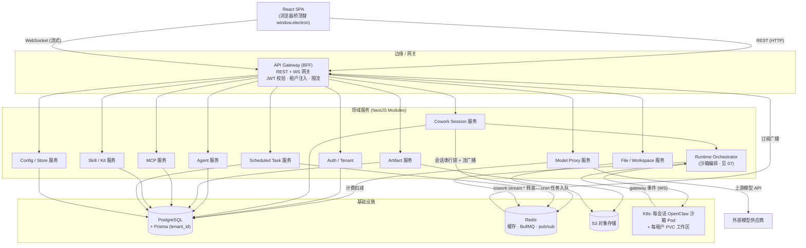
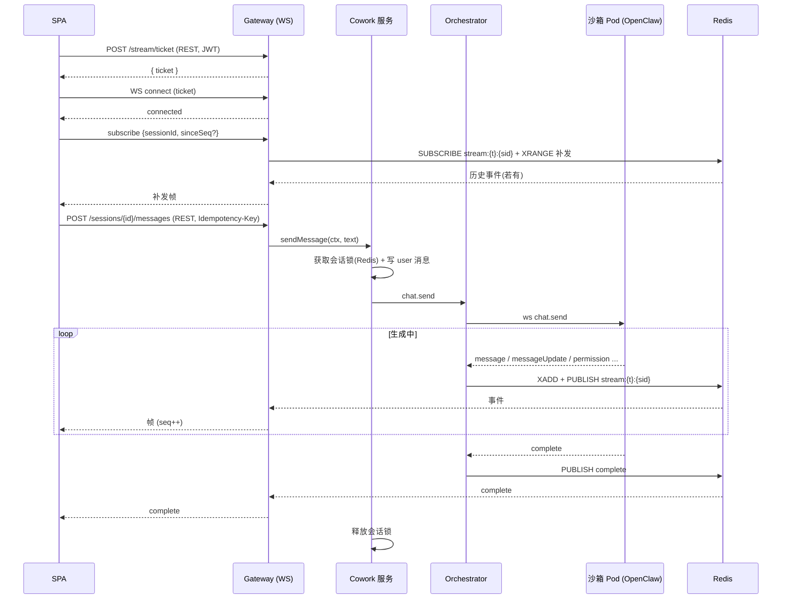
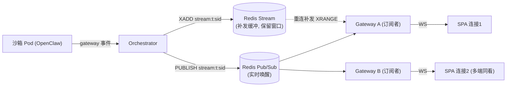

# 后端服务拆分与 API 设计

> 本文档面向后端架构师与服务端工程师，定义 LobsterAI 从「Electron 主进程一体化」改造为「多租户 SaaS 后端」时的服务边界、模块拆分策略、REST 资源约定、WebSocket 流式协议与并发一致性方案。它是 03（前端与传输层）与 07（OpenClaw 运行时编排）之间的「服务端契约层」文档。完整的 IPC→REST/WS 逐条映射见 `附录A-IPC通道与接口映射.md`；目标整体架构与技术选型见 `02-目标架构与技术选型.md`。

---

## 0. 一句话背景与本文范围

现状：渲染层通过唯一桥 `window.electron`（`src/main/preload.ts`）向主进程发起 `~446` 处调用，主进程 `src/main/main.ts`（约 `10560` 行）注册 `259` 个 `ipcMain.handle/on` 处理器，并通过 `webContents.send('cowork:stream:*' 等)` 向渲染器推送流式/事件（`src/main` 内 `.send(` 调用点约 `47` 处、其中 `webContents.send` 约 `33` 处；去重后 renderer 事件通道约 `29` 个）。这一层在桌面端既是「BFF」也是「领域服务」也是「本地运行时宿主」，三者混在一个进程里。

目标：把这 259 个 handler 按业务域拆成一组**无状态、可水平扩展、带 `tenant_id` 隔离**的后端服务；用 REST 承载请求/响应、用 WebSocket 承载流式；把 OpenClaw 运行时从「本进程 fork」外移到「每会话沙箱 Pod」（见 `07-OpenClaw运行时编排与沙箱隔离.md`）。

本文只解决「服务如何拆、API 如何设计、业务逻辑怎么搬」。不重复：认证细节见 `05`，数据模型见 `06`，运行时编排见 `07`，模型代理/计费见 `09`。

---

## 1. 总体服务拓扑

### 1.1 分层原则

采用 **BFF + 领域服务** 两层，NestJS 单体仓（monorepo，`apps/` + `libs/`）起步，按域拆成模块，运行时可先合并部署、后按负载拆分独立进程。这样既满足「复用现有 TS 业务逻辑」，又保留后续微服务化的边界。

- **BFF/API Gateway 层**：面向前端 SPA 的统一入口。负责鉴权（JWT 校验、租户上下文注入）、请求校验、限流、REST 路由、WebSocket 网关、聚合。**不含核心业务逻辑**，只做编排与协议转换。
- **领域服务层**：每个域一个 NestJS Module。持有业务逻辑（大量从 `main.ts` 抽取），通过 Prisma 访问 Postgres、通过 Redis 做缓存/pub-sub、通过「运行时编排服务」与 OpenClaw 沙箱 Pod 通信。
- **横切基础设施**：Postgres(Prisma)、Redis(缓存+BullMQ+pub/sub)、S3(对象存储)、Kubernetes(沙箱编排)、OIDC/JWT(鉴权)、OTel(可观测)。

### 1.2 拓扑图



关键数据流（对话流式）：`SPA -WS-> GW -> COWORK(写库+加会话锁) -> ORCH -> 沙箱Pod(OpenClaw gateway ws) -> 事件回 ORCH -> 发布到 Redis 频道 session:{id} -> GW 订阅并推给对应 WS 连接`。

---

## 2. 后端模块拆分（对应 259 个 handler 的域）

下表把 259 个 handler 的域映射到目标 NestJS 模块。列「搬迁难度」区分「纯 Node 直接搬」「需适配」「必须重写」（详见第 3 节）。「v1」列标注是否在 v1 范围（IM 与 computer-use 见 `13-功能取舍与降级清单.md`）。

| 目标模块 | 覆盖 IPC 域 | 现状核心文件 | 主要职责 | 搬迁难度 | v1 |
|---|---|---|---|---|---|
| **AuthTenantModule** | `auth:*` | `authQuota.ts`、`authLocalCallbackServer.ts`、`authCallbackRouter.ts`、`endpoints.ts` | OIDC 登录、JWT 签发、租户/用户、配额读取 | 重写为主 | ✔ |
| **CoworkModule** | `cowork:session:*`、`cowork:config:*`、`cowork:memory:*`、`cowork:dreaming:*`、`cowork:bootstrap:*`、`cowork:permission:*`、`cowork:media:*` | `coworkStore.ts`、`agentEngine/coworkEngineRouter.ts`、`agentEngine/openclawRuntimeAdapter.ts` | 会话/消息 CRUD、上下文用量、权限响应、连续性胶囊、记忆、流式编排 | 直接搬 + 适配 | ✔ |
| **AgentModule** | `agents:*` | `agentManager.ts` | Agent CRUD、预设安装、绑定工作区 | 直接搬 | ✔ |
| **ArtifactModule** | `artifact:*`、`htmlShare:*`、`localWebServices:*` | `artifactParser.ts`(渲染层)、`htmlPreviewServer.ts` | 产物解析/去重、预览会话、HTML share | 重写预览服务 | ✔ |
| **FileWorkspaceModule** | `dialog:*`、部分 `shell:*` | 分散在 `main.ts` | 工作区文件读写、上传/下载、缩略图 | 重写（走 S3/PVC） | ✔ |
| **ModelProxyModule** | `api:stream`、`get/save/check-api-config`、`auth:getModels`、`media:*`、`generate-session-title` | `coworkModelApi.ts`、`coworkOpenAICompatProxy.ts` | 模型目录、格式转换、上游代理、计费扣减 | 直接搬 + 适配 | ✔ |
| **McpModule** | `mcp:*` | `mcp/mcpStore.ts`、`mcp/mcpRuntime.ts` | MCP 服务器 CRUD、启动决议、marketplace | 部分重写（stdio 需沙箱） | ✔ |
| **SkillModule** | `skills:*`、`kits:*` | `skillManager.ts` | 技能同步/安装/安全扫描、Kit store | 部分重写（PATH/fs 逻辑） | ✔ |
| **ScheduledTaskModule** | `scheduledTask:*` | `scheduledTask/cronJobService.ts` | 定时任务 CRUD、cron 编排、运行历史 | 直接搬 + 适配 | ✔ |
| **ConfigStoreModule** | `store:*`、`cowork:config:*`、`enterprise:getConfig` | `sqliteStore.ts` kv 表 | 租户级 KV、企业配置 | 直接搬（改存储） | ✔ |
| **PluginModule** | `plugins:*` | `user_plugins` 相关 | 插件安装/启停/配置 | 部分重写 | ✔ |
| **OrchestratorModule** | `openclaw:engine:*`、`openclaw:session:patch`、`openclaw:dataMigration:*`、`openclaw:sessionPolicy:*` | `openclawEngineManager.ts`、`openclawConfigSync.ts` | 沙箱 Pod 生命周期、config sync、gateway 连接 | 重写编排 + 搬 config 渲染 | ✔（见 07） |
| **ImModule** | `im:*`、`feishu/dingtalk:install:*` | `im/imGatewayManager.ts` | IM 网关/多实例 | **后续** | ✘ |
| （不做） | `openclaw:browser:*`、computer-use | `computerUse/` | 桌面自动化/后台浏览器 | **不做** | ✘ |
| （降级/移除） | `window-*`、`shell:*`、`clipboard:*`、`app:*`、`log:*`、`appUpdate:*`、`asr:*`、`permissions:*`、`copilot:*`、`openai-codex-oauth:*` | 分散 | Electron 专属能力 | 见 `13` 降级清单 | 部分 |

> 域计数依据附录 A 事实清单；`259` 是主进程 handler 总数，其中相当一部分（`window-*`/`shell:*`/`clipboard:*`/`log:*` 等 Electron-only）在 web 化后被浏览器原生能力取代或降级，不进入领域服务，故领域模块承载的是「可移植 + 需适配 + 需重写」子集。

### 2.1 BFF 与领域服务边界

- BFF（Gateway）**只做**：JWT 验证与 `tenant_id/user_id` 注入、DTO 校验（class-validator）、REST 路由到领域服务、WebSocket 连接管理与消息帧编解码、限流、审计日志埋点、错误结构统一。
- 领域服务**只做**：业务规则 + 数据访问 + 与 OpenClaw 沙箱交互。**领域服务永远从上下文取 `tenant_id`，绝不信任前端传入的租户标识**。
- 边界纪律：BFF 不直接写 Prisma；领域服务不直接持有 WS 连接对象（它们把流式事件发布到 Redis，由 Gateway 消费后下发）。这条纪律使领域服务无状态、可横向扩容。

---

## 3. main.ts 业务逻辑抽取策略

`main.ts`（`10560` 行）是最大的迁移难点。策略：**逐 handler 分类 → 纯逻辑抽库 → Electron 依赖重写**。切忌整文件搬运。

### 3.1 三类划分标准

| 类别 | 判定标准 | 处理方式 |
|---|---|---|
| **A. 纯 Node 可直接搬** | 只依赖 `fs`(相对沙箱可容器化)、`crypto`、`path`、`better-sqlite3`(换 Prisma)、纯计算，不触碰 `electron` 的 `app/shell/dialog/BrowserWindow/webContents` | 抽成 `libs/*` 纯函数/service，加 `tenant_id` 参数与查询过滤 |
| **B. 需适配** | 逻辑可复用但有本地路径/单机假设（`app.getPath('userData')`、`127.0.0.1` loopback、单一 SQLite 文件） | 复用算法，替换 IO 层：存储→Prisma、路径→租户命名空间、loopback→Pod 内 Service DNS |
| **C. 必须重写** | 强依赖 Electron 桌面能力：`dialog.showOpenDialog`、`shell.openExternal`、`clipboard`、`BrowserWindow`、原生窗口/托盘/自启、本地 http 预览 server | 用 web 等价物重写或列入降级清单（`13`） |

### 3.2 具体可直接搬（A 类）

这些是**已经与 Electron 解耦或极易解耦的纯 TS 业务逻辑**，是复用价值最高的资产：

- **`coworkStore.ts`（`2984` 行）** — 会话/消息/胶囊/记忆的 CRUD 与序列化逻辑。当前用 `better-sqlite3`（`src/main/coworkStore.ts:1`）。搬迁：把 SQL 换成 Prisma，`getDefaultWorkingDirectory()`（`src/main/coworkStore.ts:37`）改为「租户工作区根 + 会话子目录」（见 `08`）；`addMessage` 的 UUID+自增 sequence 逻辑（`src/main/coworkStore.ts` 消息生命周期段）原样保留（sequence 排序是流式重放的关键）。**注意**：文件顶部 `import { app } from 'electron'`（`src/main/coworkStore.ts:3`）只用于取 userData 路径，抽库时移除该依赖，路径通过构造函数注入。
- **`openclawConfigSync.ts`（`3403` 行）** — 把 LobsterAI 状态渲染成 `openclaw.json` + 工作区 `AGENTS.md/MEMORY.md`。**渲染逻辑（构建 `managedConfig`、providers/models/agents/plugins/mcp.servers/cron）是纯数据转换，直接搬**；但**写入目标**从「本地 state dir」改为「沙箱 Pod 的 PVC / initContainer 注入」（见 `07`）。`safeServerKey`、`lowercaseHeaderKeys`、`buildOpenClawMcpServers` 等纯函数零改动复用。
- **`cronJobService.ts`（`887` 行）** — 定时任务的 schedule 解析（`at`/`every`/`cron`）、内部任务标记、投递策略是纯逻辑，直接搬。执行触发从「本地 gateway cron」改为「BullMQ repeatable job → Orchestrator 唤起会话」（见 `11-定时任务调度.md`）。
- **`coworkModelApi.ts`（`159` 行）** — 纯格式转换/URL 构建/错误提取：`buildAnthropicMessagesUrl`（`src/main/libs/coworkModelApi.ts:44`）、`normalizeGeminiBaseUrl`（`:58`）、`extractApiErrorSnippet`（`:87`）、`extractTextFromAnthropicResponse`（`:116`）等，**零改动直接搬**。
- **`coworkOpenAICompatProxy.ts`（`2991` 行）** — OpenAI↔Anthropic/Gemini 消息转换、tool-call 状态机、Gemini schema 清洗是纯逻辑，直接搬。但**「监听 `127.0.0.1:proxy_port` + DNS rebinding/Host 校验」的本地 http server 外壳需重写**为：要么内置进 ModelProxyModule 的 HTTP 处理器，要么随沙箱注入到 Pod（见 `09-模型代理与计费.md`）。
- **`artifactParser.ts`（渲染层）** — 产物解析与去重（`dedupeArtifactsForDisplay` 的 `file:/url:/name:` 身份键）是纯逻辑，前端继续用；后端 ArtifactModule 复用同一套去重规则，产物路径从本地 `file://` 改为 S3 URL。
- **各类 `constants.ts`（`src/shared/*`）** — IPC 通道名、状态枚举、协议判别式等 `as const` 常量表：直接作为 REST 路由/WS 帧 `type` 的**权威来源**，前后端共享（monorepo `libs/shared`）。这满足 CLAUDE.md 的字符串常量纪律。

### 3.3 必须重写（C 类）

| 现状 | 依赖 | 重写方向 |
|---|---|---|
| OAuth loopback（`authLocalCallbackServer.ts` 127.0.0.1 回调） | 本地 HTTP + `crypto` state | 标准 web OIDC redirect（见 `05`） |
| `dialog:selectDirectory/selectFile*`、`saveInlineFile`、`readFileAsDataUrl` | Electron `dialog` + 本地 fs | 浏览器 `<input type=file>` 上传 → S3；下载走 REST/预签名 URL（见 `08`） |
| `shell:openExternal/openPath/showItemInFolder` | Electron `shell` | 浏览器 `window.open` / 不适用 |
| `clipboard:*` | Electron `clipboard` | 浏览器 `navigator.clipboard` |
| `htmlPreviewServer.ts` 本地预览 server | 127.0.0.1 http + token | 服务端沙箱化预览域名 + 短期 token（见 `12-Artifacts与预览改造.md`） |
| `openclawEngineManager.ts` fork/utilityProcess | Electron `utilityProcess`、本地端口扫描、CLI shim、compile cache | K8s Pod 编排 + Service DNS + Secret 注入 token（见 `07`） |
| `window-*`、`app:relaunch/autoLaunch/preventSleep`、`log:*` | Electron 窗口/系统 | 移除或降级（`13`） |
| MCP `stdio`（本地 `npx` 子进程，`mcpRuntime.ts` `spawn()`） | 本地进程 | 落到会话沙箱 Pod 内执行（见 `07`/`10`）；`sse`/`http` 传输可直接由服务端调用 |

### 3.4 抽取执行步骤（每个 handler）

1. 在 `main.ts` 定位 handler，判定 A/B/C 类。
2. A/B：把 handler 内部逻辑抽成 `libs/<domain>/<name>.ts` 纯函数或 NestJS provider 方法，签名加 `ctx: { tenantId, userId }`。
3. 为该逻辑写单元测试（Vitest，见 `16-测试策略与验收标准.md`），先在旧代码路径保证行为不变。
4. 在 NestJS Controller/Gateway 里挂接 REST/WS，Controller 只做「取上下文 → 调 service → 返回统一响应」。
5. C 类：在前端浏览器桥（`03`）实现 web 等价，或标注降级（`13`）。

---

## 4. REST 资源设计约定

### 4.1 命名与版本化

- 统一前缀：`/api/v1/...`。破坏性变更升 `/api/v2`；非破坏性字段增量走 `v1`。
- 资源用**复数名词**、kebab 语义、层级化：`/sessions`、`/sessions/{id}/messages`、`/agents`、`/mcp-servers`、`/scheduled-tasks`、`/skills`、`/artifacts`。
- 动作类（非纯 CRUD）用子资源 + POST：`POST /sessions/{id}/stop`、`POST /sessions/{id}/fork`、`POST /sessions/{id}/compact-context`、`POST /permissions/{requestId}/respond`。避免动词 URL 满天飞，但显式动作优先于晦涩的 PATCH 语义。
- **租户不入 URL**：`tenant_id` 从 JWT 解出，注入请求上下文；URL 里只出现资源 ID。防止越权与 URL 泄露租户。

### 4.2 鉴权

- 所有 `/api/v1/*` 需 `Authorization: Bearer <JWT>`（OIDC 签发，见 `05`）。
- Gateway 全局 `AuthGuard` 校验签名/过期/受众，解出 `{ tenantId, userId, scopes }` 放入 `AsyncLocalStorage` 请求上下文。
- 资源级授权：领域 service 查询一律 `where: { tenantId, ... }`；对「资源属于该租户下某用户」的场景（如私有会话）再叠加 `userId`。Prisma 层可选启用 Postgres RLS 做二次兜底（见 `06`/`14`）。

### 4.3 分页

沿用现有页大小常量（`COWORK_SESSION_PAGE_SIZE`、`COWORK_MESSAGE_PAGE_SIZE`，`src/shared/cowork/constants`）作为默认值，统一游标分页优先（消息按 `sequence` 稳定排序，避免 OFFSET 漂移）：

```
GET /api/v1/sessions?limit=30&cursor=<opaque>
GET /api/v1/sessions/{id}/messages?limit=50&cursor=<opaque>&direction=backward
```

响应信封：

```jsonc
{
  "data": [ /* items */ ],
  "page": {
    "nextCursor": "eyJzZXEiOjEyMzR9",   // null 表示到底
    "hasMore": true,
    "limit": 50
  }
}
```

> 消息分页保留现状「按 `COALESCE(sequence, created_at)` 排序 + 告知 UI 加载偏移」的语义（见 `coworkStore.ts` 分页段），游标编码 `{ sequence }`，`direction=backward` 用于「向上加载更早消息」。

### 4.4 统一错误结构

```jsonc
{
  "error": {
    "code": "SESSION_BUSY",           // 稳定机器码（as const 枚举，前后端共享）
    "message": "会话正在生成中，请稍后",   // 已 i18n 的可读文案
    "httpStatus": 409,
    "requestId": "req_01H...",         // 关联 OTel trace
    "details": { "sessionId": "..." }  // 可选，结构化上下文
  }
}
```

- `code` 复用现有错误分类思路（`classifyErrorKey`，`src/renderer/services/cowork.ts:68`）沉淀为共享枚举；前端据 `code` 做本地化与重试决策，不依赖 `message` 字符串匹配。
- 错误码对应的 `message`（zh/en 双语可读文案）由后端 i18n 提供：后端按请求语言（`Accept-Language` 或用户偏好）渲染对应文案填入信封，前端也可直接据 `code` 走本地字典自行渲染。语言协商、zh/en 双语键、主进程/服务端字典组织等落地细则见 `03「国际化(i18n)落地」`。
- HTTP 状态：`400` 校验失败、`401` 未认证、`403` 越权、`404` 资源不存在（含跨租户命中）、`409` 冲突/会话忙、`422` 语义校验、`429` 限流、`5xx` 服务端。
- **跨租户命中一律返回 `404`**（不是 403），避免探测资源存在性。

### 4.5 幂等

- 所有「会创建资源或触发副作用」的 POST 支持 `Idempotency-Key` 请求头：
  - 发送消息 `POST /sessions/{id}/messages`：以 `Idempotency-Key` 去重，防止网络重试造成重复触发生成。
  - 创建会话/Agent/定时任务同理。
- 实现：Redis 存 `idem:{tenantId}:{key} -> {status, responseHash}`，TTL 24h。命中未完成→返回 `409 IN_PROGRESS`；命中已完成→回放原响应。
- PUT/DELETE 天然幂等；PATCH 需保证多次同参结果一致。

### 4.6 通用约定小结

| 维度 | 约定 |
|---|---|
| 时间 | ISO 8601 UTC 字符串（`createdAt`），毫秒时间戳仅内部用 |
| ID | 服务端生成（uuid v4 或 ksuid），前端不指定资源 ID |
| 字段命名 | JSON `camelCase`；数据库 `snake_case`（Prisma 映射） |
| 空值 | 缺省字段省略而非 `null`（除非 `null` 有语义） |
| 大对象 | 消息内容/产物走引用（S3 URL），不内联超大 payload（见第 6.4 节 30MB 限制） |
| 限流 | 按 `tenantId` + 端点分桶，`429` 带 `Retry-After` |

---

## 5. WebSocket 流式协议

### 5.1 为什么用 WS + Redis pub/sub

现状流式 = 主进程 `webContents.send('cowork:stream:*', payload)` 单向推到本进程渲染器（`src/main/main.ts:2187`、`:2202`、`:4417` 等）。Web 化后：
- 领域服务无状态、可多副本，**不持有** WS 连接；
- OpenClaw gateway 事件在沙箱 Pod，由 Orchestrator 收后**发布到 Redis 频道 `stream:{tenantId}:{sessionId}`**；
- 前端的 WS 连接落在某个 Gateway 副本，该副本**订阅**用户当前关注的会话频道，收到后转发给对应 socket。

这解耦了「事件产生」与「连接归属」，任意 Pod 产生的事件都能送达任意 Gateway 上的连接。

### 5.2 连接与鉴权

- 端点：`wss://<host>/api/v1/stream`。
- 鉴权：连接握手时不放 token 到 URL query（会进日志）；采用「先建连 → 首帧 `auth` 携带短期 WS 票据」或子协议头 `Sec-WebSocket-Protocol: bearer.<jwt>`。票据由 `POST /api/v1/stream/ticket` 用主 JWT 换取，TTL 60s、一次性。
- 认证失败 → 服务端发 `error` 帧后关闭（code `4401`）。
- 连接建立后，Gateway 从票据解出 `{ tenantId, userId }`，绑定到该 socket，用于后续订阅授权。

### 5.3 消息帧格式（统一信封）

所有帧 JSON，判别字段 `type`（复用 `src/shared` 常量，禁止裸字符串）：

```typescript
// 客户端 -> 服务端
type ClientFrame =
  | { type: 'subscribe';   sessionId: string; sinceSeq?: number }
  | { type: 'unsubscribe'; sessionId: string }
  | { type: 'ping';        ts: number }
  | { type: 'ack';         sessionId: string; seq: number };   // 可选：已消费到的序号

// 服务端 -> 客户端（data 段与现状 cowork:stream:* 一一对应）
type ServerFrame = {
  type: StreamEventType;          // 见下表
  sessionId: string;
  seq: number;                    // 单会话内单调递增，用于去重/补发
  data: unknown;                  // 具体负载
} | { type: 'pong'; ts: number }
  | { type: 'error'; code: string; message: string; sessionId?: string };
```

`StreamEventType` 与现状 9 个 `cowork:stream:*` + 参数化 `api:stream:*` + 定时任务事件映射：

| WS `type` | 现状 send 事件（`main.ts` 参考行） | data 负载 |
|---|---|---|
| `message` | `cowork:stream:message`（`:2187`/`:4417`） | `{ message, beforeMessageId? }` |
| `messageUpdate` | `cowork:stream:messageUpdate`（`:2202`） | `{ messageId, content, metadata? }` |
| `sessionStatus` | `cowork:stream:sessionStatus` | `{ status }` |
| `contextUsage` | `cowork:stream:contextUsage` | `{ usage }` |
| `contextMaintenance` | `cowork:stream:contextMaintenance` | `{ active }` |
| `permission` | `cowork:stream:permission` | `{ request }` |
| `permissionDismiss` | `cowork:stream:permissionDismiss` | `{ requestId }` |
| `complete` | `cowork:stream:complete` | `{ claudeSessionId? }` |
| `error` | `cowork:stream:error` | `{ error }` |
| `apiStreamChunk` | `api:stream:{reqId}:data` | `{ requestId, chunk }` |
| `apiStreamDone/Error` | `api:stream:{reqId}:done/error` | `{ requestId, error? }` |
| `taskStatus/taskRun/taskRefresh` | `scheduledTask:statusUpdate/runUpdate/refresh` | 任务负载 |

> 非会话维度事件（`skills:changed`、`mcp:changed`、`auth:quotaChanged`、`sessions:changed` 等）走**用户级频道** `stream:{tenantId}:user:{userId}`，前端连接建立即自动订阅，无需显式 `subscribe`。会话级事件走会话频道，按需订阅。计数口径见 §0：`src/main` 内 `.send(` 调用点约 `47` 处，去重后 renderer 事件通道约 `29` 个（用户级 + 会话级合计），本节按「去重后事件通道」组织，勿把调用点数直接当作 `webContents.send` 或通道数。

### 5.4 订阅 / 取消订阅 / 多路复用

- **单条 WS 连接多路复用多个会话**：前端切到某会话 → 发 `subscribe {sessionId}`；离开 → `unsubscribe`。Gateway 据此增减对 Redis 频道的订阅（引用计数，避免重复订阅同频道）。
- 订阅授权：Gateway 校验该 `sessionId` 属于连接绑定的 `tenantId`（查缓存的会话-租户映射），否则拒绝并发 `error`。
- **断线补发**：`subscribe` 可带 `sinceSeq`，Gateway 从 Redis Stream（`XRANGE`）回放 `> sinceSeq` 的事件（保留最近 N 条/M 秒），实现无缝重连。这要求领域侧把流事件写入 Redis Stream 而非纯 pub/sub（pub/sub 用于实时唤醒，Stream 用于补发）。

### 5.5 心跳

- 客户端每 25s 发 `ping`，服务端回 `pong`；服务端 60s 未收任何帧 → 关闭连接（`4408`）。
- 反向：服务端也可主动 `ping`，兼容浏览器不发原生 ping 的情况。
- 应用层心跳独立于 WS 协议层 ping/pong，便于经过 L7 负载均衡时保活。

### 5.6 流式时序图



---

## 6. 代表性端点示例

> 完整清单见 `附录A-IPC通道与接口映射.md`；此处给出最能体现设计约定的代表端点。

### 6.1 会话 CRUD

```
GET    /api/v1/sessions?limit=30&cursor=...          # 列表(游标分页) ← cowork:session:list
POST   /api/v1/sessions                              # 新建 ← cowork:session:start
GET    /api/v1/sessions/{id}                         # 详情 ← cowork:session:get
PATCH  /api/v1/sessions/{id}                         # 改名/置顶等 ← rename/pin
DELETE /api/v1/sessions/{id}                         # 删除 ← cowork:session:delete
POST   /api/v1/sessions/{id}/fork                    # 分支 ← cowork:session:fork
POST   /api/v1/sessions/{id}/stop                    # 停止生成 ← cowork:session:stop
POST   /api/v1/sessions/{id}/compact-context         # 压缩上下文 ← compactContext
GET    /api/v1/sessions/{id}/context-usage           # 上下文用量 ← contextUsage
```

创建会话请求/响应：

```jsonc
// POST /api/v1/sessions   Idempotency-Key: <uuid>
{
  "title": "重构登录模块",
  "agentId": "main",
  "cwd": "workspace/proj-a",      // 相对租户工作区根，见 08
  "model": "claude-...",           // 可选覆盖
  "executionMode": "auto"
}
// 201 Created
{
  "data": {
    "id": "sess_01H...",
    "title": "重构登录模块",
    "status": "idle",
    "agentId": "main",
    "createdAt": "2026-07-02T08:00:00.000Z"
  }
}
```

### 6.2 发送消息触发流式

REST 触发 + WS 收结果（分离控制面与数据面）：

```jsonc
// POST /api/v1/sessions/{id}/messages   Idempotency-Key: <uuid>
{
  "content": [{ "type": "text", "text": "帮我加单测" }],
  "attachments": [{ "artifactId": "art_..." }]   // 大文件先经 08 上传拿到引用
}
// 202 Accepted —— 表示已入队/开始生成，结果通过 WS 会话频道流式返回
{
  "data": { "userMessageId": "msg_...", "sessionStatus": "running" }
}
```

- 202 而非 200：明确「异步生成，去 WS 拿流」。
- 客户端应已在该会话 `subscribe`；即便消息先于订阅返回，`sinceSeq` 补发机制保证不丢首帧。

### 6.3 权限响应

现状 `cowork:permission:respond`（`src/main/main.ts:6752`）→

```jsonc
// POST /api/v1/permissions/{requestId}/respond
{
  "sessionId": "sess_...",
  "decision": "allow",            // allow | deny | allow_always
  "scope": "tool"                 // 可选
}
// 200 OK
{ "data": { "requestId": "...", "applied": true } }
```

对应流式：授予/拒绝后沙箱继续，事件经 `permissionDismiss`（关闭 UI 待办）与后续 `message` 帧回传。

### 6.4 模型代理流式（api:stream）

参数化流保留 `requestId` 语义（现状 `api:stream:{requestId}:data/done/error/abort`）：

```
POST /api/v1/model/stream          # 发起，返回 { requestId }；data 走 WS apiStreamChunk
POST /api/v1/model/stream/{requestId}/abort   # 取消 ← api:stream:cancel
GET  /api/v1/models                # 模型目录 ← auth:getModels
```

- **payload 硬限沿用**：`OPENCLAW_CHAT_SEND_PAYLOAD_LIMIT_BYTES = 30MB`、安全边界 `29.5MB`（`openclawRuntimeAdapter.ts`）。超限在 BFF 层即拦截返回 `413`，附件必须走 S3 引用（见 `08`）。

### 6.5 上下文用量（主动查 + 被动流）

- 主动：`GET /sessions/{id}/context-usage` 返回一次快照。
- 被动：生成过程中经 WS `contextUsage`/`contextMaintenance` 帧推送，前端据此渲染进度与「压缩中」状态。

---

## 7. 并发与一致性

### 7.1 同一会话串行化

现状是单进程天然串行；分布式后必须显式加锁，否则同一会话并发发消息会导致 OpenClaw 会话状态错乱、消息 sequence 冲突。

- **会话级分布式锁**：Redis `SET lock:session:{tenantId}:{sessionId} <token> NX PX <ttl>`（Redlock 语义）。发送消息/停止/分叉/压缩等「会改会话运行状态」的操作先抢锁。
- 抢锁失败 → REST 返回 `409 SESSION_BUSY`（前端提示「生成中」），或按业务排队（见下）。
- 锁 TTL 需大于单轮生成上限（对齐 `OPENCLAW_AGENT_TIMEOUT_SECONDS ≈ 3600`），并用**看门狗续期**（生成中每隔 T 续 TTL），防止长任务锁提前过期。
- 生成结束/异常/连接断开 → 释放锁（用 token 校验的 Lua 脚本删除，避免误删他人锁）。

### 7.2 消息序号与写入一致性

- 保留现状「单会话内 `sequence` 单调递增」为唯一顺序真相。分布式下 sequence 由**持锁的写路径**在 Postgres 事务内 `MAX(sequence)+1` 生成（或用 Postgres 序列/`SELECT ... FOR UPDATE` 行锁兜底），避免竞态。
- `replaceConversationMessages`（gateway 同步覆盖 user/assistant、保留 tool_*/system）等敏感写在事务内完成，保证前端分页不读到半更新状态。
- WS 帧的 `seq` 与消息 `sequence` 语义对齐：前端可据 `seq` 去重、检测缺口并触发 `subscribe sinceSeq` 补发。

### 7.3 流式广播（Redis pub/sub + Stream）



- **pub/sub 负责实时**、**Stream 负责补发/多端一致**。Stream 每会话保留最近窗口（如 5 分钟或 500 条），供断线重连与「多端同看」新连接补齐。
- 幂等消费：帧带 `seq`，客户端与 Gateway 均据 `seq` 去重，pub/sub 与 Stream 双通道即便重复也不影响正确性。

### 7.4 缓存一致性

- 读多写少的元数据（会话-租户映射、Agent 配置、模型目录）在 Redis 缓存，写路径**主动失效**（`DEL` 或版本号 bump），不用长 TTL 兜脏读。
- `store:*`/`cowork:config:*` 走 Postgres 为准，Redis 只做热点缓存；配置变更后发用户级 `configChanged` 流事件让前端刷新。

### 7.5 异步任务（BullMQ）

- 长耗时/可后台化的工作用 BullMQ 队列：会话标题生成（`generate-session-title`）、技能安全扫描、MCP 启动决议探测、定时任务触发（见 `11`）、记忆 dreaming（cron）。
- 队列同样按 `tenantId` 打标，便于配额与优先级；worker 幂等（job id = 业务键）。

---

## 8. 与其他文档的边界

| 关注点 | 本文负责 | 交由其他文档 |
|---|---|---|
| 服务如何拆、API 契约 | ✔ | — |
| 逐条 IPC→REST/WS 映射 | 代表示例 | `附录A`（完整清单） |
| 浏览器桥如何顶替 `window.electron` | 协议侧约定 | `03-前端与传输层改造.md` |
| OIDC/JWT/租户模型细节 | 只述鉴权约束 | `05-认证与多租户账户.md` |
| SQLite→Postgres 表结构与迁移 | 只述 Prisma+tenant 原则 | `06-数据模型迁移.md` |
| 沙箱 Pod 生命周期、config sync 落地、gateway 连接 | 只述 Orchestrator 边界 | `07-OpenClaw运行时编排与沙箱隔离.md` |
| 文件上传/下载/工作区存储 | 只述 File 模块职责 | `08-文件工作区与对象存储.md` |
| 模型格式转换/上游代理/计费扣减 | 只述模块归属与限额 | `09-模型代理与计费.md` |
| MCP/Skill 沙箱执行细节 | 只述模块与传输取舍 | `10-MCP与技能改造.md` |
| 定时任务 cron→BullMQ 落地 | 只述队列思路 | `11-定时任务调度.md` |
| Artifacts 预览沙箱化 | 只述模块归属 | `12-Artifacts与预览改造.md` |

---

## 9. 验收标准

- [ ] 259 个 handler 全部完成 A/B/C 分类，且每个「进入 v1」的域都有对应 NestJS Module 与至少一条端到端可用端点。
- [ ] 所有 REST 端点：走 `/api/v1` 前缀、JWT 鉴权、`tenantId` 从上下文注入且服务层查询强制过滤、统一错误信封、游标分页信封。
- [ ] 副作用型 POST 支持 `Idempotency-Key`，重复请求不产生重复副作用（有测试覆盖）。
- [ ] WS：可用票据鉴权、`subscribe/unsubscribe/ping/pong` 帧、`sinceSeq` 断线补发、单连接多会话多路复用；9 个 `cowork:stream:*` 事件与用户级事件均能正确路由到对应连接。
- [ ] 同一会话并发发送：第二个请求得到 `409 SESSION_BUSY`（或正确排队），不出现 sequence 冲突或 OpenClaw 会话错乱。
- [ ] 跨租户访问任意资源返回 `404`，无法探测存在性（含渗透测试用例，见 `14`）。
- [ ] 领域服务无状态：任意副本重启/扩缩容不影响进行中会话（事件经 Redis 广播，重连补发无丢帧）。
- [ ] `coworkStore`/`openclawConfigSync`/`coworkModelApi`/`cronJobService` 的纯逻辑抽库后行为与桌面版一致（Vitest 覆盖关键路径，见 `16`）。

---

## 10. 风险与缓解（本域）

| 风险 | 说明 | 缓解 | 详见 |
|---|---|---|---|
| `main.ts` 抽取遗漏隐式副作用 | 10560 行里 handler 常顺带改全局状态/触发其他 send | 逐 handler 分类 + 抽库前后行为快照测试 | `16`、`18` |
| 会话锁与生成超时不匹配 | 长任务锁过期导致并发闯入 | 看门狗续期 + TTL 对齐 3600s 超时 | 本文 §7.1 |
| 流式补发窗口不足 | 弱网重连丢首帧 | Redis Stream 保留窗口 + `sinceSeq` | 本文 §5.4 |
| 大 payload 冲击 WS/服务 | 30MB 限制原为单机 | BFF 层 `413` 拦截 + 附件走 S3 引用 | `08`、`09` |
| stdio MCP/技能子进程 | 服务端不能直接 `spawn` 本地 | 落沙箱 Pod 执行 | `07`、`10` |
| 错误码字符串漂移 | 前端按 message 匹配脆弱 | `code` 用共享 `as const` 枚举 | 本文 §4.4 |

---

（本文完。逐条接口映射见 `附录A-IPC通道与接口映射.md`；术语见 `附录B-术语表与阅读指南.md`。）
