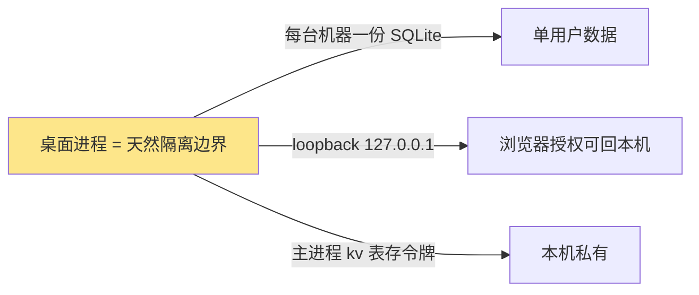
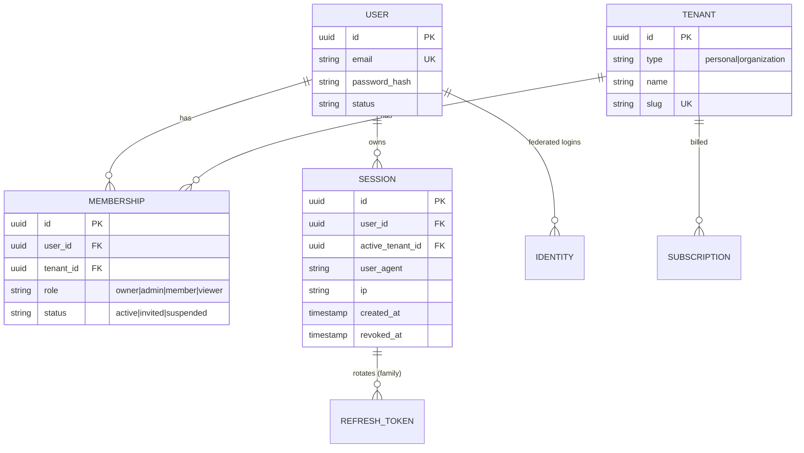
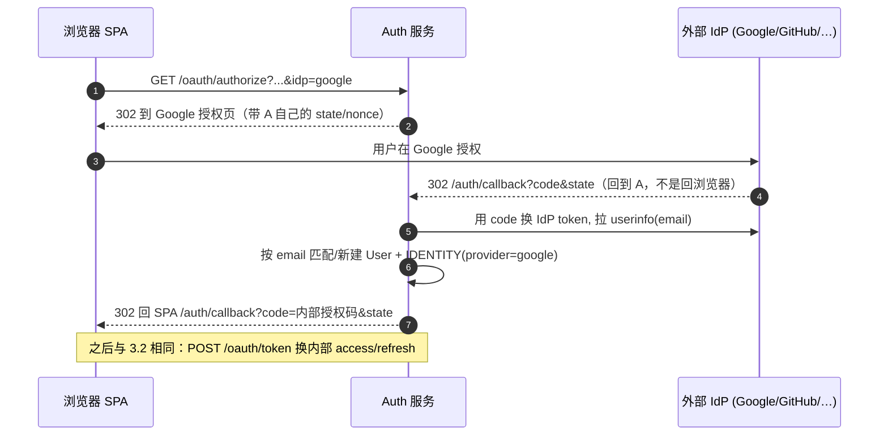
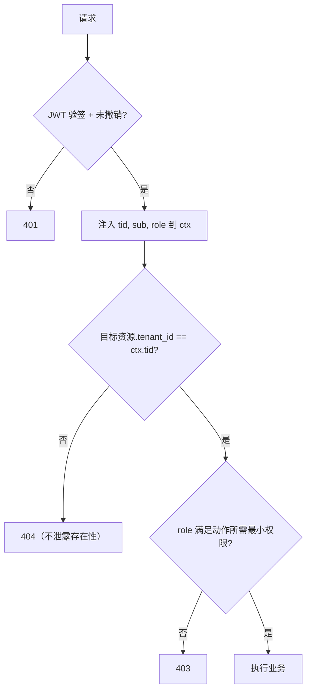
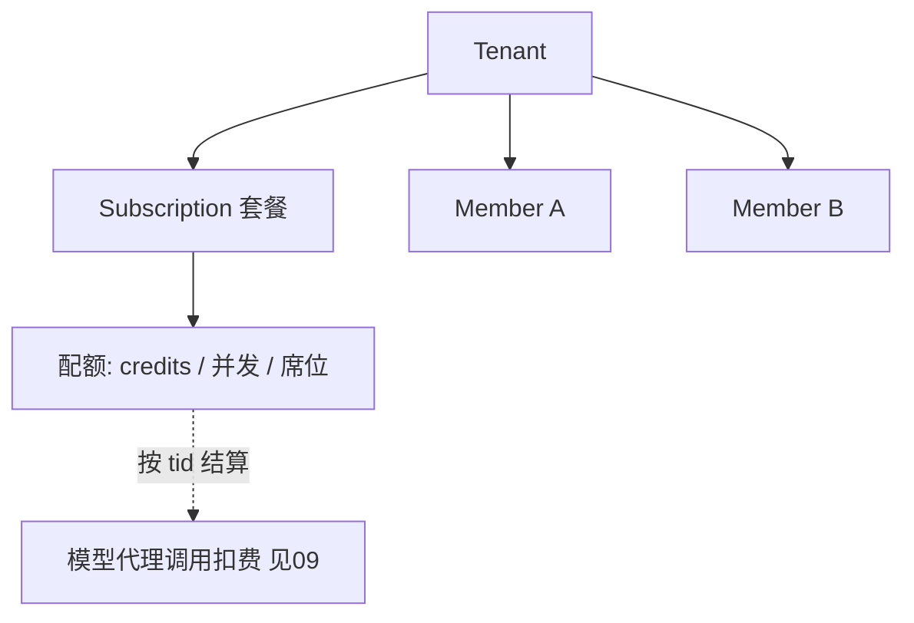

# 认证与多租户账户

> 本文档定义 LobsterAI SaaS 化后的自建认证体系与多租户账户模型。适合后端/身份团队、DBA、安全负责人阅读。它承接 `02-目标架构与技术选型.md` 的整体分层，向下约束 `06-数据模型迁移.md`（tenant_id 落表）、`04-后端服务与API设计.md`（认证中间件与 API 契约）、`09-模型代理与计费.md`（套餐/配额挂在租户上）、`14-安全合规与多租户隔离.md`（纵深防护）。**认证主流程遵循附录C D11、RLS 遵循 D2、身份表字段级 DDL 权威见附录C §4/D3**；凡与本文冲突，以 `附录C-决策基线与接口契约总纲.md` 为准。

---

## 1. 现状（桌面单机认证）

LobsterAI 当前是单机桌面应用，认证是"本机代理登录到 youdao 云"的形态，**没有任何多租户概念**。

### 1.1 现状事实清单

| 维度 | 现状 | 代码位置 |
| --- | --- | --- |
| 登录方式 | OAuth **loopback**：起本地 HTTP server 监听 `127.0.0.1:{随机端口}`，浏览器授权后回调到本机 | `src/main/libs/authLocalCallbackServer.ts:139` |
| state 生成 | `crypto.randomBytes(24).toString('base64url')` | `authLocalCallbackServer.ts:146` |
| 回调路径 | `GET /auth/callback?code=&state=&return_to=` | `authLocalCallbackServer.ts:5,181` |
| state 校验 | 回调 `state` 必须等于起始 `state`，否则拒绝 | `authLocalCallbackServer.ts:192` |
| 回调超时 | 5 分钟单实例（`activeCallback`），超时释放端口 | `authLocalCallbackServer.ts:7,20` |
| 深链接回调 | 备用路径 `auth://auth/callback?code=`（protocol handler），缓存 pending code 到 renderer ready | `src/main/libs/authCallbackRouter.ts` |
| 令牌换取 | `getServerApiBaseUrl()` → `https://lobsterai-server.youdao.com` 的 exchange/refresh | `src/main/libs/endpoints.ts:29` |
| 令牌存储 | 主进程 `saveAuthTokens` 明文写 SQLite `kv` 表，renderer 经 IPC 按需取；renderer **无** `localStorage`（订正原「localStorage 存令牌」，见附录C A1）。真实风险是 `kv` 表明文而非 XSS | `main.ts` `saveAuthTokens` |
| 配额门控 | `hasMediaGenerationEntitlement`：`hasPaidCredits===true` 或 `subscriptionStatus==='active'` | `src/main/authQuota.ts:33` |
| 订阅状态枚举 | `active` / `free` | `src/shared/auth/constants.ts:9` |
| 用户身份 | **单一 youdao 账户**；SQLite 所有表**无 `user_id`/`tenant_id` 列**（`sqliteStore.ts` grep 无命中） | `src/main/sqliteStore.ts` |

### 1.2 现状为何不能直接搬到 Web



三个隐含假设在公网 SaaS 全部失效：

1. **进程即隔离**：桌面上"一个进程一个人"，所以表不需要 `tenant_id`；SaaS 里所有租户共享同一后端与库，隔离必须显式化。
2. **loopback 回本机**：`127.0.0.1` 回调只在"浏览器与 app 同机"时成立；Web 用户浏览器与后端在不同机器，必须换成标准 web 重定向。
3. **令牌落主进程本地库**：桌面把令牌由主进程 `saveAuthTokens` 明文写进本机 SQLite `kv` 表（renderer 经 IPC 取，**并非** renderer `localStorage`，见附录C A1），本机私有故明文尚可接受；Web SPA 有 XSS 面，refresh token 既不能放 `localStorage` 也不能落任何前端可读存储，必须改为服务端存哈希 + HttpOnly Cookie。

---

## 2. 目标：自建 OAuth2/OIDC + 多租户

### 2.1 目标能力总览

- **自建 Identity Provider（IdP）**：email+密码为主，OAuth2 Authorization Code + PKCE 流程；可选 SSO（Google/GitHub/企业 SAML/OIDC）。
- **令牌体系**：短寿命 JWT `access_token`（15 min）+ 长寿命、可轮换、可撤销的 `refresh_token`（存服务端 + HttpOnly Cookie）。
- **多租户**：`tenant`（租户）是隔离与计费主体；用户可属于多个租户；`tenant_id` 贯穿所有业务表、所有查询、所有 OpenClaw 沙箱与对象存储前缀。
- **RBAC**：租户内角色（owner/admin/member/viewer）+ 全局平台角色（superadmin）。
- **纵深隔离**：应用层强制过滤 + Postgres RLS 兜底 + 存储/运行时物理隔离（详见 `07`/`08`/`14`）。

### 2.2 术语与实体

| 实体 | 说明 |
| --- | --- |
| `User`（账户/主体） | 一个人，一套登录凭据（email+密码或联邦身份），全局唯一 |
| `Tenant`（租户） | 隔离与计费边界。分两型：`personal`（个人默认租户）与 `organization`（团队/组织） |
| `Membership`（成员关系） | `User × Tenant` 多对多，携带该用户在该租户的角色 |
| `Session`（会话） | 一次登录产生的服务端会话，绑定一个 refresh token 家族（family） |
| `IdentityProvider` | 联邦身份来源（local / google / github / saml / oidc） |

> **个人 vs 组织的统一模型**：注册即自动创建一个 `personal` 租户（该用户为 owner），确保"任何数据都归属某个 tenant"没有例外。用户创建/加入组织时新增 `organization` 租户。业务态永远带 `active_tenant_id`，切换租户 = 换 `active_tenant_id` 并签发新 access token。



> **身份表字段权威（见附录C D3）**：上图仅为概念实体关系；`users / tenants / memberships / identities / refresh_tokens / auth_codes / oauth_clients` 的**字段级 DDL 以附录C §4 为权威**，`06-数据模型迁移.md` 为叙述 owner 并内联引用；本文只承担鉴权语义与 RLS policy，不再与 06 互指 DDL。其中密码凭据在 §4 建模为 `identities(provider='password')`（非 `users.password_hash`），登录会话/refresh family 以 `refresh_tokens.family_id` 为承载键（本文 `sid` 即 family 维度）。

---

## 3. 认证流程：从 loopback 到标准 Web 重定向

### 3.1 端点定义（自建，替换 `lobsterai-server.youdao.com`）

统一在 `auth.<domain>`（NestJS `AuthModule`）：

| 端点 | 方法 | 用途 |
| --- | --- | --- |
| `/auth/register` | POST | email+密码注册，创建 User + personal Tenant |
| `/auth/login` | POST | email+密码登录，返回授权码或直接建会话（见下） |
| `/oauth/authorize` | GET | OAuth2 授权端点（Authorization Code + PKCE） |
| `/oauth/token` | POST | 用 code+verifier 换 access/refresh；也处理 `grant_type=refresh_token` |
| `/auth/callback` | GET | 联邦 SSO（Google/GitHub/SAML）回调落地，换取内部会话 |
| `/auth/refresh` | POST | 刷新 access token（读 HttpOnly refresh cookie） |
| `/auth/logout` | POST | 撤销当前会话（refresh family） |
| `/auth/logout-all` | POST | 撤销该用户所有会话 |
| `/auth/me` | GET | 当前用户 + 可选租户 + 角色 |
| `/auth/tenants` | GET | 当前用户可访问的租户列表 |
| `/auth/switch-tenant` | POST | 切换 `active_tenant_id`，签发新 access token |
| `/auth/verify-email` | POST | 校验邮箱验证 token，置 `email_verified=true`（P1-14）|
| `/auth/forgot-password` | POST | 发起密码重置，签发一次性 token 走事务邮件 |
| `/auth/reset-password` | POST | 用重置 token 设新密码，成功后撤销该用户全部会话 |
| `.well-known/openid-configuration` | GET | OIDC discovery（供第三方/移动端接入） |
| `/oauth/jwks` | GET | JWKS 公钥集（验签 JWT） |

所有端点名用共享常量集中管理（遵循 CLAUDE.md 字符串常量规范），示例：

```ts
// src/shared/auth/constants.ts （扩展现有文件）
export const AuthRoute = {
  Register: '/auth/register',
  Login: '/auth/login',
  OAuthAuthorize: '/oauth/authorize',
  OAuthToken: '/oauth/token',
  Callback: '/auth/callback',
  Refresh: '/auth/refresh',
  Logout: '/auth/logout',
  LogoutAll: '/auth/logout-all',
  Me: '/auth/me',
  Tenants: '/auth/tenants',
  SwitchTenant: '/auth/switch-tenant',
  VerifyEmail: '/auth/verify-email',
  ForgotPassword: '/auth/forgot-password',
  ResetPassword: '/auth/reset-password',
  Jwks: '/oauth/jwks',
} as const;
export type AuthRoute = typeof AuthRoute[keyof typeof AuthRoute];
```

### 3.2 email+密码登录（标准 Web 重定向 + Authorization Code + PKCE）

关键改造点对照：

| 现状（loopback） | 目标（Web 重定向） |
| --- | --- |
| `redirect_uri = http://127.0.0.1:{port}/auth/callback` | `redirect_uri = https://app.<domain>/auth/callback`（白名单登记） |
| 本机 HTTP server 收 code | SPA 路由 `/auth/callback` 收 code，POST 给后端 |
| `state` 存进程内存单实例 | `state` + `code_verifier` 存 SPA `sessionStorage`（一次性） |
| 令牌由主进程明文写 SQLite `kv` 表（非 renderer `localStorage`，见附录C A1） | access token 存内存；refresh token 存 **HttpOnly + Secure + SameSite** cookie |

```mermaid
sequenceDiagram
  autonumber
  participant B as 浏览器 SPA
  participant A as Auth 服务 (/oauth/*)
  participant DB as Postgres
  Note over B: 用户点“登录”
  B->>B: 生成 code_verifier + code_challenge(S256)<br/>生成 state, 存 sessionStorage
  B->>A: GET /oauth/authorize?response_type=code<br/>&client_id&redirect_uri&scope&state&code_challenge&code_challenge_method=S256
  A-->>B: 302 到登录页（或已登录则直接放行）
  B->>A: POST /auth/login {email, password}
  A->>DB: 查 User，Argon2id verify(password_hash)
  A->>DB: 写授权码 auth_code(code, user_id, code_challenge, exp=60s)
  A-->>B: 200 JSON { code, state }（不返 302；SPA fetch 取 JSON 后自行换码）
  B->>B: 校验 state == sessionStorage.state（防 CSRF）
  B->>A: POST /oauth/token {grant_type=authorization_code,<br/>code, code_verifier, redirect_uri}
  A->>DB: 校验 code 未用/未过期, verify code_verifier==challenge
  A->>DB: 建 Session + Refresh family, 选 active_tenant_id
  A-->>B: 200 {access_token(JWT,15min)}<br/>Set-Cookie: refresh_token=...; HttpOnly; Secure; SameSite=Strict; Path=/
  B->>B: access token 存内存, 进入应用
```

要点：
- **登录不返 302**：`/auth/login` 由 SPA `fetch` 提交并**取 JSON `{ code }`、由 SPA 自行跳转/换码**（不返回 302，与 SPA fetch 语义一致，见附录C D11）；`code` 再经 `/oauth/token` 换 token。
- **刷新入口统一**：浏览器客户端刷新走 `/auth/refresh`（refresh 承载于 `HttpOnly` Cookie，**`Path=/`**）；移动端/非浏览器客户端走 `/oauth/token`（`grant_type=refresh_token`，refresh 于 **body** 承载）。见附录C D11。
- **PKCE 强制**：SPA 是公有客户端（无 client secret），必须 S256 PKCE 防授权码拦截。
- **授权码一次性**：`auth_code` 用后即焚，60 s 过期，绑定 `redirect_uri` 与 `code_challenge`。
- **state 双重防护**：`state` 由 SPA 生成并在回调时比对，替代原 loopback 的进程内 `state`（`authLocalCallbackServer.ts:192` 的等价物移到浏览器侧）。

### 3.3 联邦 SSO（可选，Google/GitHub/SAML/OIDC）



- 外部 IdP 回调落在**后端** `/auth/callback`（不是浏览器），后端换取 userinfo 后再签发**内部**授权码回到 SPA，统一收敛到 3.2 的令牌签发路径。
- 首次联邦登录：若 email 已存在 local 账户，进入"账户关联确认"流程（防账户劫持）；否则新建 User + `personal` Tenant + `IDENTITY` 记录。

### 3.4 令牌刷新与静默续期

```mermaid
sequenceDiagram
  autonumber
  participant B as SPA
  participant A as Auth 服务
  B->>A: 任意 API（access token 过期 → 401）
  A-->>B: 401 token_expired
  B->>A: POST /auth/refresh （携带 HttpOnly refresh cookie）
  A->>A: 校验 refresh 未撤销/未过期; 检测重放
  alt 正常
    A->>A: 加 family 锁; 轮换: 旧 refresh 入 replaced_by 链(留 grace 窗口), 发新 refresh
    A-->>B: 200 {access_token} + Set-Cookie 新 refresh
    B->>A: 重放原 API
  else 已替换且超出 grace window 的旧 token 再次使用（重放攻击）
    A->>A: 撤销整个 refresh family（该会话所有令牌失效）
    A-->>B: 401 → 强制重新登录
  end
```

**Refresh Token Rotation + Reuse Detection** 是核心安全机制：每次刷新签发新 refresh 并把旧的接入 `replaced_by` 轮换链；若某个**已被替换且超出 grace window**的令牌再次提交，判定为泄露/重放，撤销整个 family。

为避免误杀合法并发（双标签页、移动端与 Web 同时刷新），rotation 带三重保护（见附录C D11）：

- **grace window**：旧 refresh 被替换后保留一个短宽限窗口（如 10–30s），窗口内重复提交返回**当前有效**的新 refresh，不撤销 family；
- **family 版本号**：每次轮换递增 family 版本，只有「超窗口 + 版本落后」才判定重放；
- **并发锁**：同一 family 的刷新在 Redis 上加分布式锁（或原子 CAS）串行化并发刷新，防止两个合法请求互判对方为重放。

### 3.5 认证 API 契约（字段级事实源）

字段级请求/响应/错误码**不在本文展开**，一律以 `libs/shared/contracts`（OpenAPI 3.1）为权威（见附录C D1 / §3）。下表仅作导航与关键约束；错误统一信封 `{ error: { code, message, requestId, details } }`（附录C §3）：

| 端点 | 请求关键字段 | 成功响应 | 主要错误码 |
| --- | --- | --- | --- |
| `POST /auth/register` | `email, password, tenantName?, termsVersion` | `{ userId, tenantId }` | `EMAIL_TAKEN`、`WEAK_PASSWORD`、`PWNED_PASSWORD` |
| `POST /auth/login` | `email, password, clientId, redirectUri, codeChallenge, state` | `{ code, state }`（JSON，**不返 302**）| `INVALID_CREDENTIALS`、`ACCOUNT_LOCKED`、`EMAIL_NOT_VERIFIED` |
| `POST /oauth/token` | `grant_type, code, code_verifier, redirect_uri`；或 `grant_type=refresh_token, refresh_token` | `{ access_token, expires_in }`（+ Set-Cookie 或 body refresh）| `INVALID_GRANT`、`INVALID_CLIENT`、`PKCE_FAILED` |
| `POST /auth/refresh` | 无 body（读 HttpOnly Cookie）+ CSRF 头 | `{ access_token, expires_in }` + Set-Cookie | `REFRESH_REUSED`（family 撤销）、`REFRESH_EXPIRED` |
| `POST /auth/verify-email` | `token` | `{ verified: true }` | `TOKEN_INVALID`、`TOKEN_EXPIRED` |
| `POST /auth/forgot-password` | `email` | `202`（恒定响应防枚举）| —（不暴露账户是否存在）|
| `POST /auth/reset-password` | `token, newPassword` | `{ ok: true }`（撤销全部会话）| `TOKEN_INVALID`、`TOKEN_EXPIRED`、`WEAK_PASSWORD` |
| `POST /auth/switch-tenant` | `tenantId` | `{ access_token }`（新 `tid`/`role`）| `NOT_A_MEMBER`、`TENANT_SUSPENDED` |

> 契约测试从 `src/shared/auth/constants.ts` 的 `AuthRoute` 穷举端点，逐端点断言 request/response/error 三段齐备（见附录C D1）。

---

## 4. 令牌设计

### 4.1 Access Token（JWT）claims

```json
{
  "iss": "https://auth.<domain>",
  "sub": "usr_9f3...",              // User id
  "tid": "ten_a12...",             // active tenant id — 每次请求隔离的锚点
  "role": "admin",                  // 该用户在该租户的角色
  "scope": ["cowork:rw", "mcp:rw"],
  "plan": "standard",               // 冗余套餐标识，用于快速门控（权威在 09）
  "sid": "ses_77...",              // session id（用于撤销联动）
  "iat": 1751400000,
  "exp": 1751400900,                // 15 min
  "jti": "..."
}
```

- **`tid` 是隔离锚点**：后端中间件从 JWT 取 `tid`，注入请求上下文并写入 Postgres RLS 会话变量（见 §6）。**任何业务查询都不能信任 body/query 里的 tenant_id，只信 JWT 的 `tid`。**
- **短寿命**：15 min，减小泄露窗口；撤销通过 refresh 侧 + `sid` 黑名单（Redis）实现。
- **签名算法**：`RS256`/`EdDSA`（非对称），公钥经 `/oauth/jwks` 暴露，供网关/其他服务本地验签，不需回 Auth 服务。

### 4.2 Refresh Token

| 属性 | 值 |
| --- | --- |
| 载体 | HttpOnly + Secure + `SameSite=Strict` Cookie，**`Path=/`**（原 `Path=/auth` 会发不到 `/oauth/token`，故统一 `Path=/`，见附录C D11）；移动端/非浏览器客户端不用 Cookie，refresh 于 `/oauth/token` body 承载 |
| 存储 | 服务端存**哈希**（SHA-256），不存明文；`refresh_tokens` 字段级 DDL 见附录C §4（`family_id` + `replaced_by` 轮换链 + `absolute_exp` family 绝对寿命 + `revoked_at`），轮换用 `replaced_by` 链而非 `rotated` 布尔 |
| 寿命 | 30 天滑动过期；family 最长绝对寿命 90 天 |
| 轮换 | 每次刷新轮换 + 重放检测（§3.4） |
| 撤销 | 登出撤销当前 family；改密/风控撤销该用户全部 family；租户被停用撤销该租户成员相关会话 |

### 4.3 令牌撤销与黑名单

- Refresh 侧撤销即时生效（下次刷新失败）。
- Access 侧因是无状态 JWT，采用**短寿命 + Redis `sid` 撤销集**：登出/风控时把 `sid` 写入 Redis（TTL=access 剩余寿命），受保护端点验签后额外查 `sid` 是否在撤销集。日常请求命中 Redis 极快。

---

## 5. 多租户模型与 RBAC

### 5.1 角色矩阵

租户内角色（`membership.role`）：

| 角色 | 会话/Agent | Skills/MCP 配置 | 成员管理 | 计费/套餐 | 删除租户 |
| --- | --- | --- | --- | --- | --- |
| `owner` | 全部 | 全部 | 邀请/移除/改角色 | 查看+变更 | 是 |
| `admin` | 全部 | 全部 | 邀请/移除（除 owner） | 查看 | 否 |
| `member` | 自己 + 共享 | 使用（不改全局配置） | 无 | 无 | 否 |
| `viewer` | 只读 | 只读 | 无 | 无 | 否 |

平台级角色（独立于租户）：`superadmin`（运维/客服，受审计与最小授权约束，跨租户操作全部留痕，详见 `14`）。

### 5.2 权限判定

采用"资源 + 动作 + 归属"三元判定，中间件顺序：



> 跨租户资源访问一律返回 **404**（而非 403），避免泄露"该资源存在于别的租户"这一信息。

### 5.3 NestJS Guard 骨架

```ts
// AuthGuard: 验签 + 撤销检查 + 注入 ctx
// TenantGuard: 从 JWT.tid 建立请求租户上下文（唯一可信来源）
// RolesGuard: @Roles('admin') 元数据校验

@Injectable()
export class TenantGuard implements CanActivate {
  canActivate(ctx: ExecutionContext): boolean {
    const req = ctx.switchToHttp().getRequest();
    const { tid, sub, role } = req.user; // 来自 AuthGuard 解出的 JWT
    if (!tid) throw new ForbiddenException('no_active_tenant');
    req.tenantContext = { tenantId: tid, userId: sub, role };
    return true;
  }
}
```

---

## 6. 数据隔离原则

隔离是纵深的：**应用层强制过滤（第一道）** + **Postgres RLS（兜底第二道）** + **物理隔离（运行时/存储，见 07/08）**。三道任一失效不会立即导致越权。

### 6.1 应用层强制过滤

- 所有业务表加 `tenant_id UUID NOT NULL`（迁移细节见 `06-数据模型迁移.md`）。桌面表 `agents / cowork_sessions / cowork_messages / mcp_servers / scheduled_tasks / user_plugins / …` 全部加列。
- **Prisma 全局 tenant 过滤**：用 Prisma Client Extension（`$extends` query）对所有 model 的 `findMany/findFirst/update/delete/create` 自动注入 `where: { tenant_id }` 与 `data.tenant_id`，禁止裸查询绕过。

```ts
// prisma tenant extension（示意）
export const tenantExtension = (tenantId: string) =>
  Prisma.defineExtension({
    query: {
      $allModels: {
        async $allOperations({ model, operation, args, query }) {
          if (TENANT_SCOPED_MODELS.has(model)) {
            if (operation.startsWith('find') || operation === 'count' ||
                operation === 'update' || operation === 'delete' ||
                operation.endsWith('Many')) {
              args.where = { ...args.where, tenant_id: tenantId };
            }
            if (operation === 'create') {
              args.data = { ...args.data, tenant_id: tenantId };
            }
          }
          return query(args);
        },
      },
    },
  });
// 每个请求 new PrismaClient().$extends(tenantExtension(ctx.tid))（或复用带 AsyncLocalStorage 的实例）
```

### 6.2 Postgres RLS 兜底

即使应用层漏掉过滤，数据库层再挡一次：

```sql
ALTER TABLE cowork_sessions ENABLE ROW LEVEL SECURITY;
ALTER TABLE cowork_sessions FORCE ROW LEVEL SECURITY;

CREATE POLICY tenant_isolation ON cowork_sessions
  USING (tenant_id = current_setting('app.tenant_id')::uuid)
  WITH CHECK (tenant_id = current_setting('app.tenant_id')::uuid);
```

- 每个请求在事务开始时同时 `SET LOCAL app.tenant_id = '<tid>'` **与 `SET LOCAL app.user_id = '<sub>'`**（会话变量集见附录C D2/§5；`app.user_id` 供身份表登录/切租户查询）；`SET LOCAL` 仅在当前事务生效，配 PgBouncer **transaction 模式**避免连接池串会话，事务归还前 `RESET`。
- 应用连接用**非 superuser、非 BYPASSRLS** 角色；迁移/运维用另一角色。
- 身份表策略用 `app.user_id`（非 `app.tenant_id`），定义三场景（见附录C §4/§5）：**登录首查**（尚无 tenant 上下文，用 `current_setting('app.user_id', true)` 容忍 NULL，按 `user_id` 命中自身及其 membership）、**切租户**（校验 `memberships` 中该 user 对目标 tenant 有 active 成员关系）、**成员管理**（owner/admin 在 `app.tenant_id` 域内增删成员）。

### 6.3 防跨租户串数据的红线清单

| 风险点 | 对策 |
| --- | --- |
| 从请求 body/query 取 tenant_id | **禁止**；tenant_id 唯一来源是 JWT `tid` |
| 直接对象引用（IDOR） | 资源 id 用不可枚举 UUID；查询必带 tenant_id；越权返回 404 |
| 连接池串上一个租户的 `SET` | 用 `SET LOCAL`（事务级），或每请求独立事务 |
| 缓存/Redis key 无租户前缀 | 所有 key 前缀 `t:{tid}:`；广播频道同理（流式见 `03`） |
| 对象存储路径无租户前缀 | S3 key 强制 `tenants/{tid}/...`（见 `08`） |
| OpenClaw 工作区跨租户复用 | 每租户/每会话独立沙箱 Pod + PVC（见 `07`） |
| 后台任务（BullMQ）丢失租户上下文 | job payload 必带 tenant_id，worker 内重建 RLS 上下文 |
| 日志/可观测 label 泄露他租户数据 | 结构化日志带 tenant_id 但脱敏内容（见 `14`/`15`） |

---

## 7. 配额、套餐与租户

**权威细节在 `09-模型代理与计费.md`；本节只定"归属关系"。**

- **计费主体 = 租户**（不是 User）。`Subscription` 挂在 `tenant` 上：`personal` 租户对应个人套餐，`organization` 租户对应团队套餐/席位。
- 现状 `authQuota.ts` 的三类额度（`freeCreditsTotal` / `monthlyCreditsLimit` / `dailyCreditsLimit`，见 `authQuota.ts:64-98`）迁移为**租户级额度**：额度扣减、门控（`hasMediaGenerationEntitlement`，`authQuota.ts:33`）都按 `tid` 结算。
- JWT 冗余携带 `plan` 供快速门控，但**权威额度以计费服务实时结算为准**（防伪造/防陈旧）。
- 席位模型（organization）：`membership` 计入席位；套餐限制成员数与并发会话数。



---

## 8. 安全设计

### 8.1 密码

- 哈希：**Argon2id**（内存 ~64MB、iterations≥3、parallelism 按机器）；不可用时降级 bcrypt(cost≥12)。禁用 MD5/SHA 裸哈希。
- 策略：最小长度 12；接入 HaveIBeenPwned k-anonymity 拒绝已泄露密码；登录失败节流（IP + 账户维度指数退避）。
- 重置：一次性、短寿命（30 min）、单用 token，走邮件；重置成功后**撤销该用户所有会话**。

### 8.2 令牌轮换与会话固定

- Refresh rotation + reuse detection（§3.4/§4.2）。
- **防会话固定**：登录成功后签发全新 session/token，绝不复用登录前的标识；`state`/`nonce` 一次性。
- 敏感操作（改密、改邮箱、删租户、加成员）要求 **re-auth / step-up**（近期已认证或二次输入密码）。
- 可选 MFA（TOTP）挂在 User 上，作为 step-up 因子。

### 8.3 CSRF / CORS / Cookie

| 项 | 配置 |
| --- | --- |
| Refresh Cookie | `HttpOnly; Secure; SameSite=Strict; Path=/`（统一 `Path=/` 以覆盖 `/oauth/token`，见附录C D11）|
| CSRF | access token 走 `Authorization: Bearer`（不自动随请求发送，天然免 CSRF）；refresh 端点因用 Cookie，额外要求自定义头 `X-Requested-With` 或双提交 CSRF token |
| CORS | 白名单精确 origin（`app.<domain>`），`credentials: true`，禁止 `*` 配 credentials |
| WebSocket 鉴权 | 连接建立后首帧只用短寿命一次性 ticket：先由 REST access token 换取，ticket 绑定 `tenantId/userId/sessionScopes/subscriptions/expiresAt/nonce`，首帧消费；不把 JWT 放 URL query，也不把长效 Bearer 作为正式 WS 鉴权；见 `03-前端与传输层改造.md` |
| Redirect URI | 严格白名单精确匹配，禁止开放重定向；`return_to` 校验沿用现有 `resolveSafeReturnTo`（`authLocalCallbackServer.ts:125`）思路但改为自建域白名单 |
| 传输 | 全站 HTTPS + HSTS |

### 8.4 前端令牌存储

- access token：**仅内存**（Redux/闭包），刷新页面靠 `/auth/refresh` 静默重建。
- refresh token：**HttpOnly Cookie**，JS 不可读，规避 XSS 窃取。
- 订正：现状**并无** renderer `localStorage` 存令牌（该代码不存在，见附录C A1）；桌面端令牌由主进程 `saveAuthTokens` 明文写 SQLite `kv` 表。SaaS 前端不落 `localStorage` 或任何前端可读存储，refresh 只走 HttpOnly Cookie，从架构上根除前端可读长效令牌。

### 8.5 事务邮件与一次性 token（邮箱验证 / 密码重置）

对应 `/auth/verify-email`、`/auth/forgot-password`、`/auth/reset-password`（P1-14）。所有邮件动作用**一次性、短寿命、存哈希**的 token，落一张独立表（字段级最终以 `libs/shared/contracts` + `06` 为准）：

```sql
CREATE TABLE auth_email_tokens (
  id         uuid PRIMARY KEY DEFAULT gen_random_uuid(),
  user_id    uuid NOT NULL REFERENCES users(id),
  purpose    text NOT NULL CHECK (purpose IN ('verify_email','reset_password')),
  token_hash text NOT NULL,                 -- 只存哈希，明文仅入邮件
  expires_at timestamptz NOT NULL,          -- verify 24h / reset 30min
  used_at    timestamptz,                   -- 单次使用
  created_at timestamptz NOT NULL DEFAULT now()
);
```

- **verify-email**：注册后发验证链接，`purpose='verify_email'`，成功置 `users.email_verified=true`（与 `terms_version` 合规采集配套，见附录C §4）。
- **forgot-password**：按 `email` 签发 `purpose='reset_password'` token（30min），响应恒为 `202` 不暴露账户是否存在。
- **reset-password**：校验 token 未用未过期 → Argon2id 重设密码 → 置 `used_at` → **撤销该用户全部 refresh family**（§4.2）。
- 频控：发信按 IP + 账户维度节流，防轰炸与账户枚举。

> 完整事务邮件投递（模板、退信、供应商、DKIM/SPF）为大块新增设计，记入 deferred，落地时以 `15-部署运维与可观测性.md` 与 `libs/shared/contracts` 为准。

---

## 9. 迁移与落地步骤

| 阶段 | 步骤 | 依赖 |
| --- | --- | --- |
| P0 | 建身份表（字段级 DDL 见**附录C §4**，`06` 为叙述 owner，见 D3）；Argon2id；JWKS | 附录C §4 / `06` |
| P0 | AuthModule：register/login/token/refresh/logout + Guard 链 | `04` |
| P1 | SPA 登录页 + `/auth/callback` 路由 + PKCE + 内存/Cookie 令牌 | `03` |
| P1 | 现有业务表加 `tenant_id` + Prisma tenant extension + RLS 策略 | `06` |
| P1 | 中间件把 `tid`+`user_id` 注入 RLS 会话变量；BullMQ/WS 带租户上下文 | `04`/`03` |
| P1 | 事务邮件端点（verify-email/forgot/reset）+ `auth_email_tokens` 表（P1-14）| `04`/`15` |
| P2 | 联邦 SSO（Google/GitHub）；租户切换；成员邀请 | — |
| P2 | 配额/套餐挂租户，与计费服务对接 | `09` |
| P3 | MFA/step-up、审计日志、superadmin 后台 | `14` |

> 注：桌面老用户数据是单机 SQLite，SaaS 是全新自建后端，**不做在线数据迁移**（各用户数据留在其本机 app），仅提供可选的手动导入工具（见 `06`）。

---

## 10. 验收标准

**认证正确性**
- [ ] email+密码注册自动创建 `personal` 租户，注册者为 owner。
- [ ] 登录走 Authorization Code + PKCE(S256)；授权码一次性、60 s 过期、绑定 redirect_uri。
- [ ] access token 15 min 过期后，`/auth/refresh` 能静默续期且轮换 refresh。
- [ ] `/api/v1/stream/ticket` 只能由有效 access token 申请；ticket TTL 30-60s、一次性消费、绑定租户/用户/会话订阅，过期或复用均失败。
- [ ] 超出 grace window 重放已替换的 refresh token → 整个 family 被撤销、强制重登；**grace window 内的合法并发刷新（双标签页/多端）不被误杀**。
- [ ] 登出后旧 access（在 `sid` 撤销集内）与 refresh 均失效。
- [ ] 联邦 SSO 回调落后端，最终收敛到统一令牌签发路径。

**多租户隔离（核心）**
- [ ] 用租户 A 的 access token 访问租户 B 的会话/agent/文件 → 返回 404。
- [ ] 篡改请求 body/query 里的 `tenant_id` 无效（只信 JWT `tid`）。
- [ ] 关闭应用层过滤后，RLS 仍能阻止跨租户读写（红队验证）。
- [ ] 连接池复用不会串租户（`SET LOCAL` 生效范围测试）。
- [ ] Redis/对象存储/WS 频道 key 均带 `t:{tid}:` / `tenants/{tid}/` 前缀。
- [ ] BullMQ 后台任务在 worker 内正确重建租户上下文并受 RLS 约束。

**RBAC**
- [ ] viewer 无法创建/修改会话；member 无法改租户全局 MCP/Skill 配置；仅 owner 可删租户/管计费。
- [ ] 切换租户后 access token 的 `tid`/`role` 随之变化，旧租户权限即时失效。

**安全**
- [ ] 密码以 Argon2id 存储，库中无明文/弱哈希；已泄露密码被拒。
- [ ] refresh token 落库为哈希，Cookie 为 HttpOnly+Secure+SameSite=Strict。
- [ ] CORS 仅放行自建 app origin；无 `*`+credentials 组合。
- [ ] 改密/重置后撤销该用户全部会话。
- [ ] 邮箱验证/密码重置 token 一次性、按 purpose 短寿命（verify 24h / reset 30min）、库中存哈希、用后即焚；`forgot-password` 恒定响应不枚举账户。
- [ ] JWT 用非对称签名，JWKS 可拉取，网关可离线验签。
- [ ] 无令牌出现在 URL query / 日志 / localStorage。

---

## 11. 风险（摘要，详见 `18-风险登记册.md`）

| 风险 | 影响 | 缓解 |
| --- | --- | --- |
| tenant_id 漏过滤导致越权 | 严重（数据泄露） | 双层（应用 extension + RLS FORCE）+ 红队 + 越权返回 404 |
| 连接池串 `SET` 上下文 | 严重 | `SET LOCAL` + 每请求独立事务 + 集成测试断言 |
| refresh token 泄露 | 高 | rotation + reuse detection + HttpOnly + 撤销联动 |
| SPA XSS 窃取 access | 高 | CSP、access 仅内存、refresh 不可被 JS 读 |
| 开放重定向 | 中 | redirect_uri/return_to 严格白名单 |
| 联邦登录账户劫持 | 中 | email 已存在时强制关联确认 + 验证邮箱 |
| superadmin 滥权 | 高 | 最小授权 + 全操作审计留痕（见 14） |

---

## 12. 交叉引用

- **决策基线 / 身份表字段级 DDL / 认证主流程 / 契约事实源**：`附录C-决策基线与接口契约总纲.md`（D2/D3/D11、§3/§4/§5）
- 传输层令牌携带、WS 鉴权 ticket、SPA 桥：`03-前端与传输层改造.md`
- Auth 服务模块划分与 API 契约：`04-后端服务与API设计.md`
- `tenant_id` 落表与 RLS 迁移脚本：`06-数据模型迁移.md`
- 每租户沙箱/工作区隔离：`07-OpenClaw运行时编排与沙箱隔离.md`、`08-文件工作区与对象存储.md`
- 套餐/配额结算：`09-模型代理与计费.md`
- 纵深隔离、审计、合规：`14-安全合规与多租户隔离.md`
