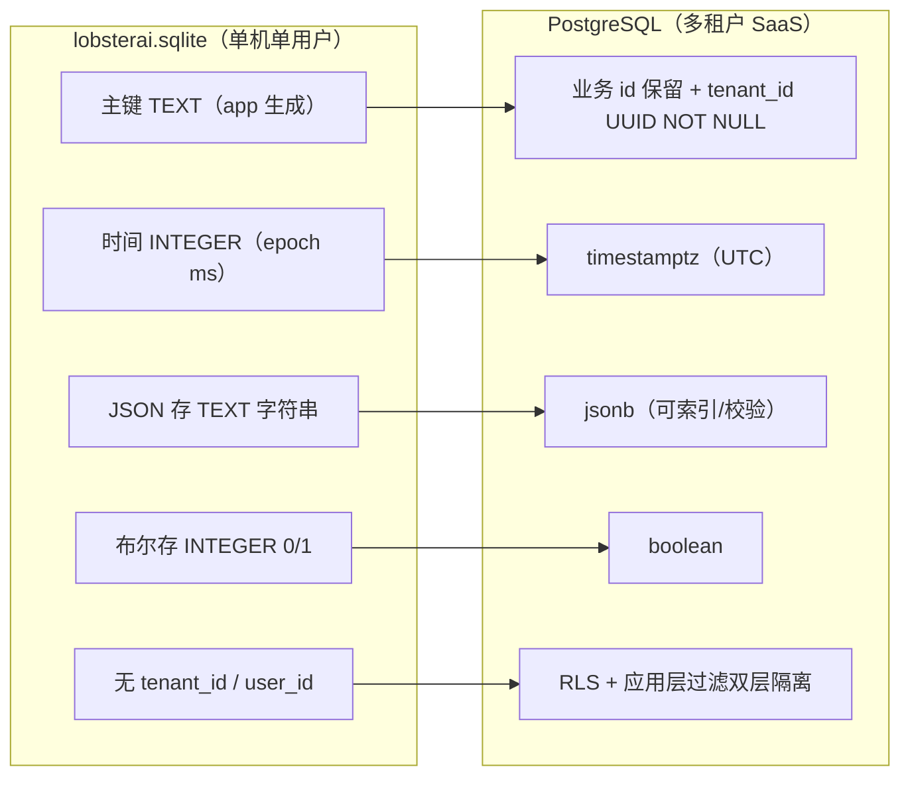
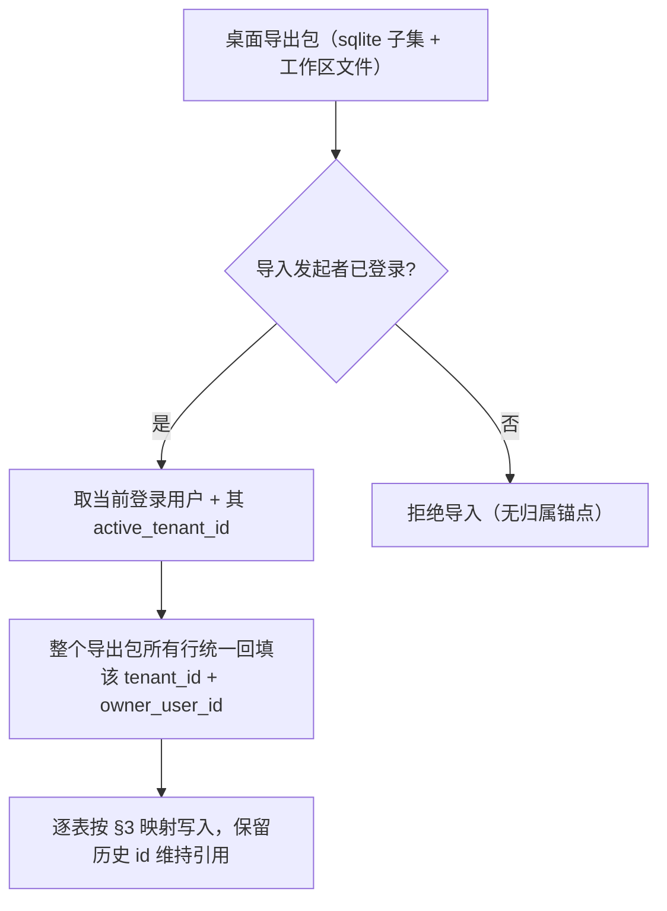
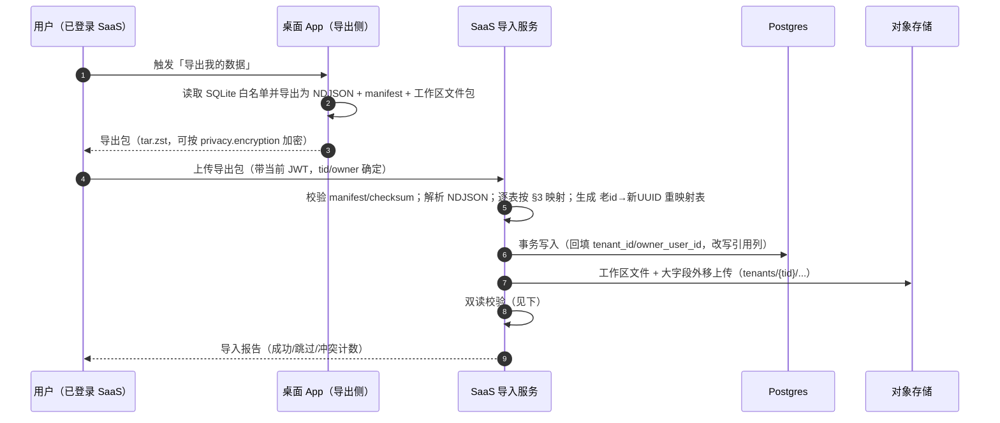

# 数据模型迁移（SQLite → Postgres 多租户）

> 本文档用途：把 LobsterAI 桌面端「单机单用户 SQLite」的业务数据模型，逐表改造为多租户 SaaS 的「PostgreSQL + Prisma（`tenant_id` 隔离 + 强制 RLS（每表 `FORCE`））」模型，并给出迁移工具、DDL 示例、数据归属改造清单与验收标准。本文同时是**身份与租户表的叙述 owner**（DDL 字段权威见 [附录C](./附录C-决策基线与接口契约总纲.md) §4，D3），见 §3.0。
> 适合读者：后端/DBA、数据迁移负责人、需要在新库上落表的各域开发者。
> 前置阅读：[附录C-决策基线与接口契约总纲](./附录C-决策基线与接口契约总纲.md)（D2 RLS 强制、D3 身份表 owner、D10 消息游标、§2 源码订正、§4/§5 身份表 DDL 与 RLS 参考实现——本文与之冲突处以附录 C 为准）、[01-现状架构调研](./01-现状架构调研.md)（数据层现状）、[05-认证与多租户账户](./05-认证与多租户账户.md)（`tenant_id` 的可信来源与鉴权语义/policy）、[11-定时任务调度](./11-定时任务调度.md)（目标调度权威为服务端 BullMQ，SQLite `scheduled_tasks`/`_runs` 为历史遗留、迁移期读出后废弃）、[08-文件工作区与对象存储](./08-文件工作区与对象存储.md)（`cwd` → 工作区二元组、大文件落对象存储）。
> 约束优先级：凡涉及被 [附录C](./附录C-决策基线与接口契约总纲.md) 拍死的跨文档决策（RLS 强制 D2、身份表 owner D3、消息游标 D10、迁移遗漏订正 §2-C 等），**以附录 C 为准**；其余与 [05](./05-认证与多租户账户.md) 的 SHARED 关键决策冲突处，以 05/关键决策为准。

---

## 0. 一页纸速览

现状数据层：Electron `userData/lobsterai.sqlite`，由 `src/main/sqliteStore.ts` 建表（另有 `src/main/im/imStore.ts`、`src/scheduledTask/metaStore.ts` 各自建表），迁移多为 ad-hoc `PRAGMA table_info()` 检查加 `ALTER TABLE`。**天生单用户设计：全部业务表无 `tenant_id`/`user_id` 列**（`grep tenant_id src/main/sqliteStore.ts` 无命中）。

目标数据层：PostgreSQL + Prisma。核心动作三条：

| 现状 | 目标 | 关键点 |
| --- | --- | --- |
| 表主键多为 `TEXT`（应用生成 id） | 保留业务 id，但**新增 `tenant_id UUID NOT NULL`** 作为隔离锚点 | `tenant_id` 唯一可信来源是 JWT `tid`（见 [05](./05-认证与多租户账户.md)） |
| `INTEGER`（epoch ms）时间戳 | `timestamptz`（`TIMESTAMPTZ`） | Prisma `DateTime`，统一存 UTC |
| `TEXT` 存 JSON（`metadata`/`config_json`/`skill_ids`…） | `jsonb` | 可 GIN 索引、可部分校验 |
| 无外键（SQLite `ON DELETE CASCADE` 部分有） | Postgres 外键 + `ON DELETE CASCADE`/`RESTRICT` | 明确级联语义 |
| 无行级隔离 | 每表加 `tenant_id` + 应用层 Prisma extension + Postgres RLS 兜底 | 纵深隔离（见 [05](./05-认证与多租户账户.md) §6、[14](./14-安全合规与多租户隔离.md)） |

**权威口径修正（务必遵守）**：

- **定时任务**：SaaS 目标调度权威是**服务端 BullMQ + Postgres 调度**（沙箱内 OpenClaw cron 禁用、不下发，见 [11](./11-定时任务调度.md)）。SQLite 的 `scheduled_tasks` / `scheduled_task_runs` 是**历史遗留表**，仅在迁移逻辑里被读出、迁移期读出后废弃，**不作为 SaaS 权威表**——服务端调度以 [11](./11-定时任务调度.md) 的 `scheduled_tasks`/`scheduled_task_runs`（BullMQ + Postgres）新定义为准；`scheduled_task_meta` 的 `origin`/`binding` 元数据保留（并入 11 的任务主表，见 §3.15/§3.16）。
- **文件工作区**：`cowork_sessions.cwd` 从「本机绝对路径」拆为「`workspaceId` + `project/` 子树内 `relRoot`」二元组，权威定义在 [08](./08-文件工作区与对象存储.md) §3.3。
- **记忆/Dreaming**：生产只建 `user_memories`/`user_memory_sources` 两张记忆表并迁 Postgres（结构化事实），工作区 `MEMORY.md` 落每租户 PVC/沙箱（见 [07](./07-OpenClaw运行时编排与沙箱隔离.md)/[08](./08-文件工作区与对象存储.md)）；`cowork_user_memories` **仅是测试表**（只出现在 `coworkStore.test.ts`），生产/迁移**不建也不迁**，见 §3.18、[附录C](./附录C-决策基线与接口契约总纲.md) C17。
- **桌面老用户数据不做在线迁移**：SaaS 是全新自建后端，桌面数据留在各自本机；仅提供**可选手动导入工具**（见 §6）。本文的「迁移映射」既服务于该可选导入，也作为「新库如何建表」的权威 schema。

---

## 1. 现状数据层盘点

### 1.1 三处建表来源

| 建表文件 | 表 | 说明 |
| --- | --- | --- |
| `src/main/sqliteStore.ts:66-287` | `kv`、`cowork_sessions`、`cowork_messages`、`cowork_session_capsules`、`cowork_config`、`user_memories`、`user_memory_sources`、`agents`、`mcp_servers`、`mcp_launch_resolutions`、`user_plugins`、`subagent_runs`、`subagent_messages` | 主库 13 表 + ad-hoc 迁移 |
| `src/main/im/imStore.ts:117-141` | `im_config`、`im_session_mappings` | IM 域 2 表 |
| `src/scheduledTask/metaStore.ts:21` | `scheduled_task_meta` | 定时任务本地元数据 1 表 |
| 历史遗留（仅迁移逻辑可见） | `scheduled_tasks`、`scheduled_task_runs` | 见 §3.17 |
| 测试表（仅测试代码可见，非生产/迁移） | `cowork_user_memories` | 见 §3.18、[附录C](./附录C-决策基线与接口契约总纲.md) C17 |

> `SQLITE_MIGRATION_TABLES`（`dataMigrationService.ts:SQLITE_MIGRATION_TABLES`）列出当前备份/迁移覆盖的 17 张表（含 `scheduled_tasks`/`scheduled_task_runs`），另加 `SQLITE_MIGRATION_KV_KEYS`（`auth_tokens`/`auth_user`/`app_config`/`skills_state`/`openclaw_session_policy`/`installation_uuid`）——这是桌面导出侧的真实清单，SaaS 导入工具据此解析。
> **订正（[附录C](./附录C-决策基线与接口契约总纲.md) C16）**：该 17 张表清单**不含 `cowork_session_capsules`**，若照现状清单导出/导入会**静默丢失连续性胶囊与压缩上下文**（§3.3）。导入工具落地前**必须把 `cowork_session_capsules` 补进导出清单**（并同步 §6.2 双读校验的行数对账口径），否则 fork/压缩会话在新库上下文断裂。

### 1.2 现状类型与隔离缺口



**核心缺口**：进程隔离在桌面上等价于「一个进程一个人」，所以表不需要 `tenant_id`；SaaS 里所有租户共享同一库，隔离必须显式化到每一行、每一次查询（见 [05](./05-认证与多租户账户.md) §6）。

---

## 2. 迁移总原则

### 2.1 通用改造规则（对所有业务表统一适用）

1. **加隔离列**：每张业务表加 `tenant_id UUID NOT NULL`；需要「谁创建」语义的表再加 `owner_user_id UUID`（如会话、定时任务、mcp_servers 等资源型表）。**`tenant_id` 只信 JWT `tid`，禁止从 body/query 取**（见 [05](./05-认证与多租户账户.md) §6.3）。
2. **双键策略**：内部关系主键统一用 `uuid`（`@default(uuid())`），但协议/UI/OpenClaw 配置中已有稳定字符串 ID 的资源必须保留 `logical_id text`。典型例子是每租户主 agent 的 `logical_id='main'`。API 继续暴露 `agentId='main'` 这类逻辑 ID；服务端内部可用 UUID FK。桌面导入的历史 id 存入 `legacy_id` 或映射表，不直接要求成为新表主键。跨租户逻辑 ID 用 `UNIQUE(tenant_id, logical_id)` 约束。
3. **类型规整**：
   - `INTEGER`（epoch ms） → `timestamptz`（`DateTime`），统一 UTC。
   - `TEXT` 存 JSON → `jsonb`。
   - `INTEGER 0/1`（布尔语义） → `boolean`。
   - `REAL`（如 `confidence`） → `double precision` / `numeric`。
   - 纯字符串（title/name/status/枚举） → `text`，枚举值由 `libs/shared/contracts` 的 Zod enum / 生成常量约束（不建议用 PG 原生 enum，扩展成本高）；现有 `src/shared/*/constants.ts` 仅作为 PR-1 初始抽取输入，不能作为目标态枚举事实源。
4. **历史列名保留**：兼容列名**原样保留**，最典型是 `cowork_sessions.claude_session_id`（`sqliteStore.ts:80`）。在 Prisma 里用 `@map("claude_session_id")` 保留物理列名，TS 字段可起更清晰的名（如 `runtimeSessionId`）。**不要在迁移期改物理列名**，以免破坏导入映射与历史查询。
5. **外键与级联**：显式声明外键；父删子删的用 `ON DELETE CASCADE`（如 `cowork_messages → cowork_sessions`），引用型的用 `RESTRICT`/`SET NULL`。**外键两侧同 `tenant_id`**（复合外键或 CHECK 兜底，见 §5.4）。
6. **软删除与审计**：资源型表统一加 `deleted_at timestamptz NULL`（软删）、`created_at`/`updated_at`（`@default(now())` / `@updatedAt`）；敏感写操作的审计走独立 `audit_logs`（见 [14](./14-安全合规与多租户隔离.md)），不在业务表堆审计列。
7. **索引重建**：现状 SQLite 单列索引全部改为「`tenant_id` 前缀的复合索引」（几乎所有查询都带 `tenant_id`，前缀化能命中）。唯一约束若原是全局唯一，改为「租户内唯一」（见 §2.3）。
8. **RLS 兜底**：每张 tenant-scoped 表 `ENABLE ROW LEVEL SECURITY` + `FORCE`，策略 `tenant_id = current_setting('app.tenant_id')::uuid`（见 §5.3、[05](./05-认证与多租户账户.md) §6.2）。

### 2.2 类型映射速查表

| SQLite 类型/用法 | Postgres 类型 | Prisma 类型 | 备注 |
| --- | --- | --- | --- |
| `TEXT`（id/name/status） | `text` | `String` | 枚举值走 `libs/shared/contracts` 生成常量 |
| `TEXT`（JSON 字符串） | `jsonb` | `Json` | 导入时 `JSON.parse` 后写入 |
| `INTEGER`（epoch ms） | `timestamptz` | `DateTime` | ms → UTC 时刻 |
| `INTEGER`（0/1 布尔） | `boolean` | `Boolean` | `!= 0` 转换 |
| `INTEGER`（计数/序号） | `bigint` 或 `integer` | `BigInt`/`Int` | `sequence` 用 `Int`（见 §4.3） |
| `REAL` | `double precision` | `Float` | `confidence` |
| （新增隔离列） | `uuid` | `String @db.Uuid` | `tenant_id`/`owner_user_id` |

**Postgres 扩展前置**：PR-2 第一条 migration 必须显式执行/校验 `CREATE EXTENSION IF NOT EXISTS citext`，因为 `users.email` 等权威 DDL 使用 `citext`。`gen_random_uuid()` 也必须在 PR-2 preflight 中验证：若目标 Postgres/托管库不提供内建函数，则启用 `pgcrypto` 或统一改为应用侧 UUID 生成，并同步更新 Prisma schema、DDL 示例与导入脚本。不得把 `citext`/UUID 函数当成目标库默认能力。

### 2.3 租户内唯一约束改写

现状里全局唯一的约束，在多租户下必须降为「租户内唯一」，否则跨租户重名会误撞：

| 现状唯一约束 | 现状 | 目标（租户内唯一） |
| --- | --- | --- |
| `mcp_servers.name UNIQUE`（`sqliteStore.ts:209`） | 全局唯一 | `@@unique([tenant_id, name])` |
| `user_memories.fingerprint`（去重语义，`sqliteStore.ts:170`） | 全局指纹去重 | 条件唯一索引 `UNIQUE(tenant_id, owner_user_id, fingerprint) WHERE deleted_at IS NULL`（同人同租户内去重，软删可复用，见 §3.11） |
| `kv.key` PK | 全局键 | 复合主键 `@@id([tenant_id, key])`（见 §3.12） |
| `cowork_config.key` PK | 全局键 | 复合主键 `@@id([tenant_id, key])`（见 §3.4） |
| `im_session_mappings (im_conversation_id, platform)` PK | 全局复合 PK | `@@id([tenant_id, platform, im_conversation_id])`（见 §3.16） |

---

## 3. 逐表映射（权威）

> 每表给：**目的 → 新增隔离列 → 类型调整 → 索引 → 外键 → 备注**。列名带 `@map` 的表示保留历史物理列名。tenant-scoped 表默认都加 §2.1 的通用列（`tenant_id`、必要时 `owner_user_id`、`deleted_at`），下文只在有特殊性时重复强调。

### 3.0 身份与租户表（新建，非 SQLite 迁移；本文为叙述 owner）

> **归属裁决（[附录C](./附录C-决策基线与接口契约总纲.md) D3）**：`users / tenants / memberships / identities / refresh_tokens / auth_codes / oauth_clients` 是 SaaS 全新引入的身份/租户基座（桌面端无对应 SQLite 表），**其字段级 DDL 的唯一权威在 [附录C](./附录C-决策基线与接口契约总纲.md) §4**；**本文（06）为叙述 owner 并内联引用附录 C**，[05](./05-认证与多租户账户.md) 只保留鉴权语义、令牌轮换与 RLS policy——**05 与 06 不再互指**（此前 05 §9 指向 06、06 指回 05 两端落空，导致身份 Prisma schema 无法生成，已由本节+附录 C §4 拍死）。

这些表是所有业务表 `tenant_id` / `owner_user_id` 外键的可信来源。字段全集见 [附录C](./附录C-决策基线与接口契约总纲.md) §4，此处只给职责与落地要点（避免重复大段 DDL）：

| 表 | 职责 | 关键落地要点（详见附录 C §4） |
| --- | --- | --- |
| `tenants` | 租户实体 | `status` active/suspended/deleted 软删；`terms_version` 合规同意 |
| `users` | 全局用户 | `email citext` 大小写不敏感；**唯一索引条件化** `UNIQUE(email) WHERE deleted_at IS NULL`（软删后可复用邮箱） |
| `memberships` | 用户↔租户多对多 + 角色 | `role` owner/admin/member/viewer（与 `05` §5.1 角色矩阵一致）；`UNIQUE(user_id, tenant_id)` |
| `identities` | 外部 OIDC/社会化身份 | `UNIQUE(provider, provider_uid)` |
| `refresh_tokens` | 刷新令牌轮换 + family | `family_id`/`replaced_by`/`absolute_exp`，对应 D11 刷新主流程 |
| `auth_codes` | OAuth2 授权码 + PKCE | `code_challenge` S256、`used_at` 单次使用 |
| `oauth_clients` | `redirect_uri` 白名单 | `redirect_uris text[]`、`is_public` |

- **RLS 特殊性**：身份表按**成员关系 / `app.user_id`** 建策略（而非单一 `app.tenant_id`），覆盖三场景——登录首查（无 tenant 上下文，按 `user_id`，首查用 `current_setting('app.tenant_id', true)` 容忍 NULL）、切租户、成员管理。参考实现见 [附录C](./附录C-决策基线与接口契约总纲.md) §4/§5、[05](./05-认证与多租户账户.md)。
- **本节定位**：本文只承接归属与落地要点；完整字段/约束/加密与订阅生命周期不在此展开，字段权威在附录 C §4/§6，落地节奏分别按 PR-2 数据脚手架、`09` 计费专题与 `17` V5/V6 路线图执行。

### 3.1 `cowork_sessions`（会话）

- **目的**：本地会话记录（含 fork 谱系、cwd、agent 绑定、runtime 会话 id）。源：`sqliteStore.ts:77-97` + 一系列 ad-hoc 列迁移（`sqliteStore.ts:311-376`，如 `active_skill_ids`/fork 系列）。
- **新增隔离列**：`tenant_id UUID NOT NULL`、`owner_user_id UUID NOT NULL`（会话归属某用户，组织租户内区分创建者）。
- **类型调整**：
  - `created_at`/`updated_at`/`forked_at`：`INTEGER` → `timestamptz`。
  - `pinned`：`INTEGER 0/1` → `boolean`。
  - `cwd`：**语义变更**——由本机绝对路径拆为 `workspace_id UUID` + `rel_root text`（`project/` 子树内相对根，见 [08](./08-文件工作区与对象存储.md) §3.3、§7.3）。为平滑导入可暂留 `legacy_cwd text` 存原始路径。
  - `goal_json`：**现状已存在但此前三处目标定义全漏**（[附录C](./附录C-决策基线与接口契约总纲.md) C16）——该列存会话目标（`sessions.goal` / `cowork:stream:goal` 事件的持久化形态，源 `sqliteStore.ts` 的 `goal_json`）。目标 schema **必须保留此列**：`TEXT JSON` → `jsonb goal_json`，随会话导入；否则会话目标在新库丢失、`sessions.goal` RPC/流事件（见 [附录C](./附录C-决策基线与接口契约总纲.md) §3.2）无处落库。
- **历史列名保留**：`claude_session_id`（`@map("claude_session_id")`，OpenClaw runtime 的会话键，非「Claude」品牌语义）、`fork_workspace_path`/`fork_git_branch`/`fork_git_base_ref` 原样保留。
- **索引**：`@@index([tenant_id, updated_at(sort: Desc)])`（列表默认排序）、`@@index([tenant_id, owner_user_id, updated_at])`、`@@index([tenant_id, parent_session_id])`（fork 树）、`@@index([tenant_id, pinned, pin_order])`。
- **外键**：`workspace_id → workspaces.id`（`ON DELETE RESTRICT`）；`parent_session_id` 自引用（`ON DELETE SET NULL`）；内部 `agent_pk → agents.id`（`ON DELETE SET NULL`）。对外仍返回 `agent_id` 字符串逻辑 ID，例如 `main`。
- **备注**：`status`（idle/running/error）为运行态，可持久化最后一次状态；实时状态以 WS 流为准（见 [01](./01-现状架构调研.md) §5.1）。

### 3.2 `cowork_messages`（会话消息）

- **目的**：会话消息（`type` = user/assistant/tool，`content`，`metadata`，展示序键 `created_at` +（可空）`sequence`）。源：`sqliteStore.ts:101-115` + `sequence` 迁移（`sqliteStore.ts:377+`）。
- **新增隔离列**：`tenant_id UUID NOT NULL`（冗余下放，避免 join 才能拿 tenant，利于 RLS）。
- **类型调整**：`created_at` → `timestamptz`；`metadata`（TEXT JSON）→ `jsonb`；`content` 保持 `text`（大字段存储策略见 §4.2）。
- **稳定游标（[附录C](./附录C-决策基线与接口契约总纲.md) D10）**：分页 / WS 去重的游标用**不可变复合键 `(created_at, id)`**（`id` 为 uuid，或独立 ksuid），**不用 `sequence` 作游标**。理由：现状 `sequence` **可空、按 `SELECT COALESCE(MAX(sequence),0)+1` 赋值、insert-before 会 shift 重排**（`coworkStore.ts:1753/1791`），并非稳定键，现状排序已用 `COALESCE(sequence, created_at), created_at, ROWID` 兜底；[04](./04-后端服务与API设计.md) 若用 `cursor={sequence}` 会指向错位消息。`sequence` 目标态仅作**展示序**（同毫秒 tiebreaker，见 §4.3），不进游标契约。
- **索引**：现状 `idx_cowork_messages_session_id`（`sqliteStore.ts:114`）改为 `@@index([tenant_id, session_id, created_at, id])`（稳定游标读取）+ `@@index([tenant_id, session_id, sequence])`（展示序辅助，见 §4.3）。
- **外键**：`session_id → cowork_sessions.id ON DELETE CASCADE`（沿用 `sqliteStore.ts:109`）。
- **备注**：消息内容大字段（长文本/base64 附件）不入行内，改存对象存储，行内存引用（见 §4.2）。
- **分区策略（[附录C](./附录C-决策基线与接口契约总纲.md) D10——V1 不做声明式分区）**：`cowork_messages` 是全库写入量最大的表，但 **V1 一律不做声明式分区**。
  - **不用 `tenant_id` HASH 分区**：Postgres 声明式分区要求分区列并入每个唯一约束/主键，而稳定键是不可变的 `(created_at, id)`（`tenant_id` 不在其中），HASH `tenant_id` 会逼你把 `tenant_id` 塞进主键/唯一约束、扭曲键设计；叠上 `sequence` 非稳定键（见上）更无法作分区唯一列，且大租户单分区仍会热点化。
  - **确有必要时（单表体量证据触发，非默认）**：改用 **`created_at` 时间范围（RANGE）分区**（如按月，配合 pg_partman 滚动、整分区 `DETACH`/`DROP` 归档冷数据），且**分区列 `created_at` 必须并入每个唯一约束**（如 `UNIQUE(session_id, created_at, id)`）。这与稳定游标 `(created_at, id)` 天然对齐。
  - V1 先靠 `tenant_id` 前缀复合索引 + 大字段外移（§4.2）+ TOAST/慢查询监控（[15](./15-部署运维与可观测性.md)）控制膨胀；分区留到有实测容量证据后再引入。
- **RLS 下连接池注意事项**：RLS 依赖会话变量 `app.tenant_id`（见 §5.3），而 PgBouncer transaction 模式下同一物理连接会被不同请求复用——**必须用 `SET LOCAL app.tenant_id = '<tid>'`（事务级），不可用 `SET`（会话级）**，否则变量会泄漏到复用该连接的下一个租户请求，造成跨租户读。因此每次查询都要开显式事务并在事务开头 `SET LOCAL`；用 Prisma 时通过 `$transaction` 包裹或中间件在每请求事务起始处注入（见 [05](./05-认证与多租户账户.md) §6.2）。避免 session 模式长连接绑定单租户导致连接池利用率坍塌。

### 3.3 `cowork_session_capsules`（上下文胶囊）

- **目的**：连续性/上下文胶囊（fork 与压缩用）。源：`sqliteStore.ts:118-127`。PK = `session_id`（一会话一胶囊）。
- **新增隔离列**：`tenant_id UUID NOT NULL`。
- **类型调整**：`capsule_json`（TEXT）→ `jsonb`；`updated_at`/`last_compacted_at` → `timestamptz`；`version`/`revision` 保 `Int`。
- **索引/主键**：主键仍 `session_id`（每会话唯一）；加 `@@index([tenant_id])`（RLS/清理）。
- **外键**：`session_id → cowork_sessions.id ON DELETE CASCADE`（沿用 `sqliteStore.ts:126`）。
- **备注**：胶囊可能较大，超阈值同样落对象存储 + 行内引用（见 §4.2）。

### 3.4 `cowork_config`（Cowork 设置）

- **目的**：Cowork 键值设置（工作目录、执行模式、agent engine、记忆/dreaming/embedding 开关等）。源：`sqliteStore.ts:131-135`，PK = `key`。
- **新增隔离列**：`tenant_id UUID NOT NULL`。配置的粒度决策：**大多数配置按租户**（组织统一），少量「个人偏好」按用户——用 `scope`（`tenant`/`user`）+ 可空 `user_id` 表达，或拆两张表。GA 主线建议：`cowork_config` 走**租户级**，用户级偏好并入 `users`/独立 `user_preferences`（见 [05](./05-认证与多租户账户.md)）。
- **类型调整**：`value`（TEXT，多为 JSON）→ `jsonb`；`updated_at` → `timestamptz`。
- **主键**：全局 `key` PK → 复合主键 `@@id([tenant_id, key])`（见 §2.3）。
- **外键**：无（键值表）。
- **备注**：`cowork_config` 里的「默认工作目录」在 SaaS 下语义变为「默认工作区 id」（见 [08](./08-文件工作区与对象存储.md) §7.3）。

### 3.5 `agents`（自定义/预设 Agent）

- **目的**：agent 定义（`system_prompt`、`identity`、`model`、`skill_ids`、per-agent `working_directory`、`enabled`/`pinned`/`is_default`、`source` custom/preset、`preset_id`）。源：`sqliteStore.ts:184-202`。
- **新增隔离列**：`tenant_id UUID NOT NULL`、`owner_user_id UUID`（创建者）。**预设 agent 的处理**：内置预设是平台级模板，不属任何租户——预设模板放独立只读表 `agent_presets`（无 `tenant_id`），租户「安装预设」时在 `agents` 里落一份带 `tenant_id` 的实例（`source='preset'` + `preset_id`）。
- **类型调整**：`skill_ids`（TEXT `'[]'`）→ `jsonb`（字符串数组）；`enabled`/`pinned`/`is_default`（0/1）→ `boolean`；`created_at`/`updated_at` → `timestamptz`。
- **索引**：`@@index([tenant_id, enabled, pinned, pin_order])`、`@@index([tenant_id, is_default])`。
- **外键**：`working_directory` 同样映射到 `workspace_id`（见 [08](./08-文件工作区与对象存储.md)）；skill 引用为 jsonb 内的 id，不建外键（skill 定义随插件同步，见 [10](./10-MCP与技能改造.md)）。
- **备注**：主 agent 的对外 ID 固定为 `main`。在多租户下，`main` 是每租户各自一份的逻辑 agent：`agents.id` 为内部 UUID，`agents.logical_id='main'`，约束 `UNIQUE(tenant_id, logical_id)`。OpenClaw config、前端 API 和旧 IPC 兼容层继续使用 `logical_id`，服务端内部写关系时优先使用 `agent_pk`。

### 3.6 `mcp_servers`（MCP 服务器配置）

- **目的**：用户配置的 MCP 服务器（`transport_type` stdio/sse/http、`config_json`、`enabled`）。源：`sqliteStore.ts:207-216`。
- **新增隔离列**：`tenant_id UUID NOT NULL`、`owner_user_id UUID`。
- **类型调整**：`config_json`（TEXT）→ `jsonb`；`enabled` → `boolean`；时间戳 → `timestamptz`。
- **唯一约束改写**：`name UNIQUE`（全局，`sqliteStore.ts:209`）→ `@@unique([tenant_id, name])`（租户内唯一，见 §2.3）。
- **索引**：`@@index([tenant_id, enabled])`。
- **外键**：`mcp_launch_resolutions.server_id → mcp_servers.id`（见 §3.7）。
- **备注**：`transport_type='stdio'` 的服务器在 SaaS 下必须在沙箱内起子进程（见 [10](./10-MCP与技能改造.md)）；`config_json` 里的敏感字段（token/密钥）迁移时应加密或改引用 secrets 存储（见 [14](./14-安全合规与多租户隔离.md)）。

### 3.7 `mcp_launch_resolutions`（MCP 启动决议）

- **目的**：MCP 启动解析结果（resolver 类型、命令、args、env、安装目录、探针状态）。源：`sqliteStore.ts:220-238`，PK = `server_id`（一服务器一决议）。
- **新增隔离列**：`tenant_id UUID NOT NULL`（冗余下放，随 `mcp_servers`）。
- **类型调整**：`args_json`/`env_json`（TEXT）→ `jsonb`；`installed_at`/`resolved_at`/`last_probe_at`/`updated_at` → `timestamptz`。
- **主键/索引**：主键仍 `server_id`；加 `@@index([tenant_id])`。
- **外键**：`server_id → mcp_servers.id ON DELETE CASCADE`（删服务器连带删决议）。
- **备注**：`env_json` 极可能含密钥，迁移时脱敏/加密（见 [14](./14-安全合规与多租户隔离.md)）。SaaS 下「安装目录/命令」是沙箱内路径，导入桌面数据时这些字段基本作废（需在目标沙箱重新解析，见 [10](./10-MCP与技能改造.md)），因此该表可**不迁移历史值**，仅保留 schema。

### 3.8 `user_plugins`（用户安装的 OpenClaw 插件）

- **目的**：用户安装的插件（`source`、`spec`、`registry`、`version`、`enabled`、`config`）。源：`sqliteStore.ts:243-251` + `config` 列迁移（`sqliteStore.ts:300-309`），PK = `plugin_id`。
- **新增隔离列**：`tenant_id UUID NOT NULL`、`owner_user_id UUID`。
- **类型调整**：`config`（TEXT JSON）→ `jsonb`；`enabled` → `boolean`；`installed_at` → `timestamptz`。
- **主键/唯一**：全局 `plugin_id` PK → 复合 `@@id([tenant_id, plugin_id])`（同一插件可被不同租户各装一份）。
- **索引**：`@@index([tenant_id, enabled])`。
- **备注**：插件安装的物理产物在沙箱内（见 [10](./10-MCP与技能改造.md)）；DB 只存声明。`config` 敏感字段同 §3.6 脱敏。

### 3.9 `subagent_runs`（子 agent 运行跟踪）

- **目的**：子 agent 运行记录（`parent_session_id`、`session_key`、`agent_id`、`task`、`label`、`status`、`messages_persisted`）。源：`sqliteStore.ts:255-265` + `messages_persisted` 迁移（`sqliteStore.ts:289-298`）。
- **新增隔离列**：`tenant_id UUID NOT NULL`。
- **类型调整**：`status` 保 `text`（running/…）；`messages_persisted`（0/1）→ `boolean`；`created_at`/`ended_at` → `timestamptz`。
- **索引**：现状 `idx_subagent_runs_parent_session_id`（`sqliteStore.ts:267`）→ `@@index([tenant_id, parent_session_id])`。
- **外键**：`parent_session_id → cowork_sessions.id ON DELETE CASCADE`（子运行随父会话删除）。
- **备注**：`agent_id`/`session_key` 引用运行态资源，可 `SET NULL` 或不建强外键。

### 3.10 `subagent_messages`（子 agent 会话历史）

- **目的**：抓取的子 agent 对话历史（`run_id`、`type`、`content`、`metadata`、`sequence`）。源：`sqliteStore.ts:274-283`。
- **新增隔离列**：`tenant_id UUID NOT NULL`。
- **类型调整**：`metadata`（TEXT）→ `jsonb`；`content` 保 `text`（大字段策略见 §4.2）；`created_at` → `timestamptz`；`sequence` 保 `Int`。
- **索引**：现状 `idx_subagent_messages_run_id`（`sqliteStore.ts:284`）→ `@@index([tenant_id, run_id, sequence])`。
- **外键**：`run_id → subagent_runs.id ON DELETE CASCADE`。

### 3.11 `user_memories`（用户记忆）

- **目的**：用户记忆事实（`text`、`fingerprint` SHA-1 去重、`confidence`、`is_explicit`、`status`、`last_used_at`）。源：`sqliteStore.ts:139-149`。
- **新增隔离列**：`tenant_id UUID NOT NULL`、`owner_user_id UUID`（记忆通常是「某人的记忆」；组织租户下按用户区分）。
- **类型调整**：`confidence`（REAL）→ `double precision`；`is_explicit`（0/1）→ `boolean`；`created_at`/`updated_at`/`last_used_at` → `timestamptz`。
- **唯一约束改写**：`fingerprint` 去重（现状 `idx_user_memories_fingerprint`，`sqliteStore.ts:170`）→ **条件唯一索引** `UNIQUE (tenant_id, owner_user_id, fingerprint) WHERE deleted_at IS NULL`（同人同租户内去重，见 §2.3）。因本表带软删 `deleted_at`（§4.4），**唯一约束必须条件化**，否则软删一条记忆后同指纹无法再次写入（复用 [附录C](./附录C-决策基线与接口契约总纲.md) §4 `users_email_uk` 的 `WHERE deleted_at IS NULL` 模式）。Prisma 侧用 `@@index` + 迁移 raw SQL 建部分唯一索引（Prisma `@@unique` 不支持条件）。
- **索引**：现状 `idx_user_memories_status_updated_at`（`sqliteStore.ts:166`）→ `@@index([tenant_id, owner_user_id, status, updated_at(sort: Desc)])`。
- **备注**：记忆的**结构化事实**入 Postgres；工作区里的 `MEMORY.md`（durable memory）与 `memory/YYYY-MM-DD.md` 落每租户沙箱工作区（见 [07](./07-OpenClaw运行时编排与沙箱隔离.md)/[08](./08-文件工作区与对象存储.md)）。Dreaming 子系统的**调度**归服务端调度器（见 [11](./11-定时任务调度.md) §4.5 的内部任务），**数据**归本表 + 工作区文件。归属决策：Dreaming 产出的记忆条目按 `owner_user_id` 落本表。

### 3.12 `user_memory_sources`（记忆溯源）

- **目的**：记忆 → session/message 的来源关系（`memory_id`、`session_id`、`message_id`、`role`、`is_active`）。源：`sqliteStore.ts:153-162`。
- **新增隔离列**：`tenant_id UUID NOT NULL`（随 `user_memories`）。
- **类型调整**：`is_active`（0/1）→ `boolean`；`created_at` → `timestamptz`。
- **索引**：现状 `idx_user_memory_sources_session_id`/`idx_user_memory_sources_memory_id`（`sqliteStore.ts:174-179`）→ `@@index([tenant_id, session_id, is_active])`、`@@index([tenant_id, memory_id, is_active])`。
- **外键**：`memory_id → user_memories.id ON DELETE CASCADE`（沿用 `sqliteStore.ts:161`）；`session_id`/`message_id` 引用会话/消息，可 `SET NULL`（来源会话被删时保留记忆但断链）。

### 3.13 `kv`（全局键值）

- **目的**：app 级 JSON 键值（`app_config`、认证标志、迁移标记等）。源：`sqliteStore.ts:68-72`，PK = `key`。
- **改造分流（逐键路由，[附录C](./附录C-决策基线与接口契约总纲.md) C16 / P1-6）**（关键——`kv` 现状混装了「平台级」「租户级」「用户级」三类语义，SaaS 下必须**逐键**拆开，下表逐一覆盖 `SQLITE_MIGRATION_KV_KEYS` 全集）：

| 现状 kv key（`SQLITE_MIGRATION_KV_KEYS`） | 归宿 |
| --- | --- |
| `auth_tokens` / `auth_user` | **废弃**——SaaS 认证走 JWT + `refresh_tokens` 表（见 §3.0、[05](./05-认证与多租户账户.md) §4），不入 kv |
| `app_config`（含 `app.testMode` 等） | 拆为平台级配置（环境变量/配置中心）+ 租户级 `cowork_config` |
| `skills_state` | 迁 `user_plugins`/skill 启用状态（见 [10](./10-MCP与技能改造.md)），按 `tenant_id` |
| `openclaw_session_policy` | 迁租户级配置表/`cowork_config`（按 `tenant_id`） |
| `installation_uuid` | 桌面机器标识，SaaS 无意义，**不迁** |
| 定时任务迁移标记（如 `scheduled_tasks_migrated_to_openclaw_v1`，见 [11](./11-定时任务调度.md) §2.2） | 迁移期一次性标记，SaaS 不需 |

- **保留形态**：若仍需一张通用键值表，建**租户级** `kv`：复合主键 `@@id([tenant_id, key])`，`value jsonb`，`updated_at timestamptz`；平台级键值另设 `platform_kv`（无 `tenant_id`，仅 superadmin 可写，见 [14](./14-安全合规与多租户隔离.md)）。
- **备注**：**不要把认证令牌落 kv**。订正现状口径（[附录C](./附录C-决策基线与接口契约总纲.md) A1）：`auth_tokens` **现状由主进程 `saveAuthTokens` 明文写 SQLite `kv` 表**，renderer 经 IPC 按需取、**并无 renderer `localStorage`**——真实风险是 kv 明文而非 localStorage XSS。SaaS 下 refresh token 存哈希于专表 `refresh_tokens`（见 §3.0、[05](./05-认证与多租户账户.md) §4.2）。

### 3.14 `im_config`（IM 平台配置）

- **目的**：IM 平台配置键值。源：`imStore.ts:117-121`，PK = `key`。
- **改造归宿**：IM 渠道列为 **GA 后续**（见 [13](./13-功能取舍与降级清单.md)）。因此本表**建 schema 但 GA 主线不接线**：`tenant_id UUID NOT NULL` + 复合主键 `@@id([tenant_id, key])`，`value jsonb`，`updated_at timestamptz`。
- **备注**：IM 配置里含平台 token/secret，迁移/落表时必须加密或走 secrets（见 [14](./14-安全合规与多租户隔离.md)）。桌面导入工具**默认跳过** IM 配置（GA 主线无对接目标）。

### 3.15 `im_session_mappings`（IM 会话映射）

- **目的**：IM 会话 ↔ Cowork/OpenClaw 会话映射（`im_conversation_id`、`platform`、`cowork_session_id`、`openclaw_session_key`、`agent_id`）。源：`imStore.ts:130-157`，复合 PK `(im_conversation_id, platform)`。
- **新增隔离列**：`tenant_id UUID NOT NULL`。
- **类型调整**：`created_at`/`last_active_at` → `timestamptz`；`agent_id`（现状默认 `'main'`，`imStore.ts:150`）保 `text`。
- **主键改写**：`(im_conversation_id, platform)` → `@@id([tenant_id, platform, im_conversation_id])`（租户内唯一，见 §2.3）。
- **外键**：`cowork_session_id → cowork_sessions.id ON DELETE CASCADE`（可选）。
- **备注**：IM 属 GA 后续；本表随 IM 一起落地。

### 3.16 `scheduled_task_meta`（定时任务本地元数据）

- **目的**：每个 taskId 的 `origin`（legacy/im/cowork/manual）与 `binding`（new_session/ui_session/im_session/session_key），JSON 字符串。源：`metaStore.ts:14-51`（建表 `metaStore.ts:21`），PK = `task_id`。
- **权威口径**：定时任务权威是服务端调度器（见 [11](./11-定时任务调度.md)）。**本表的 `origin`/`binding` 不再独立成表，而是并入 [11](./11-定时任务调度.md) §3.3 的 `scheduled_tasks.origin_json`/`binding_json`**（Postgres 有原生 jsonb + 外键，无需像 gateway cron API 那样另存自定义字段）。
- **迁移语义**：桌面导入时读 `scheduled_task_meta` 的 `origin`/`binding`，与迁移出的任务定义合并写入 [11](./11-定时任务调度.md) 的 `scheduled_tasks` 记录。
- **备注**：本文**不**为 `scheduled_task_meta` 定义独立目标表；它是「被合并入」的来源。

### 3.17 `scheduled_tasks` / `scheduled_task_runs`（历史遗留表，按遗留处理）

- **权威口径（务必按此处理）**：这两张 SQLite 表是**历史遗留**。当前它们只在迁移逻辑（`migrate.ts`）里被**读出、迁入 OpenClaw gateway cron 后废弃**；真正的任务定义与运行历史现在在 gateway（见 [11](./11-定时任务调度.md) §2.2）。
- **SaaS 处置**：
  1. **不把这两张 SQLite 表当作 SaaS 权威表**。SaaS 的 `scheduled_tasks`/`scheduled_task_runs` 是 [11](./11-定时任务调度.md) §3.3 全新定义的多租户 Postgres 表（BullMQ + Postgres 权威、`@@unique([taskId, scheduledForMs])` 幂等、`is_internal` 系统任务等），**与桌面遗留表同名但语义不同**。
  2. 桌面导入工具对这两张遗留表：**若桌面数据尚未迁入 gateway**（旧版本），可读出用户任务（跳过 internal）映射到 SaaS 新表；**若已迁入 gateway**，则从 gateway cron 侧读（见 [11](./11-定时任务调度.md) §7），SQLite 遗留表可忽略。
- **备注**：本文不为遗留 SQLite `scheduled_tasks`/`scheduled_task_runs` 定义目标 schema——目标 schema 归 [11](./11-定时任务调度.md)。运行历史一般**不迁**（从零开始，见 [11](./11-定时任务调度.md) §7）。

### 3.18 `cowork_user_memories`（测试表，勿迁）

- **现状事实（[附录C](./附录C-决策基线与接口契约总纲.md) C17）**：`cowork_user_memories` **仅出现在测试代码 `coworkStore.test.ts`**，任何生产建表路径（`sqliteStore.ts` / `coworkStore.ts` / `imStore.ts` / `metaStore.ts`）与桌面导出清单（`SQLITE_MIGRATION_TABLES`）**均无此表**。生产只建 `user_memories` / `user_memory_sources` 两张记忆表。
- **SaaS 处置**：**不建独立目标表，也不写任何迁移/导入逻辑**——桌面端不存在该表的存量数据，为它写「读出→归并」是**为不存在的表写迁移**（[附录B](./附录B-术语表与阅读指南.md) / [13](./13-功能取舍与降级清单.md) §2.1 同此口径，勿再列它为迁移源）。会话级记忆的结构化事实统一走 §3.11 `user_memories` + §3.12 `user_memory_sources`。

### 3.19 逐表映射汇总表

| SQLite 表 | 目的 | 加 `tenant_id` | 加 `owner_user_id` | 主要类型调整 | 唯一/主键改写 | 外键 |
| --- | --- | :--: | :--: | --- | --- | --- |
| `cowork_sessions` | 会话 | ✅ | ✅ | 时间戳→timestamptz；`cwd`→`workspace_id`+`rel_root`；`goal_json`→jsonb（原漏，C16）；bool | — | `workspace_id`、自引用 parent、`agent_id` |
| `cowork_messages` | 消息 | ✅ | — | metadata→jsonb；时间戳；大字段外移 | — | `session_id` CASCADE |
| `cowork_session_capsules` | 上下文胶囊 | ✅ | — | capsule→jsonb；时间戳 | PK=session_id | `session_id` CASCADE |
| `cowork_config` | Cowork 设置 | ✅ | — | value→jsonb | `@@id([tenant_id,key])` | — |
| `agents` | Agent | ✅ | ✅ | skill_ids→jsonb；bool；预设拆表 | `(tenant_id,id)` 唯一 | `workspace_id` |
| `mcp_servers` | MCP 配置 | ✅ | ✅ | config→jsonb；bool | `@@unique([tenant_id,name])` | — |
| `mcp_launch_resolutions` | MCP 决议 | ✅ | — | args/env→jsonb；时间戳 | PK=server_id | `server_id` CASCADE |
| `user_plugins` | 插件 | ✅ | ✅ | config→jsonb；bool | `@@id([tenant_id,plugin_id])` | — |
| `subagent_runs` | 子 agent 运行 | ✅ | — | bool；时间戳 | — | `parent_session_id` CASCADE |
| `subagent_messages` | 子 agent 消息 | ✅ | — | metadata→jsonb；时间戳 | — | `run_id` CASCADE |
| `user_memories` | 用户记忆 | ✅ | ✅ | confidence→float；bool | 条件唯一 `UNIQUE(tenant_id,owner_user_id,fingerprint) WHERE deleted_at IS NULL` | — |
| `user_memory_sources` | 记忆溯源 | ✅ | — | bool；时间戳 | — | `memory_id` CASCADE |
| `kv` | 全局键值 | ✅（拆分） | — | value→jsonb；语义拆分 | `@@id([tenant_id,key])` + 平台级另表 | — |
| `im_config` | IM 配置 | ✅ | — | value→jsonb | `@@id([tenant_id,key])` | — |
| `im_session_mappings` | IM 映射 | ✅ | — | 时间戳 | `@@id([tenant_id,platform,im_conversation_id])` | `cowork_session_id` |
| `scheduled_task_meta` | 任务本地元数据 | （并入 11） | — | origin/binding→jsonb | 并入 `scheduled_tasks` | 见 [11](./11-定时任务调度.md) |
| `scheduled_tasks`（遗留） | 历史遗留 | — 按遗留处理 | — | — | 目标 schema 归 [11](./11-定时任务调度.md) | — |
| `scheduled_task_runs`（遗留） | 历史遗留 | — 按遗留处理 | — | — | 目标 schema 归 [11](./11-定时任务调度.md) | — |
| `cowork_user_memories`（测试表，C17） | 仅测试代码 | — 不迁 | — | — | 不建表、不写迁移 | — |

---

## 4. 关键横切议题

### 4.1 `tenant_id` 回填来源（导入时如何确定归属）

新建数据的 `tenant_id` 永远来自 JWT `tid`（见 [05](./05-认证与多租户账户.md) §4.1）。但**导入桌面存量数据**时没有请求上下文，需要显式确定归属：



- **回填规则**：一次导入 = 一个明确的目标租户（发起导入的用户的 `active_tenant_id`）+ 一个 `owner_user_id`（发起者）。**整包同租户**，不做「一个包拆多租户」。
- **id 冲突**：导入不把桌面原始业务 id 直接写成新表主键。导入器为每条资源生成新 UUID，同时建立 `legacy_id → new_uuid` 重映射表，并同步改写所有引用列（`session_id`/`memory_id`/`parent_session_id`…）。需要对外保留语义的字符串（如 agent `main`）写入 `logical_id`。
- **组织租户**：导入到组织租户时，`tenant_id` = 组织，`owner_user_id` = 发起者；权限校验按 [05](./05-认证与多租户账户.md) §5 的角色矩阵（需 member+ 才能导入）。

### 4.2 消息内容大字段存储策略

现状 `cowork_messages.content` / `subagent_messages.content` / `capsule_json` 直接把大文本（含 base64 附件、长工具输出）塞进 SQLite。SaaS 下：

| 内容类型 | 存储位置 | 行内保留 |
| --- | --- | --- |
| 普通文本消息（< 阈值，如 64KB） | 行内 `content text` | 全文 |
| 超长文本 / 大工具输出（≥ 阈值） | 对象存储（`tenants/{tid}/.../messages/{id}.txt`，见 [08](./08-文件工作区与对象存储.md)） | 引用 + 摘要（前 N 字符预览） |
| base64 内联附件/图片 | **禁止入库**——落对象存储，行内存签名 URL 引用（见 [08](./08-文件工作区与对象存储.md) §5.2） | 引用 + mime/size |
| 结构化 metadata | 行内 `jsonb`（可 GIN 索引查询） | 全量（但不塞大二进制） |

- **阈值策略**：写入前判断 `content` 字节数，超阈值转外存并把 `content` 置为「摘要 + `contentRef`」（jsonb metadata 里记 `{ storage: 's3', key, bytes }`）。读取时按需拉签名 URL（见 [08](./08-文件工作区与对象存储.md) §4.3）。
- **好处**：控制单行/单表膨胀，避免 Postgres TOAST 过度膨胀与行迁移；WS 流式截断（现状 `truncateIpcString`，见 [01](./01-现状架构调研.md) §5.1）语义在 WS 网关层保留（见 [03](./03-前端与传输层改造.md)）。

### 4.3 稳定游标 与 `sequence` 展示序（[附录C](./附录C-决策基线与接口契约总纲.md) D10）

**现状事实（须先纠正）**：`cowork_messages`/`subagent_messages` 的 `sequence` **并不是稳定键**——它**可空**，按 `SELECT COALESCE(MAX(sequence),0)+1` 赋值，且 insert-before 会**整段 shift 重排**（`coworkStore.ts:1753/1791`）；现状排序已用 `COALESCE(sequence, created_at), created_at, ROWID` 兜底。因此 SaaS 下**不能把 `sequence` 当游标或去重键**，[04](./04-后端服务与API设计.md) 若用 `cursor={sequence}` 会指向错位消息。

- **稳定游标 = 不可变 `(created_at, id)`（权威）**：分页、WS 去重、`chat.history` 契约（见 [附录C](./附录C-决策基线与接口契约总纲.md) §3）一律用不可变复合键 `(created_at, id)`（`id` 为 uuid，或独立 ksuid）。`created_at` 单调、`id` 建后不变，二者组合天然稳定、可安全用于 keyset 分页；主游标索引 `@@index([tenant_id, session_id, created_at, id])`（见 §3.2）。
- **`sequence` 仅作展示序**：保留 `sequence Int?`（可空）仅用于 UI 同毫秒内的稳定 tiebreaker，**不进任何游标/去重契约**；辅助索引 `@@index([tenant_id, session_id, sequence])`。若确需稳定的会话内展示序，可在 `cowork_sessions` 上用 `next_message_sequence integer DEFAULT 100` + 事务内 `SELECT ... FOR UPDATE` 分配（支持间隙插入、避免 `MAX+1` 的并发扫描），但这属**展示层增强**，不改变「游标是 `(created_at, id)`」这一权威。
- **`beforeMessageId` 语义**（现状流事件带 `beforeMessageId?`，见 [01](./01-现状架构调研.md) §5.1）：只影响展示序的间隙分配，不影响稳定游标；禁止浮点/分数序号。
- **导入保序**：桌面导入时 `sequence` **原样带入且允许 NULL**（不回填、不重排），排序与去重一律落到 `(created_at, id)`；仅作展示序，不作键。

### 4.4 软删除与审计列

| 列 | 适用表 | 语义 |
| --- | --- | --- |
| `deleted_at timestamptz NULL` | 资源型表（`cowork_sessions`、`agents`、`mcp_servers`、`user_plugins`、`user_memories`…） | 软删；查询默认 `WHERE deleted_at IS NULL`（Prisma extension 自动加，见 §5.2）；物理清理由后台任务按保留期执行 |
| `created_at` / `updated_at timestamptz` | 全部业务表 | `@default(now())` / `@updatedAt` |
| `created_by` / `updated_by UUID`（可选） | 需要「谁改的」的表 | 组织租户内追责 |
| 独立 `audit_logs` 表 | 敏感操作（改配置、删租户、加成员、导入数据） | 结构化审计（actor/action/target/tenant_id/at），详见 [14](./14-安全合规与多租户隔离.md) |

- **级联软删**：软删会话时，其消息不必逐行软删（读会话时已过滤），但物理清理需级联；硬删走 `ON DELETE CASCADE`。
- **不要把审计塞业务表**：审计写 `audit_logs`，避免业务表列爆炸（遵循根 `AGENTS.md`「不做机会主义式膨胀」）。

### 4.5 记忆/Dreaming 数据的多租户归属（专项）

| 数据 | 存储 | 归属 | 迁移 |
| --- | --- | --- | --- |
| 结构化记忆事实（`user_memories`） | Postgres（§3.11） | `tenant_id` + `owner_user_id` | 导入回填（§4.1） |
| 记忆溯源（`user_memory_sources`） | Postgres（§3.12） | 随记忆 | 随记忆 |
| durable memory（`MEMORY.md`） | 每租户沙箱工作区（见 [07](./07-OpenClaw运行时编排与沙箱隔离.md)/[08](./08-文件工作区与对象存储.md)） | `tenant_id`（沙箱内 state 目录，用户不可直接浏览，见 [08](./08-文件工作区与对象存储.md) §6.2） | 随工作区导入（可选） |
| daily notes（`memory/YYYY-MM-DD.md`） | 同上 | 同上 | 同上 |
| Dreaming 调度（`cowork:dreaming:*`） | 服务端调度器（`is_internal=true`，见 [11](./11-定时任务调度.md) §4.5） | `tenant_id` | 系统任务，不迁 |
| Dreaming 产出的记忆条目 | 落 `user_memories`（本表） | `owner_user_id` | 随记忆 |
| `cowork_user_memories`（测试表，§3.18） | 不建表（生产不存在） | — | **不迁**（仅测试代码，C17） |

要点：**记忆的「事实」在 Postgres（可查询/可跨会话/受 RLS）**，**记忆的「文件形态」在沙箱工作区（agent 直接读写）**；两者归属同一 `tenant_id`，Dreaming 只是产出方，其调度归服务端调度器（见 [11](./11-定时任务调度.md)）。

---

## 5. ORM、迁移工具与 DDL 示例

### 5.1 Prisma 建模约定

- **迁移工具**：**Prisma Migrate**（`prisma migrate dev` 生成、`prisma migrate deploy` 上线）。每次 schema 变更生成版本化 SQL 迁移文件，纳入 Git；生产用 `deploy`（不生成、只应用）。**放弃现状 ad-hoc `PRAGMA table_info()` + `ALTER TABLE`** 的手写迁移风格。
- **`@map` 保留物理列/表名**：TS 字段用清晰名，`@map`/`@@map` 对齐历史列名（如 `claudeSessionId String? @map("claude_session_id")`），既满足根 `AGENTS.md` 命名规范，又保留兼容。
- **枚举**：目标态用 `libs/shared/contracts` 的 Zod enum / 生成常量约束值域（不用 PG 原生 enum，扩展/迁移成本高）；现有 `src/shared/*/constants.ts` 的 `as const` 常量只用于 PR-1 迁移抽取与覆盖校验。
- **RLS 与 Prisma 并存**：Prisma 不原生管 RLS，RLS 策略写在迁移 SQL 的 `-- raw sql` 段（Prisma migration 支持嵌入原始 SQL）。

### 5.2 应用层租户过滤 + 软删（Prisma Extension）

沿用 [05](./05-认证与多租户账户.md) §6.1 的 tenant extension，并叠加软删过滤：

```ts
// 每请求以 ctx.tid 派生的 client；结合 AsyncLocalStorage 复用连接
// 覆盖全部会写/读 where 或 data 的操作，堵住 upsert/createMany/aggregate/groupBy 注入漏洞（见附录C §5）
export const scopeExtension = (tenantId: string) =>
  Prisma.defineExtension({
    query: {
      $allModels: {
        async $allOperations({ model, operation, args, query }) {
          if (TENANT_SCOPED_MODELS.has(model)) {
            const scope = { tenant_id: tenantId, deleted_at: null };
            // 1) 需要注入 where 过滤的读/条件写：含 aggregate/groupBy（原缺，会读到跨租户聚合）
            const filterOps = new Set([
              'findFirst', 'findFirstOrThrow', 'findMany', 'findUnique', 'findUniqueOrThrow',
              'count', 'aggregate', 'groupBy',
              'update', 'updateMany', 'delete', 'deleteMany',
            ]);
            if (filterOps.has(operation)) {
              args.where = { ...args.where, ...scope };
            }
            // 2) 单条写入：注入 tenant_id
            if (operation === 'create') {
              args.data = { ...args.data, tenant_id: tenantId };
            }
            // 3) createMany：data 是数组，逐元素注入（原 endsWith('Many') 误当作 where 注入，createMany 无 where）
            if (operation === 'createMany') {
              const rows = Array.isArray(args.data) ? args.data : [args.data];
              args.data = rows.map((r: Record<string, unknown>) => ({ ...r, tenant_id: tenantId }));
            }
            // 4) upsert：where + create + update 三处都要，否则可跨租户命中/新建
            if (operation === 'upsert') {
              args.where = { ...args.where, tenant_id: tenantId };
              args.create = { ...args.create, tenant_id: tenantId };
              args.update = { ...args.update };
            }
          }
          return query(args);
        },
      },
    },
  });
```

> 覆盖口径（[附录C](./附录C-决策基线与接口契约总纲.md) §5，纵深第一道）：`find*/count/aggregate/groupBy/update/updateMany/delete/deleteMany` 注入 `where`；`create`/`createMany`/`upsert` 注入 `tenant_id`；`createMany` 的 `data` 是**数组逐元素**注入（不能当 `where`）。**注意：应用层 extension 只是纵深第一道，不能替代 RLS**——RLS 强制 `FORCE`（§5.3、D2）是最终兜底，二者并存不二选一。软删默认过滤 `deleted_at: null`；需要读已删数据的运维路径用独立的「非 scoped」client（受 superadmin 审计约束，见 [14](./14-安全合规与多租户隔离.md)）。

### 5.3 RLS 策略（兜底第二道）

每张 tenant-scoped 表统一模板（见 [05](./05-认证与多租户账户.md) §6.2）：

```sql
ALTER TABLE cowork_sessions ENABLE ROW LEVEL SECURITY;
ALTER TABLE cowork_sessions FORCE ROW LEVEL SECURITY;

CREATE POLICY tenant_isolation ON cowork_sessions
  USING (tenant_id = current_setting('app.tenant_id')::uuid)
  WITH CHECK (tenant_id = current_setting('app.tenant_id')::uuid);
```

- 每请求事务开头 `SET LOCAL app.tenant_id = '<tid from JWT>'`（事务级，避免连接池串会话）。
- 应用连接用非 superuser、非 `BYPASSRLS` 角色；迁移/运维用另一角色（见 [05](./05-认证与多租户账户.md) §6.2）。
- 身份表（`users`/`tenants`/`memberships`）按成员关系而非单 `tenant_id` 建策略（见 [05](./05-认证与多租户账户.md) §6.2）。

### 5.4 关键表 DDL 示例

以下为迁移生成的等价 DDL（含索引、唯一约束、外键、`tenant_id` 一致性 CHECK）。

**`cowork_sessions`**：

```sql
CREATE TABLE cowork_sessions (
  id                     uuid        NOT NULL DEFAULT gen_random_uuid(),
  tenant_id              uuid        NOT NULL,
  owner_user_id          uuid        NOT NULL,
  title                  text        NOT NULL,
  claude_session_id      text,                       -- 历史列名保留（OpenClaw runtime 会话键）
  status                 text        NOT NULL DEFAULT 'idle',
  pinned                 boolean     NOT NULL DEFAULT false,
  pin_order              integer,
  workspace_id           uuid,                       -- 取代 cwd（见 08）
  rel_root               text        NOT NULL DEFAULT '',
  legacy_cwd             text,                       -- 导入期暂存原始绝对路径
  system_prompt          text        NOT NULL DEFAULT '',
  model_override         text        NOT NULL DEFAULT '',
  execution_mode         text,
  goal_json              jsonb,                      -- 会话目标（现状列，此前遗漏；见 C16 / §3.1）
  next_message_sequence  integer     NOT NULL DEFAULT 100,  -- 展示序分配器（非游标，见 §4.3）
  parent_session_id      uuid,
  forked_from_message_id uuid,
  forked_at              timestamptz,
  fork_mode              text        NOT NULL DEFAULT 'none',
  fork_workspace_path    text,
  fork_git_branch        text,
  fork_git_base_ref      text,
  active_skill_ids       jsonb,
  agent_pk               uuid,                       -- 内部 FK
  agent_id               text,                       -- 对外 logical_id，如 main，兼容旧 IPC/API
  deleted_at             timestamptz,
  created_at             timestamptz NOT NULL DEFAULT now(),
  updated_at             timestamptz NOT NULL DEFAULT now(),
  PRIMARY KEY (id),
  CONSTRAINT fk_session_parent FOREIGN KEY (parent_session_id)
    REFERENCES cowork_sessions(id) ON DELETE SET NULL,
  CONSTRAINT fk_session_workspace FOREIGN KEY (workspace_id)
    REFERENCES workspaces(id) ON DELETE RESTRICT,
  CONSTRAINT fk_session_agent FOREIGN KEY (agent_pk)
    REFERENCES agents(id) ON DELETE SET NULL
);
CREATE INDEX idx_sessions_tenant_updated  ON cowork_sessions (tenant_id, updated_at DESC);
CREATE INDEX idx_sessions_tenant_owner    ON cowork_sessions (tenant_id, owner_user_id, updated_at DESC);
CREATE INDEX idx_sessions_tenant_parent   ON cowork_sessions (tenant_id, parent_session_id);
CREATE INDEX idx_sessions_tenant_pinned   ON cowork_sessions (tenant_id, pinned, pin_order);
```

**`cowork_messages`**（含大字段外移引用 + 保序）：

```sql
-- V1 不做声明式分区（见 D10 / §3.2）：不写 PARTITION BY，靠 tenant_id 前缀复合索引 + 大字段外移控制膨胀。
CREATE TABLE cowork_messages (
  id          uuid        NOT NULL DEFAULT gen_random_uuid(),
  tenant_id   uuid        NOT NULL,           -- 冗余下放，利于 RLS
  session_id  uuid        NOT NULL,
  type        text        NOT NULL,           -- user | assistant | tool
  content     text        NOT NULL DEFAULT '',-- 超阈值时存摘要，正文入对象存储
  metadata    jsonb,                          -- 含 contentRef({storage,key,bytes}) 等
  sequence    integer,                        -- 可空，仅作展示序 tiebreaker（非游标/非去重键，见 §4.3）
  created_at  timestamptz NOT NULL DEFAULT now(),
  PRIMARY KEY (id),
  CONSTRAINT fk_msg_session FOREIGN KEY (session_id)
    REFERENCES cowork_sessions(id) ON DELETE CASCADE
  -- 不再对 sequence 建 UNIQUE：sequence 可空且会 shift 重排，稳定去重键是 (created_at, id)
);
-- 稳定游标索引（分页/WS 去重的权威键，见 D10）
CREATE INDEX idx_msg_tenant_session_cursor  ON cowork_messages (tenant_id, session_id, created_at, id);
-- 展示序辅助索引
CREATE INDEX idx_msg_tenant_session_seq     ON cowork_messages (tenant_id, session_id, sequence);
CREATE INDEX idx_msg_metadata_gin           ON cowork_messages USING gin (metadata);
```

> 若后续有实测容量证据触发分区（[附录C](./附录C-决策基线与接口契约总纲.md) D10），改用 `PARTITION BY RANGE (created_at)` 并把 `created_at` 并入每个唯一约束（如 `UNIQUE(session_id, created_at, id)`），与稳定游标 `(created_at, id)` 一致；**不用 `tenant_id` HASH 分区**。

**`mcp_servers`**（租户内唯一约束改写）：

```sql
CREATE TABLE mcp_servers (
  id             uuid        NOT NULL DEFAULT gen_random_uuid(),
  tenant_id      uuid        NOT NULL,
  owner_user_id  uuid,
  name           text        NOT NULL,
  description    text        NOT NULL DEFAULT '',
  enabled        boolean     NOT NULL DEFAULT true,
  transport_type text        NOT NULL DEFAULT 'stdio',   -- stdio | sse | http
  config_json    jsonb       NOT NULL DEFAULT '{}'::jsonb,
  deleted_at     timestamptz,
  created_at     timestamptz NOT NULL DEFAULT now(),
  updated_at     timestamptz NOT NULL DEFAULT now(),
  PRIMARY KEY (id),
  CONSTRAINT uq_mcp_tenant_name UNIQUE (tenant_id, name)  -- 原全局 UNIQUE → 租户内唯一
);
CREATE INDEX idx_mcp_tenant_enabled ON mcp_servers (tenant_id, enabled);
```

**`user_memories`**（租户+用户内指纹去重）：

```sql
CREATE TABLE user_memories (
  id            uuid              NOT NULL DEFAULT gen_random_uuid(),
  tenant_id     uuid              NOT NULL,
  owner_user_id uuid              NOT NULL,
  text          text              NOT NULL,
  fingerprint   text              NOT NULL,
  confidence    double precision  NOT NULL DEFAULT 0.75,
  is_explicit   boolean           NOT NULL DEFAULT false,
  status        text              NOT NULL DEFAULT 'created',
  deleted_at    timestamptz,
  created_at    timestamptz       NOT NULL DEFAULT now(),
  updated_at    timestamptz       NOT NULL DEFAULT now(),
  last_used_at  timestamptz,
  PRIMARY KEY (id)
);
-- 条件唯一索引：仅对未软删的行去重，软删后同指纹可复用（见 §3.11 / 附录C §4 同款 WHERE deleted_at IS NULL 模式）
CREATE UNIQUE INDEX uq_mem_fp
  ON user_memories (tenant_id, owner_user_id, fingerprint)
  WHERE deleted_at IS NULL;
CREATE INDEX idx_mem_tenant_owner_status ON user_memories (tenant_id, owner_user_id, status, updated_at DESC);
```

**`tenant_id` 跨表一致性 CHECK（示例：子表 tenant_id 必须与父一致）**：

```sql
-- 复合外键法：让子表 (session_id, tenant_id) 引用父表 (id, tenant_id)
ALTER TABLE cowork_sessions ADD CONSTRAINT uq_session_id_tenant UNIQUE (id, tenant_id);
ALTER TABLE cowork_messages
  ADD CONSTRAINT fk_msg_session_tenant
  FOREIGN KEY (session_id, tenant_id)
  REFERENCES cowork_sessions (id, tenant_id) ON DELETE CASCADE;
```

> 复合外键确保「消息的 `tenant_id` 必须等于其会话的 `tenant_id`」，从 DB 层堵住跨租户挂接子行（RLS 之外的第三重保险）。

### 5.5 Prisma schema 片段（对照）

```prisma
model CoworkSession {
  id                  String    @id @default(uuid()) @db.Uuid
  tenantId            String    @map("tenant_id") @db.Uuid
  ownerUserId         String    @map("owner_user_id") @db.Uuid
  title               String
  claudeSessionId     String?   @map("claude_session_id")   // 历史列名保留
  status              String    @default("idle")
  pinned              Boolean   @default(false)
  pinOrder            Int?      @map("pin_order")
  workspaceId         String?   @map("workspace_id") @db.Uuid
  relRoot             String    @default("") @map("rel_root")
  parentSessionId     String?   @map("parent_session_id") @db.Uuid
  forkMode            String    @default("none") @map("fork_mode")
  agentId             String?   @map("agent_id")
  deletedAt           DateTime? @map("deleted_at") @db.Timestamptz
  createdAt           DateTime  @default(now()) @map("created_at") @db.Timestamptz
  updatedAt           DateTime  @updatedAt @map("updated_at") @db.Timestamptz

  messages            CoworkMessage[]
  parent              CoworkSession?  @relation("Fork", fields: [parentSessionId], references: [id], onDelete: SetNull)
  children            CoworkSession[] @relation("Fork")

  @@index([tenantId, updatedAt(sort: Desc)])
  @@index([tenantId, ownerUserId, updatedAt(sort: Desc)])
  @@index([tenantId, parentSessionId])
  @@map("cowork_sessions")
}
```

---

## 6. 从单机单用户到多租户的数据归属改造清单

### 6.1 归属改造检查清单

| # | 改造项 | 动作 | 关联 |
| --- | --- | --- | --- |
| 1 | 每业务表加 `tenant_id UUID NOT NULL` | 迁移加列 + 回填（§4.1） | 全表 |
| 2 | 资源型表加 `owner_user_id UUID` | 会话/agent/mcp/plugin/memory | §3 各表 |
| 3 | 全局唯一约束 → 租户内唯一 | `mcp_servers.name`、`user_memories.fingerprint`、`kv.key`、`cowork_config.key`、`im_session_mappings` | §2.3 |
| 4 | `kv` 语义拆分 | 认证令牌废弃、平台级/租户级/用户级分流 | §3.13 |
| 5 | `cwd` → `workspace_id` + `rel_root` | `cowork_sessions`/`agents.working_directory` | [08](./08-文件工作区与对象存储.md) |
| 6 | 大字段外移对象存储 | `cowork_messages.content` 等 | §4.2 |
| 7 | 时间戳/布尔/JSON 类型规整 | 全表 | §2.2 |
| 8 | 加软删列 + 审计策略 | 资源型表 + `audit_logs` | §4.4、[14](./14-安全合规与多租户隔离.md) |
| 9 | 复合外键保证子行 tenant 一致 | 父子表 | §5.4 |
| 10 | 应用层 Prisma extension + RLS | 全 tenant-scoped 表 | §5.2/§5.3、[05](./05-认证与多租户账户.md) |
| 11 | 定时任务遗留表按遗留处理 | `scheduled_tasks`/`scheduled_task_runs` 不作权威 | §3.17、[11](./11-定时任务调度.md) |
| 12 | 缓存/队列/对象存储 key 带租户前缀 | Redis key/channel 必须含租户段（普通缓存 `t:{tid}:...`、计费 `quota:{tid}:...`、流式 `stream:{tenantId}:...`、runtime `rt:session:{tenantId}:*` / `rt:lease:{tenantId}:*` / `rt:workspace-lease:{tenantId}:*`、定时任务 `sched:{tenantId}:*` / `sched:lease:{tenantId}:*` / `sched:worker:{tenantId}:*`），S3 `tenants/{tid}/` | [05](./05-认证与多租户账户.md) §6.3、[08](./08-文件工作区与对象存储.md)、[11](./11-定时任务调度.md) |

### 6.2 可选：现有桌面用户数据导入与双读校验

> 前置结论（与 [05](./05-认证与多租户账户.md) §9 一致）：**不做在线自动迁移**；桌面数据留本机，仅提供**可选手动导入工具**。

#### 6.2.1 桌面导出包协议（必须先冻结）

导入工具不是“上传一个 sqlite 文件让服务端猜”。导出侧和导入侧必须先共享一个版本化包协议，字段级 schema 放入 `libs/shared/contracts/migration/desktop-export-manifest.schema.json`（PR-1/PR-2 后生成校验器），并在导入前做 dry-run。

推荐包结构：

```text
lobster-desktop-export-<createdAt>-<exportId>.tar.zst
├── manifest.json
├── data/
│   ├── tables/
│   │   ├── cowork_sessions.ndjson
│   │   ├── cowork_messages.ndjson
│   │   ├── cowork_session_capsules.ndjson
│   │   └── ...
│   └── kv.ndjson
├── workspace/
│   ├── files.tar.zst
│   └── checksums.sha256
└── checksums.sha256
```

`manifest.json` 最低字段：

| 字段 | 说明 |
|---|---|
| `manifestVersion` | 导出包 manifest 版本，例如 `1`；manifest 破坏性变化才升 major |
| `sourceSchemaVersion` | 桌面 SQLite schema/应用版本，含 `package.json version`、OpenClaw pinned version、导出器版本 |
| `exportId` | 全局唯一导出批次 id；导入幂等键的一部分 |
| `createdAt` | UTC 时间；服务端用于过期/审计 |
| `tables[]` | 每张表的 `name`、`rowCount`、`sha256`、`required`、`skippedReason?`；必须显式包含 `cowork_session_capsules`，不得包含测试表 `cowork_user_memories` |
| `kvKeys[]` | 导出的 kv 白名单与处理策略；`auth_tokens/auth_user/installation_uuid` 必须标为 `skip` |
| `workspace` | 工作区文件包的 `fileCount`、`totalBytes`、`sha256`、根路径映射策略 |
| `compat` | 需要导入器支持的最低 `importerSchemaVersion`、是否含遗留 `scheduled_tasks` |
| `privacy` | 是否含用户文件、是否含可能敏感配置、导出侧加密方式 |

**导入状态机与断点续传。**

| 状态 | 持久化内容 | 可恢复动作 |
|---|---|---|
| `uploaded` | `exportId`、包 hash、上传分片清单 | 断点续传剩余分片，重复分片按 hash 去重 |
| `validated` | manifest schema 校验、全包 checksum、表行数预检 | 校验失败则拒绝进入导入，不写业务表 |
| `dry_run_done` | 逐表映射计划、冲突计划、预计写入/跳过数量 | 用户确认后才进入正式写入 |
| `importing` | `importBatchId`、每表 cursor、`legacy_id -> new_uuid` 映射、对象存储上传进度 | worker 重启后从最近 checkpoint 继续 |
| `verifying` | 行数/引用/内容抽样校验结果 | 校验失败进入 `failed`，保留报告与临时对象 |
| `completed` | 导入报告、映射摘要、跳过项与警告 | 重复上传同一 `exportId` 返回既有报告 |
| `failed` | 失败阶段、错误码、可重试性、回滚/清理结果 | 可重试失败从 checkpoint 继续；不可重试需用户重新导出 |

**ID 映射与冲突策略。**

- 导入器为每条资源生成新 UUID，`legacy_id -> new_uuid` 映射必须落临时表或导入批次表，直到导入报告过期后再清理；所有引用列（message/session、capsule/session、memory/source、subagent/run、scheduled binding）通过该映射改写。
- 对外有稳定语义的字符串 ID 使用 `logical_id`，例如每租户主 agent `main`。若目标租户已有 `logical_id='main'`，默认策略是“合并到现有 main agent 并保留导入 agent 为 `imported-main-<shortExportId>`”，具体冲突写入 dry-run 报告供用户确认。
- 同名资源（MCP server、workspace path、agent title）默认保留两份并加 `imported-<date>` 后缀；若用户选择覆盖，必须在 dry-run 确认并写审计日志。
- IM、认证令牌、`installation_uuid`、已废弃 scheduled 遗留表默认跳过；任何跳过项都必须计入报告，不允许静默丢弃。

**失败回滚与清理。**

- 正式写 Postgres 时按 `importBatchId` 标记所有新行；同一导入批次内的业务行写入用事务分表提交，但必须支持“按批次删除新行”的补偿清理。
- 对象存储先写入 `tenants/{tid}/imports/{importBatchId}/staging/`，校验通过后再 move/copy 到正式前缀；失败时清 staging 前缀。
- 回滚不删除用户原桌面数据；失败报告必须列出已清理/未清理的子系统、可重试建议与人工介入项。

导入流程（离线批处理）：



**双读校验（dry-run + 对账）**：

- **行数对账**：导入前 `readTableRowCounts`（对应桌面侧 `dataMigrationService.ts:740`）记录每表行数；导入后按 `tenant_id` 统计目标表行数，逐表比对（允许「跳过项」差额，如 IM/scheduled 遗留、internal 任务、去重命中）。
- **引用完整性校验**：抽样校验消息 → 会话、记忆来源 → 记忆的引用在重映射后仍指向存在的父行。
- **内容抽样比对**：随机抽 N 条消息，比对导入后（含从对象存储回读的大字段）与源内容一致。
- **幂等**：导入器记录「导入批次 id」，重复上传同一包不重复插入（按批次 + 老 id 去重），沿用现状迁移的幂等标记思路（`MigrationKey`，见 [11](./11-定时任务调度.md) §2.2）。
- **默认跳过**：`scheduled_tasks`/`scheduled_task_runs` 遗留表、`im_*`（GA 主线无对接）、`installation_uuid`、`auth_tokens`/`auth_user`（§3.13）默认不导入，报告中标注。

---

## 7. 验收标准

**Schema 正确性**
- [ ] 身份/租户表（`users/tenants/memberships/identities/refresh_tokens/auth_codes/oauth_clients`）以 [附录C](./附录C-决策基线与接口契约总纲.md) §4 为字段权威、06（§3.0）为叙述 owner，05/06 不再互指（D3）。
- [ ] 全部 tenant-scoped 表均有 `tenant_id UUID NOT NULL`；资源型表有 `owner_user_id`。
- [ ] 时间戳列均为 `timestamptz`（UTC）；JSON 列均为 `jsonb`；布尔列均为 `boolean`。
- [ ] 历史列名保留（`cowork_sessions.claude_session_id` 等存在且 `@map` 对齐）；`cowork_sessions.goal_json` 保留并入库（C16）。
- [ ] 全局唯一约束已改为租户内唯一（`mcp_servers.name`；`user_memories.fingerprint` 为**条件唯一** `WHERE deleted_at IS NULL`；`kv`/`cowork_config` 复合主键；`im_session_mappings`）。
- [ ] 外键与级联正确（消息随会话 CASCADE；记忆来源随记忆 CASCADE；决议随 MCP 服务器 CASCADE）。
- [ ] 复合外键保证子行 `tenant_id` 必等于父行 `tenant_id`。

**隔离（核心）**
- [ ] 应用层 Prisma extension 对所有 tenant-scoped model 自动注入 `tenant_id` 与软删过滤。
- [ ] 关闭应用层过滤后，RLS（`FORCE`）仍阻止跨租户读写（红队验证，见 [14](./14-安全合规与多租户隔离.md)）。
- [ ] 连接池复用不串租户（`SET LOCAL app.tenant_id` 事务级生效）。
- [ ] 用租户 A 上下文查询无法读到租户 B 的任何业务行。

**游标与大字段**
- [ ] 分页 / WS 去重 / `chat.history` 一律用不可变游标 `(created_at, id)`；`sequence` 仅作展示序、不进任何游标契约（D10）。
- [ ] `sequence` 允许为空，不作稳定键（不对其建 UNIQUE）；导入时原样带入、不回填不重排。
- [ ] `cowork_messages` V1 未做声明式分区；如引入分区则为 `created_at` RANGE 且分区列进每个唯一约束（不用 `tenant_id` HASH）。
- [ ] 超阈值内容/附件落对象存储，行内仅存引用 + 摘要；读取可经签名 URL 还原。

**遗留与归属口径**
- [ ] `scheduled_tasks`/`scheduled_task_runs` 未被当作 SaaS 权威表；服务端调度以 [11](./11-定时任务调度.md) 新表为准。
- [ ] `scheduled_task_meta` 的 `origin`/`binding` 并入 [11](./11-定时任务调度.md) 任务主表，无独立目标表。
- [ ] `cowork_user_memories` 为测试表，生产不建表、迁移不涉及（C17）。
- [ ] 记忆事实入 Postgres、`MEMORY.md` 入沙箱工作区，两者同 `tenant_id`。

**迁移工具（可选导入）**
- [ ] 导出清单已补 `cowork_session_capsules`（原 `SQLITE_MIGRATION_TABLES` 17 张漏此表），导入不静默丢连续性胶囊/压缩上下文（C16）。
- [ ] `cowork_user_memories` 不出现在任何迁移源/导出清单中（测试表，C17）。
- [ ] 导出包包含版本化 `manifest.json`，且通过 `libs/shared/contracts/migration/desktop-export-manifest.schema.json` 校验；全包与逐表/工作区 checksum 可复算。
- [ ] 导入状态机支持分片上传、断点续传、dry-run、用户确认、checkpoint 恢复、失败报告和按 `importBatchId` 清理。
- [ ] 导入整包归属单一 `tenant_id` + `owner_user_id`（来自发起者 JWT），未登录拒绝导入。
- [ ] 老业务 id 冲突时正确重映射并同步改写所有引用列，引用完整性无断链。
- [ ] 同名/逻辑 ID 冲突有 dry-run 冲突计划；默认跳过/重命名/合并/覆盖策略写入报告并审计，不能静默覆盖。
- [ ] 双读校验：行数对账、引用完整性、内容抽样一致；重复导入幂等。
- [ ] 默认跳过项（遗留定时任务表/IM/认证令牌/`installation_uuid`）在报告中明确标注。
- [ ] 失败回滚：Postgres 新行可按 `importBatchId` 补偿清理；对象存储 staging 前缀可清理；报告列明未清理项和人工介入项。

---

## 8. 风险

| 风险 | 影响 | 缓解 | 关联 |
| --- | --- | --- | --- |
| `tenant_id` 漏加/漏过滤导致越权 | 严重（跨租户数据泄露） | 每表强制 `NOT NULL` + Prisma extension + RLS `FORCE` + 复合外键 + 红队 | [05](./05-认证与多租户账户.md)、[14](./14-安全合规与多租户隔离.md) |
| 大字段仍入库导致表膨胀/性能退化 | 高 | 阈值外移对象存储 + jsonb GIN 索引克制 + TOAST 监控 | §4.2、[15](./15-部署运维与可观测性.md) |
| 用 `sequence` 作游标导致分页错位/重复（`sequence` 可空、`MAX+1`、insert-before shift） | 高 | 游标改不可变 `(created_at, id)`（D10）；`sequence` 降级为展示序、不进游标；契约测试断言 `chat.history`/分页只用 `(created_at, id)` | §4.3、[附录C](./附录C-决策基线与接口契约总纲.md) D10 |
| 全局唯一约束未改造导致跨租户误撞 | 中高 | 逐条改租户内唯一（§2.3 清单）+ 迁移测试断言 | §2.3 |
| 历史列名误改破坏导入/查询 | 中 | 物理列名一律 `@map` 保留，禁止迁移期改名 | §2.1 |
| 导入 id 冲突/引用断链 | 中 | 老 id→新 UUID 重映射 + 引用列同步改写 + 双读校验 | §4.1、§6.2 |
| 敏感字段（MCP/IM/插件 config 的 token）明文入库 | 高 | 迁移时加密或改 secrets 引用 | §3.6/§3.7/§3.14、[14](./14-安全合规与多租户隔离.md) |
| 把遗留 `scheduled_tasks` 当权威表建模 | 中 | 明确「按遗留处理」，权威归 [11](./11-定时任务调度.md) | §3.17 |
| RLS 与连接池交互出错（串上下文） | 严重 | `SET LOCAL` + 每请求独立事务 + 集成测试 | §5.3、[05](./05-认证与多租户账户.md) §6 |
| Prisma ad-hoc → migrate 切换期迁移漂移 | 中 | 统一 `prisma migrate deploy`，禁止手写 `ALTER`；迁移文件入 Git 评审 | §5.1 |

风险登记册汇总见 [18-风险登记册](./18-风险登记册.md)。

---

## 9. 交叉引用速查

- **决策基线（权威裁决层）**：跨文档决策 D1–D16（RLS 强制 D2、身份表 owner D3、消息游标 D10 等）、§2 源码订正表、**身份/租户表字段级 DDL §4**、RLS 参考实现 §5、**计费引擎 schema §6（字段权威在附录 C，本文只承接迁移归属）**：[附录C-决策基线与接口契约总纲](./附录C-决策基线与接口契约总纲.md)
- 数据层现状与 SQLite 表清单：[01-现状架构调研](./01-现状架构调研.md) §7
- 身份表鉴权语义、令牌轮换 policy、`tenant_id` 可信来源、Prisma tenant extension、RLS：[05-认证与多租户账户](./05-认证与多租户账户.md) §4/§6（DDL 字段权威在附录 C §4）
- `cwd` → `workspaceId + project/relRoot` 二元组、大字段/附件落对象存储、`Workspace` schema：[08-文件工作区与对象存储](./08-文件工作区与对象存储.md) §3/§4/§7
- 定时任务现状 gateway cron、目标态服务端 BullMQ + Postgres 调度权威，以及 `scheduled_tasks` 新表：[11-定时任务调度](./11-定时任务调度.md) §2.2/§3.3
- MCP/Skills 迁移与 config 脱敏：[10-MCP与技能改造](./10-MCP与技能改造.md)
- 记忆/Dreaming 沙箱工作区归属：[07-OpenClaw运行时编排与沙箱隔离](./07-OpenClaw运行时编排与沙箱隔离.md)
- 审计日志、secrets、合规删除、跨租户红队：[14-安全合规与多租户隔离](./14-安全合规与多租户隔离.md)
- 备份/DR、TOAST/慢查询监控：[15-部署运维与可观测性](./15-部署运维与可观测性.md)
- IPC→REST/WS 映射（各表对应接口）：[附录A-IPC通道与接口映射](./附录A-IPC通道与接口映射.md)
- 术语（tenant/RLS/jsonb/timestamptz 等）：[附录B-术语表与阅读指南](./附录B-术语表与阅读指南.md)
