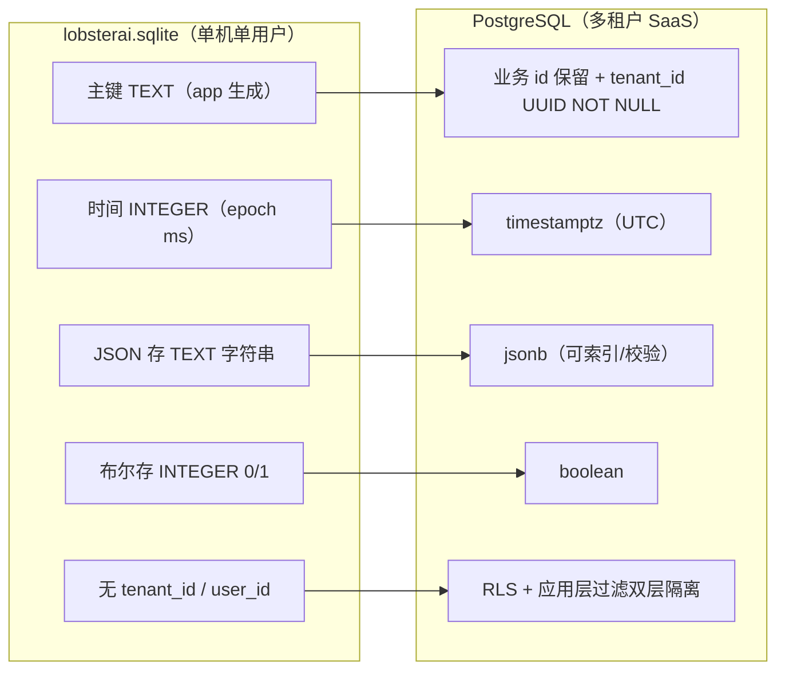
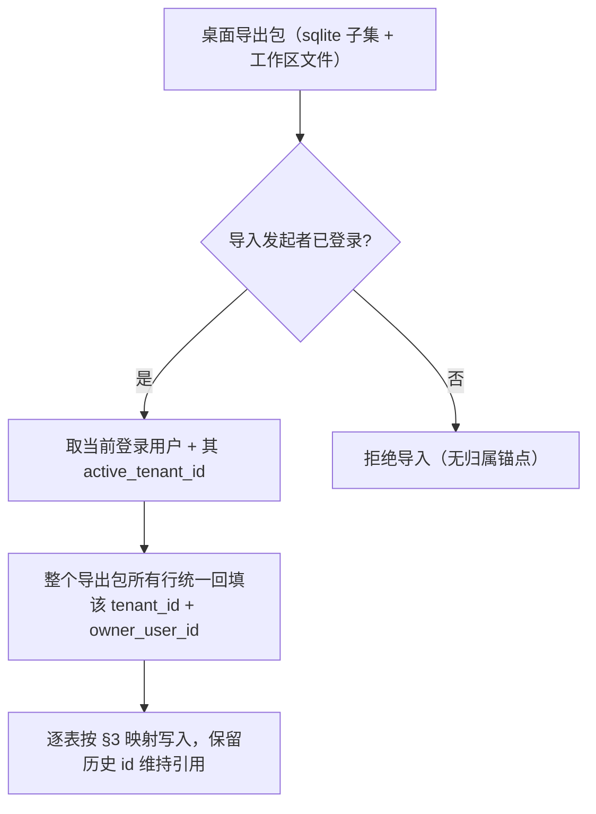
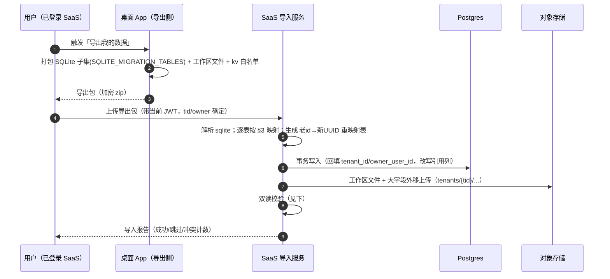

# 数据模型迁移（SQLite → Postgres 多租户）

> 本文档用途：把 LobsterAI 桌面端「单机单用户 SQLite」的业务数据模型，逐表改造为多租户 SaaS 的「PostgreSQL + Prisma（`tenant_id` 隔离 + 可选 RLS）」模型，并给出迁移工具、DDL 示例、数据归属改造清单与验收标准。
> 适合读者：后端/DBA、数据迁移负责人、需要在新库上落表的各域开发者。
> 前置阅读：[01-现状架构调研](./01-现状架构调研.md)（数据层现状）、[05-认证与多租户账户](./05-认证与多租户账户.md)（`tenant_id` 的可信来源与 RLS 会话变量）、[11-定时任务调度](./11-定时任务调度.md)（目标调度权威为服务端 BullMQ，SQLite `scheduled_tasks`/`_runs` 为历史遗留、迁移期读出后废弃）、[08-文件工作区与对象存储](./08-文件工作区与对象存储.md)（`cwd` → 工作区二元组、大文件落对象存储）。
> 约束优先级：若本文与 [05](./05-认证与多租户账户.md) 的 SHARED 关键决策冲突，以 05/关键决策为准。

---

## 0. 一页纸速览

现状数据层：Electron `userData/lobsterai.sqlite`，由 `src/main/sqliteStore.ts` 建表（另有 `src/main/im/imStore.ts`、`src/scheduledTask/metaStore.ts` 各自建表），迁移多为 ad-hoc `PRAGMA table_info()` 检查加 `ALTER TABLE`。**天生单用户设计：全部业务表无 `tenant_id`/`user_id` 列**（`grep tenant_id src/main/sqliteStore.ts` 无命中）。

目标数据层：PostgreSQL + Prisma。核心动作三条：

| 现状 | 目标 | 关键点 |
| --- | --- | --- |
| 表主键多为 `TEXT`（应用生成 id） | 保留业务 id，但**新增 `tenant_id UUID NOT NULL`** 作为隔离锚点 | `tenant_id` 唯一可信来源是 JWT `tid`（见 [05](./05-认证与多租户账户.md)） |
| `INTEGER`（epoch ms）时间戳 | `timestamptz`（`TIMESTAMPTZ`） | Prisma `DateTime`，统一存 UTC |
| `TEXT` 存 JSON（`metadata`/`config_json`/`skill_ids`…） | `jsonb` | 可 GIN 索引、可部分校验 |
| 无外键（SQLite `ON DELETE CASCADE` 部分有） | Postgres 外键 + `ON DELETE CASCADE`/`RESTRICT` | 明确级联语义 |
| 无行级隔离 | 每表加 `tenant_id` + 应用层 Prisma extension + Postgres RLS 兜底 | 纵深隔离（见 [05](./05-认证与多租户账户.md) §6、[14](./14-安全合规与多租户隔离.md)） |

**权威口径修正（务必遵守）**：

- **定时任务**：SaaS 目标调度权威是**服务端 BullMQ + Postgres 调度**（沙箱内 OpenClaw cron 禁用、不下发，见 [11](./11-定时任务调度.md)）。SQLite 的 `scheduled_tasks` / `scheduled_task_runs` 是**历史遗留表**，仅在迁移逻辑里被读出、迁移期读出后废弃，**不作为 SaaS 权威表**——服务端调度以 [11](./11-定时任务调度.md) 的 `scheduled_tasks`/`scheduled_task_runs`（BullMQ + Postgres）新定义为准；`scheduled_task_meta` 的 `origin`/`binding` 元数据保留（并入 11 的任务主表，见 §3.15/§3.16）。
- **文件工作区**：`cowork_sessions.cwd` 从「本机绝对路径」拆为「`workspaceId` + 工作区内相对路径」二元组，权威定义在 [08](./08-文件工作区与对象存储.md) §3.3。
- **记忆/Dreaming**：`user_memories`/`user_memory_sources` 迁 Postgres（结构化事实），工作区 `MEMORY.md` 落每租户 PVC/沙箱（见 [07](./07-OpenClaw运行时编排与沙箱隔离.md)/[08](./08-文件工作区与对象存储.md)）；`cowork_user_memories` 仅存在于历史/迁移逻辑，见 §3.17。
- **桌面老用户数据不做在线迁移**：SaaS 是全新自建后端，桌面数据留在各自本机；仅提供**可选手动导入工具**（见 §6）。本文的「迁移映射」既服务于该可选导入，也作为「新库如何建表」的权威 schema。

---

## 1. 现状数据层盘点

### 1.1 三处建表来源

| 建表文件 | 表 | 说明 |
| --- | --- | --- |
| `src/main/sqliteStore.ts:66-287` | `kv`、`cowork_sessions`、`cowork_messages`、`cowork_session_capsules`、`cowork_config`、`user_memories`、`user_memory_sources`、`agents`、`mcp_servers`、`mcp_launch_resolutions`、`user_plugins`、`subagent_runs`、`subagent_messages` | 主库 13 表 + ad-hoc 迁移 |
| `src/main/im/imStore.ts:117-141` | `im_config`、`im_session_mappings` | IM 域 2 表 |
| `src/scheduledTask/metaStore.ts:21` | `scheduled_task_meta` | 定时任务本地元数据 1 表 |
| 历史遗留（仅迁移/测试可见） | `scheduled_tasks`、`scheduled_task_runs`、`cowork_user_memories` | 见 §3.17、§3.18 |

> `dataMigrationService.ts:35-53` 的 `SQLITE_MIGRATION_TABLES` 列出了当前备份/迁移覆盖的 17 张表（含 `scheduled_tasks`/`scheduled_task_runs`），另加 `SQLITE_MIGRATION_KV_KEYS`（`auth_tokens`/`auth_user`/`app_config`/`skills_state`/`openclaw_session_policy`/`installation_uuid`，`dataMigrationService.ts:55-62`）——这是桌面导出侧的真实清单，SaaS 导入工具据此解析。

### 1.2 现状类型与隔离缺口



**核心缺口**：进程隔离在桌面上等价于「一个进程一个人」，所以表不需要 `tenant_id`；SaaS 里所有租户共享同一库，隔离必须显式化到每一行、每一次查询（见 [05](./05-认证与多租户账户.md) §6）。

---

## 2. 迁移总原则

### 2.1 通用改造规则（对所有业务表统一适用）

1. **加隔离列**：每张业务表加 `tenant_id UUID NOT NULL`；需要「谁创建」语义的表再加 `owner_user_id UUID`（如会话、定时任务、mcp_servers 等资源型表）。**`tenant_id` 只信 JWT `tid`，禁止从 body/query 取**（见 [05](./05-认证与多租户账户.md) §6.3）。
2. **主键策略**：新建资源统一用 `uuid`（`@default(uuid())`）；但**保留桌面导入需要的历史 id**（导入工具原样带入 `id`，避免破坏消息/来源引用关系）。跨租户主键必须全局唯一（UUID 天然满足）。
3. **类型规整**：
   - `INTEGER`（epoch ms） → `timestamptz`（`DateTime`），统一 UTC。
   - `TEXT` 存 JSON → `jsonb`。
   - `INTEGER 0/1`（布尔语义） → `boolean`。
   - `REAL`（如 `confidence`） → `double precision` / `numeric`。
   - 纯字符串（title/name/status/枚举） → `text`，枚举值用 `src/shared/*/constants.ts` 约束（不建议用 PG 原生 enum，扩展成本高）。
4. **历史列名保留**：兼容列名**原样保留**，最典型是 `cowork_sessions.claude_session_id`（`sqliteStore.ts:80`）。在 Prisma 里用 `@map("claude_session_id")` 保留物理列名，TS 字段可起更清晰的名（如 `runtimeSessionId`）。**不要在迁移期改物理列名**，以免破坏导入映射与历史查询。
5. **外键与级联**：显式声明外键；父删子删的用 `ON DELETE CASCADE`（如 `cowork_messages → cowork_sessions`），引用型的用 `RESTRICT`/`SET NULL`。**外键两侧同 `tenant_id`**（复合外键或 CHECK 兜底，见 §5.4）。
6. **软删除与审计**：资源型表统一加 `deleted_at timestamptz NULL`（软删）、`created_at`/`updated_at`（`@default(now())` / `@updatedAt`）；敏感写操作的审计走独立 `audit_logs`（见 [14](./14-安全合规与多租户隔离.md)），不在业务表堆审计列。
7. **索引重建**：现状 SQLite 单列索引全部改为「`tenant_id` 前缀的复合索引」（几乎所有查询都带 `tenant_id`，前缀化能命中）。唯一约束若原是全局唯一，改为「租户内唯一」（见 §2.3）。
8. **RLS 兜底**：每张 tenant-scoped 表 `ENABLE ROW LEVEL SECURITY` + `FORCE`，策略 `tenant_id = current_setting('app.tenant_id')::uuid`（见 §5.3、[05](./05-认证与多租户账户.md) §6.2）。

### 2.2 类型映射速查表

| SQLite 类型/用法 | Postgres 类型 | Prisma 类型 | 备注 |
| --- | --- | --- | --- |
| `TEXT`（id/name/status） | `text` | `String` | 枚举值走共享常量 |
| `TEXT`（JSON 字符串） | `jsonb` | `Json` | 导入时 `JSON.parse` 后写入 |
| `INTEGER`（epoch ms） | `timestamptz` | `DateTime` | ms → UTC 时刻 |
| `INTEGER`（0/1 布尔） | `boolean` | `Boolean` | `!= 0` 转换 |
| `INTEGER`（计数/序号） | `bigint` 或 `integer` | `BigInt`/`Int` | `sequence` 用 `Int`（见 §4.3） |
| `REAL` | `double precision` | `Float` | `confidence` |
| （新增隔离列） | `uuid` | `String @db.Uuid` | `tenant_id`/`owner_user_id` |

### 2.3 租户内唯一约束改写

现状里全局唯一的约束，在多租户下必须降为「租户内唯一」，否则跨租户重名会误撞：

| 现状唯一约束 | 现状 | 目标（租户内唯一） |
| --- | --- | --- |
| `mcp_servers.name UNIQUE`（`sqliteStore.ts:209`） | 全局唯一 | `@@unique([tenant_id, name])` |
| `user_memories.fingerprint`（去重语义，`sqliteStore.ts:170`） | 全局指纹去重 | `@@unique([tenant_id, fingerprint])`（同租户内去重） |
| `kv.key` PK | 全局键 | 复合主键 `@@id([tenant_id, key])`（见 §3.12） |
| `cowork_config.key` PK | 全局键 | 复合主键 `@@id([tenant_id, key])`（见 §3.4） |
| `im_session_mappings (im_conversation_id, platform)` PK | 全局复合 PK | `@@id([tenant_id, platform, im_conversation_id])`（见 §3.16） |

---

## 3. 逐表映射（权威）

> 每表给：**目的 → 新增隔离列 → 类型调整 → 索引 → 外键 → 备注**。列名带 `@map` 的表示保留历史物理列名。tenant-scoped 表默认都加 §2.1 的通用列（`tenant_id`、必要时 `owner_user_id`、`deleted_at`），下文只在有特殊性时重复强调。

### 3.1 `cowork_sessions`（会话）

- **目的**：本地会话记录（含 fork 谱系、cwd、agent 绑定、runtime 会话 id）。源：`sqliteStore.ts:77-97` + 一系列 ad-hoc 列迁移（`sqliteStore.ts:311-376`，如 `active_skill_ids`/fork 系列）。
- **新增隔离列**：`tenant_id UUID NOT NULL`、`owner_user_id UUID NOT NULL`（会话归属某用户，组织租户内区分创建者）。
- **类型调整**：
  - `created_at`/`updated_at`/`forked_at`：`INTEGER` → `timestamptz`。
  - `pinned`：`INTEGER 0/1` → `boolean`。
  - `cwd`：**语义变更**——由本机绝对路径拆为 `workspace_id UUID` + `rel_root text`（工作区内相对根，见 [08](./08-文件工作区与对象存储.md) §3.3、§7.3）。为平滑导入可暂留 `legacy_cwd text` 存原始路径。
- **历史列名保留**：`claude_session_id`（`@map("claude_session_id")`，OpenClaw runtime 的会话键，非「Claude」品牌语义）、`fork_workspace_path`/`fork_git_branch`/`fork_git_base_ref` 原样保留。
- **索引**：`@@index([tenant_id, updated_at(sort: Desc)])`（列表默认排序）、`@@index([tenant_id, owner_user_id, updated_at])`、`@@index([tenant_id, parent_session_id])`（fork 树）、`@@index([tenant_id, pinned, pin_order])`。
- **外键**：`workspace_id → workspaces.id`（`ON DELETE RESTRICT`）；`parent_session_id` 自引用（`ON DELETE SET NULL`）；`agent_id → agents.id`（`ON DELETE SET NULL`）。
- **备注**：`status`（idle/running/error）为运行态，可持久化最后一次状态；实时状态以 WS 流为准（见 [01](./01-现状架构调研.md) §5.1）。

### 3.2 `cowork_messages`（会话消息）

- **目的**：会话消息（`type` = user/assistant/tool，`content`，`metadata`，双排序键 `created_at` + `sequence`）。源：`sqliteStore.ts:101-115` + `sequence` 迁移（`sqliteStore.ts:377+`）。
- **新增隔离列**：`tenant_id UUID NOT NULL`（冗余下放，避免 join 才能拿 tenant，利于 RLS 与分区）。
- **类型调整**：`created_at` → `timestamptz`；`metadata`（TEXT JSON）→ `jsonb`；`content` 保持 `text`（大字段存储策略见 §4.2）。
- **索引**：现状 `idx_cowork_messages_session_id`（`sqliteStore.ts:114`）改为 `@@index([tenant_id, session_id, sequence])`（保序读取，见 §4.3）+ `@@index([tenant_id, session_id, created_at])`。
- **外键**：`session_id → cowork_sessions.id ON DELETE CASCADE`（沿用 `sqliteStore.ts:109`）。
- **备注**：消息内容大字段（长文本/base64 附件）不入行内，改存对象存储，行内存引用（见 §4.2）。
- **分区策略（高写入表专项）**：`cowork_messages` 是全库写入量最大的表，单表膨胀会拖慢 vacuum、索引与 RLS 扫描。建议用 PostgreSQL 声明式分区：
  - **首选按 `tenant_id` HASH 分区**（`PARTITION BY HASH (tenant_id)`，如 16/32 个子分区）：与 RLS `tenant_id = current_setting('app.tenant_id')` 过滤天然对齐，查询能做分区裁剪；大租户不会拖垮小租户的局部性。分区键须并入主键（`PRIMARY KEY (id, tenant_id)`）与唯一约束（`UNIQUE (session_id, tenant_id, sequence)`）。
  - **备选按 `created_at` RANGE 分区**（`PARTITION BY RANGE (created_at)`，如按月）：便于按保留期整分区 `DETACH`/`DROP` 归档冷数据，配合 pg_partman 自动滚动；代价是热点集中在当月分区。
  - 两级也可组合（先 `tenant_id` HASH，子分区再 RANGE），但仅在单租户消息量极大时才值得这层复杂度；v1 默认单级 HASH 分区起步。
- **RLS 下连接池注意事项**：RLS 依赖会话变量 `app.tenant_id`（见 §5.3），而 PgBouncer transaction 模式下同一物理连接会被不同请求复用——**必须用 `SET LOCAL app.tenant_id = '<tid>'`（事务级），不可用 `SET`（会话级）**，否则变量会泄漏到复用该连接的下一个租户请求，造成跨租户读。因此每次查询都要开显式事务并在事务开头 `SET LOCAL`；用 Prisma 时通过 `$transaction` 包裹或中间件在每请求事务起始处注入（见 [05](./05-认证与多租户账户.md) §6.2）。避免 session 模式长连接绑定单租户导致连接池利用率坍塌。

### 3.3 `cowork_session_capsules`（上下文胶囊）

- **目的**：连续性/上下文胶囊（fork 与压缩用）。源：`sqliteStore.ts:118-127`。PK = `session_id`（一会话一胶囊）。
- **新增隔离列**：`tenant_id UUID NOT NULL`。
- **类型调整**：`capsule_json`（TEXT）→ `jsonb`；`updated_at`/`last_compacted_at` → `timestamptz`；`version`/`revision` 保 `Int`。
- **索引/主键**：主键仍 `session_id`（每会话唯一）；加 `@@index([tenant_id])`（RLS/清理）。
- **外键**：`session_id → cowork_sessions.id ON DELETE CASCADE`（沿用 `sqliteStore.ts:126`）。
- **备注**：胶囊可能较大，超阈值同样落对象存储 + 行内引用（见 §4.2）。

### 3.4 `cowork_config`（Cowork 设置）

- **目的**：Cowork 键值设置（工作目录、执行模式、agent engine、记忆/dreaming/embedding 开关等）。源：`sqliteStore.ts:131-135`，PK = `key`。
- **新增隔离列**：`tenant_id UUID NOT NULL`。配置的粒度决策：**大多数配置按租户**（组织统一），少量「个人偏好」按用户——用 `scope`（`tenant`/`user`）+ 可空 `user_id` 表达，或拆两张表。v1 建议：`cowork_config` 走**租户级**，用户级偏好并入 `users`/独立 `user_preferences`（见 [05](./05-认证与多租户账户.md)）。
- **类型调整**：`value`（TEXT，多为 JSON）→ `jsonb`；`updated_at` → `timestamptz`。
- **主键**：全局 `key` PK → 复合主键 `@@id([tenant_id, key])`（见 §2.3）。
- **外键**：无（键值表）。
- **备注**：`cowork_config` 里的「默认工作目录」在 SaaS 下语义变为「默认工作区 id」（见 [08](./08-文件工作区与对象存储.md) §7.3）。

### 3.5 `agents`（自定义/预设 Agent）

- **目的**：agent 定义（`system_prompt`、`identity`、`model`、`skill_ids`、per-agent `working_directory`、`enabled`/`pinned`/`is_default`、`source` custom/preset、`preset_id`）。源：`sqliteStore.ts:184-202`。
- **新增隔离列**：`tenant_id UUID NOT NULL`、`owner_user_id UUID`（创建者）。**预设 agent 的处理**：内置预设是平台级模板，不属任何租户——预设模板放独立只读表 `agent_presets`（无 `tenant_id`），租户「安装预设」时在 `agents` 里落一份带 `tenant_id` 的实例（`source='preset'` + `preset_id`）。
- **类型调整**：`skill_ids`（TEXT `'[]'`）→ `jsonb`（字符串数组）；`enabled`/`pinned`/`is_default`（0/1）→ `boolean`；`created_at`/`updated_at` → `timestamptz`。
- **索引**：`@@index([tenant_id, enabled, pinned, pin_order])`、`@@index([tenant_id, is_default])`。
- **外键**：`working_directory` 同样映射到 `workspace_id`（见 [08](./08-文件工作区与对象存储.md)）；skill 引用为 jsonb 内的 id，不建外键（skill 定义随插件同步，见 [10](./10-MCP与技能改造.md)）。
- **备注**：主 agent id 固定为 `main`（见 CLAUDE.md）——在多租户下，`main` 是每租户各自一份的逻辑 agent，主键需 `(tenant_id, id)` 唯一而非全局 `id='main'` 唯一（见 §5.1）。

### 3.6 `mcp_servers`（MCP 服务器配置）

- **目的**：用户配置的 MCP 服务器（`transport_type` stdio/sse/http、`config_json`、`enabled`）。源：`sqliteStore.ts:207-216`。
- **新增隔离列**：`tenant_id UUID NOT NULL`、`owner_user_id UUID`。
- **类型调整**：`config_json`（TEXT）→ `jsonb`；`enabled` → `boolean`；时间戳 → `timestamptz`。
- **唯一约束改写**：`name UNIQUE`（全局，`sqliteStore.ts:209`）→ `@@unique([tenant_id, name])`（租户内唯一，见 §2.3）。
- **索引**：`@@index([tenant_id, enabled])`。
- **外键**：`mcp_launch_resolutions.server_id → mcp_servers.id`（见 §3.7）。
- **备注**：`transport_type='stdio'` 的服务器在 SaaS 下必须在沙箱内起子进程（见 [10](./10-MCP与技能改造.md)）；`config_json` 里的敏感字段（token/密钥）迁移时应加密或改引用 secrets 存储（见 [14](./14-安全合规与多租户隔离.md)）。

### 3.7 `mcp_launch_resolutions`（MCP 启动决议）

- **目的**：MCP 启动解析结果（resolver 类型、命令、args、env、安装目录、探针状态）。源：`sqliteStore.ts:220-238`，PK = `server_id`（一服务器一决议）。
- **新增隔离列**：`tenant_id UUID NOT NULL`（冗余下放，随 `mcp_servers`）。
- **类型调整**：`args_json`/`env_json`（TEXT）→ `jsonb`；`installed_at`/`resolved_at`/`last_probe_at`/`updated_at` → `timestamptz`。
- **主键/索引**：主键仍 `server_id`；加 `@@index([tenant_id])`。
- **外键**：`server_id → mcp_servers.id ON DELETE CASCADE`（删服务器连带删决议）。
- **备注**：`env_json` 极可能含密钥，迁移时脱敏/加密（见 [14](./14-安全合规与多租户隔离.md)）。SaaS 下「安装目录/命令」是沙箱内路径，导入桌面数据时这些字段基本作废（需在目标沙箱重新解析，见 [10](./10-MCP与技能改造.md)），因此该表可**不迁移历史值**，仅保留 schema。

### 3.8 `user_plugins`（用户安装的 OpenClaw 插件）

- **目的**：用户安装的插件（`source`、`spec`、`registry`、`version`、`enabled`、`config`）。源：`sqliteStore.ts:243-251` + `config` 列迁移（`sqliteStore.ts:300-309`），PK = `plugin_id`。
- **新增隔离列**：`tenant_id UUID NOT NULL`、`owner_user_id UUID`。
- **类型调整**：`config`（TEXT JSON）→ `jsonb`；`enabled` → `boolean`；`installed_at` → `timestamptz`。
- **主键/唯一**：全局 `plugin_id` PK → 复合 `@@id([tenant_id, plugin_id])`（同一插件可被不同租户各装一份）。
- **索引**：`@@index([tenant_id, enabled])`。
- **备注**：插件安装的物理产物在沙箱内（见 [10](./10-MCP与技能改造.md)）；DB 只存声明。`config` 敏感字段同 §3.6 脱敏。

### 3.9 `subagent_runs`（子 agent 运行跟踪）

- **目的**：子 agent 运行记录（`parent_session_id`、`session_key`、`agent_id`、`task`、`label`、`status`、`messages_persisted`）。源：`sqliteStore.ts:255-265` + `messages_persisted` 迁移（`sqliteStore.ts:289-298`）。
- **新增隔离列**：`tenant_id UUID NOT NULL`。
- **类型调整**：`status` 保 `text`（running/…）；`messages_persisted`（0/1）→ `boolean`；`created_at`/`ended_at` → `timestamptz`。
- **索引**：现状 `idx_subagent_runs_parent_session_id`（`sqliteStore.ts:267`）→ `@@index([tenant_id, parent_session_id])`。
- **外键**：`parent_session_id → cowork_sessions.id ON DELETE CASCADE`（子运行随父会话删除）。
- **备注**：`agent_id`/`session_key` 引用运行态资源，可 `SET NULL` 或不建强外键。

### 3.10 `subagent_messages`（子 agent 会话历史）

- **目的**：抓取的子 agent 对话历史（`run_id`、`type`、`content`、`metadata`、`sequence`）。源：`sqliteStore.ts:274-283`。
- **新增隔离列**：`tenant_id UUID NOT NULL`。
- **类型调整**：`metadata`（TEXT）→ `jsonb`；`content` 保 `text`（大字段策略见 §4.2）；`created_at` → `timestamptz`；`sequence` 保 `Int`。
- **索引**：现状 `idx_subagent_messages_run_id`（`sqliteStore.ts:284`）→ `@@index([tenant_id, run_id, sequence])`。
- **外键**：`run_id → subagent_runs.id ON DELETE CASCADE`。

### 3.11 `user_memories`（用户记忆）

- **目的**：用户记忆事实（`text`、`fingerprint` SHA-1 去重、`confidence`、`is_explicit`、`status`、`last_used_at`）。源：`sqliteStore.ts:139-149`。
- **新增隔离列**：`tenant_id UUID NOT NULL`、`owner_user_id UUID`（记忆通常是「某人的记忆」；组织租户下按用户区分）。
- **类型调整**：`confidence`（REAL）→ `double precision`；`is_explicit`（0/1）→ `boolean`；`created_at`/`updated_at`/`last_used_at` → `timestamptz`。
- **唯一约束改写**：`fingerprint` 去重（现状 `idx_user_memories_fingerprint`，`sqliteStore.ts:170`）→ `@@unique([tenant_id, owner_user_id, fingerprint])`（同人同租户内去重，见 §2.3）。
- **索引**：现状 `idx_user_memories_status_updated_at`（`sqliteStore.ts:166`）→ `@@index([tenant_id, owner_user_id, status, updated_at(sort: Desc)])`。
- **备注**：记忆的**结构化事实**入 Postgres；工作区里的 `MEMORY.md`（durable memory）与 `memory/YYYY-MM-DD.md` 落每租户沙箱工作区（见 [07](./07-OpenClaw运行时编排与沙箱隔离.md)/[08](./08-文件工作区与对象存储.md)）。Dreaming 子系统的**调度**归服务端调度器（见 [11](./11-定时任务调度.md) §4.5 的内部任务），**数据**归本表 + 工作区文件。归属决策：Dreaming 产出的记忆条目按 `owner_user_id` 落本表。

### 3.12 `user_memory_sources`（记忆溯源）

- **目的**：记忆 → session/message 的来源关系（`memory_id`、`session_id`、`message_id`、`role`、`is_active`）。源：`sqliteStore.ts:153-162`。
- **新增隔离列**：`tenant_id UUID NOT NULL`（随 `user_memories`）。
- **类型调整**：`is_active`（0/1）→ `boolean`；`created_at` → `timestamptz`。
- **索引**：现状 `idx_user_memory_sources_session_id`/`idx_user_memory_sources_memory_id`（`sqliteStore.ts:174-179`）→ `@@index([tenant_id, session_id, is_active])`、`@@index([tenant_id, memory_id, is_active])`。
- **外键**：`memory_id → user_memories.id ON DELETE CASCADE`（沿用 `sqliteStore.ts:161`）；`session_id`/`message_id` 引用会话/消息，可 `SET NULL`（来源会话被删时保留记忆但断链）。

### 3.13 `kv`（全局键值）

- **目的**：app 级 JSON 键值（`app_config`、认证标志、迁移标记等）。源：`sqliteStore.ts:68-72`，PK = `key`。
- **改造分流**（关键——`kv` 现状混装了「平台级」「租户级」「用户级」三类语义，SaaS 下必须拆开）：

| 现状 kv key（`dataMigrationService.ts:55-61`） | 归宿 |
| --- | --- |
| `auth_tokens` / `auth_user` | **废弃**——SaaS 认证走 JWT + `refresh_tokens` 表（见 [05](./05-认证与多租户账户.md) §4），不入 kv |
| `app_config`（含 `app.testMode` 等） | 拆为平台级配置（环境变量/配置中心）+ 租户级 `cowork_config` |
| `skills_state` | 迁 `user_plugins`/skill 启用状态（见 [10](./10-MCP与技能改造.md)），按 `tenant_id` |
| `openclaw_session_policy` | 迁租户级配置表/`cowork_config`（按 `tenant_id`） |
| `installation_uuid` | 桌面机器标识，SaaS 无意义，**不迁** |
| 定时任务迁移标记（如 `scheduled_tasks_migrated_to_openclaw_v1`，见 [11](./11-定时任务调度.md) §2.2） | 迁移期一次性标记，SaaS 不需 |

- **保留形态**：若仍需一张通用键值表，建**租户级** `kv`：复合主键 `@@id([tenant_id, key])`，`value jsonb`，`updated_at timestamptz`；平台级键值另设 `platform_kv`（无 `tenant_id`，仅 superadmin 可写，见 [14](./14-安全合规与多租户隔离.md)）。
- **备注**：**不要把认证令牌落 kv**（现状 `auth_tokens` 在 renderer localStorage，见 [05](./05-认证与多租户账户.md) §1.1）；SaaS refresh token 存哈希于专表（见 [05](./05-认证与多租户账户.md) §4.2）。

### 3.14 `im_config`（IM 平台配置）

- **目的**：IM 平台配置键值。源：`imStore.ts:117-121`，PK = `key`。
- **改造归宿**：IM 渠道 v1 **后续做**（见 [13](./13-功能取舍与降级清单.md)）。因此本表**建 schema 但 v1 不接线**：`tenant_id UUID NOT NULL` + 复合主键 `@@id([tenant_id, key])`，`value jsonb`，`updated_at timestamptz`。
- **备注**：IM 配置里含平台 token/secret，迁移/落表时必须加密或走 secrets（见 [14](./14-安全合规与多租户隔离.md)）。桌面导入工具**默认跳过** IM 配置（v1 无对接目标）。

### 3.15 `im_session_mappings`（IM 会话映射）

- **目的**：IM 会话 ↔ Cowork/OpenClaw 会话映射（`im_conversation_id`、`platform`、`cowork_session_id`、`openclaw_session_key`、`agent_id`）。源：`imStore.ts:130-157`，复合 PK `(im_conversation_id, platform)`。
- **新增隔离列**：`tenant_id UUID NOT NULL`。
- **类型调整**：`created_at`/`last_active_at` → `timestamptz`；`agent_id`（现状默认 `'main'`，`imStore.ts:150`）保 `text`。
- **主键改写**：`(im_conversation_id, platform)` → `@@id([tenant_id, platform, im_conversation_id])`（租户内唯一，见 §2.3）。
- **外键**：`cowork_session_id → cowork_sessions.id ON DELETE CASCADE`（可选）。
- **备注**：v1 IM 后续；本表随 IM 一起落地。

### 3.16 `scheduled_task_meta`（定时任务本地元数据）

- **目的**：每个 taskId 的 `origin`（legacy/im/cowork/manual）与 `binding`（new_session/ui_session/im_session/session_key），JSON 字符串。源：`metaStore.ts:14-51`（建表 `metaStore.ts:21`），PK = `task_id`。
- **权威口径**：定时任务权威是服务端调度器（见 [11](./11-定时任务调度.md)）。**本表的 `origin`/`binding` 不再独立成表，而是并入 [11](./11-定时任务调度.md) §3.3 的 `scheduled_tasks.origin_json`/`binding_json`**（Postgres 有原生 jsonb + 外键，无需像 gateway cron API 那样另存自定义字段）。
- **迁移语义**：桌面导入时读 `scheduled_task_meta` 的 `origin`/`binding`，与迁移出的任务定义合并写入 [11](./11-定时任务调度.md) 的 `scheduled_tasks` 记录。
- **备注**：本文**不**为 `scheduled_task_meta` 定义独立目标表；它是「被合并入」的来源。

### 3.17 `scheduled_tasks` / `scheduled_task_runs`（历史遗留表，按遗留处理）

- **权威口径（务必按此处理）**：这两张 SQLite 表是**历史遗留**。当前它们只在迁移逻辑（`migrate.ts`）里被**读出、迁入 OpenClaw gateway cron 后废弃**；真正的任务定义与运行历史现在在 gateway（见 [11](./11-定时任务调度.md) §2.2）。
- **SaaS 处置**：
  1. **不把这两张 SQLite 表当作 SaaS 权威表**。SaaS 的 `scheduled_tasks`/`scheduled_task_runs` 是 [11](./11-定时任务调度.md) §3.3 全新定义的多租户 Postgres 表（BullMQ + Postgres 权威、`@@unique([taskId, scheduledForMs])` 幂等、`is_internal` 系统任务等），**与桌面遗留表同名但语义不同**。
  2. 桌面导入工具对这两张遗留表：**若桌面数据尚未迁入 gateway**（旧版本），可读出用户任务（跳过 internal）映射到 SaaS 新表；**若已迁入 gateway**，则从 gateway cron 侧读（见 [11](./11-定时任务调度.md) §7），SQLite 遗留表可忽略。
- **备注**：本文不为遗留 SQLite `scheduled_tasks`/`scheduled_task_runs` 定义目标 schema——目标 schema 归 [11](./11-定时任务调度.md)。运行历史一般**不迁**（从零开始，见 [11](./11-定时任务调度.md) §7）。

### 3.18 `cowork_user_memories`（历史/迁移表）

- **现状事实**：`cowork_user_memories` **仅出现在测试/迁移相关代码**（如 `coworkStore.test.ts:135`），生产建表路径（`sqliteStore.ts`/`coworkStore.ts`）无命中——属会话级记忆的历史/迁移遗留。
- **SaaS 处置**：**不建独立目标表**。其数据（若桌面存量存在）在导入时归并入 §3.11 的 `user_memories`（按 `owner_user_id`/`tenant_id`），并通过 `user_memory_sources`（§3.12）关联到具体会话。作为历史表按「读出→归并→废弃」处理。

### 3.19 逐表映射汇总表

| SQLite 表 | 目的 | 加 `tenant_id` | 加 `owner_user_id` | 主要类型调整 | 唯一/主键改写 | 外键 |
| --- | --- | :--: | :--: | --- | --- | --- |
| `cowork_sessions` | 会话 | ✅ | ✅ | 时间戳→timestamptz；`cwd`→`workspace_id`+`rel_root`；bool | — | `workspace_id`、自引用 parent、`agent_id` |
| `cowork_messages` | 消息 | ✅ | — | metadata→jsonb；时间戳；大字段外移 | — | `session_id` CASCADE |
| `cowork_session_capsules` | 上下文胶囊 | ✅ | — | capsule→jsonb；时间戳 | PK=session_id | `session_id` CASCADE |
| `cowork_config` | Cowork 设置 | ✅ | — | value→jsonb | `@@id([tenant_id,key])` | — |
| `agents` | Agent | ✅ | ✅ | skill_ids→jsonb；bool；预设拆表 | `(tenant_id,id)` 唯一 | `workspace_id` |
| `mcp_servers` | MCP 配置 | ✅ | ✅ | config→jsonb；bool | `@@unique([tenant_id,name])` | — |
| `mcp_launch_resolutions` | MCP 决议 | ✅ | — | args/env→jsonb；时间戳 | PK=server_id | `server_id` CASCADE |
| `user_plugins` | 插件 | ✅ | ✅ | config→jsonb；bool | `@@id([tenant_id,plugin_id])` | — |
| `subagent_runs` | 子 agent 运行 | ✅ | — | bool；时间戳 | — | `parent_session_id` CASCADE |
| `subagent_messages` | 子 agent 消息 | ✅ | — | metadata→jsonb；时间戳 | — | `run_id` CASCADE |
| `user_memories` | 用户记忆 | ✅ | ✅ | confidence→float；bool | `@@unique([tenant_id,owner_user_id,fingerprint])` | — |
| `user_memory_sources` | 记忆溯源 | ✅ | — | bool；时间戳 | — | `memory_id` CASCADE |
| `kv` | 全局键值 | ✅（拆分） | — | value→jsonb；语义拆分 | `@@id([tenant_id,key])` + 平台级另表 | — |
| `im_config` | IM 配置 | ✅ | — | value→jsonb | `@@id([tenant_id,key])` | — |
| `im_session_mappings` | IM 映射 | ✅ | — | 时间戳 | `@@id([tenant_id,platform,im_conversation_id])` | `cowork_session_id` |
| `scheduled_task_meta` | 任务本地元数据 | （并入 11） | — | origin/binding→jsonb | 并入 `scheduled_tasks` | 见 [11](./11-定时任务调度.md) |
| `scheduled_tasks`（遗留） | 历史遗留 | — 按遗留处理 | — | — | 目标 schema 归 [11](./11-定时任务调度.md) | — |
| `scheduled_task_runs`（遗留） | 历史遗留 | — 按遗留处理 | — | — | 目标 schema 归 [11](./11-定时任务调度.md) | — |
| `cowork_user_memories`（历史） | 会话级记忆 | — 归并入 user_memories | — | — | 不建独立表 | — |

---

## 4. 关键横切议题

### 4.1 `tenant_id` 回填来源（导入时如何确定归属）

新建数据的 `tenant_id` 永远来自 JWT `tid`（见 [05](./05-认证与多租户账户.md) §4.1）。但**导入桌面存量数据**时没有请求上下文，需要显式确定归属：



- **回填规则**：一次导入 = 一个明确的目标租户（发起导入的用户的 `active_tenant_id`）+ 一个 `owner_user_id`（发起者）。**整包同租户**，不做「一个包拆多租户」。
- **id 冲突**：导入沿用桌面原始业务 id（维持消息/来源引用）；因跨租户主键需全局唯一（§2.1），若原 `TEXT` id 可能与既有冲突，导入器为整包生成 id 前缀/重映射表（老 id → 新 UUID），并同步改写所有引用列（`session_id`/`memory_id`/`parent_session_id`…）。
- **组织租户**：导入到组织租户时，`tenant_id` = 组织，`owner_user_id` = 发起者；权限校验按 [05](./05-认证与多租户账户.md) §5 的角色矩阵（需 member+ 才能导入）。

### 4.2 消息内容大字段存储策略

现状 `cowork_messages.content` / `subagent_messages.content` / `capsule_json` 直接把大文本（含 base64 附件、长工具输出）塞进 SQLite。SaaS 下：

| 内容类型 | 存储位置 | 行内保留 |
| --- | --- | --- |
| 普通文本消息（< 阈值，如 64KB） | 行内 `content text` | 全文 |
| 超长文本 / 大工具输出（≥ 阈值） | 对象存储（`tenants/{tid}/.../messages/{id}.txt`，见 [08](./08-文件工作区与对象存储.md)） | 引用 + 摘要（前 N 字符预览） |
| base64 内联附件/图片 | **禁止入库**——落对象存储，行内存签名 URL 引用（见 [08](./08-文件工作区与对象存储.md) §5.2） | 引用 + mime/size |
| 结构化 metadata | 行内 `jsonb`（可 GIN 索引查询） | 全量（但不塞大二进制） |

- **阈值策略**：写入前判断 `content` 字节数，超阈值转外存并把 `content` 置为「摘要 + `contentRef`」（jsonb metadata 里记 `{ storage: 's3', key, bytes }`）。读取时按需拉签名 URL（见 [08](./08-文件工作区与对象存储.md) §4.3）。
- **好处**：控制单行/单表膨胀，避免 Postgres TOAST 过度膨胀与行迁移；WS 流式截断（现状 `truncateIpcString`，见 [01](./01-现状架构调研.md) §5.1）语义在 WS 网关层保留（见 [03](./03-前端与传输层改造.md)）。

### 4.3 序号（`sequence`）保序语义

现状 `cowork_messages`/`subagent_messages` 用 `created_at` + `sequence` 双排序（`sqliteStore.ts:108`、`:281`），`sequence` 保证同一毫秒内多条消息稳定有序。SaaS 下必须保持：

- **保留 `sequence Int`**：同一 `session_id`/`run_id` 内单调递增；**排序键 = `(created_at, sequence)`**，主排序索引 `@@index([tenant_id, session_id, sequence])`（见 §3.2）。
- **并发写入下的单调性**：单会话消息一般串行追加（一个 turn 内），但流式多消息 + 多副本网关下需保证 `sequence` 不冲突。方案：
  1. 每会话一个 Postgres 序列/计数（`sequence = (SELECT COALESCE(MAX(sequence),0)+1 FROM cowork_messages WHERE session_id=$1)`，在同事务 + 行锁下）；或
  2. 用 Redis 每会话计数器（`INCR t:{tid}:seq:{sessionId}`）分配 `sequence`，DB 侧 `@@unique([session_id, sequence])` 兜底防重复。
- **`beforeMessageId` 语义**（现状流事件带 `beforeMessageId?`，见 [01](./01-现状架构调研.md) §5.1）：插入到某消息之前时，用「分数序号」或重排——建议 `sequence` 用带间隙的步长（如每次 +100），插入取中间值，避免全表重排。
- **导入保序**：桌面导入时原样带入 `sequence`（若历史缺失则按 `created_at` 重新赋号）。

### 4.4 软删除与审计列

| 列 | 适用表 | 语义 |
| --- | --- | --- |
| `deleted_at timestamptz NULL` | 资源型表（`cowork_sessions`、`agents`、`mcp_servers`、`user_plugins`、`user_memories`…） | 软删；查询默认 `WHERE deleted_at IS NULL`（Prisma extension 自动加，见 §5.2）；物理清理由后台任务按保留期执行 |
| `created_at` / `updated_at timestamptz` | 全部业务表 | `@default(now())` / `@updatedAt` |
| `created_by` / `updated_by UUID`（可选） | 需要「谁改的」的表 | 组织租户内追责 |
| 独立 `audit_logs` 表 | 敏感操作（改配置、删租户、加成员、导入数据） | 结构化审计（actor/action/target/tenant_id/at），详见 [14](./14-安全合规与多租户隔离.md) |

- **级联软删**：软删会话时，其消息不必逐行软删（读会话时已过滤），但物理清理需级联；硬删走 `ON DELETE CASCADE`。
- **不要把审计塞业务表**：审计写 `audit_logs`，避免业务表列爆炸（遵循 CLAUDE.md「不做机会主义式膨胀」）。

### 4.5 记忆/Dreaming 数据的多租户归属（专项）

| 数据 | 存储 | 归属 | 迁移 |
| --- | --- | --- | --- |
| 结构化记忆事实（`user_memories`） | Postgres（§3.11） | `tenant_id` + `owner_user_id` | 导入回填（§4.1） |
| 记忆溯源（`user_memory_sources`） | Postgres（§3.12） | 随记忆 | 随记忆 |
| durable memory（`MEMORY.md`） | 每租户沙箱工作区（见 [07](./07-OpenClaw运行时编排与沙箱隔离.md)/[08](./08-文件工作区与对象存储.md)） | `tenant_id`（沙箱内 state 目录，用户不可直接浏览，见 [08](./08-文件工作区与对象存储.md) §6.2） | 随工作区导入（可选） |
| daily notes（`memory/YYYY-MM-DD.md`） | 同上 | 同上 | 同上 |
| Dreaming 调度（`cowork:dreaming:*`） | 服务端调度器（`is_internal=true`，见 [11](./11-定时任务调度.md) §4.5） | `tenant_id` | 系统任务，不迁 |
| Dreaming 产出的记忆条目 | 落 `user_memories`（本表） | `owner_user_id` | 随记忆 |
| `cowork_user_memories`（历史表） | 归并入 `user_memories`（§3.18） | — | 读出→归并→废弃 |

要点：**记忆的「事实」在 Postgres（可查询/可跨会话/受 RLS）**，**记忆的「文件形态」在沙箱工作区（agent 直接读写）**；两者归属同一 `tenant_id`，Dreaming 只是产出方，其调度归服务端调度器（见 [11](./11-定时任务调度.md)）。

---

## 5. ORM、迁移工具与 DDL 示例

### 5.1 Prisma 建模约定

- **迁移工具**：**Prisma Migrate**（`prisma migrate dev` 生成、`prisma migrate deploy` 上线）。每次 schema 变更生成版本化 SQL 迁移文件，纳入 Git；生产用 `deploy`（不生成、只应用）。**放弃现状 ad-hoc `PRAGMA table_info()` + `ALTER TABLE`** 的手写迁移风格。
- **`@map` 保留物理列/表名**：TS 字段用清晰名，`@map`/`@@map` 对齐历史列名（如 `claudeSessionId String? @map("claude_session_id")`），既满足 CLAUDE.md 命名规范，又保留兼容。
- **枚举**：用 `src/shared/*/constants.ts` 的 `as const` 常量约束值域（不用 PG 原生 enum，扩展/迁移成本高）。
- **RLS 与 Prisma 并存**：Prisma 不原生管 RLS，RLS 策略写在迁移 SQL 的 `-- raw sql` 段（Prisma migration 支持嵌入原始 SQL）。

### 5.2 应用层租户过滤 + 软删（Prisma Extension）

沿用 [05](./05-认证与多租户账户.md) §6.1 的 tenant extension，并叠加软删过滤：

```ts
// 每请求以 ctx.tid 派生的 client；结合 AsyncLocalStorage 复用连接
export const scopeExtension = (tenantId: string) =>
  Prisma.defineExtension({
    query: {
      $allModels: {
        async $allOperations({ model, operation, args, query }) {
          if (TENANT_SCOPED_MODELS.has(model)) {
            const isRead = operation.startsWith('find') || operation === 'count';
            const isWrite = operation === 'update' || operation === 'delete' ||
                            operation.endsWith('Many');
            if (isRead || isWrite) {
              args.where = { ...args.where, tenant_id: tenantId, deleted_at: null };
            }
            if (operation === 'create') {
              args.data = { ...args.data, tenant_id: tenantId };
            }
          }
          return query(args);
        },
      },
    },
  });
```

> 软删默认过滤 `deleted_at: null`；需要读已删数据的运维路径用独立的「非 scoped」client（受 superadmin 审计约束，见 [14](./14-安全合规与多租户隔离.md)）。

### 5.3 RLS 策略（兜底第二道）

每张 tenant-scoped 表统一模板（见 [05](./05-认证与多租户账户.md) §6.2）：

```sql
ALTER TABLE cowork_sessions ENABLE ROW LEVEL SECURITY;
ALTER TABLE cowork_sessions FORCE ROW LEVEL SECURITY;

CREATE POLICY tenant_isolation ON cowork_sessions
  USING (tenant_id = current_setting('app.tenant_id')::uuid)
  WITH CHECK (tenant_id = current_setting('app.tenant_id')::uuid);
```

- 每请求事务开头 `SET LOCAL app.tenant_id = '<tid from JWT>'`（事务级，避免连接池串会话）。
- 应用连接用非 superuser、非 `BYPASSRLS` 角色；迁移/运维用另一角色（见 [05](./05-认证与多租户账户.md) §6.2）。
- 身份表（`users`/`tenants`/`memberships`）按成员关系而非单 `tenant_id` 建策略（见 [05](./05-认证与多租户账户.md) §6.2）。

### 5.4 关键表 DDL 示例

以下为迁移生成的等价 DDL（含索引、唯一约束、外键、`tenant_id` 一致性 CHECK）。

**`cowork_sessions`**：

```sql
CREATE TABLE cowork_sessions (
  id                     uuid        NOT NULL DEFAULT gen_random_uuid(),
  tenant_id              uuid        NOT NULL,
  owner_user_id          uuid        NOT NULL,
  title                  text        NOT NULL,
  claude_session_id      text,                       -- 历史列名保留（OpenClaw runtime 会话键）
  status                 text        NOT NULL DEFAULT 'idle',
  pinned                 boolean     NOT NULL DEFAULT false,
  pin_order              integer,
  workspace_id           uuid,                       -- 取代 cwd（见 08）
  rel_root               text        NOT NULL DEFAULT '',
  legacy_cwd             text,                       -- 导入期暂存原始绝对路径
  system_prompt          text        NOT NULL DEFAULT '',
  model_override         text        NOT NULL DEFAULT '',
  execution_mode         text,
  parent_session_id      uuid,
  forked_from_message_id uuid,
  forked_at              timestamptz,
  fork_mode              text        NOT NULL DEFAULT 'none',
  fork_workspace_path    text,
  fork_git_branch        text,
  fork_git_base_ref      text,
  active_skill_ids       jsonb,
  agent_id               text,
  deleted_at             timestamptz,
  created_at             timestamptz NOT NULL DEFAULT now(),
  updated_at             timestamptz NOT NULL DEFAULT now(),
  PRIMARY KEY (id),
  CONSTRAINT fk_session_parent FOREIGN KEY (parent_session_id)
    REFERENCES cowork_sessions(id) ON DELETE SET NULL,
  CONSTRAINT fk_session_workspace FOREIGN KEY (workspace_id)
    REFERENCES workspaces(id) ON DELETE RESTRICT
);
CREATE INDEX idx_sessions_tenant_updated  ON cowork_sessions (tenant_id, updated_at DESC);
CREATE INDEX idx_sessions_tenant_owner    ON cowork_sessions (tenant_id, owner_user_id, updated_at DESC);
CREATE INDEX idx_sessions_tenant_parent   ON cowork_sessions (tenant_id, parent_session_id);
CREATE INDEX idx_sessions_tenant_pinned   ON cowork_sessions (tenant_id, pinned, pin_order);
```

**`cowork_messages`**（含大字段外移引用 + 保序）：

```sql
CREATE TABLE cowork_messages (
  id          uuid        NOT NULL DEFAULT gen_random_uuid(),
  tenant_id   uuid        NOT NULL,           -- 冗余下放，利于 RLS/分区
  session_id  uuid        NOT NULL,
  type        text        NOT NULL,           -- user | assistant | tool
  content     text        NOT NULL DEFAULT '',-- 超阈值时存摘要，正文入对象存储
  metadata    jsonb,                          -- 含 contentRef({storage,key,bytes}) 等
  sequence    integer     NOT NULL DEFAULT 0,
  created_at  timestamptz NOT NULL DEFAULT now(),
  PRIMARY KEY (id),
  CONSTRAINT fk_msg_session FOREIGN KEY (session_id)
    REFERENCES cowork_sessions(id) ON DELETE CASCADE,
  CONSTRAINT uq_msg_seq UNIQUE (session_id, sequence)   -- 保序去重兜底（见 §4.3）
);
CREATE INDEX idx_msg_tenant_session_seq     ON cowork_messages (tenant_id, session_id, sequence);
CREATE INDEX idx_msg_tenant_session_created ON cowork_messages (tenant_id, session_id, created_at);
CREATE INDEX idx_msg_metadata_gin           ON cowork_messages USING gin (metadata);
```

**`mcp_servers`**（租户内唯一约束改写）：

```sql
CREATE TABLE mcp_servers (
  id             uuid        NOT NULL DEFAULT gen_random_uuid(),
  tenant_id      uuid        NOT NULL,
  owner_user_id  uuid,
  name           text        NOT NULL,
  description    text        NOT NULL DEFAULT '',
  enabled        boolean     NOT NULL DEFAULT true,
  transport_type text        NOT NULL DEFAULT 'stdio',   -- stdio | sse | http
  config_json    jsonb       NOT NULL DEFAULT '{}'::jsonb,
  deleted_at     timestamptz,
  created_at     timestamptz NOT NULL DEFAULT now(),
  updated_at     timestamptz NOT NULL DEFAULT now(),
  PRIMARY KEY (id),
  CONSTRAINT uq_mcp_tenant_name UNIQUE (tenant_id, name)  -- 原全局 UNIQUE → 租户内唯一
);
CREATE INDEX idx_mcp_tenant_enabled ON mcp_servers (tenant_id, enabled);
```

**`user_memories`**（租户+用户内指纹去重）：

```sql
CREATE TABLE user_memories (
  id            uuid              NOT NULL DEFAULT gen_random_uuid(),
  tenant_id     uuid              NOT NULL,
  owner_user_id uuid              NOT NULL,
  text          text              NOT NULL,
  fingerprint   text              NOT NULL,
  confidence    double precision  NOT NULL DEFAULT 0.75,
  is_explicit   boolean           NOT NULL DEFAULT false,
  status        text              NOT NULL DEFAULT 'created',
  deleted_at    timestamptz,
  created_at    timestamptz       NOT NULL DEFAULT now(),
  updated_at    timestamptz       NOT NULL DEFAULT now(),
  last_used_at  timestamptz,
  PRIMARY KEY (id),
  CONSTRAINT uq_mem_fp UNIQUE (tenant_id, owner_user_id, fingerprint)  -- 原全局去重 → 同人同租户去重
);
CREATE INDEX idx_mem_tenant_owner_status ON user_memories (tenant_id, owner_user_id, status, updated_at DESC);
```

**`tenant_id` 跨表一致性 CHECK（示例：子表 tenant_id 必须与父一致）**：

```sql
-- 复合外键法：让子表 (session_id, tenant_id) 引用父表 (id, tenant_id)
ALTER TABLE cowork_sessions ADD CONSTRAINT uq_session_id_tenant UNIQUE (id, tenant_id);
ALTER TABLE cowork_messages
  ADD CONSTRAINT fk_msg_session_tenant
  FOREIGN KEY (session_id, tenant_id)
  REFERENCES cowork_sessions (id, tenant_id) ON DELETE CASCADE;
```

> 复合外键确保「消息的 `tenant_id` 必须等于其会话的 `tenant_id`」，从 DB 层堵住跨租户挂接子行（RLS 之外的第三重保险）。

### 5.5 Prisma schema 片段（对照）

```prisma
model CoworkSession {
  id                  String    @id @default(uuid()) @db.Uuid
  tenantId            String    @map("tenant_id") @db.Uuid
  ownerUserId         String    @map("owner_user_id") @db.Uuid
  title               String
  claudeSessionId     String?   @map("claude_session_id")   // 历史列名保留
  status              String    @default("idle")
  pinned              Boolean   @default(false)
  pinOrder            Int?      @map("pin_order")
  workspaceId         String?   @map("workspace_id") @db.Uuid
  relRoot             String    @default("") @map("rel_root")
  parentSessionId     String?   @map("parent_session_id") @db.Uuid
  forkMode            String    @default("none") @map("fork_mode")
  agentId             String?   @map("agent_id")
  deletedAt           DateTime? @map("deleted_at") @db.Timestamptz
  createdAt           DateTime  @default(now()) @map("created_at") @db.Timestamptz
  updatedAt           DateTime  @updatedAt @map("updated_at") @db.Timestamptz

  messages            CoworkMessage[]
  parent              CoworkSession?  @relation("Fork", fields: [parentSessionId], references: [id], onDelete: SetNull)
  children            CoworkSession[] @relation("Fork")

  @@index([tenantId, updatedAt(sort: Desc)])
  @@index([tenantId, ownerUserId, updatedAt(sort: Desc)])
  @@index([tenantId, parentSessionId])
  @@map("cowork_sessions")
}
```

---

## 6. 从单机单用户到多租户的数据归属改造清单

### 6.1 归属改造检查清单

| # | 改造项 | 动作 | 关联 |
| --- | --- | --- | --- |
| 1 | 每业务表加 `tenant_id UUID NOT NULL` | 迁移加列 + 回填（§4.1） | 全表 |
| 2 | 资源型表加 `owner_user_id UUID` | 会话/agent/mcp/plugin/memory | §3 各表 |
| 3 | 全局唯一约束 → 租户内唯一 | `mcp_servers.name`、`user_memories.fingerprint`、`kv.key`、`cowork_config.key`、`im_session_mappings` | §2.3 |
| 4 | `kv` 语义拆分 | 认证令牌废弃、平台级/租户级/用户级分流 | §3.13 |
| 5 | `cwd` → `workspace_id` + `rel_root` | `cowork_sessions`/`agents.working_directory` | [08](./08-文件工作区与对象存储.md) |
| 6 | 大字段外移对象存储 | `cowork_messages.content` 等 | §4.2 |
| 7 | 时间戳/布尔/JSON 类型规整 | 全表 | §2.2 |
| 8 | 加软删列 + 审计策略 | 资源型表 + `audit_logs` | §4.4、[14](./14-安全合规与多租户隔离.md) |
| 9 | 复合外键保证子行 tenant 一致 | 父子表 | §5.4 |
| 10 | 应用层 Prisma extension + RLS | 全 tenant-scoped 表 | §5.2/§5.3、[05](./05-认证与多租户账户.md) |
| 11 | 定时任务遗留表按遗留处理 | `scheduled_tasks`/`scheduled_task_runs` 不作权威 | §3.17、[11](./11-定时任务调度.md) |
| 12 | 缓存/队列/对象存储 key 带租户前缀 | Redis `t:{tid}:`、S3 `tenants/{tid}/` | [05](./05-认证与多租户账户.md) §6.3、[08](./08-文件工作区与对象存储.md) |

### 6.2 可选：现有桌面用户数据导入与双读校验

> 前置结论（与 [05](./05-认证与多租户账户.md) §9 一致）：**不做在线自动迁移**；桌面数据留本机，仅提供**可选手动导入工具**。

导入流程（离线批处理）：



**双读校验（dry-run + 对账）**：

- **行数对账**：导入前 `readTableRowCounts`（对应桌面侧 `dataMigrationService.ts:740`）记录每表行数；导入后按 `tenant_id` 统计目标表行数，逐表比对（允许「跳过项」差额，如 IM/scheduled 遗留、internal 任务、去重命中）。
- **引用完整性校验**：抽样校验消息 → 会话、记忆来源 → 记忆的引用在重映射后仍指向存在的父行。
- **内容抽样比对**：随机抽 N 条消息，比对导入后（含从对象存储回读的大字段）与源内容一致。
- **幂等**：导入器记录「导入批次 id」，重复上传同一包不重复插入（按批次 + 老 id 去重），沿用现状迁移的幂等标记思路（`MigrationKey`，见 [11](./11-定时任务调度.md) §2.2）。
- **默认跳过**：`scheduled_tasks`/`scheduled_task_runs` 遗留表、`im_*`（v1 无对接）、`installation_uuid`、`auth_tokens`/`auth_user`（§3.13）默认不导入，报告中标注。

---

## 7. 验收标准

**Schema 正确性**
- [ ] 全部 tenant-scoped 表均有 `tenant_id UUID NOT NULL`；资源型表有 `owner_user_id`。
- [ ] 时间戳列均为 `timestamptz`（UTC）；JSON 列均为 `jsonb`；布尔列均为 `boolean`。
- [ ] 历史列名保留（`cowork_sessions.claude_session_id` 等存在且 `@map` 对齐）。
- [ ] 全局唯一约束已改为租户内唯一（`mcp_servers.name`、`user_memories.fingerprint`、`kv`/`cowork_config` 复合主键、`im_session_mappings`）。
- [ ] 外键与级联正确（消息随会话 CASCADE；记忆来源随记忆 CASCADE；决议随 MCP 服务器 CASCADE）。
- [ ] 复合外键保证子行 `tenant_id` 必等于父行 `tenant_id`。

**隔离（核心）**
- [ ] 应用层 Prisma extension 对所有 tenant-scoped model 自动注入 `tenant_id` 与软删过滤。
- [ ] 关闭应用层过滤后，RLS（`FORCE`）仍阻止跨租户读写（红队验证，见 [14](./14-安全合规与多租户隔离.md)）。
- [ ] 连接池复用不串租户（`SET LOCAL app.tenant_id` 事务级生效）。
- [ ] 用租户 A 上下文查询无法读到租户 B 的任何业务行。

**保序与大字段**
- [ ] 同会话消息按 `(created_at, sequence)` 稳定有序；并发/多副本写入不产生重复 `sequence`（`UNIQUE(session_id, sequence)` 兜底）。
- [ ] 超阈值内容/附件落对象存储，行内仅存引用 + 摘要；读取可经签名 URL 还原。

**遗留与归属口径**
- [ ] `scheduled_tasks`/`scheduled_task_runs` 未被当作 SaaS 权威表；服务端调度以 [11](./11-定时任务调度.md) 新表为准。
- [ ] `scheduled_task_meta` 的 `origin`/`binding` 并入 [11](./11-定时任务调度.md) 任务主表，无独立目标表。
- [ ] `cowork_user_memories` 归并入 `user_memories`，无独立目标表。
- [ ] 记忆事实入 Postgres、`MEMORY.md` 入沙箱工作区，两者同 `tenant_id`。

**迁移工具（可选导入）**
- [ ] 导入整包归属单一 `tenant_id` + `owner_user_id`（来自发起者 JWT），未登录拒绝导入。
- [ ] 老业务 id 冲突时正确重映射并同步改写所有引用列，引用完整性无断链。
- [ ] 双读校验：行数对账、引用完整性、内容抽样一致；重复导入幂等。
- [ ] 默认跳过项（遗留定时任务表/IM/认证令牌/`installation_uuid`）在报告中明确标注。

---

## 8. 风险

| 风险 | 影响 | 缓解 | 关联 |
| --- | --- | --- | --- |
| `tenant_id` 漏加/漏过滤导致越权 | 严重（跨租户数据泄露） | 每表强制 `NOT NULL` + Prisma extension + RLS `FORCE` + 复合外键 + 红队 | [05](./05-认证与多租户账户.md)、[14](./14-安全合规与多租户隔离.md) |
| 大字段仍入库导致表膨胀/性能退化 | 高 | 阈值外移对象存储 + jsonb GIN 索引克制 + TOAST 监控 | §4.2、[15](./15-部署运维与可观测性.md) |
| `sequence` 并发冲突导致消息乱序/重复 | 高 | 每会话计数（DB 行锁或 Redis INCR）+ `UNIQUE(session_id, sequence)` | §4.3 |
| 全局唯一约束未改造导致跨租户误撞 | 中高 | 逐条改租户内唯一（§2.3 清单）+ 迁移测试断言 | §2.3 |
| 历史列名误改破坏导入/查询 | 中 | 物理列名一律 `@map` 保留，禁止迁移期改名 | §2.1 |
| 导入 id 冲突/引用断链 | 中 | 老 id→新 UUID 重映射 + 引用列同步改写 + 双读校验 | §4.1、§6.2 |
| 敏感字段（MCP/IM/插件 config 的 token）明文入库 | 高 | 迁移时加密或改 secrets 引用 | §3.6/§3.7/§3.14、[14](./14-安全合规与多租户隔离.md) |
| 把遗留 `scheduled_tasks` 当权威表建模 | 中 | 明确「按遗留处理」，权威归 [11](./11-定时任务调度.md) | §3.17 |
| RLS 与连接池交互出错（串上下文） | 严重 | `SET LOCAL` + 每请求独立事务 + 集成测试 | §5.3、[05](./05-认证与多租户账户.md) §6 |
| Prisma ad-hoc → migrate 切换期迁移漂移 | 中 | 统一 `prisma migrate deploy`，禁止手写 `ALTER`；迁移文件入 Git 评审 | §5.1 |

风险登记册汇总见 [18-风险登记册](./18-风险登记册.md)。

---

## 9. 交叉引用速查

- 数据层现状与 SQLite 表清单：[01-现状架构调研](./01-现状架构调研.md) §7
- `tenant_id` 可信来源、Prisma tenant extension、RLS：[05-认证与多租户账户](./05-认证与多租户账户.md) §4/§6
- `cwd` → 工作区二元组、大字段/附件落对象存储、`Workspace` schema：[08-文件工作区与对象存储](./08-文件工作区与对象存储.md) §3/§4/§7
- 定时任务权威（gateway cron / 服务端调度）与 `scheduled_tasks` 新表：[11-定时任务调度](./11-定时任务调度.md) §2.2/§3.3
- MCP/Skills 迁移与 config 脱敏：[10-MCP与技能改造](./10-MCP与技能改造.md)
- 记忆/Dreaming 沙箱工作区归属：[07-OpenClaw运行时编排与沙箱隔离](./07-OpenClaw运行时编排与沙箱隔离.md)
- 审计日志、secrets、合规删除、跨租户红队：[14-安全合规与多租户隔离](./14-安全合规与多租户隔离.md)
- 备份/DR、TOAST/慢查询监控：[15-部署运维与可观测性](./15-部署运维与可观测性.md)
- IPC→REST/WS 映射（各表对应接口）：[附录A-IPC通道与接口映射](./附录A-IPC通道与接口映射.md)
- 术语（tenant/RLS/jsonb/timestamptz 等）：[附录B-术语表与阅读指南](./附录B-术语表与阅读指南.md)
