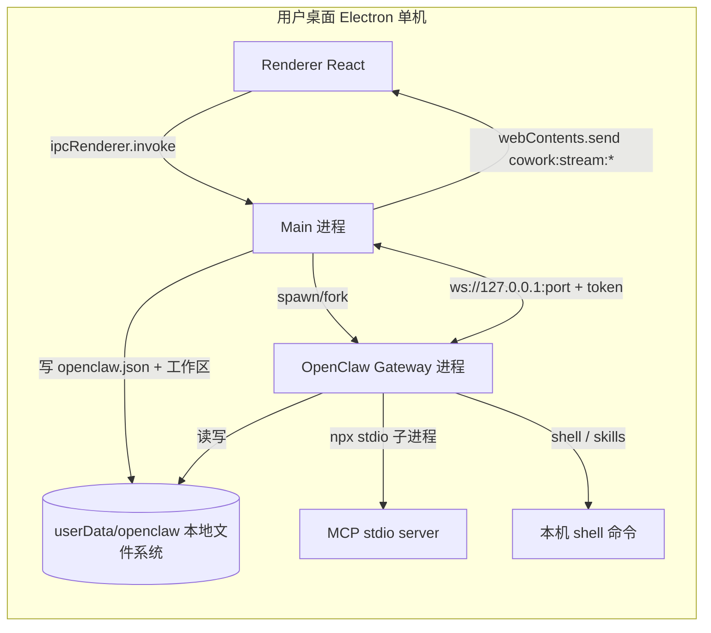
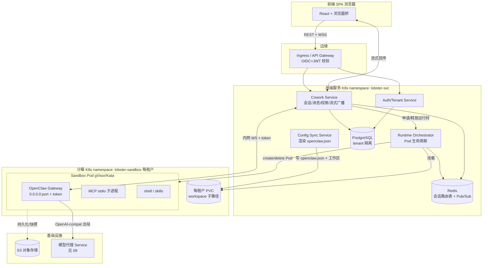
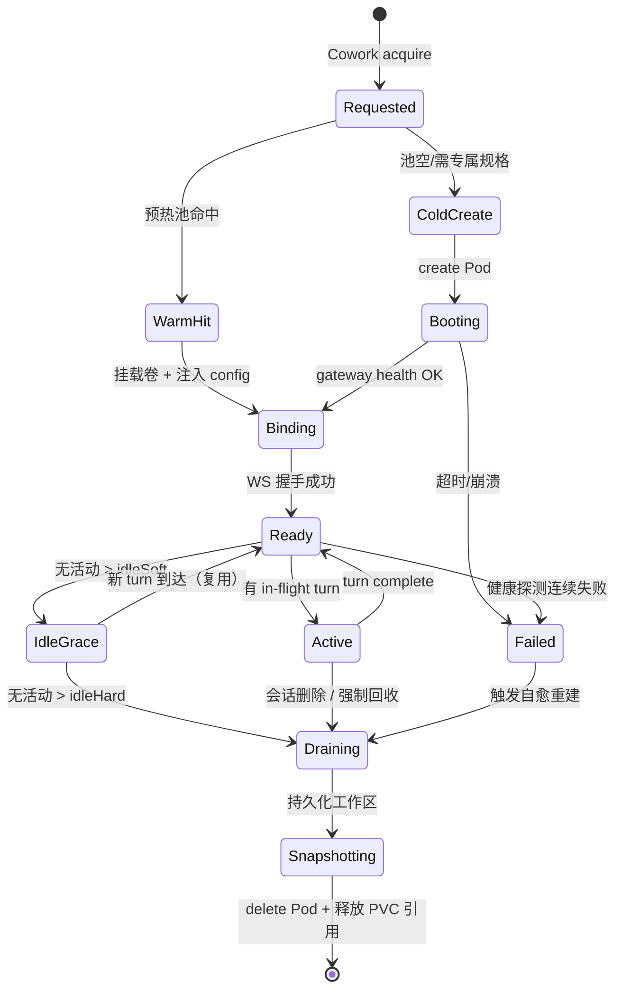
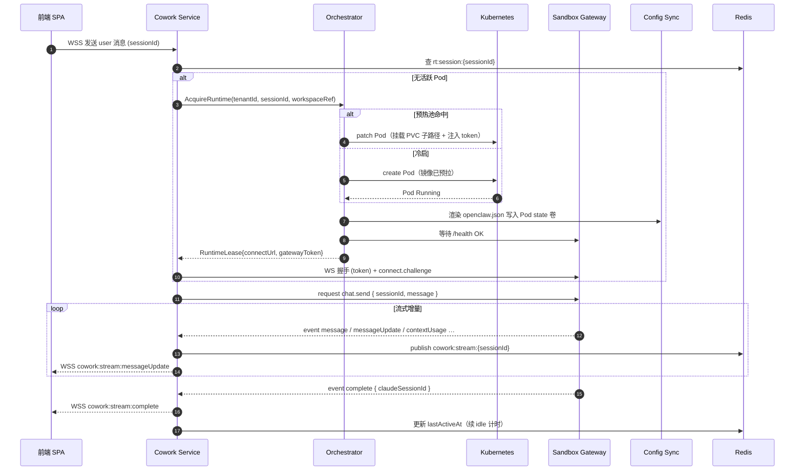
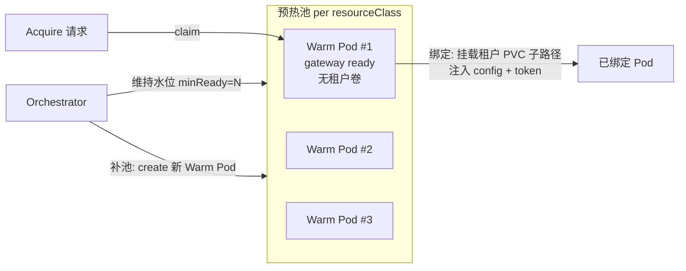
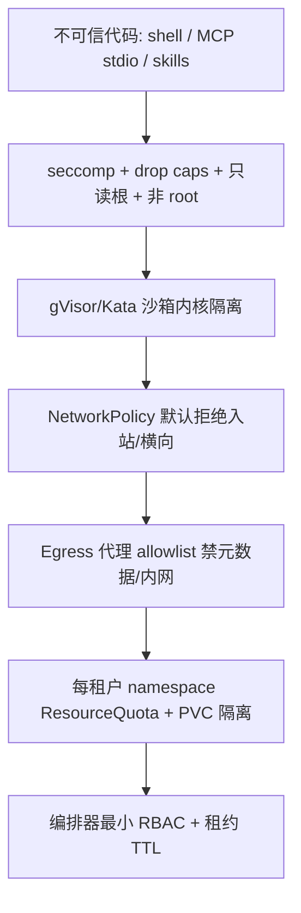
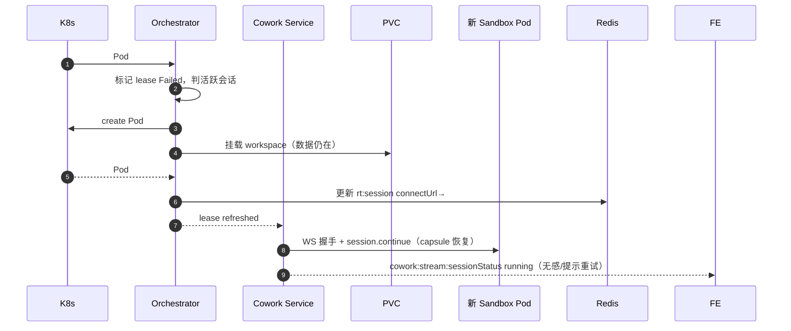

# OpenClaw 运行时编排与多租户沙箱隔离（最难一章）

> 本文档面向后端架构师、平台/SRE 工程师与安全工程师，说明如何把 LobsterAI 当前"单机本地 gateway"的 OpenClaw 运行时，改造为多租户 SaaS 下"每用户/每会话一个隔离沙箱 Pod"的运行时编排体系。这是整个改造计划中风险最高、技术最难、成本最敏感的一章。其它章节（`03-前端与传输层改造.md`、`04-后端服务与API设计.md`、`08-文件工作区与对象存储.md`、`14-安全合规与多租户隔离.md`、`15-部署运维与可观测性.md`）会反复引用本文的编排契约与隔离基线。

---

## 0. 本章要解决的核心矛盾

LobsterAI 的 OpenClaw runtime 本质上是一个**会执行不可信代码**的 agent 运行时：它可以跑 shell、跑用户装的 MCP `stdio` 子进程（`npx` 拉包）、跑 Skills（本地脚本）、读写文件工作区。在单机桌面场景，这一切跑在用户自己电脑上、用户自己的账户里，隔离由操作系统天然提供。

一旦搬到多租户 SaaS 公网环境，同一台宿主机上会同时运行成百上千个不同租户的 agent 会话。任何一个会话里的恶意/失控代码若能：

- 读到其它租户的工作区文件；
- 打到内网元数据服务（如云厂商 `169.254.169.254`）偷凭证；
- 打满 CPU/内存/磁盘拖垮邻居（noisy neighbor）；
- 逃逸容器控制宿主机 —

都是致命的安全或可用性事故。因此本章的两条主线：

1. **编排（Orchestration）**：谁来创建、复用、回收这些 gateway 实例，如何寻址、如何流式回传、如何调度并发、如何控成本。
2. **隔离（Isolation）**：如何把每个 gateway 关进足够硬的沙箱，让上面的不可信代码即使被攻破也困在租户边界内。

---

## 1. 现状：本地 WebSocket Gateway

### 1.1 进程模型

当前 OpenClaw runtime 是一个由 Electron 主进程 spawn/fork 出来的**本地 Node gateway 进程**，与主进程同机、同用户。

| 维度 | 现状事实 | 代码位置 |
|------|---------|---------|
| 启动方式 | Windows 用 `spawn(process.execPath, …, { ELECTRON_RUN_AS_NODE: '1' })`；macOS/Linux 用 `utilityProcess.fork()` | `src/main/libs/openclawEngineManager.ts:598-622` |
| 启动参数 | `gateway --bind loopback --port {port} --token {token} --verbose` | `openclawEngineManager.ts:586` |
| 监听地址 | `ws://127.0.0.1:{port}`，仅回环，默认端口 `18789`，冲突时扫描最多 80 个端口 | `openclawEngineManager.ts:38-39,344` |
| 鉴权 | 24 字节随机熵（`crypto.randomBytes(24)`，渲染为 48 个十六进制字符）token，写入 `{state}/gateway-token`，经 `OPENCLAW_GATEWAY_TOKEN` 注入 | `openclawEngineManager.ts:1214` |
| 端口持久化 | `{state}/gateway-port.json` | `openclawEngineManager.ts:1252-1254` |
| 内存上限 | `--max-old-space-size=4096`（V8 老年代 4GB） | `openclawEngineManager.ts:43-44` |
| 启动超时 | 300 秒（`GATEWAY_BOOT_TIMEOUT_MS`） | `openclawEngineManager.ts:40` |
| 健康检查 | 并行探测 HTTP `/health` `/healthz` `/ready` `/`，回退到 TCP 连接；间隔 600ms，单探针超时 1500ms | `openclawEngineManager.ts:1300-1385` |
| 自动重启 | 最多 5 次，退避 `[3s,5s,10s,20s,30s]` | `openclawEngineManager.ts:41-42` |

### 1.2 状态目录与文件工作区

Gateway 的**全部状态都在本地 `userData/openclaw/` 目录树**（详见 `08-文件工作区与对象存储.md`）：

```
{userData}/openclaw/
├── state/
│   ├── gateway-token             # 鉴权 token
│   ├── gateway-port.json         # 端口持久化
│   ├── openclaw.json             # config sync 产物（见 §1.4）
│   ├── cron/jobs.json            # 定时任务存储（见 11-定时任务调度.md）
│   ├── workspace-main/           # 主 agent 文件工作区
│   │   ├── AGENTS.md MEMORY.md SOUL.md IDENTITY.md USER.md …
│   │   └── memory/YYYY-MM-DD.md
│   └── workspace-{agentId}/      # 非主 agent 工作区
├── logs/                         # gateway 日志（daily rolling）
└── .compile-cache/               # V8 编译缓存
```

关键假设：**gateway 与工作区、config、token、port 都在同一台机器的同一文件系统上**，通过绝对路径直接读写。这是本次改造要打破的核心耦合。

### 1.3 事件契约：gateway 事件 → `cowork:stream:*`

runtime 事件从 gateway 经 WebSocket 上来，由 `openclawRuntimeAdapter.ts` 翻译为 Cowork 语义事件，再由 `coworkEngineRouter.ts` 通过 Electron IPC 广播到渲染层。**这套语义契约在改造后必须原样保留**（只是传输从 IPC 换成公网 WS，见 `03-前端与传输层改造.md`）。

| runtime 事件 | 载荷（关键字段） | 映射 IPC 通道 |
|--------------|------------------|---------------|
| `message` | `{ sessionId, message, beforeMessageId? }` | `cowork:stream:message` |
| `messageUpdate` | `{ sessionId, messageId, content, metadata? }` | `cowork:stream:messageUpdate` |
| `sessionStatus` | `{ sessionId, status }` | `cowork:stream:sessionStatus` |
| `contextUsageUpdate` | `{ sessionId, usage }` | `cowork:stream:contextUsage` |
| `contextMaintenance` | `{ sessionId, active }` | `cowork:stream:contextMaintenance` |
| `permissionRequest` | `{ sessionId, request }` | `cowork:stream:permission` |
| （权限撤销） | `{ requestId }` | `cowork:stream:permissionDismiss` |
| `complete` | `{ sessionId, claudeSessionId? }` | `cowork:stream:complete` |
| `error` | `{ sessionId, error }` | `cowork:stream:error` |

GatewayClient 的请求侧（Cowork → gateway）通过 `request(method, params, opts?)` 发起 RPC（`openclawRuntimeAdapter.ts:259-269`），主要方法：`chat.send`、`session.start` / `session.continue` / `session.delete`、`session.history`。**`chat.send` 单帧硬限 30MB / 安全线 29.5MB**（`openclawRuntimeAdapter.ts:123-126`），超限抛错并按 WebSocket close code `1009 MessageTooBig` 处理——这个限制在公网 WS 链路里同样要保留（甚至收紧，因为经过网关会有额外开销）。

### 1.4 Config Sync：LobsterAI 状态 → `openclaw.json`

`openclawConfigSync.ts` 把 LobsterAI 的 SQLite/内存状态渲染成 `{state}/openclaw.json` + 工作区 markdown 文件（`AGENTS.md`/`MEMORY.md` 等）。主要字段：providers/models、agents.defaults.workspace、plugins.entries、mcp.servers、cron.store、channels/bindings。其中 `gateway.auth.token` 写的是占位符 `${OPENCLAW_GATEWAY_TOKEN}`，spawn 时由环境变量替换。

改造后，**config sync 的"落盘目标"从本机 `userData` 变成目标 Pod 的 state 卷**——这是本章 §5 的重点。

### 1.5 现状架构图



现状的隔离等于零——gateway、MCP 子进程、shell 全都跑在用户桌面账户下，与主进程共享一切。

---

## 2. 目标：运行时编排器 + 每会话沙箱 Pod

### 2.1 总体思路

引入一个新的后端微服务 **Runtime Orchestrator（运行时编排器）**（NestJS 模块，见 `04-后端服务与API设计.md`），它负责：

1. 按"会话粒度"（v1 基线）在 Kubernetes 上创建/复用/回收 **Sandbox Pod**；
2. 每个 Pod 内跑一个 OpenClaw gateway，监听 Pod 内 `0.0.0.0:{port}`（仅 Pod 网络可达），token 鉴权；
3. 后端（Cowork Service）通过**集群内网 WS** 连接到该 Pod 的 gateway；
4. 把租户工作区以 **PVC 子路径卷**挂载进 Pod；
5. 把 config sync 写入该 Pod 的 state 卷；
6. 把 gateway 事件经 Cowork Service 转成 **WebSocket 流式**回传给前端（`cowork:stream:*` 语义不变）。

**沙箱粒度决策（v1）**：以**会话（session）为默认隔离单位**，一个活跃会话对应一个 Pod。同一租户的多个并发会话各自独立 Pod。理由：

- 会话是 chat.send/stream 的自然边界，与现有 `sessionId` 语义对齐；
- 会话内串行执行 turn，Pod 内不需要处理多会话并发的资源争抢；
- 回收策略简单（会话 idle 超时即回收）。

> 备选粒度："每租户共享 Pod、多会话复用"能显著降本，但把租户内会话之间的隔离降级为进程内隔离，且单点故障放大。**v1 采用每会话 Pod + 预热池**（§7）平衡成本与隔离；每租户共享作为 §10 的成本优化选项，仅对低风险内部租户开放。

### 2.2 目标组件图



### 2.3 现状 → 目标 映射

| 现状 | 目标 | 说明 |
|------|------|------|
| `spawn/utilityProcess.fork` gateway | K8s API 创建 Sandbox Pod | 编排器持有 kube client |
| `ws://127.0.0.1:{port}` | 集群内网 `ws://{pod-ip}:{port}` 或 Headless Service DNS | Pod 网络隔离，仅后端可达 |
| `{state}/gateway-token` 本地文件 | K8s Secret 注入 env `OPENCLAW_GATEWAY_TOKEN` | 每 Pod 独立 token，编排器生成 |
| `userData/openclaw/state` 本地目录 | 每租户 PVC + 会话子路径 | 见 `08-文件工作区与对象存储.md` |
| 主进程写 `openclaw.json` | Config Sync Service 写 Pod state 卷 | 见 §5 |
| `cowork:stream:*` via IPC | `cowork:stream:*` via WSS | 语义不变，传输改变，见 `03` |
| gatewayRepair 本地文件操作 | 编排器"重建 Pod"+ 卷备份 | 见 §9 |

---

## 3. Runtime Orchestrator 编排器设计

### 3.1 职责边界

编排器是**唯一持有 Kubernetes 集群写权限的服务**（最小权限 RBAC，仅限 sandbox namespace 的 Pod/PVC/Secret）。Cowork Service 不直接碰 K8s，只通过编排器的内部 gRPC/REST 契约申请与释放运行时。

### 3.2 运行时租约（Runtime Lease）契约

Cowork Service 在需要执行会话 turn 前，向编排器"租借"一个运行时：

```typescript
// 编排器内部契约（NestJS controller / gRPC）
interface AcquireRuntimeRequest {
  tenantId: string;
  sessionId: string;
  agentId: string;               // main 或 workspace-{agentId}
  workspaceRef: {                // 挂载哪个租户工作区子路径
    pvcName: string;             // 每租户 PVC，见 08
    subPath: string;            // 例如 tenants/{tenantId}/sessions/{sessionId}
  };
  resourceClass: 'small' | 'standard' | 'large'; // 资源规格档位，见 §6
  warmupHint?: boolean;          // 是否倾向从预热池取
}

interface RuntimeLease {
  leaseId: string;
  podName: string;
  connectUrl: string;            // ws://{clusterIP-or-dns}:{port}
  gatewayToken: string;          // 一次性下发，Cowork 缓存于 Redis
  state: 'ready' | 'warming' | 'failed';
  expiresAt: string;             // 租约 TTL，需心跳续租
  resourceClass: string;
}

interface RenewLeaseRequest { leaseId: string; ttlSeconds: number; }
interface ReleaseRuntimeRequest { leaseId: string; reason: 'idle' | 'complete' | 'evict' | 'error'; }
```

### 3.3 会话 → Pod 路由表（Redis）

编排器与 Cowork Service 通过 Redis 维护路由与状态：

| Redis Key | 值 | 用途 |
|-----------|-----|------|
| `rt:session:{sessionId}` | `{ leaseId, podName, connectUrl, tenantId, resourceClass, lastActiveAt }` | 会话→Pod 寻址（Cowork 复用连接） |
| `rt:lease:{leaseId}` | `{ podName, state, expiresAt }` | 租约 TTL 追踪 |
| `rt:tenant:{tenantId}:count` | 整数 | 每租户活跃 Pod 计数（限流用，见 §6） |
| `rt:warmpool:{resourceClass}` | List | 预热池空闲 Pod 名（见 §7） |
| `rt:node:{nodeName}:load` | Hash | 节点负载（自定义调度用） |

路由表以 Redis 为准；K8s 是"事实来源"的兜底（编排器定期 reconcile：列出 sandbox namespace 的 Pod 与 Redis 对账，清理孤儿 Pod）。

### 3.4 生命周期状态机



**超时/回收参数（初始基线，需压测调参）**：

| 参数 | 建议初值 | 说明 |
|------|---------|------|
| `bootTimeout` | 120s | 冷启超时（比桌面 300s 短，因为运行时已预拉镜像） |
| `wsHandshakeTimeout` | 60s | 与 `GATEWAY_READY_TIMEOUT_MS` 对齐（`openclawRuntimeAdapter.ts:120`） |
| `idleSoft` | 5 min | 软空闲：进入 grace，仍可复用 |
| `idleHard` | 15 min | 硬空闲：开始 draining 回收 |
| `leaseTTL` | 60s | 租约需 Cowork 每 30s 续租，防止 Cowork 崩溃后 Pod 泄漏 |
| `maxPodLifetime` | 4h | 单 Pod 最长存活（防长驻污染/内存泄漏），到期强制轮转（先落盘再重建） |

---

## 4. 连接与流式回传链路

### 4.1 网络寻址

- Sandbox Pod **不暴露给公网**，仅在集群 `lobster-sandbox` namespace 内可达。
- Cowork Service 用编排器返回的 `connectUrl`（Pod IP 或 Headless Service DNS）连 `ws://{pod}:{port}`，带 `OPENCLAW_GATEWAY_TOKEN`。
- Pod IP 会随重建变化，因此 `connectUrl` 由编排器动态解析并写入 Redis 路由表；Cowork 断线重连时向编排器"刷新地址"（因为自愈可能已换 Pod，见 §9）。

### 4.2 端到端流式时序



### 4.3 流式广播的多副本问题

前端的 WSS 长连接可能落在 Cowork Service 的**任意副本**上，而某会话的 gateway WS 连接由**另一个副本**持有。解决：

- 持有 gateway 连接的 Cowork 副本把 runtime 事件 `PUBLISH` 到 Redis channel `cowork:stream:{sessionId}`；
- 持有前端 WSS 的副本 `SUBSCRIBE` 该 channel，收到即透传给浏览器；
- 权限响应、`chat.send`、stop 等**入站命令**反向路由：入站命令带 `sessionId`，前端副本查路由表找到持有 gateway 的副本，经 Redis 命令 channel 转发（或做"会话粘性"，用一致性哈希把同会话的 WSS 与 gateway 连接尽量收敛到同一副本以减少跨副本跳转）。

> 详细的 WSS 协议、断线重连、背压处理见 `03-前端与传输层改造.md`；这里只约束"流式语义与 `cowork:stream:*` 事件名不变"。

---

## 5. Config Sync 改造：从本机落盘到 Pod state 卷

### 5.1 现状回顾

`openclawConfigSync.ts` 直接对本机 `{userData}/openclaw/state` 做 `fs` 写：`openclaw.json`（`:1478-1962`）、工作区 `AGENTS.md`/`MEMORY.md`/`SOUL.md` 等。token 以占位符 `${OPENCLAW_GATEWAY_TOKEN}` 写入，spawn 环境替换。

### 5.2 目标：Config Sync Service

把 config sync 抽成后端服务（可作为编排器的子模块或独立微服务），复用现有 TS 渲染逻辑（这是"后端复用现有 TS 业务逻辑"决策的直接受益点），但**写入目标从本机路径改为目标 Pod 的 state 卷**。

三种落盘方式（按推荐度排序）：

| 方式 | 做法 | 优缺点 |
|------|------|--------|
| **A. InitContainer 渲染（推荐）** | 编排器把 config 输入（provider/agent/plugin/mcp 快照）以 ConfigMap/Secret 传入 Pod，Pod 的 initContainer 跑 config-sync 逻辑把 `openclaw.json` + 工作区文件渲染到 emptyDir/PVC，主容器再启动 gateway | 无需后端访问 Pod 文件系统；渲染在 Pod 内，边界清晰；secret 走 K8s Secret，token 不落磁盘明文 |
| **B. 卷预填 + 挂载** | Config Sync Service 先把渲染结果写到租户 PVC 的会话子路径，再让 Pod 挂载该子路径 | 复用最多现有代码；但要求后端能写 PVC（通常需一个能挂 PVC 的 sidecar/job） |
| **C. gateway 启动后 API 下发** | Pod 起来后经内网 API 把 config 推给 gateway | 需要 OpenClaw 支持热配置接口；改动最大，作为长期方向 |

**v1 采用 A（initContainer）+ 工作区走 PVC（见 08）**：`openclaw.json` 这类"每会话动态配置"由 initContainer 从注入的 ConfigMap 渲染；`MEMORY.md`/`AGENTS.md` 这类"租户持久记忆"走 PVC 持久化。

### 5.3 需要改动的配置字段

| 字段 | 现状 | 目标 |
|------|------|------|
| `gateway.auth.token` | `${OPENCLAW_GATEWAY_TOKEN}` 占位符 | 不变，但 token 来自 K8s Secret（每 Pod 唯一） |
| `gateway.mode` | `'local'` | `'local'`（Pod 内仍是本地模式，只是"本地"= Pod 内） |
| `gateway.bind` | `loopback` | **改为 `0.0.0.0`（Pod 内），靠 NetworkPolicy 限制来源**（§8.3） |
| `agents.defaults.workspace` | 本机 `workspace-main` | Pod 内挂载点，如 `/workspace/main` |
| `mcp.servers` | stdio 用本机 `npx` | Pod 内跑，需沙箱内有 node/npx（§10.1，见 `10-MCP与技能改造.md`） |
| `plugins.entries` callback | `http://127.0.0.1:{bridge}` | Pod 内 bridge 或经内网回调 Cowork（`LOBSTER_MCP_BRIDGE_SECRET`） |
| provider apiKey | `LOBSTER_APIKEY_{PROVIDER}` env | 改为指向内网**模型代理 Service**，Pod 不持有真实上游 key（见 `09-模型代理与计费.md`） |
| `cron.store` | 本机 `cron/jobs.json` | 定时任务改由后端 BullMQ 调度触发（见 `11-定时任务调度.md`），Pod 内不常驻 cron |

### 5.4 环境变量注入映射

现状 gateway spawn 注入的一批 env（`openclawEngineManager.ts:498-532`）在 Pod 里改为 K8s env/Secret：

| env | 现状来源 | Pod 内来源 |
|-----|---------|-----------|
| `OPENCLAW_HOME` / `OPENCLAW_STATE_DIR` / `OPENCLAW_CONFIG_PATH` | userData 路径 | Pod 挂载点（如 `/state`） |
| `OPENCLAW_GATEWAY_TOKEN` / `OPENCLAW_GATEWAY_PORT` | 本机生成 | K8s Secret / 固定端口 |
| `SKILLS_ROOT` / `LOBSTERAI_SKILLS_ROOT` | `~/SKILLs` | Pod 内 skills 挂载点（见 `10`） |
| `LOBSTER_MCP_BRIDGE_SECRET` | 本机 UUID | K8s Secret |
| `LOBSTER_APIKEY_{PROVIDER}` | 真实上游 key | **改为模型代理网关地址 + 会话级短期凭证**（Pod 不持有真实 key） |
| `TZ` | 本机推断 | 租户/会话时区（Pod env） |
| `http_proxy`/`https_proxy` | 系统代理 | **egress 代理地址**（§8.4，强制出站经审计代理） |

---

## 6. 资源配额、限流与调度

### 6.1 资源规格档位（ResourceClass）

| 档位 | CPU request/limit | 内存 request/limit | 临时磁盘 | 适用 |
|------|-------------------|--------------------|----------|------|
| `small` | 0.25 / 1 | 512Mi / 1.5Gi | 2Gi | 轻量对话、纯文本 |
| `standard` | 0.5 / 2 | 1Gi / 3Gi | 5Gi | 默认（含 MCP/skills 执行） |
| `large` | 1 / 4 | 2Gi / 6Gi | 10Gi | 重计算、大文件工作区 |

内存 limit 与现有 `--max-old-space-size=4096`（`openclawEngineManager.ts:43`）需协同：Pod 内 gateway 的 V8 老年代上限应**低于容器 memory limit**（如 standard 档位设 `--max-old-space-size=2048`），否则 V8 撑满会被 OOMKilled 而非优雅报错。

### 6.2 多层限流

| 层级 | 限制 | 实现 |
|------|------|------|
| 每租户并发 Pod 数 | 按套餐（免费 1、标准 5、企业可配） | Redis `rt:tenant:{id}:count` + acquire 前检查 |
| 每租户 CPU/内存总量 | ResourceQuota（K8s namespace 级） | 每租户独立 namespace 或 LimitRange |
| 全局节点池容量 | Cluster Autoscaler + 节点上限 | 超限时 acquire 排队/降级（见 §6.3） |
| 每会话 turn 频率 | 令牌桶 | Cowork Service + Redis |
| chat.send 帧大小 | 30MB 硬限（保留） | `openclawRuntimeAdapter.ts:123-126` |

### 6.3 调度与并发

- **入队削峰**：acquire 请求进 BullMQ 队列，编排器按节点余量消费，避免瞬时打爆 K8s API 与调度器。
- **超配额降级**：租户达并发上限时，新会话进入排队态（前端展示"排队中"），或提示升级套餐——不阻塞已有会话。
- **反亲和**：Pod 设 `podAntiAffinity`（软），把同租户 Pod 尽量打散到不同节点，降低单节点故障的租户级影响；但沙箱 Pod 之间靠内核隔离而非节点隔离（节点隔离成本过高）。
- **优先级**：付费租户 `PriorityClass` 高于免费租户，资源紧张时免费会话先被 evict（先落盘）。

---

## 7. 冷启动优化：预热池

### 7.1 问题

冷启一个 Pod 要经历：调度 → 拉/复用镜像 → gVisor/Kata 沙箱初始化 → Node 进程启动 → gateway 加载插件（`connect.challenge` 预握手，`openclawRuntimeAdapter.ts:115-120`）→ 健康就绪。即使镜像预拉，沙箱运行时（尤其 Kata 微 VM）+ gateway 插件加载也可能是**数秒到十几秒**级别，对交互式对话体验不可接受。

### 7.2 预热池（Warm Pool）设计

维护一批"已启动、未绑定租户、通用配置"的空闲 Pod：



**关键约束**：预热 Pod 处于"净室"状态——**未挂任何租户卷、未注入任何租户 config/token**。绑定发生在 claim 时（挂载子路径 + 通过 initContainer/短命 job 注入 config + 下发 token）。这样避免"预热 Pod 泄漏租户数据"。

| 参数 | 说明 |
|------|------|
| `minReady` | 每档位最小热备水位（如 standard=10） |
| `maxIdle` | 池内 Pod 最长空闲存活（避免长驻污染，定期轮转） |
| 补池策略 | 被 claim 后异步补一个；按历史 QPS 预测动态调 minReady（高峰前扩容） |
| 绑定隔离校验 | claim 时确认 Pod 从未被其它租户使用（用净室标签 + 一次性生命周期，claim 后该 Pod 生命周期只服务一个会话，回收即销毁） |

> **注意**：能否"绑定后再挂载租户卷"取决于容器运行时是否支持运行时挂卷。Kubernetes 原生不支持给运行中的 Pod 追加 volumeMount。因此实用做法是：预热 Pod 挂一个**空的通用 emptyDir**，claim 时通过 sidecar/CSI 或"预热 Pod 只预热镜像层与沙箱运行时、真正 Pod 仍需 create 但省去镜像拉取与部分初始化"。**v1 折中**：预热聚焦在"镜像预拉 + 节点预留 + 沙箱运行时预热"，把冷启的最大头（拉镜像 + 沙箱初始化）消掉；完整"热 Pod 直接接管"作为进阶优化。这一取舍需在 POC 阶段实测确定（见 §12 验收 & `17-分阶段路线图`）。

---

## 8. 隔离加固（本章安全核心）

多租户下 gateway 会执行不可信 shell/MCP/skills，必须假设"沙箱内代码是敌对的"。以下为**纵深防御**分层，全部为强制基线（见 `14-安全合规与多租户隔离.md`）。

### 8.1 容器运行时沙箱：gVisor / Kata

| 方案 | 隔离强度 | 开销 | 建议 |
|------|---------|------|------|
| 裸容器（runc） | 弱（共享内核，靠 namespace/cgroup） | 最低 | **禁止**用于跑不可信代码 |
| **gVisor（runsc）** | 强（用户态内核，拦截 syscall） | 中（部分 syscall 慢、少数不兼容） | **v1 默认**，兼容性好、启动快 |
| **Kata Containers** | 最强（每 Pod 独立微 VM） | 高（内存/启动） | 高安全租户/企业档位可选 |

通过 `RuntimeClass` 选择：sandbox namespace 的 Pod 强制 `runtimeClassName: gvisor`。付费/企业租户可切 `kata`。

### 8.2 seccomp / capabilities / 只读根

Pod securityContext 基线：

```yaml
securityContext:
  runAsNonRoot: true
  runAsUser: 10001
  allowPrivilegeEscalation: false
  readOnlyRootFilesystem: true          # 根只读，可写区仅限挂载的 tmp/工作区
  capabilities:
    drop: ["ALL"]                        # 丢弃所有 Linux capabilities
  seccompProfile:
    type: RuntimeDefault                 # 或自定义收紧的 seccomp profile
```

- **只读根 + 有限可写卷**：根文件系统只读，可写区仅 `/workspace`（PVC 子路径）、`/state`、`/tmp`（emptyDir，带 sizeLimit）。防止污染系统文件与持久化后门。
- **禁止提权**、**drop 所有 capability**：即使 shell 拿到执行权也无法提权。
- 与 gVisor 叠加：seccomp 收窄可用 syscall，gVisor 再在用户态过滤——双保险。

### 8.3 网络策略：默认拒绝入站

```yaml
# NetworkPolicy: sandbox Pod 默认拒绝所有入站，仅允许后端来源
apiVersion: networking.k8s.io/v1
kind: NetworkPolicy
metadata: { name: sandbox-default-deny, namespace: lobster-sandbox }
spec:
  podSelector: {}
  policyTypes: [Ingress, Egress]
  ingress:
    - from:
        - namespaceSelector: { matchLabels: { name: lobster-svc } }
          podSelector: { matchLabels: { app: cowork-service } }
      ports: [{ protocol: TCP, port: 18789 }]
  egress:
    - to:                                # 仅放行 egress 代理 + DNS
        - podSelector: { matchLabels: { app: egress-proxy } }
      ports: [{ protocol: TCP, port: 3128 }]
    - to: []                             # DNS
      ports: [{ protocol: UDP, port: 53 }]
```

- **入站**：只允许 `lobster-svc` namespace 的 Cowork Service 连 gateway 端口。这样即便 `gateway.bind` 改成 `0.0.0.0`（§5.3），网络层仍收敛到"仅后端可达"，等价于原来的 loopback 语义。
- **横向隔离**：Pod 之间默认不可互通，杜绝跨租户/跨会话横向移动。

### 8.4 Egress 出站控制（防 SSRF / 元数据窃取）

沙箱内代码会发网络请求（MCP `sse/http`、web.fetch、skills 拉包）。必须强制经**审计型出站代理**：

- 所有 egress 走 `egress-proxy`（Squid/Envoy），Pod 直连外网被 NetworkPolicy 拒绝；
- 代理执行 **allowlist/denylist**：
  - **硬禁**云元数据地址 `169.254.169.254`、`fd00:ec2::254`、链路本地、RFC1918 内网段（除白名单）；
  - 呼应现有 `browserWebAccess.networkMode` / `ssrfPolicy`（`openclawConfigSync.ts:1425-1448`）的 SSRF 策略，把它上升为集群级强制；
- 代理记录出站审计日志（目标域名/IP、字节数）用于计费与安全溯源；
- npm 拉包（MCP stdio `npx`）走**内网私有 registry 镜像**，不直连公网 npm（供应链加固，见 `10-MCP与技能改造.md`）。

### 8.5 隔离分层小结



---

## 9. 故障自愈：迁移 gatewayRepair 逻辑

### 9.1 现状

桌面端有 `openclawGatewayRepair.ts`：修复前提是"无活跃会话/定时任务"（`OPENCLAW_GATEWAY_REPAIR_BUSY_ERROR`，`:9-13`），修复动作是备份 `openclaw.json` 到 `openclaw-bak*.json`（`:59-70`）后重建。还有自动重启退避 `[3s,5s,10s,20s,30s]`（`openclawEngineManager.ts:42`）与预期退出集合 `expectedGatewayExits`。

### 9.2 目标：Pod 级自愈

多租户下"修复"= **重建 Pod**（Pod 是不可变的、可丢弃的），核心是保住**工作区数据**（在 PVC 上，天然持久）与**会话连续性**。

| 故障 | 检测 | 自愈动作 |
|------|------|---------|
| gateway 崩溃/OOM | liveness probe 失败 / Pod CrashLoopBackOff | 编排器创建替换 Pod，挂同一 PVC 子路径，刷新 Redis `connectUrl`，Cowork 重连并 `session.continue` 续接 |
| gateway 卡死（无响应） | readiness/健康探测连续失败（沿用 600ms 间隔思路） | 标记 Failed → Draining → 重建 |
| config 损坏 | 启动即失败 | initContainer 重渲染 config（等价现有"备份+重建"，坏 config 归档到 S3 供排查） |
| 节点故障 | 节点 NotReady | Pod 被驱逐，编排器在健康节点重建 |
| Cowork 侧连接抖动 | WS 断开 | 指数退避重连（对齐桌面退避语义），期间前端展示"重连中" |

**关键：无损续接**。因为工作区在 PVC、会话消息在 Postgres（见 `06-数据模型迁移.md`）、continuity capsule 持久化，重建 Pod 后 Cowork 用 `session.continue` + capsule 恢复上下文，用户视角尽量无感（可能损失当前未完成的一个 turn，需前端明确提示重试）。

### 9.3 自愈时序



---

## 10. 成本模型

沙箱 Pod 是本方案最大的可变成本来源。成本 ≈ Σ(每会话 Pod 存活时长 × 资源规格单价) + 预热池常驻成本 + 出站流量。

### 10.1 成本构成与优化

| 成本项 | 驱动因素 | 优化手段 |
|--------|---------|---------|
| 会话 Pod 计算 | 并发活跃会话数 × 时长 × 规格 | idle 快速回收（§3.4）；小档位默认；bin-packing 提高节点利用率 |
| 预热池常驻 | minReady 水位 | 按时段/QPS 预测动态调水位；夜间缩容 |
| Kata 微 VM 内存开销 | 每 Pod 固定 VM 内存 | 默认 gVisor，仅企业档位用 Kata |
| 出站流量 | MCP/web 拉取 + 模型调用 | 内网 registry 镜像；模型走内网代理复用连接 |
| PVC 存储 | 每租户工作区大小 | 生命周期归档冷数据到 S3（见 `08`）、配额限制 |

### 10.2 计费联动

沙箱运行时长与资源消耗应计入租户用量（与 `09-模型代理与计费.md` 的模型 token 计费合并成账单）。建议指标：`sandbox_pod_seconds{tenant,resourceClass}`、`egress_bytes{tenant}`、`workspace_bytes{tenant}`。免费租户用共享档位 + 强 idle 回收控成本；付费租户可买专属规格与更高并发。

### 10.3 成本 vs 隔离的权衡矩阵

| 策略 | 成本 | 隔离 | 适用租户 |
|------|------|------|---------|
| 每会话 Pod + gVisor（v1 默认） | 中 | 高 | 大部分租户 |
| 每租户共享 Pod、多会话进程内隔离 | 低 | 中 | 低风险内部/试用租户 |
| 每会话 Kata 微 VM | 高 | 最高 | 企业/高合规租户 |

---

## 11. 可观测性

（与 `15-部署运维与可观测性.md` 统一，此处列本域专有指标/信号。）

### 11.1 指标（Prometheus）

| 指标 | 类型 | 说明 |
|------|------|------|
| `sandbox_acquire_latency_seconds` | histogram | acquire→ready 时延（区分 warm-hit/cold） |
| `sandbox_warmpool_ready{class}` | gauge | 预热池当前水位 |
| `sandbox_warmpool_hit_ratio` | gauge | 预热命中率（冷启优化核心 KPI） |
| `sandbox_active_pods{tenant}` | gauge | 每租户活跃 Pod（限流/成本） |
| `sandbox_pod_restart_total` | counter | 自愈重建次数 |
| `sandbox_pod_seconds{tenant,class}` | counter | 计费用时长 |
| `gateway_ws_reconnect_total` | counter | Cowork↔gateway 重连次数 |
| `gateway_chat_send_reject_total` | counter | 30MB 超限拒绝数 |
| `egress_blocked_total{reason}` | counter | 被 egress 代理拦截（含元数据/内网拦截，安全信号） |

### 11.2 日志与追踪

- **gateway 日志**：现状写本机 `logs/`（`openclawEngineManager.ts:1461-1495`）。Pod 内改为 stdout → 由 Loki 采集，打上 `tenant/session/pod` 标签；敏感字段脱敏（不落 token/apikey）。
- **分布式追踪**：OpenTelemetry trace 贯穿"前端 turn → Cowork → acquire → gateway chat.send → 模型代理"，每段 span 带 `tenantId`/`sessionId`。
- **安全审计**：egress 代理拦截、跨租户访问尝试、编排器 K8s 操作（谁在什么时候创建/删除了哪个租户的 Pod）单独进审计流（见 `14`）。

---

## 12. 验收标准

| 编号 | 验收项 | 判定标准 |
|------|--------|---------|
| AC-1 | 会话隔离 | 租户 A 的会话 Pod 无法读取/写入租户 B 的 PVC 子路径；跨会话文件互不可见（用探针脚本验证越权读被拒） |
| AC-2 | 网络隔离 | 沙箱内 `curl 169.254.169.254`、访问内网 RFC1918、访问另一 Pod IP 全部被拒（NetworkPolicy + egress 代理） |
| AC-3 | 沙箱强度 | Pod 以非 root + 只读根 + drop caps + gVisor 运行；提权/写系统路径失败；`kubectl` 无法从 Pod 内调用（无 SA token 或最小 SA） |
| AC-4 | 事件契约不变 | `cowork:stream:*` 九类事件语义、字段、顺序与桌面一致；前端无需改渲染逻辑（仅换传输） |
| AC-5 | 流式端到端 | 一条 turn 的 message/messageUpdate/contextUsage/complete 经 Cowork→WSS 正确增量到达；多副本下 Redis Pub/Sub 广播正确 |
| AC-6 | 冷启性能 | 预热命中路径 p95 acquire→ready < 3s；冷启 p95 < 15s；warmpool 命中率 > 80%（正常负载） |
| AC-7 | 并发与限流 | 免费租户超并发上限时新会话优雅排队/提示，不影响已有会话；节点满时 acquire 入队不打爆 K8s API |
| AC-8 | 自愈无损 | 杀死一个活跃 gateway Pod 后，编排器 60s 内重建并 `session.continue` 恢复上下文；工作区数据零丢失；前端仅提示"重连"，历史消息完整 |
| AC-9 | 租约防泄漏 | 强杀持有租约的 Cowork 副本后，租约 TTL 到期，编排器自动回收孤儿 Pod（reconcile 对账） |
| AC-10 | 回收正确性 | 会话 idleHard 后 Pod 被 drain→落盘→删除；PVC 数据保留；Redis 路由项清理 |
| AC-11 | chat.send 限制 | 超过 30MB 的 chat.send 被拒并返回可读错误（对齐 `openclawRuntimeAdapter.ts:123-126`），不导致 Pod 崩溃 |
| AC-12 | 成本可计量 | `sandbox_pod_seconds` / `egress_bytes` 按租户可查，能对账到计费系统（见 `09`） |
| AC-13 | config sync 正确 | initContainer 渲染的 `openclaw.json` 与桌面产物字段等价（provider/agent/plugin/mcp）；坏 config 走备份+重渲染自愈 |

---

## 13. 风险与缓解

（登记进 `18-风险登记册.md`，此处列本域高风险项。）

| 风险 | 影响 | 缓解 |
|------|------|------|
| 沙箱逃逸 | 跨租户数据泄露/宿主机沦陷（致命） | gVisor/Kata 双方案 + seccomp + 定期升级运行时 + 安全扫描（`14`） |
| SSRF/元数据窃取 | 云凭证泄露 | 强制 egress 代理 + 禁元数据/内网 + IMDSv2/无 IMDS 节点 |
| 冷启体验差 | 交互卡顿、留存下降 | 预热池 + 镜像预拉 + 沙箱运行时预热；POC 阶段实测调参 |
| Pod 泄漏/成本失控 | 账单爆炸 | 租约 TTL + reconcile 对账 + idle 强回收 + maxPodLifetime 轮转 |
| K8s API 过载 | 编排抖动、雪崩 | acquire 入队削峰 + 批量操作 + 客户端限速 |
| OpenClaw 版本升级破坏契约 | 事件/RPC 不兼容 | 版本化沙箱镜像 + 灰度 + 契约测试（AC-4/AC-5 做回归） |
| 运行时挂卷限制致预热失效 | 冷启优化打折 | POC 先验证挂卷/CSI 能力，若不支持则退化为"镜像+节点预热"（§7.2 折中） |
| 多副本流式错乱 | 消息丢失/串扰 | 会话粘性 + Redis Pub/Sub + 严格按 sessionId 路由（AC-5） |

---

## 14. 落地步骤（摘要，详见 `17-分阶段路线图与工作量估算.md`）

1. **P0 POC**：单租户单会话，K8s 手动跑一个 gVisor Sandbox Pod，Cowork 内网 WS 连通，跑通一条 turn 的 `cowork:stream:*`。验证挂卷/config 注入/健康探测（对应 AC-4/AC-5）。
2. **P1 编排器 MVP**：实现 AcquireRuntime/Release/Renew 契约 + Redis 路由表 + 生命周期状态机 + idle 回收（AC-1/AC-7/AC-10）。
3. **P2 隔离加固**：NetworkPolicy 默认拒绝 + egress 代理 + securityContext 基线 + 每租户 ResourceQuota（AC-1/AC-2/AC-3）。
4. **P3 config sync 服务化**：把 `openclawConfigSync.ts` 逻辑抽为 initContainer/服务，写 Pod state（AC-13）。
5. **P4 冷启优化**：预热池 + 镜像预拉 + 动态水位（AC-6）。
6. **P5 自愈与可观测**：Pod 级重建 + `session.continue` 无损续接 + 全套指标/追踪/审计（AC-8/AC-9/AC-11/AC-12）。
7. **P6 成本与规模**：bin-packing、autoscaler 调优、Kata 企业档位、压测调参。

---

## 15. 交叉引用

- 传输层（WSS 协议、桥、断线重连、背压）：`03-前端与传输层改造.md`
- 编排器/Config Sync 的服务边界与 API：`04-后端服务与API设计.md`
- 租户模型与 namespace/RBAC/PVC 命名：`05-认证与多租户账户.md`、`14-安全合规与多租户隔离.md`
- 工作区卷、S3 归档、PVC 子路径布局：`08-文件工作区与对象存储.md`
- 模型代理（Pod 不持真实 key、出站经内网代理、计费）：`09-模型代理与计费.md`
- MCP stdio 沙箱化、私有 registry、Skills 执行：`10-MCP与技能改造.md`
- 定时任务从 Pod cron 迁到后端 BullMQ 调度：`11-定时任务调度.md`
- SSRF/egress/沙箱强度的安全总纲：`14-安全合规与多租户隔离.md`
- 部署、Helm、Prometheus/Grafana/Loki、autoscaler：`15-部署运维与可观测性.md`
- IPC→WS 通道映射（含 `cowork:stream:*` 全表）：`附录A-IPC通道与接口映射.md`
