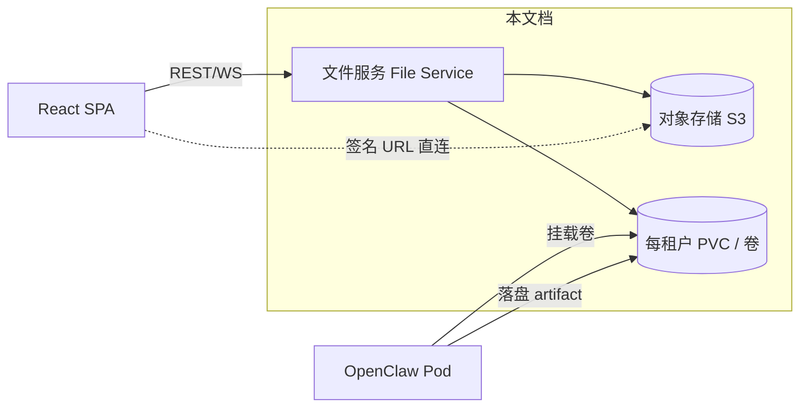
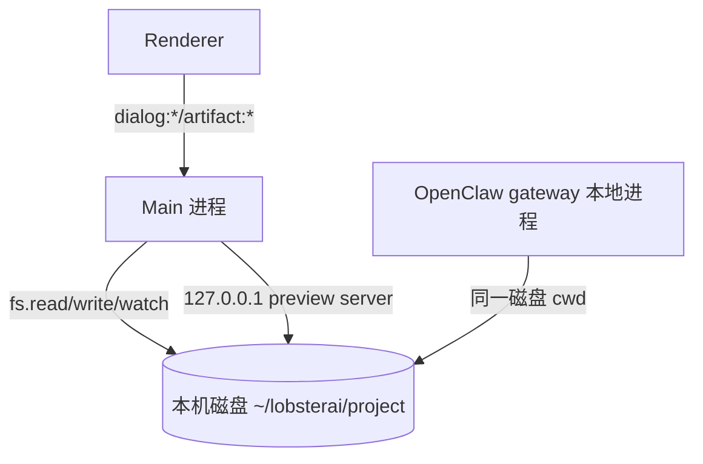
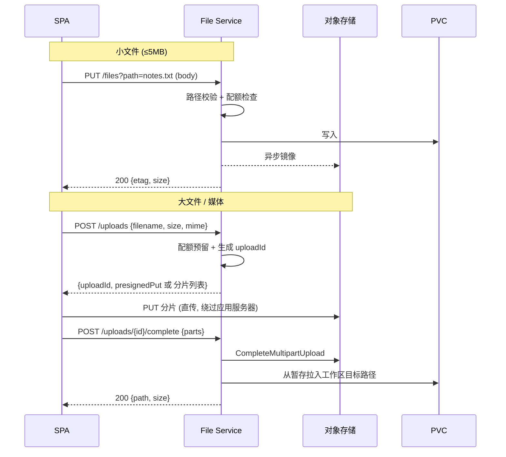
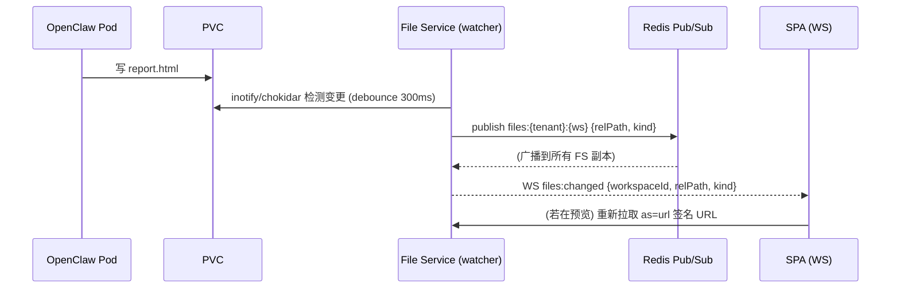
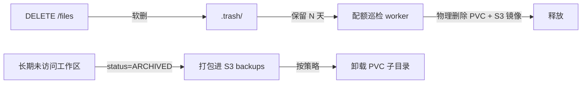

# 文件工作区与对象存储

> 本文档面向后端/平台工程师与全栈开发者，阐述如何把 LobsterAI 桌面端“本地文件系统工作目录 + 本地文件预览”的模型，改造成多租户 SaaS 下的“每租户持久工作区 + 对象存储 + 文件服务 API”。它是 07（OpenClaw 运行时编排与沙箱隔离）与 12（Artifacts 与预览改造）之间的“存储底座”章节：07 决定 Pod 与卷的编排、12 决定 Artifact 如何在前端渲染，而本文档定义两者共享的**工作区数据面**。

---

## 0. 阅读导航与本文档边界

| 议题 | 本文档负责 | 交叉引用 |
|------|-----------|---------|
| 每租户工作区如何持久化（PVC / 对象存储 / 同步） | ✅ 主责 | — |
| 文件服务 API（浏览/上传/下载/读写/watch） | ✅ 主责 | 附录 A（IPC→REST/WS 映射）|
| OpenClaw Pod 如何挂载工作区卷、共享细节 | 与 07 一致，本文只给存储侧接口 | 见 `07-OpenClaw运行时编排与沙箱隔离.md` |
| Artifact 文件如何渲染（HTML/SVG/PPTX 沙箱） | 只负责“文件从哪来、签名 URL 怎么发” | 见 `12-Artifacts与预览改造.md` |
| 浏览器桥如何顶替 `window.electron` 的文件相关 API | 只列被替换的通道清单与目标语义 | 见 `03-前端与传输层改造.md` |
| 对象存储桶的租户隔离与 IAM 边界 | 只给 key 命名与权限约束 | 见 `14-安全合规与多租户隔离.md` |
| 存储成本、配额、清理策略的计费联动 | 给出配额模型骨架 | 见 `09-模型代理与计费.md` |
| 数据库中工作区元数据表 | 只给 schema 骨架 | 见 `06-数据模型迁移.md` |

一句话记住三层职责边界：



---

## 1. 现状：本地文件系统即工作区

桌面端的“工作区”本质是**用户本机的一个真实目录**，OpenClaw agent 与前端预览都直接读写本地路径。没有任何存储抽象层。

### 1.1 工作目录（cwd）概念

- 新用户默认工作目录：`~/lobsterai/project`，见 `src/main/coworkStore.ts:37-39`（`getDefaultWorkingDirectory`）。
- 会话 cwd 存在 `cowork_sessions.cwd`、全局默认存在 `cowork_config`（见 `src/main/sqliteStore.ts`），每个 agent 还可有独立 `agents.working_directory`。
- 任务型会话有一个容器目录 `.lobsterai-tasks`，`normalizeRecentWorkspacePath` 会把 `.../.lobsterai-tasks/...` 归一化回父目录，见 `src/main/coworkStore.ts:41-51`。
- “最近工作目录”通过 `get-recent-cwds` IPC 返回，实现落在 `getCoworkStore().listRecentCwds()`，见 `src/main/main.ts:8478-8481` 与 `src/main/coworkStore.ts:1536`。

### 1.2 用户如何“选目录”——原生对话框

| IPC 通道 | 实现位置 | 语义 | 是否可移植 |
|---------|---------|------|-----------|
| `dialog:selectDirectory` | `src/main/main.ts:8522-8534` | 弹原生目录选择器，返回绝对路径 | ❌ Electron-only |
| `dialog:selectFile` / `dialog:selectFiles` | `src/main/main.ts:8536+` | 弹原生文件选择器 | ❌ Electron-only |
| `get-recent-cwds` | `src/main/main.ts:8478-8481` | 最近使用的本地目录列表 | ⚠️ 语义需重定义 |

这三者共同构成“**本地路径心智模型**”：用户脑中的工作区 = 磁盘上一个能用 Finder/资源管理器打开的文件夹。SaaS 化后这一心智必须被**服务端虚拟工作区**替换（见 §7）。

### 1.3 文件读写与缩略图（renderer 借道 main 做 fs）

renderer 无 Node fs 能力，一切文件 IO 都经 IPC 落到 main 进程直接操作本地磁盘：

| IPC 通道 | 实现位置 | 语义 |
|---------|---------|------|
| `dialog:readFileAsDataUrl` | `src/main/main.ts:8663` | 读本地文件 → base64 data URL（图片/附件预览）|
| `dialog:saveInlineFile` | `src/main/main.ts:8602` | 把内联内容写到本地文件 |
| `dialog:statFile` | `src/main/main.ts`（`statFile` 组） | `fs.stat` 元信息 |
| `dialog:readTextFile` | `src/main/main.ts` | 读文本文件 |
| `dialog:generateThumbnail` | `src/main/main.ts:8760` | 生成缩略图 |
| `shell:openPath` / `shell:showItemInFolder` | `src/main/main.ts`（`shell:*` 组）| 在本机打开文件/定位到资源管理器 |

### 1.4 Artifact 文件：本地路径 + 文件监听 + 本地预览 server

Artifact 的“文件型”产物是 agent 在 cwd 里落盘的真实文件。前端拿到的是**本地绝对路径**，预览与刷新链路完全绑定本地 fs：

- `artifact:watchFile` / `artifact:unwatchFile`：用 `fs.watch` 监听本地文件变更，debounce 300ms 后 `webContents.send('artifact:file:changed', { filePath })`，见 `src/main/main.ts:8985-9024`。
- HTML/PPTX 高保真预览走本地 HTTP server，见 `src/main/libs/htmlPreviewServer.ts`：
  - `createPreviewSession(filePath)`：以文件所在目录为 `rootDir`，生成 `sessionId`（16B hex）与 `token`（24B hex），监听 `127.0.0.1:{随机端口}`，返回 `http://127.0.0.1:{port}/{sessionId}/{file}?token=...`，见 `htmlPreviewServer.ts:345-361`。
  - 请求校验：token 比对 + **目录穿越防护**——`path.resolve(session.rootDir, relativePath)` 后必须 `startsWith(session.rootDir)`，否则拒绝，见 `htmlPreviewServer.ts:282-285`。
  - 这套“token + rootDir 隔离 + 路径归一化校验”的思路，正是 SaaS 侧签名 URL 与路径安全的直接前身（见 §5）。

### 1.5 现状总结（问题清单）



| 现状特征 | SaaS 化障碍 |
|---------|-----------|
| 工作区 = 本机磁盘目录 | 云端无“本机”；多租户需隔离与持久化 |
| renderer 靠 main 做 fs | Web 无 main 进程，需 REST/WS 文件服务 |
| Artifact = 本地绝对路径 | 浏览器不能访问服务端路径，需签名 URL |
| 预览 server 监听 loopback | 多租户需网关 + 鉴权 + 租户边界 |
| `fs.watch` 直连本地 | 需改为服务端事件 → WS 推送 |
| 无 tenant 维度 | 所有路径无 `tenant_id`，无法隔离/计费/清理 |

---

## 2. 目标：每租户持久工作区 + 文件服务

### 2.1 核心概念替换表

| 桌面端概念 | SaaS 目标概念 | 说明 |
|-----------|-------------|------|
| 本机目录 `~/lobsterai/project` | **虚拟工作区（Workspace）** | 逻辑单元，绑定 `tenant_id`，映射到卷路径 + 对象存储前缀 |
| 会话 cwd（绝对路径） | 工作区内相对路径 `ws://{workspaceId}/{relPath}` | 对外只暴露相对路径，绝不暴露宿主绝对路径 |
| `dialog:selectDirectory` | 工作区选择/创建 API + 目录树浏览 | 见 §7 |
| `get-recent-cwds` | 最近工作区/最近文件 API（按 tenant） | 见 §7 |
| `fs.watch` | 服务端文件事件 → WS `files:changed` | 见 §4.5 |
| 本地 preview server | 对象存储签名 URL + 预览网关 | 见 §5 |

### 2.2 两条持久化路线（决策）

工作区数据既要被 **OpenClaw Pod 以文件系统方式读写**（agent 必须能 `fs.writeFile`），又要被 **文件服务与前端以对象方式访问**。这产生两种落地形态：

| 方案 | 描述 | 优点 | 缺点 | 采用场景 |
|------|------|------|------|---------|
| **A. PVC 权威 + 对象存储镜像** | 工作区真身是 K8s PVC（每租户一个 PVC，见 07）；文件服务读写 PVC；对象存储作为**导出/分享/预览/备份**的镜像 | agent 直接 POSIX 读写，语义与桌面端一致；低延迟 | 需 PVC↔对象存储同步逻辑；PVC 扩缩容运维 | v1 主线（推荐）|
| **B. 对象存储权威 + 同步进 Pod** | 工作区真身在对象存储；Pod 启动时把前缀同步进 emptyDir，退出时回写 | 存储弹性强、天然多副本、成本可控 | agent 读写需同步窗口，一致性复杂；大工作区拉起慢 | v2 / 冷工作区归档 |

**v1 决策：采用方案 A（PVC 权威 + 对象存储镜像）**，理由：

1. OpenClaw agent 需要真实 POSIX 文件系统语义（`fs.watch`、追加写、目录遍历），PVC 最贴近桌面端行为，迁移成本最低。
2. 对象存储承担“**对外**”职责：Artifact 签名 URL 预览、HTML 分享、大文件下载、跨会话/跨设备访问、备份归档，避免让 PVC 直接对公网暴露。
3. 方案 B 的“同步窗口一致性”在 v1 阶段引入不必要的复杂度，留给 v2 做冷热分层。

> 与 07 的接口约定：07 负责“每租户一个 PVC、如何在 OpenClaw Pod 里 `volumeMount` 到 `/workspace`”；本文档只要求 07 保证 **文件服务 Pod 与 OpenClaw Pod 挂载同一 PVC 的同一子路径**（见 §6）。

### 2.3 目标数据面总览

```mermaid
flowchart TB
  subgraph Tenant-T
    direction TB
    UI[React SPA]
    subgraph 数据面
      FS[File Service<br/>NestJS 模块]
      PVC[(PVC: /data/tenants/T/ws-{id})]
      S3[(S3 前缀: tenants/T/ws-{id}/)]
    end
    POD[OpenClaw Pod<br/>mount /workspace -> ws-{id}]
  end
  UI -->|REST 浏览/读写/上传初始化| FS
  UI -->|WS files:*| FS
  UI -.预览/下载 签名 URL.-> S3
  FS <-->|POSIX 读写 + inotify| PVC
  FS -->|镜像/导出 上传| S3
  POD <-->|POSIX 读写| PVC
  FS -->|watch 事件| UI
```

---

## 3. 存储布局与命名约定

### 3.1 卷（PVC）目录布局

```
/data/tenants/{tenantId}/
├── ws-{workspaceId}/               # 一个虚拟工作区（= 桌面端一个 cwd 根）
│   ├── project/                    # 用户可见工作区根（对应旧 ~/lobsterai/project）
│   │   └── ...(agent 落盘的代码/文档/artifact 文件)
│   ├── .lobsterai-tasks/{taskId}/  # 任务型会话容器（沿用桌面端约定）
│   └── .trash/                     # 软删除回收站（配额清理前的暂存）
└── quota.json                      # 该租户配额快照（可选，权威在 DB）
```

- **对外暴露的是相对 `project/` 的相对路径**，形如 `docs/report.md`；宿主绝对路径永不出现在 API 与前端。
- OpenClaw Pod 的 cwd 挂载到 `ws-{workspaceId}/project`（见 §6），因此 agent 视角的 `.` = 工作区根。

### 3.2 对象存储 key 命名（严格分层，租户前缀在最前）

```
s3://lobsterai-workspaces/
  tenants/{tenantId}/ws-{workspaceId}/files/{relPath}          # 文件镜像
  tenants/{tenantId}/ws-{workspaceId}/artifacts/{artifactId}/  # artifact 快照
  tenants/{tenantId}/ws-{workspaceId}/thumbnails/{hash}.webp   # 缩略图缓存
  tenants/{tenantId}/uploads/{uploadId}/{filename}             # 直传暂存区
  tenants/{tenantId}/backups/ws-{workspaceId}/{ts}.tar.zst     # 备份归档
```

**硬性约束**（详见 `14-安全合规与多租户隔离.md`）：

- 所有 key 第一段必须是 `tenants/{tenantId}/`；文件服务在生成/解析 key 时强制拼接当前请求上下文的 `tenantId`，**绝不接受客户端传入完整 key**。
- 签名 URL 的作用域必须限制到具体对象 key，不得签发前缀级或桶级 URL。
- 桶策略 + IAM 只允许文件服务的 ServiceAccount 访问；前端只拿到短时效对象级签名 URL。

### 3.3 工作区元数据（DB，schema 骨架）

> 完整迁移方案见 `06-数据模型迁移.md`；此处给数据面所需最小 schema。

```prisma
model Workspace {
  id           String   @id @default(cuid())
  tenantId     String
  name         String
  pvcPath      String   // 卷内相对根，如 ws-{id}/project
  s3Prefix     String   // tenants/{tenantId}/ws-{id}/
  sizeBytes    BigInt   @default(0)   // 后台巡检更新
  quotaBytes   BigInt                 // 该工作区配额（可继承租户级）
  status       WorkspaceStatus @default(ACTIVE) // ACTIVE | ARCHIVED | DELETING
  lastAccessAt DateTime @default(now())
  createdAt    DateTime @default(now())

  @@index([tenantId])
  @@index([tenantId, status])
}

model WorkspaceFileEvent {   // 供 watch/审计，可选做 outbox
  id          String   @id @default(cuid())
  tenantId    String
  workspaceId String
  relPath     String
  kind        String   // created | modified | deleted | renamed
  actor       String   // agent | user | system
  at          DateTime @default(now())
  @@index([workspaceId, at])
}
```

- `cowork_sessions.cwd` 从“绝对路径”改为“`workspaceId` + 工作区内相对路径”二元组（迁移细节见 06）。
- 最近工作区/最近文件用 `Workspace.lastAccessAt` 与 `WorkspaceFileEvent` 派生，替代 `get-recent-cwds`。

---

## 4. 文件服务 API 设计

文件服务是一个 NestJS 模块（`FilesModule`），所有接口都在 `tenantId`（来自 JWT，见 `05-认证与多租户账户.md`）+ `workspaceId`（路径参数，服务端校验归属该租户）双重作用域下工作。

### 4.1 接口总表

| 能力 | 方法 & 路径 | 替换的 IPC | 说明 |
|------|-----------|-----------|------|
| 列工作区 | `GET /v1/workspaces` | `get-recent-cwds`（部分）| 按 tenant 返回，`lastAccessAt` 倒序 |
| 建工作区 | `POST /v1/workspaces` | `dialog:selectDirectory`（新建语义）| 创建 PVC 子目录 + DB 记录 |
| 浏览目录 | `GET /v1/workspaces/:wid/tree?path=` | `dialog:selectDirectory`（浏览语义）| 返回目录项（名称/类型/大小/mtime）|
| 读文本 | `GET /v1/workspaces/:wid/files?path=&as=text` | `dialog:readTextFile` | UTF-8 文本，>1MB 拒绝走此路（改下载）|
| 读二进制/预览 | `GET /v1/workspaces/:wid/files?path=&as=url` | `dialog:readFileAsDataUrl` | 返回**对象存储签名 URL**，不返回 data URL |
| 文件元信息 | `HEAD /v1/workspaces/:wid/files?path=` | `dialog:statFile` | size/mtime/mime/etag 在响应头 |
| 小文件写入 | `PUT /v1/workspaces/:wid/files?path=` | `dialog:saveInlineFile` | body ≤ 5MB；大文件走直传 |
| 上传初始化 | `POST /v1/workspaces/:wid/uploads` | （新增）| 返回直传预签名 PUT（或分片）|
| 上传完成 | `POST /v1/workspaces/:wid/uploads/:id/complete` | （新增）| 把暂存对象落地进工作区（PVC + 镜像）|
| 下载 | `GET /v1/workspaces/:wid/files:download?path=` | `shell:openPath`（下载语义）| 302 到对象存储签名 URL |
| 删除（软） | `DELETE /v1/workspaces/:wid/files?path=` | （新增）| 移入 `.trash/`，配额巡检时物理清理 |
| 缩略图 | `GET /v1/workspaces/:wid/thumbnail?path=` | `dialog:generateThumbnail` | 服务端生成 + 缓存，返回签名 URL |
| 变更订阅 | `WS files:subscribe {workspaceId, path?}` | `artifact:watchFile` | 见 §4.5 |
| 变更推送 | `WS files:changed {relPath, kind}` | `artifact:file:changed` | 见 §4.5 |

> `shell:openExternal` / `shell:showItemInFolder` / `clipboard:*` 等纯桌面能力在 Web 端降级或改语义，属于 `13-功能取舍与降级清单.md`，本文档不展开。

### 4.2 目录浏览响应（替代原生目录选择器）

```http
GET /v1/workspaces/ws_abc/tree?path=docs&depth=1
```

```jsonc
{
  "workspaceId": "ws_abc",
  "path": "docs",              // 工作区内相对路径；根为 ""
  "entries": [
    { "name": "report.md", "type": "file", "size": 20480, "mtime": "2026-07-02T09:00:00Z", "mime": "text/markdown" },
    { "name": "assets",    "type": "dir",  "size": 0,     "mtime": "2026-07-01T10:00:00Z" }
  ],
  "truncated": false          // 目录项超过上限时为 true，需分页
}
```

- `path` 一律相对工作区根；服务端做 §5 的路径安全校验。
- 大目录分页：`?cursor=&limit=`；单次上限（如 1000 项）+ `truncated`。

### 4.3 读文件（文本 vs 签名 URL）

统一入口按 `as` 分流，避免桌面端 `readFileAsDataUrl` 把二进制塞进 IPC：

```http
GET /v1/workspaces/ws_abc/files?path=docs/report.md&as=text
-> 200 { "path": "docs/report.md", "encoding": "utf-8", "content": "..." }

GET /v1/workspaces/ws_abc/files?path=assets/cover.png&as=url
-> 200 { "path": "assets/cover.png", "url": "https://s3.../...&X-Amz-Signature=...", "expiresIn": 300, "mime": "image/png" }
```

- `as=text`：仅当 mime 为文本且 size ≤ 阈值（如 1MB）；否则返回 `413` 并提示改用 `as=url`。
- `as=url`：文件服务确保对象存储镜像是最新的（见 §4.6 同步语义），再签发**对象级、5 分钟时效**的签名 GET URL。前端 `/<video>/iframe` 直连对象存储，绕过应用服务器带宽（见 12 章 Artifact 预览）。

### 4.4 上传（小文件直写 vs 大文件直传/分片）



- 直传/分片阈值建议 5MB（单请求）/ 8MB 分片；超大媒体（视频）必须分片 + 断点续传。
- `complete` 时才把对象“落地”进工作区（PVC 目标路径 + DB size 累加 + 发 `files:changed`）。
- 配额在 `POST /uploads` 阶段做**预留**（reserve），`complete` 时结算，超时未完成则释放（见 §8）。

### 4.5 文件变更订阅（替代 `fs.watch` + `artifact:file:changed`）

传输遵循全局约定：REST 请求/响应、WebSocket 流式（见 `03-前端与传输层改造.md`）。



- 桌面端 `fs.watch` + 300ms debounce（`src/main/main.ts:8985-9005`）语义**原样保留**，只把“watch 单个 filePath”升级为“watch 工作区/子路径”。
- 多副本文件服务下，watcher 事件先进 **Redis Pub/Sub**（技术栈既定），再由持有该用户 WS 连接的副本推给前端，避免事件丢在别的副本。
- OpenClaw Pod 与文件服务挂**同一 PVC**，因此 agent 落盘能被文件服务的 inotify 捕获（见 §6 卷共享注意事项：ReadWriteMany + inotify 传播）。

### 4.6 PVC ↔ 对象存储同步语义（方案 A 的关键）

| 触发点 | 同步方向 | 时机 |
|--------|---------|------|
| `PUT /files`（小文件写） | PVC → S3 | 写 PVC 成功后异步镜像；镜像失败进重试队列（BullMQ）|
| `as=url` 读取 | 确保 S3 是最新 | 若 PVC mtime > S3 lastModified，则先同步再签发 |
| agent 落盘（watch 触发） | PVC → S3 | watch 事件入队，后台 worker 镜像热文件/被预览文件 |
| 备份 | PVC → S3 backups | 定时打包（见 §8）|

- 一致性策略：**PVC 为权威**，S3 为最终一致镜像。签发 `as=url` 前做“新鲜度校验”（比对 mtime/etag）以避免预览到旧内容。
- 冷文件不必立即镜像，按“被访问/被预览/被分享”懒同步，控制对象存储写放大。

---

## 5. 路径安全（防跨租户 / 目录穿越）

这是数据面最关键的安全控制点，直接继承桌面端 `htmlPreviewServer.ts` 的 rootDir 校验思路（`htmlPreviewServer.ts:282-285`）并强化。

### 5.1 相对路径归一化与越界拒绝

所有涉及 `path` 参数的接口，统一走一个 `resolveWorkspacePath` 守卫：

```ts
// 伪代码：文件服务统一路径守卫
function resolveWorkspacePath(workspaceRootAbs: string, relPath: string): string {
  // 1) 拒绝绝对路径、盘符、协议、NUL
  if (path.isAbsolute(relPath) || /^[a-zA-Z]:[\\/]/.test(relPath) || relPath.includes('\0')) {
    throw new ForbiddenPathError();
  }
  // 2) 归一化后拼接
  const resolved = path.resolve(workspaceRootAbs, relPath);
  // 3) 越界校验：必须仍在工作区根内（末尾补 sep 防前缀混淆）
  const rootWithSep = workspaceRootAbs.endsWith(path.sep) ? workspaceRootAbs : workspaceRootAbs + path.sep;
  if (resolved !== workspaceRootAbs && !resolved.startsWith(rootWithSep)) {
    throw new ForbiddenPathError();
  }
  return resolved;
}
```

要点（超出桌面端的强化项）：

1. **`..` 穿越**：`path.resolve` 归一化后必须仍 `startsWith(root + sep)`，与 `htmlPreviewServer.ts:285` 同理，但补齐末尾分隔符防 `/data/ws-abc` 前缀混淆 `/data/ws-abcdef`。
2. **符号链接逃逸**：agent 可能在工作区内创建指向 `/etc` 的 symlink。写入/读取前对最终目标做 `fs.realpath` 再次校验仍在 root 内；或挂载卷时禁用 symlink 跟随（`nosymfollow` / 由 07 的 Pod 安全策略保证）。
3. **绝对路径 / 盘符**：直接拒绝，防止 `path.resolve` 把绝对路径“吃掉” root。
4. **租户越界**：`workspaceId` 必须先经 DB 校验 `Workspace.tenantId === ctx.tenantId`，再取其 `pvcPath`；任何请求都不能用别人的 `workspaceId`（返回 404 而非 403，避免存在性泄露）。
5. **key 拼接不可信客户端**：对象存储 key 一律由服务端用 `tenants/{ctxTenantId}/ws-{wid}/...` 拼接，客户端只给相对 path。

### 5.2 签名 URL 的边界

| 项 | 约定 |
|----|------|
| 作用域 | 单个对象 key（GET 或分片 PUT），禁止前缀/桶级 |
| 时效 | 读 300s、上传 PUT 900s；过期即失效 |
| 方法 | 读只签 GET；上传只签 PUT，禁止 DELETE/List |
| 内容处置 | 下载类附 `response-content-disposition=attachment`，防 HTML 在存储域执行脚本 |
| 域隔离 | 用户内容存储域与应用主域分离（独立子域/桶），配合 CSP（见 12、14）|

### 5.3 预览与分享的隔离（与 12 衔接）

- HTML/SVG artifact：桌面端用 loopback + token（`htmlPreviewServer.ts`），SaaS 改为“对象存储签名 URL + 内容处置头 + 独立预览域 + iframe sandbox”，具体渲染策略见 `12-Artifacts与预览改造.md`。
- HTML 公开分享（对应桌面端 `htmlShare:*`，youdao 云能力）在自建后端重建：把 artifact 快照写入 `.../artifacts/{artifactId}/`，签发**可选带过期的公开 URL**，访问模式（public/link/private）记入 DB（见 09/12）。

---

## 6. 与 OpenClaw Pod 的卷共享（细节与 07 一致）

本节只给**存储侧**的接口与约束；Pod 编排、gVisor/Kata 加固、每会话 Pod 生命周期见 `07-OpenClaw运行时编排与沙箱隔离.md`。

### 6.1 共享方式

```mermaid
flowchart LR
  PVC[(PVC ws-{id}<br/>RWX)]
  FS[File Service Pod] -->|mount /data/tenants/T/ws-id| PVC
  OC[OpenClaw Pod] -->|mount /workspace -> ws-id/project| PVC
  W[Watcher sidecar / FS 内 watcher] -->|inotify| PVC
```

| 约定项 | 值 | 说明 |
|--------|----|----|
| 访问模式 | **ReadWriteMany (RWX)** | 文件服务与 OpenClaw Pod 需同时挂载同一卷；桶式 CSI（如基于 NFS/CephFS/EFS 的 RWX）|
| OpenClaw 挂载点 | `/workspace` → `ws-{id}/project` | agent 的 cwd = 工作区根（对齐桌面端 `~/lobsterai/project`）|
| 文件服务挂载点 | `/data/tenants/{T}` | 只挂载本租户子树；跨租户不共享卷 |
| 隔离粒度 | 每租户一个 PVC（v1）| 同租户多工作区共用 PVC 下不同 `ws-*` 子目录；跨租户物理隔离 |
| 只读挂载 | agent 不得写 `.trash/`、`quota.json` 等控制目录 | 通过挂载 subPath 只暴露 `project/` 给 agent |

### 6.2 关键注意事项（RWX + watch）

1. **RWX + inotify 传播**：并非所有 RWX 存储都保证跨节点 inotify 事件传播。若底层不传播，则退化为“文件服务侧轮询 mtime”或“OpenClaw runtime adapter 在 agent 写文件工具返回时主动上报文件事件”（07 的 adapter 已有事件通道，可复用）。**推荐**：优先由 OpenClaw 侧“文件写工具完成事件”驱动 `files:changed`，inotify 作为兜底，避免依赖存储实现细节。
2. **敏感状态目录不入用户工作区**：OpenClaw 的 `AGENTS.md`/`MEMORY.md`/`SOUL.md` 等 state 目录（桌面端在 `{userData}/openclaw/state/workspace-*`）在 SaaS 应与**用户可浏览的 project 工作区分离**（放到 Pod 的 state PVC/子路径），避免用户通过文件服务读写 agent 内部记忆/身份文件。归属与同步由 07 + 06 处理，本文件服务**不**把 state 目录暴露到 `/tree`。
3. **权限矩阵**：文件服务 SA、OpenClaw Pod SA 均无跨租户卷挂载权限；由 07 的 K8s RBAC + PVC 命名空间隔离保证。

---

## 7. 用“虚拟工作区”替代“选本地目录”

桌面端“选一个本机文件夹当 cwd”的交互，在 SaaS 里没有本机文件系统可选，必须彻底改为**服务端虚拟工作区**心智。

### 7.1 交互替换

| 桌面端动作 | SaaS 替代 |
|-----------|----------|
| 点击“选择工作目录” → 原生目录选择器 | 弹“选择/新建工作区”面板：列出本租户工作区（`GET /v1/workspaces`），或新建（`POST /v1/workspaces`）|
| 看到磁盘绝对路径 | 看到工作区名 + 工作区内相对路径面包屑 |
| “最近使用的目录”（`get-recent-cwds`）| “最近工作区/最近文件”：`Workspace.lastAccessAt` + `WorkspaceFileEvent` 派生 |
| 在资源管理器里翻文件 | 内置文件浏览器组件（调 `GET /tree`），前端渲染目录树 |
| 拖入本地文件 | 拖拽 → 走 §4.4 上传（直传/分片）|

### 7.2 浏览器桥顶替（与 03 衔接）

浏览器桥（顶替 `window.electron`）把这些桌面 IPC 映射到文件服务：

```ts
// browser bridge (示意) —— 见 03 章的桥总体设计
window.electron.dialog = {
  // 旧: 弹原生目录选择器
  selectDirectory: async () => openWorkspacePicker(),          // 打开工作区选择 UI，返回 {workspaceId}
  // 旧: 读本地文件为 data URL
  readFileAsDataUrl: async (p) => filesApi.read(currentWs, p, { as: 'url' }),
  saveInlineFile: async (p, data) => filesApi.write(currentWs, p, data),
  statFile: async (p) => filesApi.stat(currentWs, p),
  readTextFile: async (p) => filesApi.read(currentWs, p, { as: 'text' }),
  generateThumbnail: async (p) => filesApi.thumbnail(currentWs, p),
};
window.electron.getRecentCwds = async () => filesApi.listWorkspaces(); // 语义改为“最近工作区”
```

- `currentWs`（当前工作区 id）取代桌面端“当前 cwd 绝对路径”；会话仍绑定 `workspaceId`（写入 `cowork_sessions`）。
- 所有原来传绝对路径的地方，桥内改传“工作区内相对路径”，桥不知道也拿不到宿主绝对路径（安全上恰好收敛）。

### 7.3 会话与工作区的绑定

- 新会话默认继承租户“默认工作区”（首个 ACTIVE，或用户设定），对应桌面端“默认 `~/lobsterai/project`”。
- 允许一个工作区服务多会话（同租户）；`cowork_sessions.cwd` → `{workspaceId, relRoot}`。
- 任务型会话仍可在 `ws-{id}/project/.lobsterai-tasks/{taskId}/` 下建独立子目录（沿用桌面端约定，见 §3.1）。

---

## 8. 配额、清理与备份

### 8.1 配额模型（与 09 计费联动）

| 维度 | 说明 | 权威 |
|------|------|------|
| 租户存储配额 `tenant.quotaBytes` | 该租户所有工作区总量上限 | DB（`06`）|
| 工作区配额 `Workspace.quotaBytes` | 单工作区上限，默认继承租户 | DB |
| 单文件上限 | 如 2GB（媒体），普通文件更小 | 配置 |
| 上传预留 | `POST /uploads` 预留、`complete` 结算、超时释放 | Redis 计数器 |

- **写入前置检查**：`PUT /files` 与 `POST /uploads` 前校验 `当前用量 + 增量 ≤ 配额`，超限返回 `413 QUOTA_EXCEEDED`。
- **用量统计**：以 DB `sizeBytes` 为快照 + 增量维护；后台巡检（BullMQ 定时任务）周期性 `du` 校准 PVC 实际占用，纠偏漂移。
- 超配额行为：拒绝新写入、提示升级/清理；不影响读取（见 09 的降级策略）。

### 8.2 清理策略



- **软删 → 回收站**：`DELETE` 移入 `.trash/`，保留期（如 7 天）后由巡检 worker 物理删除 PVC 文件与 S3 镜像。
- **冷工作区归档**：`lastAccessAt` 超阈值的工作区打包进 `backups/` 后释放 PVC 空间（`status=ARCHIVED`），再次访问时从备份恢复（v2 的方案 B 思路）。
- **租户注销/删除**：级联删除该租户所有 `tenants/{tenantId}/` 前缀对象 + PVC 子树 + DB 记录（合规删除，见 14）。

### 8.3 备份

- 定时（如每日）对活跃工作区做增量/全量打包 `tar.zst` 到 `backups/`，异地/跨可用区副本。
- 备份包本身受同样的租户前缀隔离与 IAM 约束；恢复接口仅管理员可用。
- 与整体备份/DR 策略衔接见 `15-部署运维与可观测性.md`。

---

## 9. 迁移步骤（桌面端 → SaaS）

| 步骤 | 动作 | 关联 |
|------|------|------|
| 1 | 定义 `Workspace` / `WorkspaceFileEvent` schema，`cowork_sessions.cwd` 拆为 `{workspaceId, relRoot}` | 06 |
| 2 | 实现 `FilesModule`：tree/read/write/stat/upload/download/thumbnail + 统一 `resolveWorkspacePath` 守卫 | 本文 §4/§5 |
| 3 | 实现 PVC↔S3 镜像 worker（BullMQ）与 `as=url` 新鲜度校验 | 本文 §4.6 |
| 4 | 实现 WS `files:subscribe/changed`，接 Redis Pub/Sub；watcher 优先由 OpenClaw 写工具事件驱动 | 本文 §4.5、07 |
| 5 | 与 07 对齐：PVC 命名、RWX 挂载点、subPath 只暴露 `project/`、state 目录隔离 | 07 |
| 6 | 浏览器桥把 `dialog:*` / `get-recent-cwds` / `artifact:watchFile` 映射到文件服务 | 03、附录 A |
| 7 | Artifact 预览从 loopback server 改为签名 URL + 独立预览域 | 12 |
| 8 | 配额、软删回收站、备份、租户删除级联 | 09、14、15 |
| 9 | 存量桌面数据导入（可选）：把用户本机 `~/lobsterai/project` 打包上传到其租户工作区 | 06 |

---

## 10. 验收标准

### 10.1 功能

- [ ] 用户可在 SPA 中列出、创建、切换工作区（无任何宿主绝对路径出现在 UI 或 API 响应）。
- [ ] 文件浏览器可展开工作区目录树，展示名称/类型/大小/mtime，大目录分页正常。
- [ ] 文本文件可读可写（`as=text` / `PUT`）；二进制/图片通过 `as=url` 签名 URL 预览。
- [ ] 小文件（≤5MB）直写成功；大文件/视频经直传或分片上传成功并可断点续传。
- [ ] agent 在 Pod 内落盘的文件，前端在**同一工作区**能通过 `/tree` 与预览看到，且 3s 内收到 `files:changed`。
- [ ] Artifact 文件预览通过对象存储签名 URL 渲染，HTML/PPTX 高保真且沙箱隔离（细节验收在 12）。
- [ ] `dialog:*` / `get-recent-cwds` / `artifact:watchFile` 对应功能在浏览器桥下语义等价可用。

### 10.2 安全（硬性）

- [ ] `../`、绝对路径、盘符、NUL、URL 编码穿越（如 `%2e%2e%2f`）在 tree/read/write/upload 全部被拒（403/404）。
- [ ] 工作区内 symlink 指向 `/etc` 等外部路径时，读写被拒（realpath 校验或挂载禁 symlink）。
- [ ] 用他人 `workspaceId` 访问返回 404（不泄露存在性），且服务端从不接受客户端传入完整对象 key。
- [ ] 签名 URL 仅对象级、限时效、方法受限；过期后 403；下载类带 `content-disposition=attachment`。
- [ ] 跨租户：租户 A 无法通过任何接口/URL 读到 `tenants/B/...` 的对象或 PVC 文件。

### 10.3 隔离 / 配额 / 运维

- [ ] 每租户 PVC 物理隔离；文件服务与 OpenClaw Pod 仅挂载本租户卷子树。
- [ ] 超配额写入返回 `413 QUOTA_EXCEEDED`；读取不受影响；用量统计与实际 `du` 漂移在可接受阈值内。
- [ ] 软删文件进 `.trash/`，保留期后物理清理；租户删除级联清空 PVC + S3 前缀 + DB。
- [ ] 备份可生成并可恢复；备份对象受同等租户隔离约束。

### 10.4 性能

- [ ] 目录浏览、文本读取 P95 < 300ms（工作区常规规模）。
- [ ] 大文件下载/预览走对象存储直连，不占用应用服务器出口带宽。
- [ ] `files:changed` 端到端延迟 P95 < 3s（含 debounce）。

---

## 11. 风险与缓解

| 风险 | 影响 | 缓解 |
|------|------|------|
| RWX 存储不传播 inotify | agent 落盘后前端收不到 `files:changed` | 优先用 OpenClaw 写工具事件驱动；inotify 兜底；必要时轮询 mtime |
| PVC↔S3 双写不一致 | 预览到旧内容 | PVC 为权威 + `as=url` 前新鲜度校验 + 镜像重试队列 |
| 路径穿越/symlink 逃逸 | 跨租户或读宿主文件 | §5 统一守卫 + realpath + 挂载禁 symlink（由 07 保证）|
| 客户端拼 key 绕过隔离 | 跨租户对象访问 | key 只由服务端按 `ctx.tenantId` 拼接，签名限对象级 |
| 大文件占满 PVC | 影响同租户其他工作区 | 上传预留 + 单文件上限 + 配额前置检查 + 巡检纠偏 |
| RWX 存储成本/性能 | 大规模下昂贵或慢 | 冷工作区归档到对象存储（方案 B / v2 冷热分层）|
| 存量桌面数据迁移遗漏 | 用户老文件丢失 | 提供可选一键打包上传；不自动改动用户本机数据 |

---

## 12. 与其他文档的接口约定（速查）

| 依赖方向 | 约定 |
|---------|------|
| ← 07 | PVC 命名、RWX 挂载点、subPath 只暴露 `project/`、Pod 安全策略禁 symlink、state 目录不入用户工作区 |
| ← 03 | 浏览器桥把 `dialog:*`/`get-recent-cwds`/`artifact:watchFile` 映射到本文件服务 API/WS |
| ← 05 | `tenantId` 来自 JWT，工作区归属校验 |
| ← 06 | `Workspace`/`WorkspaceFileEvent` schema、`cowork_sessions.cwd` 迁移 |
| → 12 | 提供 Artifact 文件的对象存储签名 URL、独立预览域、内容处置头 |
| → 09 | 提供存储用量指标供计费；超配额降级策略对齐 |
| → 14 | 桶/IAM 隔离、签名 URL 边界、跨租户防护、合规删除 |
| → 15 | 备份/DR、巡检定时任务、存储监控指标 |
