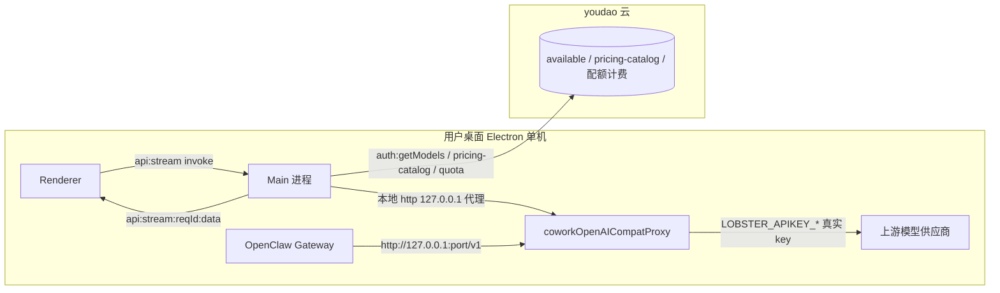
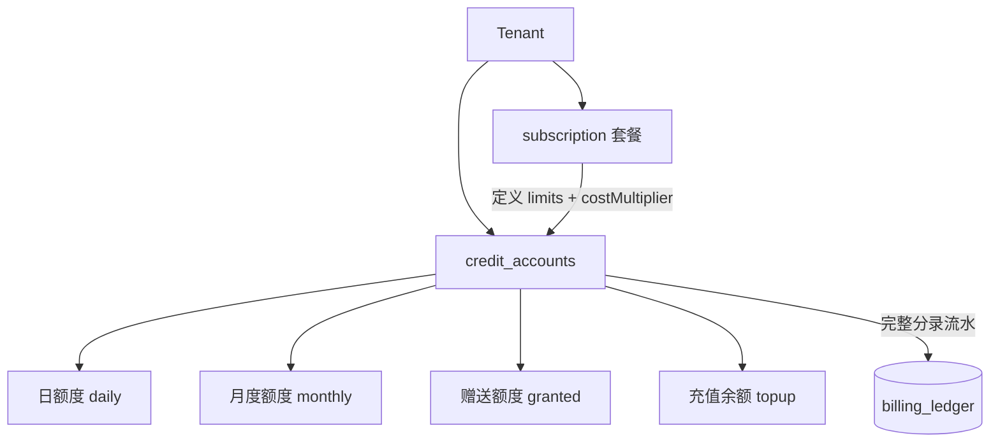
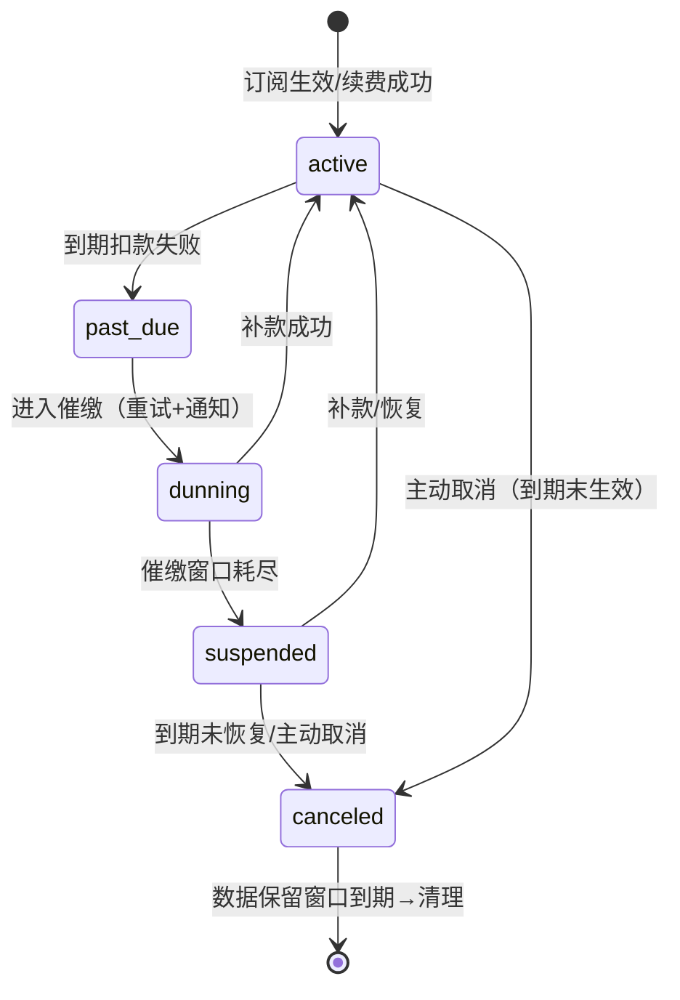
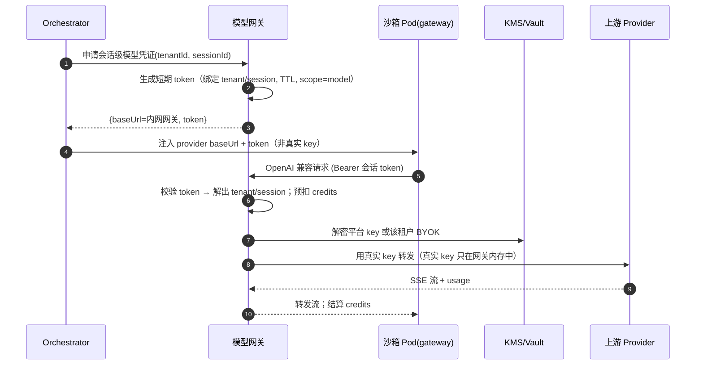
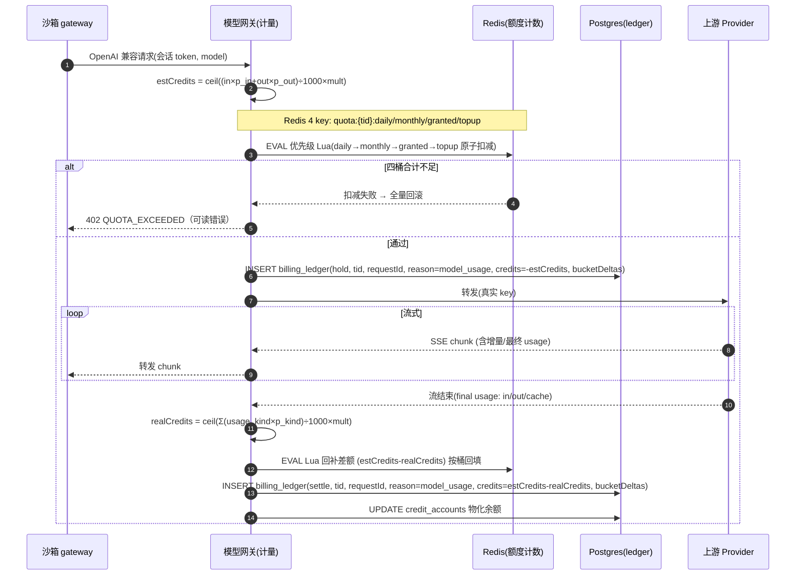
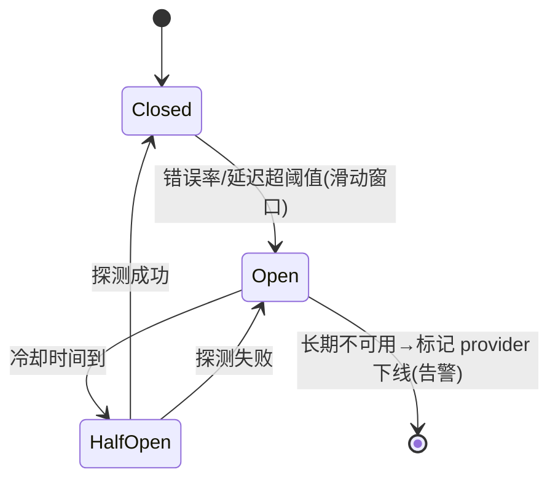
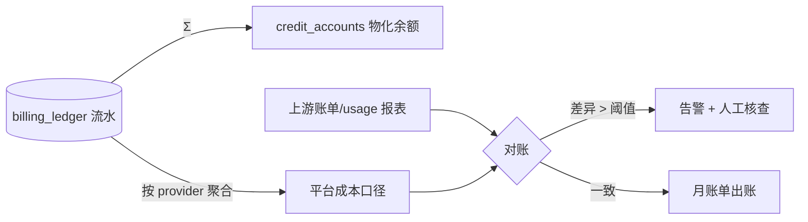

# 模型代理与计费

> 本文档定义 LobsterAI SaaS 化后的**模型网关（Model Gateway）/ ASR 代理服务**与**计费/配额子系统**：如何把现状「Electron 主进程里的本地模型代理 + 桌面 ASR 通道 + youdao 云 pricing/配额」重建为自建后端的「统一多 provider 模型网关 + ASR 上游代理 + 额度账户 + 完整 ledger 分录闭环」。适合读者：模型/ASR 网关与计费后端工程师、平台架构师、SRE、财务/成本负责人、安全负责人。
>
> 上游依赖 `02-目标架构与技术选型.md`（整体分层与「模型/ASR 上游出网收敛到网关/代理」硬约束）、`04-后端服务与API设计.md`（ModelProxyModule / AsrModule 归属与 API 契约）、`05-认证与多租户账户.md`（§7 配额归属：计费主体 = 租户）、`07-OpenClaw运行时编排与沙箱隔离.md`（§5.3/§8.4 Pod 不持真实 key、出站经内网、§10 沙箱成本并账）。向下约束 `12-Artifacts与预览改造.md`（HTML share 计费门控）与 `18-风险登记册.md`（R-COST-01/R-VENDOR-01 的技术落点）。**计费/契约关键决策的权威是 `附录C-决策基线与接口契约总纲.md`（D12/C18/C19/§6）；凡本章与附录 C 冲突，以附录 C 为准。**

---

## 0. 本章要解决的核心矛盾

现状的模型调用是「桌面单机、单用户、密钥托管在 youdao 云、计费/配额也在 youdao 云」的形态。SaaS 化后，三件事必须同时成立且彼此耦合：

1. **收敛**：所有模型出网**唯一**经过后端模型网关（沙箱 Pod 不允许直连公网模型 API，见 `07` §8.4）；所有 ASR 上游调用也只能由后端 ASR 代理发起，不能让浏览器或沙箱直连 ASR provider，否则密钥外泄、计费不准、无法审计。
2. **计量与扣费**：每一次模型调用都要产生**可核对**的 token 用量与 credits 扣减，且在调用**之前**能对超额租户门控（预扣），在调用**之后**按真实用量结算（settle）。
3. **多 provider 抽象**：统一 OpenAI 兼容对外接口，内部适配 Anthropic / OpenAI 兼容 / Gemini 等 provider 的协议差异；单一 provider 故障/限流时可切换降级（R-VENDOR-01）。
4. **ASR 转写闭环**：浏览器采音只负责输入，后端 ASR 代理负责 stream ticket、上游转写、partial/final/error 契约、`asr_transcription` ledger 和失败/取消 release。

这四件事的技术落点就是本章。

---

## 1. 现状：主进程本地模型代理

### 1.1 现状事实清单

| 维度 | 现状 | 代码位置 |
|---|---|---|
| 流式代理入口 | `ipcMain.handle('api:stream', …)`，用 `AbortController` 管理，事件经 `api:stream:${requestId}:data/done/error/abort` 回推渲染层 | `src/main/main.ts:9210-9324` |
| 取消 | `ipcMain.handle('api:stream:cancel', requestId)` | `src/main/main.ts:9324` |
| OpenAI 兼容本地代理 | 起本地 `http.createServer`，`listen(0, '127.0.0.1')`，供 gateway 以 `http://127.0.0.1:{port}/v1/...` 回连 | `coworkOpenAICompatProxy.ts:2904-2929` |
| 代理绑定/防护 | `PROXY_BIND_HOST='127.0.0.1'`；**DNS rebinding 防护**：`isAllowedProxyHost()` 校验 Host 头必须是回环地址 | `coworkOpenAICompatProxy.ts:71,137-168,2326-2328` |
| 协议转换（纯逻辑） | OpenAI↔Anthropic/Gemini 消息转换、tool-call 状态机、Gemini schema 清洗 | `coworkOpenAICompatProxy.ts`（2991 行） |
| URL/错误提取工具（纯逻辑） | `buildAnthropicMessagesUrl`、`normalizeGeminiBaseUrl`、`buildGeminiGenerateContentUrl`、`extractApiErrorSnippet`、`extractTextFromAnthropicResponse`、`extractTextFromGeminiResponse` | `coworkModelApi.ts:44-159` |
| 协议判别常量 | `CoworkModelProtocol = { Anthropic, GeminiNative }` | `coworkModelApi.ts:1-6` |
| provider key 注入 | config sync 把 `LOBSTER_APIKEY_{PROVIDER}` 作为 secret env 注入 gateway；provider config 里 `apiKey` 用占位符或 `'proxy-managed'` | `openclawConfigSync.ts:271-276,1607,1630,2613-2615` |
| 模型目录（授权后） | `ipcMain.handle('auth:getModels')` → `GET {server}/api/models/available`（带 auth），返回 `{modelId, modelName, provider, apiFormat, supportsImage, supportsThinking, ...}` | `src/main/main.ts:4829-4884` |
| 定价目录（公开） | `AuthIpcChannel.GetPricingCatalog` → `GET {server}/api/models/pricing-catalog`，返回 `textModels/imageModels/videoModels` | `src/main/main.ts:4788-4827` |
| 媒体模型目录 | `media:getModels(type: 'image'|'video')` | `src/main/main.ts:5225-5249` |
| 配额规范化（纯逻辑） | `normalizeAuthQuota()` 是 **if/else 链**（非并存四桶），判别键优先级 `freeCreditsTotal → monthlyCreditsLimit → dailyCreditsLimit → creditsLimit`，**只产单一** `creditsLimit/Used/Remaining/hasPaidCredits`；字段属**主进程** | `main/authQuota.ts`（见附录 C C19） |
| 配额门控（纯逻辑） | `hasMediaGenerationEntitlement()`：`hasPaidCredits===true` 或 `subscriptionStatus==='active'` | `main/authQuota.ts` |
| 订阅状态枚举 | `AuthSubscriptionStatus` 现状仅 `active`/`free`（本章 §3.5 扩为完整生命周期） | `src/shared/auth/constants.ts` |
| 每模型倍率 | `Model.costMultiplier` 为 **per-model**，前端「积分消耗倍率」直接展示（引入 per-plan 后取值去向见 §3.4） | `renderer/services/auth.ts`（见附录 C C18） |
| chat.send 帧硬限 | 30MB 硬限 / 29.5MB 安全线 | `openclawRuntimeAdapter.ts:123-126` |
| 云后端基址 | `getServerApiBaseUrl()` → `lobsterai-server.youdao.com`（testMode 切 `.inner.`） | `endpoints.ts:29-32` |

### 1.2 现状架构图



关键假设（全部要打破）：
- **key 在本机**：`LOBSTER_APIKEY_*` 真实上游 key 直接注入本地 gateway/代理，出站直连供应商。
- **计费在 youdao 云**：模型目录、定价目录、额度、门控都读 youdao 云，本次要**全部自建重建**。
- **代理是本地 loopback**：靠 `127.0.0.1` 绑定 + Host 校验隔离，SaaS 下换成集群内网 + 租户上下文鉴权。

### 1.3 现状为什么不能直接搬到 Web

| 现状假设 | Web/多租户下为何失效 |
|---|---|
| 真实 key 注入本地进程 | 多租户共享后端，key 不能下发到不可信沙箱 Pod（Pod 假设会被攻破，见 `07`） |
| 出站直连供应商 | 无法统一计量/门控/审计；无法做 provider 故障切换 |
| 单用户额度（youdao 云） | 需按 `tenant_id` 归属额度、并发扣减、跨副本一致 |
| loopback + Host 校验 | 跨网络调用，需 JWT/内网 token + `tenant_id` 授权，而非回环地址 |
| pricing/available 读 youdao | youdao 云本次不再依赖，需自建模型目录服务 |

---

## 2. 目标：统一模型网关服务

### 2.1 目标能力总览

模型网关（对应 `04` 的 **ModelProxyModule**，ASR 对应 **AsrModule**）承担六项职责。**物理部署口径承接 `19`**：PR-0~V5 主线均先作为 `apps/api` 内的 NestJS 逻辑模块随 `lobster-api` 部署；只有 V5/V6 或规模化后有连接数、CPU、故障域、RBAC 或团队所有权的实测证据，并先完成拆分 RFC/ADR 与 Helm/CI 矩阵更新，才允许拆出独立 `apps/modelgw` / `lobster-modelgw`；ASR 不新增独立 deployable，除非 V5/V6 后先做 RFC/ADR。

1. **统一抽象**：对内暴露一套**OpenAI 兼容**接口（沿用现状「gateway 以 OpenAI 兼容协议回连代理」的契约），对外适配 Anthropic / OpenAI 兼容 / Gemini。
2. **协议转换**：复用现状纯逻辑（`coworkOpenAICompatProxy.ts` 的转换/状态机、`coworkModelApi.ts` 的 URL/错误工具），把「本地 http server 外壳」重写为服务端 HTTP 处理器。
3. **流式转发**：上游 SSE → 网关 → 沙箱 Pod → Cowork → 前端 WS（`api:stream:*` / `cowork:stream:*` 语义不变，见 `04` §5.3）。
4. **密钥托管与注入**：平台托管 key 与用户 BYOK（§4），Pod 不持有真实上游 key（见 `07` §5.3/§5.4）。
5. **计量与扣费**：`hold/settle/release` 分录闭环（§5）、多层熔断（§6）、用量流水与对账（§8）。
6. **语音 ASR 代理**：承接 `13` §4.6 的 Web 降级替代，浏览器采音经后端 ASR stream 转写；上游凭据、限流、计量和审计复用本章模型网关/计费基座，但 REST/WS 契约单独归到 `/api/v1/asr/*`，不得混进 `/api/v1/model/stream`。

### 2.2 目标组件图


### 2.3 现状 → 目标 映射

| 现状 | 目标 | 说明 |
|---|---|---|
| `api:fetch` | `POST /api/v1/model/proxy` | 非流式模型请求代理，和流式路径共享鉴权、配额预扣/结算、审计与 provider adapter |
| `api:stream` IPC + `api:stream:${reqId}:*` send | `POST /api/v1/model/stream` + WS `apiStreamChunk/apiStreamDone/apiStreamError/apiStreamAbort`（见 `04` §6.4） | 参数化 `requestId` 语义保留 |
| `api:stream:cancel` | `POST /api/v1/model/stream/{requestId}/abort` | 取消映射 `AbortController` |
| `get-api-config` / `check-api-config` / `save-api-config` | `GET /api/v1/model/config`、`POST /api/v1/model/config/check`、`PUT /api/v1/model/config` | 旧桥模型配置兼容入口；承接租户级 provider 默认项、模型偏好与密钥配置状态。响应只能返回脱敏状态；写入的密钥材料必须归一到 BYOK/secref 存储（同 §4 / `14`），不得另建并行密钥库 |
| 本地 `http.createServer` + `127.0.0.1` + Host 校验 | 服务端 HTTP 处理器 + JWT/会话 token 鉴权 + `tenant_id` 授权 | loopback 隔离 → 网络+身份隔离 |
| `LOBSTER_APIKEY_*` 注入 gateway | Pod 不持真实 key；gateway baseUrl 指向内网网关，凭**会话级短期 token** | 见 `07` §5.4 |
| `auth:getModels`（youdao `available`） | 自建**模型目录服务** `GET /api/v1/models` | §7 |
| `GetPricingCatalog`（youdao `pricing-catalog`） | 登录后 pricing-catalog 兼容视图 `GET /api/v1/pricing/models`（由模型目录 pricing 字段适配旧形状） | §7.3 |
| `media:getModels` | 模型目录 `GET /api/v1/models?kind=image\|video` 过滤 | §7 |
| youdao 配额（`normalizeAuthQuota`/`hasMediaGenerationEntitlement`） | 自建**额度账户 + ledger 分录闭环**（挂租户） | §3/§5 |
| 30MB chat.send 硬限 | 保留（BFF 层 `413` 拦截，见 `04` §6.4） | 不变 |
| `asr:realtime:createSession` | `POST /api/v1/asr/sessions` + ASR WS stream | 浏览器 `MediaRecorder` 采音，后端代理上游 ASR；partial/final/error 事件入 AsyncAPI，计费 reason=`asr_transcription` |

### 2.4 强制路径：沙箱不可绕过模型网关

模型网关不是“建议调用路径”，而是生产安全与计费红线。必须同时落三层控制：

| 层 | 控制 | 验收 |
|---|---|---|
| 网络层 | sandbox namespace `NetworkPolicy` 默认拒绝出站；模型调用只允许经**模型 token 代理 / 模型网关**，同时按附录 C D8 显式放行 kube-dns、Cowork AskUser、Media、MCP bridge 回调与审计 egress-proxy。Pod 不直连对象存储或 provider 公网域名；对象存储读写由文件/Artifact 服务或签名 URL 路径承接 | Pod 内 curl OpenAI/Anthropic/Gemini 公网域名失败并产生审计；D8 白名单缺项/越权项由 NetworkPolicy 测试阻断 |
| 配置层 | OpenClaw `openclaw.json` 中所有模型 `baseUrl` 指向内网模型网关；沙箱内不注入真实 provider key | Pod 环境变量、config、workspace 均搜不到真实上游 key |
| 应用层 | 模型网关每次请求校验短期 model token，不只校验签名，还要查 tenant/session/model/budget/撤销状态 | 篡改 sessionId/modelId/tenantId 或复用 token 均失败 |

短期 model token 建议字段：

```jsonc
{
  "tid": "tenant uuid",
  "sid": "session uuid",
  "runtimePodId": "pod name/uid",
  "allowedModels": ["claude-...", "gpt-..."],
  "maxCredits": 5000,
  "requestBudget": { "maxInputTokens": 200000, "maxOutputTokens": 16000 },
  "exp": 1760000000,
  "jti": "one-time-or-revocable-id"
}
```

> 短期 model token 权威语义见附录 C D12 / §6：**token 签名**（内含 `tid/sid/jti/maxCredits/exp`）；**`jti` 撤销名单存 Redis**（登出/会话结束/密钥轮换即失效）；`maxCredits` 是该 token **会话累计扣费上限**（越过即拒新请求）。

模型网关处理每个请求时必须：

1. 验签并检查 `exp` 与 **Redis 中的 `jti` 撤销状态**。
2. 用请求里的 `sessionId/modelId` 与 token scope 比对，不允许沙箱自报其它租户或会话。
3. 调用计费服务做 `hold` 预扣，额度不足直接拒绝，不发上游请求。
4. 将 `requestId`、`tenantId`、`sessionId`、`modelId`、provider、token `jti` 写入审计和 ledger，支持重复请求幂等。
5. 流结束、取消、超时、provider 未返回 usage 时，都进入 settle/release 流程，不能留下永久预扣。

### 2.5 ASR 代理归属（GA 主线降级替代）

语音输入在 Web 下不是桌面 `asr:*` 通道的原样搬迁，而是 `13` §4.6 定义的降级替代：浏览器负责 `getUserMedia` / `MediaRecorder` 采音，后端负责 ASR 供应商代理、转写流、限流、审计和计费。本章是 ASR 上游与账务的归口；`04` 只负责把 `AsrModule` 放进 `apps/api` 的逻辑模块边界，附录 A 负责 IPC→REST/WS 映射。

- **契约**：`POST /api/v1/asr/sessions` 创建 ASR 会话，返回 `asrSessionId`、短期 `streamTicket`、过期时间和推荐编码；音频上传与 partial/final/error 回传走 `wss /api/v1/asr/sessions/{asrSessionId}/stream`，必须进入 AsyncAPI。它不是 Cowork `cowork:stream:*` / `api:stream:*` 的 `StreamEnvelope` 事件总线，也不得临时复用 `/api/v1/model/stream`。
- **鉴权与隔离**：create session 用 access token 校验租户/用户；stream ticket 只能绑定一个 `tenantId/userId/asrSessionId`，TTL 30-60 秒、一次性消费，跨租户或过期统一失败且不泄漏会话存在性。
- **计费**：若上游按音频秒数、字符数或音频 token 计费，统一折算为 credits，写入 `billing_ledger.reason='asr_transcription'`，`entry_type` 仍用 `hold/settle/release`；若 GA 初期使用内部免费 ASR，也必须写 0 credits usage/audit 记录，避免后续补计费时缺少对账基线。
- **范围边界**：V1-V6 GA 只保证“可用”的实时转写；端到端低延迟增强、更多编码、说话人分离、ASR 模型选择 UI 属 GA 后续。若未来暴露 ASR 模型目录，再扩展 `GET /api/v1/models?kind=audio`，不得在本轮偷偷加第二套 model catalog。

---

## 3. 计费模型：额度账户与套餐

> 计费主体 = **租户**（`05` §7）。所有额度、扣费、门控都按 `tenant_id` 结算；JWT 冗余携带 `plan` 供快速门控，但**权威额度以计费服务实时结算为准**。

### 3.1 credits 抽象

统一用 **credits（额度点数）** 作为内部计费货币，屏蔽不同 provider/模型的原始美元单价差异：

```
credits(一次调用) = ceil( Σ_over_kind( tokens_kind × unit_price_credits_kind(model) ) ÷ 1000 × costMultiplier(plan, model) )
```

- **量纲**：`unit_price_credits_kind` 是 **credits / 1K token**（目录列 `price_input/price_output/...` 的口径），故必须 `÷1000` 再乘倍率——**修正此前公式漏 `÷1000` 造成的 1000× 放大**（见附录 C D12 / §6）。
- `kind ∈ { input, output, cache_read, cache_write }`（区分缓存读/写，Anthropic prompt caching 与 Gemini explicit cache 单价不同，呼应现状 `explicitContextCache` 字段，`main.ts:4854`）。
- `unit_price_credits_kind(model)`：模型目录里每模型、每 kind 的 credits 单价（由上游美元价 × 平台汇率折算，见 §7）。
- `costMultiplier(plan, model)`：**成本倍率**。平台在原始成本上叠加毛利/贴现：免费套餐可 >1（加价），企业套餐可折扣；也可用于「某模型限时提价/促销」。**权威表在 §3.4，per-model 与 per-plan 的叠加顺序与前端取值来源见 §3.4。**

### 3.2 额度账户模型（三类额度承接现状）

**四桶模型（日/月/赠送/充值）为权威**（见附录 C D12 / §6）：Redis 侧用 **4 个 key**（或一 hash 的 4 字段）分桶计数，跨桶按优先级 Lua 原子扣减（§5.2/§5.3）；**§5.2 早期示意的单计数器 `t:{tid}:credits` 作废**。现状 `normalizeAuthQuota`（`main/authQuota.ts`）是 if/else 链、**只产单一 `creditsLimit`**，与此处四桶并存语义不同——因此**「前端零改」不成立**（见附录 C C19、§9.1）。四桶承接现状字段并迁移为**租户级额度账户**，用一张流水账（ledger）表达：

| 额度类型 | 现状字段 | 目标语义 | 重置周期 |
|---|---|---|---|
| 赠送额度 | `freeCreditsTotal/Used` | 一次性赠送（注册/活动），用完不补 | 不重置 |
| 月度额度 | `monthlyCreditsLimit/Used` | 套餐每月配额 | 每计费周期重置 |
| 日额度 | `dailyCreditsLimit/Used` | 免费/防滥用日上限 | 每日 UTC/租户时区重置 |
| 充值余额 | （新增 `topup` 桶，`hasPaidCredits` 仅作兼容布尔） | 按量付费预充值，可累积 | 不重置 |

扣减优先级（可配置，默认）：`日额度 → 月度额度 → 赠送额度 → 充值余额`（先耗易失效的）。任一必需额度不足即门控。



### 3.3 数据模型（Prisma，多租户，落表见 `06`）

```prisma
model CreditAccount {
  id            String  @id @default(uuid()) @db.Uuid
  tenantId      String  @map("tenant_id") @db.Uuid
  dailyLimit    Decimal @default(0) @map("daily_limit") @db.Decimal(20, 6)
  dailyBalance Decimal @default(0) @map("daily_balance") @db.Decimal(20, 6)
  monthlyLimit  Decimal @default(0) @map("monthly_limit") @db.Decimal(20, 6)
  monthlyBalance Decimal @default(0) @map("monthly_balance") @db.Decimal(20, 6)
  grantedTotal  Decimal @default(0) @map("granted_total") @db.Decimal(20, 6)
  grantedBalance Decimal @default(0) @map("granted_balance") @db.Decimal(20, 6)
  topupBalance Decimal @default(0) @map("topup_balance") @db.Decimal(20, 6) // 充值余额 topup 桶
  periodStart   DateTime @map("period_start")
  updatedAt     DateTime @updatedAt @map("updated_at")
  @@unique([tenantId])
  @@map("credit_accounts")
}

// 只增不改的流水账（对账/审计权威来源）
model BillingLedger {
  id           String   @id @default(uuid()) @db.Uuid
  tenantId     String   @map("tenant_id") @db.Uuid
  sessionId    String?  @map("session_id") @db.Uuid
  requestId    String   @map("request_id")     // 幂等键的一部分；由服务端签发，不复用客户端值
  entryType    String   @map("entry_type")      // hold | settle | release | refund | grant | topup | adjust
  reason       String   @map("reason")          // model_usage | media_generation | payment_topup | usage_correction | payment_refund | chargeback | manual_adjust | seat_proration | sandbox_seconds | egress_bytes | workspace_bytes ...
  credits      Decimal  @db.Decimal(20, 6)      // 有符号账户变动：负=扣减/占用，正=入账/释放/返还
  bucketDeltas Json     @map("bucket_deltas")   // {daily, monthly, granted, topup} 有符号分摊，Σ=credits
  model        String?
  provider     String?
  tokensInput  Int?     @map("tokens_input")
  tokensOutput Int?     @map("tokens_output")
  tokensCacheRead  Int? @map("tokens_cache_read")
  tokensCacheWrite Int? @map("tokens_cache_write")
  costMultiplier   Float? @map("cost_multiplier")
  createdAt    DateTime @default(now()) @map("created_at")
  @@index([tenantId, createdAt])
  @@unique([tenantId, requestId, entryType, reason]) // 幂等：含 tenant_id，允许同请求同 entryType 的多来源分录
  @@map("billing_ledger")
}
```

- `credit_accounts` 是四桶**当前可用余额**的物化快照：`dailyBalance/monthlyBalance/grantedBalance/topupBalance` 与 Redis 四桶同号，均按 `bucketDeltas` 直接加总更新；`dailyLimit/monthlyLimit/grantedTotal` 只用于周期重置、展示和校验，`dailyUsed/monthlyUsed/grantedUsed` 不落表，需从 ledger 或 `limit/total - balance` 派生给旧 API/报表。
- `billing_ledger` 是**不可变追加流水**，账户余额 = 初始 + Σledger（或以 `credit_accounts` 做物化快照 + 定期对账，见 §8），`credits` 一律按账户变动记号：扣减/占用为负，入账/释放/返还为正；`bucketDeltas` 记录四桶分摊，ΣbucketDeltas 必须等于 `credits`，用于复盘每个桶的余额。`refund` entryType 必须结合 `reason` 判读：`usage_correction` 是用量迟到/多扣修正（通常正向返还），`payment_refund` / `chargeback` 是支付退款/拒付 clawback（负向冲销已入账 credits），不得只靠 entryType 推断正负号。
- **幂等唯一键 = `(tenant_id, request_id, entry_type, reason)`**（见附录 C D12 / §6）：保证「同一次调用的预扣/结算/释放」幂等，**且含 `tenant_id` 以防跨租户碰撞**；同一业务请求若需要写多条同 `entryType` 分录（例如模型 usage 与沙箱成本都为 `settle`，或不同来源的 `refund`），必须用稳定 `reason` 区分；`request_id` 由**服务端签发**（不复用客户端上报值，避免重放白嫖），配合 `04` §4.5 的 `Idempotency-Key`。

### 3.4 套餐与 costMultiplier

```jsonc
// plan 定义（存 PG plans 表；JWT 只带 plan id 供快速门控）
{
  "id": "standard",
  "displayNameKey": "plan.standard.name",      // i18n key，zh/en 见 i18n 词典
  "limits": {
    "monthlyCredits": 500000,
    "dailyCredits": 50000,
    "maxConcurrentSessions": 5,                // 与 07 §6.2 并发 Pod 对齐
    "maxConcurrentModelCalls": 10,
    "mediaGeneration": true                    // 承接 hasMediaGenerationEntitlement
  },
  "costMultiplier": { "default": 1.0, "claude-opus-*": 1.2 },  // 按模型覆盖
  "byokAllowed": true
}
```

- 免费套餐 `mediaGeneration=false` 对应现状 `hasMediaGenerationEntitlement` 的 `active`/`hasPaidCredits` 门控（`main/authQuota.ts`）。
- `costMultiplier` 支持 `default` + 按模型 glob 覆盖，运营可调（灰度/促销），变更走审计。
- **per-model 与 per-plan 的关系（见附录 C C18 / D12）**：`costMultiplier` **现状是 per-model**（`renderer/services/auth.ts` 的 `Model.costMultiplier`，前端「积分消耗倍率」直接读它展示）。本章引入的是 **per-plan** 覆盖表，二者**不能都当权威**——落地口径：**目录基础单价（§7）× per-model 目录倍率 → 得到「模型级 credits 单价」，再乘 per-plan 倍率（本表）**为最终扣费倍率；即计费公式 `costMultiplier(plan, model) = perModel(model) × perPlan(plan, model)`。前端展示的「积分消耗倍率」取值来源需相应改为 **`GET /api/v1/models` 下发的、已合入 per-model 的模型级单价 / 有效倍率**（不再直接读旧 `Model.costMultiplier`），**故「前端零改」不成立**。
- 席位模型（organization 租户）：`membership` 计入席位，套餐限制成员数与并发（`05` §7）。

### 3.5 订阅生命周期状态机（对应附录 C §6）

现状 `AuthSubscriptionStatus` 仅 `active`/`free`，无法表达支付失败、催缴、暂停、退款等真实计费态。GA 需把订阅扩为完整生命周期状态机，并把状态迁移与额度门控 / 出账 / 数据保留联动：



- **枚举扩展**：`AuthSubscriptionStatus`（`src/shared/auth/constants.ts`）从 `active`/`free` 扩至含 `past_due`/`dunning`/`suspended`/`canceled`（至少补 `past_due`、`canceled`）；`hasMediaGenerationEntitlement` 等门控只对 `active` 放行，`past_due`/`dunning` 期按策略降级（只读/限额），`suspended`/`canceled` 拒绝新调用。
- **退款 / 拒付 clawback**：支付退款/拒付走 `billing_ledger(entryType='refund', reason='payment_refund'|'chargeback')` 分录做 **clawback**，`credits` 与 `bucketDeltas` 均为负向冲销已入账 credits，允许账户转负并在下次门控要求补足；这与 usage missing/迟到 usage 的 `refund(reason='usage_correction')` 正向返还不是同一语义，但同表对账（§8）。
- **数据保留窗口**：`canceled` 后进入**数据保留窗口**（工作区/流水/产物按合规期限保留，窗口内可恢复；到期硬清理），窗口长度按套餐与地区合规配置，与 `06` 软删/清理策略对齐。
- 字段级 schema（状态、退款分录、保留窗）以**附录 C §6** 为权威，本节不复制。

---

## 4. 密钥管理：平台托管 vs BYOK

### 4.1 两种密钥来源

| 维度 | 平台托管 key（默认） | 用户自带 BYOK |
|---|---|---|
| 归属 | 平台，跨租户共享池（多 key 轮换/冗余） | 单租户私有 |
| 存储 | KMS 加密，仅网关进程可解密 | 信封加密（KMS 数据密钥 + 密文存 PG），按 `tenant_id` 隔离 |
| 计费 | 走平台 credits 扣费 | 可配置：仅计量不扣 credits（用户自付上游），或仍收平台服务费倍率 |
| 适用 | 大多数租户 | 企业/合规租户想用自己账户与额度 |
| 密钥可见性 | 沙箱 Pod **永不可见** | 沙箱 Pod **永不可见**（同样只在网关解密使用） |

### 4.2 核心原则：Pod 永不持有真实上游 key

呼应 `07` §5.3/§5.4：现状 `LOBSTER_APIKEY_*` 注入 gateway，SaaS 下**删除**这一注入。gateway 的 provider `baseUrl` 指向**内网模型网关**，`apiKey` 用**会话级短期凭证**（沿用现状 `apiKey: 'proxy-managed'` 占位思路，`openclawConfigSync.ts:1607,1630`，但把「本地 loopback 代理」换成「内网网关 + token」）。



### 4.3 BYOK 存储与注入

- **信封加密**：`data_key = KMS.generateDataKey()`；`ciphertext = AES-256-GCM(user_key, data_key)`；PG 存 `{encrypted_data_key, ciphertext, iv, tag, provider, tenant_id, key_version}`。网关用时向 KMS 解 `data_key` 再解 `user_key`，**明文只驻网关进程内存，不落盘、不进日志**。
- **隔离**：BYOK 记录带 `tenant_id`，Prisma tenant extension + RLS 兜底（`05` §6），跨租户读 BYOK 返回 404。
- **校验**：录入时做一次最小探测调用（验证 key 有效 + 权限），失败即拒并给可读错误（复用 `extractApiErrorSnippet`，`coworkModelApi.ts:87`）。
- **轮换/吊销**：用户可轮换 BYOK（`key_version` 自增，旧密文保留供审计）；平台 key 池支持多 key 轮换（某 key 被限流/失效时切下一个，见 §6.3）。

BYOK 落表（字段权威见附录 C §6，此处对齐 `@@unique([tenantId, provider])` + `keyVersion`）：

```prisma
model ByokKey {
  id         String   @id @default(uuid()) @db.Uuid
  tenantId   String   @map("tenant_id") @db.Uuid
  provider   String                              // anthropic | openai_compat | gemini | ...
  keyCipher  Bytes    @map("key_cipher")          // KMS 信封加密密文（含 data key/iv/tag）
  keyVersion Int      @default(1) @map("key_version")
  createdAt  DateTime @default(now()) @map("created_at")
  @@unique([tenantId, provider])                  // 每租户每 provider 一条（轮换用 keyVersion 表达）
  @@map("byok_keys")
}
```

### 4.4 第三方 OAuth 代持（GA 后续，非 V1-V6 GA 主线范围）

**V1-V6 GA 主线明确只支持两种密钥来源**：平台托管 key（§4.1 默认）与用户自带 **BYOK API key**（§4.3）。**不含**第三方模型账号的 OAuth device-code 代持——即现状 `github-copilot:{request-device-code,poll-for-token,refresh-token,cancel-polling,sign-out}` 与 `openai-codex-oauth:{start,cancel,logout,status}`（见 `01`）这类「用用户的 GitHub Copilot / OpenAI Codex 账号做 device-code 授权、平台代持凭据」的能力，**列为 GA 后续**（口径与 `01`、`13`、`附录A-IPC通道与接口映射.md` 一致）。

现状 device-code 流程是**桌面本地代持**（token 存本机），SaaS 化到 GA 后续阶段需在后端补齐三点：

- **按租户加密存储**：device-code 换到的 access/refresh token 以信封加密（同 §4.3 BYOK 模式）按 `tenant_id`（或 `user_id`）落库，明文只驻网关内存、不落盘不进日志。
- **服务端刷新**：refresh token 由后端在过期前自动刷新（对应现状 `refresh-token`），失败降级为要求用户重新授权；轮询/授权态经服务端而非本机。
- **隔离**：代持凭据严格按租户/用户隔离（RLS + `tenant_id`），与平台池、BYOK 三者互不串用；一个租户的第三方账号故障不影响他人（同 §6.3 BYOK 隔离故障原则）。

在 GA 后续落地前，需要 Copilot/Codex 账号能力的用户走 **BYOK API key** 路径（若上游提供 key 形式）或使用平台托管 key。

---

## 5. 预扣（pre-authorize）+ 结算（settle）闭环

计费的核心难点：模型调用是**流式、时长不定、token 事前未知**。方案：调用前**预扣估算额度**（门控 + 占位），调用后按**真实 usage 结算**（多退少补），异常时**释放**。

### 5.1 三态流水

| 阶段 | ledger entryType | 动作 |
|---|---|---|
| 预扣 | `hold` | 按字段级公式估算 `holdCredits = ceil((maxInputTokens_est × price_input + maxOutputTokens_est × price_output) ÷ 1000 × costMultiplier)`（`price_*` 为 credits/1K token，量纲同 §3.1，**须 `÷1000`**）；在 Redis **四桶按优先级 Lua 原子扣减**（§5.3），写 `hold` 流水 `credits=-holdCredits`（占用/扣减），`bucketDeltas` 记录各桶负向扣减 |
| 结算 | `settle` | 流结束拿到真实 usage，算 `realCredits`；写 `settle` **差额**流水 `credits=holdCredits-realCredits`（真实<预扣为正数返还，真实>预扣为负数追扣/记欠，等于 0 也可写审计记录），Redis 同步补差，`bucketDeltas` 记录返还或追扣落桶 |
| 释放 | `release` | 调用失败/取消/上游 4xx 未产生计费 usage → 写 `release` 流水 `credits=+remainingHeldCredits` 冲销预扣，`bucketDeltas` 必须按原 hold 的桶分布反向释放 |

### 5.2 时序



### 5.3 关键设计点

- **原子门控**：Redis **4 key（`quota:{tid}:daily/monthly/granted/topup`）+ 优先级 Lua**「检查+按桶扣减+跨桶补差」一步原子完成（见附录 C D12 / §6），避免并发超发（多副本网关同时扣同一租户）；单计数器方案作废。
- **usage 来源**：优先用上游返回的最终 usage（Anthropic `usage`、OpenAI `usage`、Gemini `usageMetadata`）；缺失时用 tokenizer 本地估算并标记 `estimated=true` 供对账修正。
- **幂等**：`(tenant_id, request_id, entry_type, reason)` 唯一约束（§3.3）保证网络重试/补发不重复扣费，同时允许同一 `request_id` 下按 `reason` 拆出模型、沙箱、媒体或退款等多来源分录；**`request_id` 由服务端签发**（不复用客户端上报值，避免跨租户碰撞与重放白嫖），配合 `04` §4.5 `Idempotency-Key`。
- **流中断**：客户端取消（`POST /api/v1/model/stream/{requestId}/abort`）→ 已产出部分 output 仍按真实 usage 结算，未产出则 `release`。
- **欠额处理**：真实>预扣且额度已空 → 允许本次完成（不半途掐断），记为**欠额（负余额）**，下次调用前门控要求补足或降级。

### 5.4 与沙箱成本并账

`07` §10.2 的沙箱运行成本（`sandbox_pod_seconds`、`egress_bytes`、`workspace_bytes`）与本章 token credits **合并成一张账单**：`billing_ledger` 写 `entryType=settle` 的非模型条目，`reason=sandbox_seconds|egress_bytes|workspace_bytes` 区分成本来源，统一按 credits 记账，对账口径一致（见 §8）。

### 5.5 媒体生成端到端（异步任务的计量与门控）

媒体生成（图/视频）与文本流不同：它是**异步任务**（提交→轮询→出结果），现状经 `media:getModels`（`main.ts:5225`）、`media:getTaskStatus`（`main.ts:5254`）与 `cowork:media:cancel`（`main.ts:6734`）三个入口，前端用 `cowork:media:statusPollUpdate`（`MediaStatusPollUpdate`，`src/shared/cowork/constants.ts:8`）异步轮询进度（`MediaPollingIndicator.tsx`）。SaaS 下的完整链路：

1. **门控（调用前）**：`hasMediaGenerationEntitlement()`（现状 `main/authQuota.ts`）迁移为**多租户门控**——按 `tenant_id` 读套餐 `limits.mediaGeneration`（§3.4）+ 额度账户（§3.2）判定；不满足直接 `SUBSCRIPTION_REQUIRED`/`QUOTA_EXCEEDED`，不提交上游任务。
2. **提交 + 预扣**：提交媒体任务时按「该媒体模型固定/估算 credits」写 `hold(reason=media_generation)` 流水（§5.1），Redis 原子扣减（§5.3）；预扣失败即门控。
3. **媒体任务存储**：任务态落 PG（新增 `media_tasks` 表），`task_id` 统一为 **`text`**（避免 int/uuid 混用），`request_id` 复用 §3.3 幂等键，`upstream_task_id` 承接现状上游任务 id（`MediaPollingIndicator` 的 `upstreamTaskId`）。字段权威见附录 C §6，骨架如下：

```prisma
model MediaTask {
  id            String   @id @default(uuid()) @db.Uuid
  taskId        String   @map("task_id")             // 对外统一 text 类型（前端/轮询用）
  tenantId      String   @map("tenant_id") @db.Uuid
  sessionId     String?  @map("session_id") @db.Uuid
  requestId     String   @map("request_id")          // = §3.3 幂等键（服务端签发）
  type          String                                // image | video（媒体计价 kind）
  provider      String
  model         String
  status        String                                // pending | running | succeeded | failed | canceled
  upstreamTaskId String? @map("upstream_task_id")     // 承接现状上游任务 id
  resultKey     String?  @map("result_key")           // 对象存储 object key（不回传字节流）
  credits       Int?                                   // 结算 credits
  createdAt     DateTime @default(now()) @map("created_at")
  @@unique([tenantId, taskId])                         // 对外任务 id 只要求租户内唯一，避免跨租户碰撞
  @@unique([tenantId, requestId])
  @@map("media_tasks")
}
```

媒体计价单价不走 token 公式，改由模型目录的**媒体计价列**（`price_media_*`，见 §7.2）取「固定 / per-image / per-second」计价。
4. **异步轮询**：`GET /api/v1/media/tasks/{taskId}` ← `media:getTaskStatus`；`taskId` 是对外 text id，查询必须同时带当前 `tenant_id` 过滤，跨租户 / 不存在统一 404；网关服务端拉上游状态，租户级鉴权（不再是本机轮询），进度经 WS `mediaStatusPollUpdate` 推前端（承接 `cowork:media:statusPollUpdate` 语义）。
5. **结果落对象存储**：产出的图/视频**不回传字节流**，由网关写入对象存储（`08`），`media_tasks.result_key` 记 object key，前端凭**短期签名 URL** 拉取（租户隔离 bucket/前缀，见 `08`/`12`）。
6. **结算**：任务终态（成功/失败）→ 成功按真实 usage/固定价写 `settle(reason=media_generation)`，失败/取消（`cowork:media:cancel`）写 `release(reason=media_generation)` 冲销预扣（§5.1），口径与文本调用一致，并入同一账单（§8）。

---

## 6. 限流与多层熔断

呼应 R-COST-01（硬配额 + 预扣 + 熔断）与 R-VENDOR-01（上游依赖）。熔断分三层，任一层触发都能保护系统。

### 6.1 三层熔断/限流

| 层级 | 触发条件 | 动作 | 实现 |
|---|---|---|---|
| **租户级** | 超月/日额度；异常速率（小时 token 环比 >5×，对齐 `18` 触发信号）；欠额 | 门控新调用（402）；降级到便宜模型；提示升级/充值；异常速率临时熔断该租户 | Redis 令牌桶 + 额度计数 + 异常检测 |
| **provider 级** | 单 provider 429/5xx 比例升高、P95 延迟恶化（`18` R-VENDOR-01 信号） | 打开断路器：暂停路由到该 provider，切换/降级（§6.3） | 每 provider 断路器状态机（closed/open/half-open）存 Redis |
| **全局级** | 日成本超预算 20%（`18` 信号）；全平台 QPS/成本异常 | 全局限速/停止免费额度消耗/告警值班 | 全局预算计数 + Prometheus 告警联动 |

### 6.2 断路器状态机（provider 级）



### 6.3 故障切换与降级

- **多 key 冗余**：平台 key 池每 provider 多 key，单 key 被限流/额度耗尽 → 轮换下一 key（不影响用户）。
- **provider 切换**：同一「逻辑模型」可映射多 provider 实现（如 OpenAI 兼容中转 A/B）；断路器 open 时切备用（模型目录里配 `fallbacks`）。
- **模型降级**：高价模型不可用/租户欠额 → 降级到等价便宜模型（需在模型目录声明降级映射），并在响应元数据标注「已降级」供前端提示。
- **缓存/幂等**：对确定性请求（如标题生成 `generate-session-title`）可缓存结果，减少上游调用（R-VENDOR-01 缓解）。
- **BYOK 隔离故障**：BYOK 租户的上游故障不影响平台池；反之亦然。

---

## 7. 模型目录服务（替代 pricing catalog / auth:getModels）

### 7.1 目标

把现状读 youdao 的两个端点（`available` `main.ts:4837`、`pricing-catalog` `main.ts:4791`）合并为**自建模型目录服务**，作为「有哪些模型、能力、单价、costMultiplier、可用性、降级链」的**单一权威**。

### 7.2 数据模型

```prisma
model ModelCatalog {
  id                 String  @id                    // 逻辑模型 id（前端展示/选择）
  displayName        String  @map("display_name")
  provider           String                          // anthropic | openai_compat | gemini
  apiFormat          String  @map("api_format")      // 承接现状 apiFormat 字段
  protocol           String                          // CoworkModelProtocol: anthropic | gemini_native | openai
  supportsImage      Boolean @default(false) @map("supports_image")
  supportsThinking   Boolean @default(false) @map("supports_thinking")
  explicitCache      Boolean @default(false) @map("explicit_context_cache")
  contextWindow      Int?    @map("context_window")
  kind               String  @default("text")        // text | image | video（承接 media:getModels）
  priceInput         Int     @map("price_input")      // credits / 1K token（各 kind，计费须 ÷1000）
  priceOutput        Int     @map("price_output")
  priceCacheRead     Int?    @map("price_cache_read")
  priceCacheWrite    Int?    @map("price_cache_write")
  // 媒体计价（kind=image|video 用；文本模型留空）——承接 media_tasks（§5.5）
  mediaPriceMode     String? @map("media_price_mode") // fixed | per_image | per_second
  priceMediaFixed    Int?    @map("price_media_fixed")     // 固定价 credits/任务
  priceMediaPerImage Int?    @map("price_media_per_image") // credits/张
  priceMediaPerSecond Int?   @map("price_media_per_second")// credits/秒（视频）
  costMultiplier     Float?  @map("cost_multiplier")   // per-model 倍率（现状口径，见 §3.4 与 per-plan 叠加）
  fallbacks          Json?                            // 降级链: [modelId...]
  enabled            Boolean @default(true)
  minPlan            String? @map("min_plan")         // 该模型所需最低套餐
  @@map("model_catalog")
}
```

> 单价用 credits（非美元），由「上游美元价 × 平台汇率」在运营侧折算入库，屏蔽币种/供应商差异；`costMultiplier` 在计费时叠加（§3.1），目录只存基础单价。

### 7.3 API

```
GET /api/v1/models?kind=text|image|video      # 目录（按租户套餐过滤 minPlan）← auth:getModels + pricing-catalog + media:getModels
GET /api/v1/models/{id}                        # 单模型详情（含单价/能力/降级链）
GET /api/v1/pricing/models?kind=text|image|video # 登录后 pricing-catalog 兼容视图，给旧 auth:getPricingCatalog 桥适配
```

- 目录按**租户套餐**过滤（`minPlan` 高于租户套餐的模型隐藏或标灰），呼应现状「授权后 available」语义，但门控权威在自建计费。
- 目录读多写少，Redis 缓存（`t:{tid}:models` 或全局 + 套餐过滤），运营变更后主动失效（`04` §7.4）。
- **旧桥兼容**：`auth:getPricingCatalog` 不再访问 youdao `pricing-catalog`，而是调 `GET /api/v1/pricing/models`，桥层把模型目录的 pricing 字段适配回旧 `textModels/imageModels/videoModels` 形状。
- **公开定价页**：不复用 `auth:getPricingCatalog`，也不绕过 `04`「`/api/v1/*` 默认鉴权」规则；若需要无需登录的 pricing 视图，另按 public route（建议 `GET /public/pricing/models` 或静态 JSON/CDN）做 RFC/ADR，响应只含公开字段，不含内部 `costMultiplier`、minPlan 过滤细节或租户套餐信息。

---

## 8. 用量流水与对账

### 8.1 用量记录

- 每次调用写入 `billing_ledger`（`hold` + `settle`/`release`），带 `tenant/session/request/model/provider/reason/tokens(各 kind)/credits/bucketDeltas/costMultiplier`。
- 沙箱成本、媒体生成等非 token 计费同样落 ledger（§5.4），统一口径。
- 结构化用量事件同时进可观测（`15`）：`model_call_total{tenant,model,provider,status}`、`model_tokens_total{tenant,kind}`、`model_credits_total{tenant}`，供 Grafana 面板与预算告警。

### 8.2 对账闭环



- **内部对账**：`credit_accounts` 四桶余额（`dailyBalance/monthlyBalance/grantedBalance/topupBalance`）定期与 `Σledger.bucketDeltas` 按桶核对，防物化漂移；旧兼容字段 `creditsUsed`/`dailyUsed` 等只由 ledger/余额派生，不参与对账权威。
- **外部对账**：平台按 ledger 聚合的上游成本 vs 供应商实际账单/usage 报表核对，差异超阈值告警（`18` R-COST-01 残余风险：预扣估算误差 + 上游调价）。
- **计费主体**：账单出到 `tenant`（`05` §7），organization 租户可拆到成员/会话维度（ledger 带 `session_id`，可选 `user_id`）。

### 8.3 验收：计费闭环

> 与 `02` §8「计费闭环」、`07` AC-12 对齐。

- [ ] 每次模型调用产生 `hold` + `settle`/`release` 流水，`(tenant_id, request_id, entry_type, reason)` 幂等（重试不重复扣费；`request_id` 服务端签发，同请求多来源分录以 `reason` 区分）。
- [ ] 真实 usage < 预扣 → `settle` 为正数回补；真实 > 预扣 → `settle` 为负数追扣或记欠，账户余额一致。
- [ ] 额度不足在调用**前**被门控（402 QUOTA_EXCEEDED），不发生上游调用。
- [ ] 调用失败/取消 → `release` 冲销预扣，无净扣费。
- [ ] `credit_accounts` 四桶余额 = 按桶 `Σledger.bucketDeltas`（内部对账零漂移；`*_used` 仅为派生展示值）。
- [ ] ledger 聚合的上游成本可与供应商账单对账（差异可解释）。
- [ ] 沙箱 `sandbox_pod_seconds`/`egress_bytes` 并入同一账单口径（`07` §10.2）。
- [ ] 媒体生成门控等价现状 `hasMediaGenerationEntitlement`（免费套餐拒绝，付费/active 放行）。
- [ ] HTML share 等下游门控错误码（`SubscriptionRequired`/`ActiveShareLimitReached`，见 `12`）由本计费系统统一判定。

### 8.4 运营侧计费闭环（充值 / 出账 / 席位）

§5–§8.3 是**内部计量与对账**；对外还需一条**运营（钱进钱出）闭环**，把 credits 账户接到真实支付与出账：

- **充值 / 支付渠道对接**：支付网关（如 Stripe / 微信支付 / 支付宝）对接，成功回调（webhook）经幂等校验后写 `billing_ledger(entryType=topup, reason=payment_topup, credits=+topupCredits, bucketDeltas.topup=+topupCredits)`（§3.3），增加充值余额（`topupBalance`，§3.2）；支付退款/拒付 webhook 写 `entryType=refund, reason=payment_refund|chargeback, credits<0` 做 clawback。订阅制套餐续费同样由支付回调驱动套餐生效与月度额度重置（`period_start`）。回调必须幂等（防重复入账）且与支付方对账。
- **发票 / 税务出账**：按 §8.2 对账后的月账单为**税务/发票权威口径**，生成发票（含税率、租户抬头/税号），支持不同地区税务规则（如增值税/VAT）；发票与 `billing_ledger` 聚合金额可追溯核对，异常差异走人工核查。
- **organization 租户席位计费**：organization 租户以 `membership`（`05` §7）为**席位计量单位**——活跃成员数 × 席位单价计入订阅账单；套餐 `limits.maxConcurrentSessions`/成员数上限（§3.4）与席位数联动。席位变动（增/删成员）产生按比例（proration）的账单调整，落 `billing_ledger(entryType=adjust, reason=seat_proration)` 并反映到下期发票。席位订阅与按量 credits 消耗（token/媒体/沙箱）在同一账单上分列，口径统一（§8.2）。

### 8.5 单位经济性（unit economics，聚焦小节）

§3–§8.4 保证「算得准、扣得对」；能否**赚钱**取决于单位经济性——每个租户 / 每次调用的**收入 − 真实成本**是否为正。本节只承接口径要点，但**单位经济性不是可后置的无主事项**：V5-E6 付费试点前由 PM/财务 + 计费负责人冻结最小模型（收入桶、成本分摊、毛利率/免费额度烧钱率阈值），V6-E2/V6-E4 复算成本与看板告警，未签收不得扩大付费试点或 GA：

- **成本口径**：单次调用真实成本 = 上游 token 美元成本 + 沙箱运行成本（`sandbox_pod_seconds`/`egress_bytes`/`workspace_bytes`，`07` §10.2）+ 媒体上游成本（§5.5）；均已并入同一 ledger（§5.4），可按 `tenant/session/model` 聚合。
- **收入口径**：credits 售价（充值单价、套餐月费、席位费，§8.4）。**毛利 = credits 售价 − 折回美元的真实成本**；`costMultiplier`（§3.4）是毛利/贴现的直接杠杆。
- **关键指标**：毛利率、每租户 CAC/LTV、免费额度**烧钱率**（赠送桶 `granted` 消耗 vs 转付费率）、重度租户成本尾部（Top-N 租户成本占比）、BYOK 租户仅收服务费的边际。
- **告警联动**：单租户毛利转负、免费额度烧钱率超阈值、单模型加权成本异常 → 接 §6 全局熔断与 `15` 预算告警；促销/`costMultiplier` 调整前用本模型做**盈亏平衡**测算。
- **权威**：完整单位经济性模型（字段、汇率折算、分摊规则）以附录 C §6 计费同源 + `15` 成本面板为准，本节不展开。

> 完整 IPC→REST/WS 映射见 `附录A-IPC通道与接口映射.md`；此处给模型代理/计费相关契约。

## 9. API 与契约

### 9.1 REST

```
# 模型代理（非流式 + 流式，见 04 §6.4）
POST /api/v1/model/proxy                      # 非流式代理 ← api:fetch；同步返回上游响应
POST /api/v1/model/stream                     # 发起，返回 { requestId }
POST /api/v1/model/stream/{requestId}/abort   # 取消 ← api:stream:cancel
GET  /api/v1/model/config                     # 旧桥 get-api-config 兼容：租户模型配置脱敏视图
PUT  /api/v1/model/config                     # 旧桥 save-api-config 兼容：写 provider/model 偏好；密钥归一到 BYOK/secref
POST /api/v1/model/config/check               # 旧桥 check-api-config 兼容：校验 provider/BYOK 连通性
GET  /api/v1/models?kind=text|image|video     # 模型目录（按套餐过滤）
GET  /api/v1/models/{id}                       # 单模型详情
GET  /api/v1/pricing/models?kind=text|image|video # 登录后 pricing-catalog 兼容视图

# 计费/额度
GET  /api/v1/billing/account                   # 当前租户额度账户快照（承接 normalizeAuthQuota 输出形态）
GET  /api/v1/billing/usage?from&to&cursor      # 用量流水（游标分页，04 §4.3）
GET  /api/v1/billing/plan                       # 当前套餐 + limits + costMultiplier（脱敏）
POST /api/v1/billing/byok                       # 录入/轮换 BYOK（校验后信封加密存储）
DELETE /api/v1/billing/byok/{provider}          # 吊销 BYOK

# 语音 ASR（承接 13 §4.6，契约字段见附录 C §3-B）
POST /api/v1/asr/sessions                        # 创建 ASR 会话，返回 asrSessionId + streamTicket
WS   /api/v1/asr/sessions/{asrSessionId}/stream  # MediaRecorder 音频 chunk 上行 + partial/final/error 下行
```

额度账户快照（**兼容**现状 `normalizeAuthQuota` 形态，`main/authQuota.ts`）——注意：现状 `normalizeAuthQuota` 是 if/else 链、**只产单一 `creditsLimit`**，而此处新增 `breakdown` 四桶明细，语义已变，**「前端零改」不成立**（见附录 C C19）；顶层 `creditsLimit/Used/Remaining` 仅作兼容兜底，权威可用额度是四桶 `balance` 之和。兼容字段计算规则固定为：`creditsRemaining = Σbreakdown.*.balance`；`creditsLimit = daily.limit + monthly.limit + granted.total + topup.balance`（topup 无固定 limit，用当前余额参与兼容总额）；`creditsUsed = creditsLimit - creditsRemaining`。前端需改造以消费四桶明细与新订阅态：

```jsonc
// GET /api/v1/billing/account
{
  "data": {
    "planName": "Standard",
    "subscriptionStatus": "active",       // AuthSubscriptionStatus（扩展枚举含 past_due/dunning/suspended/canceled，§3.5）
    "creditsLimit": 570000,
    "creditsUsed": 193456,
    "creditsRemaining": 376544,
    "hasPaidCredits": true,
    "mediaGenerationEntitled": true,       // 承接 hasMediaGenerationEntitlement
    "breakdown": {
      "daily": { "limit": 50000, "balance": 42000, "used": 8000 },
      "monthly": { "limit": 500000, "balance": 334544, "used": 165456 },
      "granted": { "total": 20000, "balance": 0, "used": 20000 },
      "topup": { "balance": 0 }
    }
  }
}
```

### 9.2 WS 帧

沿用 `04` §5.3 的统一信封，模型代理相关：

| WS `type` | 现状 send | data |
|---|---|---|
| `apiStreamChunk` | `api:stream:{reqId}:data` | `{ requestId, chunk }` |
| `apiStreamDone` | `api:stream:{reqId}:done` | `{ requestId }` |
| `apiStreamError` | `api:stream:{reqId}:error` | `{ requestId, error }` |
| `apiStreamAbort` | `api:stream:{reqId}:abort` | `{ requestId, aborted: true }` |
| `quotaChanged`（用户级频道） | `auth:quotaChanged` | `{ account }` — 扣费/额度变化后推送前端刷新 |

ASR stream 使用独立 AsyncAPI channel（见 §2.5），最小帧集：

| WS `type` | 方向 | data |
|---|---|---|
| `asrAudioChunk` | client→server | `{ asrSessionId, chunkBase64, mimeType, sequence }` |
| `asrPartial` | server→client | `{ asrSessionId, text, startMs?, endMs? }` |
| `asrFinal` | server→client | `{ asrSessionId, text, durationMs, usage? }` |
| `asrError` | server→client | `{ asrSessionId, code, messageKey }` |

### 9.3 错误码（归口 `libs/shared/contracts/src/errors.ts`，见 `04` §4.4）

| code | httpStatus | 语义 |
|---|---|---|
| `QUOTA_EXCEEDED` | 402 | 额度不足（预扣门控） |
| `SUBSCRIPTION_REQUIRED` | 402 | 需付费套餐（承接现状 `SubscriptionRequired`，见 `12`） |
| `MODEL_NOT_ALLOWED` | 403 | 模型高于租户套餐 `minPlan` |
| `PAYLOAD_TOO_LARGE` | 413 | 超 30MB chat.send 硬限（`04` §6.4） |
| `PROVIDER_UNAVAILABLE` | 503 | 上游熔断且无可切换（R-VENDOR-01） |
| `RATE_LIMITED` | 429 | 租户/全局限流，带 `Retry-After` |
| `BYOK_INVALID` | 400 | BYOK 校验失败 |

---

## 10. 落地步骤（摘要，详见 `17-分阶段路线图与工作量估算.md`）

| 版本 | 步骤 | 依赖 |
|---|---|---|
| V2/V5 前置 | 抽 `coworkModelApi.ts`/`coworkOpenAICompatProxy.ts` 纯逻辑入 `libs/`（转换/URL/错误工具，`04` §3.2）；服务端 HTTP 处理器替换本地 loopback 外壳 | `04` |
| V5-E1 | 基于 PR-1 已冻结路径实现非流式模型代理 `POST /api/v1/model/proxy`、流式模型代理 `POST /api/v1/model/stream` / `POST /api/v1/model/stream/{requestId}/abort`、旧桥模型配置兼容 `GET/PUT /api/v1/model/config` + `POST /api/v1/model/config/check`、模型目录与详情服务 `GET /api/v1/models` / `GET /api/v1/models/{id}`、登录后 pricing-catalog 兼容视图 `GET /api/v1/pricing/models`、媒体任务状态/取消 REST（`GET /api/v1/media/tasks/{taskId}`、`POST /api/v1/media/tasks/{taskId}/cancel`）、ASR 会话与 stream 契约（`POST /api/v1/asr/sessions`、`WS /api/v1/asr/sessions/{asrSessionId}/stream`）与计费账户/用量/套餐/BYOK REST（`GET /api/v1/billing/account`、`GET /api/v1/billing/usage`、`GET /api/v1/billing/plan`、`POST /api/v1/billing/byok`、`DELETE /api/v1/billing/byok/{provider}`，替代 api:fetch/api:stream/get-api-config/check-api-config/save-api-config/available/pricing-catalog/media:getModels/media:getTaskStatus/cowork:media:cancel/asr:realtime:createSession/auth:getQuota） | `06` |
| V5-E2 | 会话级模型凭证下发；Pod 删除 `LOBSTER_APIKEY_*`，baseUrl 指向内网网关 | `07` §5 |
| V5-E1 | 平台 key KMS 托管 + 网关内解密转发；`credit_accounts`/`billing_ledger` 表 + 完整 ledger 分录闭环 | `06`/`05` |
| V5-E1 | Redis 原子门控 + 三层熔断/限流骨架 | `04` §7 |
| V5-E1 | provider 断路器 + 多 key 轮换 + 故障切换/降级链 | — |
| V5-E1 | BYOK 录入/信封加密/校验/轮换 | `14` |
| V5-E6 / V6-E4 | 用量流水 API + 对账任务 + Grafana 面板/预算告警 | `15` |
| V5-E6 | 沙箱成本并账；套餐/costMultiplier 运营后台；欠额/充值流程 | `07` §10 |

---

## 11. 风险（R-COST-01 / R-VENDOR-01 技术落点）

> 完整登记见 `18-风险登记册.md`；此处给本章技术落点。

| 风险 | 影响 | 本章落点 |
|---|---|---|
| **R-COST-01** 模型/算力成本失控 | 账单指数级增长 | 出网收敛到网关（唯一计费点，§2/`07` §8.4）+ 预扣硬门控（§5.1 Redis 原子）+ 实时用量流水（§8）+ 异常速率/成本熔断（§6 三层）+ 沙箱成本并账（§5.4） |
| **R-VENDOR-01** 上游模型/ASR 供应商限流/涨价/不可用 | 服务中断/毛利受损 | 多 provider 抽象（§2.1）+ provider 断路器（§6.2）+ 多 key 冗余 + 切换/降级链（§6.3）+ 结果缓存 + ASR kill-switch/fallback + costMultiplier 定价缓冲吸收涨价（§3.4） |
| 预扣估算误差 | 少扣/超扣、余额漂移 | usage 优先取上游真实值 + 结算多退少补 + 内部对账（§8.2） |
| 真实 key 泄露到 Pod | 密钥外泄、计费失控 | Pod 永不持真实 key，只用会话短期 token（§4.2/`07` §5.4） |
| BYOK 跨租户泄露 | 数据/凭证泄露 | 信封加密 + `tenant_id` + RLS + 明文只驻网关内存（§4.3/`05` §6） |
| 并发超发额度 | 免费额度被击穿 | Redis Lua 原子「检查+扣减」（§5.3） |
| ledger 重复扣费 / 跨租户碰撞 / 重放白嫖 | 账目错误 | `(tenant_id, request_id, entry_type, reason)` 幂等（`request_id` 服务端签发，`reason` 区分同请求多来源分录）+ `Idempotency-Key`（§3.3/`04` §4.5、附录 C D12） |

---

## 12. 交叉引用

- **计费/契约权威基线（本章多处订正的同源）：`附录C-决策基线与接口契约总纲.md`** —— D12（四桶 + Redis 4-key 优先级 Lua + 量纲 ÷1000 + 幂等键服务端签发）、C18（`costMultiplier` per-model→per-plan）、C19（配额字段归属与「前端零改」不成立）、§6（计费/BYOK/媒体/订阅生命周期 schema）。凡与本章冲突以附录 C 为准。
- 整体分层与「模型/ASR 上游出网收敛到网关/代理」硬约束：`02-目标架构与技术选型.md`
- ModelProxyModule 归属、`api:stream` REST/WS 契约、`libs/shared/contracts/src/errors.ts` 错误码枚举、幂等：`04-后端服务与API设计.md`
- 计费主体=租户、配额归属、JWT `plan` 冗余、席位：`05-认证与多租户账户.md` §7
- `credit_accounts`/`billing_ledger`/`model_catalog` 落表与迁移：`06-数据模型迁移.md`
- Pod 不持真实 key、会话凭证、出站经内网、沙箱成本并账：`07-OpenClaw运行时编排与沙箱隔离.md` §5/§8/§10
- 媒体产出落对象存储、租户隔离 bucket、签名 URL：`08-文件工作区与对象存储.md`
- 现状第三方 OAuth（Copilot/Codex device-code）入口清单：`01-现状架构调研.md`
- 第三方 OAuth 代持列为 GA 后续（V1-V6 GA 主线仅平台托管 key + BYOK）：`13-功能取舍与降级清单.md`
- HTML share 计费门控（`SubscriptionRequired`/`ActiveShareLimitReached`）：`12-Artifacts与预览改造.md`
- 语音输入 / ASR 的 Web 降级路径与 UX：`13-功能取舍与降级清单.md` §4.6、`03-前端与传输层改造.md` §7
- BYOK 加密、密钥管理、审计合规：`14-安全合规与多租户隔离.md`
- 用量指标、预算告警、对账面板：`15-部署运维与可观测性.md`
- R-COST-01 / R-VENDOR-01 完整登记：`18-风险登记册.md`
- IPC→REST/WS 逐条映射（含 `api:stream:*`）：`附录A-IPC通道与接口映射.md`
