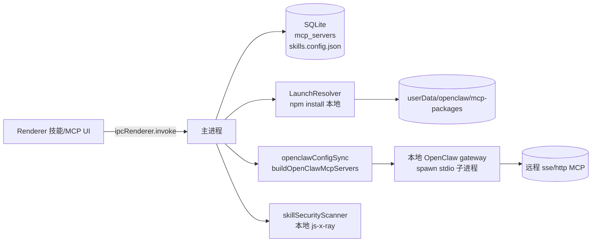
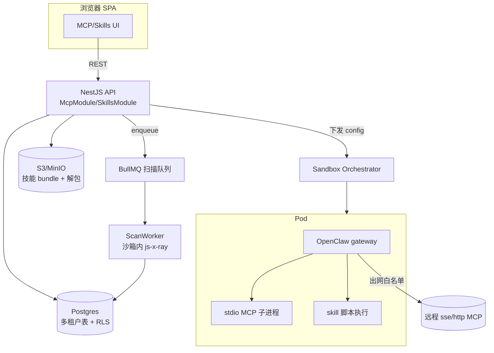
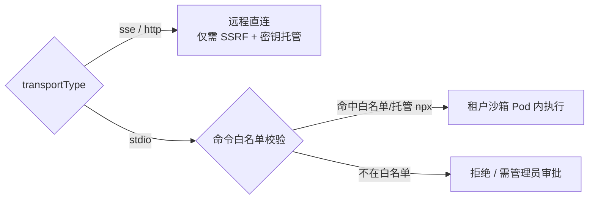
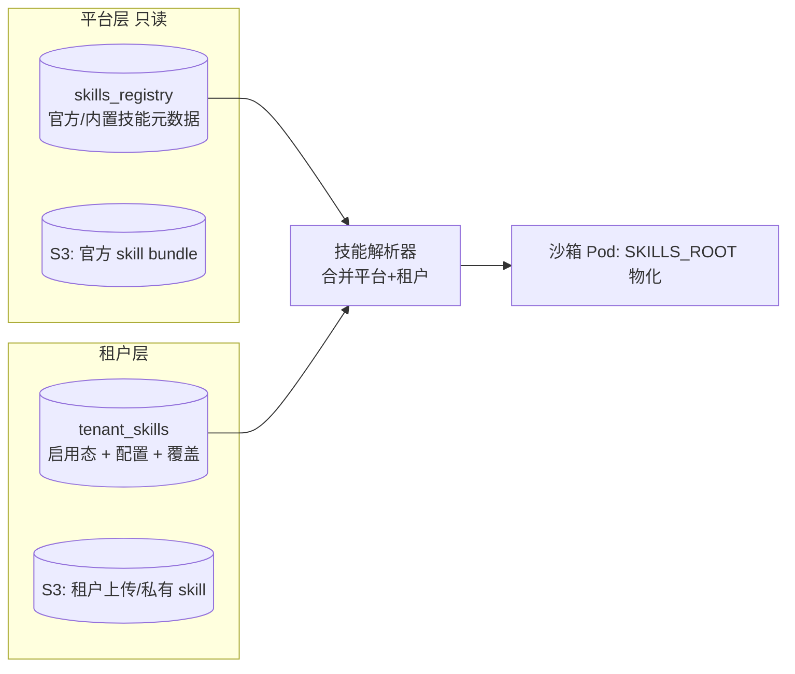
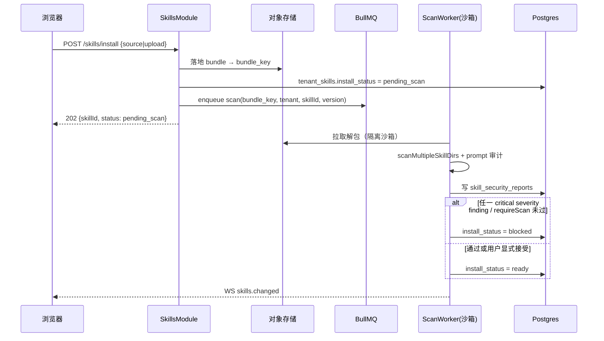
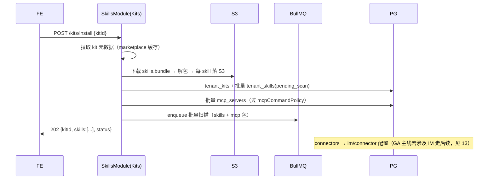

# MCP 与技能（Skills/Kits）改造

> 本文档面向后端/平台工程师与 Agent 运行时负责人，说明在多租户 SaaS 化改造中如何把 LobsterAI 现有的 **MCP 服务器接入**、**Skills 技能系统** 与 **Kits 技能包** 三块能力从"单机 Electron + 本地子进程"迁移为"服务端托管 + 租户隔离 + 对象存储"。读完你应能：拿到多租户数据模型、服务端安全扫描与命令白名单的落地方案、以及沙箱内运行 stdio MCP 与 skill 的编排契约。
>
> 交叉引用：运行时/沙箱编排细节见 `07-OpenClaw运行时编排与沙箱隔离.md`；对象存储与工作区见 `08-文件工作区与对象存储.md`；供应链/多租户隔离的整体安全策略见 `14-安全合规与多租户隔离.md`；数据表迁移总纲见 `06-数据模型迁移.md`；IPC→REST/WS 映射见 `附录A-IPC通道与接口映射.md`。
>
> **权威基线**：本文涉及 RLS 强制（D2）、权限流/工具授权契约（§3.1）、命令模块命名（A8）、扫描门控阈值（A6）等跨文档决策，一律以 `附录C-决策基线与接口契约总纲.md` 为准；本文只写本域增量，schema 模板不复制，引用格式为「见附录 C Dx / §x / Ax」。

---

## 1. 范围与结论摘要

| 能力 | 现状（单机） | 目标（SaaS） | 难度 |
|---|---|---|---|
| MCP `stdio`（npx 子进程） | 主进程本地 `spawn`/托管安装到 userData | 在**租户会话沙箱 Pod 内**运行；或统一"托管 MCP 运行器" | 高（供应链+隔离） |
| MCP `sse` / `http` | OpenClaw 直连远程 URL | 服务端直接支持，仅需 SSRF/出网策略 + 密钥托管 | 低 |
| Skills（bundled/user） | 本地目录 + `skills.config.json` | 服务端安装/扫描 + 对象存储 + DB 元数据 + 每租户启用态 | 中高 |
| Kits（技能包） | 拉取 bundle → 落地 skills + mcp | 服务端解包 → 扫描 → 入库 → 关联 MCP/connector | 中 |
| skillSecurity 安全扫描 | 主进程本地扫描（js-x-ray + 规则 + prompt 审计） | **服务端强制**：安装即扫描，risk 门控租户可见 | 中 |
| 命令安全（stdio 白名单） | 当前**无**显式白名单（自由 command/args） | 新增 `mcpCommandPolicy` 白名单/策略，成为多租户安全前置 | 高（新增） |

关键结论：
1. **`sse`/`http` MCP 几乎零成本可移植**——远程 HTTP 调用与桌面无关，只需把密钥（headers/token）迁到租户级密钥库，并套上 SSRF/出网白名单。
2. **`stdio` MCP 是最大风险面**：现状允许任意 `command`+`args`（`src/main/mcp/mcpStore.ts:11-16`），运行的是任意 npm 包的可执行文件。SaaS 化后**必须**：(a) 只在租户沙箱内执行、(b) 引入命令白名单 `mcpCommandPolicy`（新模块，勿与现有 `src/main/libs/commandSafety.ts` 混淆，二者语义不同，见 §4.2 与附录 C A8）、(c) 强制安全扫描门控。
3. **Skills/Kits 需要"服务端安装 + 对象存储 + DB 元数据"三件套**，把本地文件目录同步逻辑重写为"平台镜像 + 租户覆盖"两层。
4. **安全扫描必须服务端强制、不可绕过**（现状是本地建议式，前端可选择 `installDisabled`；见 `skillSecurityTypes.ts:35`）。

---

## 2. 现状架构（知己）

### 2.1 MCP 数据与运行链路

现状 MCP 由四个模块组成：

| 模块 | 文件 | 职责 |
|---|---|---|
| 存储 | `src/main/mcp/mcpStore.ts` | `mcp_servers` / `mcp_launch_resolutions` 两表 CRUD |
| 启动解析 | `src/main/mcp/mcpLaunchResolverManager.ts` | 把 `npx <pkg>` 预安装成本地包，产出可复用启动命令 |
| 运行时聚合 | `src/main/mcp/mcpRuntime.ts` | 汇总启用服务器 → `ResolvedMcpServer[]` 供 OpenClaw config sync |
| 桥接回调 | `mcpBridgeServer`（见 `mcpRuntime.ts:109-158`） | AskUserQuestion / MediaGeneration 的本地 HTTP 回调 |

`McpServerRecord`（`src/main/mcp/mcpStore.ts:6-23`）核心字段：

```ts
interface McpServerRecord {
  id: string;
  name: string;                 // UNIQUE
  enabled: boolean;
  transportType: 'stdio' | 'sse' | 'http';   // 三种传输
  command?: string; args?: string[]; env?: Record<string,string>; // stdio
  url?: string; headers?: Record<string,string>;                  // sse/http
  isBuiltIn: boolean; githubUrl?: string; registryId?: string;
  launchResolution?: McpLaunchResolution;
  createdAt: number; updatedAt: number;
}
```

物理存储：`mcp_servers` 表把非结构化字段塞进 `config_json`（`mcpStore.ts:209-220`），`transport_type` 单列。**无 `user_id`/`tenant_id`**——这是单机应用（与调研清单"单用户桌面应用"一致）。

### 2.2 stdio 启动解析（预安装机制）

`McpLaunchResolverManager`（`mcpLaunchResolverManager.ts:292-505`）只优化"标准 npx stdio"服务器（`canOptimize`，`:301-303` + `isNpxMcpServer` 见 `mcpLaunchResolution.ts:60-68`）：

1. 解析 `npx -y <pkg>@<ver> [args]`（`parseNpxArgs`，`:121-148`）；
2. `npm view` 校验 + `npm install --prefix <installDir> --omit=dev`（`:419-455`）到 `userData/openclaw/mcp-packages/<serverId>-<pkg>/`（`:393-398`）；
3. 解析 `bin` 入口，产出 `{command: node, args: [binPath, ...extraArgs]}`（`:457-477`）；
4. 状态机 `pending → installing → ready/failed/unsupported`（`McpLaunchResolutionStatus`，`mcpLaunchResolution.ts:13-19`）；
5. `sourceFingerprint`（sha256 of command/args/env/registryId + **platform+arch**，`:43-54`）——**平台绑定**，SaaS 化必须改为服务端目标平台指纹。

非 npx 的 stdio 走 raw 路径（`resolveStdioCommand`，`src/main/libs/resolveStdioCommand.ts`，由 `mcpRuntime.ts` 的 `pushRawStdioServer` 调用），**直接执行用户给定的任意 command**。注意 `resolveStdioCommand` 会**改写命令**：打包态把 `node/npx/npm` 重解析为系统 Node 或 `ELECTRON_RUN_AS_NODE=1` 的 Electron 运行时，即**真正 spawn 的命令≠用户提交的 `command`**——命令策略校验因此必须覆盖改写后的 resolved 命令（见 §4.2）。

### 2.3 运行时聚合与桥接

`getResolvedServers()`（`mcpRuntime.ts:184-306`）把启用服务器转成 `ResolvedMcpServer[]`：stdio 注入 Electron node shim（`buildShimEnv`，`:197-205`），sse/http 只透传 `{url, headers}`（`:270-277`）。结果写入 OpenClaw config（`openclawConfigSync.ts` 的 `buildOpenClawMcpServers`）。

桥接服务器 `McpBridgeServer`（`mcpRuntime.ts:40, 109-158`）：本地 HTTP + `bridgeSecret`（UUID），把 `AskUserQuestion` 转成 `cowork:stream:permission` IPC（`:123-130`）。SaaS 化后此回调要改成 WS 广播（见 `03-前端与传输层改造.md`）。

### 2.4 Skills 现状

`SkillManager`（`src/main/skillManager.ts`，2983 行）职责：
- **bundled → userData 同步**：`syncBundledSkillsToUserData`（`:1414`），按 `skills.config.json` 的 `defaults` 白名单同步，版本比较增量更新（`:1455-1465`）。
- **下载安装**：`downloadSkill`（`:1851`），支持本地 zip / `SKILL.md` / 远程 URL。
- **安全扫描**：`scanMultipleSkillDirs` / `mergeReports`（`skillSecurityScanner.ts`），js-x-ray + 规则引擎 + prompt 注入审计。
- **启用态 + 路由**：`skills.config.json`；`autoRoutingPrompt`（IPC `skills:autoRoutingPrompt`）生成路由提示词。
- **环境依赖**：本地 shell PATH 解析、`which/where` 探测（这些在服务端要重写）。

IPC 面（`src/main/preload.ts:53-77`）：`skills:{list,setEnabled,delete,download,upgrade,confirmInstall,getRoot,autoRoutingPrompt,getConfig,setConfig,testEmailConnectivity,fetchMarketplace,detectFromOpenClaw,syncFromOpenClaw,refreshPluginSkillIds}` + `skills:changed` 事件。

安全扫描类型（`skillSecurityTypes.ts`）：8 个维度 `file_access|dangerous_command|network|process|screen_input|payment|prompt_injection|web_content`，4 级 severity，单条 finding 得分（`SEVERITY_SCORES`：info=0/warning=5/danger=20/critical=50）。用户可选 `install|installDisabled|cancel`（`:35`）——**当前是建议式，不强制**。

> **易踩坑（见附录 C A6）**：单条 finding 的 `severity` 与聚合 `riskLevel` 不是一回事。聚合分 `computeRiskScore`（封顶 100）后经 `riskScoreToLevel` 映射，阈值为 **0=safe / ≤10=low / ≤30=medium / ≤70=high / >70=critical**。因此**单条 `critical` severity（50 分，例如 `data-exfiltration`）聚合后仅落到 `high`，而非 `critical`**——要凑到聚合 `critical` 需 >70 分（≥2 条 critical，或 critical+多条 danger）。任何「按聚合 `riskLevel='critical'` 阻断」的门控都会漏掉单条外泄 finding，门控阈值须据此重定（§5.3、§4.2）。

### 2.5 Kits 现状

`kitService`（`src/renderer/services/kit.ts`）+ IPC `kits:{fetchStore,install,uninstall,listInstalled}`（`preload.ts:95-108`）。一个 Kit = 技能 bundle URL + skill 列表 + 可选 `mcpServers` + `connectors`（`kit.ts:45-61`）。安装即：下载 bundle → 落地 skills + 注册 mcp servers。商店 URL：`getKitStoreUrl()`（`endpoints.ts:32-34`，overmind 云端）。

### 2.6 现状链路图



---

## 3. 目标架构（多租户 SaaS）

### 3.1 分层与新增服务

按 `02-目标架构与技术选型.md` 的按域拆分，新增/改造两个后端模块：

| 后端模块（NestJS） | 职责 | 数据 |
|---|---|---|
| `McpModule` | MCP 服务器 CRUD、launch resolution、SSRF 策略、密钥引用 | `mcp_servers`、`mcp_launch_resolutions`、`mcp_command_policy` |
| `SkillsModule` | Skills/Kits 平台镜像 + 租户覆盖、安装、安全扫描门控、对象存储 | `skills_registry`、`tenant_skills`、`kits_registry`、`tenant_kits`、`skill_security_reports` |

运行位置约定：
- **控制面（安装/扫描/存储/策略校验）**：跑在后端服务（无状态，可水平扩展），扫描重活丢 **BullMQ 队列**（Redis）。
- **数据面（实际执行 stdio MCP 与 skill 脚本）**：只在**租户会话沙箱 Pod**内（gVisor/Kata），OpenClaw gateway 就地 spawn。控制面从不 spawn 不可信代码。

### 3.2 目标链路图



---

## 4. MCP 改造

### 4.1 传输三态的落地差异



#### 4.1.1 sse / http（低成本）

- 后端不 spawn 任何进程，OpenClaw 直接以 `{url, headers}` 连接。
- 变更点：
  1. `headers` 里的 token 不再明文入库，改为**密钥引用**：DB 存 `header_secret_refs: {"Authorization": "secref://tenant/<id>/mcp/<serverId>/authorization"}`，实际值在租户密钥库（KMS/Vault）；下发到沙箱 config 时才解引用。
  2. **SSRF 出网白名单**：目标 URL 必须过 host 白名单/私网黑名单（复用 `07`/`14` 的出网策略）。默认禁私网/元数据端点（169.254.169.254 等）。
  3. 保留现有 header key 小写归一（现状 `lowercaseHeaderKeys`）。

#### 4.1.2 stdio（高风险，重写）

现状"主进程本地 npm install + spawn"整体迁到沙箱侧。两种可选模型：

| 模型 | 说明 | 取舍 |
|---|---|---|
| **A. 沙箱内即时解析（GA 主线推荐）** | 沙箱 Pod 启动时，在 Pod 内跑等价 `McpLaunchResolverManager` 逻辑（npm install 到 PVC/临时层），gateway spawn | 隔离彻底；每 Pod 首启有安装延迟（可缓存到租户 PVC） |
| **B. 托管 MCP 运行器（后续）** | 平台侧预构建常用 MCP 的镜像/包缓存，沙箱挂载只读层 | 冷启动快、供应链可控；需维护镜像目录 |

GA 主线采用 A，为 B 预留 `mcp_launch_resolutions.resolver_kind` 扩展位（现有 `npx|uvx|python|raw`，见 `mcpLaunchResolution.ts:5-10`）。

关键改造：
- **指纹去平台绑定切目标平台**：`createMcpLaunchSourceFingerprint`（`mcpLaunchResolution.ts:43-54`）当前混入 `process.platform/arch`（控制面机器架构，无意义）。改为沙箱目标平台（linux/x64 固定）+ 加入 `tenant_id`。
- **安装目录**：`userData/openclaw/mcp-packages/...`（`mcpLaunchResolverManager.ts:393-398`）→ 沙箱内 `${TENANT_WORKSPACE}/.mcp-packages/<serverId>-<pkg>/`（PVC，见 `08`）。
- **npm registry 锁定**：沙箱 npm 只允许指向受控 registry 镜像 + 校验完整性（见 §7 供应链）。
- **AskUser/Media 桥接**：`McpBridgeServer` 本地 HTTP 回调（`mcpRuntime.ts:109-158`）改为沙箱→网关的内网回调 + WS 广播到租户前端；`bridgeSecret` 每 Pod 独立。

#### 4.1.3 MCP 工具授权与 AskUser 回调接线（P0-2）

`cowork:stream:permission` 有**两个发送点**，SaaS 化后都要接到同一条权限回路，别只接 AskUser 那一个：

1. **AskUser 回调**：MCP 工具触发 `AskUserQuestion`，经 `McpBridgeServer` → `resolveAskUser` 发出（`kind:'ask'`）。
2. **MCP 工具授权**：运行时对需要授权的工具调用发出的第二个 `cowork:stream:permission`（`kind:'tool'`），承接 `PermissionResult`。

两者统一走**单一端点** `POST /cowork/sessions/:id/permission`（契约见附录 C §3.1）：

- 请求体是判别联合：`{ kind:'tool', requestId, result: PermissionResult }` 与 `{ kind:'ask', requestId, answers }`。
- `PermissionResult` 用真实源码 `types.ts` 的判别联合 `behavior:'allow'|'deny'`（附带 `updatedInput?/updatedPermissions?` 或 `message/interrupt?`）；**原文设想的 `decision/scope/allow_always` 三字段均不存在**，「本次会话始终允许」= 在 `updatedPermissions` 追加规则，而非独立布尔（见附录 C §3.1）。
- **反向路由（附录 C D7）**：多副本无状态部署下，用户点「允许/拒绝」的应答必须经「会话→owning-replica 注册表」下发到持有该 gateway 连接的副本；payload 补 `sessionId`+`tenantId`，未命中 `requestId` 返回可路由错误或经总线转发，**禁止现状式静默 no-op**（否则工具调用永久挂起）。

### 4.2 命令安全：`mcpCommandPolicy` 命令策略（新增）

**现状无任何命令白名单**——`command`/`args` 完全由用户提供并直接执行（`mcpStore.ts:11-13` + raw stdio 路径 `resolveStdioCommand`）。单机可接受，多租户**必须**收口。新增策略层 **`mcpCommandPolicy`**：

> **命名边界（附录 C A8）**：仓库已存在 `src/main/libs/commandSafety.ts`，它只做**危险命令分级**（`isDangerousCommand`/`getCommandDangerLevel`，服务于 Cowork/IM 自动放行的 rm/git push 等提示），与本节的「stdio MCP 命令白名单」语义完全不同。**新模块必须改名为 `mcpCommandPolicy`**，不得复用/覆盖 `commandSafety`，避免撞名与职责混淆。二者可正交并用（分级仍可作为一道附加提示信号）。

策略模型（存 `mcp_command_policy`，平台级默认 + 租户可覆盖收紧，DDL 见 §4.3）：

```ts
// 置于 src/shared/mcp/mcpCommandPolicy.ts（跨进程共享；勿命名为 commandSafety，见上）
export const McpCommandPolicyMode = {
  ManagedNpxOnly: 'managed_npx_only', // 仅允许受管 npx（默认）
  Allowlist: 'allowlist',             // 命中显式白名单命令
  AdminApproval: 'admin_approval',    // 需管理员审批后放行
  Denied: 'denied',
} as const;
export type McpCommandPolicyMode =
  typeof McpCommandPolicyMode[keyof typeof McpCommandPolicyMode];

export interface McpCommandPolicy {
  mode: McpCommandPolicyMode;
  allowedCommands: string[];   // basename 精确匹配（大小写不敏感），非子串；例：['npx','uvx']
  allowedPackages?: string[];  // npm 包名白名单（可选，收紧）
  blockedArgPatterns: string[];// 逐 arg token 的锚定正则；例：['^--allow-run$','^-e$','^--eval$']
  requireScan: boolean;        // 强制安全扫描通过
}
```

**匹配语义（务必精确，避免子串误判/绕过）**：
- `allowedCommands`：对 `basename(command)` 做**精确匹配**（大小写不敏感），**不是子串**——否则 `mynpx`/`npx-evil` 会误命中 `npx`。
- `blockedArgPatterns`：先把 args **归一化为 token**（拆开 `--flag=value` 为 `--flag`+`value`，拆开短旗聚合如 `-e` 与其粘连值），再对**每个 token** 应用**锚定正则**（`^…$`）；**禁止** `argsString.includes(pattern)` 这种整串子串匹配（既会误伤合法路径，又会被 `--ev` + `al` 之类拆分绕过）。

校验时机与规则：
1. **创建/更新 MCP 时**（`POST/PATCH /mcp/servers`）先过策略（针对**用户声明的** command/args）：
   - stdio 且 `mode=managed_npx_only`：只接受能被 `isNpxMcpServer` 识别的命令（`mcpLaunchResolution.ts:60-68`），拒绝任意二进制。
   - `mode=allowlist`：`basename(command)` ∈ `allowedCommands`；args 逐 token 不命中 `blockedArgPatterns`。
   - 命中 `allowedPackages` 时进一步限制可安装包。
2. **解析包名后二次校验**（`parseNpxArgs` 之后）：`packageName` ∈ `allowedPackages`（若启用）。
3. **对 resolved 命令三次校验（关键）**：`resolveStdioCommand` / launch resolver 会把 `npx pkg` 改写成 `node <binPath> …`（打包态还可能落到 `ELECTRON_RUN_AS_NODE` 运行时），并可能追加 args。真正 spawn 的是这条 **resolved 命令**，因此策略必须在**下发沙箱 config 前**对 resolved `{command,args}` 再跑一次 `blockedArgPatterns`（注入的运行时 runner 名 `node`/`electron` 属受信平台注入，不计入 `allowedCommands` 判定，但其后接的脚本/参数仍要过阻断模式）。只校验声明命令而放行改写结果 = 形同虚设。
4. 违规 → 返回 `422`，写审计日志（见 `14`），不落地。
5. `requireScan=true` 时：MCP 包安装完成后触发一次静态扫描（复用 skillSecurity 引擎扩展到 node_modules 抽样）。门控按 **finding 级 severity** 判定：任一 `critical` severity finding 即标记 `blocked`、沙箱不加载——**不可按聚合 `riskLevel` 判**（单条 critical 聚合后仅 `high`，见附录 C A6 与 §5.3）。

> 默认租户策略 = `managed_npx_only` + `requireScan=true`。企业租户可申请 `allowlist` 放宽。**永不**默认允许任意本地二进制。

### 4.3 数据模型多租户化

> **RLS 强制（附录 C D2）**：本节所有 tenant-scoped 表一律 `ENABLE` **+ `FORCE ROW LEVEL SECURITY`** + 策略同时带 `USING/WITH CHECK`（写入也挡跨租户），会话变量与 PgBouncer transaction 模式的参考实现见附录 C §5，本文不复制模板，只写增量策略。

先定义命令策略表 `mcp_command_policy`（对应 §4.2；平台级默认基线 + 租户覆盖收紧）：

```sql
CREATE TABLE mcp_command_policy (
  id            uuid PRIMARY KEY DEFAULT gen_random_uuid(),
  tenant_id     uuid REFERENCES tenants(id),      -- NULL = 平台级默认基线（全租户共享读）
  name          text NOT NULL,
  mode          text NOT NULL DEFAULT 'managed_npx_only'
                  CHECK (mode IN ('managed_npx_only','allowlist','admin_approval','denied')),
  allowed_commands     jsonb NOT NULL DEFAULT '["npx","uvx"]'::jsonb,
  allowed_packages     jsonb,                      -- NULL = 不限包名
  blocked_arg_patterns jsonb NOT NULL DEFAULT '[]'::jsonb,  -- 锚定正则数组
  require_scan  boolean NOT NULL DEFAULT true,
  is_default    boolean NOT NULL DEFAULT false,    -- 每层至多一条默认
  created_at    timestamptz NOT NULL DEFAULT now(),
  updated_at    timestamptz NOT NULL DEFAULT now()
);
-- 平台级默认基线（tenant_id IS NULL）：最严格档，随迁移 seed
INSERT INTO mcp_command_policy (tenant_id, name, mode, require_scan, is_default)
  VALUES (NULL, 'platform-default', 'managed_npx_only', true, true);

ALTER TABLE mcp_command_policy ENABLE ROW LEVEL SECURITY;
ALTER TABLE mcp_command_policy FORCE  ROW LEVEL SECURITY;
-- 读：平台默认（NULL）对所有租户可见 + 本租户自有覆盖
CREATE POLICY mcp_cmd_policy_read ON mcp_command_policy FOR SELECT
  USING (tenant_id IS NULL OR tenant_id = current_setting('app.tenant_id')::uuid);
-- 写：仅能改本租户行（平台基线不可被租户改写，由服务角色维护）
CREATE POLICY mcp_cmd_policy_write ON mcp_command_policy
  USING      (tenant_id = current_setting('app.tenant_id')::uuid)
  WITH CHECK (tenant_id = current_setting('app.tenant_id')::uuid);
```

**策略解析与 server 绑定**：`mcp_servers.command_policy_id` 为空时回落顺序 = 「本租户 `is_default` 覆盖 → 平台 `is_default` 基线」；企业租户插入自有 `allowlist`/`admin_approval` 行并绑定到具体 server 以放宽。**永不**默认允许任意本地二进制。

`mcp_servers`（Postgres）：

```sql
CREATE TABLE mcp_servers (
  id             uuid PRIMARY KEY DEFAULT gen_random_uuid(),
  tenant_id      uuid NOT NULL REFERENCES tenants(id),
  name           text NOT NULL,
  description    text NOT NULL DEFAULT '',
  enabled        boolean NOT NULL DEFAULT true,
  transport_type text NOT NULL CHECK (transport_type IN ('stdio','sse','http')),
  command        text,
  args           jsonb,
  env            jsonb,              -- 非密钥；密钥走 env_secret_refs
  env_secret_refs   jsonb,          -- {"API_KEY":"secref://..."}
  url            text,
  header_secret_refs jsonb,         -- sse/http headers 的密钥引用
  is_built_in    boolean NOT NULL DEFAULT false,
  github_url     text,
  registry_id    text,
  command_policy_id uuid REFERENCES mcp_command_policy(id),
  created_at     timestamptz NOT NULL DEFAULT now(),
  updated_at     timestamptz NOT NULL DEFAULT now(),
  UNIQUE (tenant_id, name)          -- name 从全局唯一改为租户内唯一
);
ALTER TABLE mcp_servers ENABLE ROW LEVEL SECURITY;
ALTER TABLE mcp_servers FORCE  ROW LEVEL SECURITY;   -- 强制，含表 owner（附录 C D2）
CREATE POLICY mcp_tenant_isolation ON mcp_servers
  USING      (tenant_id = current_setting('app.tenant_id')::uuid)
  WITH CHECK (tenant_id = current_setting('app.tenant_id')::uuid);
```

`mcp_launch_resolutions`（多租户 + 目标平台）：

```sql
CREATE TABLE mcp_launch_resolutions (
  server_id        uuid PRIMARY KEY REFERENCES mcp_servers(id) ON DELETE CASCADE,
  tenant_id        uuid NOT NULL REFERENCES tenants(id),
  resolver_kind    text NOT NULL,   -- npx|uvx|python|raw
  source_fingerprint text NOT NULL, -- 目标平台 linux/x64 + tenant_id
  status           text NOT NULL,   -- pending|installing|ready|failed|unsupported|blocked
  package_name     text, requested_version text, resolved_version text,
  install_dir      text,            -- 沙箱/PVC 相对路径
  command          text, args jsonb, env jsonb,
  scan_report_id   uuid REFERENCES skill_security_reports(id), -- 供应链扫描
  error            text,
  installed_at timestamptz, resolved_at timestamptz,
  last_probe_at timestamptz, last_probe_status text,
  updated_at       timestamptz NOT NULL DEFAULT now()
);
ALTER TABLE mcp_launch_resolutions ENABLE ROW LEVEL SECURITY;
ALTER TABLE mcp_launch_resolutions FORCE  ROW LEVEL SECURITY;   -- 附录 C D2
CREATE POLICY mcp_res_tenant_isolation ON mcp_launch_resolutions
  USING      (tenant_id = current_setting('app.tenant_id')::uuid)
  WITH CHECK (tenant_id = current_setting('app.tenant_id')::uuid);
```

变更要点：`UNIQUE(name)` → `UNIQUE(tenant_id,name)`；新增 `env_secret_refs`/`header_secret_refs`/`command_policy_id`/`scan_report_id`；status 增加 `blocked`。迁移映射见 `06-数据模型迁移.md`。

### 4.4 MCP REST/WS 接口

| 现 IPC（`src/shared/mcp/constants.ts`） | 新接口 | 说明 |
|---|---|---|
| `mcp:list` | `GET /mcp/servers` | 租户内列表 |
| `mcp:create` | `POST /mcp/servers` | 先过 `mcpCommandPolicy` |
| `mcp:update` | `PATCH /mcp/servers/:id` | 同上 |
| `mcp:delete` | `DELETE /mcp/servers/:id` | 级联删 resolution |
| `mcp:setEnabled` | `POST /mcp/servers/:id/enabled` | body `{enabled}` |
| `mcp:retryLaunchResolution` | `POST /mcp/servers/:id/resolve` | 触发沙箱内重解析 |
| `mcp:fetchMarketplace` | `GET /mcp/marketplace` | 服务端代理注册表 |
| `mcp:changed`（send） | `WS mcp.changed` | 租户频道广播 |

请求校验示例（NestJS DTO 骨架）：

```ts
class CreateMcpServerDto {
  @IsString() @MaxLength(80) name!: string;
  @IsIn(['stdio','sse','http']) transportType!: 'stdio'|'sse'|'http';
  @ValidateIf(o => o.transportType === 'stdio')
  @IsString() command?: string;          // 交给 mcpCommandPolicy 复核
  @IsOptional() @IsArray() args?: string[];
  @ValidateIf(o => o.transportType !== 'stdio')
  @IsUrl({ require_protocol: true }) url?: string;
  @IsOptional() headers?: Record<string,string>; // 敏感 header 转 secref
}
```

---

## 5. Skills 改造

### 5.1 两层模型：平台镜像 + 租户覆盖

现状"bundled → userData 同步"（`skillManager.ts:1414`）改为服务端两层：



- **平台镜像**：官方/内置技能存 `skills_registry` + S3，只读、全租户共享，靠 `version` 升级（替代现状 `compareVersions` 增量同步，`skillManager.ts:1455-1465`）。
- **租户覆盖**：每租户在 `tenant_skills` 记录"启用态、per-skill 配置、私有上传技能"。删除/禁用只影响本租户。
- **物化到沙箱**：会话 Pod 启动时按"平台镜像（只读挂载/拉取）+ 租户覆盖"合成 `SKILLS_ROOT`，注入 `SKILLS_ROOT`/`LOBSTERAI_SKILLS_ROOT` 环境变量（沿用现状约定）。

### 5.2 技能存储：对象存储 + DB 元数据

| 项 | 存储 | 说明 |
|---|---|---|
| 技能包本体（zip/目录 tar） | S3/MinIO | key: `skills/{platform\|tenant}/{skillId}/{version}.tar.gz` |
| 元数据（名称/描述/版本/依赖/入口） | Postgres `skills_registry` / `tenant_skills` | 从 `SKILL.md` frontmatter 解析 |
| 安全扫描报告 | Postgres `skill_security_reports` | 与版本绑定，供门控与展示 |
| 启用态/配置 | Postgres `tenant_skills` | 每租户；`config` 存 `getConfig/setConfig` 内容 |

```sql
CREATE TABLE skills_registry (            -- 平台镜像
  skill_id   text NOT NULL,
  version    text NOT NULL,
  name       text NOT NULL, description text,
  bundle_key text NOT NULL,               -- S3 key
  entry      text, requires jsonb,        -- 依赖工具/命令
  latest_scan_id uuid REFERENCES skill_security_reports(id),
  source     text NOT NULL DEFAULT 'bundled', -- bundled|marketplace
  created_at timestamptz NOT NULL DEFAULT now(),
  PRIMARY KEY (skill_id, version)
);

CREATE TABLE tenant_skills (              -- 租户覆盖
  tenant_id  uuid NOT NULL REFERENCES tenants(id),
  skill_id   text NOT NULL,
  version    text NOT NULL,
  enabled    boolean NOT NULL DEFAULT true,
  source     text NOT NULL,               -- bundled|marketplace|user_upload|kit|openclaw-extra
  bundle_key text,                        -- 私有上传时指向租户 S3 key
  config     jsonb,                       -- getConfig/setConfig 内容（密钥转 secref）
  scan_id    uuid REFERENCES skill_security_reports(id),
  install_status text NOT NULL DEFAULT 'ready', -- pending_scan|ready|blocked|disabled
  installed_at timestamptz NOT NULL DEFAULT now(),
  PRIMARY KEY (tenant_id, skill_id)
);
ALTER TABLE tenant_skills ENABLE ROW LEVEL SECURITY;
ALTER TABLE tenant_skills FORCE  ROW LEVEL SECURITY;   -- 附录 C D2
CREATE POLICY tenant_skills_isolation ON tenant_skills
  USING      (tenant_id = current_setting('app.tenant_id')::uuid)
  WITH CHECK (tenant_id = current_setting('app.tenant_id')::uuid);
```

### 5.3 安装/升级流程（服务端 + 强制扫描门控）



门控策略（区别于现状"建议式"；阈值重定，见附录 C A6）：

> **关键订正**：不能只按聚合 `riskLevel` 门控。`riskScoreToLevel` 阈值为 0=safe/≤10=low/≤30=medium/≤70=high/>70=critical，而单条 `critical` severity finding 仅 50 分 → 聚合 `high`。若沿用「critical→blocked、high→可确认放行」，**单条 data-exfiltration 会落到 `high`、被普通租户确认后启用**，与安全预期相反。故门控**同时看 finding 级 severity**，凡出现 critical severity finding 即硬阻断。

- **硬阻断（`blocked`，普通租户不可自助放行）**：出现**任一 `critical` severity finding**（`data-exfiltration` / `obfuscated-code` / `suspicious-file` 等），或聚合 `riskLevel='critical'`。仅企业租户管理员可强制放行并记审计。
- **需确认（`pending_scan`）**：无 critical finding，但存在 `danger` severity finding 或聚合 `riskLevel ∈ {medium,high}`；前端展示报告，用户显式确认（`skills:confirmInstall` 等价接口）后置 `ready`，否则保持 `blocked`。
- **自动放行（`ready`）**：仅 `info/warning` 级 finding 且聚合 `riskLevel ∈ {safe,low}`。
- 复用现状 `SecurityReportAction`（`install|installDisabled|cancel`，`skillSecurityTypes.ts:35`），语义映射：`install→ready`、`installDisabled→ready+enabled:false`、`cancel→回滚删除`。

### 5.4 安全扫描服务端化

现状 `scanMultipleSkillDirs`（`skillSecurityScanner.ts`）逻辑基本可直接复用（纯 Node，js-x-ray + `getRulesForFile` + `scanPromptInjection`），只需：

1. 从主进程搬到 **ScanWorker**（BullMQ 消费者），跑在**受限沙箱**里（防扫描本身被恶意 skill 反制）。
2. 保留限额常量：`MAX_FILES=500`、`MAX_FILE_SIZE_BYTES=512KB`、`MAX_FINDINGS=100`、`SCAN_TIMEOUT_MS=5000`（`skillSecurityScanner.ts:13-16`）——服务端可上调超时但保留熔断。
3. 报告落 `skill_security_reports`（结构直接采用 `SkillSecurityReport`，`skillSecurityTypes.ts:25-33`）：

```sql
CREATE TABLE skill_security_reports (
  id uuid PRIMARY KEY DEFAULT gen_random_uuid(),
  subject_kind text NOT NULL,      -- skill|kit|mcp_package
  subject_id text NOT NULL, version text,
  tenant_id uuid,                  -- 平台镜像可为 NULL
  risk_level text NOT NULL,        -- safe|low|medium|high|critical
  risk_score int NOT NULL,
  findings jsonb NOT NULL,         -- SecurityFinding[]
  dimension_summary jsonb NOT NULL,
  scanned_at timestamptz NOT NULL DEFAULT now(),
  scan_duration_ms int
);
-- 混合表：平台镜像报告 tenant_id=NULL 全租户可读，租户报告按租户隔离（附录 C D2）
ALTER TABLE skill_security_reports ENABLE ROW LEVEL SECURITY;
ALTER TABLE skill_security_reports FORCE  ROW LEVEL SECURITY;
CREATE POLICY ssr_read ON skill_security_reports FOR SELECT
  USING (tenant_id IS NULL OR tenant_id = current_setting('app.tenant_id')::uuid);
-- 写入由 ScanWorker 以服务角色执行（BYPASSRLS），不走租户会话上下文
```

4. **MCP 包也复用同一引擎**（`subject_kind='mcp_package'`），实现 §4.2 的 `requireScan`。

### 5.5 依赖/环境探测重写

现状 skill 有本地 shell PATH 解析、`which/where` 命令探测（`skillManager.ts:24-61` 区域）。SaaS 化后：
- 探测目标从"用户机器"变为"沙箱镜像基线"——沙箱镜像预装固定工具集（node/python/git 等），探测改为"对照镜像清单"而非扫描主机 PATH。
- skill 的 `requires`（依赖工具）在安装时对照镜像基线校验；缺失则标记 `blocked` 并提示。
- 删除现状 Windows 注册表/icacls 相关分支（`skillManager.ts` 删除处理），Linux 沙箱统一 `rm -rf`。

### 5.6 路由 prompt

`autoRoutingPrompt`（IPC `skills:autoRoutingPrompt`）现聚合已启用技能生成路由提示。改造：
- 新接口 `GET /skills/routing-prompt`，按**当前租户已启用技能**（`tenant_skills.enabled=true` 且 `install_status=ready`）生成。
- 生成结果随会话下发进沙箱（拼进 `AGENTS.md`/系统提示，编排见 `07`）。
- 缓存到 Redis（key 含 tenant + 启用技能指纹），启用态变更时失效。

### 5.7 Skills REST/WS 接口

| 现 IPC | 新接口 | 说明 |
|---|---|---|
| `skills:list` | `GET /skills` | 平台镜像 + 租户覆盖合并 |
| `skills:setEnabled` | `POST /skills/:id/enabled` | 仅改租户覆盖 |
| `skills:delete` | `DELETE /skills/:id` | 私有技能删 S3+DB；平台技能仅本租户禁用 |
| `skills:download` | `POST /skills/install` | source=url/upload；返回 202 + pending_scan |
| `skills:upgrade` | `POST /skills/:id/upgrade` | 换 version，重扫 |
| `skills:confirmInstall` | `POST /skills/:id/confirm` | body `{action}` |
| `skills:getRoot` | （移除） | 无本地路径概念，改暴露沙箱内约定路径（仅诊断） |
| `skills:autoRoutingPrompt` | `GET /skills/routing-prompt` | 见 §5.6 |
| `skills:getConfig`/`setConfig` | `GET/PUT /skills/:id/config` | 密钥转 secref |
| `skills:testEmailConnectivity` | `POST /skills/:id/test` | 在沙箱内探测 |
| `skills:fetchMarketplace` | `GET /skills/marketplace` | 服务端代理 skill-store |
| `skills:detectFromOpenClaw`/`syncFromOpenClaw`/`refreshPluginSkillIds` | `POST /skills/sync` | 沙箱内 openclaw 扩展同步收敛为一个后端触发 |
| `skills:changed`（send） | `WS skills.changed` | 租户频道 |

---

## 6. Kits 改造

Kit = "skills bundle + skill 列表 + 可选 mcpServers + connectors"（`kit.ts:45-61`）。服务端把安装拆成事务：



`tenant_kits` 表：

```sql
CREATE TABLE tenant_kits (
  tenant_id uuid NOT NULL REFERENCES tenants(id),
  kit_id text NOT NULL,
  version text NOT NULL,
  skill_ids jsonb NOT NULL,       -- 关联的 tenant_skills.skill_id
  mcp_server_ids jsonb,           -- 关联的 mcp_servers.id
  connectors jsonb,               -- GA 主线记录不激活（IM 后续）
  installed_at timestamptz NOT NULL DEFAULT now(),
  PRIMARY KEY (tenant_id, kit_id)
);
ALTER TABLE tenant_kits ENABLE ROW LEVEL SECURITY;
ALTER TABLE tenant_kits FORCE  ROW LEVEL SECURITY;   -- 附录 C D2
CREATE POLICY tenant_kits_isolation ON tenant_kits
  USING      (tenant_id = current_setting('app.tenant_id')::uuid)
  WITH CHECK (tenant_id = current_setting('app.tenant_id')::uuid);
```

接口映射：

| 现 IPC | 新接口 |
|---|---|
| `kits:fetchStore` | `GET /kits/marketplace` |
| `kits:install` | `POST /kits/install` |
| `kits:uninstall` | `DELETE /kits/:id`（级联清理其独占的 skills/mcp） |
| `kits:listInstalled` | `GET /kits/installed` |

卸载语义：只清理"该 kit 引入且未被其他 kit/手动引用"的 skills 与 mcp servers（引用计数）。connectors（IM 相关）在 GA 主线只记录不激活——IM 渠道为后续（见 `13-功能取舍与降级清单.md`）。

商店代理：`getKitStoreUrl()`/`getSkillStoreUrl()`（`endpoints.ts`）当前指向 youdao overmind。按"全部自建"决策，后端自建 `GET /kits/marketplace`、`GET /skills/marketplace` 作为技能/包目录服务（可先代理/镜像现有目录数据，再迁自建源）。

---

## 7. 安全：供应链与不可信扩展（与 14 一致）

MCP 包、Skills、Kits 三者都是**执行第三方代码**，是 SaaS 最大攻击面。本节列本域必须落地的控制，整体策略以 `14-安全合规与多租户隔离.md` 为准。

| 风险 | 场景 | 缓解 |
|---|---|---|
| 恶意 npm 包（stdio MCP） | 用户装 typosquatting / 被投毒包 | 受控 registry 镜像 + 完整性校验 + 安装后静态扫描（`requireScan`）+ 仅沙箱执行 |
| 任意命令注入 | 现状允许任意 command/args | `mcpCommandPolicy` 白名单（§4.2，含对 resolved 命令的二次校验），默认 `managed_npx_only` |
| 恶意 skill 脚本 | prompt 注入 / 数据外泄 / 危险命令 | 强制服务端扫描门控（§5.3），**任一 critical severity finding 默认 blocked**（不按聚合 riskLevel，见附录 C A6） |
| 密钥泄露 | env/headers 明文入库、跨租户读取 | 密钥引用 + KMS/Vault，RLS 隔离，config 仅在沙箱解引用 |
| SSRF（sse/http MCP + skill web 抓取） | 打内网/云元数据 | 出网白名单 + 私网/元数据端点黑名单 |
| 跨租户越权 | 读到他租户 skill/mcp | 所有表 `tenant_id` + Postgres RLS + API 层 tenant scope |
| 沙箱逃逸 | 恶意包尝试逃逸 | gVisor/Kata + seccomp + 只读根 + 无特权（见 `07`/`14`） |
| 供应链版本漂移 | `latest` 拉到新恶意版本 | 锁定 resolvedVersion（现状已记录 `resolved_version`）+ 变更需重扫 |

扫描引擎复用度：现状 js-x-ray 映射表（`skillSecurityScanner.ts:34-49`）已覆盖 data-exfiltration/unsafe-command/obfuscated-code/prototype-pollution 等，服务端直接沿用；MCP 包扫描对 `node_modules` 做抽样（入口 + 依赖 top-N），避免全量超时。

### 7.1 安装与缓存策略（扫描之外的硬门槛）

供应链治理不能只靠“安装后扫描”。MCP/Skills/Kits 的安装链路必须按以下策略执行：

| 控制点 | 要求 | 说明 |
|---|---|---|
| Registry | 默认只允许平台受控 npm/private registry mirror；禁止直接从公网 registry 拉包进入生产沙箱 | 生产环境不依赖实时公网 npm，符合生产不联网拉依赖原则 |
| 版本 | 禁止 `latest`、裸 range 和不确定 git URL；必须解析为 `name@version` + tarball integrity | 更新版本必须重新进入扫描和审批流程 |
| Lockfile | 每个 MCP/Kit 安装生成不可变 lockfile，记录 tarball URL、integrity、依赖树、扫描报告 id | 后续运行按 lockfile 复现，不重新解析漂移版本 |
| Lifecycle scripts | 默认 `npm --ignore-scripts`；确需 lifecycle 的包必须进入平台 allowlist 并在隔离安装沙箱中执行 | 防止 `postinstall` 拿凭据或出网 |
| 安装沙箱 | 安装/扫描运行在无业务凭据、无租户密钥、受限网络、临时文件系统的专用 sandbox job | 控制面不执行第三方代码，安装 job 也不能访问生产 Secret |
| 缓存隔离 | 平台可信包可进只读共享缓存；租户私有/未审核包只进租户级缓存；缓存 key 含 integrity 和扫描策略版本 | 防止一个租户投毒共享缓存影响其它租户 |
| 运行权限 | stdio MCP 运行时只在会话沙箱内启动，继承会话的 egress 和文件工作区边界 | 控制面进程永不 spawn 第三方代码 |
| 重扫 | 扫描规则、registry mirror、包元数据或 CVE 告警变化时，关联包进入 `needs_rescan`，运行前阻断或降级 | 避免历史通过包长期免检 |

企业租户如果需要自定义 registry 或私有包，必须提供独立凭据引用（secref），并默认只对该租户可见；不得进入平台共享缓存。

---

## 8. 验收标准

### 8.1 MCP

| # | 验收项 | 判定 |
|---|---|---|
| MCP-1 | sse/http MCP 密钥不明文入库 | DB 查 `header_secret_refs` 为 secref，明文只在沙箱内存 |
| MCP-2 | stdio MCP 仅在沙箱内执行 | 控制面进程无任何 `spawn(command)`；审计日志确认 |
| MCP-3 | `mcpCommandPolicy` 默认拒任意二进制 | 提交 `command=/bin/sh` 返回 422 且不落地 |
| MCP-3b | resolved 命令二次校验生效 | 声明 `npx <pkg>` 但解析后追加 `--eval` 类参数，下发前被 `blockedArgPatterns` 拦截 |
| MCP-4 | 租户隔离 | 租户 A 无法 list/get/update 租户 B 的 MCP（RLS + API 双重） |
| MCP-5 | launch resolution 目标平台化 | 指纹不含控制面 arch；含 tenant_id；换租户重解析 |
| MCP-6 | SSRF 防护 | sse/http URL 指向 169.254.169.254 被拒 |
| MCP-7 | AskUser 回调 | 沙箱内 MCP 触发 AskUserQuestion → 前端经 WS 收到并可应答 |

### 8.2 Skills

| # | 验收项 | 判定 |
|---|---|---|
| S1 | 安装即强制扫描 | 新装 skill 先 `pending_scan`，未过不进 `SKILLS_ROOT` |
| S2 | critical severity finding 默认 blocked | 注入含 `data-exfiltration`（critical severity，单条聚合仅 `high`）的 skill：门控按 **finding 级** 判为 `blocked`，普通租户无法自助启用（**验收须校验的是 finding 级判定，不是聚合 riskLevel**，见附录 C A6） |
| S3 | 平台镜像/租户覆盖分层 | 租户禁用官方技能不影响其他租户 |
| S4 | 对象存储落地 | bundle 存 S3，DB 仅元数据；删除私有技能同时清 S3 |
| S5 | 每租户启用态 | `tenant_skills.enabled` 变更只影响本租户会话路由 |
| S6 | 路由 prompt 正确 | routing-prompt 只含本租户 ready+enabled 技能 |
| S7 | config 密钥安全 | setConfig 的密钥字段转 secref，get 不回明文 |

### 8.3 Kits

| # | 验收项 | 判定 |
|---|---|---|
| K1 | 事务性安装 | 安装失败/扫描 blocked 时无残留半成品（skills/mcp 一致回滚或标记） |
| K2 | 卸载引用计数 | 卸载 kit 只删其独占资源，不误删共享 skill |
| K3 | mcp 过 mcpCommandPolicy | kit 内 mcpServers 同样走 §4.2 校验 |
| K4 | connectors GA 主线降级 | connectors 仅记录不激活，UI 明示"IM 渠道后续支持" |

---

## 9. 风险与迁移注记

| 风险 | 影响 | 应对 | 详见 |
|---|---|---|---|
| stdio MCP 冷启动安装延迟 | 会话首次调用 MCP 卡顿 | 租户 PVC 缓存包 / 后续托管运行器模型 B | `07` |
| 安全扫描误杀合法技能 | 用户装不上正常技能 | medium/high 走人工确认而非直接 blocked；规则可调 | `14` |
| 现存 stdio 服务器无白名单历史数据 | 迁移期存量任意命令 | 迁移时全部标 `pending`，首次运行前强制过 `mcpCommandPolicy` + 扫描 | `06` |
| 指纹平台绑定导致跨机不复用 | 解析结果失效 | 指纹改目标平台固定值 | 本文 §4.1.2 |
| overmind 商店依赖 | 与"全部自建"冲突 | 自建 marketplace 服务，初期可镜像目录数据 | `09`/`02` |
| 供应链投毒 | 多租户共享放大影响 | 受控 registry + 完整性校验 + 版本锁定 + 重扫 | `14` |

迁移一次性动作（详见 `06`）：
1. `mcp_servers.name` 唯一约束由全局改租户内；导入时按 tenant 分组去重。
2. 存量 `mcp_launch_resolutions` 全部作废（平台/指纹变化），首启在沙箱重解析。
3. 本地 `skills.config.json` 的 `defaults` 启用态 → 迁 `tenant_skills`；bundled 技能建 `skills_registry` 平台镜像。
4. env/headers 明文 → 扫描敏感 key，迁入密钥库并替换为 secref。

---

## 10. 小结

- **sse/http MCP**：低成本，重点是密钥托管 + SSRF。
- **stdio MCP**：从"主进程本地任意 spawn"改为"沙箱内受管执行 + `mcpCommandPolicy` 白名单（对 resolved 命令二次校验）+ 供应链扫描"，是本域最重的一块。
- **Skills/Kits**：从"本地目录同步"改为"平台镜像 + 租户覆盖 + 对象存储 + DB 元数据 + 强制安全门控"。
- **安全扫描**：现有引擎（js-x-ray + 规则 + prompt 审计）几乎可直接服务端复用，关键是从"建议式"升级为"强制门控"并扩展覆盖 MCP 包。

所有执行不可信代码的动作都必须落在租户会话沙箱内，控制面永不 spawn 第三方代码——这是与 `07`/`14` 一致的红线。
