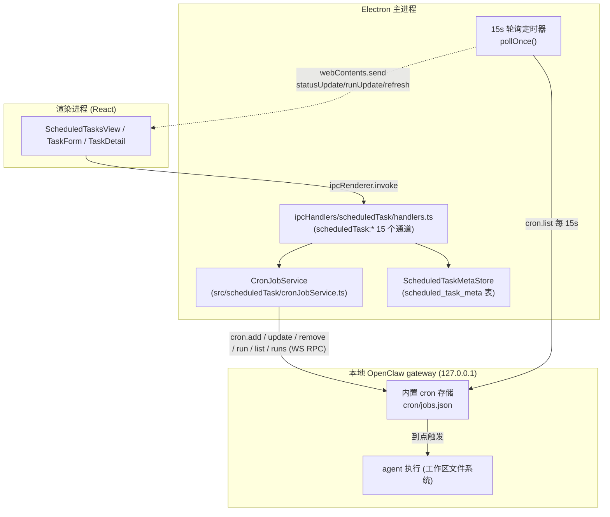
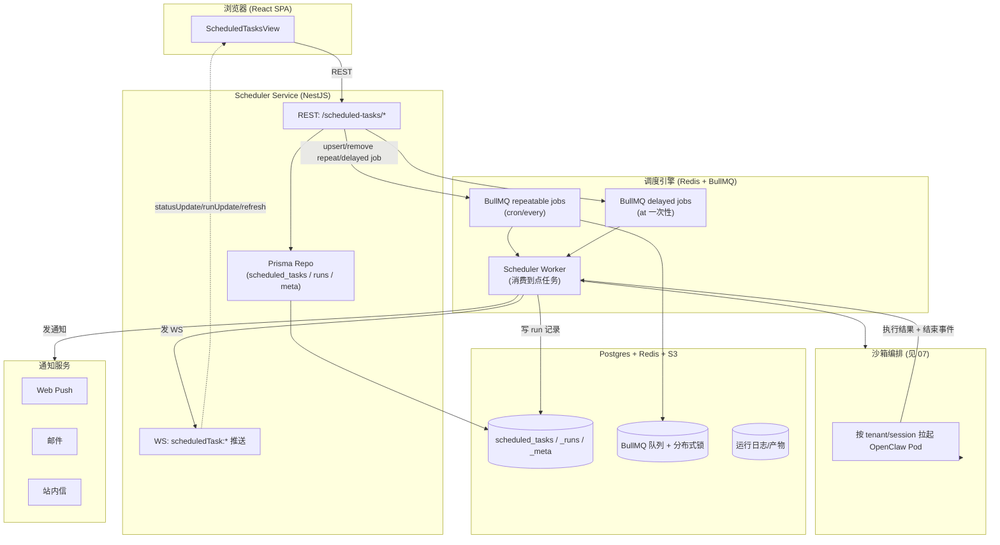
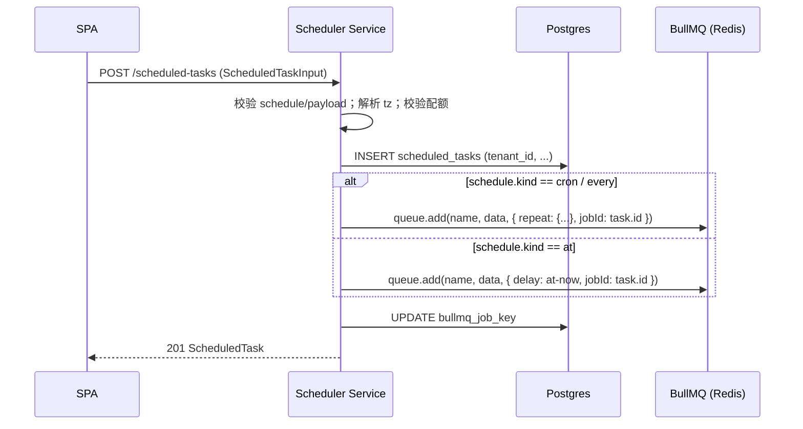
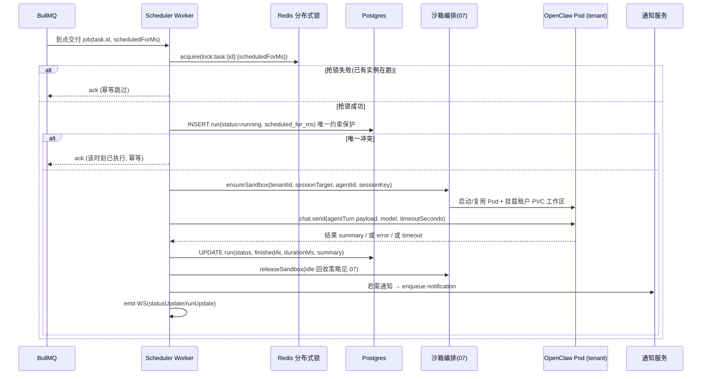
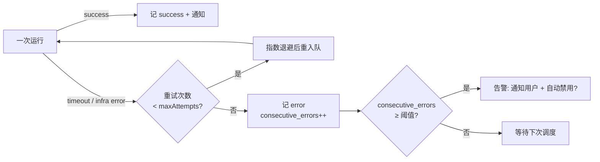
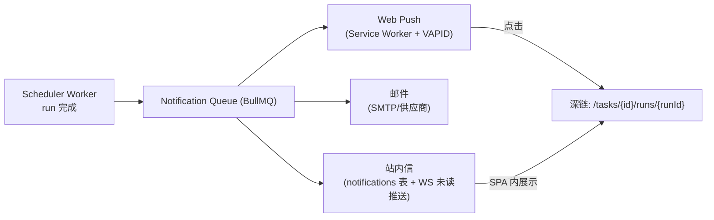

# 定时任务调度

> 本文档用途：说明 LobsterAI 定时任务（Scheduled Tasks / Cron）子系统从「单机 OpenClaw 本地 cron」到「多租户服务端调度」的完整改造方案。
> 适合读者：后端调度/编排负责人、定时任务模块开发者、SRE/运维。阅读前建议先看 [00-总览与执行摘要](./00-总览与执行摘要.md) 与 [07-OpenClaw运行时编排与沙箱隔离](./07-OpenClaw运行时编排与沙箱隔离.md)；本文的「触发→拉起沙箱→回收」严格与 07 保持一致，本文只描述「谁在什么时间以什么参数触发」，不重复沙箱生命周期细节。

---

## 1. 一句话结论

现状的定时任务本质是「Electron 主进程里的一个轮询器 + 本地 OpenClaw gateway 内置 cron 存储 + SQLite 里的一张本地元数据表」，只在 App 前台运行、单用户、无租户概念。改造目标是把「调度权威」上移到服务端：调度定义、运行历史、触发决策全部落 Postgres + Redis，触发时按 [07](./07-OpenClaw运行时编排与沙箱隔离.md) 的编排逻辑拉起租户沙箱执行 agent，执行完回收；通知从 Electron 本地系统通知改为 Web Push / 邮件 / 站内信。

---

## 2. 现状（知己）

### 2.1 数据与控制流总览



关键事实：**调度权威在 OpenClaw gateway 内部**，LobsterAI 主进程只是它的一个「前端 + 轮询镜像」。所有真正的「到点触发」由本地 gateway 完成；`CronJobService` 通过 WebSocket RPC（`ws://127.0.0.1:{port}`，token 鉴权，见 [07](./07-OpenClaw运行时编排与沙箱隔离.md#gateway-连接)）把 UI 意图翻译成 `cron.*` 调用，并靠轮询把状态回灌 UI。

### 2.2 三块存储职责划分

| 存储 | 位置 | 内容 | 权威性 |
|---|---|---|---|
| OpenClaw cron 存储 | 本地 gateway 内部（`{state}/cron/jobs.json`，见 `openclawConfigSync.ts` 中 `cron.store` 配置） | 任务定义（schedule/payload/delivery）、运行历史、下次运行时间、running 状态 | **权威**：真正的调度器 |
| `scheduled_task_meta`（SQLite） | `src/scheduledTask/metaStore.ts:14-51` | 每个 taskId 的 `origin`（来源：legacy/im/cowork/manual）与 `binding`（执行绑定：new_session/ui_session/im_session/session_key），JSON 字符串 | 本地补充：cron API 不支持自定义字段，故本地存 |
| `kv`（SQLite） | 迁移标记 | `scheduled_tasks_migrated_to_openclaw_v1`、`scheduled_task_runs_migrated_to_openclaw_v1`（`constants.ts` `MigrationKey`） | 一次性迁移幂等标记 |

> 注意：CLAUDE.md 与调研清单里提到的 `scheduled_tasks` / `scheduled_task_runs` 表已经是**历史遗留**——当前它们只在 `migrate.ts` 里被读出、迁移进 OpenClaw cron 后废弃；真正的任务定义与运行历史现在都在 gateway。改造时以 `cronJobService.ts` + `metaStore.ts` 为准。

### 2.3 领域模型（现有 TS 定义，权威）

任务定义（`src/scheduledTask/types.ts:57-72`）：

```ts
interface ScheduledTask {
  id: string;
  name: string;
  description: string;
  enabled: boolean;
  schedule: Schedule;              // at | every | cron
  sessionTarget: SessionTarget;    // 'main' | 'isolated'
  wakeMode: WakeMode;              // 'now' | 'next-heartbeat'
  payload: ScheduledTaskPayload;   // agentTurn | systemEvent
  delivery: ScheduledTaskDelivery; // none | announce | webhook
  agentId: string | null;
  sessionKey: string | null;
  state: TaskState;                // 由 gateway 回灌
  createdAt: string;
  updatedAt: string;
}
```

调度类型（`types.ts:3-21`）：三种 `Schedule`——

| kind | 字段 | 语义 |
|---|---|---|
| `at` | `at: string`（ISO 时间） | 一次性，指定绝对时刻触发 |
| `every` | `everyMs: number`，`anchorMs?` | 固定间隔（可锚点对齐） |
| `cron` | `expr: string`，`tz?`，`staggerMs?` | Cron 表达式 + 时区 + 抖动 |

Payload（`types.ts:23-35`）：`agentTurn`（给 agent 一条 message，触发一轮对话，可带 `model` / `timeoutSeconds`）或 `systemEvent`（系统事件文本，如 heartbeat）。

Delivery（`types.ts:37-43`，`constants.ts` `DeliveryMode`）：`none`（仅执行、结果留在会话）/ `announce`（投递到 IM 渠道）/ `webhook`。IM 投递属于 [10-MCP与技能改造](./10-MCP与技能改造.md) 之外的 IM 域，本次 v1 IM 后续再做，见 [13-功能取舍与降级清单](./13-功能取舍与降级清单.md)。

运行状态 `TaskState`（`types.ts:47-55`）由 gateway 回灌：`nextRunAtMs / lastRunAtMs / lastStatus / lastError / lastDurationMs / runningAtMs / consecutiveErrors`。

### 2.4 CronJobService ↔ gateway 的 RPC 契约（现状）

`CronJobService`（`src/scheduledTask/cronJobService.ts:464-887`）通过 `GatewayClientLike.request(method, params)` 调用以下 gateway 方法：

| Service 方法 | Gateway RPC | 说明 | 代码位置 |
|---|---|---|---|
| `addJob` | `cron.add` | 创建任务 | `cronJobService.ts:518-557` |
| `updateJob` | `cron.update` | patch 模式更新 | `:559-598` |
| `removeJob` | `cron.remove` | 删除 | `:600-605` |
| `toggleJob` | `cron.update`（仅 `enabled`） | 启停 | `:630-634` |
| `runJob` | `cron.run` | 立即手动触发 | `:636-639` |
| `listJobs` | `cron.list`（`includeDisabled:true, limit:200`） | 列出全部（过滤内部任务） | `:607-610, :508-516` |
| `listRuns` / `countRuns` / `listAllRuns` | `cron.runs`（`scope: job/all`, `sortDir:desc`, 分页） | 运行历史 | `:641-763` |

**轮询机制**（`cronJobService.ts:765-862`）：`startPolling()` 每 `POLL_INTERVAL_MS = 15_000`（`:477`）调 `cron.list`，对比 `lastKnownStates`（`JSON.stringify(job.state)`）与 `lastKnownRunAtMs`，发现变化则 `webContents.send`：

- `scheduledTask:statusUpdate`（`IpcChannel.StatusUpdate`）— 单任务状态变化
- `scheduledTask:runUpdate`（`IpcChannel.RunUpdate`）— 新一条运行记录
- `scheduledTask:refresh`（`IpcChannel.Refresh`）— 首轮/强制全量刷新

### 2.5 触发后如何执行 agent（现状）

任务到点后由**本地 gateway** 自行执行 `payload`：对 `agentTurn`，gateway 在对应 `sessionTarget` 上跑一轮 agent turn，agent 直接读写本地工作区文件（`workspace-main` / `workspace-{agentId}`）。`sessionTarget` 与 `sessionKey` / `agentId` 决定跑在哪个会话/工作区；`timeoutSeconds` 默认 3600（`openclawConfigSync.ts:89` `OPENCLAW_AGENT_TIMEOUT_SECONDS`）。这里的「执行 = 单机 gateway 直接跑」是本次改造要重写的核心点。

### 2.6 内部任务（系统级 cron）

memory-core 的「dreaming」等系统任务也走同一 cron 存储，用前缀标记区分并对用户隐藏：

- 描述前缀 `[managed-by=memory-core`（`constants.ts` `InternalTaskMarker.MemoryCoreManagedDescriptionPrefix`）
- payload 前缀 `__openclaw_memory_core_`（`InternalTaskMarker.MemoryCorePayloadPrefix`）
- 过滤逻辑：`isInternalScheduledTaskJob()`（`cronJobService.ts:143-161`），`listJobs/pollOnce` 均跳过。

改造后**内部系统任务**（memory dreaming、上下文维护）与**用户任务**要沿用同样的「用户不可见」区分，但两者都要跑在服务端调度器上。

### 2.7 通知（现状）

任务完成的用户提醒走 `TaskCompletionNotifier`（`src/main/libs/taskCompletionNotifier.ts`）：Electron 本地能力——系统通知（`new Notification`）、macOS Dock 角标、Windows 任务栏 overlay + flashFrame、托盘提醒。仅在 App 非前台时提醒，前台则跳过（`:46-49`）。**这套完全依赖桌面 API，Web 化必须整体替换**。

### 2.8 现状的多租户/Web 化障碍清单

| 障碍 | 说明 | 影响 |
|---|---|---|
| 调度器绑死本地 gateway | 到点触发发生在用户机器上的 gateway 内部 | App 关闭即不触发；无法云端 24×7 |
| 无 tenant 概念 | `cron/jobs.json` 与 `scheduled_task_meta` 全局单租户 | 无法隔离/计费/配额 |
| 状态靠 15s 轮询 | 主进程轮询 gateway | 云端多实例下轮询模型不成立，需事件/推送 |
| 通知依赖 Electron | 系统通知/角标/托盘 | 浏览器/离线用户收不到 |
| 元数据双写 | gateway + SQLite `scheduled_task_meta` 两处 | 迁移时需合并为一处 Postgres |
| `at` 一次性任务 | 依赖本地 gateway 存活到触发点 | 云端要有独立一次性调度能力 |

---

## 3. 目标架构

### 3.1 总体：调度权威上移到服务端



设计要点：`Scheduler Service` 拥有任务定义（Postgres）；`调度引擎`（Redis/BullMQ）负责「到点」；`Scheduler Worker` 消费到点任务后按 [07](./07-OpenClaw运行时编排与沙箱隔离.md) 拉起租户沙箱执行 agent、收集结果、写 run、发通知/WS。原来「gateway 内部 cron」不再作为调度权威——沙箱 Pod 内的 OpenClaw 只作为**被动执行器**（一次 agent turn 就回收），不再持有 cron 存储。

### 3.2 调度引擎选型与取舍

三条候选路线：

| 方案 | 机制 | 优点 | 缺点 | 适配度 |
|---|---|---|---|---|
| **A. BullMQ repeat/delayed（推荐）** | Redis 上的 repeatable job（cron/every）+ delayed job（at）；Worker 消费 | 与技术栈一致（Redis 已选）；秒级精度；天然重试/退避/并发控制/去重；一次性 `at` 用 delayed job 直接支持；水平扩 Worker 简单 | Redis 需高可用（持久化/哨兵/集群）；repeatable job 的「变更/删除」需按 key 精确管理 | ⭐⭐⭐ 首选 |
| B. k8s CronJob | 每个用户任务生成一个 k8s CronJob 对象 | 与 K8s 原生一致；调度器是集群内建 | 每租户成千上万 CronJob 对象会压垮 etcd/apiserver；只支持 cron（不支持 `every`/`at`）；分钟级最小粒度；动态增删 CRD 运维重 | ✗ 不适合海量用户级任务 |
| C. 自研 cron 服务 | 自己写「每秒扫下一个到点任务 + 分布式锁」 | 完全可控 | 重复造轮子；重试/去重/可观测全要自己实现；容易踩坑 | △ 仅当 BullMQ 不满足特殊需求时 |

**结论：采用方案 A（BullMQ）**。理由：

1. Redis + BullMQ 已在总体技术栈中（见 [02-目标架构与技术选型](./02-目标架构与技术选型.md)），无新增基础设施；
2. 三种 `Schedule`（`at`/`every`/`cron`）都能映射：`cron`/`every` → repeatable job，`at` → delayed job；
3. BullMQ 内置重试次数、指数退避、`jobId` 去重、并发度（concurrency / rate limiter），正好覆盖「幂等/并发/失败重试」需求；
4. K8s CronJob 仅用于**平台级少量系统任务**（如全局清理、指标聚合），不用于用户任务。

> `at` 一次性任务里若触发时刻远在未来（如「30 天后提醒」），BullMQ delayed job 也可承载，但需评估 Redis 内存与重启恢复；超长延时（>7 天）建议改为「一张 due_at 表 + 每分钟扫描入队」的兜底扫描器（见 §3.4）。

### 3.3 多租户数据模型

把现状的「gateway cron 存储 + `scheduled_task_meta`」合并为服务端三张 Postgres 表，全部带 `tenant_id`（多租户隔离方案见 [06-数据模型迁移](./06-数据模型迁移.md) 与 [14-安全合规与多租户隔离](./14-安全合规与多租户隔离.md)，启用 RLS）。

```prisma
// scheduled_tasks：任务定义（权威，取代 gateway cron 存储）
model ScheduledTask {
  id            String   @id @default(uuid())
  tenantId      String   @map("tenant_id")
  ownerUserId   String   @map("owner_user_id")
  name          String
  description   String   @default("")
  enabled       Boolean  @default(true)

  // schedule（判别联合展平存储）
  scheduleKind  String   @map("schedule_kind")   // 'at' | 'every' | 'cron'
  scheduleAt    DateTime? @map("schedule_at")     // at
  everyMs       BigInt?  @map("every_ms")         // every
  anchorMs      BigInt?  @map("anchor_ms")
  cronExpr      String?  @map("cron_expr")        // cron
  tz            String?                            // IANA 时区，如 'Asia/Shanghai'
  staggerMs     Int?     @map("stagger_ms")

  sessionTarget String   @map("session_target")  // 'main' | 'isolated'
  wakeMode      String   @map("wake_mode")        // 'now' | 'next-heartbeat'

  // payload
  payloadKind   String   @map("payload_kind")     // 'agentTurn' | 'systemEvent'
  payloadJson   Json     @map("payload_json")     // { message | text, model?, timeoutSeconds? }

  // delivery（v1 只用 'none'；IM 渠道后续）
  deliveryJson  Json     @map("delivery_json")

  agentId       String?  @map("agent_id")
  sessionKey    String?  @map("session_key")

  // 本地元数据合并入主表（取代 scheduled_task_meta）
  originJson    Json     @map("origin_json")      // TaskOrigin
  bindingJson   Json     @map("binding_json")     // ExecutionBinding
  isInternal    Boolean  @default(false) @map("is_internal") // memory-core 等系统任务

  // 调度引擎游标
  bullmqJobKey  String?  @map("bullmq_job_key")   // repeatable/delayed job 的 key

  createdAt     DateTime @default(now()) @map("created_at")
  updatedAt     DateTime @updatedAt @map("updated_at")

  runs          ScheduledTaskRun[]

  @@index([tenantId, enabled])
  @@index([tenantId, scheduleKind, scheduleAt]) // at 兜底扫描
  @@map("scheduled_tasks")
}

// scheduled_task_runs：运行历史（取代 gateway cron.runs 日志）
model ScheduledTaskRun {
  id            String   @id @default(uuid())
  tenantId      String   @map("tenant_id")
  taskId        String   @map("task_id")
  sessionId     String?  @map("session_id")
  sessionKey    String?  @map("session_key")
  status        String                            // running|success|error|skipped
  startedAt     DateTime @map("started_at")
  finishedAt    DateTime? @map("finished_at")
  durationMs    Int?     @map("duration_ms")
  error         String?
  summary       String?
  deliveryError String?  @map("delivery_error")

  // 幂等键：同一 (taskId, scheduledForMs) 只允许一条 run
  scheduledForMs BigInt  @map("scheduled_for_ms")

  task          ScheduledTask @relation(fields: [taskId], references: [id], onDelete: Cascade)

  @@unique([taskId, scheduledForMs])  // 幂等保障，见 §5.3
  @@index([tenantId, taskId, startedAt(sort: Desc)])
  @@map("scheduled_task_runs")
}
```

> `scheduled_task_meta` 表的 `origin` / `binding` 直接并入 `scheduled_tasks` 的 `originJson` / `bindingJson`，不再独立成表——原因是 Postgres 有原生 JSON 与外键，不像 OpenClaw cron API 那样「无法加自定义字段」，合并后减少一次读。`TaskState`（nextRun/lastRun/…）不再持久化在任务表，而是从 BullMQ（下次运行）+ 最新 run 记录派生，避免双写不一致。

### 3.4 任务 CRUD 与调度引擎同步



- **创建**：写 Postgres → 按 `schedule.kind` 注册 BullMQ job；`jobId` 用 `task.id` 保证同一任务不重复入队。
- **更新**：`removeRepeatableByKey` 旧的 → 重新 add，或对 delayed job 先 remove 再 add；`enabled=false` 时移除队列 job 但保留 Postgres 定义。
- **删除**：Postgres 软删/硬删 + 移除队列 job。
- **兜底扫描器**（应对超长 `at`、Redis 丢失恢复）：一个每分钟跑的 K8s CronJob 平台任务，`SELECT ... FROM scheduled_tasks WHERE schedule_kind='at' AND schedule_at <= now()+interval '2 min' AND enabled AND not_yet_enqueued`，补入 BullMQ。这是「以 Postgres 为准、Redis 为加速」的对账机制，Redis 崩溃重建后能自愈。

---

## 4. 触发 → 拉起沙箱 → 执行 agent → 回收

本节是与 [07](./07-OpenClaw运行时编排与沙箱隔离.md) 的接缝。**沙箱生命周期本身以 07 为权威**，这里只给「定时任务侧」的调用序列与参数。

### 4.1 端到端时序



### 4.2 与 07 一致的编排契约

Worker 不自己管 Pod，而是调用编排层暴露的接口（定义在 [07](./07-OpenClaw运行时编排与沙箱隔离.md)）：

```ts
interface SandboxOrchestrator {
  // 确保该 tenant/session 有可用沙箱（复用或新建），返回可用的 gateway 连接
  ensureSandbox(req: {
    tenantId: string;
    ownerUserId: string;
    sessionTarget: 'main' | 'isolated';
    agentId: string | null;
    sessionKey: string | null;
    reason: 'scheduled-task';
  }): Promise<{ gateway: GatewayClientLike; sandboxId: string }>;

  // 执行完成后按回收策略处理（idle TTL / 立即回收），细节见 07
  releaseSandbox(sandboxId: string, hint: 'idle' | 'immediate'): Promise<void>;
}
```

- `sessionTarget='isolated'`：每次触发新建临时会话/工作区（对应现状 `BindingKind.NewSession`），执行完 `releaseSandbox('immediate')`。
- `sessionTarget='main'` 或 `binding=UISession/SessionKey`：复用该用户既有会话沙箱，执行完 `releaseSandbox('idle')`（沙箱按 07 的 idle TTL 回收，避免频繁冷启动）。
- Worker 通过编排层拿到的 `gateway` 只发**一次** `chat.send`（agentTurn），不再向沙箱内 gateway 写任何 cron——沙箱内 OpenClaw 的 cron 能力在多租户模式下**禁用**（config sync 里不再下发 `cron.store`，memory-core dreaming 等系统任务改由服务端调度器统一调度，见 §4.5）。

### 4.3 时区

- 任务的 `tz` 存 IANA 名（如 `Asia/Shanghai`），随任务持久化；创建时若未指定，取用户 profile 时区（见 [05-认证与多租户账户](./05-认证与多租户账户.md)），再兜底 `UTC`。
- BullMQ repeatable job 的 cron 直接支持 `tz` 参数（内部用 `cron-parser`），无需自己算偏移。
- 现状里主进程给本地 gateway 注入 `TZ`（`openclawEngineManager.ts` 时区推断）是「以用户机器时区跑」；改造后**时区是任务属性**而非机器属性，DST（夏令时）切换由 `cron-parser` 处理。
- run 记录的所有时间戳统一存 UTC（`DateTime`），前端按用户时区展示。

### 4.4 并发与幂等

| 机制 | 实现 | 目的 |
|---|---|---|
| 任务级互斥 | Redis 锁 `lock:task:{id}:{scheduledForMs}` | 同一任务同一触发时刻只跑一个 Worker |
| run 唯一约束 | `@@unique([taskId, scheduledForMs])` | DB 层兜底：同一触发时刻只有一条 run；重复投递直接冲突跳过 |
| 队列去重 | BullMQ `jobId = task.id`（repeat）；delayed 用 `jobId = task.id:scheduledForMs` | 防止重复注册/重复入队 |
| 单任务不重叠 | 触发时若上一 run 仍 `running` 且超时未到，按策略 `skip`（记 `skipped`）或排队 | 防止长任务堆叠 |
| 租户级并发上限 | BullMQ per-tenant rate limiter / group | 防止单租户占满 Worker/沙箱资源（配额见 [09](./09-模型代理与计费.md)、[14](./14-安全合规与多租户隔离.md)） |

「幂等」核心：Worker 消费是 **at-least-once**，靠「Redis 锁 + DB 唯一约束」把它收敛成 **effectively-once**。`scheduledForMs` 是「本次调度对应的计划时刻」（对 repeat job 由 BullMQ 提供 `job.opts.repeat` 的当次触发时间），是幂等键的核心。

### 4.5 系统内部任务

memory-core dreaming、上下文维护等系统任务（现状用 `[managed-by=memory-core` / `__openclaw_memory_core_` 前缀标记，`isInternalScheduledTaskJob`）在服务端改为：`scheduled_tasks.is_internal=true` 的记录，走同一调度引擎，但对用户 API/UI 隐藏（`WHERE is_internal=false`）。系统任务的 payload 与频率由 memory/dreaming 模块下发（见 [02](./02-目标架构与技术选型.md) / 记忆相关章节），不再由沙箱内 gateway 自管。

### 4.6 失败重试与告警



| 失败类型 | 处理 |
|---|---|
| 基础设施错误（沙箱拉起失败、网络、Redis 抖动） | BullMQ 自动重试（`attempts` + `backoff: exponential`），不写额外 run 或写 `error` 后重试 |
| Agent 执行错误（模型报错、工具失败） | 记 `error` run，不自动重试（下次按 schedule 再来）；`consecutive_errors` 累加 |
| 超时（超过 `timeoutSeconds`，默认 3600） | 取消该 turn，回收沙箱，记 `error`（`error='timeout'`） |
| 交付失败（v1 无 IM，故仅站内/邮件失败） | 与执行成功解耦：沿用现状 `isDeliveryOnlyError` 思路（`cronJobService.ts:206-216`）——agent turn 成功但通知失败时，run 记 `success`、单独记 `deliveryError`，不污染任务状态 |
| 连续失败超阈值 | 告警（通知用户 + Prometheus 指标 + 可选自动 `enabled=false`），阈值与告警渠道见 [15-部署运维与可观测性](./15-部署运维与可观测性.md) |

告警指标（对接 Prometheus/Grafana，见 [15](./15-部署运维与可观测性.md)）：`scheduled_task_run_total{status}`、`scheduled_task_run_duration_seconds`、`scheduled_task_consecutive_errors`、`scheduler_queue_depth`、`scheduler_worker_lag_seconds`（到点时间与实际开始时间差）。

---

## 5. 运行历史与通知

### 5.1 运行历史

- 运行历史从「gateway `cron.runs` 内存日志」改为 Postgres `scheduled_task_runs` 表（持久、可分页、可按状态/时间筛选，`RunFilter` 沿用 `types.ts:136-143`）。
- 保留时长：按租户/套餐设置（如 free 30 天、付费 90 天），过期由平台清理任务删除。大对象（完整对话/产物）落 S3（见 [08-文件工作区与对象存储](./08-文件工作区与对象存储.md)），run 表只存 `summary` + S3 引用。
- 分页 API 直接落 SQL `LIMIT/OFFSET` + 索引，替代现状 `cronJobService.ts:641-763` 里「翻页拉 gateway 日志再本地过滤」的低效逻辑。

### 5.2 通知：替代 TaskCompletionNotifier

现状 `TaskCompletionNotifier`（Electron 系统通知/Dock 角标/托盘）全部下线，改为服务端「通知服务」的三个渠道：



| 渠道 | 机制 | 何时用 | 对应现状能力 |
|---|---|---|---|
| **站内信** | `notifications` 表 + WS `notify:new` 未读推送 + SPA 铃铛/角标 | 默认全部 | 替代 Dock/托盘角标（未读计数）与「点击打开会话」 |
| **Web Push** | 浏览器 Service Worker + VAPID 订阅（用户授权后） | 用户开启且离线/后台 | 替代 Electron 系统通知 |
| **邮件** | 通知服务发信 | 用户偏好选择/重要告警（连续失败） | 桌面端无此能力，新增 |

用户级通知偏好（存 Postgres，租户/用户维度）：`taskCompletionEnabled`、`channels: [inbox|webpush|email]`、`onlyOnError`。现状「仅 App 非前台才提醒」的语义在 Web 下改为「SPA 在线且正打开该任务详情 → 只更新 UI 不推送；否则按偏好推送」——用 WS 在线状态判断，逻辑对应现状 `isWindowForeground`（`taskCompletionNotifier.ts:90-92`）。

深链接：Web Push / 站内信点击跳 `/tasks/{taskId}/runs/{runId}`（替代现状 `openSession(sessionId)` + `session:openFromNotification`）。

### 5.3 幂等与去重（通知侧）

通知也走队列（at-least-once），用「`notifications` 表 `@@unique(runId, channel)`」保证同一 run 每渠道只发一次；Web Push 失败/订阅过期时清理订阅并降级为站内信。

---

## 6. API 与 WS 契约

REST（NestJS，路径前缀 `/scheduled-tasks`，鉴权 JWT，租户由 token 派生，见 [05](./05-认证与多租户账户.md)）。IPC → REST 的完整映射见 [附录A-IPC通道与接口映射](./附录A-IPC通道与接口映射.md)，此处给定时任务域切片：

| 现状 IPC（`constants.ts` `IpcChannel`） | REST/WS | 说明 |
|---|---|---|
| `scheduledTask:list` | `GET /scheduled-tasks` | 列表（自动过滤 `is_internal`） |
| `scheduledTask:get` | `GET /scheduled-tasks/:id` | 详情 |
| `scheduledTask:create` | `POST /scheduled-tasks` | 创建 |
| `scheduledTask:update` | `PATCH /scheduled-tasks/:id` | 更新 |
| `scheduledTask:delete` | `DELETE /scheduled-tasks/:id` | 删除 |
| `scheduledTask:toggle` | `POST /scheduled-tasks/:id/toggle` | 启停 |
| `scheduledTask:runManually` | `POST /scheduled-tasks/:id/run` | 立即触发（走同一 Worker，`scheduledForMs=now`） |
| `scheduledTask:stop` | `POST /scheduled-tasks/:id/stop` | 停止运行中的实例（取消当前 turn + 回收沙箱） |
| `scheduledTask:listRuns` | `GET /scheduled-tasks/:id/runs?limit&offset&status&startDate&endDate` | 单任务运行历史 |
| `scheduledTask:countRuns` | `GET /scheduled-tasks/:id/runs/count` | 运行总数 |
| `scheduledTask:listAllRuns` | `GET /scheduled-tasks/runs?...` | 全局运行历史 |
| `scheduledTask:resolveSession` | `GET /scheduled-tasks/runs/:runId/session` | 由 run 定位会话 |
| `scheduledTask:listChannels` / `listChannelConversations` | `GET /scheduled-tasks/channels`（v1 IM 未接，返回空/仅站内） | IM 渠道，后续 |
| `scheduledTask:statusUpdate`（send） | WS `scheduledTask:statusUpdate` | 单任务状态推送 |
| `scheduledTask:runUpdate`（send） | WS `scheduledTask:runUpdate` | 新运行记录推送 |
| `scheduledTask:refresh`（send） | WS `scheduledTask:refresh` | 全量刷新推送 |

WS 推送**不再靠 15s 轮询**（现状 `cronJobService.ts` 轮询模型下线）。改为事件驱动：Worker 写完 run / 更新状态后，通过 Redis pub/sub 广播 → 各 API 实例把消息推给订阅了该 tenant 的 WS 连接。前端订阅方式见 [03-前端与传输层改造](./03-前端与传输层改造.md)。

`ScheduledTaskInput`（`types.ts:92-103`）作为 REST body schema 基本沿用，仅去掉 IM 相关 `delivery` 分支（v1）。响应体 `ScheduledTask`（含派生 `state`）保持字段兼容，前端组件（`ScheduledTasksView.tsx` / `TaskForm.tsx` / `TaskDetail.tsx`）几乎无需改结构，只改数据来源（REST/WS 替代 IPC）。

---

## 7. 迁移

单机用户升级到 SaaS 时（若提供迁移路径）：读取本地 `cron/jobs.json`（用户任务，跳过 internal）+ `scheduled_task_meta`，映射为 `scheduled_tasks` 记录并写入其租户；一次性 `at` 若已过期则丢弃；运行历史可选迁移（一般不迁，从零开始）。迁移的通用策略、幂等标记（沿用 `MigrationKey` 思路）与租户归属见 [06-数据模型迁移](./06-数据模型迁移.md)。

---

## 8. 验收标准

功能：

1. 三类调度全部生效：`cron`（含自定义 tz、跨 DST 正确）、`every`（含 anchor）、`at`（一次性，含 >7 天超长延时经兜底扫描器触发）。
2. 用户创建/更新/删除/启停任务后，调度引擎状态在 1s 内同步；`enabled=false` 后不再触发，重新启用后恢复。
3. 触发时按 §4 拉起对应租户/会话沙箱执行 agent，`isolated` 目标每次新会话、`main`/复用目标沿用会话；执行完按 07 回收，无沙箱泄漏。
4. 手动 `run` 与到点自动触发走同一执行路径，结果一致。
5. `stop` 能中止运行中的任务实例（取消 turn + 回收沙箱），run 记 `error`/`skipped`。

多租户与隔离：

6. 任意租户只能看到/操作自己的任务与运行历史（RLS/tenant 过滤，跨租户访问被拒，见 [14](./14-安全合规与多租户隔离.md)）。
7. 单租户任务风暴不影响其他租户（per-tenant 并发/速率上限生效）。

幂等/并发/可靠性：

8. 同一任务同一触发时刻，即使 Worker 重复消费 / 多实例并发，也**只产生一条 run、只执行一次 agent**（Redis 锁 + `@@unique(taskId, scheduledForMs)` 双保险）。
9. Redis 崩溃重建后，兜底扫描器能在 ≤2 分钟内补齐临期任务，不丢触发（以 Postgres 为准对账）。
10. 基础设施错误自动重试（指数退避）；agent 执行错误记 error 不无限重试；`consecutive_errors` 超阈值触发告警且可自动禁用。

历史与通知：

11. 运行历史持久化于 Postgres，可按状态/日期分页筛选；大产物落 S3 只存引用。
12. 任务完成/失败按用户偏好通过站内信 / Web Push / 邮件通知；同一 run 每渠道至多一次（`@@unique(runId, channel)`）；点击深链定位到具体 run；`TaskCompletionNotifier` 相关 Electron 代码已下线。

可观测：

13. 暴露 `scheduled_task_run_total`、`scheduler_worker_lag_seconds` 等指标；到点延迟（lag）P99 在设定 SLO 内（如 <5s，见 [15](./15-部署运维与可观测性.md)）。

---

## 9. 风险

| 风险 | 影响 | 缓解 | 关联 |
|---|---|---|---|
| Redis/BullMQ 单点或数据丢失导致漏触发 | 任务不执行，用户信任受损 | Redis 高可用 + Postgres 权威 + 兜底扫描器对账；关键任务可加「missed run」检测 | [15](./15-部署运维与可观测性.md) |
| 沙箱冷启动慢导致到点延迟大 | lag 超 SLO | 复用沙箱 + 预热池 + `main` 目标 idle 保活（策略见 07） | [07](./07-OpenClaw运行时编排与沙箱隔离.md) |
| 海量用户任务压垮调度器 | 全局延迟 | BullMQ 分片队列 + per-tenant 限流 + 水平扩 Worker；不用 k8s CronJob 承载用户任务 | [17](./17-分阶段路线图与工作量估算.md) |
| 至少一次投递被误当多次执行 | 重复执行副作用（如重复发消息/写文件） | 强幂等键（`scheduledForMs`）+ DB 唯一约束；agent 侧尽量幂等 | 本文 §4.4 |
| DST/时区处理错误 | 触发时刻偏移 1 小时 | 用 `cron-parser` 按 IANA tz 计算；写测试覆盖 DST 边界 | [16](./16-测试策略与验收标准.md) |
| 长任务堆叠（上次没跑完下次又到点） | 沙箱/资源耗尽 | 单任务不重叠策略（skip 或串行排队） | 本文 §4.4 |
| 通知渠道（Web Push 订阅过期/邮件退信） | 用户收不到 | 多渠道降级 + 站内信兜底 + 订阅健康检查 | 本文 §5 |
| 迁移丢失/错配租户 | 用户任务归错人 | 迁移幂等标记 + 租户归属校验 + 干跑校对 | [06](./06-数据模型迁移.md) |

风险登记册汇总见 [18-风险登记册](./18-风险登记册.md)。

---

## 10. 交叉引用速查

- 沙箱拉起/回收/连接：[07-OpenClaw运行时编排与沙箱隔离](./07-OpenClaw运行时编排与沙箱隔离.md)
- 数据表迁移与租户归属：[06-数据模型迁移](./06-数据模型迁移.md)
- 前端 WS 订阅与桥替换：[03-前端与传输层改造](./03-前端与传输层改造.md)
- IPC→REST/WS 完整映射：[附录A-IPC通道与接口映射](./附录A-IPC通道与接口映射.md)
- 租户隔离/RLS/配额：[14-安全合规与多租户隔离](./14-安全合规与多租户隔离.md)
- 指标/告警/SLO：[15-部署运维与可观测性](./15-部署运维与可观测性.md)
- IM 投递（后续）：[13-功能取舍与降级清单](./13-功能取舍与降级清单.md)
