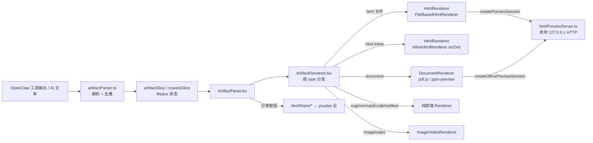
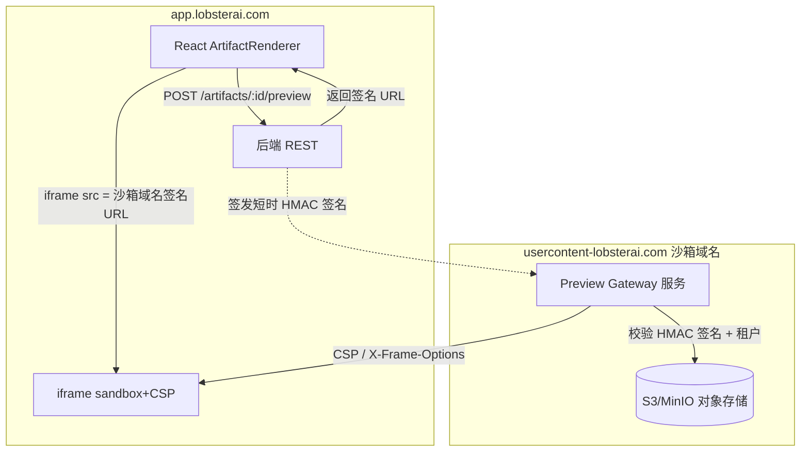
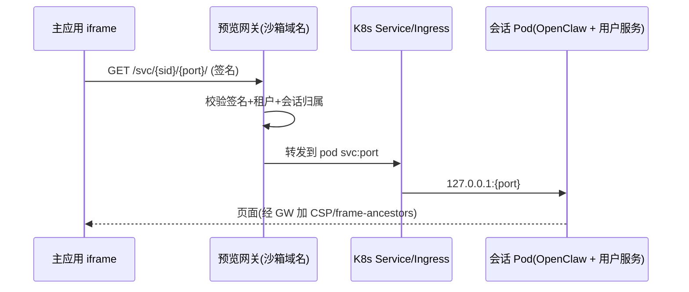

# Artifacts 与预览改造

> 本文档用途：说明 LobsterAI 从 Electron 桌面端迁移到多租户 SaaS Web 应用后，Artifacts（产物）解析、渲染与预览子系统的改造方案。适合读者：负责前端 Artifacts 面板、后端预览 / 分享服务、以及安全沙箱设计的工程师。阅读本文前建议先读 `00-总览与执行摘要.md`（整体目标）、`02-目标架构与技术选型.md`（技术栈），预览安全部分与 `14-安全合规与多租户隔离.md` 强绑定，对象存储细节见 `08-文件工作区与对象存储.md`，接口映射清单见 `附录A-IPC通道与接口映射.md`。

---

## 1. 本章范围与结论速览

Artifacts 是 Cowork 会话中 AI 生成或工具产出的"可展示成果"（网页、图表、图片、视频、文档等）。桌面端的实现深度依赖本地文件系统与本地 HTTP 服务器，是 Web 化改造的重灾区之一。

本章要解决的核心问题：

1. **解析层**（`artifactParser.ts`）大多是纯前端逻辑，可直接复用，但去重身份键 `file:*` 依赖本地路径，需改为对象存储 key。
2. **渲染层**（各 `*Renderer.tsx`）分两类：
   - 纯前端渲染（`svg` / `mermaid` / `code` / `markdown` / `text` / 部分 `document`）→ 基本原样保留。
   - 依赖本地资源的渲染（`html` 文件、`image` / `video` 本地文件、`document` PDF/PPTX 本地文件）→ 必须改为签名 URL + 服务端沙箱域名。
3. **本地 HTTP 预览服务器**（`htmlPreviewServer.ts`）→ 由服务端"预览网关"（独立沙箱域名 + 签名 URL + 严格 CSP + iframe 隔离）替代。
4. **local-service**（本地起服务扫描）→ v1 降级隐藏；可选走租户 Pod 端口反向代理（本章给出取舍）。
5. **HTML share**（现走 youdao 云）→ 自建分享服务替代（本章 §7）。

### 类型改造总览表

| Artifact 类型 | 桌面端渲染方式 | Web 目标方案 | 改造量 |
|---|---|---|---|
| `html`（文件） | 本地 HTTP server + iframe（`allow-scripts`+全权限） | 预览网关沙箱域名签名 URL + iframe（严格 CSP + 严格 sandbox） | 高 |
| `html`（inline，AI 生成） | `srcDoc` + `sandbox="allow-scripts"` | 保留 `srcDoc`，收紧 sandbox；大内容改走 blob/对象存储 | 中 |
| `svg` | 前端渲染（需净化） | 前端保留；文件型 SVG 经净化后展示或经预览网关 | 低 |
| `image` | 本地文件 → dataURL / 本地 URL | 对象存储签名 URL（``） | 中 |
| `video` | 本地文件 URL | 对象存储签名 URL（`<video src>` / Range 支持） | 中 |
| `mermaid` | 前端 mermaid.js 渲染 | 纯前端保留，零改造 | 无 |
| `code` | 前端高亮渲染 | 纯前端保留 | 无 |
| `markdown` | 前端 markdown 渲染 | 纯前端保留；图片引用改签名 URL | 低 |
| `text` | 前端文本渲染 | 纯前端保留 | 无 |
| `document`（PDF/DOCX/XLSX/PPTX） | pdf.js（前端）/ 本地 HTTP + pptx-preview UMD | PDF 前端 pdf.js 拉签名 URL；PPTX 前端库或服务端转 PDF | 高 |
| `local-service` | 展示本地服务 URL / 端口扫描 | v1 降级；可选 Pod 端口代理 | 降级 |

---

## 2. 现状：桌面端 Artifacts 架构

### 2.1 端到端数据流



### 2.2 关键代码位点

| 关注点 | 文件 | 说明 |
|---|---|---|
| 类型枚举 | `src/renderer/types/artifact.ts:1` | `ArtifactTypeValue`（10 种）+ `PREVIEWABLE_ARTIFACT_TYPES`（`src/renderer/types/artifact.ts:17`）；注意 `code` 不在 previewable 集合内 |
| 解析 / 路径归一 | `src/renderer/services/artifactParser.ts:7` | `normalizeArtifactFilePath` 处理 `file://` / `localfile://` / `MEDIA:` 前缀 |
| 去重身份键 | `src/renderer/services/artifactParser.ts:50` | `getArtifactIdentityKeys`：`file:{type}:{path}` / `url:{type}:{url}` / `name:{type}:{name}` |
| 去重优先级 | `src/renderer/services/artifactParser.ts:69` | `shouldPreferArtifact`：file 协议 < 远程 URL < content，`createdAt` 兜底 |
| 分发 | `src/renderer/components/artifacts/ArtifactRenderer.tsx:23` | `switch (artifact.type)` |
| HTML 文件渲染 | `src/renderer/components/artifacts/renderers/HtmlRenderer.tsx:24` | `FileBasedHtmlRenderer` 调 `createPreviewSession` → iframe |
| HTML inline 渲染 | `src/renderer/components/artifacts/renderers/HtmlRenderer.tsx:112` | `InlineHtmlRenderer`：`srcDoc` + `sandbox="allow-scripts"`（`:127`） |
| Document 渲染 | `src/renderer/components/artifacts/renderers/DocumentRenderer.tsx` | PDF 用 pdf.js（`:373` worker），PPTX 用本地 preview server iframe（`:529`, `:561`） |
| local-service 渲染 | `src/renderer/components/artifacts/ArtifactRenderer.tsx:42` | 仅显示 `artifact.url || artifact.content`（占位） |
| 本地预览服务器 | `src/main/libs/htmlPreviewServer.ts` | `127.0.0.1:随机端口`，sessionId + token 鉴权 |
| HTML share 客户端 | `src/main/libs/htmlShare/htmlShareClient.ts` | 打包上传 youdao 云，返回 `shareId` + 公开 URL |
| HTML share 打包 | `src/main/libs/htmlShare/htmlSharePackager.ts` | zip 打包目录，大小/文件数/扩展名白名单限制 |
| 公开分享 URL | `src/main/libs/endpoints.ts:35` | `getHtmlSharePublicBaseUrl` → `{serverApiBase}/s` |
| 本地服务扫描 | IPC `localWebServices:list`（`main.ts`） | 探测 `preferredPorts` 端口，返回在线服务列表 |

### 2.3 本地预览服务器的隔离机制（现状）

`htmlPreviewServer.ts` 已经用了不少隔离手段，是 Web 化设计的参考基线：

- **每次预览生成独立 session**：`sessionId = randomBytes(16)`、`token = randomBytes(24)`（`htmlPreviewServer.ts:353`）。
- **token 校验**：URL query 或 Referer 携带 token，不匹配返回 403（`htmlPreviewServer.ts:269`）。
- **路径穿越防护**：`resolvedPath.startsWith(session.rootDir)`（`htmlPreviewServer.ts:285`）。
- **rootDir 隔离**：每个 session 绑定单个文件所在目录（`htmlPreviewServer.ts:355`）。
- **CSP（仅 pptx 页启用）**：`includePreviewCsp` 里 `default-src 'self'` 等（`htmlPreviewServer.ts:79`）。

**桌面端的宽松点（Web 端必须收紧）**：

1. HTML 文件预览未启用 CSP（只有 pptx 页启用了），且 `Access-Control-Allow-Origin: *`（`htmlPreviewServer.ts:74`）。
2. inline HTML iframe 只有 `sandbox="allow-scripts"`，没有 CSP，也没有 `allow-same-origin` 缺失带来的 origin 隔离说明。
3. 预览服务器与主进程同机，rootDir 是用户真实工作目录——多租户下这等于把租户文件系统暴露给同一进程。

---

## 3. 目标架构：预览网关（Preview Gateway）

### 3.1 总体思路

将"本地 HTTP 预览服务器 + Electron iframe"替换为一套服务端 **预览网关**，核心三要素：

1. **独立沙箱域名**：预览内容全部从与主应用不同源的域名提供，例如 `usercontent-lobsterai.com`（下称"沙箱域名"）；主应用在 `app.lobsterai.com`。跨源天然隔离 cookie / localStorage / 主应用 DOM。
2. **签名 URL**：所有产物资源（HTML、图片、视频、PPTX 源文件等）通过短时效 HMAC 签名 URL 提供，绑定 `tenantId` + `sessionId` + `artifactId` + 过期时间，杜绝越权访问其他租户产物。
3. **iframe 隔离 + 严格 CSP**：主应用用严格 `sandbox` 属性的 iframe 嵌入沙箱域名 URL，网关响应带强 CSP 头。



### 3.2 为什么必须用独立沙箱域名

| 风险（同源提供时） | 后果 | 独立域名如何规避 |
|---|---|---|
| AI 生成 HTML 含恶意 `<script>` | 读取主应用 cookie / localStorage / 调用 `window.electron`/API | 跨源隔离，脚本拿不到主应用 origin 的存储与 API 凭证 |
| 产物内 `fetch('/api/...')` 携带 cookie | CSRF、越权调用后端 | 沙箱域名不设主应用 cookie；后端不接受该 origin 无 token 请求 |
| 产物间互相引用绕过 | 租户 A 页面读租户 B 资源 | 签名 URL 绑定租户，网关校验路径前缀 `tenant/{tenantId}/...` |

沙箱域名与主域名不能是子域关系下会共享 cookie 的写法（避免 `.lobsterai.com` 通配 cookie 泄漏）；推荐**完全不同的注册域名**，与 `14-安全合规与多租户隔离.md` 的隔离原则一致。

---

## 4. 分类型改造方案

### 4.1 HTML 文件预览（最高改造量）

**现状**：`FileBasedHtmlRenderer` 调 `window.electron.artifact.createPreviewSession(filePath)`（`HtmlRenderer.tsx:37`），拿到 `http://127.0.0.1:port/{sessionId}/...?token=...`，塞进 iframe。

**目标**：

1. 浏览器桥（见 `03-前端与传输层改造.md`）实现 `artifact.createPreviewSession(artifactRef)`，改为调后端 REST：

```
POST /api/v1/artifacts/{artifactId}/preview
  body: { entryFile?: string }
  → 200 { sessionId, url, expiresAt }
     url = https://usercontent-lobsterai.com/p/{sessionId}/{entryRelPath}?sig=...&exp=...
```

2. 后端预览网关校验签名后，从对象存储 `tenant/{tenantId}/sessions/{sessionId}/artifacts/{artifactId}/` 前缀流式返回文件（HTML 及其相对引用的 css/js/图片）。
3. 相对路径引用（`./style.css`、`img/a.png`）保持工作，网关在 session 前缀内做与桌面端相同的路径穿越防护。
4. iframe 收紧 sandbox：

```tsx
<iframe
  src={previewUrl}
  className="w-full h-full border-0"
  sandbox="allow-scripts allow-popups allow-forms"
  referrerPolicy="no-referrer"
  title={artifact.title}
/>
```

> 注意：不加 `allow-same-origin`。加了它 + `allow-scripts` 会让沙箱脚本恢复对沙箱域名 origin 的完整访问；由于是独立域名，即使加了也读不到主应用，但为纵深防御默认不加，除非产物明确需要 same-origin 能力（如访问自身 IndexedDB）。

**网关响应头（HTML 入口）**：

```
Content-Security-Policy:
  default-src 'none';
  script-src 'unsafe-inline' 'unsafe-eval' blob:;   # AI 产物常内联脚本
  style-src 'unsafe-inline';
  img-src data: blob: https://usercontent-lobsterai.com;
  media-src data: blob: https://usercontent-lobsterai.com;
  font-src data: https://usercontent-lobsterai.com;
  connect-src 'none';                               # 禁止产物向外发请求（默认）
  frame-ancestors https://app.lobsterai.com;        # 只允许主应用嵌入
Cross-Origin-Resource-Policy: same-origin
X-Content-Type-Options: nosniff
Cache-Control: no-store
```

`connect-src 'none'` 默认阻断产物 `fetch`/`XHR`/`WebSocket`，避免数据外泄与 SSRF；确有联网需求（如产物调公共 CDN）时再按需放开，并在 §8 验收里单列。CSP 具体基线与 `14-安全合规与多租户隔离.md` 保持一致。

**文件变更触发刷新**：桌面端用 `artifact:file:changed` 事件让 iframe reload（`HtmlRenderer.tsx:65`）。Web 端产物写入对象存储后由后端通过 WS `cowork:stream:*` 或专门的 `artifact:file:changed` WS 事件通知，前端换 `?_t=` 兜底刷新（见 `03` 桥事件映射）。

### 4.2 HTML inline（AI 生成、无文件）

**现状**：`srcDoc` + `sandbox="allow-scripts"`（`HtmlRenderer.tsx:124`）。

**目标**：

- 小体量 inline HTML（阈值建议 256KB）：保留 `srcDoc` 方案，但**升级隔离**——因为 `srcDoc` 属于父页面 origin，`sandbox="allow-scripts"`（不含 `allow-same-origin`）会让 iframe 成为 opaque origin，脚本拿不到父页面存储，这是安全的。**必须确保永不添加 `allow-same-origin`**，否则 srcDoc 会回落到父 origin，AI 脚本即可读主应用 token。
- 保留 `injectHashNavInterceptor`（`HtmlRenderer.tsx:9`）注入的锚点导航脚本。
- 大体量 inline HTML：先落对象存储再走 §4.1 的沙箱域名方案，避免超大 `srcDoc` 卡渲染。

为纵深防御，即使 `srcDoc` 也建议加 CSP `<meta>` 或改走沙箱域名，二选一：小内容图省事保留 srcDoc + opaque origin；追求统一可全部走沙箱域名 blob。推荐 **v1 保留 srcDoc（小）+ 沙箱域名（大/文件）双路**。

### 4.3 SVG

**现状**：`SvgRenderer` 前端渲染。SVG 可含 `<script>`/`<foreignObject>`，是 XSS 载体。

**目标**：

- inline SVG：前端用 DOMPurify（`USE_PROFILES: {svg: true, svgFilters: true}`）净化后再 `dangerouslySetInnerHTML`，或塞进 opaque-origin iframe。分享场景（§7）后端也必须净化——`htmlShare` 已定义 `UnsafeSvg` 错误码（`src/shared/htmlShare/constants.ts` `HtmlShareErrorCode.UnsafeSvg = 41312`），沿用。
- 文件型 SVG：经预览网关以 `Content-Type: image/svg+xml` + CSP `script-src 'none'` 提供，或转 ``（`` 引用的 SVG 不执行脚本，最安全）。

### 4.4 图片 / 视频

**现状**：本地文件路径 → dataURL 或本地 URL；去重键含 `url:{type}:{content}`（`artifactParser.ts:59`）。

**目标**：

- 产物图片/视频写入对象存储，渲染时用签名 URL：`` / `<video src={signedUrl}>`。
- 视频需支持 HTTP Range（对象存储原生支持）以便拖动进度。
- 缩略图：桌面端有 `dialog:generateThumbnail` IPC，Web 端由后端在上传时生成缩略图并单独签名。
- dataURL（AI 直接内联小图）继续内联即可，无需对象存储。

细节见 `08-文件工作区与对象存储.md`。

### 4.5 mermaid / code / markdown / text（纯前端保留）

- `mermaid`：`MermaidRenderer` 用 mermaid.js 前端渲染，零改造。
- `code`：`CodeRenderer` 高亮，零改造（注意 `code` 不在 `PREVIEWABLE_ARTIFACT_TYPES`，行为不变）。
- `text`：`TextRenderer`，零改造。
- `markdown`：`MarkdownRenderer` 前端渲染。唯一改造点：markdown 中引用的本地图片路径 → 改为签名 URL；同时确保 markdown → HTML 渲染链路净化（禁 raw HTML 或 DOMPurify），防止 markdown 内嵌 `<script>`。

### 4.6 document（PDF / DOCX / XLSX / PPTX）

**现状**：

- PDF：前端 pdf.js（`DocumentRenderer.tsx:373` worker，`:316` 资源），需要文件字节。
- PPTX：走本地预览服务器 `createOfficePreviewSession` + `pptx-preview` UMD（`htmlPreviewServer.ts:222`, `DocumentRenderer.tsx:529`），或前端 iframe 内 pptx-preview 渲染（`DocumentRenderer.tsx:1011` 起）。
- DOCX/XLSX：前端渲染器（`docxPagination.ts`、`renderers/sheet`）。

**目标（两条可选路线，v1 建议路线 A 为主）**：

| 路线 | 做法 | 优点 | 缺点 |
|---|---|---|---|
| **A. 前端库拉签名 URL** | pdf.js / docx 渲染器 / sheet 渲染器 / pptx-preview 直接 `fetch(signedUrl)` 拿字节在浏览器渲染 | 复用现有前端渲染器，服务端零转换负担 | 大文件下载耗时；PPTX/DOCX 保真度受库限制（与桌面端一致） |
| **B. 服务端转 PDF** | 后端用 LibreOffice headless 把 DOCX/PPTX/XLSX 转 PDF，前端统一 pdf.js 渲染 | 保真度高、渲染统一 | 需部署转换服务（BullMQ 任务 + 隔离容器）、有转换延迟 |

**v1 决策**：

- PDF：路线 A（前端 pdf.js 拉签名 URL），改动最小。
- DOCX / XLSX / PPTX：v1 先路线 A（沿用现有前端库，把本地 preview server 换成签名 URL 供给）；对保真度敏感的 PPTX/DOCX 转换（路线 B）列为 v1.x 增强，走 BullMQ 转换队列 + gVisor/Kata 隔离容器（转换本身是不可信文档处理，必须隔离，见 `14`）。

**PPTX 具体迁移**：把 `createOfficePreviewSession` 从本地 HTTP 服务器改为：后端返回 `source.pptx` 的签名 URL + `pptx-preview` 静态资源由主应用打包托管（不再从预览服务器动态取 UMD）；渲染页在沙箱域名 iframe 内加载，CSP 允许 `script-src`（pptx-preview 需要执行）。保留桌面端已有的 pptx CSP 基线（`htmlPreviewServer.ts:79`）。

---

## 5. local-service：本地起服务的取舍

**现状**：`local-service` 类型 + `localWebServices:list` IPC 扫描 `preferredPorts` 端口，探测本地运行的 web 服务（如 AI `npm run dev` 起的 Vite/Next 开发服）。桌面端 `ArtifactRenderer` 对该类型只显示 URL 占位（`ArtifactRenderer.tsx:42`）。它的价值在于：AI 在本地工作区起了一个服务，用户能一键预览。

Web/多租户下，"本地服务"跑在**租户沙箱 Pod 内部**（`127.0.0.1:port` 是 Pod 内地址，浏览器无法直连），必须做选择：

### 方案对比

| 方案 | 描述 | v1 建议 |
|---|---|---|
| **降级隐藏** | 不检测、不展示 local-service 产物；若 AI 产出该类型则显示"当前不支持本地服务预览"提示 | ✅ v1 采用 |
| **Pod 端口反向代理** | 后端为每个会话 Pod 暴露 `/preview-svc/{sessionId}/{port}/...` 反代到 Pod 内 `127.0.0.1:port`，经沙箱域名 iframe 展示 | v1.x 可选增强 |

### 若做 Pod 端口代理（v1.x）



取舍要点：

- **安全**：反代等于把租户容器内任意端口暴露到公网，必须签名 + 租户校验 + 仅允许白名单/AI 声明的端口；禁止访问 Pod 内元数据/内网（SSRF，与 `14` SSRF 策略一致，桌面端 `browserWebAccess.networkMode` 概念延续）。
- **成本**：Pod 需常驻（服务不能休眠），与 `07-OpenClaw运行时编排与沙箱隔离.md` 的 Pod 生命周期/休眠策略冲突——local-service 预览期间 Pod 必须保持运行，增加成本。
- **协议**：WebSocket/HMR 需网关支持 upgrade 转发（Vite/Next 开发服依赖 HMR）。

**结论**：v1 明确降级（列入 `13-功能取舍与降级清单.md`）；Pod 端口代理作为付费/高级功能在 v1.x 评估。

---

## 6. artifactParser 与去重键改造

**现状去重键**（`artifactParser.ts:50`）：

```
file:{type}:{normalizeFilePathForDedup(filePath)}
url:{type}:{remoteUrl}
url:{type}:{content}   // image/video
name:{type}:{fileName} // video
```

**Web 端改造**：

- 保留 `url:*` / `name:*` 逻辑（远程 URL/内容不变）。
- `file:*` 的路径不再是本地绝对路径，而是**对象存储相对 key**（`sessions/{sessionId}/artifacts/.../a.html`）。`normalizeFilePathForDedup`（`artifactParser.ts:44`）仍适用（统一分隔符 + 小写），但输入变为工作区相对路径，需在解析阶段把 `file://`/绝对路径归一为租户工作区相对 key。
- `shouldPreferArtifact`（`artifactParser.ts:69`）中"file 协议 < 远程 URL"的优先级语义不变，只是"本地文件"含义变为"工作区文件"。

这部分是**纯逻辑**，可继续用 Vitest 覆盖（现有 `.test.ts` 模式），几乎不涉及 IPC。

---

## 7. HTML Share 自建（替代 youdao htmlShare）

### 7.1 现状能力盘点

现有 `htmlShare` 客户端（`src/main/libs/htmlShare/`）把本地目录打包 zip 上传 youdao 云，返回 `shareId` 与公开 URL `{serverApiBase}/s/{shareId}/`（`endpoints.ts:35`, `htmlShareClient.ts:78`）。已有完整语义供复刻：

| 能力 | 常量/位点 |
|---|---|
| 源类型 | `HtmlShareSourceType`：html/image/svg/document/markdown/mermaid（`shared/htmlShare/constants.ts`） |
| 访问模式 | `HtmlShareAccessMode`：`code`（访问码）/ `public`（公开） |
| 状态 | `HtmlShareStatus`：live / disabled / failed |
| 停用来源 | `HtmlShareDisabledSource`：user/admin/moderation/active_limit/system |
| 错误码 | `HtmlShareErrorCode`：如 `UnsafeSvg=41312`、`ActiveShareLimitReached=41311`、`SubscriptionRequired=41307`、`AccessCodeInvalid=41308` |
| 打包限制 | `htmlSharePackager.ts`：单 zip 20MB、总 100MB、单文件 10MB、≤500 文件、扩展名白名单、排除 `.git`/`node_modules`/`.openclaw`/`memory` 敏感目录 |
| API 端点 | `htmlShareClient.ts`：`POST /api/html-shares`、`.../{id}`、`.../{id}/status`、`.../{id}/access-mode` |

### 7.2 自建服务设计

复用上述常量与打包器（`htmlSharePackager.ts` / `artifactFileSharePackager.ts` / `htmlDependencyScanner.ts` 逻辑可原样迁到后端），只替换"上传目标"和"公开访问"两端：

```mermaid
flowchart LR
  U[用户点击分享] --> API[POST /api/v1/html-shares]
  API --> PK[打包/扫描依赖<br/>复用 htmlSharePackager]
  PK --> S3[(对象存储<br/>shares/{tenantId}/{shareId}/)]
  API --> DB[(Postgres html_shares<br/>tenant_id,shareId,accessMode,status)]
  API --> R[返回 shareId + 公开URL]
  V[访客] --> PUB[GET /s/{shareId}/ 公开子站/CDN]
  PUB --> AC{accessMode?}
  AC -->|code| CK[校验访问码]
  AC -->|public| S3b[(对象存储)]
  CK --> S3b
```

**数据模型（Postgres，多租户）**：

```sql
CREATE TABLE html_shares (
  id            TEXT PRIMARY KEY,          -- shareId
  tenant_id     TEXT NOT NULL,             -- 多租户隔离
  owner_user_id TEXT NOT NULL,
  source_type   TEXT NOT NULL,             -- HtmlShareSourceType
  access_mode   TEXT NOT NULL DEFAULT 'code',
  access_code   TEXT,                      -- code 模式哈希
  status        TEXT NOT NULL DEFAULT 'live',
  disabled_source TEXT,
  entry_file    TEXT NOT NULL,
  source_sha256 TEXT,
  storage_prefix TEXT NOT NULL,           -- shares/{tenantId}/{shareId}/
  created_at    TIMESTAMPTZ NOT NULL DEFAULT now(),
  updated_at    TIMESTAMPTZ NOT NULL DEFAULT now()
);
CREATE INDEX ON html_shares (tenant_id, status);
```

租户隔离字段 `tenant_id` 与 RLS 策略见 `05-认证与多租户账户.md`、`06-数据模型迁移.md`。

**公开访问站点**：分享内容属于**公网可访问的不可信内容**，必须：

- 独立域名（与沙箱域名同源策略，绝不与主应用同域）。
- 静态资源经对象存储 + CDN 直供；`code` 模式在网关校验访问码后签发短时 URL。
- 每个分享严格限制在 `shares/{tenantId}/{shareId}/` 前缀，路径穿越防护同 §4.1。
- CSP / `frame-ancestors` 同预览网关基线；SVG/HTML 上传时净化（复用 `UnsafeSvg` 拦截）。
- 保留配额门控：`SubscriptionRequired`/`ActiveShareLimitReached` 等错误码语义在新计费系统（`09-模型代理与计费.md`）里落地。

**IPC → REST 映射**（详见 `附录A-IPC通道与接口映射.md`）：

| 旧 IPC | 新 REST |
|---|---|
| `htmlShare:createFromHtmlFile` / `createFromArtifactFile` | `POST /api/v1/html-shares` |
| `htmlShare:updateFromHtmlFile` / `updateFromArtifactFile` | `PUT /api/v1/html-shares/{id}` |
| `htmlShare:getByHtmlFile` / `getByArtifactFile` / `get` | `GET /api/v1/html-shares?...` / `GET /api/v1/html-shares/{id}` |
| `htmlShare:updateStatus` | `PATCH /api/v1/html-shares/{id}/status` |
| `htmlShare:updateAccessMode` | `PATCH /api/v1/html-shares/{id}/access-mode` |
| `htmlShare:disable` | `PATCH /api/v1/html-shares/{id}/status` (disabled) |

---

## 8. 安全沙箱要点（与 `14` 一致）

Artifacts 是"AI 生成的、天然不可信"的内容，是 Web 化后最大的 XSS/数据泄漏面。防御分层：

```mermaid
flowchart TB
  A[不可信产物] --> L1[层1 独立沙箱域名<br/>跨源隔离主应用]
  L1 --> L2[层2 签名URL<br/>绑定租户+会话+过期]
  L2 --> L3[层3 严格CSP<br/>connect-src none / frame-ancestors]
  L3 --> L4[层4 iframe sandbox<br/>无 allow-same-origin]
  L4 --> L5[层5 内容净化<br/>SVG/HTML DOMPurify]
  L5 --> L6[层6 存储前缀隔离<br/>tenant/{id} 路径穿越防护]
```

| 威胁 | 防御 |
|---|---|
| AI HTML/SVG XSS | 独立域名 + srcDoc opaque origin / iframe sandbox 无 same-origin + CSP + DOMPurify |
| 越权访问他租户产物 | 签名 URL 绑定 `tenantId`+`sessionId`+过期；网关校验存储前缀 |
| 产物外泄数据（fetch 主应用/内网） | CSP `connect-src 'none'`；预览网关 SSRF 防护；产物不携带主应用 cookie |
| 点击劫持 | `frame-ancestors https://app.lobsterai.com`；分享站禁止被任意页面嵌入 |
| 路径穿越 | 前缀校验（沿用 `htmlPreviewServer.ts:285` 思路） |
| 分享内容审核 | `disabled_source: moderation` + `UnsafeSvg` 拦截；打包排除敏感目录（`.openclaw`/`memory`） |
| MIME 嗅探 | `X-Content-Type-Options: nosniff` + 显式 Content-Type |

签名 URL 建议：HMAC-SHA256(`tenantId|sessionId|artifactId|path|exp`)，`exp` ≤ 10 分钟，密钥仅后端持有并定期轮换。

---

## 9. 迁移步骤（建议顺序）

1. **抽离纯逻辑**：确认 `artifactParser.ts` 去重逻辑无 Electron 依赖，补 Vitest；调整 `file:*` 键为工作区相对 key。
2. **浏览器桥打桩**：`window.electron.artifact.*`（`createPreviewSession` / `destroyPreviewSession` / `createOfficePreviewSession` / `watchFile` / `unwatchFile`）改为调后端 REST，返回签名 URL 结构不变（保 `{success,url,sessionId}` 形状，减少渲染器改动）。见 `03`。
3. **预览网关服务**：新建沙箱域名服务，实现签名校验 + 对象存储流式返回 + CSP 头 + 路径穿越防护。
4. **图片/视频/文档** 接对象存储签名 URL（依赖 `08`）。
5. **PPTX/document** 从本地 preview server 迁到签名 URL 供给；pptx-preview 静态资源改主应用打包托管。
6. **HTML share 自建**：迁移打包器到后端 + `html_shares` 表 + 公开访问站点。
7. **local-service 降级**：`ArtifactRenderer` local-service 分支改为友好降级提示；下线 `localWebServices:list` 探测（v1）。
8. **收紧 sandbox/CSP**：全面替换宽松的 `Access-Control-Allow-Origin: *` 与无 CSP 的 HTML 预览。

---

## 10. 验收标准

| # | 验收项 | 判定 |
|---|---|---|
| 1 | HTML 文件产物在预览网关沙箱域名下正确渲染，含相对 css/js/图片引用 | 通过 |
| 2 | 预览 iframe 内脚本无法读取主应用 cookie/localStorage/API token | 渗透测试无法读取 |
| 3 | 签名 URL 过期后（>10min）返回 403；篡改 `tenantId`/路径返回 403 | 通过 |
| 4 | 租户 A 无法通过任何 URL 访问租户 B 的产物或分享 | 越权测试全部拒绝 |
| 5 | inline HTML srcDoc 为 opaque origin，`allow-same-origin` 永不出现 | 代码审查 + DOM 断言 |
| 6 | SVG/HTML 产物经 DOMPurify/净化，`<script>` 注入被拦截或不执行 | XSS 用例不触发 |
| 7 | CSP `connect-src 'none'` 生效，产物 `fetch` 被浏览器阻断（除白名单） | 控制台报 CSP 违规 |
| 8 | 图片/视频经对象存储签名 URL 展示，视频支持进度拖动（Range） | 通过 |
| 9 | PDF（pdf.js）与 PPTX（pptx-preview）产物在 Web 端正常渲染 | 通过 |
| 10 | mermaid/code/markdown/text 渲染与桌面端一致，无回归 | 视觉/单测通过 |
| 11 | HTML share 自建：创建/更新/停用/访问码/公开模式全流程可用 | 通过 |
| 12 | 分享站点独立域名、`frame-ancestors` 限制、敏感目录（`.openclaw`/`memory`）不被打包 | 审查 + 用例 |
| 13 | local-service 产物显示明确降级提示，不泄漏 Pod 内网信息 | 通过 |
| 14 | `artifactParser` 去重 Vitest 全绿（含新工作区 key 用例） | `npm test -- artifact` |
| 15 | 打包大小/文件数限制（20MB/100MB/500 文件）在后端生效 | 边界用例 |

---

## 11. 风险与缓解

| 风险 | 影响 | 缓解 | 关联 |
|---|---|---|---|
| AI 产物 XSS 突破隔离 | 租户数据泄漏 | 独立域名 + 多层 CSP/sandbox + 净化；安全评审为发布门禁 | `14` |
| 签名 URL 泄漏/重放 | 短时越权访问 | 短过期 + 绑定租户/会话 + IP/UA 可选绑定 + 密钥轮换 | `14` |
| PPTX/DOCX 前端库保真度不足 | 用户体验回退 | v1 接受与桌面端同等保真；v1.x 上服务端 LibreOffice 转 PDF | `13` |
| 大文件签名 URL 下载慢 | 预览卡顿 | CDN 加速 + Range + 缩略图先行 | `08`,`15` |
| local-service 降级引发用户预期落差 | 功能缺失投诉 | 文档明确 + 降级提示 + v1.x Pod 端口代理路线图 | `13` |
| 文档转换服务处理恶意文件 | RCE/逃逸 | 转换在 gVisor/Kata 隔离容器 + BullMQ 限流 + 无网络 | `07`,`14` |
| 分享内容合规/审核缺失 | 违规内容托管 | moderation 停用机制 + 内容扫描 + 举报下架 | `14` |

---

## 12. 与其他章节的接口

- 浏览器桥与 WS 事件（`artifact:file:changed`、`createPreviewSession` 桩）→ `03-前端与传输层改造.md`。
- 预览网关/分享站点部署与 CDN/域名 → `15-部署运维与可观测性.md`。
- 对象存储路径规划、签名、缩略图 → `08-文件工作区与对象存储.md`。
- 沙箱域名、CSP 基线、SSRF、签名密钥管理 → `14-安全合规与多租户隔离.md`。
- 会话 Pod 生命周期（影响 local-service 代理可行性）→ `07-OpenClaw运行时编排与沙箱隔离.md`。
- HTML share 计费门控（`SubscriptionRequired`/配额）→ `09-模型代理与计费.md`。
- IPC → REST/WS 完整映射 → `附录A-IPC通道与接口映射.md`。
- local-service 降级登记 → `13-功能取舍与降级清单.md`。
