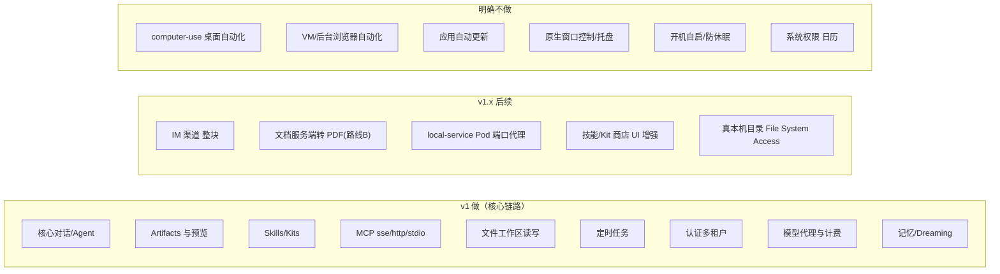
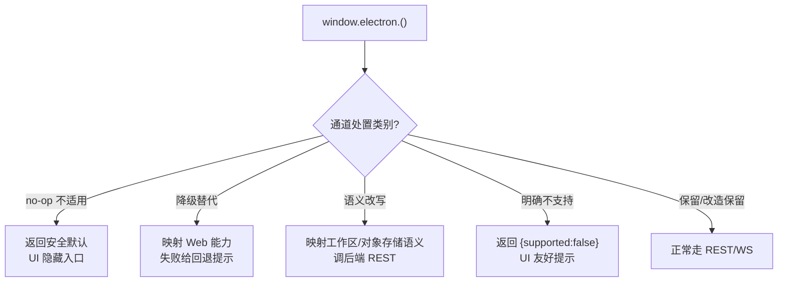

# 功能取舍与降级清单

> 本文档用途：作为整套 SaaS 改造的**范围冻结基线（scope baseline）**——把 LobsterAI 桌面端的每一项功能逐条登记为「保留 / 改造保留 / 降级 / 后续 / 不做」，给出原因、Web 替代方案，以及「以后要补需要什么」。它是风险登记册中 **R-SCOPE**（范围蔓延风险）所引用的权威口径，也是产品/研发/测试三方对「v1 到底做什么、不做什么」达成一致的单一事实源。
>
> 适合读者：**决策者**（确认取舍是否可接受）、**产品/项目经理**（排期与预期管理）、**前端**（哪些 `window.electron` 通道要降级/顶替）、**后端/平台**（哪些能力要重建、哪些能力被砍以省成本）、**测试**（哪些降级点要写「降级验收」用例）。
>
> 阅读前建议先读 `00-总览与执行摘要.md`（§2 范围与非目标）与 `01-现状架构调研.md`（§11 功能清单与可迁移性分级）。本文与 00 §2、01 §11 的口径**必须完全一致**；如出现冲突，以本文的大表为准并回改 00/01。

---

## 1. 本章结论速览

1. **范围三段式**（与 `00-总览与执行摘要.md` §2 完全一致）：
   - **v1 做**：核心对话/Agent、Artifacts 与预览、Skills/Kits、MCP（sse/http/stdio）、文件工作区读写、定时任务、认证多租户、模型代理与计费。
   - **v1.x 后续**：IM 渠道、文档服务端转 PDF、local-service 的 Pod 端口代理、更丰富的技能/Kit 商店 UI 等增强项。
   - **明确不做**：computer-use 桌面自动化、VM/后台浏览器、应用自动更新、原生窗口控制、开机自启/防休眠、系统权限（日历）。
2. **降级不是砍功能**：大量 Electron 原生能力（shell 打开文件、native 通知、剪贴板、语音输入、目录选择器）在 Web 下有等价或近似替代，本文给出每一项的降级路径与用户可感知差异。
3. **每一条被砍/降级的能力都要显式处理**：不能让前端桥在遇到这些 `window.electron` 通道时静默失败或抛异常。降级实现由 `03-前端与传输层改造.md` 落地，本文只登记「怎么降 + 补齐条件」。
4. **可迁移性分级沿用 01 §11 的 W / S / D**：W = Web 可直接移植（改桥即可）、S = 需服务端沙箱/后端重建、D = 降级或不做。本文对每条给出 W/S/D 标记，便于与 01 交叉核对。

---

## 2. 权威大表（范围冻结基线 · R-SCOPE 引用源）

> 说明：这是全项目**唯一的功能级范围基线**。列含义如下：
>
> - **功能**：桌面端的能力域 / 关键 `window.electron` 通道（`path:channel` 形式）。
> - **v1 状态**：`保留`（W，纯前端/桥即可）｜`改造保留`（S，后端/沙箱重建后 v1 仍提供）｜`降级`（v1 提供，但能力弱于桌面端，有可感知差异）｜`后续`（v1 不做，v1.x 排期）｜`不做`（明确放弃，无排期）。
> - **分级**：01 §11 的 W / S / D。
> - **原因**：为何这样定。
> - **Web 替代方案**：v1 用什么顶替 / 降级到什么。
> - **补齐条件**：以后要把它做到桌面端水平（或从「后续/不做」升级为「做」）需要什么前置条件。
> - **详见**：落地文档。

### 2.1 核心链路（v1 保留 / 改造保留）

| 功能 | v1 状态 | 分级 | 原因 | Web 替代方案 | 补齐条件 | 详见 |
|---|---|---|---|---|---|---|
| 核心对话 / 会话管理（`cowork:session:*`、`cowork:stream:*`） | 改造保留 | W→S | 前端 UI 改桥即可；会话执行体（OpenClaw 网关）必须落服务端沙箱 | 浏览器桥 `invoke→REST`、`on→WS`；会话跑在每租户/会话沙箱 Pod | —（v1 必做） | `03`、`04`、`07` |
| Agent 管理（`agents:*`、`agents` 表） | 改造保留 | W/S | CRUD 可移植；per-agent 工作区需落沙箱 PVC | REST CRUD + Postgres（带 `tenant_id`）；工作区落 PVC/对象存储 | — | `04`、`06`、`07` |
| Artifacts 解析/展示（`artifactParser.ts`） | 保留 | W | 纯前端解析逻辑，无 Electron 依赖 | 原样复用；`file:*` 去重键改为对象存储相对 key | — | `12` |
| Artifact HTML/office 预览（`artifact:createPreviewSession` 等） | 改造保留 | S | 本地 `htmlPreviewServer` 换成服务端预览网关 | 独立沙箱域名 + 签名 URL + 严格 CSP + iframe 隔离 | — | `12`、`08`、`14` |
| HTML 分享（`htmlShare:*`，现走 youdao） | 改造保留 | S | 云能力全部自建 | 自建分享服务：打包器复用 + `html_shares` 表 + 公开子站/CDN | — | `12`、`09` |
| Skills 技能（`skills:*` + fs 扫描 + youdao store） | 改造保留 | S | 安全扫描/安装/store 后端化；脚本执行落沙箱 | 后端技能服务 + 沙箱执行 + 自建 store | — | `10` |
| Kits（`kits:*` + youdao store） | 改造保留 | S | 同 Skills | 后端 Kit 服务 + 自建 store | — | `10` |
| MCP sse/http（`mcp:*` 远程传输） | 改造保留 | W/S | 远程 MCP 后端可直连 | 后端 MCP 服务代理远程 server | — | `10` |
| MCP stdio（本地 `npx` 子进程） | 改造保留 | S | 必须在沙箱内起子进程，否则越权风险 | 在会话/租户沙箱 Pod 内起 stdio 子进程 | — | `10`、`07`、`14` |
| 文件工作区读写（cwd / workspace 的 fs 读写） | 改造保留 | S | 本地 fs → 每租户 PVC + 对象存储 | 工作区服务：PVC 挂载 + 对象存储 + 读写 API | — | `08`、`07` |
| 定时任务（`scheduledTask:*`） | 改造保留 | S | 目标以服务端调度为权威；后端调度 + 会话唤醒（沙箱内 OpenClaw cron 禁用/不下发） | 后端 `CronJobService` 经后端 BullMQ 调度（沙箱内 OpenClaw cron 禁用）+ Postgres；`scheduled_task_meta` 存本地绑定 | — | `11` |
| 模型代理（`api:stream`、`coworkOpenAICompatProxy.ts`、`coworkModelApi.ts`） | 改造保留 | S | 云代理全部自建；`api:stream:*` 参数化流走 WS | 自建模型网关（OpenAI/Anthropic 兼容）+ WS 流式 | — | `09` |
| 计费 / 配额（`auth:getQuota`、`getPricingCatalog`） | 改造保留 | S | 云计费全部自建 | 自建计量计费服务 + 额度门控 | — | `09` |
| 认证 / 账户（loopback OAuth + youdao） | 改造保留 | S | 单机 loopback → 标准 Web 重定向；引入多租户 | OAuth2/OIDC + JWT + 租户模型 | — | `05` |
| 记忆 / Dreaming（`user_memories`/`user_memory_sources`/`cowork_user_memories` + `MEMORY.md` + `cowork:dreaming:*`） | 改造保留 | S | 记忆存储落沙箱工作区 + Postgres；dreaming 调度归后端 | 工作区 `MEMORY.md`/`memory/*.md` 落 PVC；元数据入 Postgres（带 `tenant_id`）；dreaming 由后端调度（不再依赖桌面进程常驻） | — | `06`、`07`、`11` |
| 第三方 OAuth 代持（GitHub Copilot / OpenAI Codex device-code） | 后续（v1.x） | S | v1 仅提供「平台托管 key + 用户自带 BYOK API key」，不含 device-code 代持；代持需后端安全托管凭据 + 服务端刷新，属 v1.x 后续 | v1：平台托管 key + BYOK API key；v1.x：后端代持第三方凭据 + 服务端刷新 | 后端凭据代持与刷新（列 v1.x，口径同 `附录A`、`09`） | `10`、`09`、`附录A-IPC通道与接口映射.md` |
| 语音输入 / ASR（`asr:realtime:createSession`） | 降级 | W/S | 浏览器无法直连桌面 ASR 通道；但采音可 Web 化 | 浏览器 `MediaRecorder` 采音 → 后端 ASR 代理（WS 流式转写） | 端到端低延迟需后端实时 ASR 网关 + 采音兼容性适配 | `13`（本文 §4.6）、`03`、`09` |

### 2.2 原生外壳能力（降级 / 改造）

| 功能 | v1 状态 | 分级 | 原因 | Web 替代方案 | 补齐条件 | 详见 |
|---|---|---|---|---|---|---|
| 本地 shell 打开文件/文件夹（`shell:openPath`、`shell:showItemInFolder`、`shell:openPathWithApp`、`shell:getAppsForFile`） | 改造保留（语义改写） | D→S | Web 无「打开本机应用/资源管理器」概念；目标资源现在在服务端工作区/对象存储 | 「在工作区中定位」= 前端文件目录视图跳转；「打开文件」= 浏览器内预览/下载签名 URL；「用某 App 打开」不适用 | 若要下载到本地由用户本机应用打开：给下载链接即可（已覆盖） | `03`、`08`、`12` |
| 在浏览器打开 HTML（`shell:openHtmlInBrowser`） | 改造保留 | S | 目标从本地文件变为预览网关 URL | 新标签打开预览网关签名 URL（沙箱域名） | — | `12`、`03` |
| 打开外部链接（`shell:openExternal`） | 保留 | W | Web 天然支持 | `window.open(url)` / `<a target="_blank" rel="noreferrer">` | — | `03` |
| 目录选择器（`dialog:selectDirectory`） | 降级 | D→S | Web 无本机目录访问权 | **虚拟工作区选择器**：从租户工作区树中选目录（后端返回可选工作区/子目录列表），不是本机 fs 选择 | 若要真本机目录：需 File System Access API（浏览器兼容性有限），列 v1.x 评估 | `08`、`03` |
| 文件选择 / 打开（`dialog:selectFile`、`dialog:selectFiles`） | 降级 | D→S | 无本机 fs 选择 | Web 文件上传（`<input type=file>`）上传到工作区/对象存储；或在虚拟工作区树中选已有文件 | — | `08`、`03` |
| 保存文件（`dialog:saveInlineFile`） | 降级 | D→W | 无「另存为」原生对话框 | 浏览器下载（`Content-Disposition` / `a[download]`）；或写入工作区 | — | `08`、`03` |
| 文件读取为 DataURL / stat / 读文本 / 缩略图（`dialog:readFileAsDataUrl`、`dialog:statFile`、`dialog:readTextFile`、`dialog:generateThumbnail`） | 改造保留 | S | 现读本机 fs；改读工作区/对象存储 | 后端工作区 API 返回内容/元数据；缩略图由后端上传时生成并签名 | — | `08`、`12` |
| 最近工作目录（`get-recent-cwds`） | 改造保留 | S | 现取本机路径；改为租户工作区列表 | 后端返回该租户最近使用的工作区/会话 cwd | — | `08`、`06` |
| 剪贴板（`clipboard:writeText`、`clipboard:writeImageFromFile`、`clipboard:writeImageFromDataUrl`） | 降级 | W | Web Clipboard API 受权限/焦点限制，且不能直接读本机文件路径 | `navigator.clipboard.writeText` / `write`（ClipboardItem，图片写 blob）；图片来源改为签名 URL/DataURL 而非本机路径 | 无需交互写、跨浏览器完整支持需要用户手势触发（已在交互内） | `03` |
| 系统 native 通知（会话完成/`cowork:session:openFromNotification` 等触发） | 降级 | D→W | 无桌面进程常驻，无系统托盘通知 | Web Notifications API（前台）+ **Web Push**（后台/关闭标签页时，Service Worker + VAPID） | 后台推送需部署推送服务 + 用户订阅授权；无桌面则无托盘常驻通知 | `03`、`15` |
| 本地日志文件访问（`log:getPath`、`log:openFolder`、`log:exportZip`、`log:fromRenderer`） | 改造保留 | D→S | Web 无本机日志文件；日志改集中式 | 前端日志上报 → 后端结构化日志（Loki）；用户可见的「导出日志」= 后端按 tenant 打包近段日志 | — | `15` |
| local-service 本地起服务（`local-service` 类型 + `localWebServices:list` 端口扫描） | 降级 | D→S | 服务跑在租户 Pod 内 `127.0.0.1:port`，浏览器无法直连 | v1 降级隐藏：产物显示「当前不支持本地服务预览」提示，下线端口扫描 | Pod 端口反向代理（签名 + 租户校验 + 端口白名单 + WS/HMR upgrade + Pod 保活），列 v1.x | `12` §5、`07`、`14` |

### 2.3 桌面壳专属能力（不适用 / 不做）

| 功能 | v1 状态 | 分级 | 原因 | Web 替代方案 | 补齐条件 | 详见 |
|---|---|---|---|---|---|---|
| 窗口控制（`window-minimize`、`window-maximize`、`window-close`、`window:isMaximized`、`window:showSystemMenu`、`window:state-changed`） | 不做（不适用） | D | Web 无原生窗口，由浏览器自身管理 | 无（浏览器标签/窗口即容器）；桥对这些通道返回 no-op | 不适用（桌面壳专属） | `03` |
| 系统托盘 | 不做（不适用） | D | 无桌面进程 | 无；相关「后台运行」诉求由 Web Push + 服务端常驻承接 | 不适用 | `03`、`15` |
| 应用自动更新（`appUpdate:*`：getState/checkNow/retryDownload/cancelDownload/installReady/stateChanged） | 不做（不适用） | D | Web 天然「刷新即最新」 | 无需；发布新版即通过 CDN 生效，前端可加「有新版本，请刷新」提示 | 不适用 | `01` §8、`15` |
| 开机自启 / 防休眠（`app:getAutoLaunch`、`app:setAutoLaunch`、`app:getPreventSleep`、`app:setPreventSleep`） | 不做（不适用） | D | 无桌面进程/无本机电源管理 | 无；服务端常驻替代「保持运行」诉求 | 不适用 | `03` |
| 系统权限 - 日历（`permissions:checkCalendar`、`permissions:requestCalendar`） | 不做 | D | 无桌面 OS 权限概念 | 无（若未来需日历集成，走标准 OAuth 第三方日历 API，与 OS 权限无关） | 需求出现时按第三方集成设计，非 OS 权限 | `03` |
| 应用信息 / 重启（`app:getVersion`、`app:getSystemLocale`、`app:relaunch`） | 降级 | D→W | 无本机版本/重启概念 | 版本由后端 `/version` 提供；locale 用 `navigator.language`；「重启」= 刷新页面 | — | `03` |
| **computer-use 桌面自动化**（`src/main/computerUse/`） | **不做** | D | 依赖用户本机桌面（仅 Windows x64），SaaS 无宿主桌面可操控 | 无等价 Web 能力 | 需要「云桌面/远程桌面 VM」形态支撑，成本与隔离风险极高，本项目范围外 | `00` §2.2、`01` §11 |
| **VM / 后台浏览器自动化**（OpenClaw browser profile、`openclaw:browser:*`） | **不做** | D | 每会话常驻浏览器 VM，成本与逃逸/隔离风险高 | 无（v1 不提供浏览器自动化）；如需简单抓取可后续用受控无头浏览器服务替代 | 需专门的隔离无头浏览器服务（gVisor/Kata + 网络策略 + SSRF 防护 + 生命周期），另立项评估 | `00` §2.2、`01` §11、`14` |

### 2.4 IM 渠道（后续）

IM 是**整块后续**，v1 不做。它是 OpenClaw connector 的常驻长连接（`src/main/im/imGatewayManager.ts`），多租户下的连接编排、凭据托管、会话映射（`im_session_mappings`）都较重，不阻塞主线。

| 功能 | v1 状态 | 分级 | 原因 | Web 替代方案 | 补齐条件 | 详见 |
|---|---|---|---|---|---|---|
| IM 渠道总控（`im:config:*`、`im:gateway:{start,stop}`、`im:status:*`） | 后续 | D | 常驻长连接编排复杂 | v1 隐藏 IM 设置入口 | 见下方「补齐 IM 需要什么」 | `00` §2.1、`01` §11 |
| 多实例平台（DingTalk/Feishu/Lark/QQ/Telegram/Discord/WeCom/NIM/POPO/Email：`im:{platform}:instance:*`） | 后续 | D | 每实例一条常驻连接，需多租户级编排与配额 | 无 | 同上 | `00` §2.1 |
| 单实例平台（Weixin、NetEase Bee/`popo`） | 后续 | D | 同上 | 无 | 同上 | `00` §2.1 |
| IM 配对 / 安装向导（`im:pairing:*`、`feishu:install:*`、`dingtalk:install:*`） | 后续 | D | 依赖 IM 主体存在 | 无 | 同上 | `01` §11 |
| IM 会话映射 / 媒体投递（`im_session_mappings`、`im:message:received`、媒体） | 后续 | D | 依赖 IM 主体存在 | 无 | 同上 | `06`（表已迁移预留 `tenant_id`）、`07` |

**补齐 IM（从「后续」升级为「做」）需要**：

1. 多租户 connector 编排：每租户/每渠道实例的常驻连接放在哪（专用长连接服务 / Pod），如何寻址、如何随会话拉起与回收（与 `07` 的沙箱生命周期解耦，因为 IM 连接需长期在线）。
2. 凭据托管：各平台 token/密钥的加密存储与轮换（不能落浏览器），复用 §2.1「第三方 OAuth 后端代持」模式。
3. 会话映射多租户化：`im_session_mappings` 在 `06` 已按 `tenant_id` 迁移预留；补齐时打通「IM 会话 ↔ Cowork/OpenClaw 会话」路由。
4. 配额/计费归属：IM 触发的模型调用计入对应租户账户（`09`）。
5. 定时任务经 IM 投递：`11` 的 cron 结果投递到 IM 渠道时依赖 IM 主体（`scheduledTask:listChannels` 等），需 IM 就绪后再打通。

---

## 3. 三段式范围汇总（与 `00-总览与执行摘要.md` §2 对齐）

> 下面是把大表压成「做 / 后续 / 不做」的一页纸口径，供决策与排期沟通引用。口径与 `00` §2 完全一致；若发现不一致以本表为准并回改 00。

### 3.1 v1 做（对应大表 §2.1 + §2.2 中「改造保留」项）

| 能力域 | 一句话 | 主文档 |
|---|---|---|
| 核心对话 / Agent | 会话、流式、多 Agent、权限交互、上下文用量/压缩 | `04`、`07` |
| Artifacts 与预览 | html/svg/image/video/mermaid/code/markdown/document 等 | `12` |
| Skills / Kits | 同步、安装/升级、安全扫描、启用态、路由提示 | `10` |
| MCP | stdio / sse / http；stdio 落沙箱子进程 | `10` |
| 文件工作区读写 | 每租户/会话工作区，读写 + 对象存储 | `08` |
| 定时任务 | 经后端 BullMQ 调度（沙箱内 OpenClaw cron 禁用）+ 投递 | `11` |
| 认证 + 多租户账户 | OAuth2/OIDC + JWT，租户隔离 | `05` |
| 模型代理与计费 | 自建模型网关 + 配额/计费 | `09` |
| 记忆 / Dreaming | 工作区记忆 + Postgres 元数据 + 后端调度 | `06`、`07`、`11` |

### 3.2 v1.x 后续（有排期意向，v1 不阻塞）

| 项 | 为何延后 | 补齐条件（详见大表对应行） |
|---|---|---|
| IM 渠道（整块） | 常驻长连接编排复杂，不阻塞主线 | 见 §2.4「补齐 IM 需要什么」 |
| 文档服务端转 PDF（路线 B） | v1 用前端库拉签名 URL 已可用，保真度增强属优化 | LibreOffice headless + BullMQ 转换队列 + gVisor/Kata 隔离（`12` §4.6、`14`） |
| local-service 的 Pod 端口反向代理 | 需 Pod 保活，与休眠策略冲突，成本高 | 签名 + 租户校验 + 端口白名单 + WS/HMR upgrade（`12` §5、`07`） |
| 技能/Kit 商店更丰富 UI | v1 先提供最小可用 store | 自建 store 后端 + 前端商店页（`10`） |
| 真本机目录访问 | Web 无原生目录访问 | File System Access API 兼容性评估（`08`） |
| 语音输入端到端低延迟增强 | v1 已有「采音 + 后端 ASR」可用 | 实时 ASR 网关 + 兼容性适配（`09`、§4.6） |

### 3.3 明确不做（无排期）

| 项 | 决策依据 |
|---|---|
| computer-use 桌面自动化 | 依赖本机 Windows 桌面，SaaS 无宿主桌面（`00` §2.2） |
| VM / 后台浏览器自动化 | 每会话常驻浏览器 VM，成本与隔离风险高（`00` §2.2、`14`） |
| 应用自动更新 | Web 刷新即最新，无需更新器 |
| 原生窗口控制 / 系统托盘 | Web 无原生窗口/托盘 |
| 开机自启 / 防休眠 | 无桌面进程/本机电源管理 |
| 系统权限（日历） | 无桌面 OS 权限概念 |

---

## 4. 关键降级项的落地细则

> 下面对「用户可感知、且实现上需要专门处理」的降级项给出「现状 → 目标 → 步骤 → 验收 → 风险」，便于前端桥（`03`）与测试（`16`）直接引用。窗口/更新/自启等纯 no-op 项不再展开。

### 4.1 本地 shell 打开文件/文件夹 → 服务端工作区定位

- **现状**：`shell:openPath` / `shell:showItemInFolder` 调用系统资源管理器/默认应用打开本机路径（`src/main/main.ts` shell 域）。
- **目标**：目标资源已在服务端工作区/对象存储，不存在「本机路径」概念。「打开文件」= 浏览器内预览或下载；「在文件夹中显示」= 前端文件目录视图（`components/artifacts/` 目录视图）定位并高亮。
- **步骤**：
  1. 桥把 `shell.openPath(path)` 映射为「解析为工作区相对 key → 请求签名 URL → 预览/下载」。
  2. `shell.showItemInFolder(path)` 映射为「切到文件目录视图 + 定位到该 key 的父目录」，不发网络请求或仅拉目录列表。
  3. `shell.getAppsForFile` / `shell.openPathWithApp`（用指定本机 App 打开）在 Web 下**无等价**，桥返回明确的「不支持」结果，UI 隐藏「用其他应用打开」菜单。
- **验收**：点击「打开文件」在浏览器内预览/下载；点击「在文件夹中显示」跳转到工作区目录视图；「用 App 打开」入口在 Web 下不出现。
- **风险**：用户习惯「双击用本机 App 编辑」；缓解 = 提供「下载后本机编辑，再上传回工作区」的说明。

### 4.2 dialog:selectDirectory → 虚拟工作区选择器

- **现状**：`dialog:selectDirectory` 弹本机目录选择框，返回本机绝对路径作为会话 cwd。
- **目标**：cwd 是**租户工作区内的目录**，不是本机路径。改为「虚拟工作区选择器」：后端返回该租户可选的工作区/子目录树，用户在弹层里选。
- **步骤**：
  1. 后端提供 `GET /api/v1/workspaces/tree?path=...`（带 `tenant_id` 校验），返回目录节点。
  2. 桥把 `dialog.selectDirectory()` 映射为打开虚拟目录选择弹层，返回**工作区相对路径**（形如 `sessions/{sessionId}/...` 或租户根下子目录）。
  3. 「新建目录」在选择器内走后端创建接口。
- **验收**：选择器只显示当前租户可访问目录；返回的 cwd 是工作区相对路径；无法通过路径穿越选到其他租户目录（`14` 越权用例）。
- **风险**：与桌面「任意本机目录」预期落差；缓解 = 文档说明 SaaS 工作区模型（`08`）。

### 4.3 dialog:selectFile(s) / saveInlineFile → Web 上传/下载

- **现状**：`dialog:selectFile(s)` 选本机文件、`dialog:saveInlineFile` 弹另存为。
- **目标**：
  - 选文件 = 浏览器 `<input type="file">` 上传到工作区/对象存储；或在虚拟工作区树中选已有文件。
  - 保存 = 浏览器下载（`a[download]` / `Content-Disposition`），或写回工作区。
- **步骤**：桥把 `dialog.selectFiles()` 映射为上传组件（拿到 `File` → `POST` 到工作区上传接口，返回 key）；`dialog.saveInlineFile(content)` 映射为触发浏览器下载或写工作区。
- **验收**：上传后文件出现在工作区并可被会话引用；下载得到正确文件名与内容。
- **风险**：大文件上传需分片/断点（`08`）；缓解 = 走对象存储直传/分片。

### 4.4 剪贴板 → Web Clipboard API（降级）

- **现状**：`clipboard:writeText` / `writeImageFromFile` / `writeImageFromDataUrl`，图片来源可为本机文件路径。
- **目标**：`navigator.clipboard.writeText(text)`；图片用 `navigator.clipboard.write([new ClipboardItem({...})])`，来源改为 blob/DataURL/签名 URL 拉取的 blob，不再是本机路径。
- **降级点**：
  1. 写剪贴板需**用户手势**触发且页面获得焦点（浏览器安全限制），无法在后台静默写。
  2. 部分浏览器对图片 MIME 支持有限（PNG 通常可，其他需转码）。
- **验收**：文本复制在主流浏览器可用；图片复制在支持的浏览器可用，不支持时提供「下载图片」回退。
- **风险**：跨浏览器差异；缓解 = 特性探测 + 回退到「复制链接/下载」。

### 4.5 native 通知 → Web Notifications + Web Push（降级）

- **现状**：会话完成等通过桌面系统通知触发，点击可 `cowork:session:openFromNotification` 唤起窗口。
- **目标**：
  - **前台**：`Notification` API（页面打开时）。
  - **后台/关闭标签页**：Web Push（Service Worker + VAPID + 推送服务），点击通知 `clients.openWindow(会话深链)`。
- **步骤**：
  1. 前端注册 Service Worker，向用户申请通知授权，订阅 Push（拿 `endpoint`）。
  2. 订阅信息入库（带 `tenant_id` + `user_id`）。
  3. 后端在会话完成等事件时经推送服务下发（VAPID 签名）。
- **降级点**：无桌面托盘常驻；后台推送依赖用户授权与浏览器/系统推送可达性；iOS Safari 有额外限制。
- **验收**：前台通知可弹；授权后关闭标签页仍能收到会话完成推送并深链打开会话。
- **风险**：推送可达性不稳定；缓解 = 通知仅作提醒，权威状态仍以进入应用后 WS 同步为准。详见 `03`、`15`。

### 4.6 语音输入 / ASR → MediaRecorder + 后端 ASR（降级）

- **现状**：`asr:realtime:createSession`（`src/renderer/services/voiceInput/realtimeAsrClient.ts`）走桌面侧实时 ASR 通道。
- **目标**：浏览器 `MediaRecorder` / `getUserMedia` 采音 → 经 WS 流到后端 ASR 代理 → 流式返回转写文本。
- **步骤**：
  1. 前端 `getUserMedia` 采音，分片经 WS 发送到后端 ASR 网关。
  2. 后端 ASR 代理对接上游 ASR 服务，流式回传 partial/final 文本。
  3. 桥把 `asr.realtime.createSession()` 映射为「建立 WS ASR 会话 + 采音管道」，接口形状尽量对齐原 client 以减少 UI 改动。
- **降级点**：麦克风权限、浏览器编码格式差异、端到端延迟略高于本地直连。
- **验收**：授权后可实时语音转文字；断连可重连；转写延迟在可接受范围。
- **风险**：实时性与兼容性；缓解 = v1 保证「可用」，端到端低延迟增强列 v1.x（§3.2）。ASR 上游归属见 `09`。

### 4.7 local-service → v1 降级隐藏（详见 `12` §5）

- **现状**：`local-service` 产物 + `localWebServices:list` 端口扫描，展示本机 web 服务 URL。
- **目标（v1）**：服务跑在租户 Pod 内 `127.0.0.1:port`，浏览器不可直连；v1 **降级隐藏**——产物分支显示「当前不支持本地服务预览」提示，下线端口扫描。
- **补齐（v1.x）**：Pod 端口反向代理（签名 + 租户校验 + 端口白名单 + WS/HMR upgrade + Pod 保活），完整取舍见 `12` §5。
- **验收**：local-service 产物显示明确降级提示，不泄漏 Pod 内网信息（`12` 验收 #13）。

---

## 5. 前端桥对被砍/降级通道的统一处置约定

> 目的：避免前端桥（`03`）在遇到这些 `window.electron` 通道时**静默失败或抛未捕获异常**导致 UI 崩溃或按钮无反馈。每个通道必须有明确归类与返回约定。测试（`16`）以此为「降级验收」清单。

| 处置类别 | 桥行为 | 典型通道 | 前端 UI 要求 |
|---|---|---|---|
| **no-op（不适用）** | 立即 resolve 一个安全默认值，不发网络 | `window-*`、`app:setAutoLaunch`、`app:setPreventSleep`、`permissions:*`、`appUpdate:*` | 隐藏相关按钮/入口；不显示报错 |
| **降级替代** | 映射到 Web 等价能力 | `clipboard:*`、`shell:openExternal`、`shell:openHtmlInBrowser`、`dialog:save*`、`asr:realtime:createSession` | 用 Web 能力实现；不支持时给回退提示 |
| **语义改写** | 映射到工作区/对象存储语义 | `dialog:selectDirectory`、`dialog:selectFile(s)`、`shell:openPath`、`shell:showItemInFolder`、`dialog:readFileAsDataUrl`、`get-recent-cwds` | 走虚拟工作区/上传/下载/预览 |
| **明确不支持** | resolve 一个 `{ supported: false }` 结果（不 reject） | `shell:getAppsForFile`、`shell:openPathWithApp`、`localWebServices:list`（v1）、IM 相关（v1） | 隐藏入口；如被调用给「暂不支持」提示 |

> 完整「IPC 通道 → REST/WS / no-op / 降级」逐条映射见 `附录A-IPC通道与接口映射.md`；本文只定义处置**类别**与产品口径。

---

## 6. 验收标准（范围与降级）

| # | 验收项 | 判定 |
|---|---|---|
| 1 | 大表（§2）中每一条桌面端功能都有明确 v1 状态，无遗漏、无「待定」 | 审查通过 |
| 2 | v1 三段式（§3）与 `00-总览与执行摘要.md` §2 完全一致 | 逐条比对一致 |
| 3 | 大表 W/S/D 分级与 `01-现状架构调研.md` §11 一致 | 逐条比对一致 |
| 4 | 前端桥对所有被砍/降级通道均有处置（§5 四类），无静默失败或未捕获异常 | 桥单测 + 手动点检 |
| 5 | `window-*`、`appUpdate:*`、`app:setAutoLaunch/PreventSleep`、`permissions:*` 走 no-op，相关 UI 入口隐藏 | 手动点检 |
| 6 | `dialog:selectDirectory` 走虚拟工作区选择器，且无法选到其他租户目录 | 越权用例（`14`）通过 |
| 7 | `shell:openPath`/`showItemInFolder` 走工作区定位/预览，不请求本机 fs | 手动点检 |
| 8 | 剪贴板/通知/语音在支持的浏览器可用，不支持时有回退提示 | 兼容性用例 |
| 9 | local-service 产物显示降级提示，不泄漏 Pod 内网信息 | 用例通过（同 `12` #13） |
| 10 | IM 相关入口在 v1 隐藏，桥调用返回「暂不支持」不报错 | 手动点检 |
| 11 | computer-use / VM 浏览器相关能力在 v1 完全不可达（无入口、无桥调用路径） | 代码审查 + 点检 |
| 12 | 「后续/不做」项均记录了补齐条件（大表补齐条件列非空或明确「不适用」） | 审查通过 |

---

## 7. 风险与缓解

| 风险 | 影响 | 缓解 | 关联 |
|---|---|---|---|
| **范围蔓延（R-SCOPE）**：把「后续/不做」项临时塞进 v1 | 进度失控、隔离/成本风险外溢 | 本大表为唯一范围基线；任何范围变更必须回改本表 + 00 §2 并评审 | `18`、`00` |
| 降级项用户预期落差（目录选择/本机 App 打开/local-service） | 投诉、迁移阻力 | 明确降级提示 + 迁移说明 + v1.x 路线图透明 | `03`、`12` |
| 前端桥对被砍通道静默失败 | 隐蔽 UI bug（按钮无反馈/崩溃） | §5 四类处置约定 + 降级验收（§6 #4）+ 契约测试 | `03`、`16` |
| 「不做」项被误当技术债长期挂账 | 认知混乱 | 「不做」= 明确放弃并给补齐前置条件，非 TODO；需求出现时按新立项评估 | `00`、`18` |
| Web Push / 剪贴板 / ASR 浏览器兼容性差异 | 部分用户能力缺失 | 特性探测 + 回退路径；文档标注浏览器要求 | `03`、`15` |
| IM「后续」的连接编排低估 | 未来补齐超预期 | §2.4 已列 5 项补齐前置条件，作为立项输入 | `07`、`09` |

---

## 8. 与其他章节的接口

- 范围口径与执行摘要 → `00-总览与执行摘要.md`（§2）。
- 功能可迁移性分级（W/S/D）来源 → `01-现状架构调研.md`（§11）。
- 降级项前端落地（桥 no-op / 语义改写 / Web 替代）→ `03-前端与传输层改造.md`。
- 目录选择/上传/下载/工作区树 → `08-文件工作区与对象存储.md`。
- computer-use/VM 不做的隔离与成本依据 → `07-OpenClaw运行时编排与沙箱隔离.md`、`14-安全合规与多租户隔离.md`。
- Artifacts / local-service / HTML share 降级细节 → `12-Artifacts与预览改造.md`。
- 语音 ASR / 计费归属 → `09-模型代理与计费.md`。
- 通知/日志/推送部署 → `15-部署运维与可观测性.md`。
- 降级验收用例 → `16-测试策略与验收标准.md`。
- 范围蔓延风险（R-SCOPE）→ `18-风险登记册.md`。
- 逐条 IPC → REST/WS/降级 映射 → `附录A-IPC通道与接口映射.md`。
- 术语（W/S/D、沙箱域名、Web Push 等）→ `附录B-术语表与阅读指南.md`。
