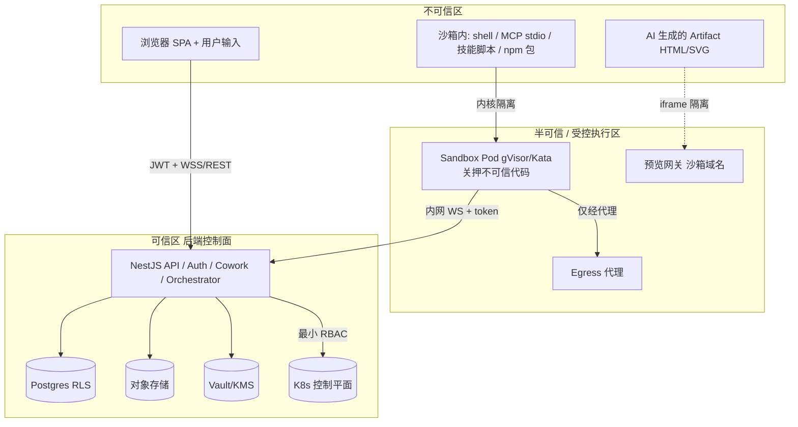
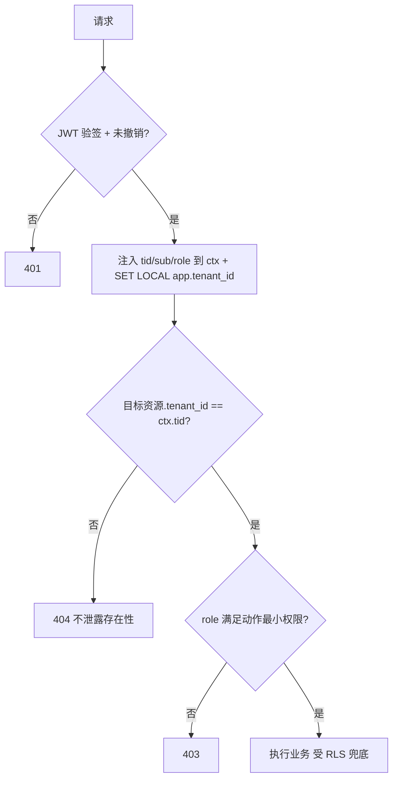
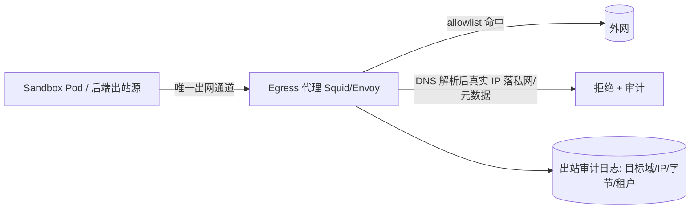

# 安全、合规与多租户隔离（安全总纲）

> 本文档是 LobsterAI SaaS 化改造的**安全总纲（Security Master）**：它把散落在各章的安全条款收敛为**单一事实源**。当其它文档（`05`/`07`/`08`/`09`/`10`/`12`）与本文冲突时，**以本文的安全基线为准**（业务/编排细节仍以各自主责文档为准）。读者：安全负责人、后端/平台工程师、SRE、合规/法务对接人，以及做渗透测试与发布门禁评审的人。
>
> 一句话立场：**LobsterAI 的核心是一个会替租户执行不可信代码（shell / MCP / 技能 / AI 生成产物）的多租户平台**。因此本文的第一性原理是"**假设沙箱内代码是敌对的、假设每个租户都想读到别人的数据**"，据此做纵深防御。
>
> **权威层对齐**：凡涉及跨文档拍死决策（RLS 强制、egress 放行、预览 CSP、扫描门控、合规删除/导出、计费、阶段门等），以**附录 C《决策基线与接口契约总纲》**为最终权威；本文已就其口径就地对齐，并以「见附录 C Dx / §x」指向，不复制大段 schema/DDL。

---

## 0. 阅读导航：本文与各章的权威边界

本文是"横切安全"的收敛点。为避免与各章重复或矛盾，明确谁定义什么：

| 安全议题 | 权威在本文（14）| 主责/落地细节在 |
|---|---|---|
| 威胁模型（总）、信任边界 | ✅ §1 | — |
| 隔离层次总览（网络/进程/文件/内核）| ✅ §2 | 编排落地见 `07` |
| 跨租户串数据防护（越权=404、tenant 过滤、RLS）| ✅ §3 | 令牌/RLS 落地见 `05`，落表见 `06` |
| Egress 出口与 SSRF 防护基线 | ✅ §4（权威）| Pod egress 代理见 `07`，MCP/预览见 `10`/`12` |
| 内容安全：沙箱域名 + CSP 基线 + iframe 隔离 + 签名 URL 边界 | ✅ §5（权威，12/08 引用本节）| 渲染细节见 `12`，对象存储见 `08` |
| 密钥与凭据管理（Vault/KMS/BYOK/轮换）| ✅ §6（权威）| 计费/模型 key 见 `09` |
| 输入校验与注入防护 | ✅ §7 | 各 API DTO 见 `04` |
| 供应链安全（MCP/技能扫描门控）| ✅ §8（门控红线）| 扫描引擎与流程见 `10` |
| 速率限制与滥用防护 | ✅ §9 | 配额/计费见 `09`，编排限流见 `07` |
| 审计日志 | ✅ §10 | 采集/存储见 `15` |
| 合规（留存/删除/导出/驻留）| ✅ §11（权威）| 存储级联删除见 `08`，账务见 `09` |
| 安全验收清单（渗透项）| ✅ §12（供 `16` 引用）| 测试执行见 `16` |

---

## 1. 威胁模型

### 1.1 核心资产（要保护什么）

| 资产 | 说明 | 泄露/破坏后果 |
|---|---|---|
| 租户业务数据 | 会话/消息/agent/记忆/工作区文件/artifact/技能配置 | 跨租户数据泄露（致命） |
| 身份与凭据 | 密码哈希、JWT/refresh、OAuth secret | 账户接管 |
| 平台密钥 | 上游模型 API key、S3/DB 凭据、JWT 签名私钥、云凭证 | 平台级沦陷、成本失控 |
| 计算资源 | 沙箱 Pod、节点 CPU/内存、出站带宽 | 拒绝服务、账单爆炸 |
| 云基础设施 | K8s 集群、节点、云元数据（IMDS）| 提权、横向移动、集群沦陷 |

### 1.2 信任边界



**关键信任边界**（每一条都是攻击者会尝试跨越的线）：
1. 浏览器 ↔ 后端：只信 JWT，不信 body/query 里的 `tenant_id`（见 `05` §6、本文 §3）。
2. 沙箱内代码 ↔ 宿主/其它租户：靠内核隔离 + 网络策略 + 文件隔离（§2）。
3. AI 产物 ↔ 主应用：靠独立沙箱域名 + CSP + iframe（§5）。
4. 沙箱 ↔ 外网/内网/云元数据：靠 egress 代理 allowlist（§4）。
5. 应用 ↔ K8s 控制平面：只有 Orchestrator 持写权，最小 RBAC（§2.4、见 `07` §3.1）。

### 1.3 威胁清单（STRIDE 视角，聚焦本平台特有面）

| 威胁 | 具体场景 | 主缓解（章节）|
|---|---|---|
| **不可信代码执行**（核心）| shell/MCP/技能在 Pod 内跑恶意逻辑 | 内核沙箱 + seccomp + 只读根（§2.1/2.2）|
| 跨租户越权（IDOR/横向）| 用 A 的令牌读 B 的会话/文件/artifact | JWT tid + RLS + 越权=404（§3）|
| SSRF / 云凭证窃取 | 沙箱内 `curl 169.254.169.254` 偷 IMDS | egress 代理禁元数据/内网（§4）|
| XSS / 数据外泄（内容）| AI HTML 读主应用 cookie 或 `fetch` 外发 | 沙箱域名 + CSP + 净化（§5）|
| 供应链投毒 | typosquatting npm / 恶意 skill | 受控 registry + 强制扫描门控（§8）|
| 密钥泄露 | env/headers 明文入库、日志打印 key | secref + KMS + 日志脱敏（§6/§10）|
| 提权/沙箱逃逸 | 容器逃逸控宿主 | gVisor/Kata + drop caps + 非 root（§2）|
| DoS / noisy neighbor | 打满 CPU/内存/带宽/请求 | ResourceQuota + 限流 + 配额（§9）|
| 会话/令牌攻击 | refresh 重放、会话固定、开放重定向 | rotation+reuse detection、白名单（见 `05` §3/§8）|
| 数据合规违规 | 未删除/未导出/驻留违规 | 删除权/导出/驻留流程（§11）|

### 1.4 明确的**非目标**（安全边界外，见 `13`）

- **不做** computer-use 桌面自动化、VM/后台浏览器——从根上移除这类高危不可信执行面。
- **不做** IM 渠道（GA 后续）——相关 connector 配置在 GA 主线仅记录不激活（见 `10` §6、`13`）。
- 不承诺防御拥有合法凭据租户对**自己**数据的滥用（那是滥用防护 §9 的范畴，不是隔离问题）。

---

## 2. 隔离层次（纵深防御）

隔离是**多层叠加**的：任一层被突破，下一层仍能困住攻击者。层次自内向外：内核 → 进程/权限 → 文件 → 网络 → 命名空间/配额 → 控制面 RBAC。

```mermaid
flowchart TB
  A[不可信代码 shell/MCP/skills/AI 产物] --> B[L1 进程权限: 非 root + drop ALL caps + 只读根 + no-privesc + seccomp]
  B --> C[L2 内核隔离: gVisor(runsc) 默认 / Kata 微 VM 企业档]
  C --> D[L3 文件隔离: 每租户 PVC + subPath + realpath/nosymfollow]
  D --> E[L4 网络隔离: NetworkPolicy 默认拒绝入站/横向]
  E --> F[L5 出口管控: Egress 代理 allowlist 禁元数据/内网]
  F --> G[L6 命名空间隔离: 每租户 namespace + ResourceQuota]
  G --> H[L7 控制面: Orchestrator 最小 RBAC + 租约 TTL]
```

> 本节给**安全基线（做什么、为什么）**；Pod 编排、生命周期、预热容量等**怎么做**见 `07-OpenClaw运行时编排与沙箱隔离.md`。以下 YAML 与 `07` §8 一致，此处作为安全权威重述。

### 2.1 内核隔离（L2）：gVisor / Kata（强制）

| 方案 | 隔离强度 | 用于 |
|---|---|---|
| 裸容器 runc | 弱（共享宿主内核）| **禁止**跑不可信代码 |
| **gVisor（runsc）** | 强（用户态内核拦 syscall）| **GA 主线默认**基线 |
| **Kata Containers** | 最强（每 Pod 独立微 VM）| 企业/高合规租户可选 |

- sandbox namespace 的所有 Pod **强制** `runtimeClassName: gvisor`；付费/企业可切 `kata`。
- 定期升级 gVisor/Kata 运行时以吸收逃逸补丁（纳入 §8 供应链与 `15` 运维）。

### 2.2 进程权限隔离（L1）：securityContext 基线（强制）

```yaml
securityContext:
  runAsNonRoot: true
  runAsUser: 10001
  allowPrivilegeEscalation: false
  readOnlyRootFilesystem: true          # 根只读；可写仅 /workspace /state /tmp(emptyDir sizeLimit)
  capabilities:
    drop: ["ALL"]
  seccompProfile:
    type: RuntimeDefault                 # 或自定义收紧 profile
automountServiceAccountToken: false      # 沙箱 Pod 不挂 SA token，禁止从 Pod 内调 kube-apiserver
```

红线：**只读根 + drop ALL caps + 非 root + 禁提权 + 不挂 SA token**。即便 shell 拿到执行权也无法提权、无法污染系统、无法调用 K8s API。

### 2.3 文件隔离（L3）

- **每租户物理隔离一个 PVC**；同租户多工作区共用 PVC 下不同 `ws-*` 子目录；跨租户绝不共享卷（见 `08` §6）。
- agent 只经 `subPath` 看到 `project/`，看不到 `.trash/`、`quota.json`、OpenClaw 内部 state（`MEMORY.md`/`SOUL.md` 等隔离到独立 state 卷，见 `08` §6.2）。
- **符号链接逃逸防护**：写/读前对最终目标 `fs.realpath` 校验仍在工作区根内；挂载启用 `nosymfollow`（由 `07` Pod 安全策略保证）。
- **路径穿越防护**：统一 `resolveWorkspacePath` 守卫（归一化 + `startsWith(root+sep)`），拒绝 `..`、绝对路径、盘符、NUL、URL 编码穿越（`%2e%2e%2f`）。此逻辑源自桌面端 `htmlPreviewServer.ts:282-285` 的 rootDir 校验并强化，权威落地在 `08` §5。

### 2.4 网络与命名空间隔离（L4/L6/L7）

- **NetworkPolicy 默认拒绝**入站（仅放行后端 Cowork Service 连 gateway 端口）与横向（Pod 间默认不可互通），杜绝跨租户/跨会话横向移动（YAML 见 `07` §8.3）。这样即使 `gateway.bind=0.0.0.0`（Pod 内），网络层仍等价于原 loopback 语义。**egress 亦默认拒绝，但须显式放行四类内网回调 + kube-dns**（见 §4.2 / 附录 C D8）。
- **每租户 namespace + ResourceQuota / LimitRange**：把租户的 CPU/内存/Pod 数封顶在其配额内。
- **Orchestrator 是唯一持 K8s 写权限的服务**，RBAC 最小化（仅 sandbox namespace 的 Pod/PVC/Secret），租约 TTL 防 Pod 泄漏（见 `07` §3）。

### 2.5 noVNC / 远程桌面调试边界

原容器改造计划使用 Xvfb + x11vnc/noVNC 暴露完整 Electron GUI。这只能作为**旧桌面 GUI 容器 PoC 或受控调试手段**，不得作为 GA Web SaaS 的产品入口。原因：

- noVNC 暴露的是完整远程桌面，权限边界远大于单个 Web 功能页面；
- 一旦入口认证或反代配置错误，攻击者可直接操作登录态应用、读写工作区、导出文件；
- GA 主线已经由浏览器 SPA + REST/WS 承载 UI，不需要像素流桌面入口。

强制规则：

| 场景 | 决策 |
|---|---|
| GA 用户入口 | 禁止暴露 noVNC；只走 Web SPA |
| V1 旧 GUI 兼容 PoC | 允许临时启用，必须内网/VPN、短期账号、TLS、强认证 |
| 生产排障 | 优先用结构化日志、trace、metrics、kubectl exec 受控命令；如必须远程桌面，需单次审批、限时开放、全程审计 |
| 镜像内容 | `lobster-openclaw-runtime` 默认不安装 Xvfb/noVNC；调试镜像必须独立 tag，不能混入生产镜像 |

---

## 3. 跨租户串数据防护（隔离的核心红线）

> 令牌体系、Prisma 全局过滤、RLS 策略的**完整实现**在 `05-认证与多租户账户.md` §6；本节把它上升为**平台级不可违反的红线**，并统一"越权即 404"的口径。RLS **强制 `FORCE`** 的决策与参考实现（会话变量 `app.tenant_id`/`app.user_id`、PgBouncer transaction 模式的 `SET LOCAL`、Prisma tenant extension 纵深）见**附录 C D2 / §5**。

### 3.1 三条不可违反的红线

1. **`tenant_id` 的唯一可信来源是 JWT 的 `tid`。** 任何业务查询/写入**禁止**从请求 body/query/header 读取 `tenant_id`。中间件从 JWT 取 `tid` 注入请求上下文，并写入 Postgres RLS 会话变量。
2. **越权一律返回 404，不返回 403。** 访问不属于当前租户的资源（会话/agent/文件/artifact/MCP/技能/分享）返回 `404 Not Found`，避免泄露"该资源存在于别的租户"这一存在性信息。
3. **双层过滤，任一失效不导致越权。** 应用层（Prisma tenant extension 自动注入 `where tenant_id`）+ 数据库层（所有 tenant-scoped 表一律 `ENABLE ROW LEVEL SECURITY` + **`FORCE`**，**无「可选 RLS」例外**）。应用连接用非 superuser、非 `BYPASSRLS` 角色；策略 `USING/WITH CHECK (tenant_id = current_setting('app.tenant_id')::uuid)`，参考实现见**附录 C D2 / §5**。

### 3.2 权限判定链（统一）



### 3.3 跨租户串数据红线清单（工程 checklist）

| 风险点 | 强制对策 | 验收（→ §12）|
|---|---|---|
| 从 body/query 取 tenant_id | 禁止；只信 JWT `tid` | PEN-ISO-2 |
| 直接对象引用 IDOR | 资源 id 用不可枚举 UUID；查询必带 tenant_id；越权=404 | PEN-ISO-1 |
| 连接池串上一个租户的 `SET` | `SET LOCAL`（事务级）+ 每请求独立事务 | PEN-ISO-3 |
| 关掉应用层过滤仍越权 | RLS `FORCE` 兜底；应用连接用非 superuser、非 BYPASSRLS 角色 | PEN-ISO-4 |
| 缓存/Redis key 无租户前缀 | 所有 key 前缀 `t:{tid}:`；会话流 Redis Stream/PubSub 频道统一为 `stream:{tenantId}:{sessionId}`，用户级频道为 `stream:{tenantId}:user:{userId}` | PEN-ISO-5 |
| 对象存储路径无租户前缀 | S3 key 强制 `tenants/{tid}/...`，服务端拼接，**绝不接受客户端传完整 key** | PEN-ISO-6 |
| 签名 URL 越权 | 对象级、限时效、绑定 tenant/session（§5.4）| PEN-CONTENT-3/4 |
| OpenClaw 工作区跨租户复用 | 每租户/每会话独立 Pod + PVC（`07`）；默认预热路径只预热节点/镜像/runtime/只读缓存，会话 Pod 创建时声明 PVC/ConfigMap/Secret，回收即销毁 | PEN-ISO-7 |
| 后台任务（BullMQ）丢租户上下文 | job payload 必带 tenant_id，worker 内重建 RLS 上下文 | PEN-ISO-8 |
| 日志/指标 label 泄露他租户内容 | 结构化日志带 tenant_id 但内容脱敏（§10）| — |

---

## 4. 网络出口（Egress）与 SSRF 防护

> 本节是**全平台 SSRF 防护的权威**：凡是"服务端/沙箱内代替租户发起的网络请求"——模型代理（`09`）、MCP `sse/http`（`10`）、技能/agent 的 web 抓取、预览网关/分享回源（`12`）、文件下载/URL 导入（`08`）——**都必须遵守本节**。桌面端已有的 `browserWebAccess.networkMode` / `ssrfPolicy`（`src/main/libs/openclawConfigSync.ts:1425-1448`，`BrowserNetworkMode.Strict`）是这套策略的直接前身，SaaS 化后**上升为集群级强制**。

### 4.1 SSRF 硬禁清单（默认拒绝）

任何出站请求解析出的目标 IP 落入以下范围**一律拒绝**（在代理侧做，且对 DNS 解析后的**真实 IP**判定，防 DNS rebinding）：

| 类别 | 范围 | 原因 |
|---|---|---|
| 云元数据 | `169.254.169.254`、`fd00:ec2::254`、`metadata.google.internal` 等 | 偷 IMDS 云凭证（最高危）|
| 链路本地 | `169.254.0.0/16`、`fe80::/10` | 元数据/邻居 |
| RFC1918 私网 | `10/8`、`172.16/12`、`192.168/16` | 打内网横向 |
| 回环 | `127.0.0.0/8`、`::1` | 打本机其它服务 |
| 唯一本地/保留 | `fc00::/7`、`0.0.0.0/8`、多播、`100.64/10` CGNAT | 内网/异常目标 |
| **IPv4-mapped IPv6** | `::ffff:0:0/96`（含 `::ffff:169.254.169.254`、`::ffff:10.x` 等） | 以 v6 形态绕过 v4 判定重达元数据/内网（对应 P2-6）|
| **NAT64 / 6to4 / IPv4-in-IPv6** | `64:ff9b::/96`（well-known）+ 本地 NAT64 前缀、`2002::/16`(6to4) | 内嵌 IPv4（如元数据）经 v6 通道重达（对应 P2-6）|
| **文档/基准保留段** | TEST-NET-1/2/3 `192.0.2.0/24`、`198.51.100.0/24`、`203.0.113.0/24`、基准 `198.18.0.0/15`、6to4 anycast `192.88.99.0/24` | 保留/异常目标，常用于绕过与探测（对应 P2-6）|

补充硬化：
- **判定前先做地址归一**：解析结果统一按 v4/v6 归一并**展开 IPv4-mapped / NAT64 内嵌地址**再比对 denylist，禁止用未归一字符串绕过（对应 P2-6）。
- **节点侧关 IMDS 或强制 IMDSv2（hop-limit=1）**，即使代理被绕过，Pod 也拿不到元数据（深度防御）。
- **禁重定向跟随到私网**：3xx 跳转目标也要过同一 allowlist。
- **禁非标准端口探测**（可选按域）：默认只放 80/443。

### 4.2 强制经审计型 Egress 代理



- **两类出站语义必须分开建模（见附录 C D8）**——原「仅放行 egress-proxy 端口 + DNS」口径过窄，会导致 Pod 内 gateway 一发模型请求/回调即被拒、会话跑不起来：
  - **外网出站** = 唯一经**审计 egress-proxy**（allowlist 优先 + §4.1 denylist 兜底），Pod 直连公网被 NetworkPolicy 拒绝；
  - **集群内控制面回调** = 允许 Pod 内 gateway **直连必需的内网 Service**（**不经 egress-proxy**），但用 NetworkPolicy 精确 `podSelector`/`namespaceSelector` 收敛到具体 Service，并**单独审计**。
- **必须显式放行的四类内网回调 + DNS**（`default deny` 之上，缺任一会话即不可用）：
  1. **模型 token 代理 Service**——**托管为独立 Service，非 Pod sidecar**（否则 Pod 持真实密钥），`baseUrl` 渲染为集群 DNS（见 §6.4、`09`）；
  2. **Cowork Service**——承接 AskUser 回调；
  3. **Media 回调 Service**；
  4. **MCP bridge 回调 Service**；
  5. **kube-dns**。
- 代理执行 **allowlist 优先 + §4.1 denylist 兜底**：默认仅放行已知模型上游、受控 npm/registry 镜像、明确白名单域。
- 代理记录**出站审计**（目标域名/IP、字节数、租户、会话）——同时服务于**安全溯源**与**计费**（`egress_bytes{tenant}`，见 `07` §10.2、`09`）。
- **npm/包拉取**（MCP stdio `npx`、技能依赖）走**内网私有 registry 镜像**，不直连公网 npm（供应链加固，见 §8、`10` §7）。

### 4.3 各出站源的落地约束（对齐各章）

| 出站源 | 约束 | 主责 |
|---|---|---|
| 模型代理 | 只出到受控上游模型端点；Pod 不持真实 key（§6.4）| `09` |
| MCP `sse/http` | 目标 URL 过 §4.1 allowlist；密钥 secref | `10` §4.1.1 |
| 技能/agent web 抓取 | 经代理 + allowlist；对齐桌面 `webFetch.ssrfPolicy`（`openclawConfigSync.ts:1450-1460`）| `10` |
| 预览网关/分享回源 | 只回源自有对象存储；产物内 `fetch` 由 CSP `connect-src 'none'` 阻断（§5.3）| `12` |
| 文件 URL 导入/下载 | 服务端下载器过 §4.1；限大小/超时/重定向 | `08` |

### 4.4 Allowlist 配置模型与审批流（对应 P2-6）

出站 allowlist 不是硬编码，而是**受审批的配置对象**（字段级 schema 以 `libs/shared/contracts` 为权威，见附录 C D1；此处只给要点，完整 schema 待接）：

- **配置维度**：平台级基线 allowlist（模型上游、私有 registry 镜像）+ 租户级追加项（租户自助申请的白名单域）。
- **schema 要点**：`{ scope: 'platform'|'tenant', tenantId?, domain, ports:[443], reason, requestedBy, approvedBy?, status:'pending'|'approved'|'revoked', createdAt, expiresAt? }`；`domain` 做规范化（小写、去尾点、拒通配裸 TLD）。
- **审批流**：租户追加项默认 `pending`，须平台安全管理员审批转 `approved` 才注入 egress-proxy 配置；变更即热更代理规则并记审计（§10）。平台基线变更走双人复核。
- **denylist 恒优先**：任何 allowlist 命中仍须过 §4.1 denylist（含 IPv4-mapped / NAT64 / 文档保留段），DNS 解析后按真实 IP 二次判定，禁 allowlist 绕过内网/元数据。

---

## 5. 内容安全（沙箱域名 + CSP + iframe + 签名 URL 边界）

> 本节是**用户/AI 生成内容渲染安全的权威**：`12-Artifacts与预览改造.md` 与 `08-文件工作区与对象存储.md` 的沙箱域名、CSP、iframe、签名 URL 约束**以本节为准**。核心资产：AI 生成的 HTML/SVG/文档天然不可信，是 Web 化后最大的 XSS/数据泄漏面。

### 5.1 独立沙箱域名（强制）

所有用户/AI 内容（Artifact 预览、HTML 分享、文件预览）**必须**从与主应用**不同注册域名**提供：

| 用途 | 域名 | 说明 |
|---|---|---|
| 主应用 | `app.lobsterai.com` | 持有登录态 cookie、调后端 API |
| 内容/预览沙箱 | `usercontent-lobsterai.com`（示例，独立注册域）| 承载不可信预览内容 |
| 公开分享站 | 独立域 / 子站（同沙箱域策略）| 公网访客访问的分享 |

红线：
- 沙箱域**不能**是主应用的可共享 cookie 子域（避免 `.lobsterai.com` 通配 cookie 泄漏）；推荐**完全不同的注册域名**。
- 沙箱域**不设**任何主应用登录 cookie；后端不接受来自沙箱域、无 REST access token 或有效短期 ticket 的凭据请求。

### 5.2 CSP 基线（预览/分享入口，强制）

预览网关返回 HTML 内容入口时**必须**带以下响应头（这是全平台 CSP 权威基线，`12` §4.1 引用本节）：

```
Content-Security-Policy:
  default-src 'none';
  script-src 'self' 'unsafe-inline' 'unsafe-eval' blob:;  # 补 'self'：放行文件型 HTML 的相对/外部 js 子资源(见附录 C D16)
  style-src  'self' 'unsafe-inline';                      # 补 'self'：放行文件型 HTML 的外部/相对 css(见附录 C D16)
  img-src    data: blob: https://usercontent-lobsterai.com;
  media-src  data: blob: https://usercontent-lobsterai.com;
  font-src   data: https://usercontent-lobsterai.com;
  connect-src 'none';                                   # 默认禁产物外发请求(防外泄/SSRF)
  worker-src blob:;                                     # 沙箱产物可用 Worker/Blob(见附录 C D16)
  base-uri   'none';                                    # 禁改 <base> 规避相对子资源鉴权
  form-action 'none';                                   # 禁表单外发
  frame-ancestors https://app.lobsterai.com;            # 仅主应用可嵌入(防点击劫持)
Cross-Origin-Resource-Policy: same-origin
Cross-Origin-Opener-Policy: same-origin
X-Content-Type-Options: nosniff
Cache-Control: no-store
```

- `connect-src 'none'` **默认阻断**产物 `fetch`/`XHR`/`WebSocket`——防数据外泄与二次 SSRF。确有联网需求按域最小化放开，并在验收中单列（PEN-CONTENT-6）。
- `script-src`/`style-src` 除 `unsafe-inline`/`unsafe-eval` 外**必须含 `'self'`（沙箱 host）**：文件型 HTML 预览的相对/外部子资源（`./app.js`、`./style.css`）是从沙箱域发起的同源子请求，缺 `'self'` 会被拦掉（原基线漏 `self`，验收 #1 必失败，见附录 C D16）。`unsafe-inline`/`unsafe-eval` 放开**仅限沙箱域**（因 AI 产物常内联脚本），**主应用域绝不放开**。
- `worker-src blob:` + `base-uri 'none'` + `form-action 'none'`：放行沙箱产物的 Worker/Blob，同时禁 `<base>` 改写规避子资源鉴权、禁表单外发（见附录 C D16）。
- `frame-ancestors` 限定只有主应用能嵌入；分享站禁止被任意页面嵌入。

### 5.3 iframe 隔离（强制）

- 主应用用**严格 sandbox** 嵌入沙箱域 URL：`sandbox="allow-scripts allow-popups allow-forms"`，**永不加 `allow-same-origin`**。
- inline HTML（`srcDoc`）同理：`sandbox="allow-scripts"`（不含 `allow-same-origin`）使 iframe 成为 **opaque origin**，脚本拿不到父页面存储/token。**`allow-same-origin` 在任何内容 iframe 中都是禁止项**（会让 srcDoc 回落父 origin，AI 脚本即可读主应用 token）。
- `referrerPolicy="no-referrer"`，避免 Referer 泄露签名 URL。

### 5.4 签名 URL 边界（强制，08/12 引用本节）

所有用户内容对象经**短时效 HMAC 签名 URL**提供，边界如下：

| 项 | 约定 |
|---|---|
| 作用域 | 单个对象 key（GET，或分片 PUT）；**禁止**前缀级/桶级 URL |
| 绑定与规范化串 | 签名对**固定顺序规范化串**计算：`v1\n{method}\n{tenantId}\n{sessionId}\n{artifactId}\n{path}\n{exp}\n{kid}`，`HMAC-SHA256`，密钥仅后端持有；字段顺序/分隔符固定，禁止乱序或省略以防歧义签名 |
| kid（密钥标识）| URL 携带 `kid`，服务端按 `kid` 选对应 HMAC 密钥校验——支持无缝轮换与多活密钥（配合 §6.5）|
| 统一 TTL | TTL 三档为**集中常量**（勿散落各处）：下载 `300s`、预览 `600s`、上传 PUT `900s`；`exp` 进规范化串，过期即 403 |
| 方法 | 读只签 GET；上传只签 PUT；**禁止**签 DELETE/List |
| 内容处置 | 下载类附 `response-content-disposition=attachment`，防 HTML 在存储域执行脚本 |
| 域隔离 | 用户内容存储域与应用主域分离（独立子域/桶），配合 §5.1/§5.2 |
| 密钥轮换 | 签名密钥按 `kid` 定期轮换（§6.5）；旧 `kid` 保留一个过期窗口以免打断在途 URL |

### 5.5 内容净化（强制）

- **SVG/HTML** 在渲染或分享前用 DOMPurify 净化（SVG 用 `USE_PROFILES:{svg:true,svgFilters:true}`）；分享侧沿用桌面端 `UnsafeSvg`（`HtmlShareErrorCode.UnsafeSvg=41312`，`src/shared/htmlShare/constants.ts`）拦截并记审计。
- **Markdown → HTML** 链路禁 raw HTML 或经 DOMPurify，防内嵌 `<script>`。
- **不可信文档转换**（DOCX/PPTX→PDF 若启用）必须在 **gVisor/Kata 隔离容器 + 无网络** 中进行（恶意文档处理是 RCE 面，见 `12` §4.6、本文 §2）。

### 5.6 内容安全分层小结

```mermaid
flowchart TB
  A[不可信产物 HTML/SVG/文档] --> L1[L1 独立沙箱域名 跨源隔离主应用]
  L1 --> L2[L2 签名URL 绑定租户/会话/过期]
  L2 --> L3[L3 严格CSP connect-src none / frame-ancestors]
  L3 --> L4[L4 iframe sandbox 无 allow-same-origin]
  L4 --> L5[L5 内容净化 DOMPurify]
  L5 --> L6[L6 存储前缀隔离 tenants/{id} + 路径穿越防护]
```

---

## 6. 密钥与凭据管理

> 本节是**平台密钥管理的权威**。原则：**任何密钥都不明文入业务库、不落沙箱磁盘、不进日志**；业务库只存**引用**（secref），真实值在 KMS/Vault，仅在使用点最短时机解引用。

### 6.1 密钥分类与存储

| 密钥类别 | 例子 | 存储 | 访问者 |
|---|---|---|---|
| 平台上游密钥 | 模型上游 API key、S3/DB 凭据 | KMS/Vault | 仅对应后端服务 SA |
| JWT 签名私钥 | RS256/EdDSA 私钥 | KMS（可 HSM 背书）| 仅 Auth 服务；公钥经 `/oauth/jwks` |
| 签名/HMAC 密钥 | 预览/分享签名密钥、桥 secret | KMS/Vault | 预览网关、Cowork |
| 租户级凭据（BYOK/MCP/技能）| 租户自带模型 key、MCP header token、技能配置密钥 | Vault（**信封加密**）| 解引用后仅注入对应租户沙箱 |
| 会话级短期凭据 | Pod gateway token、egress 代理 ticket | K8s Secret / 一次性下发 | 单 Pod/单会话，随回收失效 |

### 6.2 secref 引用模型（业务库只存引用）

业务库（Postgres）的 env/headers/config **只存引用**，不存明文（沿用 `10` §4.3 的 `env_secret_refs`/`header_secret_refs`）：

```jsonc
// mcp_servers.header_secret_refs
{ "Authorization": "secref://tenant/<tid>/mcp/<serverId>/authorization" }
// tenant_skills.config（密钥字段）
{ "smtpPassword": "secref://tenant/<tid>/skill/<skillId>/smtpPassword" }
```

- 写入：API 收到明文 → 存入 Vault → 库里落 `secref://...`；`GET` 接口**绝不回明文**（只回 `***` 或 secref 存在标记）。
- 下发：config sync 渲染进沙箱前才向 Vault 解引用，注入 Pod 内 env / K8s Secret；**Pod 不持有可读回明文的库记录**。

### 6.3 BYOK（Bring Your Own Key）加密

租户自带模型/服务密钥：
- **信封加密**：每租户一个数据密钥（DEK）加密其 BYOK，DEK 由 KMS 主密钥（KEK）加密；库只存密文 + DEK 引用。
- BYOK 仅在该租户的沙箱/模型代理调用点解密使用，**不跨租户、不落日志、不入指标**。
- 租户可自助轮换/撤销其 BYOK；撤销即刻使相关 secref 失效。

### 6.4 沙箱内不持真实上游 key（强制）

- 沙箱 Pod **不持有真实上游模型 key**：模型调用改指向**内网模型代理 Service**，Pod 仅拿会话级短期凭证（对齐 `07` §5.3/§5.4、`09`）。这样单个沙箱被攻破不会泄露平台上游 key。
- Pod gateway token 每 Pod 唯一（K8s Secret 注入 `OPENCLAW_GATEWAY_TOKEN`），随 Pod 回收失效。

### 6.5 轮换与撤销

| 密钥 | 轮换策略 | 撤销触发 |
|---|---|---|
| JWT 私钥 | 定期轮换，JWKS 双密钥重叠窗口 | 疑似泄露即刻换 + 强制全量重登 |
| 预览/分享 HMAC | 定期轮换 + 旧密钥过期窗口 | 泄露即换（在途 URL 尽快失效）|
| 平台上游 key | 定期轮换 | 泄露即换 + 排查 egress 审计 |
| 租户 BYOK/MCP/技能密钥 | 租户自助 | 成员移除/租户删除级联撤销 |
| Pod token/egress ticket | 每 Pod/会话即用即弃 | 会话结束/Pod 回收自动失效 |

---

## 7. 输入校验与注入防护

| 面 | 威胁 | 防护 |
|---|---|---|
| REST/WS 入参 | 类型污染、超长、非法枚举 | NestJS DTO + class-validator 白名单校验（见 `04`）；拒未知字段 |
| SQL | 注入 | 全量 Prisma 参数化；禁裸拼接；RLS 兜底 |
| 路径 | 目录穿越/symlink 逃逸 | `resolveWorkspacePath` 守卫 + realpath（§2.3，落地 `08` §5）|
| 命令（MCP stdio）| 任意命令注入 | 新建 `mcpCommandPolicy` 白名单（默认 `managed_npx_only`，拒任意二进制）；**勿复用现状 `commandSafety.ts`**——它只做危险命令分级，白名单是全新概念，撞名会误导（见附录 C A8）（§8、`10` §4.2）|
| SSRF | 服务端代发请求打内网 | §4 egress + IP allowlist（DNS 解析后判定）|
| XSS | 富文本/产物脚本 | 沙箱域 + CSP + DOMPurify（§5）|
| Prompt 注入 | 恶意技能/内容操纵 agent | 技能安装静态 prompt 审计（`scanPromptInjection`，`10` §5.4）；agent 输出经内容安全层渲染 |
| 反序列化/上传 | 恶意文件、超大 body | MIME/大小校验、分片上传预留、文档转换隔离（§5.5、`08` §4.4）|
| 头/Cookie | CSRF、开放重定向 | Bearer 免 CSRF + refresh 端点双提交；redirect_uri/return_to 严格白名单（`resolveSafeReturnTo` 思路，`src/main/libs/authLocalCallbackServer.ts:125`，见 `05` §8.3）|

---

## 8. 供应链安全（不可信扩展的门控红线）

> 扫描引擎与安装流程细节在 `10-MCP与技能改造.md`；本节确立**不可绕过的门控红线**。MCP 包 / Skills / Kits 都是**执行第三方代码**，是 SaaS 最大攻击面。

### 8.1 门控红线（强制）

1. **安装即扫描，扫描前不可执行**：新装 skill/MCP 包先 `pending_scan`，**未过门控绝不进 `SKILLS_ROOT` / 不被 gateway 加载**（从桌面端"建议式"升级为服务端"强制门控"，桌面现状 `installDisabled` 可选见 `skillSecurityTypes.ts:35`）。
2. **风险分级门控**（分清「单条 severity 权重」与「聚合 risk level」两层，勿混用，见附录 C A6）：
   - **单条命中 severity（权重）**：info=0 / warning=5 / danger=20 / critical=50（`skillSecurityScanner.ts:53-58`），仅作累加输入；
   - **聚合风险 level** 由 `riskScoreToLevel(总分)` 产出，取值只有 `safe/low/medium/high`（**没有 `critical` 这一 level**）；门控判定一律看聚合 level：
     - `safe/low` → 自动 `ready`；
     - `medium/high` → 需用户显式确认后 `ready`，否则保持 `blocked`（**`high` 不自动永久阻断**）；
     - 命中平台**禁用类规则**或超过策略阈值 → **默认 `blocked`**，仅企业租户管理员可强制放行且必记审计。
   - 订正：单条 data-exfiltration 命中经 `riskScoreToLevel(50)` 得 `high`（非 `blocked`），原文「critical(50 分)→阻断、普通租户无法启用」不成立。
3. **命令白名单**：stdio MCP 默认 `managed_npx_only` + `requireScan=true`，实现为**新模块 `mcpCommandPolicy.ts`**（**勿复用现状 `commandSafety.ts`**——它只做危险命令分级，白名单/`managed_npx_only`/`requireScan` 是全新概念，撞名会误导，见附录 C A8）；**永不**默认允许任意本地二进制（§7、`10` §4.2）。
4. **受控 registry + 完整性校验 + 版本锁定**：npm 只指向内网受控镜像；锁定 `resolved_version`；`latest` 变更需重扫（防投毒/版本漂移）。
5. **扫描器自身隔离**：ScanWorker 在受限沙箱内跑（防被恶意 skill 反制），保留熔断（`SCAN_TIMEOUT_MS` 等，`skillSecurityScanner.ts:13-16`）。
6. **执行只在沙箱**：控制面**永不** spawn 第三方代码；所有不可信执行落租户会话沙箱（与 `07`/`10` 一致的红线）。

### 8.2 供应链威胁 → 缓解

| 威胁 | 缓解（章节）|
|---|---|
| typosquatting / 投毒 npm 包 | 受控 registry 镜像 + 完整性校验 + 装后扫描 + 仅沙箱执行（§8.1、`10` §7）|
| 恶意 skill 脚本（外泄/危险命令）| 强制扫描门控 + critical 默认 blocked |
| prompt 注入技能 | 安装期 prompt 审计维度 |
| 依赖版本漂移到恶意版本 | 版本锁定 + 变更重扫 |
| 运行时（gVisor/Kata/基础镜像）已知漏洞 | 定期升级 + 镜像扫描（纳入 `15` CI/CD）|

---

## 9. 速率限制与滥用防护

> 配额/套餐的**结算权威**在 `09-模型代理与计费.md`；编排层并发/资源限流在 `07` §6。本节确立**安全视角的滥用防护基线**。

### 9.1 多层限流

| 层级 | 限制 | 实现 |
|---|---|---|
| 边缘/IP | 匿名接口（登录/注册/刷新）按 IP 令牌桶 | 网关/中间件 + Redis |
| 认证暴力破解 | 登录失败 IP+账户维度指数退避；HaveIBeenPwned 拒已泄露密码 | Auth（见 `05` §8.1）|
| 租户 API 速率 | 按套餐每租户 QPS/并发上限 | Redis 令牌桶（key `t:{tid}:`）|
| 每会话 turn 频率 | 令牌桶限 turn 提交速率 | Cowork + Redis |
| 并发沙箱 Pod | 按套餐（免费 1 / 标准 5 / 企业可配）| Redis `rt:tenant:{id}:count`（`07` §6.2）|
| 资源总量 | 每租户 namespace ResourceQuota | K8s |
| 帧大小 | `chat.send` 30MB 硬限（保留/收紧）| `openclawRuntimeAdapter.ts:123-126`（`07` §1.3）|
| 出站流量 | egress 字节计量 + 阈值告警 | egress 代理审计（§4.2）|
| 存储 | 每租户/工作区配额，超限 `413 QUOTA_EXCEEDED` | 文件服务（`08` §8）|

### 9.2 滥用检测与响应

- **异常信号**：登录失败激增、egress 突增、Pod 频繁重建、扫描 blocked 命中、跨租户 404 激增（探测行为）——进安全审计流（§10）并触发告警（`15`）。
- **响应手段**：软限流（排队/降级）→ 临时封禁 IP/租户 → 停用租户会话（撤销 refresh family，见 `05` §4.2）→ 人工介入。
- **超配额降级**：不是安全事故，按 `09` 降级策略（拒新写/提示升级），不影响读取与已有会话。

---

## 10. 审计日志

> 审计的**采集/存储/告警管道**在 `15-部署运维与可观测性.md`；本节定义**必审事件与审计不可抵赖要求**。

### 10.1 必审事件（安全相关，不可缺）

| 类别 | 事件 |
|---|---|
| 认证 | 登录成功/失败、refresh 轮换/重放检测触发、登出、改密/重置、MFA |
| 授权 | 越权访问尝试（返回 404 的跨租户访问）、role 变更、租户切换 |
| 平台特权 | superadmin 的一切跨租户操作（谁/何时/对哪个租户/做了什么）|
| 编排 | Orchestrator 创建/删除 Pod（租户/会话/节点）、租约签发/回收 |
| 密钥 | 密钥读取（解引用）、轮换、撤销、BYOK 变更 |
| 供应链 | skill/MCP 安装、扫描结果、blocked/强制放行 |
| 出站 | egress 代理拦截（元数据/内网/非白名单）与放行摘要 |
| 内容 | 分享创建/停用（含 moderation）、UnsafeSvg 拦截 |
| 合规 | 数据导出请求、删除请求、留存到期清理 |

### 10.2 审计要求

- **结构化 + 带 `tenant_id`/`actor`/`sessionId`**，但**内容脱敏**（不落 token/apikey/密码/用户文件内容）。
- **不可抵赖**：审计流独立于业务日志，写入只追加存储，权限最小化；superadmin 操作**双人复核或事后强制留痕**（见 `05` §5.1）。
- **留存**：审计日志留存期满足合规（§11），独立于应用日志的 7 天短留存。

---

## 11. 合规（数据留存 / 删除权 / 数据导出 / 数据驻留）

> 目标：满足 GDPR 等法规的端到端可执行流程。存储级联删除细节见 `08` §8，账务保留见 `09`。

### 11.1 数据分类与留存

| 数据类 | 留存策略 | 删除影响 |
|---|---|---|
| 账户/身份 | 账户存续期间保留；注销后按流程删除 | 触发级联 |
| 会话/消息/工作区/artifact | 租户可删；租户注销级联删除 | 见 §11.3 |
| 审计日志 | 合规要求的最短留存期（如数月~数年）| 例外：删除权下的**合法保留**（见下）|
| 账单/发票 | 依税务/财务法规保留（通常数年）| 删除权不豁免账务保留义务 |
| 备份 | 有限窗口（见 `08` §8.3 / `15` DR）| 删除需覆盖备份窗口内的对象 |

原则：**删除权与法定保留义务冲突时**，对账务/审计做"**匿名化/最小保留**"而非物理删除，并在隐私政策中声明。

### 11.2 数据导出（可携带权）

```mermaid
flowchart LR
  U[租户/用户请求导出] --> API[POST /api/v1/privacy/export]
  API --> Q[BullMQ 导出任务]
  Q --> COLLECT[汇集: 会话/消息/agent/工作区/技能配置(脱密)/账单摘要]
  COLLECT --> PKG[打包 tar.zst 到 tenants/{tid}/exports/]
  PKG --> URL[签发短时签名 URL(§5.4) 通知用户]
```

- 导出内容按 `tenant_id` 严格过滤（RLS）；密钥/BYOK **不导出明文**（导出为存在标记）。
- 导出包受 §5.4 签名 URL 边界；仅请求者可下载，短时效。
- **端点与幂等**：`POST /api/v1/privacy/export` 以 `exportId` 幂等——重复请求返回同一进行中/已完成任务；字段级契约以 `libs/shared/contracts` 为权威（见附录 C D1）。

### 11.3 删除权（被遗忘权）端到端

```mermaid
flowchart TB
  R[删除请求 用户/租户注销] --> V{re-auth / owner 校验}
  V --> SOFT[软删除 + 撤销全部会话(refresh family)]
  SOFT --> GRACE[宽限期(如 30 天) 可撤回]
  GRACE --> HARD[硬删除任务 BullMQ]
  HARD --> D1[DB: 级联删 tenants/{tid} 所有业务行]
  HARD --> D2[对象存储: 删 tenants/{tid}/ 全前缀(含 shares/exports/backups)]
  HARD --> D3[PVC: 卸载并删该租户卷子树]
  HARD --> D4[Vault: 销毁该租户全部 secref/BYOK]
  HARD --> D5[Redis/缓存: 清 t:{tid}:* 与路由项]
  HARD --> LEGAL[账务/审计: 匿名化保留(法定义务)]
  LEGAL --> CONFIRM[出具删除完成凭证]
```

- **REST 端点**（字段级契约以 `libs/shared/contracts` 为权威，见附录 C D1）：
  - `POST /api/v1/privacy/delete`——发起软删除，body `{ scope:'tenant'|'user', subjectId, reason }`，返回 `{ deletionId }`；
  - `GET  /api/v1/privacy/delete/:deletionId`——查询进度与各子系统部分失败明细。
- **六子系统级联顺序（固定，先断访问面再删数据）**：① 撤销令牌/会话（`05` §4.2）→ ② Redis 缓存/路由清 `t:{tid}:*` → ③ Vault 销毁全部 secref/BYOK → ④ 对象存储删 `tenants/{tid}/` 全前缀（含 shares/exports/backups）→ ⑤ PVC 卸载并删卷子树 → ⑥ Postgres 业务行级联删；审计做**内容匿名化保留**（法定义务，不进物理级联删）。
- **部分失败与幂等**：删除任务逐子系统记状态（`pending/done/failed`），失败子系统单独重试、**不回滚已完成项**；每子系统操作**幂等**（重复执行等价一次），任务整体以 `deletionId` 幂等；全部 `done` 才置删除完成。
- **删除凭证**：全部子系统 `done` 后出具**签名删除完成凭证**（含 `deletionId/subjectId/完成时间/各子系统摘要`，服务端 `kid` 签名可校验），并审计留痕。
- **撤销联动**：删除即撤销该租户全部会话与令牌（见 `05` §4.2）。

### 11.4 数据驻留（Data Residency）

- 支持**按租户绑定区域**（如 EU 租户数据只落 EU 区 DB/对象存储/沙箱节点池）。
- 实现锚点：租户实体带 `region`；DB/对象存储/K8s 节点池按 region 分片；路由与 config sync 按租户 region 选择后端与存储端点。
- 跨区数据流动（如全局审计聚合）需做**区域内脱敏/最小化**后再聚合。

### 11.5 法务合规基线（ToS / AUP / 内容政策 + 注册同意采集，对应 P1-14①）

平台替租户执行不可信代码并承载用户/AI 产物，须有可执行的法务合规载体（**完整法务文本由法务出稿，此处只定工程锚点**）：

- **三份带版本号的政策**：**服务条款（ToS）**、**可接受使用政策（AUP，明列禁止用途：攻击/滥用/违法内容/规避计费等）**、**内容政策（用户/AI 产物的分享与下架口径，对齐 §10 moderation、`13`）**；任一版本升级需重新同意。
- **注册同意采集**：注册 / 接受邀请时强制同意并落库——`users.terms_version` + `users.terms_accepted_at`、`tenants.terms_version`（**字段权威见附录 C §4 身份表 DDL / D3**，本文不复制 DDL）。未采集同意的账户不得进入业务流。
- **版本变更再同意**：ToS/AUP 版本升级后，登录态用户下次进入须再次同意方可继续；旧同意记录保留供审计。
- **AUP 违规联动**：命中 AUP 违规（滥用检测 §9.2、分享 moderation §10）走停用 / 下架 + 审计（§10.1 合规类）。

---

## 12. 安全验收清单（渗透测试项，供 `16` 引用）

> 本清单是发布门禁的一部分；`16-测试策略与验收标准.md` 引用这些编号纳入测试计划。每项给出**测试动作**与**通过判定**。

### 12.1 租户隔离（ISO）

| 编号 | 测试动作 | 通过判定 |
|---|---|---|
| PEN-ISO-1 | 用租户 A 令牌请求 B 的会话/agent/文件/artifact/MCP/技能/分享 id | 全部返回 **404** |
| PEN-ISO-2 | 请求 body/query/header 篡改 `tenant_id` 为他租户 | 无效，仍按 JWT `tid` 作用；不越权 |
| PEN-ISO-3 | 高并发跨租户请求，验证连接池不串 `SET LOCAL` | 无跨租户数据可见 |
| PEN-ISO-4 | 关闭应用层 Prisma 过滤（红队）后跨租户读写 | RLS 仍拒绝（0 行/报错）|
| PEN-ISO-5 | 检查 Redis/缓存/Pub-Sub key 前缀 | 缓存 key 均含 `t:{tid}:`；会话流为 `stream:{tenantId}:{sessionId}`；用户级事件为 `stream:{tenantId}:user:{userId}` |
| PEN-ISO-6 | 尝试传入完整/他租户 S3 key、签前缀级 URL | 拒绝；key 仅服务端按 `ctx.tid` 拼接 |
| PEN-ISO-7 | 会话 A 沙箱内读/写会话 B 的 PVC 子路径 | 越权读写被拒（探针脚本）|
| PEN-ISO-8 | 触发带 tenant 的 BullMQ 任务，worker 内越权查询 | 受 RLS 约束，无越权 |

### 12.2 沙箱与网络（SANDBOX / NET）

| 编号 | 测试动作 | 通过判定 |
|---|---|---|
| PEN-SBX-1 | Pod 内尝试提权 / 写系统路径 / `sudo` | 全部失败（非 root + 只读根 + drop caps）|
| PEN-SBX-2 | Pod 内尝试调用 kube-apiserver / 读 SA token | 无 SA token，调用失败 |
| PEN-SBX-3 | 已知 gVisor/Kata 逃逸 PoC | 无法逃逸到宿主/其它 Pod |
| PEN-SBX-4 | 扫描生产 Ingress/Service 是否暴露 noVNC/x11vnc/调试端口 | 默认无暴露；临时调试入口必须有审批、强认证、过期时间与审计 |
| PEN-NET-1 | Pod 内 `curl 169.254.169.254`（IMDS）| 被 egress 代理 + NetworkPolicy 拒绝 |
| PEN-NET-2 | Pod 内访问 RFC1918 内网 / 另一 Pod IP | 拒绝（默认拒绝入站/横向）|
| PEN-NET-3 | DNS rebinding：域名解析到私网 IP | 代理按解析后真实 IP 拒绝 |
| PEN-NET-4 | 出站到非白名单域 | 被 egress allowlist 拒绝并审计 |

### 12.3 内容安全（CONTENT）

| 编号 | 测试动作 | 通过判定 |
|---|---|---|
| PEN-CONTENT-1 | 预览 iframe 内脚本读主应用 cookie/localStorage/API token | 无法读取（跨源 + opaque origin）|
| PEN-CONTENT-2 | 检查任何内容 iframe 是否含 `allow-same-origin` | 永不出现（代码审查 + DOM 断言）|
| PEN-CONTENT-3 | 签名 URL 过期后访问 | 返回 403 |
| PEN-CONTENT-4 | 篡改签名 URL 的 tenant/path | 返回 403；无法越权取他租户对象 |
| PEN-CONTENT-5 | 注入含 `<script>` 的 SVG/HTML/Markdown 产物 | 净化拦截或不执行（无 XSS 触发）|
| PEN-CONTENT-6 | 产物内 `fetch('/api/..')` 或外发请求 | 被 CSP `connect-src 'none'` 阻断（除显式白名单）|
| PEN-CONTENT-7 | 尝试用任意页面 iframe 嵌入分享站/预览 | 被 `frame-ancestors` 拒绝（防点击劫持）|

### 12.4 认证与令牌（AUTH）

| 编号 | 测试动作 | 通过判定 |
|---|---|---|
| PEN-AUTH-1 | 重放已 rotated 的 refresh token | 整个 refresh family 被撤销、强制重登（见 `05`）|
| PEN-AUTH-2 | 登出后使用旧 access（在 `sid` 撤销集）| 失效 |
| PEN-AUTH-3 | 开放重定向：篡改 redirect_uri/return_to | 白名单外一律拒绝 |
| PEN-AUTH-4 | 检查密码存储与令牌落库 | Argon2id 存密码、refresh 存哈希、无令牌进 URL/日志/localStorage |
| PEN-AUTH-5 | CORS `*` + credentials 组合探测 | 不存在；仅放行自建 app origin |

### 12.5 供应链与密钥（SUPPLY / SECRET）

| 编号 | 测试动作 | 通过判定 |
|---|---|---|
| PEN-SUP-1 | 安装单条 data-exfiltration 命中的 skill | 聚合 `riskScoreToLevel(50)` 得 `high`：需用户显式确认方可 `ready`（**非默认 blocked、普通租户确认后可启用**）；仅命中禁用类规则/超阈值才 blocked（见附录 C A6）|
| PEN-SUP-2 | 提交 `command=/bin/sh` 的 stdio MCP | 返回 422（新 `mcpCommandPolicy` 白名单拒，非复用 `commandSafety`），不落地（见附录 C A8）|
| PEN-SUP-3 | 未过扫描的 skill/MCP 是否被加载 | 否（pending_scan 不进 SKILLS_ROOT/不加载）|
| PEN-SUP-4 | 生产安装链路尝试直连公网 npm / 未授权 registry | 被拒；只能走平台受控 registry/private mirror |
| PEN-SUP-5 | 安装 `latest`、裸 range、缺 integrity 或不确定 git URL | 被拒；必须解析为 name@version + tarball integrity + lockfile |
| PEN-SUP-6 | 包含 `postinstall`/lifecycle script 的包 | 默认 `npm --ignore-scripts`；仅 allowlist 包在隔离安装沙箱执行 |
| PEN-SUP-7 | 租户私有/未审核包尝试进入共享缓存 | 被拒；只进租户级缓存，缓存 key 含 integrity + 扫描策略版本 |
| PEN-SUP-8 | 扫描规则/CVE/registry 元数据变更后运行旧包 | 旧包进入 `needs_rescan`；运行前阻断或降级 |
| PEN-SECRET-1 | 查 DB 中 env/headers/config 密钥字段 | 均为 secref，无明文 |
| PEN-SECRET-2 | `GET` 配置接口是否回明文密钥 | 否（`***`/存在标记）|
| PEN-SECRET-3 | 从沙箱 Pod 尝试获取真实上游模型 key | 拿不到（Pod 仅持会话级短期凭证）|

### 12.6 滥用与合规（ABUSE / COMPLIANCE）

| 编号 | 测试动作 | 通过判定 |
|---|---|---|
| PEN-ABUSE-1 | 登录接口暴力破解 | 指数退避 + 已泄露密码拒绝 |
| PEN-ABUSE-2 | 超并发 Pod / 超配额写入 | 优雅排队/`413`，不影响他租户，不打爆 K8s API |
| PEN-ABUSE-3 | 跨租户 404 探测激增 | 触发滥用告警 |
| PEN-ABUSE-4 | 新建公开 HTML share | 默认 `noindex,nofollow`；未显式允许不被搜索引擎索引 |
| PEN-ABUSE-5 | 举报/管理员/系统下架公开分享 | `disabled_source=moderation/admin/system` 落审计；CDN 缓存失效 p95 < 5 分钟 |
| PEN-ABUSE-6 | 分享创建/更新/访问/访问码爆破 | tenant/IP 限流生效；套餐分享数量/大小限制生效 |
| PEN-ABUSE-7 | 分享内容含 phishing 关键词、恶意 SVG/JS、敏感目录或未授权外链 | critical 默认 blocked；敏感目录不被打包；外链按 CSP/allowlist 阻断 |
| PEN-ABUSE-8 | 分享页尝试外联接口或加载第三方脚本/CDN | 默认 CSP `connect-src 'none'` 阻断；显式 allowlist 外才可访问 |
| PEN-COMP-1 | 数据导出请求 | 仅本租户数据、无密钥明文、签名 URL 限时 |
| PEN-COMP-2 | 删除/注销后核查残留 | DB/对象存储/PVC/Vault/Redis 全前缀清空；账务/审计匿名化保留 |
| PEN-COMP-3 | EU 租户数据落区 | 数据仅落绑定 region 的存储/节点池 |

---

## 13. 交叉引用

- 认证、令牌、RLS、RBAC、越权=404 的完整实现：`05-认证与多租户账户.md`
- 数据模型落 `tenant_id`、RLS 迁移脚本：`06-数据模型迁移.md`
- 沙箱编排、gVisor/Kata、NetworkPolicy、egress 代理、securityContext YAML：`07-OpenClaw运行时编排与沙箱隔离.md`
- 每租户 PVC、对象存储前缀、路径安全守卫、签名 URL 落地、级联删除：`08-文件工作区与对象存储.md`
- 模型代理（Pod 不持真实 key、出站受控）、配额/计费、账务保留：`09-模型代理与计费.md`
- MCP/技能供应链、commandSafety、扫描引擎与门控流程：`10-MCP与技能改造.md`
- Artifact 预览网关、CSP、iframe、沙箱域名（渲染细节）：`12-Artifacts与预览改造.md`
- 功能取舍（不做 computer-use/VM、IM 后续）：`13-功能取舍与降级清单.md`
- 审计采集、告警、CI/CD 镜像扫描、DR：`15-部署运维与可观测性.md`
- 安全验收编号纳入测试计划：`16-测试策略与验收标准.md`
- 安全风险登记：`18-风险登记册.md`
- IPC→REST/WS 通道映射：`附录A-IPC通道与接口映射.md`
