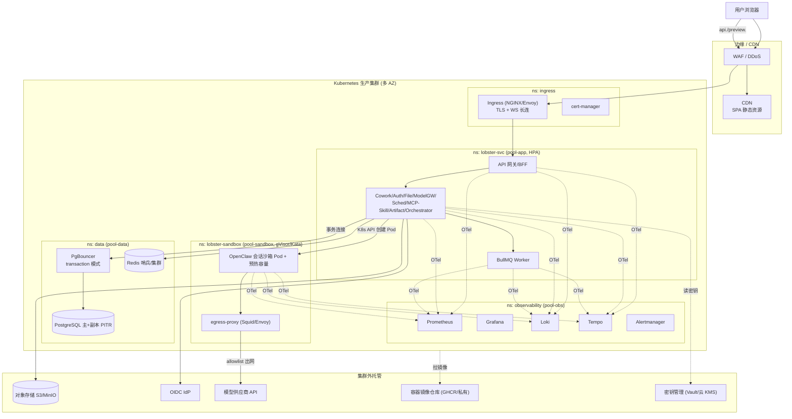
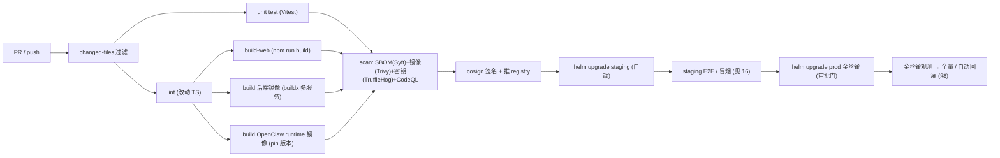
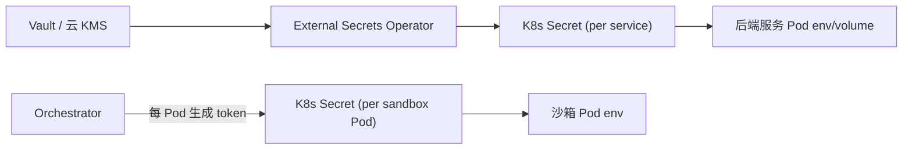
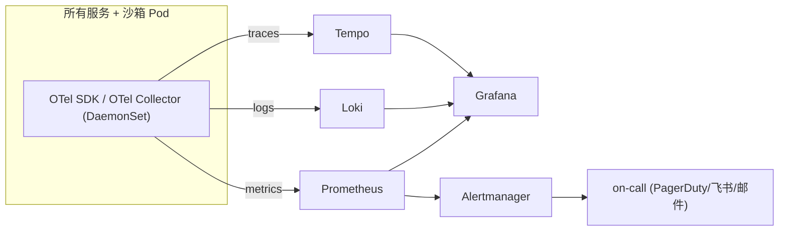
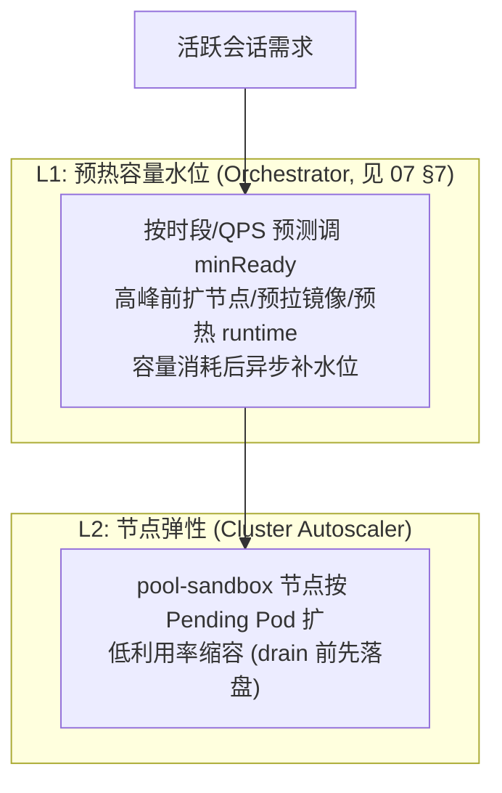
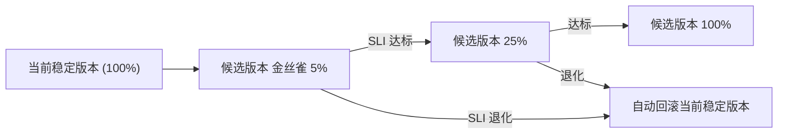

# 部署、运维与可观测性

> 本文档面向 SRE / 平台工程师、DevOps、发布负责人与运维值班（on-call），说明 LobsterAI 从「单机 Electron 桌面应用 + electron-builder 打包分发」改造为「多租户 SaaS Web 应用」后，如何在 Kubernetes 上**构建镜像、编排部署、管理配置与密钥、观测、扩缩容、备份容灾、发布回滚**。本章是把 `02-目标架构与技术选型.md` 的蓝图与 `07-OpenClaw运行时编排与沙箱隔离.md` 的沙箱契约落到「可运行、可运维、可观测的生产系统」的操作总纲。安全隔离基线以 `14-安全合规与多租户隔离.md` 为准，本章只在部署/运维视角引用；本域专有的沙箱指标见 `07` §11，此处做全局收敛。

---

## 0. 本章边界与前置约束

本章**只**回答「东西怎么部署、怎么运行、怎么观测、怎么救」，不重复各域的功能设计。

> 本章涉及的跨文档决策（RLS 强制与连接层、`--bind` 语义、流式事件全集、阶段门 V1–V6 命名）以 `附录C-决策基线与接口契约总纲.md` 为权威；凡本章与其冲突，以附录 C 为准。本章据此已就地订正 PgBouncer 一等组件（附录 C D2/§5）、沙箱入口与 `--bind`（`gateway-launcher.cjs` 仅 Windows 运行期生成）、`30MB` WS 帧硬限量纲（附录 C §2-B15）、`chat.send` 续接语义（附录 C D6）。

硬约束（承接 `02`）：

| 维度 | 约束 | 来源 |
|---|---|---|
| 部署形态 | 多租户 SaaS，单区域多可用区起步 | `02` §2 |
| 编排平台 | Kubernetes；沙箱与应用**物理分节点池** | `02` §2.2、`07` §8 |
| CI/CD | GitHub Actions（构建/测试/扫描/发镜像）+ Helm（部署编排） | `02` §4.10 |
| 可观测 | OpenTelemetry → Prometheus + Grafana + Loki + Tempo | `02` §4.9 |
| 配置差异 | 全由 Helm values 驱动，代码内**无环境分支** | `02` §6.1 |
| 环境 | dev / staging / prod 一套 chart + 差异 values | `02` §6.1 |

> 现状对照：现在的「部署」= `electron-builder` 打三平台安装包（`npm run dist:mac|win|linux`），用户本地安装、`autoUpdater` 经 `api-overmind.youdao.com/.../update` 拉更新（`src/main/libs/endpoints.ts:41`）。SaaS 化后，**桌面打包链路整体退役**，取而代之的是「Web 前端静态产物 + 后端服务镜像 + OpenClaw 运行时镜像」三类产物 + 集群发布。桌面打包取舍详见本章 §3.6。

---

## 1. 环境与拓扑

### 1.1 环境矩阵（dev / staging / prod）

承接 `02` §6.1，把配置面拉平到运维视角：

| 维度 | dev | staging | prod |
|---|---|---|---|
| 集群 | kind/minikube 或共享 dev 集群 | 独立集群/命名空间 | 独立集群，多可用区（≥3 AZ） |
| 沙箱运行时 | 普通容器（降级，提速开发） | gVisor/Kata（与 prod 对齐） | gVisor 默认 / Kata 企业档（强制，见 `07` §8.1） |
| PostgreSQL | 单实例（Docker/Operator） | 主+副本，日备 | 主+只读副本，PITR，跨 AZ |
| Redis | 单实例 | 哨兵 | 集群/哨兵 |
| 对象存储 | 本地 MinIO | MinIO 集群 / 云 S3 | 云 S3 / MinIO 多副本 |
| 模型供应商 | mock / 小额真 key | 真 key（限额） | 生产 key，配额+计费开启（`09`） |
| 域名 | `*.dev.local` | `staging.<domain>` | `<domain>`、`api.<domain>`、`preview.<domain>` |
| 可观测 | 轻量（本地 Prometheus/Grafana） | 全栈（低采样） | 全栈 + 告警 + on-call |
| 发布策略 | 直接 `helm upgrade` | 蓝绿/金丝雀预演 | 金丝雀 → 全量 + 自动回滚（§8） |

### 1.2 生产集群命名空间划分

沿用 `02` §2.2 的四类命名空间，补充运维职责与配额边界：

| 命名空间 | 内容 | 节点池 | 运维要点 |
|---|---|---|---|
| `ingress` | Ingress Controller、cert-manager、外部 DNS | 边缘节点 | 公网入口、TLS 终止、WS 长连保活 |
| `lobster-svc`（= `02` 的 `app`） | 全部无状态后端服务 + BullMQ worker | 通用节点池 | HPA 弹性；滚动更新 |
| `lobster-sandbox`（= `02` 的 `sandbox`） | OpenClaw 会话沙箱 Pod + 预热容量 | **专用节点池** gVisor/Kata RuntimeClass | 默认拒绝出网；Cluster Autoscaler；成本大头 |
| `data` | PostgreSQL、Redis（若自托管） | 有状态节点池 | 反亲和 + 持久卷 + 备份 |
| `observability` | Prometheus、Grafana、Loki、Tempo、Alertmanager | 通用/独立节点池 | 与业务隔离，避免观测栈与业务争资源 |

> **租户隔离模型（二选一，就地定死）**：GA 主线采用**每租户独立 sandbox namespace**（`sandbox-<tenantId>`，`lobster-sandbox` 仅为该 namespace 家族/前缀与 dev 简化档名），与 `07` §6.2 / `14` §L6「每租户 namespace + ResourceQuota」一致；**不采用**单一共享 `lobster-sandbox` + 纯标签分租户（该形态仅用于 `values-dev`）。据此固定三处作用域：
> - **NetworkPolicy 作用域**：编排器创建每个 `sandbox-<tenantId>` 时套用同一 default-deny（入站 + Pod 间横向）+ 定向放行模板（`07` §8.3）；跨 namespace 默认不可达，跨租户横向由 namespace 边界与 NetworkPolicy 双重阻断。
> - **RBAC 作用域**：Orchestrator ServiceAccount 用一个 ClusterRole（`pods/pvc/secrets/networkpolicies/resourcequotas` 动词）+ 只绑定到 `sandbox-*` namespace 的 RoleBinding 模板（每建租户 namespace 即绑定），**不授予集群级通配写权**；沙箱 Pod 自身挂无 SA token（`07` AC-3）。
> - **配额作用域**：`ResourceQuota` / `LimitRange` 为 namespace 级，天然 per-tenant（`07` §6.2、`14` §L6）。
> - **代价与回退**：namespace 数随租户线性增长（etcd/RBAC 对象规模、apiserver 压力），须纳入容量规划与命名治理；超大规模（万级租户）时回退到「单 `lobster-sandbox` + `tenant-id` 标签 + 编排器应用层 per-tenant 配额」，届时 NetworkPolicy 用标签 selector、RBAC 收敛为单 namespace 作用域。命名策略与 `05`/`14` 一致。

### 1.3 节点池规划

| 节点池 | 承载 | RuntimeClass | 关键配置 |
|---|---|---|---|
| `pool-edge` | Ingress、WAF sidecar | runc | 公网暴露，弹性 IP |
| `pool-app` | 后端服务、worker | runc | HPA 目标；spot/按需混合可选 |
| `pool-sandbox-gvisor` | 沙箱 Pod（默认档） | `gvisor` | taint `sandbox=true:NoSchedule`；沙箱 Pod 加 toleration；**禁用 IMDS / 强制 IMDSv2**（防元数据窃取，见 `07` §8.4、`14`） |
| `pool-sandbox-kata` | 沙箱 Pod（企业/高合规档） | `kata` | 内存开销大，独立扩缩；仅企业租户调度 |
| `pool-data` | PG/Redis | runc | 本地 NVMe / 高 IOPS 卷，反亲和 |
| `pool-obs` | 观测栈 | runc | 独立，避免观测 OOM 影响业务 |

沙箱节点池用 taint/toleration + nodeSelector 保证**沙箱 Pod 绝不与应用服务同节点**（多租户安全核心，`14`）。

### 1.4 拓扑总览图



---

## 2. 容器镜像清单

改造后产物分三类：**前端静态**、**后端服务镜像**、**OpenClaw 运行时镜像**。全部 pin 版本、多架构、带 SBOM 与签名。

### 2.1 镜像总表

| 镜像 | 内容 | 基础镜像 | 构建入口 | 部署位置 |
|---|---|---|---|---|
| `lobster-web`（可选打镜像） | Vite 构建产物 `dist/` + nginx 静态服务 | `nginx:alpine` 或直接上传对象存储 + CDN | `npm run build` → `dist/` | CDN（首选）或 `ingress` 侧 nginx |
| `lobster-gateway` | API 网关/BFF（NestJS） | `node:24-slim`（对齐 Node `>=24.15.0 <25`） | monorepo `apps/gateway` | `lobster-svc` |
| `lobster-cowork` | Cowork 会话服务 | 同上 | `apps/cowork` | `lobster-svc` |
| `lobster-auth` | 认证与租户服务 | 同上 | `apps/auth` | `lobster-svc` |
| `lobster-file` | 文件工作区服务 | 同上 | `apps/file` | `lobster-svc` |
| `lobster-modelgw` | 模型网关 + 计费（`09`） | 同上 | `apps/modelgw` | `lobster-svc` |
| `lobster-sched` | 调度服务（`11`） | 同上 | `apps/sched` | `lobster-svc` |
| `lobster-mcpskill` | MCP / 技能服务（`10`） | 同上 | `apps/mcpskill` | `lobster-svc` |
| `lobster-artifact` | Artifact / 预览服务（`12`） | 同上 | `apps/artifact` | `lobster-svc` |
| `lobster-orchestrator` | 运行时编排器（`07`） | 同上 + kube client | `apps/orchestrator` | `lobster-svc`（唯一持 K8s 写权限） |
| `lobster-worker` | BullMQ worker（异步作业/定时触发） | 同上 | `apps/worker` | `lobster-svc` |
| **`lobster-openclaw-runtime`** | OpenClaw gateway 运行时（沙箱主容器） | 见 §2.3 | 见 §2.3 云化改造 | `lobster-sandbox` |
| `lobster-configsync`（initContainer） | 渲染 `openclaw.json` + 工作区文件（`07` §5） | `node:24-slim` + 抽出的 `openclawConfigSync` 纯逻辑 | `apps/configsync` | 沙箱 Pod 的 initContainer |
| `lobster-egress-proxy` | 审计型出站代理（`07` §8.4） | Squid/Envoy 官方镜像 + 配置 | 配置化 | `lobster-sandbox` |

> **后端 monorepo 分层构建**：所有 `lobster-*`（NestJS）共享一个 base 层（`node:24-slim` + 生产依赖 + 编译产物），各服务只叠自己的 entrypoint，显著减小体积与拉取时间（呼应 `02` §4.10「镜像分层构建，共享基础层」）。构建复用现有 TS 纯逻辑（`coworkStore`/`openclawConfigSync`/`artifactParser`/mcp/skill），但**必须剥离 `electron-*` 依赖**（如 `electron-log`，见项目测试约定与 `02` §9）。

### 2.2 镜像标签与不可变性

| 规则 | 说明 |
|---|---|
| 标签 = git commit SHA | 每次构建打 `:<sha>`，禁止用 `:latest` 部署到 staging/prod |
| 版本别名 | 额外打 `:2026.x.y`（对齐 `package.json` `version`，现 `2026.7.7`）供人类识别 |
| 多架构 | `linux/amd64` 必备；节点池若含 arm64 则 `linux/arm64`（buildx 多平台） |
| 不可变 | 仓库开启 tag 不可覆盖；Helm values 只引用 SHA |
| 供应链 | 构建产 SBOM（Syft）+ 镜像签名（cosign），部署时校验签名（policy controller） |

### 2.3 OpenClaw 运行时镜像的云化（本章重点）

现状 OpenClaw 运行时**不是镜像**，而是一套「clone/checkout → patch → build → bundle → 装插件 → 精简」的本地脚本链，产物落在 `vendor/openclaw-runtime/`，随 electron-builder 打进 `Resources/cfmind`。相关脚本（`package.json` `openclaw:*`）：

| 脚本 | 现状职责 | 文件 |
|---|---|---|
| `openclaw:ensure` | clone/fetch/checkout pin 的 tag（现 `v2026.6.1`，`package.json` `openclaw.version`） | `scripts/ensure-openclaw-version.cjs` |
| `openclaw:patch` | 应用版本化 patch | `scripts/apply-openclaw-patches.cjs`，patch 在 `scripts/patches/<version>/`（现有 `v2026.6.1` 等目录） |
| `run-build-openclaw-runtime` | 按平台构建运行时 | `scripts/run-build-openclaw-runtime.cjs` |
| `sync-openclaw-runtime-current` | 指向平台运行时 `current` | `scripts/sync-openclaw-runtime-current.cjs` |
| `openclaw:bundle` | 生成 gateway bundle | `scripts/bundle-openclaw-gateway.cjs` |
| `openclaw:plugins` | 装第三方插件（`package.json` `openclaw.plugins`） | `scripts/ensure-openclaw-plugins.cjs` |
| `openclaw:extensions:local` / `:precompile` | 同步+预编译本地扩展 | `scripts/sync-local-openclaw-extensions.cjs`、`precompile-openclaw-extensions.cjs` |
| `openclaw:channel-deps` | 装渠道依赖 | `scripts/install-openclaw-channel-deps.cjs` |
| `openclaw:prune` | 精简无用运行时/插件内容 | `scripts/prune-openclaw-runtime.cjs` |

**云化策略：把上述脚本链搬进一个多阶段 Dockerfile 的 build stage，产物固化为一个 pin 版本、可复现的运行时镜像。**

```dockerfile
# ---- stage 1: build OpenClaw runtime（复用现有脚本链）----
FROM node:24-slim AS oc-build
WORKDIR /build
# ensure-openclaw 会 git clone/checkout；原生模块（better-sqlite3/koffi/sharp 等）需编译链
RUN apt-get update && apt-get install -y --no-install-recommends \
      git ca-certificates python3 make g++ pkg-config \
 && rm -rf /var/lib/apt/lists/*
# 传入 pin 的版本，与 package.json openclaw.version 一致（现 v2026.6.1）
ARG OPENCLAW_VERSION=v2026.6.1
ENV OPENCLAW_SRC=/build/openclaw
# build 上下文 = 仓库根：脚本链依赖 scripts/patches/<version>/、本地扩展源、渠道依赖清单、
# package.json 的 openclaw.plugins。只 COPY package.json+scripts 会让 patch/本地扩展/插件装配缺料
COPY . .
# 1) ensure(checkout pin tag) -> 2) apply version-scoped patches -> 3) build(linux) -> bundle
#    -> plugins -> 本地扩展同步/预编译 -> 渠道依赖 -> prune
RUN node scripts/ensure-openclaw-version.cjs \
 && node scripts/apply-openclaw-patches.cjs \
 && node scripts/run-build-openclaw-runtime.cjs linux-x64 \
 && node scripts/sync-openclaw-runtime-current.cjs linux-x64 \
 && node scripts/bundle-openclaw-gateway.cjs \
 && node scripts/ensure-openclaw-plugins.cjs \
 && node scripts/sync-local-openclaw-extensions.cjs \
 && node scripts/precompile-openclaw-extensions.cjs \
 && node scripts/install-openclaw-channel-deps.cjs \
 && node scripts/prune-openclaw-runtime.cjs
# finalize（build-openclaw-runtime.sh）会把裸 openclaw.mjs 打进 gateway.asar 并删掉裸文件；
# 容器用非 Electron 的裸 Node 拉起，必须保留/回抽裸 ESM 入口 openclaw.mjs（+ dist/）到 current/

# ---- stage 2: runtime（沙箱主容器，非 Electron）----
FROM node:24-slim AS runtime
# 沙箱内需要 node/npx 供 stdio MCP 子进程（见 07 §5.3、10）；git/CA 供部分 stdio 工具
RUN apt-get update && apt-get install -y --no-install-recommends git ca-certificates \
 && rm -rf /var/lib/apt/lists/* \
 && useradd -u 10001 -m runner
COPY --from=oc-build /build/vendor/openclaw-runtime/current /opt/openclaw
# 非 root、只读根靠 K8s securityContext 施加（见 07 §8.2）
USER 10001
ENV OPENCLAW_GATEWAY_PORT=18789
# 每 Pod 唯一 token 经 Secret 注入 env OPENCLAW_GATEWAY_TOKEN（运行期已识别，见 07 §5.4）；
# state/workspace 亦运行期挂载，镜像内不含任何租户数据/真实 key。
# 入口是 ESM 裸文件 openclaw.mjs——不是仅 Windows 运行期由 openclawEngineManager 生成的
# gateway-launcher.cjs（Linux/非 Electron 镜像里根本不存在）。
# --bind 是 CLI 关键字（GatewayBindMode: auto|lan|loopback|custom|tailnet），非 openclaw.json
# 字段、也不接受裸 IP：lan→0.0.0.0；容器亦可用 auto（net.ts 检测到 K8s 容器即取 0.0.0.0）。
ENTRYPOINT ["node", "/opt/openclaw/openclaw.mjs", "gateway", "--bind", "lan", "--port", "18789"]
```

云化的五条关键调整：

1. **平台目标固定为 `linux-x64`（或 arm64）**：现状脚本支持 mac/win/linux 多平台，容器只需构建集群节点架构，其余平台 target 全部删除（不再打桌面包）。
2. **Patch 策略不变**：继续用 `scripts/patches/<openclaw.version>/`（当前 `v2026.6.1`），`apply-openclaw-patches.cjs` 在 build stage 内执行——这符合 `07` 与项目「优先 LobsterAI 侧集成、必要时才 version-scoped patch」的策略，**不要**把 patch 逻辑改成运行期热补丁。
3. **入口订正（`gateway-launcher.cjs` → `openclaw.mjs`）**：现状 ENTRYPOINT 指向的 `gateway-launcher.cjs` 是 `openclawEngineManager` 在 **Windows ESM 兼容 / bundle-only** 场景下**运行期动态生成**的 CJS 垫片（源码 `openclawEngineManager.ts` 的 `generate…launcher`），Linux/非 Electron 镜像里并不存在。真实入口是打进 `gateway.asar` 的 **ESM `openclaw.mjs`**；容器用**非 Electron 的裸 Node** 拉起，需保证裸 `openclaw.mjs`（+ `dist/`）存在（finalize 会把它打进 asar 并删裸文件，容器 build 必须**保留或回抽**该裸 ESM 入口）。
4. **`--bind` 语义订正**：`--bind` 是 **CLI 关键字**（`GatewayBindMode = auto|lan|loopback|custom|tailnet`，源码 `openclaw/src/config/types.gateway.ts`），**不是 `openclaw.json` 字段、也不接受裸 IP**。现状桌面用 `--bind loopback`（`forkArgs`，`openclawEngineManager.ts`）；容器改 `--bind lan`（`net.ts` 解析为 `0.0.0.0`）或 `--bind auto`（检测到 K8s/容器环境即取 `0.0.0.0`），**切勿写 `--bind 0.0.0.0`**（非合法枚举值）。网络收敛交给 NetworkPolicy（`07` §5.3、§8.3）。
5. **零租户数据 + token env 注入**：镜像内**不含** token、`openclaw.json`、工作区、真实模型 key——全部运行期由编排器 + initContainer + Secret 注入（`07` §5.4）。每 Pod 唯一 token 经 env `OPENCLAW_GATEWAY_TOKEN`（运行时已识别，无需 CLI 明文 `--token`，避免落进进程表/镜像层）注入。这也是预热容量「净室」的前提（`07` §7.2）。

从原容器改造计划吸收的构建门槛：

| 门槛 | 处理 |
|---|---|
| 构建上下文 | Dockerfile build context = **仓库根**（非仅 `package.json`+`scripts/`）：脚本链需 `scripts/patches/<version>/`、本地扩展源、渠道依赖清单、`package.json` 的 `openclaw.plugins`；缺一即 patch/本地扩展/插件装配失败（`P1-10`）|
| 系统依赖 | build stage 需 `git`（`ensure-openclaw-version.cjs` clone/checkout）+ `python3`/`make`/`g++`/`pkg-config`（原生模块编译）；runtime stage 需 `git`/`ca-certificates` 供部分 stdio MCP |
| 本地扩展 COPY | `sync-local-openclaw-extensions.cjs` / `:precompile` 依赖仓库内本地扩展源被 COPY 进上下文；预编译产物随 `current/` 打入镜像，不在运行期拉取 |
| Linux 原生模块 | `better-sqlite3`、`sharp`、`koffi`、Playwright/ffmpeg 等必须在目标架构镜像内构建或校验，禁止复用 mac/win 产物 |
| OpenClaw runtime 完整性 | CI 检查 `/opt/openclaw` 中 gateway bundle、插件、channel deps、原生依赖均存在，并能启动到健康态 |
| 无头 GUI 依赖 | 生产 `lobster-openclaw-runtime` **不安装** Xvfb/x11vnc/noVNC/Chromium UI；如需旧 GUI PoC，使用独立 `lobster-desktop-debug` 镜像，不能部署到 GA sandbox |
| 优雅停机 | Pod `terminationGracePeriodSeconds`、preStop/drain 与 gateway 关闭要保证 state 刷盘、WS complete/错误事件可达 |
| 资源实测 | V1/V4 用 cAdvisor/Prometheus 记录空闲、首 turn、长会话、MCP/Skills 场景下 CPU/内存峰值，反推 resourceClass |

> 版本升级流程：改 `package.json` `openclaw.version` → 在 `scripts/patches/<新版本>/` 备好 patch → CI 构建新 `lobster-openclaw-runtime:<sha>` → 契约回归测试（`07` AC-4/AC-5 事件契约）→ 灰度发布沙箱镜像（§8.4）。镜像版本与后端服务版本**解耦**，各自灰度。

### 2.4 调试镜像与生产镜像分离

为吸收旧容器方案的排障价值，可保留一个**非生产**调试镜像/overlay：包含 Xvfb、x11vnc/noVNC、浏览器和完整 Electron 桌面包，用于验证旧 GUI 登录、桌面导入、兼容性问题。它必须满足：

- 镜像名/tag 与生产 `lobster-openclaw-runtime` 明确区分；
- Helm prod values 不引用调试镜像；
- Ingress 默认不暴露 noVNC；
- 调试入口必须内网/VPN、强认证、短期有效、记录审计；
- 调试镜像不作为任何 V1-V6 退出门槛的替代证据，真正门槛仍是 Web SPA + Sandbox Pod。

---

## 3. Helm / IaC 与 CI/CD

### 3.1 IaC 分层

| 层 | 工具 | 管理内容 |
|---|---|---|
| 基础设施 | Terraform / OpenTofu | 云账号、VPC、K8s 集群、节点池、对象存储桶、托管 PG/Redis（若用云托管）、DNS、KMS |
| 集群平台组件 | Helm（upstream charts） | Ingress Controller、cert-manager、Prometheus stack、Loki、Tempo、gVisor/Kata RuntimeClass、Cluster Autoscaler、external-secrets |
| 应用 | **本仓库 Helm chart** | 全部 `lobster-*` 服务 Deployment/Service/HPA/NetworkPolicy/PDB + 沙箱模板 + 配置/密钥引用 |

应用 chart 采用 **umbrella chart + 子 chart / 或单 chart 多 template** 结构，一套 chart + `values-{env}.yaml` 覆盖 dev/staging/prod（`02` §6.1「配置差异全由 values 驱动」）。

```
charts/lobsterai/
├── Chart.yaml
├── values.yaml              # 默认值（安全基线）
├── values-dev.yaml
├── values-staging.yaml
├── values-prod.yaml
└── templates/
    ├── gateway/ cowork/ auth/ ...   # 各服务 deployment/service/hpa/pdb/netpol
    ├── sandbox/                     # 沙箱 Pod 模板、预热容量 controller 配置、RuntimeClass 引用、egress-proxy
    ├── worker/                      # BullMQ worker
    ├── networkpolicy/               # 默认拒绝 + 定向放行（见 07 §8.3、14）
    ├── configmap/ secret-ref/       # 非敏感配置 + external-secrets 引用
    └── observability/               # ServiceMonitor / PrometheusRule / OTel collector
```

### 3.2 关键 values（示例片段）

```yaml
global:
  env: prod
  imageRegistry: ghcr.io/netease-youdao
  imageTag: "<git-sha>"          # 部署时由 CI 注入，禁止 latest
  domain: lobsterai.example.com

gateway:
  replicas: 3
  hpa: { minReplicas: 3, maxReplicas: 30, targetCPUUtilizationPercentage: 60 }
  websocket: { idleTimeoutSeconds: 300, maxFrameBytes: 30000000 }  # 30MB=30*1000*1000（十进制，WS 帧硬限；超限 close 1009），见附录 C §2-B15、07 §1.3

sandbox:
  runtimeClassName: gvisor        # 企业档位覆盖为 kata
  namespace: lobster-sandbox      # 前缀/家族；GA 每租户 sandbox-<tenantId>（见 §1.2）
  image: lobster-openclaw-runtime
  resourceClasses:                # 见 07 §6.1
    small:    { cpu: "0.25/1",  mem: "512Mi/1.5Gi", ephemeral: 2Gi }
    standard: { cpu: "0.5/2",   mem: "1Gi/3Gi",     ephemeral: 5Gi }
    large:    { cpu: "1/4",     mem: "2Gi/6Gi",     ephemeral: 10Gi }
  warmPool: { standard: { minReady: 10, maxIdleMinutes: 30 } }      # 预热容量水位，见 07 §7
  maxPodLifetimeHours: 4
  egressProxy: { enabled: true, denyMetadata: true }                # 见 07 §8.4

postgres:
  managed: true
  rls: true                                                          # 强制 RLS，见附录 C D2
  appPoolSizePerReplica: 8                                           # 各服务副本→PgBouncer 的客户端池（不直连 PG）
pgbouncer:                                                           # 一等部署组件，见 §6.3、附录 C D2/§5
  enabled: true
  poolMode: transaction                                             # 事务级多路复用，配 SET LOCAL（不用 SET）
  defaultPoolSize: 25                                               # 每 (db,user) 到 PG 的 server 连接上限
  maxClientConn: 5000
redis:     { mode: sentinel }
objectStore: { endpoint: s3.example.com, bucket: lobster-prod, tenantPrefix: true }  # 见 08
```

### 3.3 CI/CD 流水线总览

现状 CI（`.github/workflows/ci.yml`）已具备分阶段基础：`changed-files`（`dorny/paths-filter`）→ `lint`（仅改动 TS 文件）→ `build-renderer`（`npm run build`）→ `build-main`（`npm run compile:electron`）→ `build-skills` → `test`（`npm test` = Vitest），Node `24.x`。SaaS 化的流水线**在此基础上重构**：删掉 `build-main`/electron 打包，新增镜像构建、扫描、Helm 部署。



流水线阶段与现有 workflow 的映射/取舍：

| 阶段 | 现状 workflow | SaaS 后 |
|---|---|---|
| 变更过滤 | `ci.yml` changed-files | 保留，扩展镜像变更判定（改动触发对应服务重建） |
| Lint | `ci.yml` lint（改动 TS，`--max-warnings 0`） | 保留（CI 口径不变，`02` 质量门） |
| 单元测试 | `ci.yml` test（Vitest） | 保留，扩展后端服务/契约测试（`16`） |
| Renderer 构建 | `ci.yml` build-renderer | 保留 → 产物上传对象存储 + CDN 失效刷新 |
| **Main 进程构建** | `ci.yml` build-main、`electron-verify.yml` | **退役**（不再有 Electron 主进程） |
| **桌面打包** | `build-platforms.yml`（`dist:mac/win/linux`） | **退役**（改为容器镜像，见 §3.6） |
| 安全扫描 | `security.yml`（TruffleHog、npm audit、Skills audit、CodeQL） | 保留 + 新增 Trivy 镜像扫描 + SBOM + cosign |
| OpenClaw 校验 | `openclaw-check.yml`（版本格式/仓库/插件/脚本存在） | 保留 + 新增「OpenClaw 运行时镜像构建 + 契约回归」 |
| 部署 | 无（用户本地安装 + autoUpdater） | **新增** Helm 部署 staging→prod |

### 3.4 部署流水线细则

- **触发**：`main` 合并触发 staging 自动部署；打 release tag（`v2026.x.y`）触发 prod 部署（带人工审批门 environment protection）。
- **Helm 部署命令**（CI 注入 SHA）：
  ```bash
  helm upgrade --install lobsterai charts/lobsterai \
    -n lobster-svc -f charts/lobsterai/values-prod.yaml \
    --set global.imageTag=$GIT_SHA --atomic --timeout 10m
  ```
  `--atomic` 保证失败自动回滚到上一 revision；`--timeout` 防卡死。
- **数据库迁移**（`06`）：Prisma migrate 作为 Helm `pre-upgrade` hook Job 执行，遵循 expand → migrate → contract（先向后兼容迁移，再滚服务），避免旧副本读到不兼容 schema。Job 规范（`P1-10`）：
  - **镜像**：复用后端 base 镜像同一 `:<sha>`（内含 `prisma` CLI 与 `schema.prisma`/迁移目录），不另拉外部镜像；入口 `npx prisma migrate deploy`。
  - **密钥**：DB 连接串经 External Secrets → K8s Secret 注入 Job env（`DATABASE_URL`），且迁移**直连 PG 或走 PgBouncer 的 session 端口**——DDL 与 advisory lock 需会话级连接，**禁走 transaction 池**（§6.3）。
  - **迁移锁**：迁移入口先取 Postgres `pg_advisory_lock`（叠加 Prisma `_prisma_migrations` 的串行化）确保**同一时刻仅一个 Job 迁移**，防多副本/重试并发 DDL 撞车。
  - **失败动作**：Job `backoffLimit: 0` + `helm upgrade --atomic`；hook 失败即中止本次 upgrade、**不滚服务**并保留旧版本继续跑；破坏性变更禁止与滚更同批（§8.2）。
  - **回滚**：因 expand-contract，代码回滚**无需回滚 schema**（新 schema 向后兼容旧代码），`helm rollback` 只回退镜像 SHA；contract（删列/改类型）单列为**后续独立发布**，且在全量旧副本下线且数据回填校验通过后才执行，此前不可回滚破坏。
- **GitOps 演进**：GA 主线用 Actions 直推 `helm upgrade`；规模化后可迁 Argo CD 声明式同步（`02` §4.10 备选），values 变更即部署，审计更清晰。

### 3.5 环境晋级


### 3.6 桌面打包 vs Web 构建的取舍

| 项 | 现状（桌面） | SaaS（Web） | 处理 |
|---|---|---|---|
| 前端构建 | Vite `npm run build` → 供 Electron 加载 | Vite `npm run build` → `dist/` 静态产物 | **复用**，产物上传对象存储 + CDN |
| 主进程 | `compile:electron`（tsc）→ Electron 主进程 | 无主进程；逻辑迁 NestJS 后端 | **退役**，逻辑抽 `libs/` 复用（`04`） |
| 打包 | `electron-builder`（mac/win/linux 安装包） | 容器镜像 | **退役** electron-builder；改多阶段 Dockerfile |
| 分发/更新 | 安装包 + `autoUpdater` 拉 `.../update`（`endpoints.ts:41`） | 刷新浏览器即最新；后端滚动更新 | autoUpdater 整链**退役**（`13` 降级清单） |
| 平台依赖 | mingit / python-runtime / better-sqlite3 rebuild | 服务端 Linux 容器统一环境 | 桌面专属 setup 脚本退役；沙箱镜像内置 node/npx（`07` §5.3） |

> 结论：**Vite 前端构建保留并简化，Electron 主进程构建与 electron-builder 三平台打包整体退役**。桌面客户端能力的功能级取舍（如 `shell:*`/`clipboard:*`/`dialog:*` 降级）见 `13-功能取舍与降级清单.md`。

---

## 4. 配置与密钥管理

### 4.1 配置分层

| 类型 | 存放 | 例子 |
|---|---|---|
| 非敏感环境配置 | Helm values + ConfigMap | 域名、副本数、超时、资源档位、预热容量水位、CDN endpoint |
| 敏感密钥 | 密钥管理系统（Vault / 云 KMS）→ External Secrets Operator 同步为 K8s Secret | DB 密码、Redis 密码、对象存储 AK/SK、OIDC client secret、JWT 签名密钥、**模型供应商上游 key** |
| 每租户/每会话运行期注入 | 编排器动态生成 → K8s Secret → Pod env | `OPENCLAW_GATEWAY_TOKEN`（每 Pod 唯一）、`LOBSTER_MCP_BRIDGE_SECRET`、会话级模型代理短期凭证（`07` §5.4、`09`） |

### 4.2 密钥管理原则

1. **代码/仓库零明文**：现状用 `app.testMode` 在代码里切 `*.inner.youdao.com`/`*.youdao.com`（`endpoints.ts:31`），SaaS 后**改为环境化注入**，代码无 endpoint 分支（`02` §6.1）。密钥一律不进仓库（CI 有 TruffleHog 兜底，`security.yml`）。
2. **模型上游 key 集中托管**：真实供应商 key 只存在于**模型网关服务**读取的 Secret，**沙箱 Pod 绝不持有真实 key**（`07` §5.4、`09`、`14`）。Pod 拿到的是指向内网模型网关的地址 + 会话级短期凭证。
3. **每 Pod 独立 token**：`OPENCLAW_GATEWAY_TOKEN` 由编排器每 Pod 生成，经 K8s Secret 注入，不落磁盘明文（对照现状写 `{state}/gateway-token`，`07` §1.1）。
4. **轮转**：JWT 签名密钥、上游 key、DB 凭证支持定期轮转；External Secrets 自动重同步 + 滚动重启相关服务。
5. **最小权限**：编排器 ServiceAccount 只有 `lobster-sandbox` namespace 的 Pod/PVC/Secret 写权限（`07` §3.1）；沙箱 Pod 挂**无 SA token**（`07` AC-3），防 Pod 内调 `kubectl`。

### 4.3 密钥注入流



---

## 5. 可观测性

统一 **OpenTelemetry** 埋点，后端 **Prometheus（指标）+ Loki（日志）+ Tempo（追踪）+ Grafana（看板/告警面板）+ Alertmanager（告警路由）**（`02` §4.9）。核心约束：**所有信号带 `tenant_id` / `session_id` / `trace_id` 维度**，支撑计费核对与安全审计（`14`）。

### 5.1 三大信号



### 5.2 日志（Loki）

| 项 | 现状（桌面） | SaaS |
|---|---|---|
| 后端日志 | `electron-log` 本地文件 `main-YYYY-MM-DD.log`，80MB 轮转、7 天保留（`src/main/logger.ts:12,21`） | 结构化 JSON → stdout → Loki 采集，按 `service/tenant/session/trace_id` 标签查询 |
| 网关日志 | `openclaw/logs/gateway-YYYY-MM-DD.log`，3 天保留 | 沙箱 Pod stdout → Loki，打 `tenant/session/pod` 标签，**token/apikey 脱敏**（`07` §11.2） |
| 保留策略 | 本地 7 天 / 网关 3 天 | Loki 分级保留：应用日志 30 天、安全审计日志 ≥180 天（合规，`14`）、debug 级低保留 |

日志规范沿用项目约定（`console.error` 带 error 对象、`console.warn`/`log`/`debug` 分级、消息带模块 tag 如 `[OpenClaw]`、禁止轮询/热路径 info 日志），SaaS 下额外要求**结构化字段**（JSON）而非纯文本行。

### 5.3 指标（Prometheus）

**全局服务指标**（每服务通用）：`http_request_duration_seconds`、`http_requests_total{code}`、`ws_connections_active`、`ws_messages_total`、进程指标（CPU/内存/GC/事件循环延迟）、BullMQ 队列深度/处理时延。

**本域收敛的关键业务指标**（沙箱域详表见 `07` §11.1，此处列跨域运维视角必看项）：

| 指标 | 类型 | 归属 | 运维意义 |
|---|---|---|---|
| `sandbox_acquire_latency_seconds` | histogram | `07` | 冷启体验核心（prewarm-hit vs cold） |
| `sandbox_warmpool_hit_ratio` | gauge | `07` | 预热容量命中率（SLO 关联） |
| `sandbox_active_pods{tenant}` | gauge | `07` | 每租户活跃 Pod（限流/成本） |
| `sandbox_pod_seconds{tenant,class}` | counter | `07` | 计费用时长（对账 `09`） |
| `egress_blocked_total{reason}` | counter | `07`/`14` | 出网拦截（元数据/内网），**安全信号** |
| `model_tokens_total{tenant,provider}` | counter | `09` | 模型用量（计费核对） |
| `model_request_errors_total{provider,code}` | counter | `09` | 上游可用性 |
| `db_pool_in_use` / `db_query_duration` | gauge/histogram | `06` | PG 连接池/慢查询 |
| `cross_tenant_denied_total` | counter | `14` | 跨租户访问被拒（安全信号） |

### 5.4 分布式追踪（Tempo / OTel）

一次对话 turn 的 trace 贯穿 `浏览器 → 网关 → Cowork → 编排器 acquire → 沙箱 gateway chat.send → 模型网关 → 上游`（`02` §5、`07` §11.2），每段 span 带 `tenantId`/`sessionId`。采样：错误链路 100% 采样 + 正常链路按比例（如 5–10%）尾采样，兼顾成本与定位能力。

### 5.5 Grafana 看板（最少集）

| 看板 | 关注 |
|---|---|
| 平台总览 | 请求量/错误率/延迟、WS 连接数、各服务健康 |
| 沙箱运行时 | acquire 时延、预热容量命中率、活跃/重建/回收 Pod、节点池利用率 |
| 模型与计费 | token 用量、上游错误率、配额拦截、按租户成本 |
| 数据层 | PG 连接/慢查询/复制延迟、Redis 命中/内存、对象存储用量 |
| 安全审计 | egress 拦截、跨租户拒绝、编排器 K8s 操作、异常提权尝试 |
| 成本 | `sandbox_pod_seconds`、节点数、对象存储/PVC 增长 |

### 5.6 告警（Alertmanager，示例）

告警一律给 **PromQL（含 rate 窗口 + `for` + 基线）**，去掉「突增/骤降」等不可实现的占位；相对性阈值一律对**移动基线**比较而非裸当前值：

| 告警 | PromQL 条件（`for` 持续窗口）| 级别 |
|---|---|---|
| 服务错误率高 | `sum by(service)(rate(http_requests_total{code=~"5.."}[5m])) / sum by(service)(rate(http_requests_total[5m])) > 0.02`，`for: 5m` | P1 |
| WS 大面积断连 | `sum(ws_connections_active) < 0.5 * avg_over_time(sum(ws_connections_active)[1h:1m] offset 10m)`，`for: 3m`（对 10m 前的 1h 均值基线，替代「骤降>50%」）| P1 |
| 冷启退化 | `histogram_quantile(0.95, sum by(le)(rate(sandbox_acquire_latency_seconds_bucket[10m]))) > 15` 或 `sandbox_warmpool_hit_ratio < 0.6`，`for: 10m` | P2 |
| 沙箱重建风暴 | `sum(rate(sandbox_pod_restart_total[5m])) > 0.2`（≈12 次/分绝对阈，替代「突增」），`for: 10m` | P2 |
| 安全信号（元数据）| `sum(increase(egress_blocked_total{reason="metadata"}[5m])) > 0`，`for: 0m`（零容忍）| **P1（安全）**|
| 安全信号（跨租户）| `sum(increase(cross_tenant_denied_total[5m])) > 0`，`for: 1m`（替代「突增」）| **P1（安全）**|
| DB 复制延迟 | `max(pg_replication_lag_seconds) > 30`，`for: 5m` | P1 |
| PG 连接池打满 | `pgbouncer_pools_server_active_connections / pgbouncer_pools_server_maxwait_connections`（或 `cl_waiting > 0`）持续，`for: 5m`（附录 C §5 连接预算）| P1 |
| 队列积压 | `bullmq_queue_waiting > 1000 and deriv(bullmq_queue_waiting[10m]) > 0`，`for: 10m`（持续增长而非绝对，替代「持续增长」占位）| P2 |
| 备份失败 | `kube_job_failed{job_name=~"backup-.*"} > 0` 或 `time() - backup_last_success_timestamp_seconds > 90000`（>25h 无成功）| P1 |
| 证书临期 | `(certmanager_certificate_expiration_timestamp_seconds - time()) / 86400 < 14`，`for: 1h` | P2 |
| **运行时镜像灰度回归（R-OC-01）**| canary 会话失败率超 stable 基线 **> 5 个百分点**：`(sum(rate(chat_send_errors_total{track="canary"}[10m]))/sum(rate(chat_send_total{track="canary"}[10m]))) - (sum(rate(chat_send_errors_total{track="stable"}[10m]))/sum(rate(chat_send_total{track="stable"}[10m]))) > 0.05`，`for: 10m` → 触发运行时镜像自动回退（§8.4）| P1 |

安全类告警（egress 拦截、跨租户拒绝、编排器异常 K8s 操作）单独进安全审计流并触发安全值班（`14`）。

---

## 6. 扩缩容

### 6.1 无状态服务：HPA

HPA 每个非 CPU 指标都要给 **metric 名 + target + prometheus-adapter 查询**（自定义/外部指标经 prometheus-adapter 暴露到 `custom.metrics.k8s.io`），避免只写「自定义指标」而无法落地：

| 服务 | metric（类型） | target | prometheus-adapter query | 说明 |
|---|---|---|---|---|
| API 网关/BFF | `cpu`（Resource）| Utilization 60% | — | 基线 |
|  | `ws_connections_active`（Pods）| averageValue **300** | `avg by (pod) (ws_connections_active{namespace="lobster-svc",app="gateway"})` | WS 长连是主压力源，纯 CPU 不足 |
| Cowork | `cowork_active_sessions`（Pods）| averageValue **200** | `avg by (pod) (cowork_active_sessions{app="cowork"})` | 承接流式广播 |
| 模型网关 | `model_inflight_requests`（Pods）| averageValue **50** | `avg by (pod) (model_inflight_requests{app="modelgw"})` | 上游 SSE 转发 IO 密集 |
| Auth/File/Artifact/MCP-Skill/Sched | `cpu` + `http_requests:rate`（Pods）| CPU 60% / rate 由压测定 | `sum by (pod) (rate(http_requests_total[1m]))` | 常规 HPA |
| BullMQ worker | Redis 队列深度（KEDA `ScaledObject`）| listLength **50**/副本 | 见下 ScaledObject | 按待处理任务数扩缩，空闲缩到低水位 |

worker 用 KEDA（非原生 HPA，支持缩到 0/低水位），`ScaledObject` 直接读 BullMQ 的 Redis 等待队列：

```yaml
apiVersion: keda.sh/v1alpha1
kind: ScaledObject
metadata: { name: lobster-worker, namespace: lobster-svc }
spec:
  scaleTargetRef: { name: lobster-worker }
  minReplicaCount: 1
  maxReplicaCount: 50
  cooldownPeriod: 120
  triggers:
    - type: redis
      metadata:
        addressFromEnv: REDIS_ADDR
        listName: "bull:default:wait"   # BullMQ 等待队列 key（每队列一个 trigger）
        listLength: "50"                # 每副本目标待处理任务数
        activationListLength: "5"       # 低于此从 0/低水位激活
```

- 网关/Cowork 配 `minReplicas ≥ 3`（跨 AZ 高可用）+ **PodDisruptionBudget**（保证滚动更新/节点维护时最小可用副本）。
- WS 服务滚动更新需**优雅排空**：`preStop` 钩子停止接受新连接、给存量连接迁移窗口，配合前端断线重连（`03`）。

### 6.2 沙箱 Pod 与预热容量弹性（联动 `07`）

沙箱是弹性与成本的最大变量，两级弹性：



| 层 | 机制 | 要点 |
|---|---|---|
| 预热容量水位 | 编排器维护 `warmPool.minReady`（Helm values），按历史 QPS 动态调 | 命中率目标 > 80%（`07` AC-6）；夜间缩水位省成本；不假设运行中 Pod 可动态追加 PVC 挂载 |
| acquire 削峰 | acquire 入 BullMQ 队列按节点余量消费 | 防瞬时打爆 K8s API（`07` §6.3） |
| 节点弹性 | Cluster Autoscaler 扩 `pool-sandbox` | 节点缩容前保证其上 Pod 已 drain + 工作区落盘（`07` §3.4） |
| 回收 | idle 软/硬超时 + `maxPodLifetime` 轮转 | 控成本 + 防长驻污染（`07` §3.4） |
| 租户限流 | 每租户并发 Pod 上限 + ResourceQuota | 超限优雅排队（`07` §6.2） |

> 注意 gVisor/Kata 冷启比裸容器慢，节点弹性有滞后 → **预热容量 + 节点预留**是应对突发的第一道，Cluster Autoscaler 是第二道；Kata 档位内存开销大，独立节点池独立扩缩（`07` §10）。若未来实测“热 Pod 直接接管”不可行，SLO 仍以“预热容量命中后按会话创建真实 Pod”的路径验收。

### 6.3 数据层扩展

- PG：读写分离（读走只读副本）；单库压力大时按 `tenant_id` 分片或迁大租户到独立 schema/库（`02` §6.2、`06`）。
- Redis：哨兵/集群；pub/sub 广播与 BullMQ 队列可分实例避免互相影响。
- 对象存储：天然水平扩展，靠桶策略 + 生命周期控成本（`08`）。

#### 6.3.1 PgBouncer（transaction 模式）——一等部署组件（附录 C D2/§5）

RLS 强制（附录 C D2）要求**每请求在事务内 `SET LOCAL app.tenant_id/app.user_id`**。这与 HPA 水平扩缩叠加会放大到 PG 的物理连接：**`每副本连接池 × Σ服务副本` 会直接撞 `max_connections`**。因此 PgBouncer 不是可选优化，而是**一等部署组件**：所有后端服务经 PgBouncer 连 PG，`poolMode=transaction`，事务结束即归还 server 连接、多路复用；因用 `SET LOCAL`（随事务释放）而非 `SET`（会话级），池化下**不串租户**（附录 C D2）。

连接数预算（示例，撞 `max_connections` 的定量对照）：

| 变量 | 无 PgBouncer（服务直连 PG）| PgBouncer transaction 模式 |
|---|---|---|
| 应用侧连接来源 | 每服务副本各自维护 PG 连接池 | 各副本连 PgBouncer（廉价 client 连接）|
| 峰值副本数（网关/Cowork/Auth/… × HPA）| 示例 ~80 | 同（但只连 PgBouncer）|
| 每副本池大小 | 示例 20 | 示例 8（`appPoolSizePerReplica`，连 PgBouncer）|
| **直达 PG 的 server 连接** | 80×20 = **1600**，远超 `max_connections`（示例 500）→ 拒连/雪崩 | `defaultPoolSize`（示例 25/`(db,user)`）× 少量 (db,user) ≈ **数十～百**，远低于 500 |
| RLS 事务粒度影响 | 每请求短事务持连，副本满载即打满池 | 事务结束即归还、复用；`SET LOCAL` 随事务 RESET |

落地要点：
- **拓扑位置**：PgBouncer 作 `data` / `lobster-svc` 内独立 Deployment（跨 AZ ≥2 副本 + PDB），前置于 PG 主/只读副本；Helm values 见 §3.2 `pgbouncer`。
- **Prisma 兼容**：transaction 模式下 Prisma 的 prepared statement 需处理——连接串带 `pgbouncer=true`（或 PgBouncer ≥1.21 开 `max_prepared_statements`），否则 `prepared statement already exists`。
- **DDL/迁移例外**：Prisma migrate、advisory lock、`LISTEN/NOTIFY` 等**会话级**用法必须走 PgBouncer 的 `session` 端口或直连 PG（见 §3.4 迁移 Job）。
- **可观测**：PgBouncer `SHOW POOLS/STATS` 导出 Prometheus，纳入数据层看板（§5.5）与「连接池打满」告警（§5.6）。

---

## 7. 备份、容灾与 SLO

### 7.1 备份策略

| 数据 | 备份方式 | 频率 / 保留 | 恢复目标 |
|---|---|---|---|
| **PostgreSQL**（会话/消息/租户/计费，`06`） | PITR（WAL 归档到对象存储）+ 每日全量 | WAL 连续；全量保留 30 天；跨区异地副本 | RPO ≤ 5min，RTO ≤ 1h |
| **对象存储**（工作区归档/Artifact/技能包/分享，`08`/`12`） | 桶版本化 + 跨区复制（CRR） | 版本保留按合规；跨区异步 | RPO 近实时，RTO ≤ 30min |
| **租户 PVC 工作区**（`07`/`08`） | CSI VolumeSnapshot 定期快照 + 冷数据归档 S3 | 快照每日；归档按生命周期 | RPO ≤ 24h（热数据在 PVC，可重建） |
| **Redis** | 缓存/广播为主，多为可重建；关键补发流用 Redis Stream/AOF | AOF everysec | 允许缓存丢失，路由表可从 K8s reconcile 重建（`07` §3.3） |
| **配置/密钥** | Vault 自带备份 + IaC（Terraform state 远端加密） | 随变更 | 可从 IaC + Vault 重建 |
| **容器镜像** | registry 多副本 + 镜像不可变 + SBOM | 长期 | 按 SHA 可重拉 |

> 备份必须**定期演练恢复**（restore drill），仅有备份不等于可恢复。备份 Job 失败触发 P1 告警（§5.6）。

### 7.2 容灾（DR）

- **GA 主线单区域多 AZ**：PG 主 + 跨 AZ 副本、无状态服务跨 AZ、对象存储多 AZ；单 AZ 故障自动切换。
- **区域级容灾（演进）**：跨区异步复制 PG + 对象存储 CRR + IaC 一键在备区重建集群；`02` §6.2 的多区域是规模化后演进项，非 V1-V6 主线。
- **沙箱层无需 DR**：Pod 是可丢弃的，工作区在 PVC/对象存储，故障即重建 + `chat.send` 续接（RPC 真名见附录 C D6；`07` §9）。

### 7.3 SLO 与错误预算

| 服务面 | SLI | SLO（初始，需实测调） |
|---|---|---|
| Web/API 可用性 | 成功请求率（非 5xx） | 99.9% / 月 |
| 对话首字延迟 | user 消息 → 首个 `cowork:stream:delta`（流式首字，事件全集见附录 C §3.2）p95 | 以 `17` V4 p95 表为准，区分预热容量命中与冷启 |
| 沙箱冷启 | acquire→ready p95 | 预热容量命中 < 3s，cold < 15s（`07` AC-6、`17` V4） |
| 模型网关 | 代理成功率（排除上游 4xx） | 99.5% |
| 流式完整性 | turn 无丢事件完成率 | 99.9% |
| 数据持久 | 会话/消息零丢失 | RPO ≤ 5min |

**错误预算**：以可用性 SLO 反推月度允许不可用时长（99.9% ≈ 43min/月）。预算消耗过快时**冻结高风险发布**、优先稳定性工作；预算充足时可加快发布节奏。错误预算燃尽速率纳入 Grafana + 告警。

### 7.4 客户支持、状态页与 SLA 三件套（`P2-3`）

桌面端「本地应用、无运营承诺」在 SaaS 下必须补齐面向租户的运营三件套；本节承接要点，完整支持流程/SLA 商务条款属独立设计（记入 deferred，商业化生态见 `09`、附录 C §6 订阅生命周期）。

| 件 | 目标态 | 落地要点 |
|---|---|---|
| **客户支持** | 工单/渠道 + 分级响应 + 事故联动 | 工单入口（邮件/应用内）→ 分级（P1 生产不可用 / P2 功能受损 / P3 咨询）；P1 工单与 on-call 事故流打通（`14` 安全事故走安全值班）；支持人员按 RBAC 只读脱敏诊断，禁止直触租户工作区明文 |
| **状态页（status page）** | 公开组件级健康 + 事件时间线 | 组件维度：Web/API、对话/沙箱、模型网关、文件、定时任务；由 SLO 探针 + 合成监控驱动自动置红/黄；维护窗口预告；历史事件与 postmortem 摘要留档 |
| **SLA** | 与 §7.3 SLO 对齐的对外承诺 | 对外 SLA（如月可用性 99.9%）**不高于**内部 SLO，留错误预算缓冲；定义赔偿/credit 口径与计量来源（复用 §5.3 可用性 SLI）；分套餐差异化（免费无 SLA、企业档更高）；违约计量并入计费对账（`09`）|

- 状态页数据源与告警同源（§5.6）但**对外只暴露聚合健康**，不泄租户级指标/内部拓扑。
- SLA 违约判定基线 = §7.3 SLI/SLO，避免「对外承诺 vs 内部度量」两套口径。
- on-call 事故 → 状态页事件 → postmortem → SLA 计量，形成闭环（事故响应细节见 `14` / `18`）。

---

## 8. 发布策略

### 8.1 无状态后端服务

| 策略 | 用途 | 机制 |
|---|---|---|
| 滚动更新（默认） | 常规小改动 | Deployment `RollingUpdate` + `maxSurge/maxUnavailable` + readiness gate + PDB |
| 金丝雀 | 有风险变更 | 新版本先接 5%→25%→100% 流量（Argo Rollouts / Ingress 权重），观测 SLI 达标再放量 |
| 蓝绿 | 需要瞬时切换/易回滚的大版本 | 并存两套，切 Service selector 一键切换/回退 |

金丝雀期间自动比对新旧版本错误率/延迟，超阈值**自动回滚**（`helm upgrade --atomic` 兜底 + Rollouts analysis）。



### 8.2 数据库迁移与发布协同

遵循 **expand → migrate → contract**（`06`）：先加向后兼容 schema（新旧版本都能跑）→ 部署新代码 → 数据回填 → 待旧版本全下线后再删旧列。迁移作为 Helm `pre-upgrade` hook Job（镜像/密钥/迁移锁/失败动作/回滚细则见 §3.4）；破坏性迁移**禁止**与服务滚动更新同批。

### 8.3 回滚

| 组件 | 回滚方式 |
|---|---|
| 后端服务 | `helm rollback <release> <revision>`（镜像不可变，按 SHA 秒级回退） |
| 前端 SPA | CDN 指回上一版本产物 + 缓存失效；产物按版本保留 |
| DB schema | 因遵循 expand-contract，回滚代码无需回滚 schema（新 schema 向后兼容）；仅在未 contract 前安全 |
| OpenClaw 运行时镜像 | 沙箱 Deployment/池模板指回上一镜像 SHA；因契约兼容（`07` AC-4），可独立回滚 |

### 8.4 OpenClaw 运行时镜像的独立灰度

运行时镜像与后端服务**解耦发布**：新 `lobster-openclaw-runtime` 先在**部分沙箱节点/部分租户**灰度（预热容量按镜像版本分组），跑契约回归（`07` AC-4/AC-5 事件与 RPC 契约）+ 冒烟对话，达标再全量替换预热容量镜像。出问题只回退沙箱镜像，不影响后端服务版本。

### 8.5 运行时特性开关与 kill-switch 平面（`P2-2`）

镜像回滚以「分钟级重建/替换」计，**不足以应对高风险子系统的突发滥用/上游事故**。需一个独立于发布链路的**特性开关 + kill-switch 控制平面**，目标：**任一高风险子系统可在 60s 内全网停用**，无需改镜像/重发布。

- **载体**：集中式 flag 存储（Redis 中心 + 后端服务/编排器订阅热更新，或成熟 flag 平台），与镜像发布**解耦**；变更即广播、各服务 ≤60s 内生效，**不重建 Pod、不断连**。完整 flag 平台选型属独立设计（deferred）。
- **粒度**：全局 / 按租户 / 按套餐 / 按 provider / 按能力位；kill-switch 为「就地禁用」的粗粒度开关，特性开关为灰度/放量的细粒度控制。
- **高风险子系统（kill-switch 覆盖面）**：模型出网/某 provider、MCP stdio 执行、技能供应链安装、公开分享/预览、BYOK、媒体生成、egress 放行项。命中 kill-switch 时返回明确降级错误（对齐统一错误信封，附录 C §3），而非静默失败。
- **鉴权与审计**：开关操作限最小 RBAC + 双人复核（生产 kill）+ 全量审计（谁/何时/影响面），进安全审计流（`14`）。
- **与告警/回滚联动**：安全信号（§5.6 egress/跨租户）或 R-OC-01 灰度回归触发时，可**自动或一键**拉 kill-switch，作为镜像回滚（§8.3/§8.4）之前的即时止血层。
- **默认态**：所有 kill-switch 默认「放行」，变更留痕；启动读一次 + 订阅增量，避免 flag 存储不可用时全网误停（fail-open 对可用性、fail-closed 对安全子系统按风险分别设默认）。

---

## 9. 验收标准

| 编号 | 验收项 | 判定标准 |
|---|---|---|
| DP-1 | 一套 chart 多环境 | 同一 Helm chart + `values-{env}` 部署 dev/staging/prod，**代码内无环境分支**（对照现状 `endpoints.ts` testMode 已消除） |
| DP-2 | 镜像可复现可追溯 | 全部镜像按 git SHA 打标、不可变、带 SBOM + cosign 签名；部署校验签名；无 `:latest` |
| DP-3 | OpenClaw 运行时镜像化 | pin 版本（对齐 `package.json` `openclaw.version`）可复现构建，patch 走 `scripts/patches/<version>/`，镜像内零租户数据 |
| DP-4 | CI/CD 全链路 | PR 触发 lint+test+build+scan；合并自动上 staging + E2E；tag + 审批上 prod 金丝雀 |
| DP-5 | 密钥零明文 | 仓库/镜像无密钥（TruffleHog 通过）；上游模型 key 仅模型网关持有，**沙箱 Pod 不含真实 key** |
| DP-6 | 可观测三信号带租户维度 | 任一请求/日志/trace 可按 `tenant_id`/`session_id`/`trace_id` 检索；对话链路可端到端串起 |
| DP-7 | 告警可达 | P1 告警 5min 内触达 on-call；安全信号（egress/跨租户）单独路由 |
| DP-8 | HPA 生效 | 压测下网关/Cowork 按连接/CPU 扩缩；worker 按队列深度扩缩 |
| DP-9 | 沙箱弹性 | 突发负载下预热容量命中率 > 80%（`07` AC-6）；节点自动扩容；idle 回收生效 |
| DP-10 | 备份可恢复 | PG PITR 恢复演练达 RPO≤5min/RTO≤1h；对象存储/PVC 快照可恢复；备份失败告警 |
| DP-11 | 发布可回滚 | 金丝雀 SLI 退化自动回滚；`helm rollback` 秒级回退；运行时镜像可独立回滚 |
| DP-12 | 优雅发布 | 滚动更新期间 WS 优雅排空 + 前端重连，无对话中断丢失（配合 `03`） |
| DP-13 | SLO 面板 | 可用性/首字延迟/冷启/错误预算在 Grafana 可视，燃尽速率有告警 |
| DP-14 | 调试镜像隔离 | 生产镜像不含 Xvfb/noVNC/Chromium UI；如存在调试镜像，prod Helm values 不可引用，且无公网 Ingress |
| DP-15 | 连接层不撞顶 | PgBouncer（transaction 模式）为一等组件；HPA 峰值副本压测下到 PG 的 server 连接远低于 `max_connections`，RLS 事务 `SET LOCAL` 池化下无串租户（附录 C D2/§5、§6.3）|
| DP-16 | kill-switch 生效 | 任一高风险子系统（模型出网/MCP/供应链/分享/BYOK 等）可在 **≤60s** 全网停用，不重建 Pod/不断连；操作有 RBAC + 审计（§8.5）|
| DP-17 | 运营三件套 | 客户支持分级 + 组件级状态页（对外仅聚合健康）+ 对外 SLA 与 §7.3 SLO 同源对齐、违约可计量（§7.4）|

---

## 10. 风险与缓解

（登记进 `18-风险登记册.md`，此处列本域高风险项。）

| 风险 | 影响 | 缓解 | 交叉 |
|---|---|---|---|
| OpenClaw 运行时镜像构建不可复现 | 灰度出诡异差异、难回滚 | pin 版本 + patch 版本化 + 多阶段固化 + SBOM；构建缓存不影响产物哈希 | §2.3、`07` |
| 沙箱节点弹性滞后（gVisor/Kata 冷启慢） | 高峰卡顿、留存下降 | 预热容量 + 节点预留 + 提前扩容 + 命中率告警；不依赖动态挂卷接管运行中空闲 Pod | §6.2、`07` §7 |
| 观测栈成本/存储爆炸 | 账单失控、查询慢 | 尾采样 + 日志分级保留 + 高基数标签治理（限制 label 维度） | §5 |
| 密钥泄漏（配置错误） | 严重安全事故 | Vault+ESO + 最小权限 + TruffleHog + 镜像扫描 + 上游 key 仅网关持有 | §4、`14` |
| 破坏性 DB 迁移与滚更同批 | 停机/数据错乱 | expand-migrate-contract + pre-upgrade hook + 迁移与滚更分批 | §8.2、`06` |
| 备份未演练 | 灾难时无法恢复 | 定期 restore drill + 备份失败 P1 告警 | §7.1 |
| 金丝雀分析误判 | 坏版本放量 / 好版本误回滚 | 多指标联合判定 + 足够观测窗口 + `--atomic` 兜底 | §8.1 |
| WS 滚更中断对话 | 用户体验受损 | preStop 排空 + 前端断线重连 + 关键事件补发 | §6.1、`03` |
| autoUpdater/桌面链路残留 | 维护冗余、混淆 | 明确退役 electron-builder/build-platforms/autoUpdater，CI 删除对应 job | §3.6、`13` |

---

## 11. 落地步骤（摘要，详见 `17-分阶段路线图与工作量估算.md`）

1. **基础设施 IaC**：Terraform 拉起集群 + 节点池（含 `pool-sandbox-gvisor`）+ 对象存储 + 托管 PG/Redis + KMS + registry。
2. **平台组件**：Ingress + cert-manager + Prometheus/Loki/Tempo/Grafana + gVisor RuntimeClass + Cluster Autoscaler + External Secrets + **PgBouncer（transaction 模式，一等组件）** + KEDA。
3. **镜像流水线**：改造 CI，删 electron 打包 job，新增后端多服务 buildx + OpenClaw 运行时镜像（§2.3）+ 扫描 + cosign。
4. **Helm chart**：编写应用 chart + `values-{env}`；pre-upgrade Prisma 迁移 hook；NetworkPolicy 基线。
5. **可观测落地**：OTel 埋点带租户维度 + 看板 + 告警 + on-call 路由。
6. **弹性与备份**：HPA/KEDA + 预热容量水位联动（`07`）+ PG PITR + 快照 + restore 演练。
7. **发布体系**：金丝雀/蓝绿 + 自动回滚 + 运行时镜像独立灰度 + 特性开关/kill-switch 平面（§8.5）+ 运营三件套（§7.4）；跑通 DP-1~DP-17。

---

## 12. 交叉引用

- 目标架构、技术选型、部署拓扑总纲：`02-目标架构与技术选型.md`
- 前端静态构建、WS 优雅排空/断线重连/背压：`03-前端与传输层改造.md`
- 后端服务边界、monorepo 分层、纯逻辑抽 `libs/`：`04-后端服务与API设计.md`
- OIDC/JWT、租户 namespace/PVC 命名、密钥根据：`05-认证与多租户账户.md`、`14-安全合规与多租户隔离.md`
- Prisma 迁移、PITR、RLS、DB 扩展：`06-数据模型迁移.md`
- 沙箱编排/预热容量/自愈/沙箱专有指标/资源档位：`07-OpenClaw运行时编排与沙箱隔离.md`
- 对象存储、PVC 布局、生命周期归档、备份：`08-文件工作区与对象存储.md`
- 模型网关上游 key 托管、token 计费与用量指标对账：`09-模型代理与计费.md`
- MCP stdio 沙箱镜像内 node/npx、私有 registry 供应链：`10-MCP与技能改造.md`
- 定时任务 BullMQ 调度、worker 扩缩：`11-定时任务调度.md`
- 预览沙箱域、签名 URL、Artifact 产物存储：`12-Artifacts与预览改造.md`
- 桌面能力退役与降级（autoUpdater/shell/clipboard 等）：`13-功能取舍与降级清单.md`
- 安全隔离基线、egress/SSRF、审计日志保留：`14-安全合规与多租户隔离.md`
- 测试策略、E2E、冒烟、契约回归：`16-测试策略与验收标准.md`
- 分阶段路线图与工作量：`17-分阶段路线图与工作量估算.md`
- 风险登记册（本域风险汇总）：`18-风险登记册.md`
- IPC→REST/WS 通道映射：`附录A-IPC通道与接口映射.md`
- 术语表：`附录B-术语表与阅读指南.md`
- **决策基线/源码订正/接口契约总纲（权威层）**：`附录C-决策基线与接口契约总纲.md`（本章据其订正：RLS 强制与 PgBouncer 连接层 D2/§5、`--bind` 语义、`gateway-launcher.cjs` 仅 Windows 生成、`chat.send` 续接 D6、`30MB` WS 帧量纲 §2-B15、事件全集 §3.2、阶段门 V1–V6 D13）
