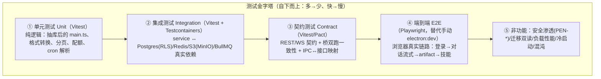
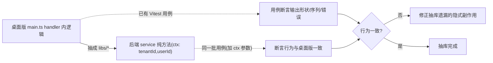
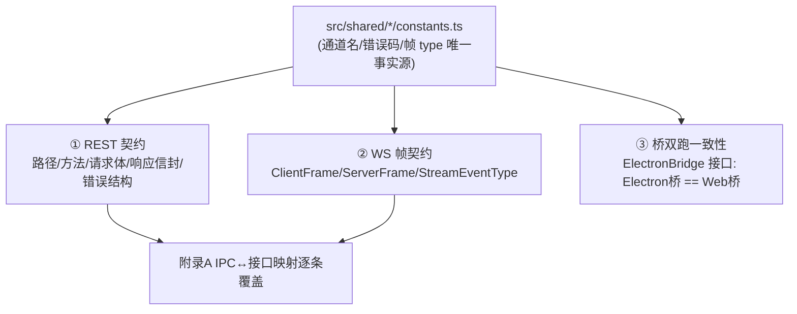
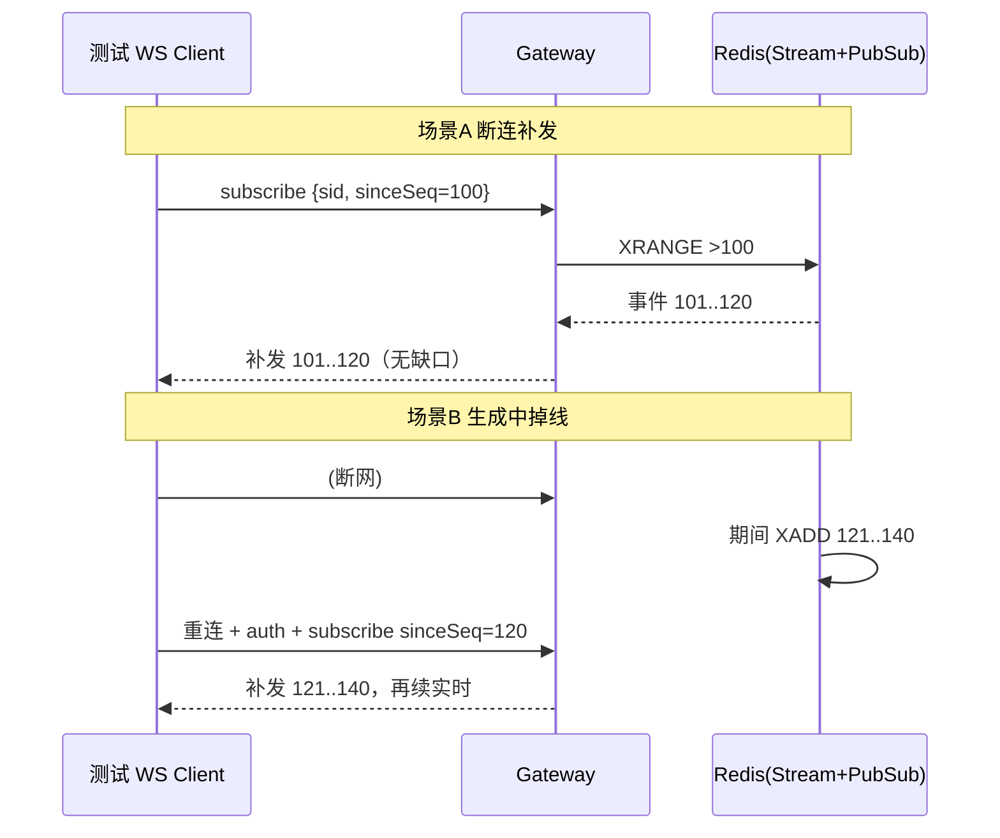
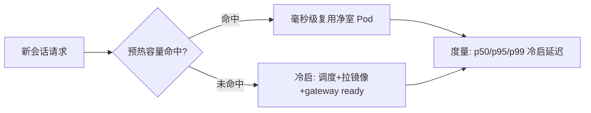

# 测试策略与验收标准

> 本文档是 LobsterAI「桌面单机 → 多租户 SaaS Web」改造计划的**全局验收/测试口径统一收口**。它面向 QA/测试负责人、后端与前端工程师、SRE、安全负责人与发布门禁评审人。各专项文档（`03`~`15`）的「验收标准」章节回引本文的测试方法、准入门与用例集编号；本文不重复各章的业务实现细节，只定义「怎么测、测到什么程度算过、每个阶段门要求哪些测试全绿」。
>
> 一句话立场：**这是一个多租户、跑不可信代码、强流式、要迁移历史数据、要按量计费的平台**。因此测试的第一性原理是——**把「隔离不破、流式不丢、迁移零差、计费不错、沙箱不逃」这五条红线做成自动化、可重复、进发布门禁的硬门**，而不是靠人工点 `electron:dev` 走查。
>
> 权威边界：安全渗透用例编号（`PEN-*`）的**定义权威在 `14-安全合规与多租户隔离.md` §12**，本文只负责把它们纳入测试计划与阶段门；配额/计费用例的**结算口径权威在 `09-模型代理与计费.md`**；迁移双读校验的**方案权威在 `06-数据模型迁移.md` §6.2**；阶段门与工作量的**排期权威在 `17-分阶段路线图与工作量估算.md`**，风险↔门绑定在 `18-风险登记册.md` §4。跨文档决策（阶段门命名、契约事实源、RLS/计费/迁移口径）与**阶段门唯一对照表的总权威在 `附录C-决策基线与接口契约总纲.md`（D1–D16 / §8）**，本文已就其口径就地对齐。

---

## 0. 现状测试基线与本文范围

### 0.1 现状事实（权威口径，作为复用起点）

| 维度 | 现状 | 依据 |
|---|---|---|
| 官方测试入口 | `npm test` = `vitest run` | `package.json` `"test": "vitest run"` |
| 用例收纳范围 | `src/**/*.test.ts` + `tests/**/*.test.ts`，`environment: node` | `vitest.config.ts` |
| 现有 `.test.ts` 文件数 | 实测 **175** 个 `.test.ts` 文件（文件数≠用例数，见附录 C §2-B12；含 `coworkStore.test.ts`、`sqliteStore.test.ts`、`openclawConfigSync.test.ts`、`authQuota.test.ts`、`coworkPagination.test.ts`、`skillManager.test.ts`、`cronJobService.test.ts` 等核心逻辑覆盖） | `rg -l --glob '*.test.ts'` |
| 别名 | `@shared`→`src/shared`、`@`→`src/renderer` | `vitest.config.ts` |
| CI | GitHub CI 跑 `npm test`；改动 TS 文件走 `eslint --max-warnings 0` | `CLAUDE.md` Quality Gates |
| 遗留测试 | `tests/*.test.mjs`（Node `node:test`，**不进** `npm test`，仅显式 `node --test` 运行） | `CLAUDE.md` Testing |
| UI/Electron 行为 | 目前**手动** `npm run electron:dev` / `electron:dev:openclaw` 走查 | `CLAUDE.md` |
| E2E 框架 | **无**（无 Playwright，`package.json` grep 无命中） | 实测 |

### 0.2 本文要解决什么

1. 把现有 Vitest 单测资产**平移复用**（`main.ts` 抽库后行为不变靠它守，见 `04` §3），并向上补齐集成/契约/E2E/安全/迁移/性能层。
2. 用 **Playwright E2E 替代手动 `electron:dev` 走查**——SaaS 目标是浏览器端，手动走查不可重复、不进门禁。
3. 定义五类「必过」专项测试：**契约测试、跨租户越权、迁移双读、流式补发/断连恢复、沙箱安全**，外加负载/性能/冷启动压测基线。
4. 给出每阶段 **Definition of Done（DoD）** 与准入门，并与 `18` §4 / `17` 的阶段门逐条对齐。
5. 定义测试数据与环境分层、覆盖率目标。

---

## 1. 测试金字塔（分层与工具选型）

### 1.1 分层总图



分配比例（用例数量级，非绝对）：单元 ~70% / 集成 ~18% / 契约 ~7% / E2E ~4% / 非功能专项 ~1%（但**权重最高**，是发布门禁的硬门）。

### 1.2 工具选型（与全局技术栈一致）

| 层 | 工具 | 说明 |
|---|---|---|
| 单元 | **Vitest**（复用现状） | `src/**/*.test.ts`；纯逻辑，`environment: node`；禁止 import electron-only API（`CLAUDE.md`） |
| 集成 | Vitest + **Testcontainers**（Postgres/Redis/MinIO）+ Prisma migrate | 起真实 Postgres 验 RLS、真实 Redis 验 pub/sub+Stream、真实 MinIO 验签名 URL |
| 契约（REST/WS） | Vitest + supertest（REST）+ ws 客户端；可选 **Pact** 做消费者驱动契约 | 前后端共享 `src/shared/*/constants.ts` 作为通道/错误码/帧 `type` 唯一事实源 |
| 契约（桥双跑） | Vitest（对 `ElectronBridge` 接口跑同一套「形状+行为」测试） | Electron 桥与 Web 桥都要通过（见 `03` §9.2） |
| E2E | **Playwright**（Chromium/WebKit/Firefox） | 替代手动 `electron:dev`；跑真实 SPA + 后端 + 沙箱（staging） |
| 安全 | Playwright/脚本化 HTTP + 集群内探针 Pod + ZAP/自研 | 落地 `14` §12 的 `PEN-*` 用例 |
| 迁移 | Vitest + 导入器 dry-run + 对账脚本 | 落地 `06` §6.2 双读校验 |
| 负载/性能 | **k6**（REST/WS）+ 自研流式压测 client | 会话并发、流式吞吐、冷启动分位 |
| 混沌 | Chaos Mesh / 手动故障注入 | Pod kill、Redis 抖动、上游 provider 故障切换 |

> Playwright 引入到 `package.json` `devDependencies`；新增脚本 `test:e2e`。E2E 不进默认 `npm test`（慢、需环境），走独立 CI job。单元/集成保持 `npm test` 快速回归。

### 1.3 各层职责边界（防重叠、防漏测）

| 层 | 只负责 | 不负责（交给谁） |
|---|---|---|
| 单元 | 纯函数/纯逻辑正确性、边界、异常分支 | 跨进程/DB/网络行为（集成） |
| 集成 | service+真实基础设施的行为（RLS 生效、锁、队列、S3） | 前端渲染（E2E）、跨租户攻击面（安全专项） |
| 契约 | 接口形状/字段/错误码/帧协议不漂移、桥双跑同形 | 端到端业务流（E2E） |
| E2E | 用户视角关键旅程可用 | 覆盖所有分支（下沉到单元/集成） |
| 非功能 | 隔离/流式韧性/迁移/性能/安全红线 | 常规功能正确性 |

---

## 2. 单元测试：复用现状 Vitest 资产

### 2.1 复用策略

现有 **175** 个 `.test.ts` 文件（文件数≠用例数，附录 C §2-B12）是最高价值资产：它们覆盖了 `04` §3.2 列出的「可直接搬（A 类）」纯逻辑。**抽库迁移的守门方法是「行为快照」**：



### 2.2 必须保留/迁移的关键单元覆盖

| 现有用例 | 守护的逻辑 | 迁移要求 |
|---|---|---|
| `coworkStore.test.ts`、`coworkPagination.test.ts`、`coworkSlicePagination.test.ts` | 会话/消息 CRUD、`sequence` 单调递增、游标分页语义（`04` §4.3） | 换 Prisma 后**分页排序结果逐条一致**；`sequence` 生成竞态另加集成测试（§3.3） |
| `sqliteStore.test.ts` | 迁移 `PRAGMA table_info` 幂等 | 转为 Prisma migration + 迁移器测试（见 `06`） |
| `openclawConfigSync.test.ts` | `managedConfig`/`safeServerKey`/`buildOpenClawMcpServers` 纯转换（`04` §3.2） | **零改动复用**；写入目标改沙箱后另加集成测试 |
| `authQuota.test.ts`、`mediaGenerationPolicy.test.ts` | 配额门控（`hasMediaGenerationEntitlement`） | 迁为**租户级**结算，用例改按 `tid`（口径见 `09`） |
| `cronJobService.test.ts`、`src/scheduledTask/*.test.ts` | `at`/`every`/`cron` 解析、内部任务标记、投递策略 | 纯解析零改动；执行触发改 BullMQ 后加集成测试（见 `11`） |
| `coworkErrorClassify.test.ts`（+ `src/common/`） | `classifyErrorKey` 错误分类 | 沉淀为共享 `as const` 错误码枚举，前后端契约共用（`04` §4.4） |
| `coworkFormatTransform.test.ts` | OpenAI↔Anthropic/Gemini 转换（`coworkOpenAICompatProxy`） | 纯逻辑零改动复用（`09`） |

### 2.3 新增单元覆盖（Web 化新增纯逻辑）

- **桥映射表**：`invokeMap.ts` / `streamMap.ts`（`03` §3~§5）——每条 IPC 通道有唯一映射、无遗漏、无重复（用 `src/shared` 常量做穷举断言）。
- **JWT claims 解析/租户上下文构建**（不含签名网络交互，纯解析）。
- **签名 URL 载荷编解码**（HMAC 载荷含 `tenantId|sessionId|artifactId|path|exp`，`14` §5.4）。
- **`resolveWorkspacePath` 路径守卫**（拒 `..`/绝对路径/盘符/NUL/`%2e%2e%2f`，`14` §2.3 / `08` §5）——这是安全关键纯逻辑，必须单测穷举穿越向量。

---

## 3. 集成测试：service ↔ 真实基础设施

### 3.1 环境（Testcontainers）

集成测试起**真实依赖容器**，杜绝 mock 掩盖 RLS/锁/队列真实行为：

```mermaid
flowchart LR
  T["Vitest 集成用例"] --> PG[("Postgres + RLS<br/>Testcontainer")]
  T --> RD[("Redis<br/>Testcontainer")]
  T --> S3[("MinIO(S3)<br/>Testcontainer")]
  T --> BQ["BullMQ(基于 Redis)"]
  PG -.每用例 SET LOCAL app.tenant_id.-> RLS[RLS 策略生效验证]
```

- 每个套件用 Prisma migrate 建库（含 RLS 迁移 SQL，`06` §391 的 raw sql 段），应用连接用**非 superuser、非 BYPASSRLS** 角色（否则测不出 RLS，见 `14` §3.3 PEN-ISO-4）。
- 每用例事务隔离 + 显式 `SET LOCAL app.tenant_id`，验证连接池不串上下文。

### 3.2 RLS 与租户过滤集成用例（对应越权红线的下层证明）

| 用例 | 断言 |
|---|---|
| A 租户 session，切 `SET LOCAL app.tenant_id=B` 查询 | 返回 0 行（RLS 拒绝） |
| Prisma tenant extension 自动注入 `where tenant_id` | 缺省 tenant 的裸查询被拦或空结果 |
| **关闭应用层 extension**（模拟 bug），仅靠 RLS | 仍 0 行/报错（双层任一失效不越权，`14` §3.1） |
| 连接池并发多租户请求 | 无 `SET LOCAL` 串上下文（PEN-ISO-3 的自动化版） |

### 3.3 会话串行化与消息一致性（`04` §7）

- **会话级分布式锁**：两个并发「发消息」请求，第二个得 `409 SESSION_BUSY`（或正确排队），不产生 `sequence` 冲突。
- **看门狗续期**：模拟长生成（> 锁 TTL）时锁不提前释放，无并发闯入。
- **`replaceConversationMessages` 事务性**：并发读分页不读到半更新状态。
- **sequence 生成竞态**：持锁写路径使用 `cowork_sessions.next_message_sequence` + `SELECT ... FOR UPDATE` 分配，压力下无重号/乱序；`beforeMessageId` 插入触发间隙不足时只重排本 session。

### 3.4 流式广播（Redis pub/sub + Stream）集成

- `XADD` + `PUBLISH` 到 `stream:{tenantId}:{sessionId}`，多个 Gateway 订阅者都能收到（多端同看）。
- **补发**：`subscribe sinceSeq` 触发 `XRANGE` 回放 `>sinceSeq`；断连窗口内事件不丢（详见 §6）。
- 幂等：重复 `seq` 帧被客户端/Gateway 去重。

### 3.5 对象存储与签名 URL（MinIO）

- 上传只签 PUT、读只签 GET，**拒签 DELETE/List**（`14` §5.4）。
- 签名 URL 过期返回 403；篡改 `tenant/path` 返回 403（PEN-CONTENT-3/4 的集成前置版）。
- S3 key 强制 `tenants/{tid}/...` 服务端拼接，拒绝客户端传完整 key（PEN-ISO-6 前置版）。

### 3.6 BullMQ 任务租户上下文

- job payload 带 `tenant_id`，worker 内重建 RLS 上下文；worker 内越权查询受 RLS 约束（PEN-ISO-8 前置版）。
- worker 幂等（job id = 业务键），重复触发不产生重复副作用。

### 3.7 Sandbox 镜像与状态卷集成

原容器改造计划中的 A1-A5 尖刺不再作为独立路线图，但其验证项应进入 V1 的 Sandbox 测试：

| 用例 | 断言 |
|---|---|
| Linux runtime 构建 | `lobster-openclaw-runtime` 在目标架构上可复现构建；OpenClaw bundle、插件、原生模块完整；容器启动到 gateway ready |
| 镜像内容检查 | 生产 runtime 镜像不含 Electron Renderer、Xvfb、x11vnc/noVNC、Chromium UI、真实密钥或租户数据 |
| state/PVC 映射 | `openclaw.json`、gateway token、workspace、memory、logs/cache 按 `07` §5.5 归属落位；没有未映射的隐式 `HOME` 依赖 |
| 优雅停机 | Pod 收到 SIGTERM 后 gateway 可关闭、state 刷盘、租约释放或等待 reconcile；不会留下半写文件 |
| 资源采样 | 空闲、首 turn、长响应、MCP/Skills 执行均记录 CPU/RSS/重启次数，为 `07` resourceClass 和 `15` HPA/水位提供实测输入 |
| 调试 noVNC | 生产环境无 noVNC Ingress/Service；若测试启用调试镜像，必须通过 `14` PEN-SBX-4 |

---

## 4. 契约测试（REST/WS + 桥双跑一致性）

契约测试是「防漂移」的核心——它保证**前端桥、后端 API、共享常量三者永不脱节**，是渐进式迁移与双跑（`03` §9）的支柱。

### 4.1 三类契约



### 4.2 REST/WS 契约测试

| 契约项 | 测试方法 | 通过判定 |
|---|---|---|
| IPC↔REST 映射完整 | 遍历 `附录A` 清单，每条 invoke 通道有 REST 端点且**返回形状与 preload 逐字一致**（含 `agents` 的 `{success,agents}`→`agents` 解包语义，`03` §4.2） | 无未映射通道；解包语义一致 |
| 统一错误信封 | 触发 4xx/5xx，断言 `{error:{code,message,httpStatus,requestId,details}}`（`04` §4.4）；`code` 来自共享枚举 | 前端按 `code`（非 message 字符串）分类，契约稳定 |
| 游标分页信封 | `sessions`/`messages` 列表返回 `{data,page:{nextCursor,hasMore,limit}}`（`04` §4.3） | 分页语义与 `coworkStore` 现状一致 |
| 幂等 | 同 `Idempotency-Key` 重放「发消息/建会话」 | 不产生重复副作用；命中回放原响应 |
| WS 帧协议 | `subscribe/unsubscribe/ping/pong/ack` + `ServerFrame`（`type,sessionId,seq,data`）（`04` §5.3） | **10** 个 `cowork:stream:*`（含原漏的 `cowork:stream:goal`，见附录 C §3.2 / §2-B13）+ `api:stream:*` 四态 + 任务事件均映射正确 |
| Stream 通道↔AsyncAPI 静态断言 | 遍历 `CoworkIpcChannel` 的每个 `Stream*` 通道，断言其在 `libs/shared/contracts` 的 AsyncAPI 中有对应 channel 映射（从 `as const` 对象穷举，**禁止用字面量 grep 数通道**，见附录 C D1 / §3.2） | 缺任一映射即编译期或用例失败——防再次漏事件（如曾漏 `cowork:stream:goal`） |
| WS 鉴权帧 | REST 先申请一次性短期 ticket；首帧 `auth` 只携带 ticket；ticket 过期、复用、跨租户 scope 均拒绝 | 未认证连接超时关闭；复用 ticket 失败；跨租户 subscribe 失败（`03` §6.1 / `04` §5.2） |

### 4.3 桥双跑一致性（替代手动验证的关键机制）

对 `ElectronBridge` 接口（建议抽到 `src/shared/bridge/contract.ts`，`03` §3.3）写**一套「形状 + 行为」测试**，Electron 桥（`preload.ts` 注入）与 Web 桥（`installWebBridge`）都要通过：

```ts
// 伪代码：桥契约套件同时喂两套实现
describe.each([
  ['electron', makeElectronBridge()],   // 桌面 preload 桥
  ['web',      makeWebBridge(httpMock, wsMock)], // Web 桥
])('ElectronBridge 契约 [%s]', (_name, bridge) => {
  test('agents.list 失败返回 []（解包语义）', async () => {
    // 后端/主进程返回 { success:false } → 桥对外必须返回 []
    expect(await bridge.agents.list()).toEqual([]);
  });
  test('cowork.onStreamMessage 返回 unsubscribe 且可注销', () => {
    const off = bridge.cowork.onStreamMessage(() => {});
    expect(typeof off).toBe('function');
    expect(() => off()).not.toThrow();
  });
  // ...覆盖签名、payload 形状、返回 unsubscribe 约定
});
```

**通过判定**：两套桥对同一契约用例结果一致；任一方法签名/返回形状漂移 → TS 编译期报错 + 契约用例失败。这直接支撑 `03` §9.2 的「同一 service 分别对接两桥、同一批 e2e 跑」。

---

## 5. E2E 测试（Playwright，替代手动 electron:dev 走查）

### 5.1 为什么必须替代手动走查

现状 UI/Electron 行为靠人工 `npm run electron:dev` 走查（`CLAUDE.md`），不可重复、不进门禁、Web 化后目标是浏览器。**Playwright E2E 在 staging 跑真实链路**（真实 SPA + 后端 + 沙箱 Pod），把关键旅程固化为门禁用例。

### 5.2 关键用户旅程（E2E Journeys）

| 旅程 | 覆盖链路 | 对应文档 |
|---|---|---|
| J1 登录 | OIDC 重定向 → `/auth/callback` → PKCE 换 token → 进应用（**替代 loopback** 走查） | `05` §3.2 |
| J2 核心对话流式 | `startSession` → 发消息 → WS 收 `message/messageUpdate` 增量 → `complete`；渲染无卡顿 | `03` §5、`04` §6.2 |
| J3 权限交互 | 生成中触发 `permission` → 弹窗 → `respondToPermission` → `permissionDismiss` + 后续帧 | `04` §6.3 |
| J4 刷新/深链恢复 | 刷新 `/s/:sessionId` 会话恢复；未登录深链跳 OIDC 回跳原路由 | `03` §8 |
| J5 断连恢复 | 主动断网 30s → 自动重连 → 订阅重放 → 当前会话消息对齐补齐**无缺口无重复** | `03` §6.2、§6 |
| J6 Artifact 预览 | 生成 HTML/SVG/文档 → 沙箱域名 iframe 预览（隔离生效） | `12` |
| J7 文件工作区 | 上传文件到工作区 → 会话读写 → 下载（走对象存储，非本地路径） | `08` |
| J8 Skills/MCP | 安装技能（触发扫描门控）→ 启用 → 会话调用；MCP 服务器配置 | `10` |
| J9 定时任务 | 建任务 → 到点触发 → 运行历史 → WS `taskStatus/taskRun` 更新 | `11` |
| J10 计费门控 | 超配额时拒新写/提示升级，不影响读取与已有会话 | `09` |

### 5.3 E2E 采集物

Playwright 每次跑采集 **screenshot / video / trace**，失败用例保留 trace 供排障；上传 CI artifact。多浏览器矩阵（Chromium 必跑，WebKit/Firefox 抽样）。

### 5.4 与手动走查的关系

- E2E 覆盖后，手动 `electron:dev` 仅用于**桌面端遗留能力的探索性验证**（若仍保留双端），不再是回归主手段。
- 无法自动化的纯观感（动效流畅度、视觉细节）保留少量人工检查清单，不进硬门禁。

---

## 6. 流式补发 / 断连恢复测试（专项，红线）

流式是本平台体验核心，弱网/多副本下**不能丢帧、不能重复、不能串会话**。对应风险 `R-STREAM-01`（`18`）。

### 6.1 测试矩阵



| 场景 | 注入 | 通过判定 |
|---|---|---|
| 断连补发 | 断 WS，期间产生 N 帧，`sinceSeq` 重连 | 补齐 `>sinceSeq` 全部帧，`seq` 连续无缺口无重复 |
| 生成中掉线 | 生成过程中断网 30s | 重连后对齐（`getSessionMessages` + Stream 补发），最终一致 |
| 补发窗口边界 | 断连超过 Stream 保留窗口（5min/500 条） | 触发一次全量拉取对齐（`03` §6.2 兜底），仍无缺口 |
| 多副本路由 | 事件由 Pod X 产生，连接落在 Gateway Y | 经 Redis 广播正确送达（`04` §5.1） |
| 副本重启 | 生成中重启领域服务副本 | 进行中会话不受影响（无状态 + 广播 + 补发，`04` §9 验收） |
| 多端同看 | 同会话两个连接 | 两端一致，新连接经 Stream 补齐 |
| `api:stream` 取消 | `stream(requestId)` → `cancelStream` | 收到 `abort`，上游 SSE 确被后端掐断（`03` §5.4） |
| 背压 | 高频 `messageUpdate` 弱网 | 合帧节流生效，UI 不卡死，CPU 不持续满载（`03` §6.3） |
| 心跳死连 | 停 pong 45~60s | 判死重连（`03` §6.2 / `04` §5.5） |
| 越权订阅 | 伪造他会话/他租户 `sessionId` subscribe | 拒绝并发 `error`（`04` §5.4，联动 PEN-ISO） |

---

## 7. 跨租户越权「必过」用例集（红线）

> 这是发布门禁最硬的门。**用例定义权威在 `14` §12（`PEN-*`）**；本节把它整理为「必过集」并绑定测试层。任一项失败 = 阻断发布（对应风险 `R-ISO-01`/`R-SEC-01`，`18`）。跨租户越权必过集是 **`V3`（门 `G-V3`）的硬门**（附录 C §8）。

### 7.1 必过用例集（分组自 `14` §12）

| 编号（→14 §12） | 测什么 | 主测试层 | 通过判定 |
|---|---|---|---|
| PEN-ISO-1 | A 令牌请求 B 的会话/agent/文件/artifact/MCP/技能/分享 | E2E + 集成 | 全部 **404**（不泄露存在性） |
| PEN-ISO-2 | 篡改 body/query/header 的 `tenant_id` | 集成 | 无效，只信 JWT `tid` |
| PEN-ISO-3 | 高并发跨租户，验连接池不串 `SET LOCAL` | 集成（并发） | 无跨租户可见 |
| PEN-ISO-4 | 关应用层过滤后跨租户读写 | 集成（红队开关） | RLS 仍拒（0 行/报错） |
| PEN-ISO-5 | Redis/缓存/PubSub key 前缀 | 集成/审查 | 会话流统一 `stream:{tenantId}:{sessionId}`，用户级事件统一 `stream:{tenantId}:user:{userId}`，不得缺失 tenant 前缀 |
| PEN-ISO-6 | 传完整/他租户 S3 key、签前缀级 URL | 集成 | 拒绝；key 仅服务端按 `ctx.tid` 拼 |
| PEN-ISO-7 | 会话 A 沙箱读写会话 B 的 PVC 子路径 | 沙箱探针 | 越权读写被拒 |
| PEN-ISO-8 | 带 tenant 的 BullMQ 任务 worker 内越权查询 | 集成 | 受 RLS 约束，无越权 |
| PEN-AUTH-1/2 | refresh 重放 / 登出后旧 access | 集成 | family 撤销强制重登 / 失效 |
| PEN-AUTH-3/5 | 开放重定向 / CORS `*`+credentials | 集成 | 白名单外拒 / 不存在 |
| PEN-CONTENT-1/2 | 预览 iframe 读主应用 token / `allow-same-origin` | E2E + DOM 断言 | 无法读取 / 永不出现 |
| PEN-CONTENT-3/4/6/7 | 签名 URL 过期/篡改 / 产物外发 / 任意页嵌入 | 集成 + E2E | 403 / `connect-src none` 阻断 / `frame-ancestors` 拒 |

### 7.2 自动化与频次

- PEN-ISO-* 与 PEN-AUTH-* 做成**每次 PR 必跑**的集成套件（快、可自动化）。
- PEN-SBX-*/PEN-NET-*（沙箱/网络，见 §9）与完整渗透在**阶段门 + 定期红队**跑（需集群环境）。
- 新增任何 tenant-scoped 资源/端点，**必须补一条对应的 PEN-ISO-1 越权用例**（进 PR 检查清单）。

---

## 8. 迁移双读校验（0 差异门，红线）

> 方案权威在 `06-数据模型迁移.md` §6.2；对应风险 `R-DATA-01`（`18`）。**附录 C §8 已把 R-DATA-01 拆成两条独立门**：**(a) SaaS schema 迁移校验（Prisma migration 正确性/幂等）= `V3` 早硬门**；**(b) 桌面存量 SQLite → Postgres 导入双读 = `V5` 可选门**。注意口径：**SaaS 是全新自建后端，不做在线数据迁移**（`05` §9 注）；本节的「双读对账」主要针对 (b) 的可选导入工具正确性，(a) 的 schema 迁移校验随 `V3` 集成测试执行。

### 8.1 双读校验方法（dry-run + 对账）

```mermaid
flowchart LR
  SRC[(桌面 SQLite 快照)] --> IMP[导入器 dry-run]
  IMP --> DST[(Postgres 目标租户)]
  SRC --> RA[读源: 行数/关键字段/引用]
  DST --> RB[读目标: 行数/关键字段/引用(重映射后)]
  RA & RB --> DIFF{对账}
  DIFF -- 差异>0 --> FAIL[阻断: 定位映射/引用断链]
  DIFF -- 0 差异 --> PASS[通过 0 差异门]
```

### 8.2 校验维度与判定（0 差异门）

| 维度 | 校验 | 门 |
|---|---|---|
| 行数对账 | 每张业务表源↔目标行数一致（约 19-20 张：`agents`/`cowork_sessions`/`cowork_messages`/`mcp_servers`/… 见 `06`） | 差异必须为 **0** |
| 引用完整性 | 消息→会话、记忆来源→记忆、子代理消息→run 等引用**重映射后**仍指向存在父行（`06` §6.2） | 无断链 |
| id 重映射 | 老 id→新 UUID 映射唯一、引用列同步改写 | 无冲突、无遗漏 |
| 内容抽样 | 抽样消息内容/元数据/JSON 字段字节级一致 | 抽样 0 差异 |
| 幂等 | 同一快照重复导入 | 不产生重复（幂等） |
| 特殊表口径 | `scheduled_tasks`/`scheduled_task_runs` 为**历史遗留表**（真正权威是 gateway cron），仅在迁移逻辑读出迁入 gateway 后废弃；`scheduled_task_meta` 保留本地绑定 | 按 `11` 口径校验迁移路径，不校验为长期活跃表 |

**准入门**：SaaS schema 迁移校验为 **`V3` 硬门**（随 `V3` 集成测试执行，见附录 C §8）；桌面存量导入双读 **0 差异**（行数 + 引用 + 抽样）为 **`V5` 可选门**，仅在启用导入工具时必过（附录 C §8 / `18` §4）。

---

## 9. 沙箱安全测试（专项，红线）

> 用例权威在 `14` §12.2（SANDBOX/NET）；对应风险 `R-ISO-01`（`18`，逃逸测试 100% 拦截是 PoC→单租户阶段门）。这些测试需**真实集群 + 探针 Pod**。

### 9.1 沙箱与网络必过用例

| 编号（→14 §12） | 测试动作 | 通过判定 |
|---|---|---|
| PEN-SBX-1 | Pod 内提权 / 写系统路径 / `sudo` | 全失败（非 root + 只读根 + drop ALL caps，`14` §2.2） |
| PEN-SBX-2 | Pod 内调 kube-apiserver / 读 SA token | 无 SA token（`automountServiceAccountToken:false`），失败 |
| PEN-SBX-3 | 已知 gVisor/Kata 逃逸 PoC | 无法逃逸到宿主/其它 Pod |
| PEN-NET-1 | Pod 内 `curl 169.254.169.254`（IMDS） | egress 代理 + NetworkPolicy 拒绝（`14` §4.1） |
| PEN-NET-2 | 访问 RFC1918 内网 / 另一 Pod IP | 拒绝（默认拒绝入站/横向） |
| PEN-NET-3 | DNS rebinding 到私网 | 按解析后**真实 IP** 拒绝 |
| PEN-NET-4 | 出站非白名单域 | egress allowlist 拒绝并审计 |
| PEN-SUP-1..8 | critical skill / `command=/bin/sh` stdio MCP / 未扫描包 / 公网 registry / `latest` 或缺 integrity / lifecycle scripts / 缓存隔离 / CVE 重扫 | 默认 blocked / `422` / 不加载 / 不直连公网 / lockfile+integrity 生效 / `npm --ignore-scripts` 或隔离执行 / 私有包不进共享缓存 / `needs_rescan` 阻断（`14` §8、`10` §7.1） |
| PEN-SECRET-1/2/3 | DB 密钥明文 / GET 回明文 / 沙箱取真实上游 key | 均 secref / 否 / 拿不到（`14` §6） |
| PEN-ABUSE-4..8 | 公开分享 noindex、举报下架/CDN 失效、限流/套餐限制、恶意内容扫描、外链/CSP allowlist | 默认 noindex；下架 p95 < 5 分钟；critical blocked；限流生效；未授权外链被阻断（`12` §7.3、`14` §12.6） |

### 9.2 执行方式

- 用**受限探针 Pod**（在 sandbox namespace 起一个带攻击脚本的容器）跑 PEN-SBX/PEN-NET，断言全部被拦。
- gVisor/Kata 逃逸 PoC 与运行时升级联动（`14` §8 供应链、`15` CI/CD 镜像扫描）。
- 供应链门控（PEN-SUP-*）在 SkillModule/McpModule 集成测试 + E2E J8 覆盖；公开分享 abuse（PEN-ABUSE-4..8）在分享服务集成测试 + 浏览器 CSP E2E 覆盖。

---

## 10. 负载/性能与冷启动压测基线

> 结算/配额熔断口径见 `09`，编排并发/预热容量见 `07`，容量/SLA 与告警见 `15`。对应风险 `R-PERF-01`/`R-COST-01`（`18`）。本节定**压测场景与测量方法**；**性能阈值（首帧 p95、冷启 p50/p95 等）统一以 `17` V4 权威表为唯一数值来源**（附录 C §8 V4 门），本节不再自给可能与之量级冲突的数值。

### 10.1 压测场景与基线指标（示例目标，实测按 `17`/`15` 调校）

| 场景 | 工具 | 输入规模/向量 · 关键指标 | 阈值 / pass-fail（数值权威见 `17` V4） |
|---|---|---|---|
| REST QPS | k6 | 目标 QPS 阶梯加压；会话/消息 CRUD p95 延迟、错误率 | p95 延迟与错误率阈值见 `17` V4；超阈 = fail |
| WS 流式吞吐 | 自研流式 client | N 并发连接 × 增量帧速率；端到端首帧延迟、稳定吞吐 | 首帧 p95 阈值见 `17` V4（统一消除跨文档量级冲突）；吞吐无堆积 = pass |
| 并发会话 | k6 + 流式 client | 加压至套餐并发上限；活跃流式会话数、Redis 广播延迟 | 达套餐上限不劣化（`07` §6）；广播延迟阈值见 `17` V4 |
| **冷启动**（沙箱 Pod） | 编排压测 | 批量新会话 claim；claim→gateway ready 分位延迟 | p50/p95/p99 与预热命中率阈值见 `17` V4（§10.2） |
| 会话锁竞争 | 并发发消息 | 同会话 M 并发发消息；`409` 比例、锁等待 | 串行正确、无 sequence 冲突（§3.3，pass/fail 二值） |
| 大附件 | k6 上传 | 边界附件（安全线上下）；拦截行为、S3 直传成功率 | 超安全线按 `04` §6.4 / `08` 拦截、直传不撑爆（pass/fail） |
| 出站/计费计量 | egress 审计 | 已知字节量出站；`egress_bytes{tenant}` 准确度 | 与计费对账一致（`09`，允许误差阈值见 `17` V4） |

### 10.2 冷启动专项

冷启动是 SaaS 体验短板（桌面无此问题）：



- 压测**预热容量命中率**与**冷启分位延迟**（`07` 预热容量机制），基线纳入 `15` SLA。
- 冷启退化告警（p95 超 `17` V4 权威阈值）接入 `15` 监控。

### 10.3 计费正确性压测（对齐 `09`）

- 并发调用下扣费**不多扣不漏扣**（幂等 + 事务）；超配额触发降级（拒新写/提示升级），**不影响读取与已有会话**（`09` 降级策略，E2E J10）。
- 上游 provider 故障切换演练（`R-VENDOR-01`）：切换后计费归属正确、无重复扣费。

---

## 11. 每阶段 Definition of Done 与准入门（与 附录C §8 / 17 / 18 对齐）

> 阶段门命名的**唯一权威是附录 C §8 唯一对照表：`V1–V6`（门 `G-V1`–`G-V6`），已废弃 `P0–P3` / `GV` 别名**；排期在 `17`、风险↔门在 `18` §4。本节把各门翻译成**必过测试清单 + DoD 判据**。
>
> **DoD 判据格式（对应附录 C D13 / P1-13）**：每条门的判据一律写成「**输入规模/向量 → 阈值 → pass/fail → 测量方法**」三元组，避免「达标 / 可控」这类不可测措辞；凡涉及性能阈值（首帧 p95、冷启分位等）一律引用 `17` V4 权威表，不在本文另给可能冲突的数值。

### 11.1 阶段门 × 必过测试


| 阶段门 | 必过测试（本文章节） | 判据（输入/阈值/pass-fail/测量；对齐 附录C §8 / `18` §4） |
|---|---|---|
| **`G-V1`（V1→V2）** | Sandbox runtime 镜像构建与内容检查（§3.7）、真实 OpenClaw Pod 跑通一条 turn、沙箱安全 §9、egress 阻断、RWX/PVC 存储 PoC、Config Sync golden、桥契约测试基线、**gVisor 工作负载兼容+性能矩阵（附录 C D4）** | 每项给实测证据（成功率/开销矩阵）；任一硬门无证据 = fail，只能做 mock/预研；测量：PoC 报告 + 兼容矩阵表 |
| **`G-V2`（V2→V3）** | 单租户 E2E J1-J5、WS ticket/续传、核心 schema、桥双跑一致、**契约测试（10 事件全覆盖 + Stream↔AsyncAPI 静态断言，§4.2）**、基础 artifact 预览 | 输入=单租户合成数据；J1-J5 全绿且流式无缺口/重复 = pass；不声明多租户安全；测量：Playwright trace + 契约用例 |
| **`G-V3`（V3→V4）** | **跨租户越权必过集 §7（API/WS/S3/Redis/PVC/任务，R-SEC-01 硬门）**、RLS/tenant scope、工作区 path traversal/symlink、**SaaS schema 迁移校验（R-DATA-01 硬门，§8a）**、服务端 BullMQ 调度、Beta 审计 | 输入=≥2 租户 × 多角色 + 越权向量集；任一越权用例可读到他租户数据 = fail（硬阻断）；schema 迁移校验随集成测试 0 差异；测量：PEN-ISO/AUTH 自动化套件 |
| **`G-V4`（V4→V5）** | 每会话 Pod 编排、gVisor/Kata、NetworkPolicy/egress、ResourceQuota、warm/cold 冷启分位、Pod crash 自愈、chaos 初版 | 输入=编排压测负载；性能阈值（冷启 p50/p95 等）达 `17` V4 权威表 = pass、超阈 = fail；自愈=注入 crash 后进行中会话不受影响；测量：k6 + 编排压测 + Chaos |
| **`G-V5`（V5→V6）** | 模型计费幂等、stream cancel/timeout/usage missing、模型网关绕过测试、MCP/Skills 供应链（PEN-SUP-1..8）、公开分享 abuse 治理（PEN-ABUSE-4..8）、**桌面存量导入双读（可选门，§8b）** | 输入=并发扣费 + 供应链攻击向量；并发扣费不多扣不漏扣 = pass、任一绕过网关计费成功 = fail；启用导入工具时双读 0 差异；测量：计费压测 + 供应链集成 + 导入对账 |
| **`G-V6`（GA）** | 完整渗透、合规用例、容量/SLO、DR/Chaos、发布回滚/on-call、第三方复测 | P0/P1 缺陷清零、DR/回滚演练通过 = pass；SLO 达 `15` 目标；测量：GA checklist 签署 + 第三方复测报告 |

### 11.2 通用 Definition of Done（每个进入 V1-V6 GA 主线的域/PR）

一个域/PR 视为 Done，须同时满足：

- [ ] 触碰的 TS 文件 `eslint --max-warnings 0` 无错无警（`CLAUDE.md` Quality Gates）。
- [ ] 抽库的纯逻辑有 Vitest 单测，且**行为与桌面版一致**（§2.1 行为快照）。
- [ ] 有真实依赖的行为有集成测试（RLS/锁/队列/S3，§3）。
- [ ] 新增/变更的 REST/WS 接口有契约测试，桥双跑一致（§4）。
- [ ] tenant-scoped 资源/端点补了对应越权用例（§7，PEN-ISO-1 家族）。
- [ ] 涉及流式的变更过了补发/断连矩阵相关项（§6）。
- [ ] 关键旅程有/更新了 E2E（§5），失败保留 trace。
- [ ] `npm test` 全绿；E2E job 绿；覆盖率不低于目标（§13）。
- [ ] i18n（zh+en）无硬编码用户可见串（`CLAUDE.md`）。

---

## 12. 测试数据与环境

### 12.1 环境分层

| 环境 | 用途 | 依赖 | 数据 |
|---|---|---|---|
| 本地/CI 单元 | Vitest 纯逻辑 | 无外部依赖（node） | 内联 fixture |
| 本地/CI 集成 | service ↔ 真实依赖 | Testcontainers（PG/Redis/MinIO） | 每用例建/毁，seed 脚本 |
| Staging | E2E + 安全 + 负载 | 完整后端 + 真实沙箱集群（小规模） | 合成多租户数据集 |
| Pre-prod/灰度 | 灰度切流 + 混沌 + 冷启动压测 | 生产同构 | 脱敏/合成 |

### 12.2 测试数据集（多租户为一等公民）

- **至少两个租户**（Tenant A / Tenant B）+ 每租户多用户多角色（owner/admin/member/viewer），供越权（§7）与 RBAC 用例。
- 覆盖数据形态：长会话（分页边界）、大量消息（`sequence` 压力）、带附件会话、含 artifact（HTML/SVG/文档）、含记忆/dreaming 数据、含 MCP/技能配置（含 secref 字段）、含定时任务（历史遗留表 + gateway cron meta，`11` 口径）。
- **桌面 SQLite 快照**：用于迁移双读校验（§8），含真实引用关系（消息↔会话、记忆来源↔记忆）。
- **敏感数据纪律**：测试数据不含真实密钥/PII；secref 字段用假引用；日志/审计断言脱敏（`14` §10.2）。

### 12.3 数据工厂与隔离

- 用工厂函数按 `tenant_id` 造数据（走服务层，确保 RLS/前缀一致），不手写跨租户脏数据。
- 每套件独立 schema/命名空间，避免用例互污；Redis key、S3 前缀、K8s namespace 均带测试租户前缀，跑完清理。

---

## 13. 测试覆盖率目标

| 层 | 覆盖率/量化目标 | 度量 |
|---|---|---|
| 单元（抽库纯逻辑） | 行/分支覆盖 **≥ 80%**（`04` §3.2 A 类逻辑更高，关键路径接近 100%） | Vitest coverage |
| 集成（RLS/锁/队列/S3 关键路径） | 关键路径 **100% 有用例**（非行覆盖，而是场景覆盖） | 用例清单核对 |
| 契约 | `附录A` 每条 IPC 通道 **100% 有映射契约用例**；桥双跑全接口 | 通道清单穷举 |
| E2E | 关键旅程 J1-J10 **100% 覆盖** | 旅程清单 |
| 安全（PEN-*） | `14` §12 全部编号 **100% 有自动化/半自动用例** | 编号核对 |
| 迁移 | 双读 **0 差异**（非覆盖率，是绝对门） | 对账报告 |

补充规则：

- 覆盖率**门禁不倒退**：PR 不得使总覆盖率下降（CI 比对基线）。
- 覆盖率不是唯一目标——**红线专项（越权/沙箱/迁移/流式/计费）以「用例是否存在且通过」为准**，不用行覆盖率替代。
- 安全/沙箱用例即使少（金字塔顶），**权重最高**：任一失败阻断发布（§11 阶段门）。

---

## 14. CI/CD 集成（测试何时跑）

```mermaid
flowchart LR
  PR[Pull Request] --> L[eslint 改动文件]
  PR --> U[npm test: 单元+集成(Testcontainers)]
  PR --> CT[契约测试 + 桥双跑]
  PR --> ISO[越权必过集 PEN-ISO/AUTH]
  U & CT & ISO --> COV[覆盖率门禁不倒退]
  COV --> MERGE{合并}
  MERGE --> E2E[E2E(Playwright) staging]
  MERGE --> NIGHTLY[Nightly: 负载/沙箱/迁移双读/混沌]
  E2E & NIGHTLY --> GATE[阶段门评审 §11]
```

| 触发 | 跑什么 | 阻断? |
|---|---|---|
| 每次 PR | eslint（改动文件）、`npm test`（单元+集成）、契约+桥双跑、越权必过集、覆盖率不倒退 | 是 |
| 合并到主干 | 上述 + E2E（Playwright，staging，J1-J10） | 是 |
| Nightly/定期 | 负载/性能、冷启动压测、沙箱安全（探针 Pod）、迁移双读、混沌、完整渗透 | 阶段门前必绿 |
| 阶段门评审 | §11 各门必过测试全绿，风险清账（`18` §4） | 是（不过不放行） |

> E2E/负载/沙箱需集群环境，不进 PR 快环（保 PR 反馈 < 10min），但**进合并门与阶段门**。这与 `15` CI/CD（GitHub Actions + Helm、蓝绿/金丝雀、一键回滚）联动。

---

## 15. 验收标准（本文自身的落地判定）

本文档视为落地，须满足：

- [ ] 现有 **175** 个 `.test.ts` 文件（文件数≠用例数，附录 C §2-B12）在抽库后**行为快照一致**且仍进 `npm test`（§2）。
- [ ] Playwright 引入，`test:e2e` 脚本可跑 J1-J10 关键旅程，产出 screenshot/video/trace（§5），**手动 electron:dev 不再是回归主手段**。
- [ ] 契约测试覆盖 `附录A` 全部通道映射 + 桥双跑一致性套件（§4），任一漂移编译期或用例失败可捕获。
- [ ] 越权必过集（§7，`14` §12 PEN-ISO/AUTH/CONTENT）自动化，进 PR/合并门。
- [ ] 迁移双读校验脚本达 **0 差异门**（§8，对齐 `06` §6.2 / `18` R-DATA-01）。
- [ ] 流式补发/断连恢复矩阵（§6）自动化，覆盖断连/补发窗口/多副本/取消/背压/心跳（对齐 R-STREAM-01）。
- [ ] 沙箱安全用例（§9，PEN-SBX/NET/SUP/SECRET）在集群探针环境可跑（对齐 R-ISO-01）。
- [ ] 负载/性能/冷启动压测有基线脚本与指标（§10），纳入 `15` SLA 与阶段门。
- [ ] 每阶段门（§11，与 `18` §4 / `17` 对齐）有明确必过测试清单；通用 DoD 进 PR 检查清单。
- [ ] 测试数据集含 ≥2 租户多角色（§12）；覆盖率目标与门禁不倒退规则生效（§13）。

---

## 16. 风险与缓解（本域摘要）

详见 `18-风险登记册.md`；与测试直接相关的高频风险：

| 风险 | 影响 | 缓解（本文章节） | 关联风险号 |
|---|---|---|---|
| 抽库遗漏隐式副作用 | 行为回归、线上 bug | 行为快照单测 + 集成兜底（§2.1/§3） | R-DATA/`18` |
| 越权测试覆盖不全 | 跨租户数据泄漏 | 越权必过集自动化 + 新端点强制补例（§7） | R-ISO-01/R-SEC-01 |
| 流式弱网韧性不足 | 消息缺口/UI 不一致 | 断连/补发矩阵进门禁（§6） | R-STREAM-01 |
| 迁移引用断链 | 导入数据错乱 | 双读 0 差异门（§8） | R-DATA-01 |
| 沙箱逃逸未被测出 | 平台沦陷 | 探针 Pod + 逃逸 PoC + 阶段门（§9） | R-ISO-01 |
| 冷启动/成本失控未压测 | 体验差/账单爆 | 冷启分位 + 硬配额熔断压测（§10） | R-PERF-01/R-COST-01 |
| E2E 缺失、退回手动走查 | 回归不可重复、门禁空转 | Playwright J1-J10 进合并门（§5） | R-OPS-02 |

---

## 17. 交叉引用

- 桥双跑、流式/重连/背压来源、桌面能力替代验收 → `03-前端与传输层改造.md`
- REST/WS 契约、错误信封、分页、幂等、会话锁、无状态验收 → `04-后端服务与API设计.md`
- 认证/令牌/RLS/RBAC 验收、越权=404、不做在线迁移口径 → `05-认证与多租户账户.md`
- SQLite→Postgres 迁移与**双读校验方案** → `06-数据模型迁移.md`
- 沙箱编排、gVisor/Kata、NetworkPolicy、预热容量、冷启动机制 → `07-OpenClaw运行时编排与沙箱隔离.md`
- Sandbox 镜像构建、生产/调试镜像分离、部署门禁 → `15-部署运维与可观测性.md`
- 对象存储、签名 URL、路径守卫、级联删除验收 → `08-文件工作区与对象存储.md`
- 模型代理、配额/计费结算、降级、故障切换 → `09-模型代理与计费.md`
- MCP/技能扫描门控、commandSafety → `10-MCP与技能改造.md`
- 定时任务 cron→BullMQ、历史遗留表口径 → `11-定时任务调度.md`
- Artifacts 预览/CSP/iframe 内容安全 → `12-Artifacts与预览改造.md`
- 功能取舍（不测 computer-use/VM、IM 后续） → `13-功能取舍与降级清单.md`
- **安全渗透用例 `PEN-*` 权威定义** → `14-安全合规与多租户隔离.md` §12
- 采集/监控/SLA/CI-CD/DR → `15-部署运维与可观测性.md`
- **阶段门与工作量排期** → `17-分阶段路线图与工作量估算.md`
- **风险↔阶段门绑定** → `18-风险登记册.md` §4
- IPC→REST/WS 通道映射（契约穷举来源） → `附录A-IPC通道与接口映射.md`
- 术语与阅读指南 → `附录B-术语表与阅读指南.md`
- **决策基线 / 阶段门唯一对照表 / 契约事实源** → `附录C-决策基线与接口契约总纲.md`（D1–D16 / §8）

---

（本文完。本文是全局验收/测试口径的统一收口：各章「验收标准」回引本文的测试方法与阶段门；安全渗透用例编号权威见 `14` §12，迁移双读方案见 `06` §6.2，阶段门排期见 `17`/`18` §4。）
