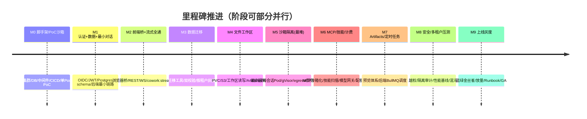
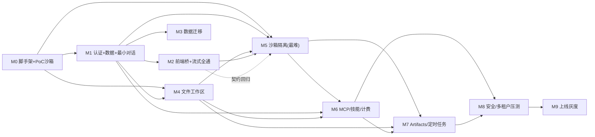
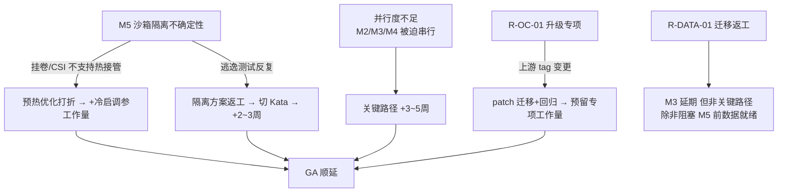

# 分阶段路线图、工作量估算与里程碑

> 本文档是整套「LobsterAI 桌面端 → 多租户 SaaS Web 应用」改造计划的**开发计划主体**，面向**项目经理、技术负责人、各域 Leader 与排期决策者**。它把 `00-总览与执行摘要.md` 的里程碑 M0–M9 与「约 28–45 人月 / 6–9 个月 / 6–8 人」的总口径，向下细化为**任务级 WBS**：每个里程碑的目标、epic/story 级任务清单、依赖、交付物、退出标准（Exit Gate）与粗工作量（人日/人月）。同时给出并行/串行关系、关键路径、团队组成与甘特式排期。
>
> 读法建议：决策者读 §1（总览）、§3（甘特与关键路径）、§4（团队与周期）；各域负责人下钻到 §2 对应里程碑的 WBS；风险准入门与本文的 Exit Gate 一一对应，详见 `18-风险登记册.md` 第 4 节。

---

## 1. 路线图总览

### 1.1 里程碑一览（里程碑权威定义）

本文 §1.1 的里程碑 **M0–M9** 为里程碑的**权威定义**，`00-总览与执行摘要.md` 为概览（00 反向对齐本文）。里程碑按本计划确定的**推进顺序**排列（认证/数据层前置、沙箱隔离作为独立硬骨头阶段、上线灰度收口）；顺序与定义均以本文 §1.1 为准（00 §5 是概览，本文是可执行分解）。

| 里程碑 | 名称 | 一句话目标 | 粗工作量 | 周期（区间） |
|---|---|---|---|---|
| **M0** | 脚手架 + PoC 沙箱 | 基础设施地基就位；手动跑通「单个 gVisor 沙箱 Pod + 内网 WS 一条 turn」PoC | ~3.5–5 人月 | 3–4 周 |
| **M1** | 认证 + 数据层 + 最小对话 | OIDC/JWT 登录、Postgres 多租户 schema、后端最小对话链路端到端 | ~4–6 人月 | 4–6 周 |
| **M2** | 前端桥 + 流式全通 | `window.electron` 同接口浏览器桥、REST/WS 传输、`cowork:stream:*` 全通道打通 | ~3–4.5 人月 | 3–5 周 |
| **M3** | 数据迁移 | SQLite→Postgres 迁移工具、双校验、按租户灰度迁移 | ~2–3 人月 | 2–3 周 |
| **M4** | 文件工作区 | 每租户 PVC + S3 工作区读写、Artifacts 存储与预览闭环 | ~3–4 人月 | 3–4 周 |
| **M5** | 沙箱隔离加固（最难，含不确定性区间） | 编排器 + 每会话 Pod + gVisor/Kata + NetworkPolicy + egress + 预热池 + 自愈 | **~5–9 人月** | **6–10 周** |
| **M6** | MCP / 技能 / 计费 | sse/http/stdio MCP 沙箱化、技能安全扫描、模型代理网关 + 配额/计费门控 | ~4–6 人月 | 4–6 周 |
| **M7** | Artifacts / 定时任务 | Artifacts 预览体系完善、定时任务经后端 BullMQ 调度（沙箱内 OpenClaw cron 禁用） | ~2.5–4 人月 | 3–4 周 |
| **M8** | 安全 / 多租户压测 | 越权测试、隔离审计、性能基线、混沌演练、合规基线 | ~2.5–4 人月 | 3–4 周 |
| **M9** | 上线灰度 | 蓝绿/金丝雀、灰度放量、Runbook、on-call、GA | ~1.5–2.5 人月 | 2–3 周 |
| | **合计** | | **约 28–45 人月** | **约 6–9 个月（并行后）** |

> **口径说明**：单里程碑「周期」是该阶段在时间轴上占用的日历时长；「人月」是投入的人力总量。因多阶段并行，日历总时长（6–9 个月）**小于**人月串行相加的等效时长。最大不确定性集中在 **M5**，其人月区间跨度最大（5–9 人月），团队 K8s/gVisor 经验不足时取上限。

### 1.2 里程碑推进（timeline，与 00 呼应）

### 1.3 WBS 层级约定

本文 WBS 三层：**里程碑（M）→ 史诗（Epic, E-Mx-n）→ 故事（Story, S-Mx-n-k）**。工作量以**人日（pd）**为单位给到 Story，汇总到 Epic 与里程碑；1 人月 ≈ 20 人日。

---

## 2. 里程碑级 WBS 详解

> 每个里程碑给出：**目标 / 前置依赖 / Epic 与 Story 清单（含粗工作量与主责角色）/ 交付物 / 退出标准（Exit Gate）/ 关键风险**。角色缩写：**BE**=后端、**FE**=前端、**PLAT**=平台/SRE、**SEC**=安全、**DATA**=数据、**QA**=测试。

---

### M0 — 脚手架 + PoC 沙箱

**目标**：把「能不能做成」的最大技术不确定性（多租户沙箱运行时）在最小成本下证伪/证实；同时把基础设施地基（K8s、Postgres、Redis、S3/MinIO、CI/CD、可观测栈）搭起来，为后续所有里程碑提供落地环境。对应 `07` 的 P0 POC。

**前置依赖**：无（起点）。需要云账号/集群资源到位。

| Epic | Story（工作量 pd，主责） | 说明 |
|---|---|---|
| **E-M0-1 基础设施地基** | S: 托管 K8s 集群 + namespace/RBAC 骨架（3, PLAT）；S: Postgres 实例 + 连接池（2, PLAT/DATA）；S: Redis（缓存/Pub-Sub/BullMQ）（2, PLAT）；S: S3/MinIO 桶 + 生命周期占位（2, PLAT）；S: 可观测栈 OTel+Prometheus+Grafana+Loki 起步（4, PLAT） | 见 `02`、`15`。IaC 化（Terraform/Helm 骨架） |
| **E-M0-2 CI/CD 流水线** | S: GitHub Actions 构建/测试/镜像流水线（3, PLAT）；S: Helm chart 骨架 + 环境（dev/staging）（3, PLAT）；S: 沙箱镜像构建流水线（OpenClaw runtime 打包）（3, PLAT/BE） | 复用现有 `npm run openclaw:runtime:host` 思路做云镜像 |
| **E-M0-3 PoC 沙箱 Pod** | S: 手动跑一个 gVisor `RuntimeClass` Pod 内 OpenClaw gateway（`0.0.0.0:{port}`+token）（4, PLAT/BE）；S: 集群内网 WS 从一个后端脚本连通 gateway、跑通一条 `chat.send` + `cowork:stream:*` 事件（5, BE/PLAT）；S: 验证挂卷/config 注入/健康探测（3, BE） | 见 `07` §14 P0、AC-4/AC-5 |
| **E-M0-4 逃逸/隔离 PoC 测试** | S: 逃逸测试集（已知 CVE PoC + syscall 探针 + 元数据/内网探测）（4, SEC/PLAT） | 对应 `18` R-ISO-01 的 PoC 准入判据 |
| **E-M0-5 项目基线** | S: 契约基线冻结（以 `附录A` 为准）+ 术语对齐（`附录B`）（2, BE/FE）；S: 骨架仓库/分支/环境约定（1, 全体） | |

**交付物**：可部署的 dev/staging 环境；一个手动可复现的「gVisor 沙箱 Pod 跑通一条 turn」PoC；逃逸测试初步结论报告；CI/CD 与镜像流水线雏形。

**退出标准（Exit Gate G0）**：
- G0.1 集群/DB/Redis/S3/可观测栈健康检查全绿，空壳环境可一键部署（对齐 00 M0 验收信号）。
- G0.2 PoC 内一条 turn 的 `message/messageUpdate/complete` 经内网 WS 正确到达（对齐 `07` AC-4/AC-5 的最小子集）。
- G0.3 逃逸测试集在 gVisor 下 **100% 被拦截**（对齐 `18` R-ISO-01 PoC 门）。
- G0.4 config 注入 + 挂卷 + 健康探测在 Pod 内验证通过（`07` AC-13 雏形）。

**关键风险**：R-OPS-01（K8s/gVisor 经验）、R-ISO-01（隔离可行性）、R-PERF-01（冷启初步观测）。若 G0.3 失败，需在进入 M1 前重估 M5 方案（Kata 兜底或架构调整）。

---

### M1 — 认证 + 数据层 + 最小对话

**目标**：把「多租户身份 + 多租户数据 schema + 后端最小对话链路」串起来，让一个已登录用户能在**后端**（暂不含浏览器桥）完成一次最小对话。这是所有业务逻辑迁移的骨架。

**前置依赖**：M0（环境、PoC 结论、契约基线）。

| Epic | Story（工作量 pd，主责） | 说明 |
|---|---|---|
| **E-M1-1 认证与租户模型** | S: OAuth2/OIDC 登录 + 标准 web 重定向（替换 loopback OAuth）（5, BE/SEC）；S: JWT 签发/校验，内含 `tenant_id`/`user_id`（3, BE）；S: 网关统一鉴权中间件（3, BE）；S: 租户/用户/成员模型（3, BE/DATA） | 见 `05`。防开放重定向/PKCE/state（R-COMP-02） |
| **E-M1-2 Postgres 多租户 schema** | S: 核心表 Prisma schema（全表带 `tenant_id`）（5, DATA/BE）；S: 可选 RLS 策略 + 服务账号上下文传递（4, DATA/SEC）；S: 索引/分区初版（会话/消息）（2, DATA） | 见 `06`、`14`。RLS 作纵深防御 |
| **E-M1-3 Cowork Service 骨架** | S: NestJS 服务骨架 + 会话/消息 CRUD（over Postgres）（5, BE）；S: 权限交互模型（`cowork:stream:permission`）（3, BE）；S: 上下文用量/胶囊读写（3, BE） | 复用 `coworkStore.ts` 领域逻辑（见 `04`） |
| **E-M1-4 后端最小对话链路** | S: Cowork Service ↔ M0 PoC 沙箱 gateway 打通 `chat.send`（4, BE）；S: 运行时事件 → `cowork:stream:*` 语义映射（复用 `openclawRuntimeAdapter.ts` 逻辑）（4, BE）；S: 用集成测试脚本跑通一条 turn（不经前端）（2, QA/BE） | 见 `04`、`07` |

**交付物**：可登录的多租户认证服务；带 `tenant_id`（+ 可选 RLS）的 Postgres 核心 schema；后端可完成一次「登录用户 → 一条 turn → 流式事件」的最小链路（脚本/集成测试驱动）。

**退出标准（Exit Gate G1）**：
- G1.1 多用户可 OIDC 登录，JWT 携带 `tenant_id`；`redirect_uri` 白名单 + state/nonce 校验通过（R-COMP-02）。
- G1.2 核心表全部带 `tenant_id`；RLS（若启用）在集成测试中阻断跨租户读（对齐 00 M2/M3 信号）。
- G1.3 后端集成测试：一条 turn 的 `cowork:stream:*` 九类事件语义正确、按 `sessionId` 隔离。
- G1.4 权限交互（permission/permissionDismiss）在后端链路可发起/响应。

**关键风险**：R-SEC-01（越权基线）、R-COMP-02（重定向安全）、R-DATA-01（schema 归属设计埋雷）。

---

### M2 — 前端桥 + 流式全通

**目标**：提供实现 `window.electron` 同接口的**浏览器桥**，让现有 React SPA 在浏览器中原样加载并调通 REST 请求与 WS 流式，`cowork:stream:*` 全通道端到端跑通。这是「不重写前端」的最大杠杆兑现点。

**前置依赖**：M1（认证、后端最小对话链路、事件语义）。

| Epic | Story（工作量 pd，主责） | 说明 |
|---|---|---|
| **E-M2-1 浏览器桥** | S: `invoke(channel, ...)` → REST 适配（3, FE）；S: `on('...:stream:*')` → WSS 订阅适配（4, FE）；S: Electron-only 通道（window/shell/dialog/clipboard/log）显式降级（3, FE） | 见 `03`、`附录A`。收口于 `src/renderer/services/*` |
| **E-M2-2 REST/WS 网关** | S: Ingress + OIDC/JWT 校验（2, PLAT/BE）；S: WSS 长连接接入 + 心跳/重连（4, BE）；S: 多副本 Redis Pub/Sub 广播 + 会话粘性（5, BE） | 见 `03`、`04`、`07` §4.3 |
| **E-M2-3 流式契约全通** | S: 逐通道映射验证（以 `附录A` 为契约基线）（4, FE/BE）；S: 序号化 + 断点续传（`lastSeq` 补发）（4, BE）；S: 幂等/去重（messageId, seq）（2, BE）；S: 背压/降采样（非关键事件）（2, BE） | 见 `03`、R-STREAM-01/R-STREAM-02 |
| **E-M2-4 静态托管** | S: Vite 构建产物静态托管 + CDN（2, PLAT/FE）；S: 环境/端点配置注入（浏览器桥端点）（1, FE） | 见 `03` |
| **E-M2-5 契约测试** | S: `cowork:stream:*` 与 `api:stream:*` 契约测试套件（3, QA/FE） | 见 `16` |

**交付物**：浏览器可加载现有 SPA；一个用户在浏览器中完成完整对话（含流式增量、权限交互、complete 收尾）；REST/WS 网关多副本可用；契约测试套件。

**退出标准（Exit Gate G2）**：
- G2.1 前端在浏览器中加载并调通只读 + 对话接口，UI/Redux/组件**零改渲染逻辑**（对齐 00 M1、`07` AC-4）。
- G2.2 `cowork:stream:*` 九类事件在浏览器端增量正确、有序、complete 必达；多副本下 Redis 广播正确（`07` AC-5）。
- G2.3 WS 断连后携 `lastSeq` 重连补发成功；断连率与乱序在阈值内（R-STREAM-01）。
- G2.4 Electron-only 通道全部显式降级（不残留 Electron 假设），契约测试全绿。

**关键风险**：R-STREAM-01/02（流式稳定性、SSE 截断）、契约漂移（00 R4）。**注意**：M2 依赖的沙箱仍是 M0 的单 PoC Pod（尚无编排器），此阶段验证的是「传输层 + 契约」，不是「多租户编排」。

---

### M3 — 数据迁移

**目标**：把单机 SQLite 的 ~19–20 张业务表迁到 Postgres 多租户 schema，保证行数/内容/关系完整性与 `tenant_id` 归属正确，支持按租户灰度与回滚。

**前置依赖**：M1（目标 schema）。可与 M2 并行（不同人力）。

> **权威口径**：SaaS 目标下定时任务的调度权威是**服务端 BullMQ + Postgres 调度**（沙箱内 OpenClaw cron 禁用/不下发）；SQLite 的 `scheduled_tasks` / `scheduled_task_runs` 属**历史遗留/迁移期表**，仅在迁移逻辑中被读出、迁入服务端调度表后废弃（以 `11-定时任务调度.md` 口径为准）；`scheduled_task_meta` 的本地绑定元数据并入服务端调度表。IM 相关表（`im_config`、`im_session_mappings`）因 IM 属「后续」，v1 迁移可**存档不启用**（见 `13`）。

| Epic | Story（工作量 pd，主责） | 说明 |
|---|---|---|
| **E-M3-1 Schema 映射表** | S: 逐表 SQLite→Postgres 列映射（类型、JSON 校验、外键、`tenant_id` 来源）（4, DATA）；S: 历史列名/JSON blob/指纹/sequence 语义处理规则（3, DATA） | 见 `06`。含 `claude_session_id`、`capsule_json`、`fingerprint` 等 |
| **E-M3-2 迁移工具三段式** | S: 抽取（SQLite 读）（2, DATA）；S: 转换（补 `tenant_id`、校验 JSON、规范化指纹）（4, DATA）；S: 加载（幂等可重跑）（3, DATA） | R-DATA-01 |
| **E-M3-3 双重校验 + 回滚** | S: 行数 + 内容校验和比对（差异非零阻断）（3, DATA/QA）；S: 源只读快照 + 回退脚本（2, DATA）；S: 迁移演练（dry-run）（2, QA) | R-DATA-01/R-DATA-02 |
| **E-M3-4 遗留表处置** | S: `scheduled_tasks/_runs` 读出迁入服务端 BullMQ+Postgres 调度表后废弃（2, DATA/BE）；S: IM 表存档不启用（1, DATA） | 见 `11`、`13` |

**交付物**：Schema 映射表（评审固化）；幂等可重跑的迁移工具；双校验报告；按租户灰度迁移与回滚脚本。

**退出标准（Exit Gate G3）**：
- G3.1 核心表全部带 `tenant_id`，读写正确（对齐 00 M3）。
- G3.2 逐表行数 + 内容校验和**零差异**；无 `tenant_id` 空值/跨租户外键（`18` R-DATA-01 门）。
- G3.3 `capsule_json`/`metadata` 解析失败率为 0；消息 sequence 保序。
- G3.4 遗留 `scheduled_tasks` 数据正确迁入服务端 BullMQ+Postgres 调度表；`scheduled_task_meta` 绑定正确。
- G3.5 回滚演练成功（可回退到源快照）。

**关键风险**：R-DATA-01（丢数据/串户，🔴）、R-DATA-02（双写不一致/超窗口）。

---

### M4 — 文件工作区

**目标**：把 gateway「本机文件工作区」升级为「每租户 PVC + S3 对象存储」的多租户工作区，打通读写、Artifacts 存储与预览，PVC 子路径严格按租户/会话隔离。

**前置依赖**：M0（PVC/S3 地基）、M1（租户模型）。可与 M2/M3 部分并行。

| Epic | Story（工作量 pd，主责） | 说明 |
|---|---|---|
| **E-M4-1 PVC 工作区** | S: 每租户 PVC + 会话子路径布局 `tenants/{tenantId}/sessions/{sessionId}`（3, PLAT/BE）；S: 挂载前二次校验（禁跨租户路径）（2, SEC/PLAT）；S: 工作区读写 API（4, BE） | 见 `08`、`07` §5.2、AC-1 |
| **E-M4-2 S3 对象存储** | S: 短时签名 URL（key 前缀含 `tenant_id`、禁列桶）（3, BE/SEC）；S: 冷数据归档到 S3 + 生命周期（3, PLAT/BE）；S: 上传/下载/断点（3, BE） | 见 `08`、R-SEC-01 |
| **E-M4-3 Config Sync 落盘改造** | S: `openclawConfigSync.ts` 逻辑抽为服务/initContainer（5, BE）；S: `openclaw.json`（动态）走 ConfigMap 渲染、`MEMORY.md`/`AGENTS.md`（持久）走 PVC（4, BE） | 见 `07` §5、AC-13 |
| **E-M4-4 Artifacts 存储闭环** | S: Artifacts 落 S3 + 预览取数（3, BE/FE）；S: 记忆/Dreaming 子系统存储归属（`user_memories`/`MEMORY.md`/dreaming）落多租户存储（3, BE） | 见 `08`、`12`；记忆存储归属见 `06`，调度归属见 `11`/`07` |

**交付物**：每租户 PVC 工作区 + S3 存储；工作区读写 API；Config Sync 服务化落盘；Artifacts 存储与预览取数闭环。

**退出标准（Exit Gate G4）**：
- G4.1 文件读写/预览/分享闭环可用（对齐 00 M7）。
- G4.2 PVC 挂载路径审计无跨租户；租户 A 无法读写租户 B 子路径（`07` AC-1）。
- G4.3 S3 签名 URL 短时有效、含 `tenant_id` 前缀、禁列桶（R-SEC-01）。
- G4.4 initContainer 渲染的 `openclaw.json` 与桌面产物字段等价（`07` AC-13）。

**关键风险**：R-SEC-01（签名/前缀越权）、R-COST-02（工作区无限增长）、R-ISO-01（挂载错配串租户）。

---

### M5 — 沙箱隔离加固（最难，含不确定性区间）

> **本里程碑是全项目风险与成本的最大来源，人月区间跨度最大（~5–9 人月）。团队 K8s/gVisor/Kata 经验不足时，周期与人月向上限取值。** 详见 `07-OpenClaw运行时编排与沙箱隔离.md` 全篇与 `14-安全合规与多租户隔离.md`。对应 `07` 的 P1–P5。

**目标**：把 M0 的「单个手动 PoC Pod」升级为**生产级多租户运行时编排**：Runtime Orchestrator + 每会话 Pod 自动创建/复用/回收 + gVisor/Kata + NetworkPolicy + egress 代理 + 预热池 + Pod 级自愈。

**前置依赖**：M0（PoC 结论、镜像流水线）、M1（Cowork↔gateway 链路）、M4（PVC/Config Sync 落盘）。**M5 是关键路径核心段**。

| Epic | Story（工作量 pd，主责） | 说明 |
|---|---|---|
| **E-M5-1 Runtime Orchestrator** | S: Acquire/Release/Renew 租约契约 + 最小 RBAC kube client（6, PLAT/BE）；S: 会话→Pod Redis 路由表 + reconcile 对账（清理孤儿 Pod）（5, PLAT/BE）；S: 生命周期状态机（idleSoft/idleHard/leaseTTL/maxPodLifetime 回收）（6, PLAT/BE） | `07` §3、AC-7/AC-9/AC-10 |
| **E-M5-2 每会话 Pod 编排** | S: 按会话创建/复用/回收 Pod + 挂载租户 PVC 子路径 + 注入 token/config（6, PLAT/BE）；S: 连接与流式回传（内网 WS + Redis 广播接 M2 传输）（4, BE） | `07` §2/§4 |
| **E-M5-3 沙箱强度加固** | S: `RuntimeClass` gVisor（默认）+ Kata（企业档位）（5, PLAT/SEC）；S: securityContext 基线（非 root/只读根/drop caps/seccomp）（3, SEC/PLAT）；S: NetworkPolicy 默认拒绝入站/横向（3, SEC/PLAT） | `07` §8、AC-2/AC-3 |
| **E-M5-4 Egress 出站控制** | S: egress 代理（Squid/Envoy）+ allowlist/denylist（禁元数据/内网）（5, SEC/PLAT）；S: 出站审计日志（计费/溯源）（2, SEC） | `07` §8.4、AC-2、R-ISO-03 |
| **E-M5-5 资源配额与调度** | S: ResourceClass 档位 + 每租户 ResourceQuota/LimitRange（3, PLAT）；S: 每租户并发 Pod 上限 + acquire 入队削峰（BullMQ）（4, PLAT/BE）；S: 反亲和/优先级/超配额降级（3, PLAT） | `07` §6、R-ISO-02 |
| **E-M5-6 冷启动优化（预热池）** | S: 预热池 minReady 水位 + 净室绑定校验（5, PLAT）；S: 镜像预拉 + 节点预留 + 沙箱运行时预热（4, PLAT）；S: **POC 实测挂卷/CSI 能力，决定「热 Pod 直接接管」是否可行**（3, PLAT） | `07` §7（含 v1 折中与不确定性），AC-6 |
| **E-M5-7 故障自愈** | S: Pod 级重建 + 刷新 Redis connectUrl + Cowork 重连（4, PLAT/BE）；S: `session.continue` + capsule 无损续接（4, BE）；S: 迁移 `openclawGatewayRepair.ts` 语义（备份坏 config 到 S3）（2, BE） | `07` §9、AC-8 |
| **E-M5-8 运行时可观测** | S: 本域指标（acquire 时延/warmpool 命中率/pod_seconds/重连/egress 拦截）（3, PLAT）；S: 追踪贯穿 turn→acquire→gateway（2, PLAT） | `07` §11 |

**交付物**：生产级 Runtime Orchestrator；多租户每会话 Pod 编排；隔离基线（gVisor/Kata + securityContext + NetworkPolicy + egress）；预热池；Pod 级自愈；运行时可观测指标。

**退出标准（Exit Gate G5）**：
- G5.1 多租户并发、跨租户越权测试全绿（对齐 00 M5、`07` AC-1/AC-2/AC-3）。
- G5.2 事件契约不变（`07` AC-4/AC-5，回归 M2 契约测试）。
- G5.3 冷启性能：预热命中 p95 acquire→ready < 3s、冷启 p95 < 15s、warmpool 命中率 > 80%（`07` AC-6）。**若挂卷/CSI 不支持热接管，退化为「镜像+节点预热」，指标目标相应调整并记录（R-PERF-01）。**
- G5.4 并发/限流：超并发优雅排队不影响已有会话；acquire 入队不打爆 K8s API（`07` AC-7）。
- G5.5 自愈无损：杀活跃 Pod 后 60s 内重建 + `session.continue` 恢复上下文、工作区零丢失（`07` AC-8）。
- G5.6 租约防泄漏 + 回收正确性（`07` AC-9/AC-10）。

**关键风险**：R-ISO-01（沙箱逃逸，🔴）、R-ISO-02（吵闹邻居）、R-PERF-01（冷启）、R-OC-02（容器内文件系统/端口/TZ 强假设失效）、运行时挂卷限制致预热失效。**M5 是最大不确定性来源，排期务必留缓冲。**

---

### M6 — MCP / 技能 / 计费

**目标**：在沙箱隔离基线（M5）之上，把 MCP（stdio/sse/http）、技能（Skills/Kits）与模型代理网关 + 配额/计费门控落到多租户环境。

**前置依赖**：M5（沙箱、egress、编排）、M1（认证/租户）、M4（工作区）。

| Epic | Story（工作量 pd，主责） | 说明 |
|---|---|---|
| **E-M6-1 MCP 三类传输** | S: sse/http MCP 经内网/egress 代理接入（4, BE/SEC）；S: **stdio MCP 仅在会话沙箱内 `npx` 运行 + 包白名单 + 内网私有 registry 镜像**（5, BE/SEC）；S: `mcp_servers`/`mcp_launch_resolutions` 多租户化（3, BE） | 见 `10`、`07` §10、R-ISO-03 |
| **E-M6-2 技能（Skills/Kits）** | S: 技能同步/安装/升级（多租户存储）（4, BE）；S: 安全扫描 + 启用态 + 路由提示（4, SEC/BE）；S: 自建技能存储（替代 youdao skill store）（3, BE） | 见 `10`、`13` |
| **E-M6-3 模型代理网关** | S: 自建模型代理（复用 `coworkModelApi.ts`/`coworkOpenAICompatProxy.ts` 逻辑，Anthropic/Gemini/OpenAI 兼容）（5, BE）；S: `api:stream:*` SSE 经网关（禁缓冲/超时/keep-alive）（3, BE）；S: provider 抽象 + 多 key/故障切换（4, BE） | 见 `09`、R-VENDOR-01/R-STREAM-02。Pod 不持真实上游 key |
| **E-M6-4 配额与计费门控** | S: 强一致额度账户（free/standard/daily，复用 `creditsLimit/Used/Remaining` 语义）（4, BE/DATA）；S: 预扣 + 结算 + 额度耗尽拒绝（4, BE）；S: 多层熔断（租户速率/并发/单会话时长/turn 上限）（4, BE）；S: 用量流水 + 预算告警（沙箱时长 + token + egress + 存储合并账单）（3, BE/PLAT） | 见 `09`、`07` §10.2、R-COST-01/R-COST-02 |

**交付物**：多租户 MCP（stdio 沙箱化）；自建技能存储 + 安全扫描；自建模型代理网关（多 provider/故障切换）；强一致额度 + 预扣结算 + 熔断 + 用量计费。

**退出标准（Exit Gate G6）**：
- G6.1 三域功能在多租户下可用（对齐 00 M6/M8）。
- G6.2 stdio MCP 仅在沙箱内运行、非白名单包被拒、出网经 egress 代理（R-ISO-03、`07` AC-2）。
- G6.3 计费准确：模型 token + 沙箱 `pod_seconds` + egress 可按租户对账（`07` AC-12）；超额拦截生效（R-COST-01）。
- G6.4 provider 故障切换演练通过（R-VENDOR-01）。
- G6.5 `api:stream:*` 长响应不被网关截断（R-STREAM-02）。

**关键风险**：R-COST-01（成本失控，🔴）、R-ISO-03（stdio RCE/供应链，🔴）、R-VENDOR-01（上游依赖）、R-OC-01（MCP/SSE 相关 patch 回归）。

---

### M7 — Artifacts / 定时任务

**目标**：完善 Artifacts 预览体系（隔离/沙箱化预览）与定时任务的多租户调度（经后端 BullMQ 调度，沙箱内 OpenClaw cron 禁用）。

**前置依赖**：M4（Artifacts 存储）、M5（沙箱/编排）、M6（额度门控用于定时任务计费）。

| Epic | Story（工作量 pd，主责） | 说明 |
|---|---|---|
| **E-M7-1 Artifacts 预览体系** | S: html/svg/image/video/mermaid/code/markdown/document/local-service 预览多租户化（5, FE/BE）；S: HTML 本地预览服务 → 隔离预览服务（iframe sandbox + CSP + SSRF 网络策略）（5, SEC/FE）；S: 自建 HTML share（替代 youdao share，`htmlShare:*` 语义、不可枚举 token）（4, BE/SEC) | 见 `12`、R-SEC-02 |
| **E-M7-2 定时任务调度** | S: 定时任务经后端 BullMQ 调度（沙箱内 OpenClaw cron 禁用）（4, BE）；S: `scheduled_task_meta` 本地绑定元数据多租户化（2, BE/DATA）；S: 触发时 acquire 沙箱 + 额度门控（3, BE） | 见 `11`、`07` §5.3（Pod 内不下发/不常驻 cron） |
| **E-M7-3 预览/任务可观测** | S: 预览容器 SSRF/CSP 违规上报（2, SEC）；S: 定时任务运行历史/失败告警（2, BE/PLAT） | 见 `12`、`11`、`15` |

**交付物**：多租户 Artifacts 预览（隔离化）+ 自建 HTML share；定时任务经后端 BullMQ 调度（沙箱内 OpenClaw cron 禁用）；相关可观测。

**退出标准（Exit Gate G7）**：
- G7.1 各 previewable 类型在多租户下可预览；HTML/SVG/Office 预览 iframe sandbox + CSP + SSRF 策略生效（R-SEC-02）。
- G7.2 HTML share 不可枚举、token + 状态校验（对齐 `htmlShare:*` 语义，R-SEC-01）。
- G7.3 定时任务触发正确、经额度门控、经后端 BullMQ 调度（沙箱内 OpenClaw cron 禁用）；运行历史可查（对齐 00 M8）。

**关键风险**：R-SEC-02（预览 XSS/SSRF，🔴）、定时任务与沙箱冷启耦合（R-PERF-01）。

---

### M8 — 安全 / 多租户压测

**目标**：在功能基本齐备后，做系统级安全验收（越权/隔离/SSRF）、性能基线与容量压测、混沌演练与合规基线，作为 GA 前的准入总检。对应 `16-测试策略与验收标准.md` 的验收总集。

**前置依赖**：M2–M7（功能齐备）。

| Epic | Story（工作量 pd，主责） | 说明 |
|---|---|---|
| **E-M8-1 越权/隔离安全测试** | S: 「A 用 B 的 id」自动化越权套件（会话/Artifacts/MCP/share）（5, SEC/QA）；S: 跨租户 PVC/网络越权探针（沿用 M0/M5 用例扩展）（3, SEC）；S: 运行时 syscall 审计（Falco 类）+ 逃逸告警演练（4, SEC/PLAT） | 见 `14`、`16`、`07` AC-1/AC-2/AC-3 |
| **E-M8-2 性能与容量压测** | S: 冷启/并发/流式 p95 基线压测（4, QA/PLAT）；S: Postgres 高并发写入/分页压测（3, DATA/QA）；S: 成本/资源利用率画像（bin-packing 调优）（3, PLAT） | 见 `15`、`16`、R-PERF-01/R-PERF-02 |
| **E-M8-3 混沌与自愈演练** | S: 杀 Pod/杀副本/节点故障演练（自愈无损）（4, PLAT/QA）；S: provider 故障切换 + 上游限流演练（2, BE/QA） | 见 `15`、`07` AC-8/AC-9，R-VENDOR-01 |
| **E-M8-4 合规基线** | S: DPA/数据驻留/留存与删除权流程（4, SEC/合规）；S: 日志/PII 最小化 + 到期清理（2, SEC/PLAT） | 见 `14`、`05`、R-COMP-01 |

**交付物**：越权/隔离测试报告（全绿）；性能/容量基线报告；混沌演练报告；合规基线签署。

**退出标准（Exit Gate G8）**：
- G8.1 越权测试全绿；跨租户越权用例 100% 被拦截（`18` 单租户→多租户/多租户→GA 门）。
- G8.2 容量/延迟 SLA 达标（冷启、流式、DB）（R-PERF-01/R-PERF-02）。
- G8.3 混沌演练自愈无损（`07` AC-8/AC-9）；provider 故障切换演练通过（R-VENDOR-01）。
- G8.4 合规基线签署、留存/删除流程可用（R-COMP-01）。

**关键风险**：R-SEC-01/R-ISO-01（越权/逃逸，🔴）、R-COMP-01（合规，🔴）、R-PERF-01/02。

---

### M9 — 上线灰度

**目标**：以蓝绿/金丝雀发布、按租户灰度放量、Runbook + on-call 就绪，达成可对外开放的 GA。

**前置依赖**：M8（准入总检通过）。

| Epic | Story（工作量 pd，主责） | 说明 |
|---|---|---|
| **E-M9-1 发布与回滚** | S: 蓝绿/金丝雀发布 + 一键回滚 + 健康门禁（4, PLAT）；S: 沙箱镜像/OpenClaw 版本金丝雀（对齐升级 SOP）（3, PLAT/BE） | 见 `15`、R-OPS-02、R-OC-01 |
| **E-M9-2 灰度放量** | S: 按租户灰度策略 + 用量/成本/错误率看板门槛（3, PLAT/BE）；S: 逐步放量 + 回滚触发条件（2, PLAT） | 见 `15`、`18` §4 GA 门 |
| **E-M9-3 运维就绪** | S: Runbook（沙箱/DB/流式/计费故障处置）（4, PLAT/SRE）；S: on-call + 告警接线（触发信号仪表化）（3, PLAT）；S: 告警阈值与 SLO 定稿（2, PLAT） | 见 `15`、`18` §5 |

**交付物**：蓝绿/金丝雀发布链路 + 一键回滚；按租户灰度放量；Runbook + on-call + 告警。

**退出标准（Exit Gate G9 / GA）**：
- G9.1 满足 `16-测试策略与验收标准.md` 的验收标准，可对外开放（对齐 00 M9）。
- G9.2 硬配额 + 熔断上线；合规基线签署；容量/延迟 SLA 达标；provider 故障切换演练通过（`18` 多租户→GA 门）。
- G9.3 金丝雀无回归后全量；一键回滚演练通过（R-OPS-02）。

**关键风险**：R-OPS-02（CI/CD 回滚可靠性）、R-OC-01（上线期版本升级）、R-COST-01/R-COMP-01（GA 前最后守门）。

---

## 3. 依赖、关键路径与甘特

### 3.1 里程碑依赖图

### 3.2 并行 vs 串行

| 关系 | 里程碑 | 说明 |
|---|---|---|
| **串行主干（关键路径）** | M0 → M1 → M5 → M6 → M8 → M9 | 沙箱隔离（M5）与其上的 MCP/计费（M6）是不可压缩的技术硬骨头，决定项目总周期 |
| **可并行（M1 后）** | M2、M3、M4 三线并行 | M2（前端桥/传输）、M3（数据迁移）、M4（工作区）无强互相依赖，可分别由 FE/DATA/BE 团队并行；三者在 M5 前汇合（M2 提供传输、M4 提供 PVC/Config Sync 给 M5） |
| **半并行** | M7 与 M6 尾段重叠 | M7 依赖 M5，可在 M6 计费门控就绪后开工，部分与 M6 重叠 |
| **收敛** | M8 汇聚全部功能 | M6/M7 完成后统一进 M8 系统级验收 |

**关键路径（Critical Path）**：`M0 → M1 → M5 → M6 → M8 → M9`。其中 **M5 是关键路径上最长且最不确定的一段**（6–10 周），任何延期直接顺延 GA。M2/M3/M4 若能在 M1 结束后并行完成，则不进入关键路径；若人力不足导致串行，则会把关键路径拉长约 3–5 周（见 §4.3 敏感性）。

### 3.3 甘特式排期表（并行推进，示例基于「乐观下限」周历）

> 下表以**周（W）**为刻度，展示并行推进下的时间轴（乐观下限 ~24 周 ≈ 6 个月）。悲观上限见 §4.2（~9 个月）。`█`=主推进，`░`=收尾/回归重叠，`▒`=准备/并行支线。

| 里程碑 | W1-4 | W5-8 | W9-12 | W13-16 | W17-20 | W21-24 |
|---|---|---|---|---|---|---|
| **M0** 脚手架+PoC | `████` | | | | | |
| **M1** 认证+数据+对话 | `░▒` | `████` | | | | |
| **M2** 前端桥+流式 | | `░▒` | `████` | `░` | | |
| **M3** 数据迁移 | | `░▒` | `███` | | | |
| **M4** 文件工作区 | | `▒` | `████` | `░` | | |
| **M5** 沙箱隔离(最难) | | | `░▒` | `██████` | `██████` | `░` |
| **M6** MCP/技能/计费 | | | | | `████` | `████` |
| **M7** Artifacts/定时 | | | | | `░▒` | `███` |
| **M8** 安全/压测 | | | | | | `░████` |
| **M9** 上线灰度 | | | | | | `░██` |

```mermaid
gantt
  title 甘特（并行推进，乐观下限 ~24 周）
  dateFormat  X
  axisFormat  W%s
  section 关键路径
  M0 脚手架+PoC          :m0, 0, 4
  M1 认证+数据+最小对话  :m1, 3, 5
  M5 沙箱隔离(最难)      :crit, m5, 11, 10
  M6 MCP/技能/计费       :m6, 19, 6
  M8 安全/多租户压测     :m8, 23, 3
  M9 上线灰度            :m9, 25, 3
  section 并行支线
  M2 前端桥+流式全通     :m2, 8, 5
  M3 数据迁移            :m3, 8, 3
  M4 文件工作区          :m4, 8, 5
  M7 Artifacts/定时任务  :m7, 20, 4
```

> 图中 `crit` 标注 M5 为关键路径核心段。M2/M3/M4 在 M1 尾部启动、并行推进；M6/M7 在 M5 就绪后开工。总时长在乐观下限约 24–28 周（6–7 个月），悲观上限约 36 周（9 个月），差异主要由 M5 不确定性与并行度决定。

---

## 4. 团队组成、周期与工作量

### 4.1 建议团队组成与角色（与 00 一致）

推荐团队规模 **6–8 人**，并行推进。角色与主责域：

| 角色 | 人数 | 主要负责里程碑/域 |
|---|---|---|
| **后端（Node/TS/NestJS）** | 2–3 | M1 认证/数据、M1/M4 Cowork/工作区、M6 模型代理/计费、M7 定时任务；复用 `src/main/libs/*`、`*Store.ts` 领域逻辑 |
| **平台 / DevOps / K8s（SRE）** | 1–2 | M0 地基/CI-CD、**M5 沙箱编排/gVisor/Kata/egress/预热池（攻坚）**、M8 压测/混沌、M9 发布 |
| **前端** | 1 | M2 浏览器桥/传输适配/Electron-only 降级、M7 Artifacts 预览 |
| **数据 / 迁移** | 0.5–1 | M1 schema、M3 迁移（可与后端复用人力） |
| **安全 / QA** | 1 | 全程越权/隔离测试、M5/M8 隔离验收、M6 MCP/供应链、M7 预览 SSRF、M8 合规/压测/验收 |

**关键不确定性集中在 M5**：若 SRE/安全缺乏 K8s/gVisor/Kata 深水区经验，需在 M0 尽早引入外部专家或培训（R-OPS-01），并把 M5 人月向上限取值。

### 4.2 工作量与周期区间汇总

| 维度 | 乐观下限 | 悲观上限 | 说明 |
|---|---|---|---|
| 人力总投入 | ~28 人月 | ~45 人月 | 与 00 一致；差异主要来自 M5 与整体不确定性 |
| 总周期（到 GA，M0–M9，并行后） | ~6 个月 | ~9 个月 | 与 00 一致 |
| MVP（M0–M2，浏览器端单会话端到端跑通） | ~2.5 个月 | ~3.5 个月 | 对齐 00「单租户端到端」口径（本文 M0–M2 即浏览器可对话；M3/M4 并行不阻塞对话演示） |
| M5 沙箱隔离（最大不确定性） | ~1.5 个月 | ~2.5 个月 | 对齐 00「多租户隔离硬骨头」口径 |

> **人月 vs 里程碑人月的对账**：§1.1 各里程碑人月区间相加 ≈ 30.5–47.5 人月，与总口径 28–45 人月一致（区间重叠部分因并行/复用略有出入，属正常粗估浮动）。排期以**日历周期 6–9 个月**为承诺沟通口径，人月为人力预算口径。

### 4.3 周期敏感性（什么会拖长关键路径）

- **最敏感**：M5（沙箱隔离）——挂卷能力、逃逸测试、Kata 兜底任一触发都直接顺延 GA。排期务必在 M5 预留 1–2 周缓冲。
- **次敏感**：并行度——M2/M3/M4 是否真并行取决于人力配比；6 人以下易被迫串行，把关键路径拉长 3–5 周。
- **专项预留**：R-OC-01（OpenClaw 升级/patch 回归）应作为**跨阶段常驻预算**（见 `18` §3.3），尤其在 M6（MCP/SSE patch 密集）与 M9（上线期升级）。

---

## 5. 里程碑 Exit Gate 与风险准入门映射

本文每个里程碑的 Exit Gate 与 `18-风险登记册.md` 第 4 节的阶段准入门一一对应。任一里程碑的 🔴 风险缓解未达标，**不得进入下一里程碑**。

| Exit Gate | 里程碑 | 必须清账的关键风险（来自 `18`） | 对应 `18` 阶段门 |
|---|---|---|---|
| G0 | M0 | R-ISO-01（逃逸 PoC）、R-OPS-01（K8s PoC）、R-OC-01（patch 回归套件建成） | PoC → 单租户 |
| G1 | M1 | R-SEC-01（越权基线）、R-COMP-02（重定向）、R-DATA-01（schema 归属） | — |
| G2 | M2 | R-STREAM-01/02（流式续传/SSE） | — |
| G3 | M3 | R-DATA-01（双校验 0 差异）、R-DATA-02（窗口/双写） | 单租户 → 多租户灰度（数据部分） |
| G4 | M4 | R-SEC-01（签名 URL/前缀）、R-COST-02（工作区增长）、R-ISO-01（挂载错配） | — |
| G5 | M5 | R-ISO-01/02（逃逸/邻居）、R-PERF-01（冷启）、R-OC-02（容器强假设） | 单租户 → 多租户灰度（隔离部分） |
| G6 | M6 | R-COST-01（配额熔断）、R-ISO-03（stdio RCE）、R-VENDOR-01（上游） | 多租户 → GA（成本部分） |
| G7 | M7 | R-SEC-02（预览 XSS/SSRF） | — |
| G8 | M8 | R-SEC-01/R-ISO-01（越权/逃逸）、R-COMP-01（合规）、R-PERF-01/02 | 多租户 → GA（安全/合规/性能） |
| G9 | M9 | R-OPS-02（回滚）、R-COST-01/R-COMP-01（GA 守门） | 公网 GA |

---

## 6. 交付物清单（按里程碑汇总）

| 里程碑 | 核心交付物 |
|---|---|
| M0 | dev/staging 环境（IaC）；单 gVisor Pod PoC；逃逸测试报告；CI/CD + 沙箱镜像流水线 |
| M1 | OIDC/JWT 认证服务；Postgres 多租户 schema（+RLS）；Cowork Service 骨架；后端最小对话链路 |
| M2 | `window.electron` 同接口浏览器桥；REST/WS 网关（多副本广播）；静态托管+CDN；契约测试套件 |
| M3 | Schema 映射表；幂等迁移工具；双校验报告；按租户灰度 + 回滚脚本 |
| M4 | 每租户 PVC 工作区 + S3 存储；工作区读写 API；Config Sync 服务化；Artifacts 存储闭环 |
| M5 | Runtime Orchestrator；每会话 Pod 编排；隔离基线（gVisor/Kata+securityContext+NetworkPolicy+egress）；预热池；Pod 级自愈；运行时可观测 |
| M6 | 多租户 MCP（stdio 沙箱化）；自建技能存储+安全扫描；自建模型代理网关（多 provider）；额度+预扣结算+熔断+计费 |
| M7 | 多租户 Artifacts 预览（隔离化）+ 自建 HTML share；定时任务经后端 BullMQ 调度（沙箱内 OpenClaw cron 禁用） |
| M8 | 越权/隔离测试报告；性能/容量基线；混沌演练报告；合规基线签署 |
| M9 | 蓝绿/金丝雀发布+回滚；按租户灰度放量；Runbook+on-call+告警；GA |

---

## 7. 交叉引用

- 全局与里程碑概览、总口径（28–45 人月 / 6–9 个月）：`00-总览与执行摘要.md`
- 目标架构与技术选型（各里程碑技术栈依据）：`02-目标架构与技术选型.md`
- 前端桥/传输/流式（M2）：`03-前端与传输层改造.md`、`附录A-IPC通道与接口映射.md`
- 后端服务与 API（M1/M4/M6/M7 服务边界）：`04-后端服务与API设计.md`
- 认证与多租户（M1）：`05-认证与多租户账户.md`
- 数据迁移（M3）：`06-数据模型迁移.md`
- 沙箱编排与隔离（M5，最难）：`07-OpenClaw运行时编排与沙箱隔离.md`
- 文件工作区与对象存储（M4）：`08-文件工作区与对象存储.md`
- 模型代理与计费（M6）：`09-模型代理与计费.md`
- MCP 与技能（M6）：`10-MCP与技能改造.md`
- 定时任务调度（M7，权威口径）：`11-定时任务调度.md`
- Artifacts 与预览（M7）：`12-Artifacts与预览改造.md`
- 功能取舍与降级（范围边界，R-SCOPE）：`13-功能取舍与降级清单.md`
- 安全合规与多租户隔离（M5/M8）：`14-安全合规与多租户隔离.md`
- 部署运维与可观测性（M0/M8/M9）：`15-部署运维与可观测性.md`
- 测试策略与验收标准（各 Exit Gate 判据）：`16-测试策略与验收标准.md`
- 风险登记册与阶段准入门（§5 映射）：`18-风险登记册.md`
- 术语表与阅读指南：`附录B-术语表与阅读指南.md`
