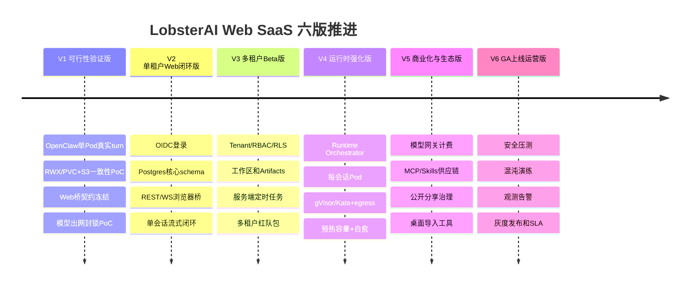
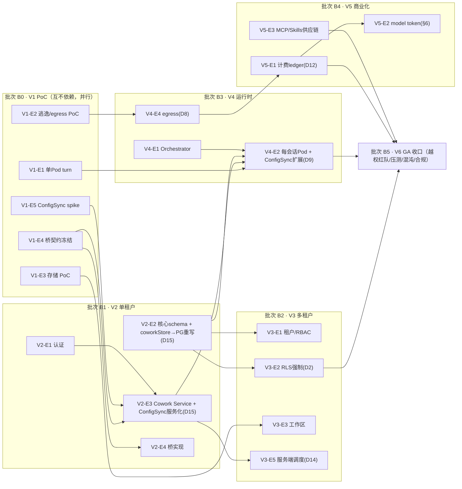

# 分版本路线图、工作量估算与里程碑

> 本文档是整套「LobsterAI 桌面端 → 多租户 SaaS Web 应用」改造计划的**开发计划主体**，面向项目经理、技术负责人、各域 Leader 与排期决策者。本文把原 M0-M9 里程碑口径重构为**第一版到第六版**的交付节奏：每一版都是可验收、可复盘、可决定继续/调整/暂停的阶段，而不是单纯按模块排队。
>
> 本文 §1.1 为六版**版本节奏与工作量**的权威定义。其他章节如仍出现旧 M0-M9 表述，按本文 §1.2 的映射理解，并应在后续维护中逐步改为 V1-V6 口径。
>
> **门 ID、必过测试与必清风险以附录 C §8（D13）唯一对照表为准**：阶段门统一命名 V1–V6，`P0–P3`、`GV1–GV6` 别名一律废弃（本文正文中「P0/P1」仅指缺陷严重级，非阶段门）。本文各版 `G-Vx.y` 子门是附录 C §8 中 `G-Vx` 的展开，逐条上卷到该表。工作量的自底向上复算见 §4.4。

---

## 1. 路线图总览

### 1.1 六版一览（权威定义）

| 版本 | 名称 | 一句话目标 | 产品成熟度 | 粗工作量 | 周期 |
|---|---|---|---|---:|---:|
| **第一版 V1** | 可行性验证版 | 用真实 OpenClaw 云端沙箱证明“能不能做成”，同时冻结桥、配置、存储、模型出网四个关键契约 | 技术 PoC，不对外 | 4-6 人月 | 4-6 周 |
| **第二版 V2** | 单租户 Web 闭环版 | 浏览器登录后可完成单租户单会话对话、流式返回、基础 Artifacts 查看 | 内部 Alpha | 5-7 人月 | 5-7 周 |
| **第三版 V3** | 多租户 Beta 版 | 租户、成员、RBAC、RLS、工作区、Artifacts、定时任务形成可灰度的多租户 Beta | 邀请制 Beta | 6-8 人月 | 6-8 周 |
| **第四版 V4** | 运行时强化版 | Runtime Orchestrator、每会话 Pod、gVisor/Kata、egress、预热容量、自愈达到生产基线 | 生产预备 | 6-10 人月 | 7-10 周 |
| **第五版 V5** | 商业化与生态版 | 模型网关计费、MCP/Skills 供应链治理、公开分享治理、桌面导入工具补齐 | 付费试点 | 5-8 人月 | 5-8 周 |
| **第六版 V6** | GA 上线运营版 | 安全压测、混沌演练、观测告警、发布回滚、SLA、合规与运营流程全部达标 | GA | 4-6 人月 | 4-6 周 |
| | **合计** | | | **约 30-45 人月** | **约 7-10 个月（并行后）** |

> 口径说明：六版并非全部串行。V1 的可行性验证门（G-V1）决定是否继续；V2 与部分 V3 数据工作可并行；V4 是关键路径中风险最高的一版；V5 的商业化/生态能力可在 V4 后半段并行预研；V6 只能在 V4/V5 核心门槛通过后进入。粗工作量列为人月区间，其自底向上 pd 复算与 30-45 人月的对齐关系见 §4.4；每版核心验收/必过测试/必清风险的权威映射见附录 C §8。

### 1.2 旧 M0-M9 到新版 V1-V6 的映射

| 旧里程碑 | 新版归属 | 调整原因 |
|---|---|---|
| M0 脚手架 + PoC 沙箱 | V1 | PoC 沙箱不再只是环境准备，而是项目准入门槛。 |
| M1 认证 + 数据层 + 最小对话 | V2 起步，V3 完整化 | V2 先跑单租户闭环；V3 再补租户组织、RBAC、RLS 强约束。 |
| M2 前端桥 + 流式全通 | V1 契约冻结，V2 实现闭环 | 桥契约必须 V1 冻结，否则后端和前端会并行漂移。 |
| M3 数据迁移 | V3/V5 | SaaS 新 schema 是 V3 必需；桌面数据导入工具是 V5，可不阻塞 Beta。 |
| M4 文件工作区 | V1 存储 PoC，V3 产品化 | RWX/PVC/S3 是高风险假设，必须 V1 验证；完整工作区在 V3 交付。 |
| M5 沙箱隔离加固 | V1 可行性门，V4 生产硬化 | V1 证伪/证实，V4 做生产级编排、预热容量、自愈与容量。 |
| M6 MCP / 技能 / 计费 | V5 | MCP/Skills 和计费会放大安全与成本风险，应在运行时基线稳定后付费试点。 |
| M7 Artifacts / 定时任务 | V2/V3/V5 | V2 只读预览，V3 多租户存储与调度，V5 公开分享治理。 |
| M8 安全 / 多租户压测 | V1/V3/V4/V6 分层门禁 | 安全不是单独收尾阶段；每版都有阻断门，V6 做全站压测与最终准入。 |
| M9 上线灰度 | V6 | 灰度、Runbook、on-call、SLA、合规归入 GA 运营版。 |

### 1.3 六版推进图

### 1.4 版本准入原则

1. **V1 不通过，不进入 V2 大规模开发。** V1 的目标是尽早发现“不适合按当前方案做”的事实，不是为了做出可演示 UI。
2. **V2 不承诺多租户安全。** V2 只证明浏览器单租户闭环，不能对外开放给不可信用户。
3. **V3 才是邀请制 Beta 的最低门槛。** 没有租户、RBAC、RLS、对象存储前缀、工作区隔离和基础红队测试，不允许真实外部租户试用。
4. **V4 是生产安全底座。** 每会话 Pod、egress、ResourceQuota、预热容量、自愈、审计不达标，V5/V6 不能对付费用户放量。
5. **V5 解决“能不能卖”。** 模型成本、账单、MCP/Skills 供应链、公开分享 abuse 都属于商业化风险。
6. **V6 解决“能不能长期运营”。** 发布、回滚、值班、SLO、数据删除、审计、事故流程必须可演练。

### 1.5 主线范围排除项

以下能力不进入 V1-V6 GA 主线，不应作为任一版本的退出门槛：

- IM 渠道（微信、飞书、钉钉、QQ、Telegram、Discord、邮件、NIM 等）：GA 后独立专项评估。
- computer-use 桌面自动化：SaaS 无用户本机桌面宿主，本主线不做。
- VM / 后台浏览器自动化：成本与隔离风险高，本主线不做。
- 第三方 OAuth 代持（GitHub Copilot / OpenAI Codex device-code）：GA 后按安全和合规专项评估。

---

## 2. 分版本 WBS 详解

> 角色缩写：BE=后端，FE=前端，PLAT=平台/SRE，SEC=安全，DATA=数据，QA=测试，PM=产品/项目。
>
> **pd 记法（统一）**：Story 括号内 `(pd, 角色)` 的数字是该 Story 跨所列全部角色的**总人天**（不是每角色各这么多），主责角色列在最前、协作角色其后。需要分摊时按主责 60% / 协作 40% 粗分。各 Epic/版本小计与自底向上→人月的换算系数、缓冲/联调/返工加成，统一在 §4.4 复算，可从下列逐 Story 表加总核对。
>
> **门与验收对齐**：各版「退出门槛 G-Vx.y」是附录 C §8 中 `G-Vx` 的展开；跨租户越权、迁移双读等硬门的版本时点以附录 C §8 为准（见 D13）。凡涉及 RLS/游标/RPC 名/计费/配置下发/复用分级等被附录 C 拍死的决策，本文按「见附录 C Dx」就地对齐，不再重复其字段级 schema。

### 第一版 V1：可行性验证版

**目标。** 用最短路径证明核心技术路线可行：OpenClaw 能在云端沙箱 Pod 内稳定跑一条真实 turn；浏览器桥契约、`openclaw.json` 配置渲染、PVC/S3 工作区、模型出网封锁都有可复现证据。

**前置依赖。** 云账号/测试集群、当前桌面端源码、OpenClaw pinned 版本、基础模型供应商测试 key。

| Epic | Story（pd，主责） | 交付物 |
|---|---|---|
| V1-E0 Sandbox 镜像与 Linux 运行尖刺 | S1: 在目标 Linux 架构构建 OpenClaw runtime 镜像，校验 bundle/插件/原生模块（4, PLAT/BE）；S2: 证明生产 runtime 镜像不含 Electron UI、Xvfb/noVNC、真实密钥或租户数据（2, SEC/PLAT）；S3: 用容器运行 gateway 到 ready，记录空闲/首 turn/MCP 场景资源足迹（3, QA/PLAT）；S4: 明确旧 GUI/noVNC 仅作为 debug profile，不进入 GA 主线（1, PM/SEC） | runtime 镜像 PoC、内容检查报告、资源采样 |
| V1-E1 OpenClaw 单 Pod 真实 turn | S1: gVisor RuntimeClass Pod 内启动 gateway（4, PLAT）；S2: 后端脚本经集群内网 WS 发送一条 turn 并收齐 `message/messageUpdate/complete`（5, BE/QA）；S3: 验证 Pod state/PVC/env/Secret 映射覆盖旧 `HOME/userData` 依赖（4, BE/PLAT）；S4: 记录启动、首 token、完整 turn 时延（2, QA） | 可复现脚本、Pod manifest、PoC 报告 |
| V1-E2 沙箱逃逸与 egress PoC | S1: NetworkPolicy 默认拒绝并仅放行模型网关占位服务（3, SEC/PLAT）；S2: 阻断 metadata/internal CIDR/provider 直连测试（3, SEC）；S3: gVisor syscall/逃逸探针测试（4, SEC）；S4: 失败场景记录与 Kata 兜底评估（2, PLAT） | 逃逸测试报告、egress allow/deny 证据 |
| V1-E3 工作区存储 PoC | S1: 评估 RWX PVC 候选（EFS/CephFS/NFS/云盘方案）（3, PLAT）；S2: Pod 与文件服务并发读写同一 workspace（4, BE/PLAT）；S3: 测试 inotify/事件补偿、断连重挂载、一致性延迟（4, QA/PLAT）；S4: S3 mirror key 前缀与生命周期样例（2, BE） | 存储基准、失败清单、V3 选型建议 |
| V1-E4 Web 桥与事件契约冻结 | S1: 从 `preload.ts`/`window.electron` 提取接口清单（3, FE）；S2: 生成 invoke→REST、send→WS 映射草案（3, FE/BE）；S3: 定义 WS ticket 鉴权、`lastSeq` 补发、幂等字段（3, BE/SEC）；S4: 契约测试样例与 fixture（3, QA） | 桥契约文档、WS 协议、契约测试基线 |
| V1-E5 Config Sync 纯化 spike | S1: 拆分 `openclawConfigSync.ts` 为纯渲染/环境解析/secret 注入/落盘四层设计（3, BE）；S2: 建 golden fixture，比对桌面与服务端 `openclaw.json` 字段等价（4, BE/QA）；S3: 明确 `AGENTS.md`、`MEMORY.md`、`SOUL.md`、`IDENTITY.md` 存储归属，挂载单位对齐工作区单写者租约（见附录 C D5）（2, BE/DATA） | config golden 测试、拆分设计 |
| V1-E6 版本继续/调整决策 | S1: 汇总成本、性能、安全和存储证据（2, PM/PLAT）；S2: 更新风险登记册 Top 风险（2, PM/SEC）；S3: 做 go/no-go 评审（1, 全体） | V1 评审记录 |

**退出门槛 G-V1（上卷至附录 C §8 的 G-V1；必过测试/必清风险 R-OC-01/R-OC-02 见该表）。**
- G-V1.0 `lobster-openclaw-runtime` 可在 Linux 目标架构可复现构建并健康启动；生产镜像不含 noVNC/Electron UI/真实密钥/租户数据。
- G-V1.1 真实 OpenClaw turn 在 gVisor Pod 内跑通，事件语义与桌面端一致；并产出 gVisor 工作负载兼容+性能矩阵（见附录 C D4，矩阵不达标的工作负载路由 Kata）。
- G-V1.2 沙箱无法访问 metadata service、K8s API、内部数据库、Redis、其他 Pod、模型供应商公网域名。
- G-V1.3 RWX/PVC 候选至少一个满足小规模读写一致性；若不满足，必须给出替代架构（如 workspace 服务代理所有文件 IO）。
- G-V1.4 Web 桥契约冻结，WS 统一采用短期一次性 ticket，不再使用首帧 access token 作为正式方案。
- G-V1.5 `openclaw.json` golden fixture 能证明桌面端和服务端配置渲染语义等价。
- G-V1.6 形成明确 go/no-go：继续当前方案、改用更强隔离、调整存储架构或暂停。

**难点和卡点。**
- OpenClaw 对本地路径、端口、token 文件、用户目录的假设可能比预期更深。
- 旧容器方案证明“完整 Electron 桌面可进容器”不等于 Web SaaS 可上线；V1 必须防止 noVNC 过渡方案被误读为最终产品入口。
- Linux 原生模块、OpenClaw 插件、内部 registry、运行时 patch 在镜像内可能失败，需先解决可复现构建。
- K8s 无法给已运行 Pod 动态挂载新 PVC，预热容量只能预热镜像/节点/runtime/只读缓存，不能把运行中的空闲 Pod 作为默认路径直接接管会话。
- RWX 存储的一致性和性能可能不达标，尤其是大量小文件和目录遍历。
- egress 封锁如果只靠应用层代理，沙箱内代码仍可能绕行，需要 NetworkPolicy/iptables/代理三层一致。
- 如果 V1 为了演示 UI 而绕过真实 OpenClaw/真实 PVC/真实 egress，后续会产生大规模返工。

**不通过时的处理。**
- 沙箱逃逸失败：暂停 V2，评估 Kata/Firecracker/单租户专属节点。
- 存储失败：暂停工作区产品化，改做 workspace service 代理所有文件访问的方案评审。
- Config Sync 失败：先做 OpenClaw adapter 重构，不能让后端直接复制 Electron main 逻辑。

---

### 第二版 V2：单租户 Web 闭环版

**目标。** 做出可内部试用的浏览器单租户闭环：用户登录、创建会话、发送消息、接收流式响应、查看基础 Artifacts。V2 不承诺多租户开放，只验证端到端产品主链路。

**前置依赖。** V1 全部退出门槛通过。

| Epic | Story（pd，主责） | 交付物 |
|---|---|---|
| V2-E1 认证与单租户账户 | S1: OIDC/PKCE 登录和 refresh token 轮换（5, BE/SEC）；S2: 最小 user/tenant/member 表，内部环境单 tenant 默认组织（3, DATA/BE）；S3: API Gateway 鉴权中间件（3, BE） | 登录闭环、JWT/refresh token |
| V2-E2 Postgres 核心 schema | S1: `cowork_sessions/messages/capsules/agents` 核心表（6, DATA/BE）；S2: `tenant_id` 全表强制字段（3, DATA）；S3: 分页/WS 去重游标定稿为不可变 `(created_at, id)`，`sequence` 仅作展示序不作键，V1 不做 HASH 分区（见附录 C D10）（2, DATA/BE）；S4: 双键策略落表，保留 `logical_id` 支持 `main` agent（3, DATA）；**S5: `coworkStore→PG 重写`（独立 Story，见附录 C D15/A5）——`coworkStore.ts`（3044 行，`better-sqlite3`+`electron`、约 68 处 `db.prepare`）必须去 SQLite/Electron 化重写为 Prisma/PG 数据访问层，不得「直接搬」（20, BE/DATA）** | Prisma schema、迁移脚本、PG 数据访问层 |
| V2-E3 Cowork Service 最小链路 | S1: session/message CRUD（5, BE）；S2: 后端经内网 WS 连接 V1 sandbox gateway，用真实 RPC 名 `chat.send/chat.abort/chat.history/sessions.*`、按 `sessionKey`（1 sessionId→多 key）寻址（见附录 C D6）（4, BE/PLAT）；S3: OpenClaw event→Cowork stream adapter，归一 10 个流式事件（含原漏的 `cowork:stream:goal`，见附录 C §3.2/B13）（5, BE）；S4: permission 事件最小实现，对齐真实 `PermissionResult` 判别联合（`allow/deny`，「本会话始终允许」写入 `updatedPermissions`，见附录 C §3.1）（3, BE/FE）；**S5: `Config Sync Service 化`（独立 Story，见附录 C D15/A5）——`openclawConfigSync.ts`（3502 行，`import { app } from 'electron'`+约 25 个 live getter）去 Electron 化移植为 Node 服务，承接 initContainer 创建时渲染；中途变更→生命周期映射（热更/重建）由 V4-E2 扩展（见附录 C D9）（20, BE）** | 后端最小对话 API、Config Sync 服务 |
| V2-E4 浏览器桥实现 | S1: `window.electron.invoke`→REST（4, FE）；S2: `on/off`→WS 订阅（5, FE）；S3: ticket 获取、重连、`lastSeq` 补发（4, FE/BE）；S4: Electron-only 通道降级（3, FE） | Web bridge、前端可运行 |
| V2-E5 基础 Artifacts | S1: Artifact 元数据入库（2, BE）；S2: 文本/Markdown/代码/图片只读预览（4, FE/BE）；S3: HTML 预览先仅内部域 sandbox iframe（3, FE/SEC） | 内部 artifact 预览 |
| V2-E6 单租户质量门 | S1: 契约测试覆盖 `cowork:stream:*` 全 10 个事件（含 `cowork:stream:goal`），并加「每个 `Stream*` 通道必在 AsyncAPI 有映射」静态断言防再漏（见附录 C §3.2/D1）（4, QA）；S2: Playwright 主链路用例（3, QA/FE）；S3: 单租户 smoke 环境（2, PLAT） | Alpha 验收报告 |

**退出门槛 G-V2。**
- G-V2.1 浏览器用户可完成登录、创建会话、发送消息、流式响应、查看基础 Artifacts。
- G-V2.2 业务组件不直接依赖 Electron-only API；所有桌面能力都经 service/bridge 收口。
- G-V2.3 WS 使用短期 ticket，断线后 `lastSeq` 补发，无 complete 丢失。
- G-V2.4 Postgres 核心表全部带 `tenant_id`，但仅内部单 tenant 使用，不对外承诺隔离强度。
- G-V2.5 `main` agent 等稳定字符串 ID 通过 `logical_id` 保留，内部 UUID 与外部逻辑 ID 不混淆。

**难点和卡点。**
- 前端代码里“本地绝对路径”可能散落在 artifact、file、workspace、dialog 等逻辑中，桥层不能完全屏蔽语义变化。
- Redux/streaming 状态机对事件顺序敏感，WS 重连补发容易造成重复消息或 complete 竞态。
- Electron-only UX，如窗口控制、shell open、clipboard、native dialog，需要明确降级，不要静默失败。
- 单租户闭环容易给人“已经能上线”的错觉，必须在文档和验收中标明 V2 不能暴露给不可信租户。

---

### 第三版 V3：多租户 Beta 版

**目标。** 把 V2 单租户闭环升级为可邀请外部小规模试用的多租户 Beta：租户/成员/RBAC、RLS 或等价隔离、工作区、对象存储、Artifacts、服务端定时任务、基础审计和红队测试必须到位。

**前置依赖。** V2 通过；V1 存储 PoC 的选型结论已落实。

**Beta 限制。** V3 只允许受控邀请租户试用，默认禁用高风险 stdio MCP、BYOK、公开 HTML share、大规模并发和未审计 Skills。V3 依赖 V1 已通过的基础沙箱与 egress 门槛，但**不等同于生产级不可信代码运行能力**；生产级运行时门槛在 V4 验收。

| Epic | Story（pd，主责） | 交付物 |
|---|---|---|
| V3-E1 租户与 RBAC | S1: org/personal tenant 模型（4, BE/DATA）；S2: owner/admin/member/viewer 角色与权限矩阵（4, BE/PM）；S3: session/agent/workspace/share 权限检查（5, BE/SEC）；S4: 审计日志基础表（3, DATA） | 多租户账户系统 |
| V3-E2 RLS 与越权基线 | S1: 全部 tenant-scoped 表 `ENABLE ROW LEVEL SECURITY` + `FORCE`（强制，非可选），与应用层 Prisma tenant extension 纵深并存；每请求事务内 `SET LOCAL app.tenant_id/app.user_id`，走 PgBouncer transaction 模式（见附录 C D2/§5）（5, DATA/SEC）；S2: 跨租户 resource id fuzz 测试（4, QA/SEC）；S3: Redis channel、S3 key、WS subscription tenant scope 校验（4, BE/QA） | 多租户隔离测试包 |
| V3-E3 文件工作区产品化 | S1: workspace path 逻辑化，禁止本地绝对路径（4, BE/FE）；S2: PVC 子路径和 S3 key 前缀统一 `tenant/{tenantId}`（4, PLAT/BE）；S3: 上传/下载/断点续传/大文件直传（5, BE/FE）；S4: symlink/path traversal 测试（3, SEC/QA） | 工作区文件 API |
| V3-E4 Artifacts 多租户存储 | S1: artifact blob 入 S3，metadata 入 PG（3, BE）；S2: 签名 URL 短时有效且不可列桶（3, SEC/BE）；S3: HTML/SVG/文档预览 sandbox 域名（4, FE/SEC）；S4: artifact watcher 改为 workspace event 或显式刷新（3, BE/FE） | 多租户 artifact 预览 |
| V3-E5 服务端定时任务 | S1: scheduled task schema（3, DATA/BE）；S2: BullMQ 调度和 run history（4, BE）；S3: 目标态调度权威 = 服务端 BullMQ + Postgres，沙箱内 OpenClaw cron 禁用/不下发（见附录 C D14）（2, BE/PLAT）；S4: tenant quota 和取消/重试策略（3, BE） | 服务端 scheduler |
| V3-E6 Beta 验收 | S1: 邀请制租户灰度开关（2, PM/BE）；S2: Beta 监控看板（3, PLAT）；S3: 数据删除与导出最小流程（3, BE/SEC）；S4: Beta 支持 runbook（2, PM/SRE） | Beta 准入报告 |

**退出门槛 G-V3。**
- G-V3.1 外部邀请租户无法通过 API、WS、S3、Redis、workspace path、scheduled task 访问他租户资源。
- G-V3.2 工作区路径全部为服务端逻辑路径，不向浏览器暴露宿主绝对路径。
- G-V3.3 Artifacts 预览在独立域和 iframe sandbox 下运行，签名 URL 过期、不可枚举、不可跨租户。
- G-V3.4 定时任务由服务端 BullMQ/Postgres 统一调度，OpenClaw cron 不作为 SaaS 权威状态。
- G-V3.5 Beta 仅邀请制开放，有审计、删除、导出和支持流程。

**难点和卡点。**
- 多租户边界不只是数据库，还包括 Redis channel、WS subscription、S3 key、PVC 子路径、日志、metrics label、scheduled job id。
- RLS 为强制层（`ENABLE`+`FORCE`），应用层 tenant scope 自动注入是与之**并存的纵深**而非替代；二者都要有测试证明，且应用层需覆盖 `upsert/createMany/aggregate/groupBy` 的注入盲区（见附录 C D2）。
- workspace 逻辑路径改造会影响 artifact parser、file tree、download、prompt 附件、MCP 文件读取。
- 定时任务在桌面端和 OpenClaw cron 的历史语义需要重新解释，不能让两个调度权威并存。

---

### 第四版 V4：运行时强化版

**目标。** 把 V1/V2/V3 使用的 PoC/半手工运行时升级为生产级运行时：Runtime Orchestrator 自动管理每会话 Pod，隔离、配额、egress、预热容量、自愈、观测和成本控制达到生产预备标准。

**前置依赖。** V3 Beta 功能可用；V1 沙箱与存储 PoC 无阻断项。

**性能与容量目标口径。** V4 的性能目标按 staging/prod-like 集群实测，使用固定小模型或 mock model gateway 消除上游供应商波动；真实供应商端到端延迟另行观测但不作为运行时 p95 的唯一来源。

| 指标 | V4 退出目标 | 测试条件 |
|---|---:|---|
| 预热容量命中 acquire→gateway ready p95 | < 3s | 节点/镜像/runtime/只读缓存命中，100 个活跃会话、20 个并发 acquire |
| cold acquire→gateway ready p95 | < 15s | 镜像已预拉或节点预热，20 个并发 cold acquire |
| cold acquire→gateway ready p99 | < 30s | 同上 |
| 预热容量命中首个流式事件 p95 | < 5s | mock model gateway 返回固定 1KB 流 |
| cold 首个流式事件 p95 | < 18s | 含 cold acquire |
| 固定 1KB turn complete p95 | < 25s | 100 个活跃会话、20 个并发 turn |
| Pod crash 后可重新接入时间 p95 | < 20s | crash 发生在非模型供应商等待阶段 |

若 V1/V4 实测证明某云厂商或存储方案无法达标，必须在 V4 立项评审时调整目标和架构，不能把未达标指标留到 V6 收口。

| Epic | Story（pd，主责） | 交付物 |
|---|---|---|
| V4-E1 Runtime Orchestrator | S1: Acquire/Release/Renew 租约（6, BE/PLAT）；S2: session→Pod 路由表和 reconcile（5, BE/PLAT）；S3: idleSoft/idleHard/maxLifetime 回收状态机（5, PLAT）；S4: kube RBAC 最小权限（3, SEC/PLAT） | 编排器服务 |
| V4-E2 每会话 Pod 生产编排 | S1: 按 session 创建/复用/回收 Pod（6, PLAT）；S2: 注入 token/config/env、挂载工作区（单写者租约，见附录 C D5），并扩展 Config Sync（V2-E3）实现配置中途变更→生命周期映射（技能启停热更最小子集；新增/删除 MCP、轮换 BYOK、切 provider 走 drain→重建→`chat.send` 续接，见附录 C D9）（5, PLAT/BE）；S3: health/readiness/startup probe（3, PLAT）；S4: Pod 事件与 Cowork session 状态对齐（3, BE） | 自动化 Pod 生命周期 |
| V4-E3 隔离强度 | S1: gVisor 默认、Kata 企业档位评估（5, PLAT/SEC）；S2: PSA restricted、non-root、read-only root、drop caps、seccomp（4, SEC/PLAT）；S3: NetworkPolicy 默认拒绝入站/横向（4, SEC）；S4: Falco/审计规则（3, SEC/PLAT） | 沙箱基线 |
| V4-E4 Egress 与模型网关强制路径 | S1: Pod egress `default deny`，之上**显式放行**模型 token 代理 Service（独立 Service，非 Pod sidecar）、Cowork Service（承接 AskUser/Media/MCP bridge 回调）、kube-dns、审计用 egress-proxy（唯一外网出口）（见附录 C D8）（5, SEC/PLAT）；S2: 禁止直连模型 provider 公网域名（3, SEC）；S3: 出站审计与告警（3, PLAT/SEC）；S4: SSRF 测试包（3, QA/SEC） | egress 控制。V4 交付强制网络路径和基础出口，不交付商业 ledger/BYOK |
| V4-E5 预热容量与弹性 | S1: 镜像预拉、节点预热、runtime 预热（5, PLAT）；S2: 验证热 Pod 直接接管不可行时的替代策略（3, PLAT）；S3: per-tenant ResourceQuota/LimitRange（4, PLAT）；S4: acquire 队列和降级提示（3, BE/FE）；S5: 依据 V1/V4 实测更新 resourceClass、错峰/削峰和水位策略（3, QA/PLAT） | 性能与容量基线 |
| V4-E6 自愈和故障恢复 | S1: Pod crash 重建和流式重连（5, BE/PLAT）；S2: gateway config 损坏备份与修复（3, BE）；S3: active turn 中断恢复：至多丢当前 turn、从 capsule 重放，历史与工作区零丢失（AC-8 新口径，见附录 C D9/§7）（4, BE/QA）；S4: chaos 测试初版（3, QA/PLAT） | 自愈能力 |

**退出门槛 G-V4。**
- G-V4.1 多租户并发压测下 Pod acquire、ready、首个流式事件、固定 turn complete p95 达到本节“性能与容量目标口径”。
- G-V4.2 沙箱逃逸、metadata/internal CIDR、provider 直连、横向访问全部被阻断并产生审计。
- G-V4.3 ResourceQuota 能阻断单租户打满节点；超额请求进入队列或明确降级。
- G-V4.4 Pod crash、node drain、gateway restart、config 损坏均有可演练恢复路径。
- G-V4.5 预热容量策略基于实测能力，不把“K8s 动态挂卷”当作未验证假设。

**难点和卡点。**
- 每会话 Pod 成本和冷启动是体验与毛利的双重约束。
- 旧 50 桌面容器的资源估算只能作为上限参考；V4 必须用 gateway-only Sandbox 实测值重新定 requests/limits，不能沿用 noVNC 桌面容器密度。
- gVisor/Kata 兼容性、性能和节点资源开销需要持续基准，不能只做一次 PoC。
- NetworkPolicy 与 egress proxy 如果配置漂移，可能导致“看似有代理，实际可绕过”。
- OpenClaw gateway 生命周期与 Cowork session 生命周期不同步时，容易出现幽灵 Pod、流式丢失或重复计费。

---

### 第五版 V5：商业化与生态版

**目标。** 在运行时基线稳定后，补齐付费试点所需的商业化与生态能力：模型网关、计费、配额、MCP/Skills 供应链治理、公开分享治理、桌面数据导入工具。

**前置依赖。** V4 核心隔离和容量门槛通过；V3 Beta 用户反馈闭环。

| Epic | Story（pd，主责） | 交付物 |
|---|---|---|
| V5-E1 模型网关与计费 | S1: provider adapter 与协议清洗（5, BE）；S2: 平台 key/BYOK 凭据托管（`byok_keys` KMS 信封加密，见附录 C §6）（4, SEC/BE）；S3: 四桶额度（日/月/赠送/充值）为权威，Redis 4-key + 优先级 Lua 原子扣减；量纲统一 `credits=Σ(tokens×unit_price)÷1000`；幂等键 `(tenant_id, request_id, entry_type)` 且 `request_id` 服务端签发；预扣/结算/退款 `billing_ledger`（见附录 C D12/§6）；`costMultiplier` 现状 per-model，若引 per-plan 须说明叠加顺序与前端取值（见附录 C C18）（6, BE/DATA）；S4: quota、rate limit、budget alert（4, BE/PLAT）；S5: usage 缺失、stream cancel、timeout 结算测试（4, QA） | 计费闭环 |
| V5-E2 模型出网令牌 | S1: 短期 model token 签名内含 `tenantId/jti/maxCredits/exp`（`maxCredits` = 该 token 会话累计上限，`jti` 撤销存 Redis，见附录 C §6）（4, BE/SEC）；S2: 模型网关每次调用重校验 token 与余额（3, BE）；S3: 沙箱绕过模型网关红队测试（3, SEC/QA） | 模型调用安全路径 |
| V5-E3 MCP/Skills 供应链 | S1: MCP server 配置多租户化（4, BE）；S2: stdio MCP 仅在会话沙箱执行（4, BE/PLAT）；S3: npm/private registry/lockfile/integrity 策略（5, SEC/PLAT）；S4: install sandbox 禁凭据、限制 lifecycle scripts（4, SEC）；S5: package allow/deny、扫描、签名和缓存隔离（5, SEC/BE） | MCP/Skills 治理 |
| V5-E4 公开分享与 abuse 治理 | S1: HTML share 独立域、sandbox、CSP（4, FE/SEC）；S2: report/takedown、rate limit、noindex 默认（3, BE/PM）；S3: malware/phishing 扫描流程（4, SEC/BE）；S4: 分享审计和租户开关（3, BE） | 公开分享治理 |
| V5-E5 桌面导入工具 | S1: SQLite→SaaS 导入 schema 映射（4, DATA）；S2: 本地导出包和服务端导入 API（5, BE/DATA）；S3: 行数/校验和/回滚报告（4, QA/DATA）；S4: IM/旧 cron 数据存档策略（2, DATA/PM） | 可选导入工具 |
| V5-E6 商业化试点 | S1: pricing plan 与额度模型配置（3, PM/BE）；S2: 账单看板和用量导出（3, BE/FE）；S3: 付费租户灰度开关（2, PM/BE） | 付费试点准备 |

**退出门槛 G-V5。**
- G-V5.1 所有模型调用必须经过模型网关；沙箱直连 provider 域名被阻断。
- G-V5.2 ledger 对 stream cancel、provider timeout、usage missing、重复 requestId 均幂等。
- G-V5.3 stdio MCP 不在后端宿主执行；安装和运行均有供应链策略和租户隔离。
- G-V5.4 公开分享有独立域、sandbox、CSP、举报下架、rate limit、默认 noindex 和审计。
- G-V5.5 桌面导入工具作为可选能力，不阻塞新 SaaS 租户开通。

**难点和卡点。**
- 模型成本和用户感知额度容易不一致，必须把“预扣、实际结算、失败退回”写成强一致账务规则。
- MCP/Skills 是平台最大供应链入口，扫描不是充分条件，还需要 registry、lockfile、install sandbox、runtime egress 多层控制。
- 公开分享会把内部 artifact 变成公网内容分发，需要按 abuse 平台治理，而不是只按技术预览处理。
- 桌面导入不能和 SaaS 新 schema 绑死，避免为了迁移历史数据拖慢核心产品。

---

### 第六版 V6：GA 上线运营版

**目标。** 完成 GA 前最后一轮系统性验证和运营建设：安全压测、性能容量、混沌演练、可观测、发布回滚、on-call、SLO、合规、数据生命周期和客户支持流程全部可执行。

**前置依赖。** V4 生产运行时和 V5 商业化/生态能力通过。

| Epic | Story（pd，主责） | 交付物 |
|---|---|---|
| V6-E1 全链路安全验收 | S1: 跨租户红队包全量执行（5, SEC/QA）；S2: SSRF、path traversal、signed URL、WS subscription、Redis channel 测试（5, SEC/QA）；S3: 第三方渗透测试（5, SEC/PM）；S4: P0/P1 修复闭环（按缺陷计；复算按**封顶 15 pd** 假设入账，超封顶触发范围/排期再评审，见 §4.4）（15 封顶, SEC/BE/QA） | 安全准入报告 |
| V6-E2 性能与容量 | S1: 并发会话、长响应、文件上传、Artifacts 分享压测（5, QA/PLAT）；S2: Postgres 慢查询和索引治理（4, DATA/PLAT）；S3: Redis/WS fanout 容量测试（4, BE/PLAT）；S4: 成本模型复算（3, PM/PLAT） | 容量报告 |
| V6-E3 混沌与灾备 | S1: Pod crash/node drain/Redis failover/Postgres failover 演练（6, PLAT/QA）；S2: S3/PVC 故障和恢复演练（4, PLAT）；S3: 备份恢复 RPO/RTO 验证（4, DATA/PLAT） | DR/Chaos 报告 |
| V6-E4 可观测与告警 | S1: trace 贯穿 API→Cowork→Orchestrator→Pod→Model Gateway（4, PLAT/BE）；S2: SLO dashboard 和 burn-rate alert（4, PLAT）；S3: 租户级审计与支持排障面板（4, BE/FE）；S4: 日志脱敏和保留策略（3, SEC/PLAT） | 运营看板 |
| V6-E5 发布与运营 | S1: 蓝绿/金丝雀/回滚流程（4, PLAT）；S2: runbook、incident、on-call 演练（4, SRE/PM）；S3: 状态页和客户沟通模板（2, PM）；S4: GA checklist 签署（2, 全体） | GA 发布包 |
| V6-E6 合规与生命周期 | S1: 数据删除、导出、保留、审计流程（4, SEC/BE）；S2: DPA/隐私/数据驻留策略落地（3, PM/SEC）；S3: 安全基线和权限复核（3, SEC） | 合规准入 |

**退出门槛 G-V6。**
- G-V6.1 P0/P1 安全问题清零，第三方渗透测试复测通过。
- G-V6.2 核心 SLO、容量上限、成本上限和降级策略有实测证据。
- G-V6.3 Chaos/DR 演练达到 RPO/RTO，恢复流程可由 on-call 按 runbook 执行。
- G-V6.4 发布、回滚、灰度、告警、状态页、客户支持流程全部演练通过。
- G-V6.5 数据删除/导出/保留/审计满足合规要求，日志无敏感信息裸露。

**难点和卡点。**
- GA 不是功能完成，而是“坏事发生时能定位、止血、恢复、解释”。
- 多租户 SaaS 的事故半径远大于桌面端，任何发布、迁移、配置漂移都需要回滚路径。
- 安全、合规、客户支持和财务对账不是工程附属品，必须作为 GA 退出门槛。

---

## 3. 关键路径与并行关系

### 3.1 关键路径

关键路径上最容易拖延的是 V1、V4、V5：

- **V1** 决定技术路线。如果 V1 失败后仍继续写业务功能，会把风险后移并放大返工。
- **V4** 决定生产底座。如果每会话 Pod、egress、预热容量、自愈不稳，商业化越早风险越大。
- **V5** 决定付费可行性。如果计费和供应链治理没闭环，产品越成功越容易变成成本和安全事故。

### 3.2 可并行工作

| 可并行项 | 并行条件 | 不允许提前承诺 |
|---|---|---|
| V2 前端桥开发与 V2 后端核心 API | V1 桥契约冻结后 | 不允许前端自行定义临时 WS 协议。 |
| V3 数据 schema 与 V2 单租户 UI | V2 核心表字段冻结后 | 不允许跳过 `tenant_id` 和双键策略。 |
| V4 编排器设计与 V3 Beta 功能 | V1 沙箱 PoC 通过后 | 不允许把 PoC manifest 当生产编排器。 |
| V5 模型计费设计与 V4 runtime | V4 egress 方向确定后 | 不允许模型调用绕过模型网关。 |
| V6 运维 runbook 与 V5 付费试点 | V4/V5 指标口径确定后 | 不允许用未验证指标写 SLA。 |

### 3.3 不应并行的工作

- V1 沙箱未通过前，不做大规模 V2/V3 产品开发。
- V1 存储 PoC 未通过前，不把工作区 API 固化为 RWX PVC 强依赖。
- V4 egress 未通过前，不开放 BYOK 或平台 key 大规模调用。
- V5 公开分享治理未完成前，不开放公网 HTML share。
- V6 安全和发布演练未完成前，不做 GA 宣发。

### 3.4 Story 级依赖 DAG 与可并行批次

> §3.2 只给到版本粒度。下图把关键 Epic/Story 的 `depends-on` 画成 DAG，用于排期时识别**同批可并行**的工作项。箭头 = 强依赖（被指向者需前置产物）；同一批次（B0–B5）内的节点相互无强依赖，可并行开工。

**可并行批次说明。**

| 批次 | 可并行工作项 | 触发前置（关键依赖） |
|---|---|---|
| B0 | V1-E0…E5 全部 PoC/spike | 仅需集群与源码，互不依赖；E6 go/no-go 门在全部完成后 |
| B1 | 认证 ∥ (核心schema+`coworkStore→PG重写`) ∥ 桥实现 ∥ (Cowork Service+`ConfigSync服务化`) | 桥实现/ConfigSync服务化依赖 V1-E4/E5 冻结产物 |
| B2 | 租户/RBAC → RLS ；工作区 ∥ artifacts ∥ 服务端调度 | RLS 依赖 `coworkStore→PG` 落表；调度依赖 Cowork Service |
| B3 | Orchestrator → 每会话Pod ；隔离 ∥ egress ∥ 预热 ∥ 自愈 | 每会话Pod 依赖 Orchestrator + V1-E1 + `ConfigSync服务化`（D9 扩展） |
| B4 | 计费ledger ∥ 供应链 ；model token 依赖计费 ；分享 ∥ 导入 ∥ 试点 | 计费/令牌依赖 V4-E4 egress 方向确定（D8） |
| B5 | 全链路安全/压测/混沌/合规收口 | 依赖 RLS(D2)、计费(D12)、每会话Pod(D9) 就绪 |

> 两个 D15 新增 Story（`coworkStore→PG 重写`、`ConfigSync 服务化`）是 B1 的关键路径节点：前者卡住 V3 RLS 落表，后者卡住 V4 每会话 Pod 的配置注入，排期时不可当作可选优化后置。

---

## 4. 团队配置与工作量口径

### 4.1 建议团队

| 角色 | 建议人数 | 重点责任 |
|---|---:|---|
| 技术负责人/架构 | 1 | 六版节奏、跨域接口、go/no-go 决策。 |
| 后端 | 2 | Cowork Service、API、模型网关、MCP/Skills、scheduler。 |
| 前端 | 1-2 | Web bridge、浏览器适配、Artifacts、管理界面。 |
| 平台/SRE | 1-2 | K8s、Runtime Orchestrator、存储、发布、观测。 |
| 安全 | 0.5-1 | 沙箱、egress、供应链、红队、合规。 |
| 数据/QA | 1-2 | Postgres schema、迁移、契约测试、压测、验收。 |
| 产品/项目 | 0.5-1 | 范围控制、Beta/GA 准入、客户沟通、商业化策略。 |

### 4.2 人月口径

总工作量仍按 **30-45 人月** 估算。相比旧口径上调下限，是因为新增了必须前置的 V1 可行性验证、`coworkStore→PG 重写`/`ConfigSync 服务化`（D15）、MCP/Skills 供应链治理、公开分享 abuse 治理、GA 运营演练等工作。若团队已有成熟 K8s/gVisor/RWX 存储经验，可取中位；否则 V4 取上限。该 30-45 人月区间与 §2 逐 Story 表的自底向上 pd 加总，通过 §4.4 的换算系数与加成模型互相校验，可复算。

### 4.3 阶段预算保护

- V1 预算不可被 UI 演示挤占。
- V4 预算不可被新功能挤占。
- V5 预算不可只做“模型代理可用”，必须包含账务、供应链和公开分享治理。
- V6 预算不可只做压测报告，必须完成 runbook、on-call、回滚和合规演练。

### 4.4 自底向上复算（pd → 人月，可核对）

> 本节把 §2 逐 Story 的 pd 加总，经统一换算系数与加成，复算回 §1.1/§4.2 的 **30-45 人月**，使标称值可被独立复核。所有 pd 均为 Story **总人天**（跨所列角色合计，非每角色，见 §2 记法）。

**步骤 1 · 逐版直接估算（从 §2 各表加总）。**

| 版本 | 逐 Story 直接 pd | 说明 |
|---|---:|---|
| V1 | 76 | 6 Epic PoC/spike |
| V2 | 116 | 76 + D15 两 Story（`coworkStore→PG 重写` 20 + `ConfigSync 服务化` 20）= 116 |
| V3 | 80 | 租户/RLS/工作区/artifacts/调度 |
| V4 | 99 | 运行时（V4/V5 额外返工缓冲见步骤 3） |
| V5 | 92 | 计费/令牌/供应链/分享/导入 |
| V6 | 97 | 82 + V6-E1 缺陷驱动 Story 封顶 15 |
| **直接合计** | **560** | = 改造前基线 **505**（可从各表加总复核）+ D15 **40** + 缺陷封顶 **15** |

**步骤 2 · 换算基准。** `1 人月 = 20 pd`（有效工作日，已扣常规休假与公共假期；会议/评审/环境/联调等非编码开销单列到步骤 3 加成，避免双算）。

**步骤 3 · 缓冲/联调/返工加成。**

| 加成项 | 系数 | 适用范围 |
|---|---:|---|
| 跨域联调/集成（契约联调、前后端对齐、环境集成） | ×1.15 | 全部版本 |
| 评审/返工（每版 go/no-go 返工） | ×1.13 | 全部版本 |
| 运行时/计费额外返工缓冲（沙箱/gVisor、计费网关高不确定性） | ×1.15 | 仅 V4、V5 |

**步骤 4 · 加成后合计与对齐。**

- 非 V4/V5 部分：`(V1 76 + V2 116 + V3 80 + V6 97) = 369 → ×1.15×1.13 ≈ 480 pd`
- V4/V5 部分：`(V4 99 + V5 92) = 191 → ×1.15×1.13×1.15 ≈ 286 pd`
- 加成后合计 ≈ `480 + 286 = 766 pd`；`766 ÷ 20 ≈ **38 人月**（中位）。

**区间对齐 30-45 人月。**

| 情形 | 加成口径 | 结果 |
|---|---|---:|
| 下限（成熟 K8s/gVisor/存储经验、低返工、缺陷不逼近封顶） | 560 pd × ~1.10 ÷ 20 | ≈ 30 人月 |
| 中位（步骤 3 模型） | 766 pd ÷ 20 | ≈ 38 人月 |
| 上限（生手团队、V4/V5 高返工、缺陷临封顶、V4 取上限档） | 560 pd × ~1.60 ÷ 20 | ≈ 45 人月 |

> 结论：自底向上 **560 pd**（改造前 505 + D15 40 + 缺陷封顶 15）经上述系数复算落在 **30-45 人月**，与 §1.1/§4.2 标称一致。V6-E1 缺陷 Story 仅按封顶 15 pd 入账，实测缺陷超封顶时按 §5 返工机制单独立项、不隐性摊进本表。

---

## 5. 每版 Review 与返工机制

每版结束必须输出 `版本评审记录`，包含：

1. 目标是否达成。
2. 退出门槛逐条证据。
3. 未通过项和返工 owner。
4. 风险登记册新增/降级/升级项。
5. 是否进入下一版的 go/no-go 结论。

评审不通过时，下一版只能做不依赖该阻断项的**设计、预研、mock 或测试准备**，不能进入该版本交付，也不能把阻断项“带病前推”。例如 V1 存储 PoC 未通过时，团队可以继续细化桥契约或用 mock workspace 做前端预研，但 V2 不能宣称交付单租户 Web 闭环；V4 egress 未通过时，V5 可以做账务模型设计和 ledger 单元测试，但不能开放真实平台 key 或付费试点。

---

## 6. 本路线图的核心假设

1. OpenClaw 仍是唯一 agent runtime/gateway，Web SaaS 不引入第二套 runtime。
2. Cowork 仍是产品/session 层，负责会话、消息、权限、Artifacts、上下文、IPC/bridge 契约。
3. 浏览器前端优先复用现有 React/Redux 组件，通过 `window.electron` 同形 Web bridge 降低迁移成本。
4. 生产 SaaS 必须默认假设 agent 代码不可信，沙箱可能被攻击，凭据不能落入 workspace。
5. 新 SaaS schema 与桌面导入工具分离，桌面导入不阻塞新用户开通。
6. IM、computer-use、VM/后台浏览器等能力不进入 V1-V6 GA 主线，作为 GA 后独立专项重新评估。
