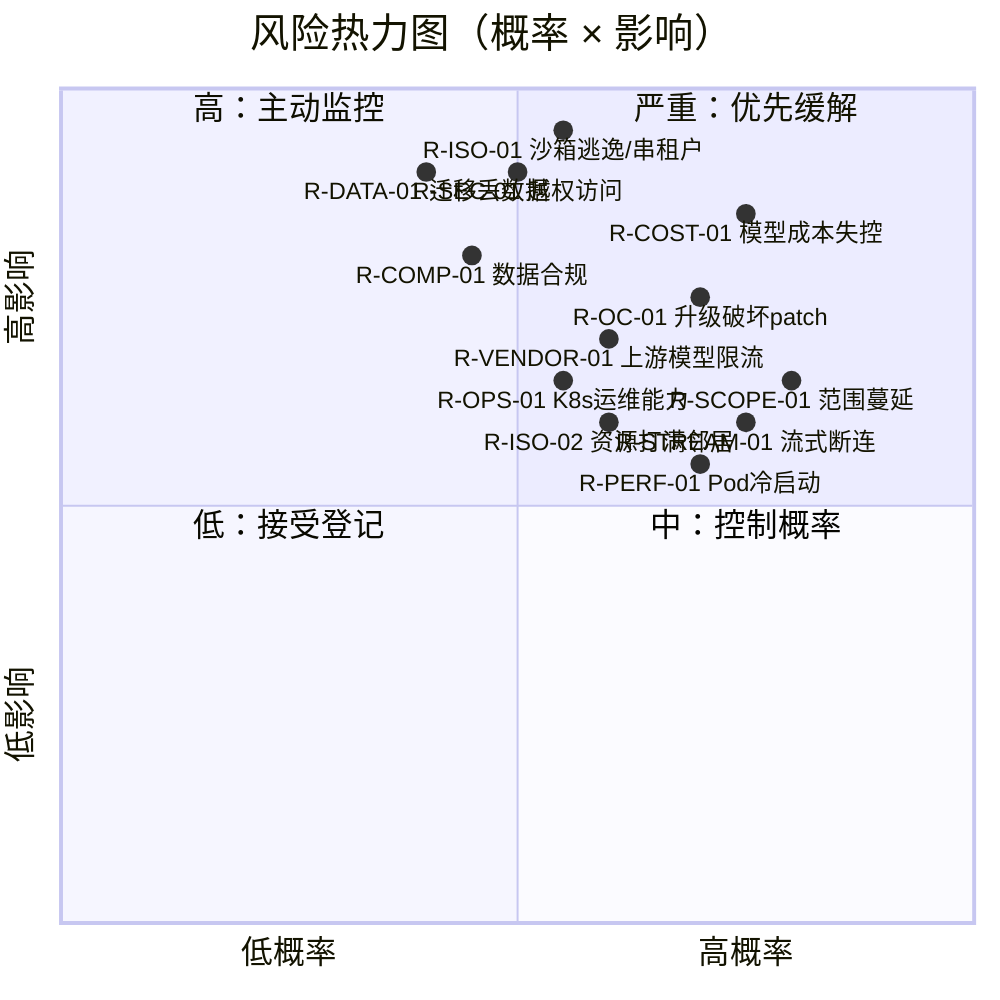
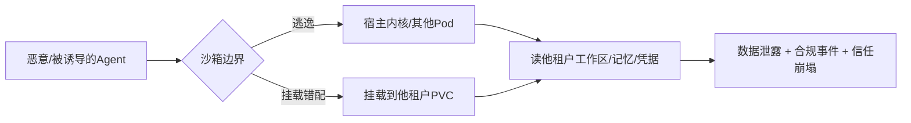
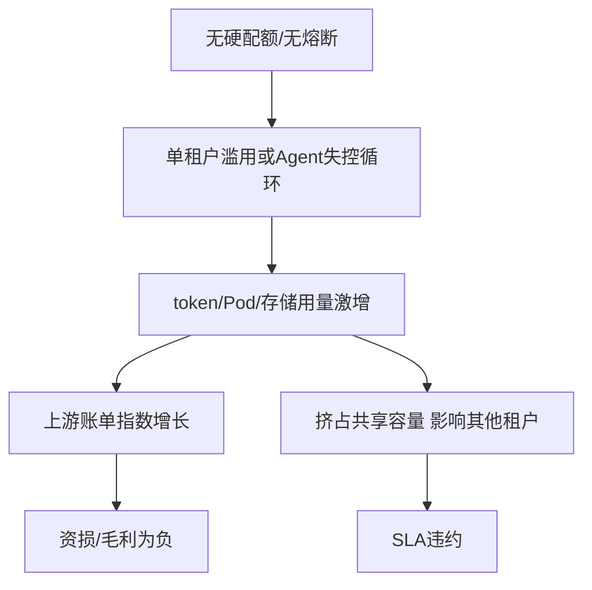
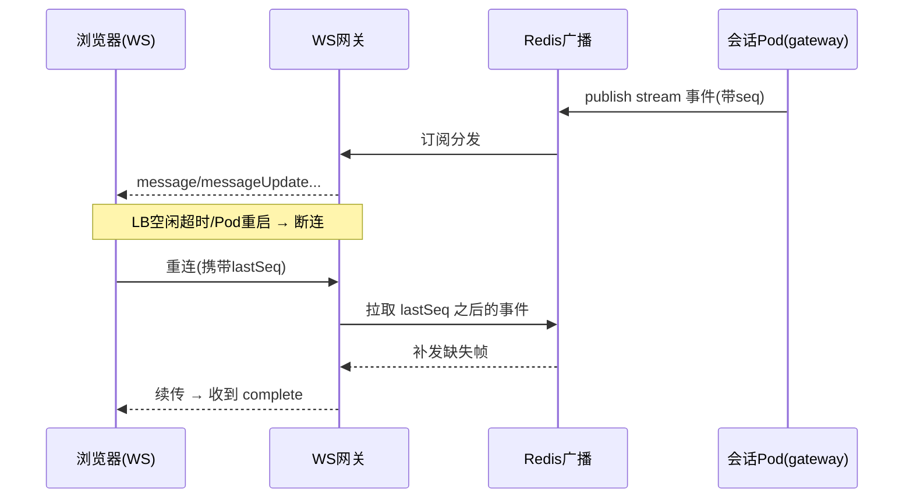
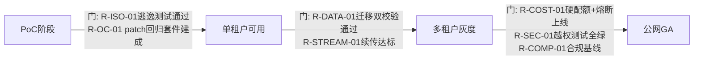

# 风险登记册

> 本文档是 LobsterAI「桌面单机 → 多租户 SaaS Web」改造计划的**风险总账**，供项目负责人、技术负责人、SRE/安全负责人与项目经理在立项评审、迭代规划、里程碑复盘时统一参照。它汇总各专项文档中识别出的风险，给出统一编号、评级、缓解策略、责任归属与**触发信号（早期预警指标）**，并对 Top 风险展开深入分析。风险的技术细节请回到对应专项文档；本文档只负责「盯住风险、给出动作」。

---

## 1. 阅读方式与评级口径

### 1.1 风险编号规则

风险编号形如 `R-<域>-<序号>`，域缩写如下，便于与其他文档交叉引用：

| 域缩写 | 含义 | 主要关联文档 |
|--------|------|-------------|
| `ISO` | 运行时/多租户隔离 | `07-OpenClaw运行时编排与沙箱隔离.md`、`14-安全合规与多租户隔离.md` |
| `COST` | 成本 / 计费 | `09-模型代理与计费.md`、`15-部署运维与可观测性.md` |
| `OC` | OpenClaw 升级耦合 / patch policy | `07-OpenClaw运行时编排与沙箱隔离.md`、`10-MCP与技能改造.md` |
| `DATA` | 数据迁移 / 数据模型 | `06-数据模型迁移.md` |
| `STREAM` | 流式稳定性 | `03-前端与传输层改造.md`、`04-后端服务与API设计.md` |
| `SEC` | 安全漏洞 | `14-安全合规与多租户隔离.md`、`12-Artifacts与预览改造.md` |
| `VENDOR` | 供应商 / 外部依赖 | `09-模型代理与计费.md`、`02-目标架构与技术选型.md` |
| `SCOPE` | 范围蔓延 | `13-功能取舍与降级清单.md`、`17-分阶段路线图与工作量估算.md` |
| `PERF` | 性能 / 容量 | `15-部署运维与可观测性.md`、`16-测试策略与验收标准.md` |
| `COMP` | 合规 | `05-认证与多租户账户.md`、`14-安全合规与多租户隔离.md` |
| `OPS` | 运维 / 交付 | `15-部署运维与可观测性.md` |
| `TEAM` | 团队 / 组织 | `17-分阶段路线图与工作量估算.md` |

### 1.2 评级口径

概率（P）与影响（I）各取三档，风险等级 = 概率 × 影响的组合（见热力图）。

| 维度 | 低 | 中 | 高 |
|------|----|----|----|
| **概率 P** | 需要多重前提才会发生 | 常见工程失误即可触发 | 现有架构下几乎必然遇到 |
| **影响 I** | 局部功能/单租户受损，可快速回滚 | 多租户体验下降或需紧急发版 | 数据泄露/资损/全站不可用/法律风险 |

风险等级定义与处置节奏：

| 等级 | 判定 | 处置要求 |
|------|------|----------|
| 🔴 严重（Critical） | P 高 且 I 高，或 I 高 且缓解未落地 | 必须在对应阶段**准入门（gate）**前落地缓解，且列入里程碑验收；负责人周报跟踪 |
| 🟠 高（High） | P 中/高 且 I 中/高 | 立项即分配 owner，进入 sprint backlog，双周复盘 |
| 🟡 中（Medium） | P 中 且 I 中，或 P 高 且 I 低 | 记录并监控触发信号，触发后升级 |
| 🟢 低（Low） | P 低 或 I 低 | 接受，仅登记，季度复盘 |

### 1.3 风险热力图

---

## 2. 风险总表

> 完整字段：编号 / 描述 / 类别 / 概率 / 影响 / 等级 / 缓解 / 负责人 / 触发信号。Top 风险在第 3 节展开。

| 编号 | 描述 | 类别 | P | I | 等级 | 缓解（摘要，详见第 3 节或专项文档） | 负责人 | 触发信号 |
|------|------|------|---|---|------|------|--------|----------|
| **R-ISO-01** | 每会话 OpenClaw Pod 沙箱逃逸或工作区串租户，导致租户 A 读到租户 B 的文件/记忆/凭据 | 隔离 | 中 | 高 | 🔴 | gVisor/Kata 加固 + per-tenant PVC + NetworkPolicy 默认拒绝 + PSA restricted；见 §3.1、`07`、`14` | 运行时负责人 | 跨租户路径出现在日志；PVC 挂载路径命中他租户 tenant_id；沙箱 syscall 审计告警 |
| **R-COST-01** | 模型调用/GPU/Pod 资源无有效配额与熔断，单租户或滥用导致账单指数级增长 | 成本 | 高 | 高 | 🔴 | 硬配额 + 预扣额度 + 实时用量流水 + 异常速率熔断；见 §3.2、`09` | 计费负责人 | 单租户小时 token 环比 >5×；日成本超预算 20%；免费租户并发会话激增 |
| **R-OC-01** | 升级 OpenClaw 版本时既有 15 个版本域 patch 失效，行为回归破坏对话/cron/MCP | 升级耦合 | 高 | 中 | 🟠 | patch 优先改 LobsterAI 侧 hook；版本 pin + patch 回归套件 + 金丝雀；见 §3.3、`07` | OpenClaw 集成负责人 | `npm run openclaw:patch` 出现 hunk fail；金丝雀会话错误率升高；上游 tag 变更 |
| **R-DATA-01** | SQLite→Postgres 多租户迁移出现数据丢失、tenant_id 错配、记忆/会话胶囊损坏 | 数据 | 中 | 高 | 🔴 | 迁移工具双写校验 + 逐表行数/校验和比对 + 可回滚快照；见 §3.4、`06` | 数据负责人 | 迁移后行数不匹配；出现 tenant_id 为空/串号；capsule JSON 解析失败率上升 |
| **R-STREAM-01** | WS 承接 `cowork:stream:*` 后长连接在 LB/网关/Pod 重启时断连，流式消息丢帧或重复 | 流式 | 高 | 中 | 🟠 | 序号+断点续传 + Redis 广播 + 心跳与重连 + 幂等 messageId；见 §3.5、`03`、`04` | 前端/网关负责人 | WS 断连率 >2%；`messageUpdate` 乱序告警；complete 未收到比例升高 |
| **R-SEC-01** | 缺失租户级鉴权/越权校验，横向越权访问会话、Artifacts、MCP 配置、HTML share | 安全 | 中 | 高 | 🔴 | 每请求强制 tenant scope + RLS + 对象存储签名 URL + share token 校验；见 §3.6、`14`、`05` | 安全负责人 | 越权探测命中；share 链接被枚举访问；审计日志出现跨租户 resource id |
| **R-VENDOR-01** | 自建后端依赖的上游模型厂商（Anthropic/Gemini/OpenAI 兼容）限流、涨价、封号或区域不可用 | 供应商 | 中 | 中 | 🟠 | 多 provider 抽象 + 故障切换 + 缓存 + 合同/多 key 冗余；见 §3.7、`09` | 计费/模型负责人 | 上游 429/5xx 比例升高；单 provider 延迟 P95 恶化；配额邮件预警 |
| **R-SCOPE-01** | v1 范围被 IM/computer-use/VM 等「后续/不做」项反复回灌，进度失控 | 范围 | 高 | 中 | 🟠 | 冻结 v1 边界 + 变更走 CCB + 降级清单为准；见 §3.8、`13`、`17` | 项目经理 | 需求池出现已判「不做」项；里程碑燃尽偏离 >20%；跨域临时插队频繁 |
| **R-PERF-01** | 每会话 Pod 冷启动慢（gateway boot 超时上限 300s），高并发下排队与超时 | 性能 | 高 | 中 | 🟠 | 预热池 + 会话复用 + 镜像瘦身 + HPA/预扩容；见 §3.9、`07`、`15` | 运行时/SRE | 首条响应 P95 >10s；Pod Pending 队列增长；gateway boot 超时计数上升 |
| **R-COMP-01** | 公网多租户涉及个人数据/跨境/日志留存，未满足隐私与数据驻留合规 | 合规 | 中 | 高 | 🔴 | DPA + 数据分区/驻留 + 最小化留存 + 删除权流程；见 §3.10、`14`、`05` | 合规/法务 | 出现境外访问用户数据；监管问询；日志留存超期未清理 |
| R-ISO-02 | 单租户资源（CPU/内存/磁盘/句柄）打满宿主，拖垮同节点其他租户（吵闹邻居） | 隔离 | 中 | 中 | 🟠 | ResourceQuota + LimitRange + Pod requests/limits + PVC 容量上限；见 `07`、`15` | SRE | 节点 CPU throttle 上升；OOMKilled 增多；PVC 使用率 >85% |
| R-ISO-03 | MCP `stdio` 服务器在服务端以 `npx` 拉起子进程，成为远程代码执行/供应链入口 | 隔离/安全 | 中 | 高 | 🔴 | stdio MCP 仅在会话沙箱内运行 + 包白名单 + 出网限制；见 `10`、`14` | 安全/MCP 负责人 | 沙箱内出现非预期出站连接；安装了不在白名单的包；子进程 CPU 异常 |
| R-COST-02 | 对象存储/PVC 工作区无清理策略，历史 Artifacts 与工作区无限增长 | 成本 | 高 | 中 | 🟠 | 生命周期策略 + 配额 + 冷归档 + 过期清理；见 `08`、`09` | 存储负责人 | 存储月增长率 >目标；单租户占用 Top 异常；桶成本超预算 |
| R-OC-02 | 沙箱 Pod 内 OpenClaw 对本机文件系统/端口/TZ/代理的强假设在容器中失效 | 升级耦合 | 中 | 中 | 🟠 | 环境变量与路径注入契约化 + 启动探针 + 兼容性测试；见 `07` | 运行时负责人 | gateway 健康检查失败；工作区路径解析报错；TZ/代理相关行为异常 |
| R-DATA-02 | 迁移窗口内新旧系统双写不一致，或迁移耗时超出停机窗口 | 数据 | 中 | 中 | 🟠 | 分批迁移 + 影子读校验 + 可分租户灰度；见 `06`、`17` | 数据负责人 | 双写差异率 >0；迁移预估时长超窗口；回滚演练失败 |
| R-STREAM-02 | `api:stream:*` 模型代理 SSE 在网关超时/缓冲下被截断，长响应中断 | 流式 | 中 | 中 | 🟠 | 禁用代理缓冲 + 合理超时 + keep-alive + 断点提示；见 `03`、`09` | 网关/模型负责人 | SSE 提前 done/error；长响应完成率下降 |
| R-SEC-02 | HTML/SVG/Office Artifacts 预览在服务端渲染引入 XSS/SSRF/本地文件读取 | 安全 | 中 | 高 | 🔴 | iframe sandbox + CSP + 预览服务隔离 + SSRF 网络策略；见 `12`、`14` | 安全/前端负责人 | 预览容器发起内网请求；CSP 违规上报；异常文件读取 |
| R-VENDOR-02 | 关键基础设施（K8s 云厂商、S3、Redis 托管）锁定或区域故障 | 供应商 | 低 | 高 | 🟠 | S3 兼容抽象 + IaC 可移植 + 备份跨区；见 `02`、`15` | 架构负责人 | 云厂商区域告警；托管服务 SLA 违约；单可用区故障 |
| R-PERF-02 | Postgres 在多租户高并发消息写入/分页查询下成为瓶颈 | 性能 | 中 | 中 | 🟠 | 索引/分区 + 读写分离 + 连接池 + 慢查询治理；见 `06`、`15` | 数据/SRE | 慢查询增多；连接池打满；写入延迟 P95 上升 |
| R-OPS-01 | 团队缺乏 K8s/gVisor/Helm/可观测栈的深水区运维经验 | 运维 | 中 | 中 | 🟠 | 早期 PoC + 培训 + 托管 K8s + Runbook；见 `15`、`17` | SRE 负责人 | PoC 里程碑延期；事故 MTTR 偏高；on-call 疲劳 |
| R-COMP-02 | OAuth loopback→标准 web 重定向改造引入开放重定向/令牌泄露 | 合规/安全 | 中 | 中 | 🟠 | 严格 redirect_uri 白名单 + PKCE + state/nonce 校验；见 `05` | 认证负责人 | 回调命中非白名单域；state 校验失败率上升 |
| R-TEAM-01 | 关键人（OpenClaw 集成/运行时）单点，交付强依赖个别工程师 | 团队 | 中 | 中 | 🟡 | 结对 + 文档化 patch policy + 知识共享；见 `17` | 项目经理 | 关键路径长期由单人承担；bus factor = 1 |
| R-SCOPE-02 | 「几乎所有功能都要 web 化」预期与 v1 降级清单不一致，招致返工 | 范围 | 中 | 中 | 🟡 | 降级清单先行评审签署 + 产品对齐；见 `13` | 产品负责人 | 用户/干系人反复要求被降级功能；验收标准争议 |
| R-OPS-02 | CI/CD（GitHub Actions + Helm）流水线不成熟，发布回滚不可靠 | 运维 | 中 | 中 | 🟡 | 蓝绿/金丝雀 + 一键回滚 + 发布门禁；见 `15`、`16` | SRE | 发布失败率高；回滚耗时长；无健康门禁 |

---

## 3. Top 风险深谈

以下对 🔴 严重 与代表性 🟠 高风险逐一展开。每条给出：现状根因 → 影响链 → 缓解措施（分阶段）→ 触发信号与阈值 → 残余风险。

### 3.1 R-ISO-01：沙箱逃逸 / 工作区串租户（🔴 严重）

**现状根因。** 当前 OpenClaw gateway 是**本机 Node 进程**（`src/main/libs/openclawEngineManager.ts`），监听 `ws://127.0.0.1:{port}`（默认 `DEFAULT_GATEWAY_PORT = 18789`，见 `openclawEngineManager.ts:38`），token 来自本地文件，状态、工作区、日志全部写在单机 `userData/openclaw/` 目录树。它对「同一台机器只有一个用户」有**强隐含假设**：工作区目录 `workspace-main`、`workspace-{agentId}`、`MEMORY.md`、`SOUL.md` 等均无租户维度。SaaS 化后按决策要用「每用户/每会话一个 Pod + 每租户 PVC」，一旦沙箱加固不到位，逃逸即等于跨租户读写。

**影响链。**

Agent 具备执行代码、读写文件、发起网络请求、拉起 MCP `stdio` 子进程的能力（这正是产品价值），因此攻击面天然大：容器逃逸、共享卷错配、`hostPath` 误用、NetworkPolicy 缺失导致东西向串访，任一环节失守都会横向打通租户。

**缓解措施（分阶段）。**

| 阶段 | 措施 | 验收 |
|------|------|------|
| 设计 | 隔离模型评审：每会话 Pod，租户级 PVC，命名空间/标签按 tenant_id 划分 | 隔离设计文档评审通过（`07`、`14`） |
| PoC | 用 gVisor 或 Kata 运行 gateway，跑逃逸测试集（已知 CVE PoC + syscall 探测） | 逃逸用例 100% 被拦截 |
| 实现 | PSA `restricted`、非 root、只读根 FS、drop 全部 capabilities、seccomp | Pod 安全基线扫描通过 |
| 实现 | NetworkPolicy 默认拒绝，仅放行网关↔gateway↔上游模型必需路径 | 东西向连通性测试仅白名单可达 |
| 实现 | PVC 挂载路径严格 `tenant/{tenant_id}/session/{id}`，挂载前二次校验 | 挂载审计无跨租户路径 |
| 上线 | 运行时 syscall 审计（Falco 类）+ 逃逸告警 | 演练告警可在 5 分钟内触达 on-call |

**触发信号与阈值。** 日志/审计中出现非本会话 tenant_id 的路径；Falco/审计规则命中容器逃逸特征 syscall；PVC 挂载路径与会话 tenant_id 不一致（任一条 = P0 事件）。

**残余风险。** 0-day 内核/运行时逃逸无法完全杜绝；缓解目标是「纵深防御 + 快速检测遏制」而非绝对不可逃逸。需在 `14` 明确「即使逃逸也拿不到明文他租户凭据」（凭据不落沙箱、走短时令牌）。

---

### 3.2 R-COST-01：模型 / 算力成本失控（🔴 严重）

**现状根因。** 单机版模型调用经 main 代理（`api:stream`、`src/main/libs/coworkOpenAICompatProxy.ts`、`coworkModelApi.ts`），成本天然由「单个用户 + 其账号配额」封顶；配额从 youdao 云拉取（`src/main/authQuota.ts`）。SaaS 化后「全部自建」，模型代理、配额、计费都要重建（见 `09`）。若没有**硬配额 + 预扣 + 实时熔断**，多租户公网环境下的成本是无上限的：Agent 会长时间自动执行、循环调用工具、拉起子会话（subagent），单会话就可能烧掉大量 token；再叠加每会话一个 Pod（含潜在 GPU/沙箱开销），资损放大。

**影响链。**

**缓解措施。**

1. **额度模型先行**：沿用现有 `creditsLimit/creditsUsed/creditsRemaining` 语义（`src/renderer/services/auth.ts`）在自建后端重建为**强一致额度账户**，区分 free/standard/daily（见 `09`）。
2. **预扣 + 结算**：每次模型/工具调用前按预估 token 预扣额度，调用后按实际用量结算，额度耗尽即拒绝新 turn。
3. **多层熔断**：租户级速率限制、并发会话上限、单会话最长运行时间、单会话最大 turn/工具调用数（对齐 `OPENCLAW_AGENT_TIMEOUT_SECONDS` 语义，避免 Agent 无限自转）。
4. **实时用量流水 + 预算告警**：用量事件写入队列（Redis/BullMQ）→ 计费服务落库，Grafana 看板对「单租户小时成本」「全站日成本」设阈值。
5. **异常检测**：对突发 5× 的用量、异常并发的免费租户触发自动降级/限流。

**触发信号与阈值。** 单租户小时 token 环比 >5×；全站日成本超预算 20%；单会话运行时长逼近上限比例上升；免费租户并发会话数异常。任一触发 → 自动限流 + 人工核查。

**残余风险。** 预扣估算与实际用量存在误差窗口；上游价格调整会直接冲击毛利（与 R-VENDOR-01 联动，需定价缓冲）。

---

### 3.3 R-OC-01：OpenClaw 升级耦合 / patch policy（🟠 高，Top 深谈）

**现状根因。** OpenClaw 以固定 tag pin 在 `package.json`（当前 `openclaw.version = v2026.6.1`），并通过**版本域 patch** 修改上游行为：`scripts/patches/` 下共 **61** 个 patch 文件，其中**当前版本 `v2026.6.1` 有 15 个**（如 `openclaw-chat-send-cwd-decoupling.patch`、`openclaw-mcp-shared-runtime.patch`、`openclaw-cron-skip-missed-jobs.patch`、`openclaw-empty-sse-data.patch` 等，见 `scripts/patches/v2026.6.1/`）。这些 patch 覆盖对话负载、MCP 运行时、cron 调度、SSE 处理、子代理清理等**核心链路**。每次升级上游 tag，都要把这些 patch 迁移到新版本目录并重新验证；hunk 一旦漂移，行为会静默回归。CLAUDE.md 的 Patch Policy 明确要求：优先改 LobsterAI 侧 hook，仅在无干净 hook 时才用版本域 patch，且不得留裸改在 sibling 源码树。SaaS 化后此风险被放大——patch 回归不再影响单机一个用户，而是**全体租户**。

**影响链。**

**缓解措施。**

| 措施 | 说明 |
|------|------|
| **优先 LobsterAI 侧 hook** | 新增/变更行为优先落在 `openclawConfigSync.ts`、`openclawRuntimeAdapter.ts`、插件配置、runtime 打包、UI/数据层，减少纯 patch 依赖（遵循 CLAUDE.md Patch Policy） |
| **patch 目录化与文档化** | 保持 `scripts/patches/<version>/`，每个 patch 顶部注明目的/上游 issue/替代方案，禁止 sibling 源码裸改作为终态 |
| **patch 回归套件** | 为 15 个 patch 各建最小回归用例（对话负载 30MB 边界、MCP 共享运行时、cron 补偿、空 SSE、subagent 清理），纳入 `npm test` 与 CI |
| **版本升级 SOP** | 升级=在灰度环境跑 `npm run openclaw:patch` → 全 patch apply 无 hunk fail → 回归套件全绿 → 金丝雀流量 → 全量 |
| **金丝雀 + 快速回滚** | 新版本先接少量租户/会话，错误率/成本/延迟无回归再放量；镜像版本可一键回退 |
| **上游变更监控** | 订阅上游 release，评估破坏性变更对适配层契约（`chat.send`、事件流 `message/messageUpdate/complete` 等）的影响 |

**触发信号与阈值。** `npm run openclaw:patch` 出现任何 hunk fail 或 `.rej`；回归套件红；金丝雀会话错误率/超时率相对基线上升 >X%；上游发布含 breaking change 标记。

**残余风险。** 上游大版本重构可能一次性作废多个 patch，需预留「升级专项」工作量（见 `17` 路线图预算）；长期应推动把稳定 patch 上游化或转成 hook，降低 patch 数量。

---

### 3.4 R-DATA-01：数据迁移丢失 / tenant 错配（🔴 严重）

**现状根因。** 数据在单机 SQLite（`src/main/sqliteStore.ts`），表包括 `cowork_sessions`、`cowork_messages`、`cowork_session_capsules`、`agents`、`user_memories`/`user_memory_sources`、`mcp_servers`/`mcp_launch_resolutions`、`user_plugins`、`subagent_runs`/`subagent_messages`、`scheduled_task_*` 等（列表见 SHARED）。这些表**没有 tenant_id**，且含历史列名（如 `cowork_sessions.claude_session_id`）、JSON blob 列（`metadata`、`capsule_json`、`config_json`）、SHA-1 指纹去重（`user_memories.fingerprint`）、`sequence` 排序等语义。迁到 Postgres 多租户时，既要补齐 tenant_id + 建立 RLS，又要保住这些语义与关系完整性，任何错配都可能污染或泄露数据。

**影响链。** 迁移脚本错误 → tenant_id 为空/串号 → 用户看到他人会话（同时触发 R-SEC-01）；JSON 反序列化不兼容 → capsule/metadata 损坏 → 上下文丢失、fork/胶囊功能异常；sequence/rowid 双排序未保序 → 消息乱序。

**缓解措施。**

1. **Schema 映射表**：逐表写 SQLite→Postgres 列映射（含类型、JSON 校验、外键、tenant_id 归属来源），评审后固化（见 `06`）。
2. **迁移工具三段式**：抽取 → 转换（补 tenant_id、校验 JSON、规范化指纹）→ 加载，全程**幂等可重跑**。
3. **双重校验**：每表迁移后比对**行数 + 内容校验和**（对关键列做哈希抽样），差异非零即阻断。
4. **可回滚**：迁移前对源做只读快照；目标库分批灰度，保留回退脚本。
5. **灰度按租户**：先迁内部/小租户，验证会话可读、消息有序、记忆去重正确、cron 元数据（`scheduled_task_meta`）绑定正确，再放量。

**触发信号与阈值。** 迁移后源/目标行数不等；出现 tenant_id 空值或跨租户外键；`capsule_json`/`metadata` 解析失败率 >0；抽样内容校验和不匹配。

**残余风险。** 历史脏数据（旧迁移遗留、损坏 JSON）需单列「隔离 + 人工修复」桶，不阻塞主迁移。

---

### 3.5 R-STREAM-01：流式稳定性（🟠 高，Top 深谈）

**现状根因。** 流式是产品核心体验。当前走 Electron IPC：main 通过 `webContents.send('cowork:stream:*')` 推送 9 类事件（`message`、`messageUpdate`、`sessionStatus`、`contextUsage`、`contextMaintenance`、`permission`、`permissionDismiss`、`complete`、`error`），模型代理另有参数化的 `api:stream:${requestId}:{data,done,error,abort}`。这是**进程内、零丢包、天然有序**的信道。SaaS 化后按决策改为 **WebSocket** 承载（见 `03`、`04`），信道变成「跨网络、经 LB/Ingress、Pod 可重启、可多副本」的不可靠环境：断连、乱序、重复、粘包、背压都会出现，而 UI 对「消息增量顺序」和「complete 收尾」高度敏感。

**影响链。**

**缓解措施。**

1. **事件序号化**：每会话流事件带单调递增 `seq`；UI 记 `lastSeq`，重连时请求补发。
2. **广播层用 Redis**：会话 Pod 把事件 publish 到 Redis，WS 网关订阅分发，解耦「产生」与「多副本推送」，支持水平扩展与断点续传缓冲（短 TTL）。
3. **幂等**：`messageId` 幂等，`messageUpdate` 以 (messageId, seq) 去重；重复帧前端可安全丢弃。
4. **心跳与重连**：应用层 ping/pong + 指数退避重连；LB/Ingress 空闲超时调大于心跳间隔。
5. **背压与限流**：单连接发送队列上限，超限降采样非关键事件（如 `contextUsage`），关键事件（`message`/`complete`/`permission`）优先。
6. **收尾保障**：`complete`/`error` 必达（缺失则前端超时后主动拉取会话最终态兜底）。

**触发信号与阈值。** WS 断连率 >2%；`complete` 未达比例上升；`messageUpdate` 乱序/去重命中率异常；重连补发失败。

**残余风险。** 极端网络下仍可能短暂视觉抖动；以「最终一致 + 可重放」保证正确性，UI 明确「重连中」状态。

---

### 3.6 R-SEC-01：横向越权 / 租户隔离缺失（🔴 严重）

**现状根因。** 单机版所有 IPC（约 260+ 通道）默认「本机唯一用户可信」，无授权检查。SaaS 化后每一个 REST/WS 接口都必须**强制租户与用户维度授权**（见附录 A 的 IPC→接口映射）。高危对象：会话/消息、Artifacts 文件、MCP 服务器配置（含凭据）、HTML share（`htmlShare:*`）、技能/插件配置。任一接口漏了 tenant scope 或用可预测 id，即横向越权。

**缓解措施。**

- **认证**：OAuth2/OIDC + JWT，JWT 内含 tenant_id/user_id，网关统一校验（见 `05`）。
- **授权**：每次数据访问强制 `where tenant_id = :ctx.tenant`，DB 层再叠加 Postgres **RLS** 作为纵深防御（见 `06`、`14`）。
- **对象存储**：Artifacts 走**短时签名 URL**，key 前缀含 tenant_id，禁止列桶（见 `08`）。
- **不可枚举 id**：share token、resource id 用不可预测值；share 访问校验 token + 状态（对齐现有 `htmlShare:updateStatus/updateAccessMode/disable` 语义）。
- **越权测试**：把「A 用 B 的 id」纳入自动化安全测试（见 `16`）。

**触发信号与阈值。** 越权探测用例命中；share 链接被规律性枚举访问；审计日志出现请求 tenant 与资源 tenant 不一致。

**残余风险。** 应用层与 RLS 双保险仍需防「服务账号越权」；服务间调用须传递并校验租户上下文。

---

### 3.7 R-VENDOR-01：上游模型供应商依赖（🟠 高）

**现状根因。** 自建后端要重建模型代理与目录（现有 `coworkModelApi.ts`、`coworkOpenAICompatProxy.ts` 支持 Anthropic 与 Gemini 原生协议，及 OpenAI 兼容）。SaaS 直接把上游厂商风险传导给全体租户：限流（429）、涨价、区域不可用、封号、协议/schema 变更（现有代理已需为 Gemini 删除不支持的 schema 关键字，说明上游差异真实存在）。

**缓解措施。** provider 抽象层 + 多 key/多账号冗余；provider 级故障切换与降级路由；对确定性请求做缓存；容量/配额邮件预警接入监控；商务侧签容量与价格条款（见 `09`）。**触发信号：** 单 provider 429/5xx 比例升高、P95 延迟恶化、配额预警邮件。**残余风险：** 切换 provider 存在能力/质量差异，需模型能力矩阵与回退策略。

---

### 3.8 R-SCOPE-01：范围蔓延（🟠 高）

**现状根因。** 目标是「几乎所有功能都要 web 化」，但已明确 v1 = 核心对话/Agent/Artifacts/Skills/MCP + 文件工作区读写 + 定时任务；IM 渠道后续、computer-use/VM/后台浏览器不做。诱惑在于这些功能代码已存在（`src/main/im/`、`src/main/computerUse/`、浏览器自动化），容易被「顺手也做了」回灌，冲垮进度与隔离预算。

**缓解措施。** 以 `13-功能取舍与降级清单.md` 为准冻结 v1 边界；任何越界需求走变更控制（CCB）评审成本与风险后再定；路线图（`17`）里 IM 等标注为独立后续阶段，不占 v1 里程碑。**触发信号：** 需求池出现已判「不做」项、里程碑燃尽偏离 >20%、频繁临时插队。**残余风险：** 干系人期望管理需持续沟通。

---

### 3.9 R-PERF-01：会话 Pod 冷启动与并发容量（🟠 高）

**现状根因。** 「每会话一个 gateway Pod」在高并发下面临冷启动开销：gateway 启动有健康探测轮询与**最长 300s 启动超时**（`GATEWAY_BOOT_TIMEOUT_MS = 300 * 1000`，`openclawEngineManager.ts:40`）、5 档重启退避（`GATEWAY_RESTART_DELAYS`）。容器环境还要加上镜像拉取、PVC 挂载、运行时初始化。若不预热，用户「新建会话」到「首条响应」的延迟会很差。

**缓解措施。** 维护**预热 Pod 池**（就绪待命）；会话与 Pod 复用（同租户/同会话续用）；镜像瘦身 + 分层缓存 + 就近仓库；HPA/预扩容按流量曲线预备容量；启动就绪探针与超时对齐容器实际启动时间。**触发信号：** 首条响应 P95 >10s、Pod Pending 队列增长、gateway boot 超时计数上升。**残余风险：** 预热池增加常驻成本（与 R-COST-01 权衡），需按利用率动态调节。

---

### 3.10 R-COMP-01：数据合规与隐私（🔴 严重）

**现状根因。** 从单机本地存储变为公网集中存储用户对话、文件工作区、记忆（`MEMORY.md`/`USER.md`）、模型输入输出，触发个人数据保护、数据驻留/跨境、日志留存等合规义务。现有日志留存 7 天、gateway 日志 3 天（单机语义），SaaS 需重新定义留存与删除策略。

**缓解措施。** 与租户签 DPA；按区域做数据分区/驻留（PVC、对象存储桶、DB 分区绑定区域）；日志/PII 最小化留存并到期清理；提供数据导出与「删除权」流程（联动 R-DATA/R-SEC）；敏感字段加密与访问审计（见 `14`、`05`）。**触发信号：** 出现境外访问用户数据、监管问询、日志超期未清理。**残余风险：** 不同司法辖区要求差异，需法务持续跟踪并可能限定可服务区域。

---

## 4. 风险与阶段准入门（Gate）绑定

风险不是登记完就结束，而是绑定到路线图（`17`）的阶段准入门。任一阶段的 🔴 风险缓解未达标，不得进入下一阶段。

| 阶段门 | 必须清账的风险 | 判据 |
|--------|----------------|------|
| PoC → 单租户 | R-ISO-01、R-OC-01、R-OPS-01 | 逃逸测试 100% 拦截；patch 全 apply + 回归绿；K8s PoC 跑通 |
| 单租户 → 多租户灰度 | R-DATA-01、R-STREAM-01、R-SEC-01 | 迁移双校验 0 差异；WS 断连续传达标；越权测试全绿 |
| 多租户 → 公网 GA | R-COST-01、R-COMP-01、R-PERF-01、R-VENDOR-01 | 硬配额+熔断上线；合规基线签署；容量/延迟 SLA 达标；provider 故障切换演练通过 |

---

## 5. 风险治理机制

1. **责任到人**：每条风险有明确 owner（见总表），owner 负责缓解落地与触发信号监控。
2. **触发信号仪表化**：可量化的触发信号接入 Prometheus/Grafana/Loki（见 `15`），配置告警与 on-call。
3. **复盘节奏**：🔴 周度、🟠 双周、🟡/🟢 季度在风险评审会更新状态（新增/降级/关闭）。
4. **变更联动**：任何架构/范围变更须回看本登记册，评估是否新增或抬升风险等级。
5. **事故回流**：线上事故复盘后，把新识别风险登记入册并绑定对应专项文档与阶段门。

---

## 6. 交叉引用索引

| 想深入了解 | 去读 |
|-----------|------|
| 多租户沙箱如何编排（R-ISO-*、R-OC-02、R-PERF-01） | `07-OpenClaw运行时编排与沙箱隔离.md` |
| 隔离/RLS/合规细节（R-ISO-01、R-SEC-*、R-COMP-*） | `14-安全合规与多租户隔离.md` |
| 计费与配额熔断（R-COST-*、R-VENDOR-01） | `09-模型代理与计费.md` |
| patch policy 与升级 SOP（R-OC-01） | `07`（Patch 策略章节）与 `CLAUDE.md` |
| 数据迁移方案（R-DATA-*） | `06-数据模型迁移.md` |
| 流式传输改造（R-STREAM-*） | `03-前端与传输层改造.md`、`04-后端服务与API设计.md` |
| 认证/重定向安全（R-COMP-02、R-SEC-01） | `05-认证与多租户账户.md` |
| 功能降级边界（R-SCOPE-*） | `13-功能取舍与降级清单.md` |
| 容量/可观测/CI-CD（R-PERF-*、R-OPS-*） | `15-部署运维与可观测性.md` |
| 验收与测试（越权、迁移、流式、成本用例） | `16-测试策略与验收标准.md` |
| 路线图与阶段门（第 4 节） | `17-分阶段路线图与工作量估算.md` |
| IPC→接口映射（R-SEC-01 授权面） | `附录A-IPC通道与接口映射.md` |
