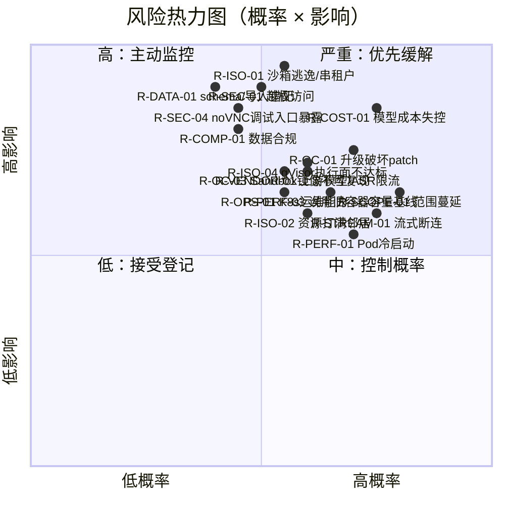
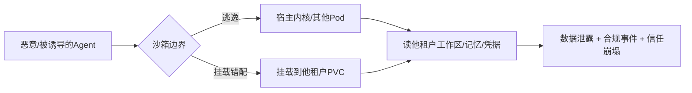
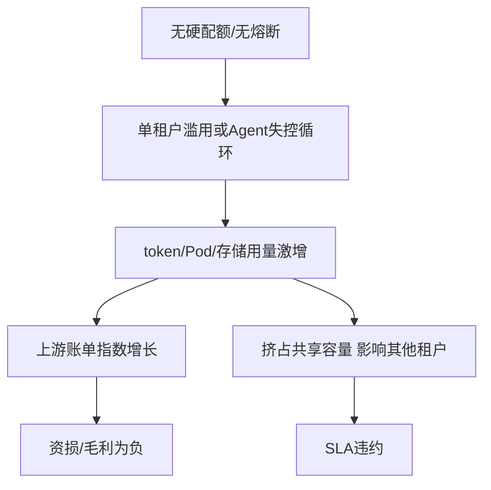
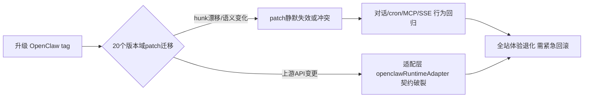
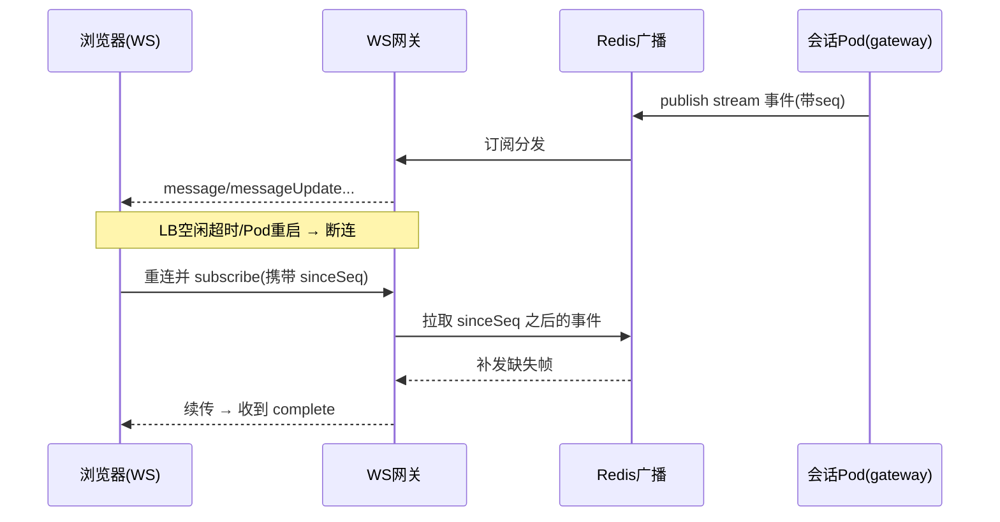

# 风险登记册

> 本文档是 LobsterAI「桌面单机 → 多租户 SaaS Web」改造计划的**风险总账**，供项目负责人、技术负责人、SRE/安全负责人与项目经理在立项评审、迭代规划、里程碑复盘时统一参照。它汇总各专项文档中识别出的风险，给出统一编号、评级、缓解策略、责任归属与**触发信号（早期预警指标）**，并对 Top 风险展开深入分析。风险的技术细节请回到对应专项文档；本文档只负责「盯住风险、给出动作」。

---

## 1. 阅读方式与评级口径

### 1.1 风险编号规则

风险编号形如 `R-<域>-<序号>`，域缩写如下，便于与其他文档交叉引用：

| 域缩写 | 含义 | 主要关联文档 |
|--------|------|-------------|
| `ISO` | 运行时/多租户隔离 | `07-OpenClaw运行时编排与沙箱隔离.md`、`14-安全合规与多租户隔离.md` |
| `COST` | 成本 / 计费 | `09-模型代理与计费.md`、`15-部署运维与可观测性.md` |
| `OC` | OpenClaw 升级耦合 / patch policy | `07-OpenClaw运行时编排与沙箱隔离.md`、`10-MCP与技能改造.md` |
| `DATA` | 数据迁移 / 数据模型 | `06-数据模型迁移.md` |
| `STREAM` | 流式稳定性 | `03-前端与传输层改造.md`、`04-后端服务与API设计.md` |
| `SEC` | 安全漏洞 | `14-安全合规与多租户隔离.md`、`12-Artifacts与预览改造.md` |
| `STOR` | 文件工作区 / 存储一致性 | `08-文件工作区与对象存储.md`、`07-OpenClaw运行时编排与沙箱隔离.md` |
| `VENDOR` | 供应商 / 外部依赖 | `09-模型代理与计费.md`、`02-目标架构与技术选型.md` |
| `SCOPE` | 范围蔓延 | `13-功能取舍与降级清单.md`、`17-分阶段路线图与工作量估算.md` |
| `PERF` | 性能 / 容量 | `15-部署运维与可观测性.md`、`16-测试策略与验收标准.md` |
| `COMP` | 合规 | `05-认证与多租户账户.md`、`14-安全合规与多租户隔离.md` |
| `OPS` | 运维 / 交付 | `15-部署运维与可观测性.md` |
| `TEAM` | 团队 / 组织 | `17-分阶段路线图与工作量估算.md` |

### 1.2 评级口径

概率（P）与影响（I）各取三档，风险等级 = 概率 × 影响的组合（见热力图）。

| 维度 | 低 | 中 | 高 |
|------|----|----|----|
| **概率 P** | 需要多重前提才会发生 | 常见工程失误即可触发 | 现有架构下几乎必然遇到 |
| **影响 I** | 局部功能/单租户受损，可快速回滚 | 多租户体验下降或需紧急发版 | 数据泄露/资损/全站不可用/法律风险 |

风险等级定义与处置节奏：

| 等级 | 判定 | 处置要求 |
|------|------|----------|
| 🔴 严重（Critical） | P 高 且 I 高，或 I 高 且缓解未落地 | 必须在对应阶段**准入门（gate）**前落地缓解，且列入里程碑验收；负责人周报跟踪 |
| 🟠 高（High） | P 中/高 且 I 中/高 | 立项即分配 owner，进入 sprint backlog，双周复盘 |
| 🟡 中（Medium） | P 中 且 I 中，或 P 高 且 I 低 | 记录并监控触发信号，触发后升级 |
| 🟢 低（Low） | P 低 或 I 低 | 接受，仅登记，季度复盘 |

### 1.3 风险热力图

---

## 2. 风险总表

> 完整字段：编号 / 描述 / 类别 / 概率 / 影响 / 等级 / 缓解 / 负责人 / 触发信号。Top 风险在第 3 节展开。

| 编号 | 描述 | 类别 | P | I | 等级 | 缓解（摘要，详见第 3 节或专项文档） | 负责人 | 触发信号 |
|------|------|------|---|---|------|------|--------|----------|
| **R-ISO-01** | 每会话 OpenClaw Pod 沙箱逃逸或工作区串租户，导致租户 A 读到租户 B 的文件/记忆/凭据 | 隔离 | 中 | 高 | 🔴 | gVisor/Kata 加固 + per-tenant PVC + NetworkPolicy 默认拒绝 + PSA restricted；见 §3.1、`07`、`14` | 运行时负责人 | 跨租户路径出现在日志；PVC 挂载路径命中他租户 tenant_id；沙箱 syscall 审计告警 |
| **R-COST-01** | 模型调用/GPU/Pod 资源无有效配额与熔断，单租户或滥用导致账单指数级增长 | 成本 | 高 | 高 | 🔴 | 硬配额 + 预扣额度 + 实时用量流水 + 异常速率熔断；见 §3.2、`09` | 计费负责人 | 单租户小时 token 环比 >5×；日成本超预算 20%；免费租户并发会话激增 |
| **R-OC-01** | 升级 OpenClaw 版本时既有 20 个版本域 patch 失效，行为回归破坏对话/cron/MCP | 升级耦合 | 高 | 中 | 🟠 | patch 优先改 LobsterAI 侧 hook；版本 pin + patch 回归套件 + 金丝雀；见 §3.3、`07`、附录 C §2-B11 | OpenClaw 集成负责人 | `npm run openclaw:patch` 出现 hunk fail；金丝雀会话错误率升高；上游 tag 变更 |
| **R-DATA-01** | SaaS schema migration/RLS 错误，或启用桌面存量导入时出现数据丢失、tenant_id 错配、记忆/会话胶囊损坏 | 数据 | 中 | 高 | 🔴 | V3 做 Prisma migrate/DDL/RLS/幂等校验；V5 启用导入工具时做 dry-run + 双读对账 + 可回滚快照；见 §3.4、`06` | 数据负责人 | migration 漂移或 RLS bypass 用例失败；导入后行数不匹配；出现 tenant_id 为空/串号；capsule JSON 解析失败率上升 |
| **R-STREAM-01** | WS 承接 `cowork:stream:*` 后长连接在 LB/网关/Pod 重启时断连，流式消息丢帧或重复 | 流式 | 高 | 中 | 🟠 | 序号+断点续传 + Redis 广播 + 心跳与重连 + 幂等 messageId；见 §3.5、`03`、`04` | 前端/网关负责人 | WS 断连率 >2%；`messageUpdate` 乱序告警；complete 未收到比例升高 |
| **R-SEC-01** | 缺失租户级鉴权/越权校验，横向越权访问会话、Artifacts、MCP 配置、HTML share | 安全 | 中 | 高 | 🔴 | 每请求强制 tenant scope + RLS + 对象存储签名 URL + share token 校验；见 §3.6、`14`、`05` | 安全负责人 | 越权探测命中；share 链接被枚举访问；审计日志出现跨租户 resource id |
| **R-VENDOR-01** | 自建后端依赖的上游模型厂商（Anthropic/Gemini/OpenAI 兼容）与 ASR provider 限流、涨价、封号、协议/编码变更或区域不可用 | 供应商 | 中 | 中 | 🟠 | 多 provider 抽象 + 故障切换 + 缓存 + 合同/多 key 冗余 + ASR kill-switch/fallback；见 §3.7、`09` | 计费/模型/ASR 负责人 | 上游 429/5xx 比例升高；单 provider 延迟 P95 恶化；ASR partial/final 超时或错误率升高；配额邮件预警 |
| **R-SCOPE-01** | V1-V6 GA 主线被 IM/computer-use/VM/第三方 OAuth 代持等「GA 后续/不做」项反复回灌，进度失控 | 范围 | 高 | 中 | 🟠 | 冻结 GA 主线边界 + 变更走 CCB + 降级清单为准；见 §3.8、`13`、`17` | 项目经理 | 需求池出现已判「不做」项；路线图燃尽偏离 >20%；跨域临时插队频繁 |
| **R-PERF-01** | 每会话 Pod 冷启动慢（gateway boot 超时上限 300s），高并发下排队与超时 | 性能 | 高 | 中 | 🟠 | 预热容量池 + 会话续用 + 镜像瘦身 + HPA/预扩容；不依赖运行中 Pod 动态挂卷；见 §3.9、`07`、`15` | 运行时/SRE | 预热容量命中路径 acquire p95 超标；Pod Pending 队列增长；gateway boot 超时计数上升 |
| **R-COMP-01** | 公网多租户涉及个人数据/跨境/日志留存，未满足隐私与数据驻留合规 | 合规 | 中 | 高 | 🔴 | DPA + 数据分区/驻留 + 最小化留存 + 删除权流程；见 §3.10、`14`、`05` | 合规/法务 | 出现境外访问用户数据；监管问询；日志留存超期未清理 |
| R-ISO-02 | 单租户资源（CPU/内存/磁盘/句柄）打满宿主，拖垮同节点其他租户（吵闹邻居） | 隔离 | 中 | 中 | 🟠 | ResourceQuota + LimitRange + Pod requests/limits + PVC 容量上限；见 `07`、`15` | SRE | 节点 CPU throttle 上升；OOMKilled 增多；PVC 使用率 >85% |
| R-ISO-03 | MCP `stdio` 服务器在服务端以 `npx` 拉起子进程，成为远程代码执行/供应链入口 | 隔离/安全 | 中 | 高 | 🔴 | stdio MCP 仅在会话沙箱内运行 + 包白名单 + 出网限制；见 `10`、`14` | 安全/MCP 负责人 | 沙箱内出现非预期出站连接；安装了不在白名单的包；子进程 CPU 异常 |
| **R-ISO-04** | 默认 runtime gVisor（用户态内核）恰踩 OpenClaw 执行面最弱处——`npx` 拉起子进程、`node`/shell 执行、`npm` 解包、常用 stdio MCP/技能脚本等密集子进程 spawn 与文件 IO，成功率或性能不达标 | 隔离/性能 | 中 | 高 | 🔴 | gVisor 为默认、Kata 为「重/兼容」档回退（见附录 C D4）；V1 PoC 必须产出 gVisor 工作负载**兼容+性能矩阵**，不达标工作负载按 `resourceClass` 路由到 Kata；Pod spec 用变量 `runtimeClassName` 由编排器注入；见 §3.1、`07` | 运行时负责人 | 兼容矩阵某工作负载成功率 <100%；gVisor 下子进程 spawn/文件 IO 开销超基线；`npm` 解包/技能脚本超时 |
| R-COST-02 | 对象存储/PVC 工作区无清理策略，历史 Artifacts 与工作区无限增长 | 成本 | 高 | 中 | 🟠 | 生命周期策略 + 配额 + 冷归档 + 过期清理；见 `08`、`09` | 存储负责人 | 存储月增长率 >目标；单租户占用 Top 异常；桶成本超预算 |
| R-STOR-01 | RWX/PVC 工作区在跨 Pod 读写、inotify、断连恢复或大目录场景下不达标，导致 V3 工作区产品化返工 | 存储 | 中 | 高 | 🔴 | V1 存储 PoC 门槛：读写可见性、并发一致性、大目录、事件、断连、安全路径全部实测；失败则改 workspace service 代理或对象存储权威 | 存储/SRE 负责人 | V1 PoC p95 可见延迟超标；inotify 不可靠；断连后出现空目录覆盖或校验和不一致 |
| R-OC-02 | 沙箱 Pod 内 OpenClaw 对本机文件系统/端口/TZ/代理的强假设在容器中失效 | 升级耦合 | 中 | 中 | 🟠 | 环境变量与路径注入契约化 + 启动探针 + 兼容性测试；见 `07` | 运行时负责人 | gateway 健康检查失败；工作区路径解析报错；TZ/代理相关行为异常 |
| R-OC-03 | Sandbox 生产镜像无法稳定复现 OpenClaw runtime（native modules、plugins、patch、`resources/cfmind`），或把本地桌面依赖带进生产镜像 | 升级耦合/交付 | 中 | 中 | 🟠 | V1 先做 `lobster-openclaw-runtime` 镜像尖刺：目标 Linux 架构构建、内容扫描、健康启动、插件/patch 回归；生产镜像不含 Electron UI/Xvfb/noVNC；见 `07`、`15`、`16`、`17` | 运行时/SRE | 镜像构建不稳定；native module ABI 报错；gateway ready 失败；镜像扫描发现 Xvfb/noVNC/真实密钥/租户数据 |
| R-DATA-02 | 桌面存量导入工具启用后，单租户导入窗口/灰度导入耗时过长或重试幂等失败 | 数据 | 中 | 中 | 🟠 | 导入 dry-run + 分租户灰度 + 断点续跑 + 影子读/双读校验；见 `06`、`17` | 数据负责人 | 导入预估时长超窗口；重复导入产生重复数据；回滚演练失败 |
| R-STREAM-02 | `api:stream:*` 模型代理 SSE 在网关超时/缓冲下被截断，长响应中断 | 流式 | 中 | 中 | 🟠 | 禁用代理缓冲 + 合理超时 + keep-alive + 断点提示；见 `03`、`09` | 网关/模型负责人 | SSE 提前 done/error；长响应完成率下降 |
| R-SEC-02 | HTML/SVG/Office Artifacts 预览在服务端渲染引入 XSS/SSRF/本地文件读取 | 安全 | 中 | 高 | 🔴 | iframe sandbox + CSP + 预览服务隔离 + SSRF 网络策略；见 `12`、`14` | 安全/前端负责人 | 预览容器发起内网请求；CSP 违规上报；异常文件读取 |
| R-SEC-03 | 公开 HTML share 被用于 phishing、恶意脚本、垃圾分发或搜索引擎收录不当内容 | 安全/合规 | 中 | 高 | 🔴 | V5 前完成 abuse 治理：扫描、report/takedown、rate limit、默认 noindex、审计、租户开关；见 `12`、`14` | 安全/产品负责人 | 举报量上升；外链/钓鱼扫描命中；单租户 share 访问异常增长 |
| R-SEC-04 | 旧容器方案的 Xvfb/x11vnc/noVNC 调试入口被误当作正式产品入口，或在生产环境被公网暴露 | 安全 | 中 | 高 | 🔴 | noVNC 仅允许非生产 debug 镜像/内部网络/短时授权/全量审计；生产 Helm values 不得引用 debug 镜像，不得暴露 VNC/noVNC 端口；见 `14`、`15`、`16` | 安全/SRE | Ingress/Service 暴露 5900/6080/debug 端口；生产镜像包含 noVNC/x11vnc；审计缺少临时调试授权 |
| R-VENDOR-02 | 关键基础设施（K8s 云厂商、S3、Redis 托管）锁定或区域故障 | 供应商 | 低 | 高 | 🟠 | S3 兼容抽象 + IaC 可移植 + 备份跨区；见 `02`、`15` | 架构负责人 | 云厂商区域告警；托管服务 SLA 违约；单可用区故障 |
| R-PERF-02 | Postgres 在多租户高并发消息写入/分页查询下成为瓶颈 | 性能 | 中 | 中 | 🟠 | 索引/分区 + 读写分离 + 连接池 + 慢查询治理；见 `06`、`15` | 数据/SRE | 慢查询增多；连接池打满；写入延迟 P95 上升 |
| R-PERF-03 | 继续沿用旧「50 个完整桌面容器」的资源测算作为 Sandbox 容量基线，导致过度保守或严重低估成本/启动延迟 | 性能/成本 | 中 | 中 | 🟠 | 旧桌面容器数据只作上界；V1/V4 必须重测 gateway-only Sandbox 的 idle/first turn/MCP/长会话资源，更新 requests/limits、预热水位与成本模型；见 `07`、`15`、`17` | SRE/财务模型负责人 | 资源 requests 与实测偏差 >30%；OOMKilled/throttle 上升；预热池成本显著高于预算 |
| R-OPS-01 | 团队缺乏 K8s/gVisor/Helm/可观测栈的深水区运维经验 | 运维 | 中 | 中 | 🟠 | 早期 PoC + 培训 + 托管 K8s + Runbook；见 `15`、`17` | SRE 负责人 | PoC 里程碑延期；事故 MTTR 偏高；on-call 疲劳 |
| R-COMP-02 | OAuth loopback→标准 web 重定向改造引入开放重定向/令牌泄露 | 合规/安全 | 中 | 中 | 🟠 | 严格 redirect_uri 白名单 + PKCE + state/nonce 校验；见 `05` | 认证负责人 | 回调命中非白名单域；state 校验失败率上升 |
| R-TEAM-01 | 关键人（OpenClaw 集成/运行时）单点，交付强依赖个别工程师 | 团队 | 中 | 中 | 🟡 | 结对 + 文档化 patch policy + 知识共享；见 `17` | 项目经理 | 关键路径长期由单人承担；bus factor = 1 |
| R-SCOPE-02 | 「几乎所有功能都要 web 化」预期与 V1-V6 GA 主线降级清单不一致，招致返工 | 范围 | 中 | 中 | 🟡 | 降级清单先行评审签署 + 产品对齐；见 `13` | 产品负责人 | 用户/干系人反复要求被降级功能；验收标准争议 |
| R-OPS-02 | CI/CD（GitHub Actions + Helm）流水线不成熟，发布回滚不可靠 | 运维 | 中 | 中 | 🟡 | 蓝绿/金丝雀 + 一键回滚 + 发布门禁；见 `15`、`16` | SRE | 发布失败率高；回滚耗时长；无健康门禁 |

---

## 3. Top 风险深谈

以下对 🔴 严重 与代表性 🟠 高风险逐一展开。每条给出：现状根因 → 影响链 → 缓解措施（分阶段）→ 触发信号与阈值 → 残余风险。

### 3.1 R-ISO-01：沙箱逃逸 / 工作区串租户（🔴 严重）

**现状根因。** 当前 OpenClaw gateway 是**本机 Node 进程**（`src/main/libs/openclawEngineManager.ts`），监听 `ws://127.0.0.1:{port}`（默认 `DEFAULT_GATEWAY_PORT = 18789`，见 `openclawEngineManager.ts:38`），token 来自本地文件，状态、工作区、日志全部写在单机 `userData/openclaw/` 目录树。它对「同一台机器只有一个用户」有**强隐含假设**：工作区目录 `workspace-main`、`workspace-{agentId}`、`MEMORY.md`、`SOUL.md` 等均无租户维度。SaaS 化后按决策要用「每会话一个 Pod + 每租户 PVC 的工作区子路径 + 单写者租约」，一旦沙箱加固不到位，逃逸即等于跨租户读写。

**影响链。**

Agent 具备执行代码、读写文件、发起网络请求、拉起 MCP `stdio` 子进程的能力（这正是产品价值），因此攻击面天然大：容器逃逸、共享卷错配、`hostPath` 误用、NetworkPolicy 缺失导致东西向串访，任一环节失守都会横向打通租户。

**缓解措施（分阶段）。**

| 阶段 | 措施 | 验收 |
|------|------|------|
| 设计 | 隔离模型评审：每会话 Pod，租户级 PVC 工作区子路径，命名空间/标签按 tenant_id 划分，工作区按 D5 单写者租约控制 | 隔离设计文档评审通过（`07`、`14`） |
| PoC | 默认档用 **gVisor** 运行 gateway（重/兼容档回退 **Kata**，二选一由 `resourceClass` 路由，见附录 C D4 与 R-ISO-04），跑逃逸测试集（已知 CVE PoC + syscall 探测） | 逃逸用例 100% 被拦截 |
| 实现 | PSA `restricted`、非 root、只读根 FS、drop 全部 capabilities、seccomp | Pod 安全基线扫描通过 |
| 实现 | NetworkPolicy 默认拒绝入站/横向/出站；入站只允许 Cowork Service 连 gateway，出站只允许附录 C D8 的模型 token 代理、Cowork AskUser、Media、MCP bridge、kube-dns 与审计 egress-proxy，provider 公网直连被拒 | 东西向连通性测试仅白名单可达；缺任一 D8 必需回调会导致 PoC 失败而不是放宽整段内网 |
| 实现 | PVC 挂载路径严格落在 `tenants/{tenantId}/ws-{workspaceId}/`（见 `08`），会话只绑定该工作区租约；挂载前二次校验 `workspaceId` 属于当前 `tenant_id`，不得按 `session/{id}` 新造挂载单位 | 挂载审计无跨租户路径，且同一工作区只有一个 RW 持锁 Pod |
| 上线 | 运行时 syscall 审计（Falco 类）+ 逃逸告警 | 演练告警可在 5 分钟内触达 on-call |

**触发信号与阈值。** 日志/审计中出现非本会话 tenant_id 的路径；Falco/审计规则命中容器逃逸特征 syscall；PVC 挂载路径不在当前租户 `tenants/{tenantId}/ws-{workspaceId}/` 下，或同一工作区出现两个 RW 持锁 Pod（任一条 = P0 事件）。

**残余风险。** 0-day 内核/运行时逃逸无法完全杜绝；缓解目标是「纵深防御 + 快速检测遏制」而非绝对不可逃逸。需在 `14` 明确「即使逃逸也拿不到明文他租户凭据」（凭据不落沙箱、走短时令牌）。

---

### 3.2 R-COST-01：模型 / 算力成本失控（🔴 严重）

**现状根因。** 单机版模型调用经 main 代理（`api:stream`、`src/main/libs/coworkOpenAICompatProxy.ts`、`coworkModelApi.ts`），成本天然由「单个用户 + 其账号配额」封顶；配额从 youdao 云拉取（`src/main/authQuota.ts`）。SaaS 化后「全部自建」，模型代理、配额、计费都要重建（见 `09`）。若没有**硬配额 + 预扣 + 实时熔断**，多租户公网环境下的成本是无上限的：Agent 会长时间自动执行、循环调用工具、拉起子会话（subagent），单会话就可能烧掉大量 token；再叠加每会话一个 Pod（含潜在 GPU/沙箱开销），资损放大。

**影响链。**

**缓解措施。**

1. **额度模型先行**：沿用现有顶层 `creditsLimit/creditsUsed/creditsRemaining` 作为旧桥兼容展示兜底，但后端权威必须是附录 C D12 / `09` 的**四桶额度账户**（daily/monthly/granted/topup，即日/月/赠送/充值）+ `billing_ledger`，不得回退到旧 `free/standard/daily` 或单计数器口径。
2. **预扣 + 结算**：每次模型/工具调用前按预估 token 预扣额度，调用后按实际用量结算，额度耗尽即拒绝新 turn。
3. **多层熔断**：租户级速率限制、并发会话上限、单会话最长运行时间、单会话最大 turn/工具调用数（对齐 `OPENCLAW_AGENT_TIMEOUT_SECONDS` 语义，避免 Agent 无限自转）。
4. **实时用量流水 + 预算告警**：用量事件写入队列（Redis/BullMQ）→ 计费服务落库，Grafana 看板对「单租户小时成本」「全站日成本」设阈值。
5. **异常检测**：对突发 5× 的用量、异常并发的免费租户触发自动降级/限流。

**触发信号与阈值。** 单租户小时 token 环比 >5×；全站日成本超预算 20%；单会话运行时长逼近上限比例上升；免费租户并发会话数异常。任一触发 → 自动限流 + 人工核查。

**残余风险。** 预扣估算与实际用量存在误差窗口；上游价格调整会直接冲击毛利（与 R-VENDOR-01 联动，需定价缓冲）。

---

### 3.3 R-OC-01：OpenClaw 升级耦合 / patch policy（🟠 高，Top 深谈）

**现状根因。** OpenClaw 以固定 tag pin 在 `package.json`（当前 `openclaw.version = v2026.6.1`），并通过**版本域 patch** 修改上游行为：`scripts/patches/` 下实测共 **66** 个 `.patch` 文件——其中 **65 个分布在版本目录内**（`v2026.3.2:9 / v2026.4.5:1 / v2026.4.8:9 / v2026.4.14:26 / v2026.6.1:20`），**当前版本 `v2026.6.1` 有 20 个**（如 `openclaw-chat-send-cwd-decoupling.patch`、`openclaw-mcp-shared-runtime.patch`、`openclaw-cron-skip-missed-jobs.patch`、`openclaw-empty-sse-data.patch` 等，见 `scripts/patches/v2026.6.1/`）；另有 **1 个游离在顶层的 `openclaw-llm-request-debug-log.patch`**。`apply-openclaw-patches.cjs` 只从 `scripts/patches/<pinned-version>/` 目录 `readdir` 取 patch，**该顶层游离 patch 不会被脚本应用**——它既不生效又长期虚增计数，升级前必须先交代其归属（下沉到某版本目录、转成 LobsterAI 侧 hook、或明确废弃），否则会误导升级评估（数字与归属订正见附录 C §2-B11）。当前版本这些 patch 覆盖对话负载、MCP 运行时、cron 调度、SSE 处理、子代理清理等**核心链路**。每次升级上游 tag，都要把这些 patch 迁移到新版本目录并重新验证；hunk 一旦漂移，行为会静默回归。根 `AGENTS.md` 的 Patch Policy 明确要求：优先改 LobsterAI 侧 hook，仅在无干净 hook 时才用版本域 patch，且不得留裸改在 sibling 源码树。SaaS 化后此风险被放大——patch 回归不再影响单机一个用户，而是**全体租户**。

**影响链。**

**缓解措施。**

| 措施 | 说明 |
|------|------|
| **优先 LobsterAI 侧 hook** | 新增/变更行为优先落在目标侧 adapter/hook：`runtime-orchestrator` 内的 `config-sync` entrypoint（以现有 `openclawConfigSync.ts` 字段语义和 golden fixture 为来源，不能把该文件当服务端直接落点）、`openclawRuntimeAdapter` 等运行时适配层、插件配置、runtime 打包、UI/数据层，减少纯 patch 依赖（遵循根 `AGENTS.md` Patch Policy） |
| **patch 目录化与文档化** | 保持 `scripts/patches/<version>/`，每个 patch 顶部注明目的/上游 issue/替代方案，禁止 sibling 源码裸改作为终态 |
| **patch 回归套件** | 为当前版本 20 个 patch 各建最小回归用例（对话负载大小边界、MCP 共享运行时、cron 补偿、空 SSE、subagent 清理），纳入 `npm test` 与 CI；顶层游离 `openclaw-llm-request-debug-log.patch` 先决定归属（下沉/转 hook/废弃）再决定纳入或剔除 |
| **版本升级 SOP** | 升级=在灰度环境跑 `npm run openclaw:patch` → 全 patch apply 无 hunk fail → 回归套件全绿 → 金丝雀流量 → 全量 |
| **金丝雀 + 快速回滚** | 新版本先接少量租户/会话，错误率/成本/延迟无回归再放量；镜像版本可一键回退 |
| **上游变更监控** | 订阅上游 release，评估破坏性变更对适配层契约（`chat.send`、事件流 `message/messageUpdate/complete` 等）的影响 |

**触发信号与阈值。** `npm run openclaw:patch` 出现任何 hunk fail 或 `.rej`；回归套件红；金丝雀会话错误率/超时率相对基线上升 >X%；上游发布含 breaking change 标记。

**残余风险。** 上游大版本重构可能一次性作废多个 patch，需预留「升级专项」工作量（见 `17` 路线图预算）；长期应推动把稳定 patch 上游化或转成 hook，降低 patch 数量。

#### 3.3.1 OpenClaw patch 治理清单

> 本清单把 R-OC-01 从“升级时再处理”前移到日常治理。每个 patch 都必须有分类、owner、退出路径和 `OC-UPG-*` 升级检查项状态；没有 owner 或没有退出路径的 patch，不允许随 OpenClaw 版本升级被机械搬运。

| patch 分类 | 判定标准 | 默认 owner | 优先退出路径 | 必备证据 |
|---|---|---|---|---|
| 产品集成 patch | LobsterAI 产品层需要的 cwd、session、配置、权限、事件适配 | OpenClaw 集成负责人 | 优先转 LobsterAI adapter/hook；不能转时保留版本域 patch | 对应 bridge/API/adapter 契约测试 |
| 上游 bugfix patch | 修复 OpenClaw 明确缺陷，且对上游通用 | OpenClaw 集成负责人 | 提 upstream PR/issue；上游合入后删除本地 patch | 上游链接、复现用例、删除验证 |
| 运行时/打包兼容 patch | Linux 镜像、native module、插件路径、gateway 启动兼容 | 平台/SRE 负责人 | 转构建脚本/镜像层配置；仍需改源码时保留 | 镜像构建、gateway ready、插件回归 |
| 安全/隔离 patch | egress、权限、MCP 执行、凭据不落盘等安全边界 | 安全负责人 | 优先产品侧强制策略；必要时 patch 并绑定安全门 | 红队/逃逸/越权用例 |
| 临时 workaround patch | 为赶版本绕过上游行为、无长期设计 | 提出该 patch 的域负责人 | 下一版本评审必须删除或改 hook；不得连续跨 2 个 OpenClaw tag 搬运 | 到期日期、替代方案、删除 PR |
| 诊断/日志 patch | 仅为排障增加日志或 debug 信息 | 运行时/SRE 负责人 | 转环境开关、LobsterAI 侧日志或删除 | 默认关闭、无敏感信息、采样策略 |

**单个 patch 台账字段。** `patchName`、`openclawVersion`、`category`、`owner`、`reason`、`touchedFiles`、`riskArea`（chat/cron/MCP/SSE/config/runtime/security）、`testCase`、`upstreamIssueOrPR`、`exitPath`（upstream/hook/delete/keep-with-review）、`expiresAtOrReviewVersion`、`lastVerifiedAt`。

**OpenClaw 升级检查项（任一失败即停止升级；不是 V1–V6 阶段门，也不得用 `G-*` 命名创建并行门）。**

| 检查项 | 必过条件 | 失败处理 |
|---|---|---|
| OC-UPG-1 Inventory | 当前版本目录 patch、顶层游离 patch、已废弃 patch 全部入台账；顶层游离 patch 必须下沉、转 hook 或删除 | 不允许开始新 tag patch 迁移 |
| OC-UPG-2 Apply | `npm run openclaw:patch` 在干净 OpenClaw checkout 上 0 hunk fail、0 `.rej`、0 手工裸改 | 回到分类 owner 处理，不得直接修改 sibling 源码作为终态 |
| OC-UPG-3 Contract | 对话、SSE、cron、MCP、Config Sync、subagent 清理等 patch 覆盖的最小回归全绿 | 阻断 V1 或本次升级发布 |
| OC-UPG-4 Exit Review | 每个 patch 都重新判断 upstream/hook/delete/keep；临时 workaround 不得无说明续命 | 无退出路径的 patch 升级评审不过 |
| OC-UPG-5 Canary | 新 OpenClaw tag 在灰度租户/会话中错误率、超时率、成本、延迟无显著回归 | 回滚 runtime 镜像与 OpenClaw tag，保留证据进入 R-OC-01 复盘 |

---

### 3.4 R-DATA-01：SaaS schema 迁移 / 桌面导入数据错配（🔴 严重）

**现状根因。** 当前桌面数据在单机 SQLite（`src/main/sqliteStore.ts`），表包括 `cowork_sessions`、`cowork_messages`、`cowork_session_capsules`、`agents`、`user_memories`/`user_memory_sources`、`mcp_servers`/`mcp_launch_resolutions`、`user_plugins`、`subagent_runs`/`subagent_messages`、`scheduled_task_*` 等（列表见 SHARED）。这些表**没有 tenant_id**，且含历史列名（如 `cowork_sessions.claude_session_id`）、JSON blob 列（`metadata`、`capsule_json`、`config_json`）、SHA-1 指纹去重（`user_memories.fingerprint`）、`sequence` 排序等语义。但阶段门必须分清：SaaS 是全新自建后端，**V3 不做桌面 SQLite 在线迁移/双写**；V3 的 R-DATA-01 是 Postgres schema、RLS、tenant scope 与 migration 幂等校验，V5 只有在产品启用桌面存量导入工具时才执行 SQLite 快照导入与双读对账。

**影响链。** V3 migration/DDL/RLS 错误 → tenant_id 约束缺失或 RLS 漏洞 → 用户看到他人会话（同时触发 R-SEC-01）；V5 导入映射错误 → tenant_id 为空/串号、JSON 反序列化不兼容、capsule/metadata 损坏 → 上下文丢失、fork/胶囊功能异常；sequence/rowid 双排序未保序 → 消息乱序。

**缓解措施。**

1. **V3 schema gate**：从空库与上一版本 schema 分别执行 migration，校验表/索引/外键/RLS policy/tenant scope 与 `06` schema 清单一致，重复执行不产生脏状态。
2. **RLS negative cases**：每个 tenant-scoped 表必须有跨租户/未授权 workspace 的失败用例，任一 bypass 成功即阻断 V3。
3. **V5 导入映射表（仅启用导入工具时）**：逐表写 SQLite→Postgres 列映射（含类型、JSON 校验、外键、tenant_id 归属来源），评审后固化（见 `06`）。
4. **导入工具三段式（V5 可选门）**：抽取 → 转换（补 tenant_id、校验 JSON、规范化指纹）→ 加载，全程**幂等可重跑**。
5. **双读校验（V5 可选门）**：每表导入后比对**行数 + 内容校验和**（对关键列做哈希抽样），差异非零即阻断导入工具发布。
6. **可回滚**：V3 migration 前对目标库做快照/备份；V5 导入前对源快照只读保存，目标租户分批灰度，保留回退脚本。

**触发信号与阈值。** V3 migration 漂移或重复执行失败；RLS bypass negative case 成功；V5 导入后源/目标行数不等；出现 tenant_id 空值或跨租户外键；`capsule_json`/`metadata` 解析失败率 >0；抽样内容校验和不匹配。

**残余风险。** 历史脏数据（旧迁移遗留、损坏 JSON）仅在 V5 桌面导入工具启用时进入「隔离 + 人工修复」桶，不阻塞 V3 SaaS schema gate。

---

### 3.5 R-STREAM-01：流式稳定性（🟠 高，Top 深谈）

**现状根因。** 流式是产品核心体验。当前走 Electron IPC：main 通过 `webContents.send('cowork:stream:*')` 推送 **10 类事件**（`message`、`messageUpdate`、`sessionStatus`、`contextUsage`、`goal`、`contextMaintenance`、`permission`、`permissionDismiss`、`complete`、`error`；原旧口径漏了 `cowork:stream:goal`，见附录 C §3.2/B13），模型代理另有参数化的 `api:stream:${requestId}:{data,done,error,abort}`。这是**进程内、零丢包、天然有序**的信道。SaaS 化后按决策改为 **WebSocket** 承载（见 `03`、`04`），信道变成「跨网络、经 LB/Ingress、Pod 可重启、可多副本」的不可靠环境：断连、乱序、重复、粘包、背压都会出现，而 UI 对「消息增量顺序」和「complete 收尾」高度敏感。

**影响链。**

**缓解措施。**

1. **事件序号化**：每会话流事件带可比较 `seq`（Redis Stream id/等价单调游标字符串）；UI 记最后成功处理的 `seq`，重连时用 `subscribe {sessionId, sinceSeq}` 请求补发（字段名以 `04` §5 为准，不使用旧字段名）。
2. **广播层用 Redis**：会话 Pod 把事件 publish 到 Redis，WS 网关订阅分发，解耦「产生」与「多副本推送」，支持水平扩展与断点续传缓冲（短 TTL）。
3. **幂等**：`messageId` 幂等，`messageUpdate` 以 (messageId, seq) 去重；重复帧前端可安全丢弃。
4. **心跳与重连**：应用层 ping/pong + 指数退避重连；LB/Ingress 空闲超时调大于心跳间隔。
5. **背压与限流**：单连接发送队列上限，超限降采样非关键事件（如 `contextUsage`），关键事件（`message`/`complete`/`permission`）优先。
6. **收尾保障**：`complete`/`error` 必达（缺失则前端超时后主动拉取会话最终态兜底）。

**触发信号与阈值。** WS 断连率 >2%；`complete` 未达比例上升；`messageUpdate` 乱序/去重命中率异常；重连补发失败。

**残余风险。** 极端网络下仍可能短暂视觉抖动；以「最终一致 + 可重放」保证正确性，UI 明确「重连中」状态。

---

### 3.6 R-SEC-01：横向越权 / 租户隔离缺失（🔴 严重）

**现状根因。** 单机版所有 IPC 默认「本机唯一用户可信」，无授权检查；当前口径为 `main.ts` 内 `handle 211 + on 6 = 217`、全 `src/main` 约 `283` 个注册（旧“约 260+”口径已作废，见附录 A / 附录 C §2-B9）。SaaS 化后每一个 REST/WS 接口都必须**强制租户与用户维度授权**（见附录 A 的 IPC→接口映射）。高危对象：会话/消息、Artifacts 文件、MCP 服务器配置（含凭据）、HTML share（`htmlShare:*`）、技能/插件配置。任一接口漏了 tenant scope 或用可预测 id，即横向越权。

**缓解措施。**

- **认证**：OAuth2/OIDC + JWT，JWT 内含 tenant_id/user_id，网关统一校验（见 `05`）。
- **授权**：每次数据访问强制 `where tenant_id = :ctx.tenant`，DB 层再叠加 Postgres **RLS** 作为纵深防御（见 `06`、`14`）。
- **对象存储**：Artifacts 走**短时签名 URL**，key 前缀含 tenant_id，禁止列桶（见 `08`）。
- **不可枚举 id**：share token、resource id 用不可预测值；share 访问校验 token + 状态（对齐现有 `htmlShare:updateStatus/updateAccessMode/disable` 语义）。
- **越权测试**：把「A 用 B 的 id」纳入自动化安全测试（见 `16`）。

**触发信号与阈值。** 越权探测用例命中；share 链接被规律性枚举访问；审计日志出现请求 tenant 与资源 tenant 不一致。

**残余风险。** 应用层与 RLS 双保险仍需防「服务账号越权」；服务间调用须传递并校验租户上下文。

---

### 3.7 R-VENDOR-01：上游模型 / ASR 供应商依赖（🟠 高）

**现状根因。** 自建后端要重建模型代理与目录（现有 `coworkModelApi.ts`、`coworkOpenAICompatProxy.ts` 支持 Anthropic 与 Gemini 原生协议，及 OpenAI 兼容），同时 V5 还要把 Web 语音输入的 ASR 上游收口到后端代理。SaaS 直接把上游厂商风险传导给全体租户：限流（429）、涨价、区域不可用、封号、协议/schema/音频编码变更（现有代理已需为 Gemini 删除不支持的 schema 关键字，说明上游差异真实存在）。

**缓解措施。** provider 抽象层 + 多 key/多账号冗余；provider 级故障切换与降级路由；对确定性请求做缓存；容量/配额邮件预警接入监控；ASR 使用独立 kill-switch 和 fallback 提示，失败/取消仍写 0 credits usage/audit 或 release；商务侧签容量与价格条款（见 `09`、`15`）。**触发信号：** 单 provider 429/5xx 比例升高、P95 延迟恶化、ASR partial/final 超时或错误率升高、配额预警邮件。**残余风险：** 切换 provider 存在能力/质量差异，需模型/ASR 能力矩阵与回退策略。

---

### 3.8 R-SCOPE-01：范围蔓延（🟠 高）

**现状根因。** 目标是「几乎所有功能都要 web 化」，但已明确 V1-V6 GA 主线 = 核心对话/Agent/Artifacts/Skills/MCP + 文件工作区读写 + 定时任务 + 认证多租户 + 模型代理与计费（含 ASR 上游代理与账务）；IM 渠道和第三方 OAuth 代持为 GA 后续，computer-use/VM/后台浏览器不做。诱惑在于这些功能代码已存在（`src/main/im/`、`src/main/computerUse/`、浏览器自动化），容易被「顺手也做了」回灌，冲垮进度与隔离预算。

**缓解措施。** 以 `13-功能取舍与降级清单.md` 为准冻结 V1-V6 GA 主线边界；任何越界需求走变更控制（CCB）评审成本与风险后再定；路线图（`17`）里 IM、第三方 OAuth 代持等标注为 GA 后续，不占 V1-V6 主线。**触发信号：** 需求池出现已判「不做」项、路线图燃尽偏离 >20%、频繁临时插队。**残余风险：** 干系人期望管理需持续沟通。

---

### 3.9 R-PERF-01：会话 Pod 冷启动与并发容量（🟠 高）

**现状根因。** 「每会话一个 gateway Pod」在高并发下面临冷启动开销：gateway 启动有健康探测轮询与**最长 300s 启动超时**（`GATEWAY_BOOT_TIMEOUT_MS = 300 * 1000`，`openclawEngineManager.ts:40`）、5 档重启退避（`GATEWAY_RESTART_DELAYS`）。容器环境还要加上镜像拉取、PVC 挂载、运行时初始化。若不预热，用户「新建会话」到「首条响应」的延迟会很差。

**缓解措施。** 维护**预热容量池**：提前扩 sandbox 节点、预拉镜像、预热 gVisor/Kata runtime、准备只读依赖缓存；会话 Pod 仍在 acquire 时按会话创建，PVC/ConfigMap/Secret 在创建时声明，不假设运行中 Pod 能动态追加 `volumeMount`。会话续聊可复用同一活跃 Pod；镜像瘦身 + 分层缓存 + 就近仓库；HPA/预扩容按流量曲线预备容量；启动就绪探针与超时对齐容器实际启动时间。**触发信号：** 预热容量命中路径 acquire p95 超标、Pod Pending 队列增长、gateway boot 超时计数上升、预热水位低于阈值。**残余风险：** 预热容量增加常驻成本（与 R-COST-01 权衡），需按利用率动态调节；“热 Pod 直接接管”只能在 V1/V4 实验证明可靠后作为优化，不作为 GA 性能目标前提。

---

### 3.10 R-COMP-01：数据合规与隐私（🔴 严重）

**现状根因。** 从单机本地存储变为公网集中存储用户对话、文件工作区、记忆（`MEMORY.md`/`USER.md`）、模型输入输出，触发个人数据保护、数据驻留/跨境、日志留存等合规义务。现有日志留存 7 天、gateway 日志 3 天（单机语义），SaaS 需重新定义留存与删除策略。

**缓解措施。** 与租户签 DPA；按区域做数据分区/驻留（PVC、对象存储桶、DB 分区绑定区域）；日志/PII 最小化留存并到期清理；提供数据导出与「删除权」流程（联动 R-DATA/R-SEC）；敏感字段加密与访问审计（见 `14`、`05`）。**触发信号：** 出现境外访问用户数据、监管问询、日志超期未清理。**残余风险：** 不同司法辖区要求差异，需法务持续跟踪并可能限定可服务区域。

---

### 3.11 容器改造计划归并后的专项风险（🟠/🔴）

旧 `容器改造计划` 的核心价值不是“把完整 Electron 桌面搬进浏览器给用户用”，而是验证 OpenClaw runtime 在 Linux 容器、独立 `HOME`、持久卷、受限网络和资源限制下能否稳定运行。合并后必须防三类误读。

| 风险 | 根因 | 必须动作 |
|------|------|----------|
| R-OC-03 Sandbox 镜像不可复现 | OpenClaw runtime 依赖 native modules、patch、插件目录、`resources/cfmind`、Node ABI 与目标 Linux 架构；桌面开发机能跑不代表生产镜像可跑 | V1 先做 `lobster-openclaw-runtime` 镜像尖刺；构建、内容扫描、gateway 健康启动、插件/patch 回归都通过后，才进入真实 Pod turn |
| R-SEC-04 noVNC 调试入口暴露 | 旧方案为完整桌面容器准备了 Xvfb/x11vnc/noVNC；若沿用到 GA，会把“远程桌面入口”暴露给公网租户 | 生产镜像和 Helm values 明确禁止 noVNC/x11vnc/Xvfb；如需排查旧 GUI 兼容问题，只能使用单独 debug 镜像、内部网络、短时授权、审计留痕 |
| R-PERF-03 误用旧容器容量基线 | “50 个完整桌面容器”的内存/CPU 数据包含 Electron UI、Chromium、Xvfb/noVNC，不能代表 gateway-only Sandbox | 旧数据仅作上界；V1/V4 用 cAdvisor/Prometheus 重测 idle、first turn、长会话、MCP 子进程资源，并回写 `resourceClass`、预热水位与成本模型 |

**结论。** 旧容器方案的有效内容已经吸收到 `07`、`08`、`14`、`15`、`16`、`17`：镜像构建、状态卷映射、容量测算、安全边界、验收门禁。旧 noVNC 桌面容器只作为 debug/兼容 PoC，不再是一条单独产品路线。

---

## 4. 风险与阶段准入门（Gate）绑定

风险不是登记完就结束，而是绑定到路线图（`17`）的阶段准入门。**阶段门命名统一采用附录 C §8 唯一对照表的 V1–V6（D13），废弃旧的 P0–P3 / G-V / GV 别名**；每条风险绑定到对应版本门，越权、SaaS schema 迁移校验、桌面存量导入双读、egress 等门的版本时点以附录 C §8 为准。任一版本门的 🔴 风险缓解未达标，不得进入下一版本门。

| 阶段门 | 必须清账的风险 | 判据（详见附录 C §8） |
|--------|----------------|------|
| **V1** 可行性验证 | R-OC-03、R-ISO-01、R-ISO-04、R-OC-01、R-STOR-01、R-SEC-04、R-OPS-01 | 真实 gVisor Pod 跑通一条 turn；**gVisor 工作负载兼容+性能矩阵达标（不达标路由 Kata，见 R-ISO-04 / 附录 C D4）**；RWX/PVC+S3 存储 PoC；桥契约冻结；Config Sync golden；provider 直连封锁 + D8 egress 白名单 PoC；镜像可复现且不含 noVNC/Xvfb/Electron UI/真实密钥/租户数据；patch 全 apply + 回归绿；逃逸测试 100% 拦截；K8s PoC 跑通 |
| **V2** 单租户 Web 闭环 | R-STREAM-01 | 登录→发消息→流式→artifact 打通；契约测试（10 事件全覆盖）；单租户集成绿；WS 断连续传达标 |
| **V3** 多租户 Beta | R-SEC-01、R-DATA-01 | Tenant/RBAC/**RLS 强制**；**跨租户越权必过（硬门）**；**SaaS schema 迁移校验（Prisma migrate/DDL/RLS/幂等，硬门）**；工作区 API；服务端 BullMQ 定时任务 |
| **V4** 运行时强化 | R-ISO-01、R-ISO-02、R-PERF-01、R-PERF-03 | Orchestrator/每会话 Pod/gVisor+Kata/NetworkPolicy/egress/预热/自愈；并发压测、沙箱逃逸、冷启动、自愈演练；Sandbox 实测资源模型已回写 requests/limits |
| **V5** 商业化生态 | R-COST-01、R-ISO-03、R-SEC-03、R-VENDOR-01 | 硬配额+熔断上线且**模型/ASR 上游计费不可绕过**；**stdio MCP 不在宿主执行**；MCP/Skills 供应链门控；公开分享 abuse 治理；桌面存量导入双读（可选门）；provider 故障切换演练通过 |
| **V6** GA 运营 | R-COMP-01 + 全量 P0/P1 | 安全压测、混沌、告警回滚、SLO/SLA、状态页/客户支持、合规生命周期；P0/P1 清零 |

---

## 5. 风险治理机制

1. **责任到人**：每条风险有明确 owner（见总表），owner 负责缓解落地与触发信号监控。
2. **触发信号仪表化**：可量化的触发信号接入 Prometheus/Grafana/Loki（见 `15`），配置告警与 on-call。
3. **复盘节奏**：🔴 周度、🟠 双周、🟡/🟢 季度在风险评审会更新状态（新增/降级/关闭）。
4. **变更联动**：任何架构/范围变更须回看本登记册，评估是否新增或抬升风险等级。
5. **事故回流**：线上事故复盘后，把新识别风险登记入册并绑定对应专项文档与阶段门。

---

## 6. 交叉引用索引

| 想深入了解 | 去读 |
|-----------|------|
| 多租户沙箱如何编排（R-ISO-*、R-OC-02、R-OC-03、R-PERF-01） | `07-OpenClaw运行时编排与沙箱隔离.md` |
| 隔离/RLS/合规细节（R-ISO-01、R-SEC-*、R-COMP-*） | `14-安全合规与多租户隔离.md` |
| 计费与配额熔断（R-COST-*、R-VENDOR-01） | `09-模型代理与计费.md` |
| patch policy 与升级 SOP（R-OC-01） | `07`（Patch 策略章节）与根 `AGENTS.md` |
| 数据迁移方案（R-DATA-*） | `06-数据模型迁移.md` |
| 流式传输改造（R-STREAM-*） | `03-前端与传输层改造.md`、`04-后端服务与API设计.md` |
| 认证/重定向安全（R-COMP-02、R-SEC-01） | `05-认证与多租户账户.md` |
| 功能降级边界（R-SCOPE-*） | `13-功能取舍与降级清单.md` |
| 容量/可观测/CI-CD（R-PERF-*、R-OPS-*、R-SEC-04） | `15-部署运维与可观测性.md` |
| 验收与测试（越权、迁移、流式、成本用例） | `16-测试策略与验收标准.md` |
| 路线图与阶段门（第 4 节） | `17-分阶段路线图与工作量估算.md` |
| 决策基线 / 阶段门命名（V1–V6）/ 源码订正（D1–D16、§2-B11 patch 计数、§8 门对照表） | `附录C-决策基线与接口契约总纲.md` |
| IPC→接口映射（R-SEC-01 授权面） | `附录A-IPC通道与接口映射.md` |
