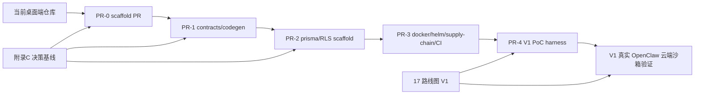

# 开工前补件与工程脚手架冻结

> 本文档是 LobsterAI「桌面单机 → 多租户 SaaS Web」改造进入 V1 前的**工程准入清单**。它不描述业务功能实现，而是要求先冻结仓库形态、目录边界、代码生成、数据库、容器、Helm、CI 与 TypeScript 工程引用，避免 V1 一边做 PoC 一边改地基。
>
> **结论先行**：当前仓库仍是 Electron + React 桌面端结构，根目录尚未出现 `apps/`、`libs/`、`charts/`、`prisma/`、`docker/` 等 SaaS 目标工程目录。因此第一个 PR 必须是 **scaffold PR**，不是业务逻辑 PR；任何对话、租户、计费、沙箱编排等业务代码都应在 scaffold 合并并通过门禁后再进入。

---

## 1. 本文定位

### 1.1 解决什么问题

V1 的目标是验证 OpenClaw 云端沙箱、Web 桥契约、配置渲染、存储与出网封锁是否可行。若没有先冻结工程脚手架，V1 会出现以下风险：

- 前端、后端、运行时、契约、数据库 schema 分散落在旧 `src/`、`scripts/`、临时目录中，后续迁移成本指数级上升。
- REST/WS 契约、Prisma schema、DTO、前端 bridge 类型各自手写，导致字段漂移，违背附录 C 的“契约事实源”原则。
- Dockerfile、Helm chart、CI 命令和本地命令名称边做边改，V1 的 PoC 证据无法复现。
- 生成物被手改，CI 只验证当前工作树，不验证“从源生成”的可重复性。

### 1.2 不解决什么问题

本文不设计具体业务接口字段，不实现 NestJS 服务，不迁移 React 组件，不新增 Prisma 表的完整业务字段，也不编写 OpenClaw runtime 代码。字段级接口仍以 `附录C-决策基线与接口契约总纲.md` 与未来 `libs/shared/contracts` 为权威。

---

## 2. 当前仓库结构缺口（核对 2026-07-08）

当前根目录包含 `src/`、`scripts/`、`resources/`、`vendor/`、`tests/`、`.github/workflows/` 等桌面端工程目录，但尚未具备目标 SaaS monorepo 结构。

| 目标区域 | V1 前应存在的形态 | 当前仓库状态 | 影响 |
|---|---|---|---|
| workspace/monorepo | 根 package manager workspace，统一安装、脚本、缓存、约束 | 只有单应用 `package.json`，未见 workspace 目录 | 无法并行承载 `web/api/worker/orchestrator` |
| `apps/*` | Web SPA、API、worker、runtime orchestrator 等应用边界 | 未见 `apps/` | 新服务若直接塞进旧 `src/` 会污染桌面端边界 |
| `libs/*` | 共享契约、类型、工具、server/client 基础库 | 未见 `libs/` | 前后端共享类型和公共逻辑没有稳定归属 |
| `libs/shared/contracts` | OpenAPI/AsyncAPI/JSON Schema 契约事实源 | 未见 contracts 目录 | DTO、bridge、契约测试无法从同源生成 |
| `prisma/` | Postgres schema、migration、seed、RLS 辅助脚本 | 未见 `prisma/` | 数据模型只能停留在文档，无法进入 CI 验证 |
| `charts/` | SaaS 服务 Helm chart 与 values 分层 | 未见 `charts/` | 部署拓扑、资源限制、NetworkPolicy 无法版本化 |
| `docker/` | Web/API/worker/orchestrator/runtime 镜像构建入口 | 未见 `docker/` | V1 runtime 与服务镜像 PoC 难以复现 |
| 共享库命名决策 | 选择 `libs/` 或 `packages/` 作为唯一共享库主命名；本文默认 `libs/` | 当前尚未冻结为 monorepo 命名约束 | 若误把 `packages/` 也建出来，会与 `libs/shared/contracts` 事实源并行漂移 |
| CI | SaaS monorepo 的 lint/typecheck/test/contract/prisma/supply-chain/docker/helm/PoC harness 门禁 | 已有桌面端 workflow，但不是 SaaS monorepo 门禁 | scaffold 不进 CI，后续业务 PR 无统一质量线 |

### 2.1 Day-0 决策表（PR-0 输入，未冻结不得开 V1）

下表是 V1 PoC 的外部环境与平台决策。它们不是业务需求，也不应在 V1 执行中临场口头决定；PR-0 至少要把决策字段、候选/默认值、验收脚本和 owner 写进仓库配置或 `docs/poc` 模板。模板占位只允许存在于 PR-0 scaffold，**PR-4 完成 / V1-E0 开始前必须替换为环境真实取值**；配置、manifest 或证据包模板中残留 `<待定>`、dummy URL、dummy region、dummy RuntimeClass 视为阻断。

| 决策项 | PR-0 最低冻结内容 | Owner | 影响 |
|---|---|---|---|
| 云厂商 / region | dev/staging 使用的云厂商、region、AZ 数、数据驻留默认区域；是否允许本地 kind 仅作开发 | 架构/PLAT | StorageClass、TLS、对象存储、数据驻留 |
| Kubernetes 版本 | 目标 K8s minor、Ingress Controller、NetworkPolicy CNI、Pod Security Admission 级别 | PLAT | RuntimeClass、NetworkPolicy、Helm API 版本 |
| RuntimeClass | `gvisor` 默认名、`kata` 兼容档名、节点池标签与 taint/toleration | PLAT/SEC | V1 沙箱 PoC、V4 运行时强化 |
| StorageClass / RWX | RWX 候选（EFS/CephFS/NFS/云文件存储）与 fallback（workspace service 代理 IO） | PLAT/DATA | 工作区一致性、成本、备份 |
| Registry / 签名 | 镜像 registry、tag 规则、SBOM、cosign key/issuer、部署时签名校验策略 | PLAT/SEC | 供应链、回滚、生产准入 |
| S3 / MinIO | bucket 命名、region、KMS/服务端加密、前缀 `tenants/{tid}/`、生命周期策略 | PLAT/DATA/SEC | artifacts、导入包、备份、删除权 |
| 域名 / TLS | `app/api/preview/share/status` 域名、证书来源、preview/share 是否独立 eTLD+1 | PLAT/SEC/PM | OIDC redirect、CSP、status page |
| OIDC / 用户目录 | dev/staging IdP、redirect URI 白名单、测试用户与测试租户创建方式 | BE/SEC | 登录闭环、组织切换、RBAC |
| 模型 provider / mock | V1 默认 mock model gateway URL、允许的小额真实 provider、测试 key 保管方式 | BE/PLAT/SEC | egress PoC、计费、成本 |
| 数据层 | Postgres 版本、PgBouncer transaction 模式、Redis 拓扑、备份/PITR 策略 | DATA/PLAT | RLS、队列、WS 补发 |
| 网络 egress | 默认 deny 策略、允许域名/IP、metadata/internal CIDR 探针清单 | SEC/PLAT | 沙箱安全、模型网关强制路径 |
| 证据包位置 | `docs/poc/YYYYMMDD_V1_OpenClaw沙箱PoC证据包/` 模板、日志/截图/指标/manifest 必填项 | QA/PM | V1 go/no-go 可审计性 |

---

## 3. V1 前必须冻结的工程脚手架

### 3.1 Monorepo / workspace 决策

**冻结口径。**

- 当前仓库原地演进为 monorepo；旧桌面端代码在迁移前仍保留现有 `src/`、`scripts/` 形态，不在 scaffold PR 中大搬家。
- 所有新增 SaaS 代码必须进入 `apps/*` 或 `libs/*`，不得把新后端、新 Web 桥、新 runtime orchestrator 直接混入旧桌面端 `src/main`、`src/renderer`。
- `packages/` 与 `libs/` 只能选一种作为共享库主命名。本文建议以 `libs/` 为主，因为改造计划和附录 C 已把契约事实源命名为 `libs/shared/contracts`；若最终选择 `packages/`，必须在 scaffold PR 同步改写文档索引和命令，不允许两个命名体系并行漂移。
- 根目录只承载 workspace 配置、统一脚本、全局 TypeScript/ESLint/测试配置、CI 配置和改造文档，不承载新增业务模块。

**建议目标形态。**

```text
apps/
  web/
  api/
  worker/
  runtime-orchestrator/
libs/
  shared/
    contracts/
    types/
  client/
    bridge/
  server/
    db/
    auth/
prisma/
docker/
charts/
docs/
  supply-chain/
  poc/
```

### 3.2 `apps/*` 应用边界

| 目录 | 职责 | V1 scaffold 产物 | 不得提前放入 |
|---|---|---|---|
| `apps/web` | 浏览器 SPA 与 `window.electron` 同形 Web bridge 的宿主 | 最小 Vite/React app 壳、路由占位、bridge 入口占位 | 真实 Cowork UI 迁移、业务状态机重写 |
| `apps/api` | REST/WS API、鉴权中间件、Cowork service 入口 | NestJS 或等价 Node service 壳、health/readiness、OpenAPI 挂载点 | 会话业务、租户业务、计费业务 |
| `apps/worker` | BullMQ worker、定时任务执行器、异步作业 | worker 进程壳、队列连接配置占位 | 真实 scheduled task 逻辑 |
| `apps/runtime-orchestrator` | K8s Pod 编排、sandbox lifecycle、OpenClaw gateway lease | 进程壳、配置 schema、client 接口占位 | 实际创建生产 Pod 的复杂策略 |

V1 业务 PoC 可以先通过脚本或最小 API 调 runtime，但脚本必须位于目标边界内，不能散落到临时目录后再人工复制。

**物理 deployable 统一口径。**

| 阶段 | 仓库 app 目录 | 镜像 / 部署单元 | 逻辑服务归属 | 拆分规则 |
|---|---|---|---|---|
| PR-0~PR-4 前置 / V1 | `apps/web`、`apps/api`、`apps/worker`、`apps/runtime-orchestrator` | `lobster-web`（或 CDN 静态产物）、`lobster-api`、`lobster-worker`、`lobster-runtime-orchestrator`、`lobster-openclaw-runtime` | 前置脚手架先创建物理边界，V1 沿用该边界做 PoC；Auth/Cowork/Agent/File/Artifact/Model/MCP/Skill/Config 都先是 `apps/api` 内 NestJS modules；BullMQ 消费在 `apps/worker`；K8s 写权限只在 `apps/runtime-orchestrator` | 不创建 `apps/gateway`、`apps/cowork`、`apps/auth` 等物理服务 |
| V2 / V3 | 同 PR-0 | 同 PR-0，可按 Helm values 增副本 | 单租户闭环与多租户 Beta 仍保持 `lobster-api` 合并部署，避免过早微服务化 | 只允许拆 module，不拆 image |
| V4 | 同 PR-0 | `lobster-runtime-orchestrator` 必须独立部署并持最小 K8s RBAC；`lobster-api` 仍承载领域模块 | Runtime Orchestrator 与 API 强隔离；Config Sync 的 initContainer / 子命令 entrypoint 属于 `lobster-runtime-orchestrator` 镜像，`lobster-api` 只提供配置输入与领域 API | 若需要独立 `lobster-configsync` 镜像，先做 RFC |
| V5 / V6 或规模化后 | 可新增 `apps/gateway`、`apps/cowork`、`apps/auth`、`apps/modelgw` 等 | 对应拆出 `lobster-gateway`、`lobster-cowork`、`lobster-auth`、`lobster-modelgw` 等 | 仅当连接数、CPU、故障隔离、合规 RBAC 或团队所有权有实测证据要求拆分 | 拆分必须先更新 `02/04/15/19` 与 Helm/CI 矩阵，不得口头漂移 |

### 3.3 `libs/*` 与契约事实源

`libs/` 是跨应用共享代码唯一入口，必须先定义“可共享”和“不可共享”的边界。

| 目录 | 职责 | 规则 |
|---|---|---|
| `libs/shared/contracts` | OpenAPI、AsyncAPI、JSON Schema、契约 fixture | REST/WS 字段级事实源；后端 DTO、前端 bridge 类型、契约测试均从这里生成；必须含 `CoworkStreamChannel` 注册表、`StreamTicketRequest/Response` 与 canonical REST/WS 路径（`POST /api/v1/sessions`、`POST /api/v1/sessions/:id/turns`、`GET /api/v1/sessions/:id/messages`、`POST /api/v1/sessions/:id/permissions/:requestId/respond`、`POST /api/v1/stream/ticket`、`POST /api/v1/asr/sessions`、`POST /api/v1/model/proxy`、`POST /api/v1/model/stream`、`POST /api/v1/model/stream/:requestId/abort`、`GET /api/v1/model/config`、`PUT /api/v1/model/config`、`POST /api/v1/model/config/check`、`GET /api/v1/models`、`GET /api/v1/models/:id`、`GET /api/v1/pricing/models`、`GET /api/v1/media/tasks/:taskId`、`POST /api/v1/media/tasks/:taskId/cancel`、`GET /api/v1/billing/account`、`GET /api/v1/billing/usage`、`GET /api/v1/billing/plan`、`POST /api/v1/billing/byok`、`DELETE /api/v1/billing/byok/:provider`、`GET /api/v1/workspaces`、`POST /api/v1/workspaces`、`GET /api/v1/workspaces/:wid/files/tree`、`GET /api/v1/workspaces/:wid/files/download`、`POST /api/v1/workspaces/:wid/files/upload`、`POST /api/v1/workspaces/:wid/uploads`、`POST /api/v1/workspaces/:wid/uploads/:id/complete`、`DELETE /api/v1/workspaces/:wid/files`、`GET /api/v1/workspaces/:wid/files/stat`、`GET /api/v1/workspaces/:wid/files/thumbnail`、`POST /api/v1/skills/install`、`POST /api/v1/skills/sync`、`POST /api/v1/kits/install`、`POST /api/v1/scheduled-tasks/:id/runs`、`GET /api/v1/scheduled-tasks/:id/runs`、`GET /api/v1/scheduled-tasks/runs`、`POST /api/v1/privacy/exports`、`GET /api/v1/privacy/exports/:exportId`、`POST /api/v1/privacy/deletions`、`GET /api/v1/privacy/deletions/:deletionId`）与 `supply-chain-inventory.schema.json`；本列表、附录 A 与各专题文档中的单段 `:paramName`（如 `:id`/`:requestId`/`:wid`/`:key`/`:taskId`/`:provider`/`:runId`/`:presetId`/`:artifactId`/`:previewSessionId`/`:asrSessionId`/`:exportId`/`:deletionId`）只是文档 shorthand，OpenAPI/AsyncAPI 源文件必须写成对应 `{paramName}` 并由 contract check 按任意单段参数归一比对；其中模型代理/模型配置兼容/model catalog/pricing/billing/media task/ASR session+stream 在 PR-1 只冻结路径、最小响应/帧、错误信封和旧桥兼容形状，V5-E1 再补齐 `/model/proxy`、`/model/stream`、`/model/stream/{requestId}/abort` 的 provider adapter、模型详情、媒体任务状态/取消、ASR provider 转写/partial/final/error、BYOK/ledger/quota 行为、计费字段与行为测试；PR-1 contract check 还必须基于 route/channel 注册表校验 route path 与 channel path/type 全值匹配；REST 负向检查基于 path 全值匹配或 anchored regex（不得用 substring 误伤 canonical `/api/v1/...`）拒绝所有正式 REST 冒号式 action path（如 `/sessions/{id}:...`、`/sessions:batchDelete`、`/runtime:restart`、`files:download`、`files:upload`、`/media/tasks/{taskId}:cancel`、`/skills:install`、`/kits:install`、`/files:upload`、`/tasks/{id}:run`、`/scheduled-tasks/{id}:run`、`/scheduled-tasks/{id}/run`、`/plugins:detect`）和旧/无版本路径（如 `/api/model/proxy`、`/api/model/stream`、`/model/config`、`/api/model/config`、`/model/config:check`、`/skills/install`、`/skills/sync`、`/model/catalog`、`/api/models/{id}`、`/model/{id}`、`/api/v1/media/models`、`/media/tasks/{taskId}`、`/media/tasks/{taskId}/cancel`、`/asr/sessions`、`/billing/pricing`、`/billing/account`、`/billing/usage`、`/billing/plan`、`/billing/byok`、`/api/v1/billing/quota`、`/api/v1/privacy/export`、`/api/v1/privacy/delete`、`/api/v1/privacy/delete/:deletionId`、`/api/v1/workspaces/:wid/tree`、`/api/v1/workspaces/tree`），统一改为规范子资源路径（动作类用 POST，读取类保留 GET） |
| `libs/shared/types` | 不依赖运行时的纯 TypeScript 类型 | 只能放稳定值对象、枚举、公共错误码；不得引用 React、NestJS、Electron |
| `libs/client/bridge` | 浏览器端 bridge 类型与客户端调用封装 | 从 contracts 生成或包装生成类型，不手写字段副本 |
| `libs/server/db` | Prisma client 包装、tenant scope、RLS helper | 不直接暴露裸 Prisma client 给业务层 |
| `libs/server/auth` | JWT/OIDC、tenant/member 上下文解析 | 只放服务端逻辑，不被 `apps/web` 引用 |

**插件路径补充门**：`plugins:*` 虽然在附录 A 早期表格曾用无前缀 shorthand，但 PR-1 OpenAPI 必须写成 `/api/v1/plugins...` 且参数使用 OpenAPI `{}` 写法。至少冻结 `GET /api/v1/plugins`、`POST /api/v1/plugins/detect`、`POST /api/v1/plugins/sync`、`POST /api/v1/plugins/install`、`PATCH /api/v1/plugins/{id}`；contract check 必须拒绝无版本 `/plugins`、`/plugins/detect`、`/plugins/sync`、`/plugins/install`、`/plugins/:id/update`、`/plugins/{id}/update` 以及冒号式 `/plugins:detect`、`/plugins:sync`、`/plugins:install`。

**ASR 契约补充门**：`asr:realtime:createSession` 在附录 A / `13` 属 GA 主线降级替代，不得因 `04` 曾把 `asr:*` 误归入 Electron-only 降级而漏出 contracts。PR-1 OpenAPI 必须冻结 `POST /api/v1/asr/sessions`，AsyncAPI 必须冻结 `WS /api/v1/asr/sessions/{asrSessionId}/stream` 的 `asrAudioChunk/asrPartial/asrFinal/asrError` 帧；contract check 必须拒绝无版本 `/asr/sessions`、把 ASR 混入 `/api/v1/model/stream`、或只实现前端 MediaRecorder 而没有服务端 stream ticket / tenant scope 的假闭环。

**模型配置兼容门**：本门属于上表 `libs/shared/contracts` 的 PR-1 canonical REST 路径集合与下方 PR-1 验收，不是 V5-E1 才新增的后续项；`get-api-config` / `check-api-config` / `save-api-config` 在附录 A 属 GA 主线旧桥兼容面，不能因为 V5-E1 重点写了模型代理/目录/计费而漏出 contracts。PR-1 OpenAPI 必须冻结 `GET /api/v1/model/config`、`PUT /api/v1/model/config`、`POST /api/v1/model/config/check`；响应只允许脱敏配置状态，写入的密钥材料必须归一到 `09`/`14` 的 BYOK/secref 存储，不得另建并行密钥库。contract check 必须拒绝无版本 `/model/config`、`/api/model/config` 与冒号式 `/model/config:check`。

**全量路由覆盖门**：上表括号中的路径只是 PR-1 必须显式冻结的高风险关键集合，不是 OpenAPI/AsyncAPI 路由与通道全集。PR-1 还必须从 `附录A` 所有 ✅/部分 ✅ 通道与专题文档的 GA 路径生成 route/channel registry，并让 `contracts:check` 断言其全部存在且 REST 返回形状与 WS/AsyncAPI 帧形状齐备；尤其不得漏 `POST /api/v1/stream/ticket`、`cowork:media:cancel` / `media:getTaskStatus` / `cowork:media:statusPollUpdate`（`/api/v1/media/tasks/{taskId}/cancel`、`/api/v1/media/tasks/{taskId}` 与 AsyncAPI `mediaStatusPollUpdate`）、`asr:realtime:createSession`（`POST /api/v1/asr/sessions` 与 AsyncAPI `asrAudioChunk/asrPartial/asrFinal/asrError`）、`artifact:createPreviewSession` / `createOfficePreviewSession` / `destroyPreviewSession`（`/api/v1/artifacts/{artifactId}/preview`、`/api/v1/artifacts/preview-sessions/{previewSessionId}`）、`htmlShare:*`（`/api/v1/html-shares...`）、`shareDeployment:*` 的静态站 GA 路径（`/api/v1/share-deployments/static` 等，Node 服务为 unsupported 契约）、以及 `scheduledTask:*` 的 CRUD/stop/count/resolve/channels 路径。负向检查必须拒绝无版本业务路径（如 `/media/tasks/{taskId}`、`/media/tasks/{taskId}/cancel`、`/asr/sessions`、`/artifacts/preview-sessions`、`/artifacts/office-preview-sessions`、`/html-shares`、`/share-deployments/*`）和冒号式 action，但不得误伤带 `/api/v1/` 前缀的 canonical 路径（如 `/api/v1/media/tasks/{taskId}/cancel`、`/api/v1/asr/sessions`、`/api/v1/share-deployments/static`、`/api/v1/share-deployments/node`）。

**生成物规则。**

- 所有由 OpenAPI/AsyncAPI/Prisma 生成的 TypeScript、client、DTO、schema snapshot 必须带 `Generated file. Do not edit.` 头部或等价标记。
- 生成物若需要提交，CI 必须执行 codegen 后 `git diff --exit-code`；若不提交，CI 必须验证消费者可从源契约重新生成。
- 任何 PR 手改生成物都应被视为未通过，除非同时修改生成源并能复现同样差异。

### 3.4 Prisma / Postgres 脚手架

V1 前至少要创建 `prisma/` 的工程壳，即使业务表字段仍处于最小状态。

| 文件/目录 | 必须内容 |
|---|---|
| `prisma/schema.prisma` | datasource、generator、最小公共模型命名规范、`tenant_id` 约束写法示例 |
| `prisma/migrations/` | 迁移目录策略与命名规则；正式业务迁移不得手写 SQL 后跳过 Prisma 记录 |
| `prisma/rls/` | RLS policy SQL 或生成脚本归属，明确 `ENABLE + FORCE` 的执行门禁 |
| `prisma/seed/` | 本地/dev/test seed 入口，禁止含真实租户数据或真实密钥 |

Prisma 生成 client 的落点必须冻结，例如 `libs/server/db/generated`。无论是否提交生成 client，都要通过 CI 证明从 `schema.prisma` 可重复生成。

### 3.5 Docker / Helm / runtime 镜像入口

V1 要验证的不是“本机能跑”，而是“目标 Linux/K8s 环境可复现”。因此脚手架必须先提供版本化入口。

| 目录 | 必须冻结 |
|---|---|
| `docker/web` | Web 静态构建镜像或 Nginx/Caddy 托管策略 |
| `docker/api` | API service 镜像、非 root 用户、healthcheck |
| `docker/worker` | worker 镜像、队列依赖、优雅停机信号 |
| `docker/runtime-orchestrator` | K8s client、service account、配置挂载入口 |
| `docker/openclaw-runtime` | `lobster-openclaw-runtime` V1 PoC 镜像入口，不含 Electron UI、Xvfb/noVNC、真实密钥、租户数据 |
| `charts/lobsterai` | values 分层、Deployment/Service/Ingress/Secret/ConfigMap、NetworkPolicy、ResourceQuota 占位 |

生产镜像与 debug 镜像必须从目录和 tag 命名上分离，避免旧容器方案里的 noVNC/Xvfb 被误接入正式 Helm values。

V1 PoC harness 必须放在目标边界内：`apps/runtime-orchestrator/poc/` 放 acquire/turn/egress/storage 脚本，`charts/lobsterai/templates/sandbox-pod.yaml` 放可 lint 的 sandbox Pod 样例，证据包模板放 `docs/poc/YYYYMMDD_V1_OpenClaw沙箱PoC证据包/README.md`。证据包目录名必须带日期和主题，不能使用泛泛的 `outputs/`。

### 3.6 CI 门禁

scaffold PR 必须新增或改造 GitHub Actions，使后续业务 PR 共享同一门禁。至少冻结以下命令名和语义：

| 命令 | 语义 |
|---|---|
| `npm ci` | 使用锁文件可重复安装；若决定改用 pnpm/yarn，必须在同一 PR 冻结对应命令和 lockfile |
| `npm run lint` | 对 workspace 中可 lint 的源码执行 ESLint，不因新增包绕过 |
| `npm run typecheck` | 执行 TypeScript project references 构建或 `tsc -b` |
| `npm test` | 保持当前官方 Vitest/纯逻辑单测快环；不得在 PR-0 默默并入契约、后端集成或 Testcontainers。契约固定走 `npm run contracts:check`；PR-2 之后若要把容器集成并入默认集合，必须同 PR 冻结依赖、skip 规则、CI 资源与超时 |
| `npm run test:e2e` | 浏览器 E2E 入口；PR-0 可先只输出 `blocked/not-applicable: Playwright scaffold not installed` 并生成缺口报告，不能静默绿灯；Playwright 依赖进入仓库后按阶段真实跑 J1-J11 与 trace/video/report（J11 ASR 自 V5/ASR 后端落地后阻断） |
| `npm run contracts:check` | 校验 OpenAPI/AsyncAPI 格式、route/channel 覆盖、REST 返回/WS 帧形状、生成物是否最新、契约 fixture 是否可读 |
| `npm run prisma:validate` | 校验 Prisma schema、migration 结构、RLS 脚本入口 |
| `npm run supply-chain:check` | 校验 bundled skills、OpenClaw plugins、Kit/MCP 默认资产与供应链 manifest 一致 |
| `npm run docker:build:check` | 至少构建关键镜像或执行 Dockerfile 静态检查 |
| `npm run helm:lint` | 对 `charts/lobsterai` 执行 Helm lint 和 values schema 校验 |
| `npm run poc:v1:check` | 静态校验 V1 PoC harness、sandbox manifest、证据包模板与必填环境变量清单 |

当前项目命令以 `npm run` 为权威，且 `package.json` 已约束 Node `>=24.15.0 <25`。因此默认建议使用 **npm workspaces** 作为第一批 scaffold 的 package manager，减少同时迁移工具链的变量；若团队决定使用 pnpm，必须把 package manager 迁移作为独立脚手架决策纳入第一个 PR，不能夹带业务逻辑。

当前仓库的默认测试能力只有 Vitest（`npm test`）。Playwright E2E、OpenAPI/AsyncAPI contract check、Testcontainers、k6、Helm lint、Docker build check 都是 **PR-0~PR-4 分批新增脚手架**，不能在 V1 计划里当成已存在能力引用。PR-0 只提供“可失败的真实检查入口 + 最小 fixture/README”，PR-1 落 contract check，PR-2 落 Testcontainers/Prisma 最小集成门，PR-3 落 Docker/Helm/SBOM 门，PR-4 落 V1 PoC/k6 最小 client；命令不得静默 no-op。已激活为阶段门的检查若缺少环境，必须明确输出 `blocked: missing <decision>` 并阻断 CI 或 PoC 门；`test:e2e` 在 Playwright scaffold 未进入仓库前只作为显式缺口报告，不得伪装为通过。

### 3.7 TypeScript config / project references

V1 前必须建立多包 TypeScript 编译边界：

- 根目录提供 `tsconfig.base.json`，统一 `target`、`moduleResolution`、`strict`、`paths`、`types`。
- 每个 `apps/*`、`libs/*` 提供自己的 `tsconfig.json`，只引用允许依赖的项目。
- 根 `tsconfig.json` 使用 project references 汇总，`npm run typecheck` 应等价于 `tsc -b` 或明确的 workspace typecheck。
- 依赖方向必须固定：`apps/*` 可以依赖 `libs/*`；`libs/shared/*` 不依赖 `apps/*`、React、NestJS、Electron；`libs/server/*` 不被 `apps/web` 引用。
- 旧桌面端 TypeScript 配置在迁移前保持可运行，不因 SaaS scaffold 破坏现有 `npm run build`、`npm run compile:electron`。

---

## 4. 第一个 PR：scaffold PR，而不是业务逻辑 PR

### 4.1 PR 目标

第一个 PR 的目标是让仓库从“单体桌面端项目”具备“可承载 SaaS V1 开发的工程骨架”。它只允许增加目录、配置、占位应用壳、占位测试、CI 门禁、文档链接和生成规则，不允许实现真实业务链路。

### 4.2 必须包含的验收产物

| 类别 | 验收产物 |
|---|---|
| 目录 | `apps/web`、`apps/api`、`apps/worker`、`apps/runtime-orchestrator`、`libs/shared/contracts`、`libs/shared/types`、`libs/client/bridge`、`libs/server/db`、`prisma`、`docker`、`charts/lobsterai`、`docs/supply-chain`、`docs/poc` |
| 命令 | 根 `package.json` 定义并能运行 §3.6 的命令；缺少真实实现的命令必须有明确检查对象，不能静默 no-op |
| CI | GitHub Actions 至少跑 install、lint、typecheck、test、contracts、prisma、supply-chain、docker、helm、poc:v1；同时预留 e2e job 并在 Playwright 未进入仓库前产出 blocked/not-applicable 报告，Playwright scaffold 合并后改为阻断门；其余失败时阻断合并 |
| 生成物 | codegen 输出有固定目录、固定头部、固定检查命令；CI 验证生成源和输出一致 |
| 供应链 | `docs/supply-chain/skills-and-plugins.manifest.json` 与 `libs/shared/contracts/assets/supply-chain-inventory.schema.json` 入库；`npm run supply-chain:check` 失败会阻断 |
| PoC harness | `apps/runtime-orchestrator/poc/`、`docker/openclaw-runtime/`、`charts/lobsterai/templates/sandbox-pod.yaml`、`docs/poc/YYYYMMDD_V1_OpenClaw沙箱PoC证据包/README.md` 存在且被 `npm run poc:v1:check` 校验 |
| 文档 | README 索引加入本文；scaffold PR 描述链接 `02`、`03`、`04`、`06`、`07`、`15`、`16`、`17`、`附录C` 与本文 |
| 边界 | PR diff 中不得出现真实会话、租户、计费、MCP、Artifacts、沙箱调度业务实现 |

### 4.3 scaffold PR 的推荐验收命令

```bash
npm ci
npm run lint
npm run typecheck
npm test
npm run test:e2e
npm run contracts:check
npm run prisma:validate
npm run supply-chain:check
npm run docker:build:check
npm run helm:lint
npm run poc:v1:check
git diff --exit-code
```

最后一条用于保证 codegen、format、schema snapshot 等生成物已经由命令产出，而不是开发者手工改到“看起来正确”。

### 4.4 scaffold PR 合并门

| 门 | 标准 |
|---|---|
| SCAF-1 目录门 | 目标目录全部存在，且每个目录有 README 或 package 描述职责边界 |
| SCAF-2 命令门 | §3.6 命令在本地和 CI 中有同名入口，失败会阻断 |
| SCAF-3 依赖门 | package manager、lockfile、workspace 配置冻结；业务 PR 不再改变包管理器 |
| SCAF-4 契约门 | `libs/shared/contracts` 是唯一契约源；前后端不得另起手写 DTO 源 |
| SCAF-5 生成门 | codegen 后工作树干净；生成物不得手改 |
| SCAF-6 兼容门 | 旧桌面端现有核心命令不因 scaffold 破坏 |

---

## 5. 第一批 PR 切分

> 第一批 PR 的顺序目标是“先地基、再契约、再数据库、再部署壳、最后才进入 V1 PoC”。PR 名称可调整，但边界不应混淆。

| 顺序 | PR 名称 | 内容边界 | 验收产物 | 关联文档 |
|---|---|---|---|---|
| PR-0 | `chore(scaffold): add saas workspace skeleton` | workspace、目录、tsconfig references、package manager、基础 CI、占位应用壳 | §4 全部门通过；不含业务逻辑 | 本文、`17` V1、`16` |
| PR-1 | `chore(contracts): add contract source and codegen gates` | `libs/shared/contracts`、OpenAPI/AsyncAPI 目录、`CoworkStreamChannel` 注册表、`StreamTicketRequest/Response`、`POST /api/v1/stream/ticket`、canonical REST/WS 路径、lint/generate/check、fixture 规范；模型代理/模型配置兼容/model catalog/pricing/billing/media task/ASR session+stream 只冻结路径、最小 DTO/帧、错误信封与旧桥兼容响应，不实现 V5 provider adapter、媒体上游任务执行、ASR provider 转写、BYOK 密钥托管、ledger/quota 计费逻辑 | `npm run contracts:check` 通过；生成物可复现；route/channel 全量覆盖门通过；10 个 `onStream*` 与 AsyncAPI 双向断言通过，`GET /api/v1/models/{id}` 单模型详情、旧桥 `GET/PUT /api/v1/model/config` + `POST /api/v1/model/config/check`、`mediaStatusPollUpdate`、ASR `asrAudioChunk/asrPartial/asrFinal/asrError` 事件与 ticket body 的 `sessions/resourceSubscriptions` schema 进入 OpenAPI/AsyncAPI | `附录A`、`附录C` D1、`03`、`04`、`09`、`13` |
| PR-2 | `chore(db): add prisma and rls scaffold` | `prisma/schema.prisma`、migration 目录、RLS 脚本入口、db lib 壳；第一条 migration/preflight 必须显式处理 `citext` 与 `gen_random_uuid()`/`pgcrypto` 可用性 | `npm run prisma:validate` 通过；扩展/preflight 检查可运行；无真实租户数据 | `05`、`06`、`附录C` D2 |
| PR-3 | `chore(deploy): add docker helm and supply-chain scaffold` | Dockerfile 壳、Helm chart 壳、values schema、NetworkPolicy/ResourceQuota 占位、供应链 manifest schema 与当前 skills/plugins 清单 | `npm run docker:build:check`、`npm run helm:lint`、`npm run supply-chain:check` 通过 | `07`、`10`、`14`、`15` |
| PR-4 | `chore(runtime): add v1 poc harness skeleton` | `apps/runtime-orchestrator/poc/` V1 PoC 脚本入口、runtime 镜像检查入口、sandbox Pod 样例、`docs/poc/YYYYMMDD_V1_OpenClaw沙箱PoC证据包/README.md` 模板 | `npm run poc:v1:check` 通过；可以承载后续真实 OpenClaw turn PoC；不伪造通过证据 | `07`、`08`、`16`、`17` |

PR-0 是唯一允许“没有业务价值但改变仓库地基”的 PR。PR-1 以后即使仍是脚手架，也必须有可运行检查命令和可审计产物。

---

## 6. 开工冻结清单

进入 V1 业务开发前，技术负责人应逐项签收：

| 冻结项 | 签收标准 |
|---|---|
| Monorepo 形态 | `apps/*`、`libs/*`、`prisma`、`docker`、`charts` 已入库，命名不再反复 |
| Package manager | npm workspaces 或替代方案已冻结，lockfile 入库，CI 使用同一工具 |
| Contracts | OpenAPI/AsyncAPI 源目录、生成目录、检查命令、手改禁止规则已生效 |
| Prisma | schema、migration、RLS、seed 入口存在并进入 CI |
| Supply chain | bundled skills / OpenClaw plugins / Kit-MCP 默认资产 manifest 已入库并进入 CI |
| Docker | 每类服务镜像入口明确，生产/debug 镜像分离 |
| Helm | chart、values、NetworkPolicy、ResourceQuota、Secret/ConfigMap 占位进入 CI |
| V1 PoC harness | harness 入口、sandbox manifest、证据包模板与必填环境变量清单已入库 |
| CI | 新增 SaaS 包不会绕过 lint/typecheck/test/contract/prisma/supply-chain/docker/helm/PoC harness |
| TypeScript | project references 和依赖方向固定，`libs/shared` 不反向依赖应用 |
| 文档 | README 索引包含本文；PR 模板或 PR 描述要求链接相关改造计划 |

未完成以上冻结项时，**禁止启动 V1-E0…E6 的真实业务 / PoC PR**。因时间压力需要裁剪范围时，只能把未完成项登记为阻断项并调整 V1 周期基线或新增前置补件 PR；不得把“记录例外”作为合并或启动真实业务 PR 的理由。补齐 PR 必须先于 V1-E0 合并并通过对应门禁。

---

## 7. 与既有路线图的关系

本文是 `17-分阶段路线图与工作量估算.md` 中 V1 之前的工程补件，不改变 V1-V6 范围，也不替代 `附录C` 的决策基线。



关键约束：

- `17` 仍是 V1-V6 路线图权威；本文只把“V1 前必须先补的工程地基”显式化。
- `附录C` 仍是接口契约、RLS、沙箱、计费等关键决策权威；本文只规定这些决策落到仓库结构和 CI 的方式。
- 若 scaffold 实施时发现 `apps/`、`libs/`、`prisma/`、`charts/`、`docker/` 的目标形态需要调整，必须先更新本文和 README 索引，再让业务 PR 依赖新的工程基线。
