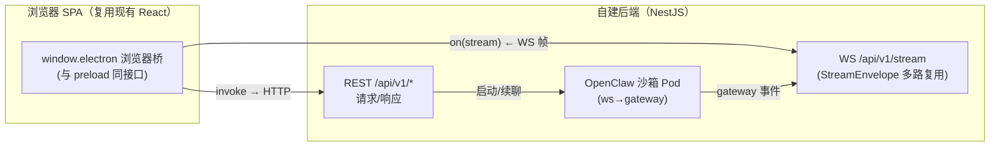
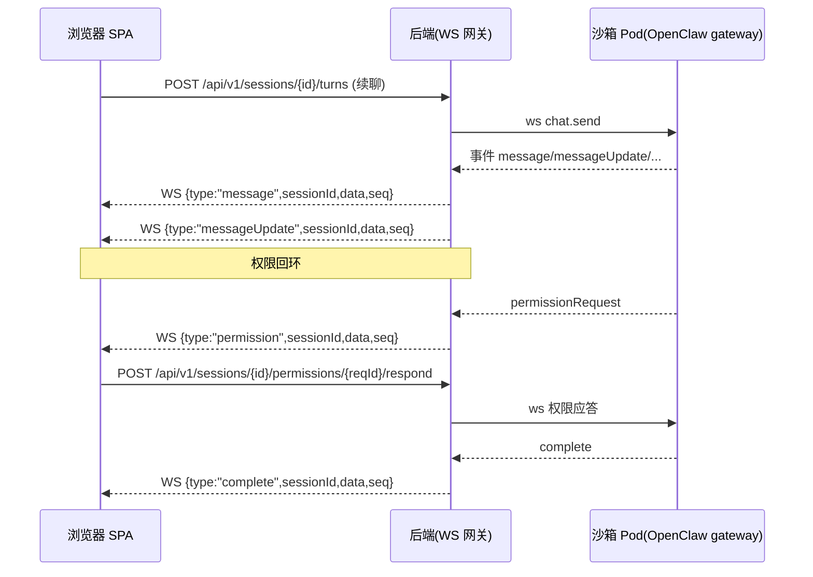

# 附录 A：IPC 通道 → REST/WS 接口映射清单

> 本文档是 SaaS 改造的**开发落地清单**：把仓库中现有的每一个 Electron IPC 通道（`ipcRenderer.invoke` / `ipcRenderer.on` / `webContents.send`）逐个映射到目标 Web 架构的 REST 端点或 WebSocket 频道，并标注 GA 主线/后续/降级。适合读者：正在改造 `src/renderer/services/*` 浏览器桥、编写后端 API、或做前后端联调对齐的工程师。表格可直接作为逐通道的开发任务清单（tracker）。
>
> **权威边界（对应附录 C D1）**：本附录**只作导航与逐通道任务清单**，不是字段级契约。字段级的请求 / 响应 / 事件 payload、错误信封、DTO 一律以 `libs/shared/contracts`（OpenAPI 3.1 + AsyncAPI 2.6）与 `附录C-决策基线与接口契约总纲.md`（§3 代表性 schema、§2 源码订正表、D1–D16 决策）为**唯一权威**；本附录表格中的动词、路径、载荷要点仅作定位线索，与 contracts / 附录 C 冲突时以后者为准。PR-1 初始抽取通道与事件全集时要结合现有 `src/shared/*/constants.ts` 的 `as const` 对象、handler 注册、`preload.ts` 桥表面与 runtime forwarder；稳定态由 contracts 内注册表导出，**禁止用字面量 `grep` 数通道**（曾因此漏掉 `cowork:stream:goal`，见附录 C §2-B13 与本文 A.3.2）。
>
> 上位设计见：`02-目标架构与技术选型.md`（REST+WS 传输选型）、`03-前端与传输层改造.md`（`window.electron` 浏览器桥）、`04-后端服务与API设计.md`（域拆分与 API 规约）、`13-功能取舍与降级清单.md`（降级项）。本附录不重复这些设计，只给逐通道映射。

---

## A.0 阅读约定

### 术语与列含义

| 列 | 含义 |
|----|------|
| **IPC 通道** | 现有 Electron 通道名（`ipcMain.handle`/`on` 注册，或 `webContents.send` 发出）。 |
| **方向** | `R→M` = 渲染层调用主进程（`invoke`，请求/响应）；`M→R` = 主进程推送渲染层（`send`，事件/流式）。 |
| **目标接口** | 建议的 REST 路径或 WS 事件类型。REST 前缀统一 `/api/v1`；应用推送/事件 WS 统一走一条多路复用连接 `/api/v1/stream`，按 `StreamEnvelope.type` + `sessionId/requestId` 分发；`channel` 仅用于 `subscribeEvent/unsubscribeEvent` 资源订阅和桥本地 topic，不作为会话流 wire 包壳。ASR 音频上行是浏览器采音流，不属于现有 `webContents.send` 事件映射，走 `09` 定义的 `/api/v1/asr/sessions/{asrSessionId}/stream` AsyncAPI channel。**注意：除 `/auth/*`、`/oauth/*`、`/.well-known/*` 等认证/OIDC 公共端点外，本附录目标接口列不得再使用无版本业务 REST shorthand；实现和 contracts 不得照抄历史材料里的无版本路径，PR-1 必须归一为 `/api/v1/...` 并拒绝无版本业务 REST。** |
| **HTTP 方法 / WS 类型** | REST 动词，或 `WS(server→client)` / `WS(client→server)`。 |
| **GA 主线** | ✅ V1-V6 GA 主线必做；🕒 GA 后续（IM/浏览器等）；⛔ 不做（computer-use/VM）；🔻 降级（桌面能力在 web 无对等）。 |

### 约定：不再逐个函数签名，统一走三类通道

现有 IPC 面（核对 2026-07-08，以符号/常量枚举为准、行号仅辅助，详见附录 C §2-B9/B14/B15）：`main.ts` 内 `ipcMain.handle` **211** + `on` **6** = **217** 个注册，全 `src/main` 合计 `handle` **277** + `on` **6** ≈ **283** 个，散落在 `src/main/main.ts`（已 **11307** 行）与 `src/main/ipcHandlers/*/handlers.ts` 模块（注意 42 个 `im:*` handler 仍**内联在 `main.ts`**，非独立域模块）；推送侧统一口径为**去重事件通道 ≈ 29 个**（`.send(` 调用点 ≈ **51** / `webContents.send` ≈ **36**），另有参数化的 `api:stream:${requestId}:*`。**不存在「259」这一合计口径**（04 §9 旧 DoD 分母已作废）。目标端统一收敛为三类：



- **请求/响应类**（原 `ipcRenderer.invoke`）→ REST（`GET`/`POST`/`PATCH`/`DELETE`）。
- **流式/事件类**（原 `webContents.send` + `ipcRenderer.on`）→ 一条 WS 连接上的 canonical `StreamEnvelope`（见 `04` §5 / 附录 C §3）：`{ "type": "message", "version": 1, "tenantId": "...", "sessionId": "...", "seq": "1719900000000-0", "emittedAt": "...", "data": {...} }`。前端桥把旧 `electron.on('cowork:stream:message', cb)` 只登记为桥本地回调；会话级 wire `subscribe/unsubscribe {sessionId,sinceSeq?}` 由 `activeSessionIds` registry 统一生成，收到 envelope 后再回调旧 channel；wire 层不使用 `{type:'event', channel}` 包壳。
- **桌面本地能力**（window/shell/dialog/clipboard/log 等）→ 用浏览器原生 API 或后端下载/上传替代，或标记降级。

> 前端桥的实现细节（如何用同一套 `on`/`invoke` 接口把上面三类转成 HTTP/WS）见 `03-前端与传输层改造.md`。

---

## A.1 域总览与 GA 主线优先级

| 域 | 代表通道前缀 | 目标资源根 | GA 主线 | 说明 |
|----|-------------|-----------|----|------|
| cowork 会话 | `cowork:session:*` | `/api/v1/sessions` | ✅ | 核心对话，含 fork/上下文。 |
| cowork 流式 | `cowork:stream:*` | WS `StreamEnvelope.type=message/...`（桥本地 topic 仍为 `cowork:stream:*`） | ✅ | 会话流式输出（最关键 WS）。 |
| cowork 配置/记忆/引导 | `cowork:config/memory/bootstrap/dreaming:*` | `/api/v1/cowork/*` | ✅ | 配置、记忆、引导、dreaming。 |
| 权限交互 | `cowork:permission:*` | WS + `/api/v1/sessions/:id/permissions` | ✅ | 工具执行授权回环；响应端点嵌在会话下，禁止无 session 的 `/api/v1/permissions/*`。 |
| 媒体生成 | `cowork:media:*`、`media:*` | `/api/v1/media/*` | ✅ | 生图/视频任务与轮询。 |
| 子代理 | `cowork:subagent/subTask:*` | `/api/v1/subagents` | ✅ | 子任务与子代理会话。 |
| agents | `agents:*` | `/api/v1/agents` | ✅ | 代理 CRUD 与预设。 |
| artifacts/预览 | `artifact:*` | `/api/v1/artifacts` + WS | ✅ | 见 `12-Artifacts与预览改造.md`。 |
| htmlShare | `htmlShare:*` | `/api/v1/html-shares` | ✅ | HTML/artifact 分享。 |
| 模型代理 | `api:stream`、`api:fetch`、`*-api-config` | `/api/v1/model/*` + WS | ✅ | 见 `09-模型代理与计费.md`。 |
| 认证/配额/模型目录 | `auth:*` | `/auth/*`、`/oauth/*`、`/api/v1/billing`、`/api/v1/models`、`/api/v1/pricing` | ✅ | 登录/换码端点按 `05` 走认证公共根；配额、模型目录与登录后 pricing 视图按 `09` 走业务 API。 |
| store/config | `store:*`、`enterprise:*` | `/api/v1/kv`、`/api/v1/config` | ✅ | KV 与企业配置。 |
| skills/kits | `skills:*`、`kits:*` | `/api/v1/skills`、`/api/v1/kits` | ✅ | 见 `10-MCP与技能改造.md`。 |
| MCP | `mcp:*` | `/api/v1/mcp` | ✅ | 见 `10`。stdio 需沙箱。 |
| plugins | `plugins:*` | `/api/v1/plugins` | ✅ | OpenClaw 插件管理。 |
| 定时任务 | `scheduledTask:*` | `/api/v1/scheduled-tasks` + WS | ✅ | 见 `11-定时任务调度.md`。 |
| openclaw 引擎 | `openclaw:engine/session/dataMigration:*` | `/api/v1/runtime/*` + WS | ✅ | 见 `07-OpenClaw运行时编排与沙箱隔离.md`。 |
| ASR 语音 | `asr:*` | `/api/v1/asr/*` + WS | ✅ | 实时语音转写。 |
| 文件/对话框 | `dialog:*` | `/api/v1/workspaces/:wid/files/*` | ✅ | 原生对话框→上传/浏览器选择。 |
| appUpdate | `appUpdate:*` | — | 🔻 | Web 无自动更新（CDN 直接发新版）。 |
| window/shell/clipboard | `window-*`、`shell:*`、`clipboard:*` | — | 🔻 | 浏览器原生 API 替代。 |
| log | `log:*` | `/api/v1/logs`（部分） | 🔻 | 本地日志文件不适用。 |
| appSettings | `app:*AutoLaunch/*PreventSleep` | — | 🔻 | 开机自启/防休眠不适用。 |
| IM 渠道 | `im:*` | `/api/v1/im/*`（后续） | 🕒 | GA 主线不做，见 `13`。 |
| OAuth 三方运行时 | `github-copilot:*`、`openai-codex-oauth:*` | `/api/v1/integrations/*` | 🕒 | 三方模型账号 OAuth（后续）。 |
| 浏览器画像 | `openclaw:browser:*` | — | ⛔/🕒 | 后台浏览器不做，见 `13`。 |
| computer-use | （见 `computerUse/`） | — | ⛔ | 桌面自动化明确不做。 |
| permissions（系统） | `permissions:checkCalendar/*` | — | 🔻 | 系统日历权限不适用。 |
| localWebServices | `localWebServices:list` | — | 🔻 | GA 主线不提供本地端口扫描/服务发现；旧桥仅返回 unsupported/隐藏入口。若后续做 Pod 端口代理，需重新走 RFC 并落到 `/api/v1/...`，不得复用旧 `/services`。 |

---

## A.2 请求/响应类通道 → REST 映射（大表）

> 下列为 `R→M`（`invoke`）通道。目标接口列已按版本化业务 REST 归一：除 `/auth/*`、`/oauth/*`、`/.well-known/*` 等认证/OIDC 公共端点外，PR-1 OpenAPI 必须写成 `/api/v1/...`，且拒绝无版本业务路径；若历史材料或旧评审记录出现无前缀写法，只能作为反例或迁移输入，不能作为 contracts 事实源。REST 租户隔离由 access token/JWT 承载；WS 先经 REST 换取一次性 ticket，并在首帧 `auth` 消费。路径不显式带 `tenantId`（见 `05`、`14-安全合规与多租户隔离.md`）。

### A.2.1 Cowork 会话（核心，GA 主线）

`cowork:session:start` 等注册见 `src/main/main.ts`（`cowork:permission:respond` 在 `src/main/main.ts:6752`）；分页常量见 `src/shared/cowork/constants.ts:1-5`。

> **网关 RPC 真名与寻址（对应附录 C D6 / §2-A2、A3）**：下表这些会话通道落到 OpenClaw 网关侧的 RPC 真名是 `chat.send / chat.abort / chat.history / sessions.list / sessions.patch / sessions.compact / sessions.goal / sessions.delete`——**不存在 `session.start / session.continue / session.history / session.delete` 这组方法名**；`cowork:session:continue` 实为对 `chat.send` 的封装（`continueSession`）。寻址单元是 **sessionKey** 而非 `sessionId`：一个 `sessionId` 对应**多个** sessionKey（`getSessionKeysForSession()` 返回数组），后端路由须用 `parseManagedSessionKey` / `resolveSessionIdBySessionKey`（`openclawChannelSessionSync.ts`）区分 managed / channel key 并定义多键选主，**不得把 `sessionId` 当 1:1 键**。

| IPC 通道 | 方向 | 目标接口 | 方法 | 说明 | GA 主线 |
|----------|------|----------|------|------|----|
| `cowork:session:start` | R→M | `/api/v1/sessions` | POST | 新建并启动会话；触发沙箱 Pod（见 `07`）与流式（WS）。 | ✅ |
| `cowork:session:continue` | R→M | `/api/v1/sessions/{id}/turns` | POST | 续聊，追加一个生成轮次。响应 202，输出走 WS；`/messages` 仅用于读取消息分页。 | ✅ |
| `cowork:session:stop` | R→M | `/api/v1/sessions/{id}/stop` | POST | 中止当前运行；与 `04` 的动作子资源命名一致。 | ✅ |
| `cowork:session:delete` | R→M | `/api/v1/sessions/{id}` | DELETE | 删除单会话。 | ✅ |
| `cowork:session:deleteBatch` | R→M | `/api/v1/sessions/batch-delete` | POST | 批量删除（body: `ids[]`）；禁止冒号式 `/sessions:batchDelete`。 | ✅ |
| `cowork:session:get` | R→M | `/api/v1/sessions/{id}` | GET | 会话详情。 | ✅ |
| `cowork:session:list` | R→M | `/api/v1/sessions?limit&cursor&pinned` | GET | 列表分页（页大小 `COWORK_SESSION_PAGE_SIZE=50`）。 | ✅ |
| `cowork:session:getMessages` | R→M | `/api/v1/sessions/{id}/messages?limit&cursor&direction` | GET | 消息游标分页（默认页大小 `COWORK_MESSAGE_PAGE_SIZE=30`）；禁止用 offset，游标语义见 `04` §4.3 / 附录 C D10。 | ✅ |
| `cowork:session:rename` | R→M | `/api/v1/sessions/{id}` | PATCH | 改标题（body: `title`）。 | ✅ |
| `cowork:session:pin` | R→M | `/api/v1/sessions/{id}` | PATCH | 置顶/排序（body: `pinned`,`pinOrder`）。 | ✅ |
| `cowork:session:fork` (`CoworkIpcChannel.ForkSession`) | R→M | `/api/v1/sessions/{id}/fork` | POST | 分支（`CoworkForkMode`: none/conversation/worktree）。worktree 模式需沙箱工作区拷贝，见 `08-文件工作区与对象存储.md`。 | ✅ |
| `cowork:session:remoteManaged` | R→M | `/api/v1/sessions/{id}/managed` | GET | 托管会话（IM/cron 派生）状态。 | ✅ |
| `cowork:session:contextUsage` | R→M | `/api/v1/sessions/{id}/context-usage` | GET | 主动拉取上下文用量（另有 WS 推送）。 | ✅ |
| `cowork:session:compactContext` | R→M | `/api/v1/sessions/{id}/compact-context` | POST | 触发上下文压缩；与 `04` 的动作子资源命名一致。 | ✅ |
| `cowork:session:markViewed` (`MarkSessionViewed`) | R→M | `/api/v1/sessions/{id}/viewed` | POST | 标记已读；动作端点一律用子资源，禁止回退到冒号式 `/sessions/{id}:markViewed`。 | ✅ |
| `cowork:session:getMessageRailIndex` | R→M | `/api/v1/sessions/{id}/rail-index` | GET | 消息导航索引。 | ✅ |
| `cowork:session:captureImageChunk` | R→M | `/api/v1/sessions/{id}/result-image/chunks` | POST | 结果图分块上传→对象存储（见 `08`）；chunk 序号与幂等键进 body / header。 | ✅ |
| `cowork:session:exportResultImage` | R→M | `/api/v1/sessions/{id}/exports/result-image` | POST | 导出结果图，返回下载 URL。 | ✅ |
| `cowork:session:saveResultImage` | R→M | `/api/v1/sessions/{id}/result-image/files` | POST | 保存结果图到工作区（对象存储 / `/workspace/project` 子树）。 | ✅ |
| `cowork:session:exportText` | R→M | `/api/v1/sessions/{id}/exports/text` | POST | 导出对话为文本，返回下载 URL。 | ✅ |
| `get-recent-cwds` | R→M | `/api/v1/workspaces/recent` | GET | 最近工作目录，Web 下为租户工作区路径（见 `08`）。 | ✅ |

### A.2.2 Cowork 配置 / 记忆 / 引导 / dreaming（GA 主线）

| IPC 通道 | 方向 | 目标接口 | 方法 | 说明 | GA 主线 |
|----------|------|----------|------|------|----|
| `cowork:config:get` | R→M | `/api/v1/cowork/config` | GET | 读取 cowork 配置（工作目录、执行模式、记忆开关等）。 | ✅ |
| `cowork:config:set` | R→M | `/api/v1/cowork/config` | PATCH | 更新配置。 | ✅ |
| `cowork:memory:getStats` | R→M | `/api/v1/cowork/memory/stats` | GET | 记忆统计。 | ✅ |
| `cowork:memory:listEntries` | R→M | `/api/v1/cowork/memory/entries` | GET | 记忆条目列表。 | ✅ |
| `cowork:memory:createEntry` | R→M | `/api/v1/cowork/memory/entries` | POST | 新增记忆。 | ✅ |
| `cowork:memory:updateEntry` | R→M | `/api/v1/cowork/memory/entries/{id}` | PATCH | 更新记忆。 | ✅ |
| `cowork:memory:deleteEntry` | R→M | `/api/v1/cowork/memory/entries/{id}` | DELETE | 删除记忆。 | ✅ |
| `cowork:bootstrap:read` | R→M | `/api/v1/cowork/bootstrap` | GET | 读引导内容（BOOTSTRAP.md）。 | ✅ |
| `cowork:bootstrap:write` | R→M | `/api/v1/cowork/bootstrap` | PUT | 写引导内容。 | ✅ |
| `cowork:dreaming:status` | R→M | `/api/v1/cowork/dreaming/status` | GET | dreaming（记忆整理）状态。 | ✅ |
| `cowork:dreaming:diary` | R→M | `/api/v1/cowork/dreaming/diary` | GET | dreaming 日记。 | ✅ |

### A.2.3 权限与媒体（GA 主线）

| IPC 通道 | 方向 | 目标接口 | 方法 | 说明 | GA 主线 |
|----------|------|----------|------|------|----|
| `cowork:permission:respond` | R→M | `/api/v1/sessions/{id}/permissions/{requestId}/respond` | POST | 回应权限请求；canonical 路径为 `POST /api/v1/sessions/:id/permissions/:requestId/respond`（见附录 C §3.3 / `19`），`sessionId` 来自权限事件或当前会话上下文，不能退回无 session 的 `/permissions/{requestId}:respond`。请求体对齐源码真实 `PermissionResult`（判别联合 `behavior:'allow'\|'deny'`，**不存在 `decision` / `scope` / `allow_always` 三字段**，「本次会话始终允许」= 在 `updatedPermissions` 追加规则）。同一端点亦承接 AskUser（`kind:'ask'`）。字段级见附录 C §3.1 / D2。配套 WS 推送 `cowork:stream:permission`。见 `src/main/main.ts:6752`。 | ✅ |
| `cowork:media:cancel` | R→M | `/api/v1/media/tasks/{taskId}/cancel` | POST | 取消媒体任务；`taskId` 是媒体任务对外 text id，不是内部 UUID；禁止冒号式 `/media/tasks/{taskId}:cancel`。 | ✅ |
| `media:getModels` | R→M | `/api/v1/models?kind=image\|video` | GET | 可用媒体模型走统一模型目录，禁止另建第二套 `/api/v1/media/models`。 | ✅ |
| `media:getTaskStatus` | R→M | `/api/v1/media/tasks/{taskId}` | GET | 媒体任务状态；`taskId` 是媒体任务对外 text id，另有 WS 轮询推送。 | ✅ |

### A.2.4 子代理（GA 主线）

| IPC 通道 | 方向 | 目标接口 | 方法 | 说明 | GA 主线 |
|----------|------|----------|------|------|----|
| `cowork:subagent:list` (`SubagentList`) | R→M | `/api/v1/sessions/{id}/subagents` | GET | 子代理运行列表。注册见 `src/main/ipcHandlers/coworkSubagent/handlers.ts:56`。 | ✅ |
| `cowork:subagent:delete` (`SubagentDelete`) | R→M | `/api/v1/subagents/{runId}` | DELETE | 删除子代理会话。见 `src/main/ipcHandlers/coworkSubagent/handlers.ts:64`。 | ✅ |
| `cowork:subTask:history` (`SubTaskHistory`) | R→M | `/api/v1/subagents/{runId}/messages` | GET | 子任务会话历史。见 `src/main/ipcHandlers/coworkSubagent/handlers.ts:27`。 | ✅ |

### A.2.5 Agents（GA 主线）

`agents:*` 常量见 `src/shared/agent/constants.ts`。

| IPC 通道 | 方向 | 目标接口 | 方法 | 说明 | GA 主线 |
|----------|------|----------|------|------|----|
| `agents:list` | R→M | `/api/v1/agents` | GET | 代理列表。 | ✅ |
| `agents:get` | R→M | `/api/v1/agents/{id}` | GET | 代理详情。 | ✅ |
| `agents:create` | R→M | `/api/v1/agents` | POST | 新建代理。 | ✅ |
| `agents:update` | R→M | `/api/v1/agents/{id}` | PATCH | 更新代理。 | ✅ |
| `agents:delete` | R→M | `/api/v1/agents/{id}` | DELETE | 删除代理。 | ✅ |
| `agents:presets` | R→M | `/api/v1/agents/presets` | GET | 预设代理列表。 | ✅ |
| `agents:presetTemplates` | R→M | `/api/v1/agents/preset-templates` | GET | 预设模板。 | ✅ |
| `agents:addPreset` | R→M | `/api/v1/agents/presets/{presetId}/install` | POST | 安装预设为用户代理；禁止冒号式 `/agents:addPreset`。 | ✅ |

### A.2.6 Artifacts / 预览（GA 主线）

`artifact:*` 常量见 `src/shared/artifactPreview/constants.ts`。文件预览在 web 端改为对象存储 URL + 后端预览服务，详见 `12-Artifacts与预览改造.md`。

| IPC 通道 | 方向 | 目标接口 | 方法 | 说明 | GA 主线 |
|----------|------|----------|------|------|----|
| `artifact:watchFile` | R→M | WS `subscribeEvent {channel:'files:changed', params:{workspaceId,path?}}` | WS(client→server) | 文件变更订阅；桥把旧 `watchFile(filePath)` 映射为工作区逻辑路径订阅，不向服务端传本地绝对 `filePath`（见 A.3、`08` §4.5）。 | ✅ |
| `artifact:unwatchFile` | R→M | WS `unsubscribeEvent {channel:'files:changed', params:{workspaceId,path?}}` | WS(client→server) | 取消订阅；参数口径同上。 | ✅ |
| `artifact:createPreviewSession` | R→M | `/api/v1/artifacts/{artifactId}/preview` | POST | 创建 HTML/文件型预览会话，返回 `{previewSessionId,url,expiresAt}`；桥层可把 `previewSessionId` 兼容映射为旧 `sessionId`，但 REST DTO/对象存储/HMAC 不得使用该别名（见 `12` §4.1）。 | ✅ |
| `artifact:createOfficePreviewSession` | R→M | `/api/v1/artifacts/{artifactId}/preview` | POST | Office/PPTX 预览使用同一 preview endpoint，body 指定 `mode:'office'`/入口文件；返回签名 URL + 沙箱域渲染页，不再另开无版本 `/artifacts/office-preview-sessions`。 | ✅ |
| `artifact:destroyPreviewSession` | R→M | `/api/v1/artifacts/preview-sessions/{previewSessionId}` | DELETE | 销毁预览会话；`previewSessionId` 仅为预览网关短期授权 ID，不是 Cowork `sessionId`，越权/不存在统一按不泄露存在性的 404/幂等成功处理。 | ✅ |
| `artifact:browser:clearCookies` | R→M | — | — | 后台浏览器画像，🔻降级/后续（见 `13`）。 | 🕒 |
| `artifact:browser:clearCache` | R→M | — | — | 同上。 | 🕒 |

### A.2.7 htmlShare（GA 主线）

`htmlShare:*` 常量见 `src/shared/htmlShare/constants.ts`。目标：后端自建分享服务（替代 `lobsterai-server.youdao.com`），见 `09`、`12`。

| IPC 通道 | 方向 | 目标接口 | 方法 | 说明 | GA 主线 |
|----------|------|----------|------|------|----|
| `htmlShare:createFromHtmlFile` | R→M | `/api/v1/html-shares` | POST | 从 HTML 文件建分享（body: `source=html`）。 | ✅ |
| `htmlShare:updateFromHtmlFile` | R→M | `/api/v1/html-shares/{id}` | PUT | 更新分享内容。 | ✅ |
| `htmlShare:getByHtmlFile` | R→M | `/api/v1/html-shares?source=html&clientSourceKey=` | GET | 按源文件查分享；禁止冒号式 `/shares:byHtmlFile` 或无版本 `/html-shares`。 | ✅ |
| `htmlShare:createFromArtifactFile` | R→M | `/api/v1/html-shares` | POST | 从 artifact 建分享（body: `source=artifact`）。 | ✅ |
| `htmlShare:updateFromArtifactFile` | R→M | `/api/v1/html-shares/{id}` | PUT | 更新。 | ✅ |
| `htmlShare:getByArtifactFile` | R→M | `/api/v1/html-shares?source=artifact&clientSourceKey=` | GET | 按 artifact 查；禁止冒号式 `/shares:byArtifactFile` 或无版本 `/html-shares`。 | ✅ |
| `htmlShare:updateStatus` | R→M | `/api/v1/html-shares/{id}/status` | PATCH | 启用/禁用状态。 | ✅ |
| `htmlShare:updateAccessMode` | R→M | `/api/v1/html-shares/{id}/access-mode` | PATCH | 访问模式（公开/受限）。 | ✅ |
| `htmlShare:disable` | R→M | `/api/v1/html-shares/{id}/status` | PATCH | 停用分享（body: `status=disabled`）；禁止冒号式 `/shares/{id}:disable`。 | ✅ |
| `htmlShare:get` | R→M | `/api/v1/html-shares/{id}` | GET | 分享详情。 | ✅ |

### A.2.7.1 shareDeployment（静态站 GA / Node 服务 GA 后续）

`shareDeployment:*` 不能从逐通道清单里消失：`13` 冻结为 `static_site` 静态托管进入 GA 主线，`node_service` 运行时托管为 GA 后续且入口隐藏；若旧调用命中 REST，返回 `501` + 统一错误信封 `UNSUPPORTED_FEATURE`，bridge 侧适配为 `UnsupportedFeatureResult`。历史 IPC 名 `createNodeDeployment` 不能被误读为 GA 必做 Node 常驻服务；桥层须按 payload 的部署 kind 分流。

| IPC 通道 | 方向 | 目标接口 | 方法 | 说明 | GA 主线 |
|----------|------|----------|------|------|----|
| `shareDeployment:detectProjectCandidates` | R→M | `/api/v1/share-deployments/candidates` | POST | 在租户工作区内探测可静态托管候选；Node 服务候选只作后续提示，不触发运行时托管。 | ✅（static）/🕒（node） |
| `shareDeployment:analyzeProjectDirectory` | R→M | `/api/v1/share-deployments/analyze` | POST | 分析工作区项目目录，返回 `static_site` 可部署性与 `node_service` 后续/unsupported 原因。 | ✅（static）/🕒（node） |
| `shareDeployment:createNodeDeployment` | R→M | `/api/v1/share-deployments/static` / `/api/v1/share-deployments/node` | POST | 历史 IPC 名保留兼容；`kind=static_site` 走静态托管 GA 路径，`kind=node_service` 在 GA 主线隐藏入口，REST 深链/旧调用返回 `501` + 统一错误信封 `UNSUPPORTED_FEATURE`，bridge 适配为 `UnsupportedFeatureResult`。 | ✅（static）/🕒（node） |
| `shareDeployment:get` | R→M | `/api/v1/share-deployments/{deploymentId}` | GET | 查询部署记录；GA 主线只保证静态站记录。 | ✅（static）/🕒（node） |
| `shareDeployment:getByLocalService` | R→M | `/api/v1/html-shares/{shareId}/deployment` | GET | 与 htmlShare 关联查询；local-service/Node 服务来源在 GA 主线返回 unsupported/空结果，不泄漏 Pod 内网地址。 | ✅（static）/🕒（node） |

### A.2.8 模型代理与 API 配置（GA 主线）

流式代理见 A.3；此处为配置/非流式部分。目标后端见 `09-模型代理与计费.md`。相关代码：`src/main/main.ts:9283-9324`（`api:stream:*`）、`src/main/libs/coworkOpenAICompatProxy.ts`、`coworkModelApi.ts`。

| IPC 通道 | 方向 | 目标接口 | 方法 | 说明 | GA 主线 |
|----------|------|----------|------|------|----|
| `api:fetch` | R→M | `/api/v1/model/proxy` | POST | 非流式模型请求代理（后端统一出口 + 计费计数）。 | ✅ |
| `api:stream` | R→M + M→R | `/api/v1/model/stream` + WS `apiStreamChunk/apiStreamDone/apiStreamError/apiStreamAbort` | POST + WS | 发起流式模型请求，返回/确认 `requestId`；数据帧再走 A.3 的 `StreamEnvelope.type=apiStream*` 映射。 | ✅ |
| `api:stream:cancel` | R→M | `/api/v1/model/stream/{requestId}/abort` | POST | 取消流式请求；保持现状 `invoke('api:stream:cancel')` 的请求/响应语义走 REST，后端掐断上游 SSE 后仍通过 `api:stream:${requestId}:abort` 事件通知（见 `03` §5.4、`04` / `09`）。 | ✅ |
| `get-api-config` | R→M | `/api/v1/model/config` | GET | 读模型/密钥配置。密钥服务端托管，前端仅读脱敏。 | ✅ |
| `check-api-config` | R→M | `/api/v1/model/config/check` | POST | 校验配置连通性；禁止冒号式 `/model/config:check`。 | ✅ |
| `save-api-config` | R→M | `/api/v1/model/config` | PUT | 保存配置（密钥入服务端密钥库，见 `14`）。 | ✅ |
| `generate-session-title` | R→M | `/api/v1/sessions/{id}/title-generation` | POST | 用小模型生成标题；生成结果仍通过 PATCH `/api/v1/sessions/{id}` 落标题。 | ✅ |

### A.2.9 认证 / 配额 / 计费（GA 主线）

`auth:*` 常量见 `src/shared/auth/constants.ts`；handler 见 `src/main/main.ts:4565`（`auth:login`）、`4606`（`auth:exchange`）。改造要点：OAuth loopback（`src/main/libs/authLocalCallbackServer.ts`）→ 标准 web 重定向，见 `05`。计费为自建，见 `09`。

| IPC 通道 | 方向 | 目标接口 | 方法 | 说明 | GA 主线 |
|----------|------|----------|------|------|----|
| `auth:login` | R→M | `/auth/login` | POST | email/password 登录；SPA `fetch` 后拿 JSON `{code,state}`，**不返回 302**。外部 OIDC 跳转从 `/oauth/authorize` 或 IdP 流程发起，见 `05` / 附录 C D11。 | ✅ |
| `auth:exchange` | R→M | `/oauth/token` | POST | 授权码 + PKCE verifier 换 access token，并由服务端设置 HttpOnly refresh cookie；不要把 `/auth/callback` 当 token 交换端点。 | ✅ |
| `auth:callback` | M→R | 前端路由 `/auth/callback` | — | 桌面深链回调→web 路由，前端桥内部处理。 | ✅ |
| `auth:getPendingCallback` | R→M | — | — | loopback 缓存 code 机制，web 不需要，🔻移除。 | 🔻 |
| `auth:getUser` | R→M | `/auth/me` | GET | 当前用户。 | ✅ |
| `auth:getProfileSummary` | R→M | `/auth/profile-summary` | GET | 资料摘要。 | ✅ |
| `auth:getQuota` | R→M | `/api/v1/billing/account` | GET | 当前租户额度账户快照（承接 `normalizeAuthQuota` 输出形态，见 `09` §9.1）。 | ✅ |
| `auth:getPricingCatalog` | R→M | `/api/v1/pricing/models` | GET | 登录后 pricing-catalog 兼容视图；桥层按旧 `textModels/imageModels/videoModels` 形状适配。无需登录的公开定价页不走此 IPC，见 `09` §7.3。 | ✅ |
| `auth:getModels` | R→M | `/api/v1/models` | GET | 模型目录（服务端下发，替代 available/pricing-catalog/media:getModels，见 `09` §7）。 | ✅ |
| `auth:refreshToken` | R→M | `/auth/refresh` | POST | 刷新 token。 | ✅ |
| `auth:getAccessToken` | R→M | — | — | 前端从 cookie/内存取；不再走 RPC，🔻移除。 | 🔻 |
| `auth:logout` | R→M | `/auth/logout` | POST | 登出，清 session。 | ✅ |

### A.2.10 store / 企业配置（GA 主线）

handler 见 `src/main/main.ts:3216`（`store:get`）。SQLite `kv` 表→Postgres 租户级 KV，见 `06-数据模型迁移.md`。

| IPC 通道 | 方向 | 目标接口 | 方法 | 说明 | GA 主线 |
|----------|------|----------|------|------|----|
| `store:get` | R→M | `/api/v1/kv/{key}` | GET | 读租户 KV。 | ✅ |
| `store:set` | R→M | `/api/v1/kv/{key}` | PUT | 写租户 KV。 | ✅ |
| `store:remove` | R→M | `/api/v1/kv/{key}` | DELETE | 删 KV。 | ✅ |
| `enterprise:getConfig` | R→M | `/api/v1/config/enterprise` | GET | 企业/实例配置（可做全局或租户级）。 | ✅ |

### A.2.11 skills / kits（GA 主线）

`skills:*` 注册见 `src/main/ipcHandlers/skills/handlers.ts`；`kits:*` 见 `src/main/ipcHandlers/kits/handlers.ts`。目标见 `10-MCP与技能改造.md`。技能安装/扫描需在沙箱执行（见 `07`）。

| IPC 通道 | 方向 | 目标接口 | 方法 | 说明 | GA 主线 |
|----------|------|----------|------|------|----|
| `skills:list` | R→M | `/api/v1/skills` | GET | 技能列表。 | ✅ |
| `skills:setEnabled` | R→M | `/api/v1/skills/{id}` | PATCH | 启用/禁用（租户覆盖，body `{enabled}`）；与 `mcp:setEnabled` 同口径，不另开 `/enabled` 子路由。 | ✅ |
| `skills:delete` | R→M | `/api/v1/skills/{id}` | DELETE | 删除。 | ✅ |
| `skills:download` | R→M | `/api/v1/skills/install` | POST | 下载安装（服务端拉取到租户技能目录）；禁止冒号式 `/skills:install` 或无版本前缀 `/skills/install`。 | ✅ |
| `skills:upgrade` | R→M | `/api/v1/skills/{id}/upgrade` | POST | 升级。 | ✅ |
| `skills:confirmInstall` | R→M | `/api/v1/skills/{id}/confirm` | POST | 安全扫描后确认安装。 | ✅ |
| `skills:getRoot` | R→M | — | — | Web 下无本地技能根目录概念；**GA 主线不建普通 REST、不进入 PR-1 route registry**。桥保留同形方法但本地 resolve `UnsupportedFeatureResult`（`code:'desktop_only'` / `not_in_ga`）；如需沙箱诊断路径另走后续 RFC。 | 🔻 |
| `skills:autoRoutingPrompt` | R→M | `/api/v1/skills/routing-prompt` | GET | 自动路由提示词。 | ✅ |
| `skills:getConfig` | R→M | `/api/v1/skills/{id}/config` | GET | 技能配置。 | ✅ |
| `skills:setConfig` | R→M | `/api/v1/skills/{id}/config` | PUT | 保存配置。 | ✅ |
| `skills:testEmailConnectivity` | R→M | `/api/v1/skills/{id}/test` | POST | 邮件技能连通性测试。 | ✅ |
| `skills:fetchMarketplace` | R→M | `/api/v1/skills/marketplace` | GET | 技能市场（自建 store，替代 youdao skill-store）。 | ✅ |
| `skills:detectFromOpenClaw` | R→M | `/api/v1/skills/sync` | POST | 从 OpenClaw 检测技能；与 sync/refresh 收敛为同一后端触发。 | ✅ |
| `skills:syncFromOpenClaw` | R→M | `/api/v1/skills/sync` | POST | 同步。 | ✅ |
| `skills:refreshPluginSkillIds` | R→M | `/api/v1/skills/sync` | POST | 刷新插件技能 ID；禁止冒号式 `/skills:refreshPluginIds`。 | ✅ |
| `kits:fetchStore` | R→M | `/api/v1/kits/marketplace` | GET | Kit 市场。 | ✅ |
| `kits:install` | R→M | `/api/v1/kits/install` | POST | 安装 Kit；禁止冒号式 `/kits:install`。 | ✅ |
| `kits:uninstall` | R→M | `/api/v1/kits/{id}` | DELETE | 卸载。 | ✅ |
| `kits:listInstalled` | R→M | `/api/v1/kits/installed` | GET | 已装 Kit。 | ✅ |

### A.2.12 MCP（GA 主线）

`mcp:*` 常量见 `src/shared/mcp/constants.ts`；注册见 `src/main/ipcHandlers/mcp/handlers.ts`。stdio 传输需服务端沙箱子进程；sse/http 远程可直连。见 `10`。

| IPC 通道 | 方向 | 目标接口 | 方法 | 说明 | GA 主线 |
|----------|------|----------|------|------|----|
| `mcp:list` | R→M | `/api/v1/mcp/servers` | GET | MCP 服务器列表。 | ✅ |
| `mcp:create` | R→M | `/api/v1/mcp/servers` | POST | 新增（transportType: stdio/sse/http）。 | ✅ |
| `mcp:update` | R→M | `/api/v1/mcp/servers/{id}` | PATCH | 更新。 | ✅ |
| `mcp:delete` | R→M | `/api/v1/mcp/servers/{id}` | DELETE | 删除。 | ✅ |
| `mcp:setEnabled` | R→M | `/api/v1/mcp/servers/{id}` | PATCH | 启用/禁用，body `{enabled}`；不另开 `/enabled` 子路由。 | ✅ |
| `mcp:retryLaunchResolution` | R→M | `/api/v1/mcp/servers/{id}/launch-resolution/retry` | POST | 重试 stdio 启动解析（沙箱）；禁止冒号式 `/mcp/servers/{id}:retryLaunch` 或旧 `/mcp/servers/{id}/resolve`。 | ✅ |
| `mcp:fetchMarketplace` | R→M | `/api/v1/mcp/marketplace` | GET | MCP 市场。 | ✅ |

### A.2.13 plugins（GA 主线）

注册见 `src/main/ipcHandlers/plugins/handlers.ts`（均为字面量通道）。

| IPC 通道 | 方向 | 目标接口 | 方法 | 说明 | GA 主线 |
|----------|------|----------|------|------|----|
| `plugins:list` | R→M | `/api/v1/plugins` | GET | 插件列表。 | ✅ |
| `plugins:detect` | R→M | `/api/v1/plugins/detect` | POST | 检测可用插件；禁止冒号式 `/plugins:detect` 或无版本 `/plugins/detect`。 | ✅ |
| `plugins:sync` | R→M | `/api/v1/plugins/sync` | POST | 同步；禁止冒号式 `/plugins:sync` 或无版本 `/plugins/sync`。 | ✅ |
| `plugins:install` | R→M | `/api/v1/plugins/install` | POST | 安装（安装日志走 WS `plugins:install-log`）；禁止冒号式 `/plugins:install` 或无版本 `/plugins/install`。 | ✅ |
| `plugins:uninstall` | R→M | `/api/v1/plugins/{id}` | DELETE | 卸载。 | ✅ |
| `plugins:set-enabled` | R→M | `/api/v1/plugins/{id}` | PATCH | 启用/禁用。 | ✅ |
| `plugins:get-config-schema` | R→M | `/api/v1/plugins/{id}/config-schema` | GET | 配置 schema。 | ✅ |
| `plugins:save-config` | R→M | `/api/v1/plugins/{id}/config` | PUT | 保存配置。 | ✅ |
| `plugins:batch-save` | R→M | `/api/v1/plugins/batch-save` | POST | 批量保存；禁止冒号式 `/plugins:batchSave` 或无版本 `/plugins/batch-save`。 | ✅ |
| `plugins:check-updates` | R→M | `/api/v1/plugins/updates/check` | GET | 检查更新；禁止冒号式 `/plugins:checkUpdates` 或无版本 `/plugins/updates/check`。 | ✅ |
| `plugins:update` | R→M | `/api/v1/plugins/{id}/update` | POST | 更新；禁止冒号式 `/plugins/{id}:update` 或无版本 `/plugins/{id}/update`。 | ✅ |

### A.2.14 定时任务（GA 主线）

`scheduledTask:*` 常量见 `src/scheduledTask/constants.ts:119-135`；注册见 `src/main/ipcHandlers/scheduledTask/handlers.ts`。目标（SaaS）下调度权威在后端：执行经后端 BullMQ 调度（沙箱内 OpenClaw cron 禁用），见 `11`。

本节路径不省略 REST 版本前缀；canonical 根为 `/api/v1/scheduled-tasks`（与 `11` §6、附录 C D1 保持一致）。

| IPC 通道 | 方向 | 目标接口 | 方法 | 说明 | GA 主线 |
|----------|------|----------|------|------|----|
| `scheduledTask:list` | R→M | `/api/v1/scheduled-tasks` | GET | 任务列表。 | ✅ |
| `scheduledTask:get` | R→M | `/api/v1/scheduled-tasks/{id}` | GET | 任务详情。 | ✅ |
| `scheduledTask:create` | R→M | `/api/v1/scheduled-tasks` | POST | 新建（schedule: at/every/cron）。 | ✅ |
| `scheduledTask:update` | R→M | `/api/v1/scheduled-tasks/{id}` | PATCH | 更新。 | ✅ |
| `scheduledTask:delete` | R→M | `/api/v1/scheduled-tasks/{id}` | DELETE | 删除。 | ✅ |
| `scheduledTask:toggle` | R→M | `/api/v1/scheduled-tasks/{id}` | PATCH | 启用/禁用（body: `enabled`）。 | ✅ |
| `scheduledTask:runManually` | R→M | `/api/v1/scheduled-tasks/{id}/runs` | POST | 手动触发一次运行；禁止冒号式 `/scheduled-tasks/{id}:run` 或动词路径 `/scheduled-tasks/{id}/run`。 | ✅ |
| `scheduledTask:stop` | R→M | `/api/v1/scheduled-tasks/{id}/stop` | POST | 停止运行中任务；禁止冒号式 `/scheduled-tasks/{id}:stop`。 | ✅ |
| `scheduledTask:listRuns` | R→M | `/api/v1/scheduled-tasks/{id}/runs?limit&cursor&status&startDate&endDate` | GET | 运行历史；禁止 offset，cursor 编码 `(started_at,id)`，见 `11` §5.1。 | ✅ |
| `scheduledTask:countRuns` | R→M | `/api/v1/scheduled-tasks/{id}/runs/count` | GET | 运行计数；禁止冒号式 `/scheduled-tasks/{id}/runs:count`。 | ✅ |
| `scheduledTask:listAllRuns` | R→M | `/api/v1/scheduled-tasks/runs?limit&cursor&status&startDate&endDate` | GET | 全部运行历史；同样用 `(started_at,id)` cursor。 | ✅ |
| `scheduledTask:resolveSession` | R→M | `/api/v1/scheduled-tasks/runs/{runId}/session` | GET | 由运行实例解析对应会话，避免用 taskId 误定位多次运行。 | ✅ |
| `scheduledTask:listChannels` | R→M | `/api/v1/scheduled-tasks/channels` | GET | 可投递渠道（GA 主线无 IM 时仅会话）。 | ✅ |
| `scheduledTask:listChannelConversations` | R→M | `/api/v1/scheduled-tasks/channels/{ch}/conversations` | GET | 渠道会话列表；**端点本身与站内/会话渠道属 GA 主线**，必须进入 PR-1 route registry（对齐 `11` 与 `19` 的 scheduledTask channels 覆盖门）。IM 渠道值与 IM 会话枚举随 `13` 降级/GA 后续，GA 主线下返回空结果或 `UNSUPPORTED_FEATURE`，不得因此漏掉该 REST 路径。 | ✅（站内/会话）/🕒（IM） |

### A.2.15 OpenClaw 运行时 / 迁移（GA 主线）

`openclaw:*` 常量见 `src/shared/openclawEngine/constants.ts`、`src/shared/dataMigration/constants.ts`。web 下"引擎/网关"语义变为**租户沙箱 Pod 生命周期**，见 `07`。进度事件走 WS（A.3）。

| IPC 通道 | 方向 | 目标接口 | 方法 | 说明 | GA 主线 |
|----------|------|----------|------|------|----|
| `openclaw:engine:getStatus` | R→M | `/api/v1/runtime/status` | GET | 沙箱/网关就绪状态。 | ✅ |
| `openclaw:engine:install` | R→M | `/api/v1/runtime/provision` | POST | 首启置备沙箱（web 下多为幂等/无操作）。 | ✅ |
| `openclaw:engine:retryInstall` | R→M | `/api/v1/runtime/provision` | POST | 重试置备。 | ✅ |
| `openclaw:engine:restartGateway` | R→M | `/api/v1/runtime/restart` | POST | 重启租户沙箱 Pod；禁止冒号式 `/runtime:restart`。 | ✅ |
| `openclaw:engine:repairGatewayState` | R→M | `/api/v1/runtime/repair` | POST | 修复状态（需无活跃会话/cron）。 | ✅ |
| `openclaw:session:patch` | R→M | `/api/v1/sessions/{id}/runtime` | PATCH | 改会话运行参数（model/thinking/reasoning）。 | ✅ |
| `openclaw:dataMigration:backup` | R→M | `/api/v1/runtime/migration/backups` | POST | 备份（对象存储）；禁止冒号式 `/runtime/migration:backup`。 | ✅ |
| `openclaw:dataMigration:restore` | R→M | `/api/v1/runtime/migration/restores` | POST | 恢复；禁止冒号式 `/runtime/migration:restore`。 | ✅ |
| `openclaw:dataMigration:getLastRestoreResult` | R→M | `/api/v1/runtime/migration/last-restore` | GET | 上次恢复结果。 | ✅ |
| `openclaw:sessionPolicy:get` | R→M | `/api/v1/runtime/session-policy` | GET | 会话策略读取。 | ✅ |
| `openclaw:sessionPolicy:set` | R→M | `/api/v1/runtime/session-policy` | PUT | 会话策略写入。 | ✅ |
| `openclaw:browser:getStatus` | R→M | — | — | 后台浏览器画像，⛔不做/🕒后续。 | 🕒 |
| `openclaw:browser:listProfiles` | R→M | — | — | 同上。 | 🕒 |
| `openclaw:browser:test` | R→M | — | — | 同上。 | 🕒 |
| `openclaw:browser:resetProfile` | R→M | — | — | 同上。 | 🕒 |

### A.2.16 ASR 语音（GA 主线）

`asr:*` 常量见 `src/shared/asr/constants.ts`；注册见 `src/main/ipcHandlers/asr/handlers.ts:50`。

| IPC 通道 | 方向 | 目标接口 | 方法 | 说明 | GA 主线 |
|----------|------|----------|------|------|----|
| `asr:realtime:createSession` | R→M | `/api/v1/asr/sessions` + WS `/api/v1/asr/sessions/{asrSessionId}/stream` | POST + WS | 创建实时 ASR 会话，返回 `{asrSessionId, streamTicket, expiresAt, recommendedMimeType}`；浏览器 MediaRecorder 音频 chunk、partial/final/error 均入 AsyncAPI（见 `09` §2.5/§9.2）。不得混进 `/api/v1/model/stream`，也不得复用无版本 `/asr/sessions`。 | ✅ |

### A.2.17 文件 / 对话框（GA 主线，重构为上传/浏览）

`dialog:*` 部分注册见 `src/main/main.ts:8522`。原生对话框在 web 无对等，改为浏览器 `<input type=file>` / 拖拽上传 + 后端对象存储浏览（见 `08`）。

| IPC 通道 | 方向 | 目标接口 | 方法 | 说明 | GA 主线 |
|----------|------|----------|------|------|----|
| `dialog:selectDirectory` | R→M | `/api/v1/workspaces/:wid/files/tree?path=` | GET | 目录选择→后端工作区目录浏览器。 | ✅ |
| `dialog:selectFile` / `dialog:selectFiles` | R→M | 浏览器上传 + `/api/v1/workspaces/:wid/files/upload` | POST | 原生选择→`<input file>` + 上传到对象存储；禁止冒号式 `/files:upload`。 | ✅ |
| `dialog:saveInlineFile` | R→M | `/api/v1/workspaces/:wid/files/upload` | POST | 保存内联文件到工作区；禁止冒号式 `/files:upload`。 | ✅ |
| `dialog:readFileAsDataUrl` | R→M | `/api/v1/workspaces/:wid/files/download?path=&as=url` | GET | 后端返回签名 URL；桥层 fetch 后适配回旧 `{success,dataUrl}` 形状，禁止冒号式 `/files:read`。 | ✅ |
| `dialog:statFile` | R→M | `/api/v1/workspaces/:wid/files/stat?path=` | GET | 文件元信息。 | ✅ |
| `dialog:readTextFile` | R→M | `/api/v1/workspaces/:wid/files/download?path=&as=text` | GET | 读文本；禁止冒号式 `/files:read`。 | ✅ |
| `dialog:generateThumbnail` | R→M | `/api/v1/workspaces/:wid/files/thumbnail?path=` | GET | 缩略图（后端生成）。 | ✅ |
| `dialog:showMessageBox` | R→M | — | — | 原生对话框，🔻改前端组件。 | 🔻 |
| `localWebServices:list` | R→M | — | — | 本地服务列表/端口扫描在 GA 主线下线；前端隐藏入口，旧桥调用 resolve `UnsupportedFeatureResult`（`code:'not_in_ga'` 或 `desktop_only`），不得 throw/reject，不得实现无版本 `/services` 或新的服务发现面。 | 🔻 |

### A.2.18 后续（IM / 三方 OAuth / 系统权限）

IM 全域为 GA 后续（见 `13`）；此处仅列骨架，映射细节留待 IM 阶段。**骨架里的 `*` 只表示后续同域前缀，不是 OpenAPI 路径**；IM 阶段建 route registry 时必须把每个通道展开为显式 `/api/v1/...` 子资源路径，不得把 wildcard、`{start|stop}` 这类 alternation 或冒号式 action 写入 contracts。三方模型账号 OAuth（GitHub Copilot / OpenAI Codex 的 device-code 代持）为 **GA 后续**：V1-V6 GA 主线仅提供"平台托管 key + 用户自带 BYOK API key"，不含 device-code 代持，口径与 `13`、`01`、`09` 一致。

| IPC 通道（代表） | 方向 | 目标接口 | 方法 | 说明 | GA 主线 |
|------------------|------|----------|------|------|----|
| `im:config:get` / `im:config:set` / `im:config:sync` | R→M | `/api/v1/im/config` | GET/PUT/POST | IM 配置；后续阶段也必须进入 `/api/v1/im/*` route registry。 | 🕒 |
| `im:gateway:start` / `im:gateway:stop` / `im:gateway:test` | R→M | `/api/v1/im/gateway/start`、`/api/v1/im/gateway/stop`、`/api/v1/im/gateway/test` | POST | IM 网关生命周期（常驻连接，需专用服务）；后续阶段也不得使用冒号式 `/im/gateway:*`、无版本 `/im/gateway/*` 或 OpenAPI 不支持的 `{start\|stop\|test}` alternation。 | 🕒 |
| `im:status:get` | R→M | `/api/v1/im/status` | GET | IM 状态。 | 🕒 |
| `im:{platform}:instance:add/delete/config:set` | R→M | `/api/v1/im/{platform}/instances*` | POST/DELETE/PATCH | 多实例平台（dingtalk/feishu/qq/telegram/discord/wecom/email/nim/popo）。 | 🕒 |
| `im:{weixin,popo}:qr-login-*` / `im:{dingtalk,feishu}:install:*` | R→M | `/api/v1/im/{platform}/login*` | POST | 扫码/安装登录。 | 🕒 |
| `im:pairing:list/approve/reject` | R→M | `/api/v1/im/pairing*` | GET/POST | 配对管理。 | 🕒 |
| `im:getLocalIp` / `im:openclaw:config-schema` | R→M | `/api/v1/im/*` | GET | 辅助接口；后续细化时不得重新引入无版本 `/im/*`。 | 🕒 |
| `github-copilot:request-device-code` / `poll-for-token` / `refresh-token` / `cancel-polling` / `sign-out` | R→M | `/api/v1/integrations/github-copilot/*` | POST | 三方模型账号 OAuth（device flow）。 | 🕒 |
| `openai-codex-oauth:start/cancel/logout/status` | R→M | `/api/v1/integrations/openai-codex/*` | POST/GET | 三方模型账号 OAuth。 | 🕒 |
| `permissions:checkCalendar` / `requestCalendar` | R→M | — | — | 系统日历权限，🔻不适用。 | 🔻 |

---

## A.3 流式 / 事件类通道 → WebSocket 映射

### A.3.1 WS 帧协议

一条 WS 连接（`/api/v1/stream`，REST 换取一次性 ticket 后首帧 `auth` 消费，见 `03`、`04`、`14`）多路复用所有推送。**正式 wire protocol 以 `04` §5 为权威**，判别字段统一为 `type`，事件信封为 `StreamEnvelope`。前端桥把每个 `electron.ipcRenderer.on(channel, cb)` 先注册到本地订阅表：会话流 `cowork:stream:*` callback 本身不携带 `sessionId`，不得直接发无 scope 的 channel 订阅；会话级 wire 订阅只能由浏览器桥的 `activeSessionIds` registry 生成 `subscribe/unsubscribe {sessionId,sinceSeq?}`。文件变更这类资源事件映射为 `subscribeEvent {channel,params}`；收到 canonical envelope 后再还原为旧 callback。

```json
// client → server
{ "type": "auth", "ticket": "<one-time-ticket>" }
{ "type": "subscribe", "sessionId": "s1", "sinceSeq": "1719900000000-0" }
{ "type": "subscribeEvent", "channel": "files:changed", "params": { "workspaceId": "11111111-1111-4111-8111-111111111111", "path": "docs/a.html" } }
{ "type": "unsubscribe", "sessionId": "s1" }
{ "type": "unsubscribeEvent", "channel": "files:changed", "params": { "workspaceId": "11111111-1111-4111-8111-111111111111", "path": "docs/a.html" } }

// server → client
{ "type": "authok", "expiresAt": "2026-07-08T12:00:00.000Z" }
{ "type": "message", "version": 1, "tenantId": "t_1", "sessionId": "s1", "seq": "1719900000000-0", "emittedAt": "2026-07-08T12:00:00.000Z", "data": { "message": { } } }
```



### A.3.2 Cowork 流式（GA 主线，最关键）

发送点集中在 `main.ts` 的 Cowork 流转发段（行号随代码漂移，以 `CoworkIpcChannel.*` 常量定位，见附录 C §2-B15）。这些是产品体验核心，必须在 GA 主线完整实现。

| IPC 事件（send） | 方向 | 桥本地 topic / WS type | 载荷要点 | GA 主线 |
|------------------|------|-----------|----------|----|
| `cowork:stream:message` | M→R | `cowork:stream:message` / `message` | `{sessionId, message, beforeMessageId?}` | ✅ |
| `cowork:stream:messageUpdate` | M→R | `cowork:stream:messageUpdate` / `messageUpdate` | `{sessionId, messageId, content, metadata?}` 增量 | ✅ |
| `cowork:stream:sessionStatus` | M→R | `cowork:stream:sessionStatus` / `sessionStatus` | `{sessionId, status}` | ✅ |
| `cowork:stream:contextUsage` | M→R | `cowork:stream:contextUsage` / `contextUsage` | `{sessionId, usage}`；runtime 侧真实事件名为 `contextUsageUpdate`（adapter 归一） | ✅ |
| `cowork:stream:contextMaintenance` | M→R | `cowork:stream:contextMaintenance` / `contextMaintenance` | `{sessionId, active}` | ✅ |
| `cowork:stream:goal` (`CoworkIpcChannel.StreamGoal`) | M→R | `cowork:stream:goal` / `goal` | `{sessionId, goal}`；preload `onStreamGoal`、`cowork.ts` 订阅。**原口径漏列，补入后 `cowork:stream:*` 达 10 个** | ✅ |
| `cowork:stream:permission` | M→R | `cowork:stream:permission` / `permission` | `{sessionId, request}`（配 A.2.3 respond） | ✅ |
| `cowork:stream:permissionDismiss` | M→R | `cowork:stream:permissionDismiss` / `permissionDismiss` | `{requestId}`（`tenantId/sessionId` 位于 `StreamEnvelope` 顶层） | ✅ |
| `cowork:stream:complete` | M→R | `cowork:stream:complete` / `complete` | `{sessionId, claudeSessionId?}` | ✅ |
| `cowork:stream:error` | M→R | `cowork:stream:error` / `error` | `{sessionId, error}` | ✅ |

> **事件全集以附录 C §3.2 为权威（10 个，对应 D1 / §2-B13）**：早前口径按 9 个统计、漏了 `cowork:stream:goal`，本表已补入使现状 `cowork:stream:*` send 通道达 **10** 个。PR-1 必须新增 `CoworkStreamChannel` 共享注册表；契约测试须断言注册表、`IElectronAPI`/`ElectronBridge.onStream*` 与 AsyncAPI 三方一致，防再次漏事件。字段级 payload 与 AsyncAPI channel 名以附录 C §3.2 / `libs/shared/contracts` 为准。

### A.3.3 模型流式（GA 主线）

原为参数化 IPC `api:stream:${requestId}:{data|done|error|abort}`（`src/main/main.ts:9283-9294`）。web 下折叠为 `StreamEnvelope.type=apiStreamChunk/apiStreamDone/apiStreamError/apiStreamAbort` + 帧内 `requestId` 区分并发流；桥本地可继续按旧 `api:stream:${requestId}:*` topic 回调。

| IPC 事件（send） | 方向 | WS 事件类型 | 载荷要点 | GA 主线 |
|------------------|------|-----------|----------|----|
| `api:stream:${id}:data` | M→R | `apiStreamChunk` | `{requestId, chunk}` | ✅ |
| `api:stream:${id}:done` | M→R | `apiStreamDone` | `{requestId, done:true}` | ✅ |
| `api:stream:${id}:error` | M→R | `apiStreamError` | `{requestId, error}` | ✅ |
| `api:stream:${id}:abort` | M→R | `apiStreamAbort` | `{requestId, aborted:true}` | ✅ |

### A.3.4 列表/状态变更事件（GA 主线）

| IPC 事件（send） | 方向 | 桥本地 topic / WS type | 说明 | GA 主线 |
|------------------|------|-----------|------|----|
| `cowork:sessions:changed` | M→R | `cowork:sessions:changed` / `sessionsChanged` | 会话列表变更→前端刷新。 | ✅ |
| `cowork:media:statusPollUpdate` (`MediaStatusPollUpdate`) | M→R | `cowork:media:statusPollUpdate` / `mediaStatusPollUpdate` | 媒体任务轮询更新（`src/main/main.ts:3033`）。 | ✅ |
| `cowork:session:openFromNotification` (`OpenSessionFromNotification`) | M→R | `cowork:session:openFromNotification` / `openSessionFromNotification` | 从通知打开会话（`src/main/main.ts:2751`）→ web 用应用内通知/路由。 | ✅ |
| `files:changed`（桥兼容别名 `artifact:file:changed`） | M→R | `files:changed` / `filesChanged` | 文件服务变更推送，payload 为 `{workspaceId, relPath, kind}`；浏览器桥可为旧组件重放 `artifact:file:changed`，但 canonical WS 不使用本地 `filePath`。 | ✅ |
| `skills:changed` | M→R | `skills:changed` / `skillsChanged` | 技能列表变更。 | ✅ |
| `mcp:changed` | M→R | `mcp:changed` / `mcpChanged` | MCP 变更。 | ✅ |
| `auth:quotaChanged` | M→R | `auth:quotaChanged` / `quotaChanged` | 配额变化（`src/main/main.ts:2285,4381`）。 | ✅ |
| `plugins:install-log` | M→R | `plugins:install-log` / `pluginsInstallLog` | 插件安装日志流（逐行）。 | ✅ |
| `openclaw:engine:onProgress` (`OpenClawEngineIpc.OnProgress`) | M→R | `openclaw:engine:onProgress` / `openclawEngineProgress` | 运行时置备进度（`src/main/main.ts:1359`）。 | ✅ |
| `scheduledTask:statusUpdate` | M→R | `scheduledTask:statusUpdate` / `taskStatus` | 任务状态（`src/scheduledTask/constants.ts:133`）。 | ✅ |
| `scheduledTask:runUpdate` | M→R | `scheduledTask:runUpdate` / `taskRun` | 运行进度。 | ✅ |
| `scheduledTask:refresh` | M→R | `scheduledTask:refresh` / `taskRefresh` | 列表刷新。 | ✅ |

### A.3.5 后续 / 降级事件

| IPC 事件（send） | 方向 | 目标 | 说明 | GA 主线 |
|------------------|------|------|------|----|
| `im:status:change` | M→R | WS `im:status:change` | IM 网关状态（`src/main/main.ts:2570`）。 | 🕒 |
| `im:message:received` | M→R | WS `im:message:received` | IM 消息（`src/main/main.ts:2579`）。 | 🕒 |
| `github-copilot:token-updated` | M→R | WS 同名 | 三方 OAuth token 更新。 | 🕒 |
| `appUpdate:stateChanged` | M→R | — | 自动更新，🔻 web 不适用。 | 🔻 |
| `window:state-changed` | M→R | — | 窗口状态，🔻不适用。 | 🔻 |
| `network:status-change` | M→R | 浏览器 `online`/`offline` | 用浏览器网络事件替代。 | 🔻 |
| `app:newTask` / `app:openSettings` | M→R | 前端路由 | 托盘触发→web 内路由/深链。 | 🔻 |
| `log:fromRenderer` | R→M | `/api/v1/logs`（可选批量上报） | 渲染层日志→后端遥测（见 `15`）；GA 主线可不启用，但若实现必须走版本化业务 API，禁止无版本 `/logs`。 | 🔻 |

---

## A.4 Electron-only 通道（不适用 / 降级清单）

这些通道依赖桌面能力，web 端无 IPC 对等，前端桥应以浏览器原生 API 兜底或直接移除。详见 `13-功能取舍与降级清单.md`。

| IPC 通道 | 桌面能力 | Web 替代 / 处置 |
|----------|----------|-----------------|
| `window-minimize` / `window-maximize` / `window-close` / `window:isMaximized` / `window:showSystemMenu` / `window:state-changed` | 窗口控制（`src/main/main.ts:3439`） | 🔻 移除；浏览器窗口由用户/浏览器管理。 |
| `shell:openPath` / `showItemInFolder` / `openExternal` / `openHtmlInBrowser` / `getAppsForFile` / `openPathWithApp` | Shell 集成（`src/main/main.ts:8844`） | 🔻 `openExternal`→`window.open`；其余移除。 |
| `clipboard:writeText` / `writeImageFromFile` / `writeImageFromDataUrl` | 系统剪贴板 | 🔻 浏览器 `navigator.clipboard`（受 https + 用户手势限制）。 |
| `log:getPath` / `openFolder` / `exportZip` | 本地日志文件 | 🔻 移除；服务端日志走 `15` 可观测栈。 |
| `app:getAutoLaunch` / `setAutoLaunch` / `getPreventSleep` / `setPreventSleep` | 开机自启/防休眠 | 🔻 不适用，移除。 |
| `app:relaunch` | 应用重启 | 🔻 `location.reload()`。 |
| `app:getVersion` / `getSystemLocale` / `getKeyfromAttribution` | 应用信息 | ✅→ `/config/app-info`（GET，前端可保留 `invoke` 语义）。 |
| `appUpdate:getState` / `checkNow` / `retryDownload` / `cancelDownload` / `installReady` / `stateChanged` | 自动更新 | 🔻 CDN 直接发新版；可保留"有新版本"提示（`/config/app-info`）。 |
| `dialog:showMessageBox` | 原生对话框 | 🔻 前端组件。 |
| `permissions:checkCalendar` / `requestCalendar` | 系统日历权限 | 🔻 不适用。 |
| `openclaw:browser:*` / `artifact:browser:*` | 后台浏览器画像 | ⛔/🕒 见 `13`。 |
| computer-use（`src/main/computerUse/`） | 桌面自动化 | ⛔ 明确不做。 |

---

## A.5 覆盖度与落地校验清单

- **初始枚举输入**：PR-1 抽取时以现有 `src/shared/*/constants.ts` 的 `as const` 通道/事件对象、`ipcMain.handle/on` 注册、`preload.ts` 桥表面与 handler（遍布 `src/main/main.ts` + `src/main/ipcHandlers/*/handlers.ts`）交叉核对；推送侧口径为**去重事件通道 ≈ 29**（`.send(` 调用点 ≈ 51 / `webContents.send` ≈ 36，见附录 C §2-B14），另有参数化 `api:stream:${requestId}:*`。**禁止用字面量 `grep` 数通道**（曾因此漏 `cowork:stream:goal`）。本附录已逐域覆盖全部代表通道及全部 send 事件。
- **一致性核对**：目标态 REST 路径、WS event type / `subscribeEvent` channel、错误码和桥类型应集中在 `libs/shared/contracts` / 共享常量中生成或导出（见根 `AGENTS.md` 的 String Constants 约束），供前端桥、后端、测试三方共用；现有 `src/shared/*/constants.ts` 只作为迁移抽取输入，不是目标态字段级契约源。
- **GA 主线验收（本附录范围）**：
  1. 每个标 ✅ 的 `R→M` 通道在后端有对应 REST 路由并通过契约测试（见 `16-测试策略与验收标准.md`）。
  2. A.3.2 / A.3.3 全部 WS event type / 资源订阅在一条多路复用连接上可分发、可取消、断线可重连补偿；ASR 音频 stream 作为独立 AsyncAPI channel 通过契约测试覆盖。
  3. 前端桥对全部 🔻 通道提供无害兜底（不抛未处理异常），对 🕒/⛔ 通道返回明确"未启用"语义。
- **交叉引用**：传输实现 `03`；后端 API 规约与错误码 `04`；认证 `05`；数据迁移 `06`；沙箱/运行时 `07`；文件/存储 `08`；模型/计费 `09`；MCP/技能 `10`；定时任务 `11`；artifacts `12`；降级 `13`；安全 `14`；测试 `16`。
