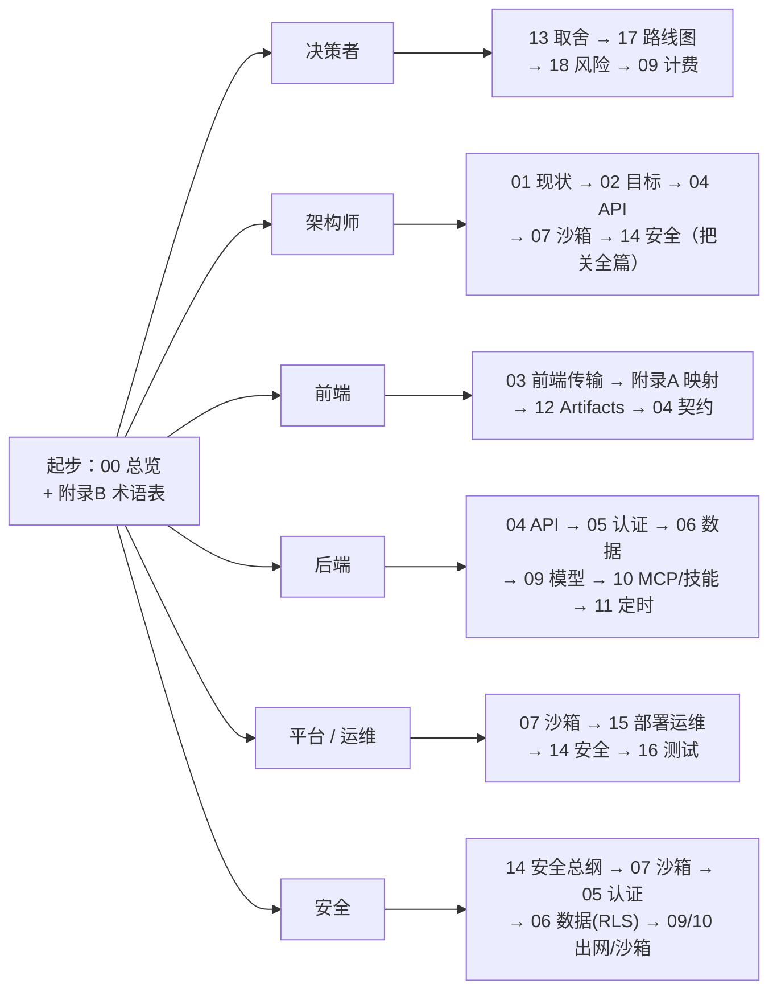

# 附录 B：术语表与阅读指南

> 本文档是整套「LobsterAI 桌面端 → 多租户 SaaS Web 应用」改造计划的**词典与导航图**。它有两个用途：（1）作为**术语表**，统一全套文档中反复出现的名词定义，避免同一个词在不同分册被不同理解；（2）作为**阅读指南**，给出 22 篇文档的一句话索引，并按角色给出推荐阅读顺序。适合读者：**所有人**——尤其是新加入项目、第一次翻开这套文档的读者，建议先读 `00-总览与执行摘要.md` 再回到本文建立词汇基线。

---

## 1. 如何使用本文档

- **第一次读**：先读 `00-总览与执行摘要.md` 建立全局印象，再扫一遍本文第 2 节术语表，然后按第 4 节找到你的角色路线。
- **读到不认识的词**：回到第 2 节按分类查（术语表按「产品与运行时」「多租户与账户」「数据与会话」「安全与网络」「运维与部署」「协议与集成」分组）。
- **想找某篇文档**：看第 3 节全文档索引，每篇一句话摘要 + 关键交叉引用。
- **命名与口径约束**：全套文档统一遵循 `02-目标架构与技术选型.md` 的技术选型总表；本文出现的定义若与源码/`package.json` 冲突，以源码为准（见 `CLAUDE.md` / `AGENTS.md` 的「以源码为权威」原则）。
- **决策与计数权威**：凡跨文档决策（定时任务权威、RLS 强制与否、阶段门命名等）、对现状源码的计数/断言，一律以 `附录C-决策基线与接口契约总纲.md`（决策 D1–D16、源码订正表 §2、接口契约 §3–§8）为「拍死层」权威。本文若与附录 C 冲突，以附录 C 为准，引用时写「见附录 C Dx / §x」而非复制其 schema。

---

## 2. 术语表

术语一词一行，给准确定义。为便于查阅按主题分组；组内大致按「先基础后派生」排列。

### 2.1 产品与运行时

| 术语 | 定义 |
|---|---|
| **LobsterAI** | 本项目的产品名。现状为 Electron + React 桌面应用（版本见 `package.json`），本计划将其改造为多租户 SaaS Web 应用。 |
| **Cowork** | LobsterAI 的**产品 / 会话层**。名字是历史遗留（最初是类 Claude Code 的内部编码助手），在当前代码库中指「拥有会话、消息、权限、UI 状态、本地持久化、上下文用量、artifacts 与 IPC 契约」的 LobsterAI 层。目标架构里对应「Cowork 会话服务」。见 `01`、`04`。 |
| **OpenClaw** | LobsterAI 当前**唯一的 Agent 运行时 / 网关**。现状是本机拉起的独立 Node 进程（`src/main/libs/openclawEngineManager.ts`），负责执行工具、读写工作区文件、跑 stdio MCP 子进程与技能脚本。目标架构里被搬进 K8s **沙箱 Pod** 运行。注意：`cowork:*` IPC 通道、`claude_session_id` 等是兼容 / 历史命名，不代表存在第二个运行时。见 `07`。 |
| **gateway（网关）** | 有两个含义，需按上下文区分：（1）**OpenClaw gateway** —— OpenClaw 运行时进程本身，现状监听 `ws://127.0.0.1:{port}`、token 鉴权、维护 state dir 与每 agent 文件工作区；桌面**现状**的定时任务 cron 也在这里（**注意这是现状口径，非目标结论**：目标态调度权威改为服务端 BullMQ + Postgres，沙箱内 OpenClaw cron 禁用/不下发，见附录 C D14）。（2）**API 网关 / BFF** —— 目标架构接入层的 NestJS 服务，负责 HTTP 路由、REST access token/JWT 校验、WS 升级与广播、首帧 ticket 校验与消费、限流。除非明确写「API 网关」，术语「gateway」通常指前者（OpenClaw gateway）。 |
| **CoworkAgentEngine** | Cowork 侧对「用哪个 Agent 运行时」的枚举，当前值只有 `'openclaw'`。历史上曾设计为可切换（如已被移除的 `yd_cowork`），现只保留 OpenClaw 一种。见 `01`。 |
| **openclawConfigSync** | 把 LobsterAI 状态渲染为 OpenClaw 配置的模块（`src/main/libs/openclawConfigSync.ts`）：写 `openclaw.json`（providers/models、agents、IM 绑定、plugins、MCP servers、skills 目录、sandbox 模式）+ 工作区文件（`AGENTS.md` 等）。目标架构里由「运行时编排器 / MCP·技能服务」承接。见 `07`、`10`。 |
| **config sync（配置同步）** | 上一条描述的动作：把租户 / 会话状态注入到 OpenClaw 运行时。SaaS 下从「写本地文件」改为「生成配置 + 经 env/挂载注入沙箱 Pod」。 |
| **Skills（技能）/ Kits** | OpenClaw 的可安装能力单元。技能包含同步、安装 / 升级、安全扫描、启用态、路由提示（`src/main/skillManager.ts`）。SaaS 下技能包存对象存储，stdio 型执行需在沙箱内。见 `10`。 |
| **MCP（Model Context Protocol）** | Agent 连接外部工具 / 数据源的协议。传输类型有 `stdio` / `sse` / `http` 三种：`stdio` 是本地 `npx` 子进程（SaaS 下必须在服务端沙箱内起），`sse`/`http` 是远程直连。见 `10`。 |
| **Artifact（制品）** | Agent 产出的可预览内容单元，由 `src/renderer/services/artifactParser.ts` 解析。可预览类型含 `html`/`svg`/`image`/`video`/`mermaid`/`code`/`markdown`/`text`/`document`/`local-service`。SaaS 下产物落对象存储 + 签名 URL / 隔离预览域。见 `12`。 |
| **记忆 / Dreaming（记忆子系统）** | LobsterAI 的长期记忆与「梦境」整理机制：生产表为 `user_memories`/`user_memory_sources` + 工作区 `MEMORY.md` + dreaming（`cowork:dreaming:*`）后台整理。（`cowork_user_memories` 只出现在 `coworkStore.test.ts`，是**测试表**，勿为它写迁移，见附录 C C17。）多租户下存储归属见 `06`，调度归属见 `07`/`11`。 |

### 2.2 工作区与文件

| 术语 | 定义 |
|---|---|
| **workspace / 工作区** | OpenClaw agent 的文件工作目录，现状在 Electron `userData/openclaw/state/` 下：`workspace-main`（主 agent）、`workspace-{agentId}`（非主 agent）。含 `AGENTS.md`（工作区指令 + LobsterAI 托管段）、`MEMORY.md`（durable 记忆）、`memory/YYYY-MM-DD.md`（每日笔记）、`USER.md`/`SOUL.md`/`IDENTITY.md`。**注意区分**：用户可见的「工作目录」是**会话 cwd**，不是 OpenClaw agent 工作区。SaaS 下映射为每租户 **PVC** + 对象存储。见 `08`。 |
| **会话 cwd** | 用户在 UI 中看到并可读写的「当前工作目录」，是用户视角的项目根。与 OpenClaw 内部的 agent 工作区是两个概念，勿混淆。 |
| **PVC（PersistentVolumeClaim）** | Kubernetes 的持久卷申领。目标架构里**每租户一个 PVC** 承载热工作区文件，随沙箱 Pod 挂载；冷 / 共享 / 大产物走对象存储。是文件层多租户隔离的载体。见 `07`、`08`。 |
| **对象存储（S3 兼容）** | 外置的可横向扩展文件存储：自托管用 MinIO、云上用 AWS S3。存工作区大文件 / 快照、Artifact 产物、技能 / Kit 包、HTML 分享内容、上传附件。key 必须带 `tenant_id` 前缀做隔离。见 `08`。 |
| **签名 URL（presigned URL）** | 对象存储签发的、带时效的临时访问链接，允许浏览器直传 / 直下而不穿过后端。用于文件下载、Artifact 预览、HTML 分享。见 `08`、`12`。 |

### 2.3 多租户与账户

| 术语 | 定义 |
|---|---|
| **tenant / 租户** | 多租户 SaaS 的隔离主体（通常对应一个组织 / 团队，也可能是个人）。所有数据、Pod、对象存储 key、日志维度都必须带 `tenant_id`。「一切带 `tenant_id`」是全计划三条硬主线之一。见 `05`、`06`、`14`。 |
| **tenant_id** | 租户主键 / 隔离列。目标架构里贯穿 PG 每张业务表、对象存储 key 前缀、Pod 命名空间 / 标签、JWT claim、日志字段。 |
| **多租户（multi-tenancy）** | 多个租户共享同一套后端与集群、靠 `tenant_id` 逻辑隔离的部署形态。GA 主线默认「共享库 + `tenant_id` 列 + **强制 RLS**」，非「每租户独立库」。见 `02`、`06`。 |
| **RLS（Row Level Security，行级安全）** | PostgreSQL 的行级访问控制：即使应用代码漏写 `where tenant_id`，数据库层也能拦截跨租户读写。作为纵深防御（defense in depth）兜底。**本计划下所有 tenant-scoped 表一律 `ENABLE ROW LEVEL SECURITY` + `FORCE`（强制，非「可选」）**；每请求在事务内 `SET LOCAL app.tenant_id`（PgBouncer transaction 模式下必须用 `SET LOCAL` 而非 `SET`），并注意连接池会话变量清理。与 Prisma 应用层注入并存（纵深，不二选一）。见附录 C D2、`06`、`14`。 |
| **BYOK（Bring Your Own Key，自带密钥）** | 租户使用自己的模型供应商 API Key 的模式（相对于平台统一托管密钥）。模型网关需支持按租户路由密钥、并对 BYOK 与平台托管两种计费口径分别处理。见 `09`。 |
| **RBAC（Role-Based Access Control）** | 基于角色的访问控制。认证与租户服务据此管理租户内成员 / 角色 / 权限。见 `05`。 |
| **配额 / 门控（quota / gating）** | 对租户可消费资源（模型 token/credits、并发 Pod 数、存储等）设上限并在调用前拦截超额。配额计数用 Redis 低延迟原子计数。见 `09`、`07`。 |
| **credits / 计费额度** | 计量与扣费的抽象单位。模型网关在流结束写入 token 用量并扣减 credits，超额由配额门控拦截。见 `09`。 |

### 2.4 数据与会话

| 术语 | 定义 |
|---|---|
| **capsule / 会话胶囊** | 会话的**连续性 / 上下文胶囊**（表 `cowork_session_capsules`），保存对话上下文摘要以支撑续聊、fork 与上下文压缩。SaaS 下随会话数据迁入 PG（带 `tenant_id`）。见 `06`、`04`。 |
| **fork（会话分叉）** | 从某条消息处派生一条新会话分支的能力，复用已有上下文 / capsule。见 `04`、`06`。 |
| **上下文用量 / 压缩（context usage / compaction）** | 会话累计消耗的上下文窗口占用统计与自动压缩机制；经 IPC 通道 `cowork:stream:contextUsage` 推送用量（runtime 侧事件名实为 `contextUsageUpdate`，见附录 C B13）。见 `04`。 |
| **claude_session_id** | `cowork_sessions` 表中的历史列名，实际存 OpenClaw 会话标识。是兼容 / 历史命名，非独立运行时证据。迁移时保留语义、可重命名的策略见 `06`。 |
| **KV 表（`kv`）** | 存放 app 级 JSON 值（含 auth/config 标志）的键值表。迁移到 PG 时需按 `tenant_id` 归属或区分全局 vs 租户级配置。见 `06`。 |
| **scheduled_tasks / scheduled_task_runs（历史遗留表）** | SQLite 中的定时任务与运行历史表，属**历史遗留**：目标态定时任务的权威是**服务端 BullMQ + Postgres**（沙箱内 OpenClaw cron 禁用/不下发，见附录 C D14），这两张表只在迁移逻辑里被读出、迁入服务端调度后即废弃（以 `11-定时任务调度.md` 口径为准）。 |
| **scheduled_task_meta** | 保留下来的本地绑定元数据表，存 OpenClaw cron job 不支持的自定义字段（origin/binding）。见 `11`。 |
| **subagent（子代理）** | Agent 派生的子任务运行体，运行与历史记录在 `subagent_runs`/`subagent_messages`。见 `06`。 |

### 2.5 前端与传输

| 术语 | 定义 |
|---|---|
| **window.electron（唯一桥）** | 现状渲染层↔主进程的**唯一** contextBridge 桥（`src/main/preload.ts`）。实测 **481 处调用、72 个渲染文件**（附录 C B10）；**并非收口于 services**——components 直连 245 处 > services 207 处，过半绕过 services，故浏览器桥必须 1:1 实现整个 `window.electron` 全局表面，而非只替换 services 层（附录 C A4）。是整个 Web 化的最大杠杆点。见 `03`、`附录A-IPC通道与接口映射.md`。 |
| **浏览器桥（windowElectronShim）** | 目标架构新增的、与 `window.electron` **同接口**的浏览器实现：`invoke(channel, ...)` → REST(HTTP)；`on('...:stream:*')` → WebSocket 订阅。SPA 启动时注入 `window.electron`，让业务组件近乎零改动。见 `03`。 |
| **IPC（Inter-Process Communication）** | Electron 主进程与渲染进程间的通信。现状请求走 `ipcRenderer.invoke` / `ipcMain.handle`，流式走主进程 `webContents.send` + 渲染层 `ipcRenderer.on`。`src/main/main.ts` 已 **11307 行**（行号会漂移，定位优先用符号名）；`main.ts` 内 `handle 211 + on 6 = 217`、全 `src/main` `handle 277 + on 6 ≈ 283`（**无一等于旧文档的 259**，附录 C B9/B15）；`.send(` 调用点 ≈ **51**、`webContents.send` ≈ **36**、去重后事件通道 ≈ **29**（引用时须区分「调用点 / `webContents.send` / 去重通道」三种口径，附录 C B14）。见 `01`、`附录A-IPC通道与接口映射.md`。 |
| **`cowork:stream:*`** | Cowork 对话的流式事件通道族，从 `CoworkIpcChannel` 的 `as const` 对象穷举共 **10 个**（`delta`/`tool`/`permission`/`thinking`/`contextUsage`/`goal`/`done`/`error`/`abort` + runtime 归一）——原文档漏了 `cowork:stream:goal`，禁止用字面量 grep 数通道（附录 C B13 / §3.2）。SaaS 下映射到 WS 订阅，经含租户前缀的 Redis Stream/PubSub 频道（如 `stream:{tenantId}:{sessionId}`）跨网关实例广播。见 `03`、`04`。 |
| **`api:stream`** | 模型 API 代理的流式通道（现状经 main 代理，`coworkOpenAICompatProxy.ts`/`coworkModelApi.ts`）。SaaS 下由模型网关承接。见 `09`。 |
| **REST(HTTP)** | 目标架构里对应「请求 / 响应」语义的传输（顶替 `ipcRenderer.invoke`）。 |
| **WebSocket（WS）** | 目标架构里对应「服务端主动多次推送」语义的传输（顶替 `webContents.send` 系列）。正式鉴权方案为 REST 先申请一次性短期 ticket，WS 首帧消费 ticket；还需处理跨实例广播、断线重连补发、`requestId` 多路复用。见 `03`。 |
| **BFF（Backend For Frontend）** | 面向前端聚合的后端层。此处即「API 网关 / BFF」：把 `window.electron` 语义映射到后端调用、做鉴权 / 限流 / WS 升级与广播。见 `02`、`04`。 |
| **Electron-only 通道** | 只在桌面环境有意义的 IPC 通道（如 `window-*`、`shell:*`、`dialog:*`、`clipboard:*`、本地 `log:*`）。浏览器桥中降级为浏览器等价实现或 no-op。见 `03`、`13`。 |

### 2.6 运行时编排与隔离

| 术语 | 定义 |
|---|---|
| **沙箱 Pod（sandbox Pod）** | 目标架构里跑 OpenClaw gateway 的 Kubernetes Pod，**每用户 / 每会话一个**，用 gVisor/Kata 加固、挂载租户 PVC、`NetworkPolicy` 默认拒绝出网（仅放行到模型网关）。必须假设它会被攻破。是全计划最难一章的核心。见 `07`、`14`。 |
| **Sandbox 生产镜像** | 给沙箱 Pod 使用的生产运行时镜像，目标是只包含 OpenClaw gateway、必要 Node runtime、MCP/Skills 执行依赖、配置同步入口与健康检查。不得包含 Electron Renderer、Xvfb、x11vnc、noVNC、真实密钥或租户数据。旧 `容器改造计划` 中关于 Linux runtime 构建、native modules、`resources/cfmind`、资源采样的内容并入此项。见 `07`、`15`、`16`。 |
| **完整桌面容器 / 旧容器方案** | 旧 `容器改造计划` 里的过渡形态：把完整 Electron 桌面应用、Chromium、Xvfb/noVNC、本地 SQLite、OpenClaw gateway 和独立 `HOME` 放入一个 Docker 容器。它可用于旧 GUI 兼容 PoC、登录链路排查或 debug 镜像，但不是网页版 SaaS 的最终产品入口。有效经验已拆入 Sandbox 镜像、状态卷、资源测算和安全边界章节。 |
| **运行时编排器（orchestrator）** | 管理沙箱 Pod 生命周期（创建 / 健康检查 / 回收）、端口 / token / config 注入、Pod↔会话映射、扩缩容与配额的后端服务。是**唯一直接操作 K8s API** 的服务。见 `07`。 |
| **warm capacity pool / 预热容量池** | 为降低每会话冷启动延迟而提前准备的容量：节点预留、镜像预拉、gVisor/Kata runtime 预热、只读依赖缓存。默认不是“已挂租户卷的运行中空闲 Pod 集合”；真实会话 Pod 在 acquire 时创建，PVC/ConfigMap/Secret 在创建时声明。热 Pod 直接接管只能作为实验证明后的优化。见 `07`。 |
| **冷 / 预热容量 / 热三态** | 沙箱资源的生命周期状态：冷（无可用预热容量，可能需拉镜像/扩节点）、预热容量（节点/镜像/runtime/cache 已就绪但未绑定租户数据）、热（已绑定会话的活跃 Pod 可续聊复用）。用于在体验与成本之间平衡。见 `07`、`15`。 |
| **lease / 租约** | Pod↔会话的占用凭据 / 有效期机制：分配时获取租约，空闲超时后租约到期、Pod 被回收或归还池。防止 Pod 泄漏、控制成本。见 `07`。 |
| **空闲回收 / 驱逐（eviction）** | 对空闲超时的沙箱 Pod 定时回收 / 驱逐，释放资源。见 `07`、`15`。 |
| **gVisor / Kata Containers** | 两种容器内核级加固方案（application kernel / 轻量 microVM），比普通容器提供更强隔离、阻断容器逃逸。经 K8s `RuntimeClass` 选用。见 `07`、`14`。 |
| **RuntimeClass** | Kubernetes 的运行时选择机制，用于给沙箱 Pod 指定 gVisor/Kata 运行时。见 `07`、`15`。 |
| **NetworkPolicy** | Kubernetes 的网络访问策略。沙箱命名空间默认拒绝出网，仅放行到模型网关，且不可访问 `app`/`data` 内部服务。是沙箱不可信假设下的关键护栏。见 `14`。 |
| **命名空间 / 节点池（namespace / node pool）** | K8s 逻辑分区（`ingress`/`app`/`sandbox`/`data`）与物理节点分组。沙箱 Pod 物理隔离到**专用节点池**，是多租户安全核心。见 `02`、`14`。 |
| **HPA（Horizontal Pod Autoscaler，水平自动扩缩）** | Kubernetes 按 CPU/QPS/WS 连接数等指标自动增减无状态服务副本数的机制。用于网关、Cowork、模型网关等。见 `02`、`15`。 |

### 2.7 安全与网络

| 术语 | 定义 |
|---|---|
| **OAuth2 / OIDC（OpenID Connect）** | 目标鉴权方案：标准 web 重定向流（授权码 + PKCE）。现状是 OAuth loopback（`127.0.0.1` 回调，桌面特有），web 化后回归标准重定向。见 `05`。 |
| **loopback OAuth** | 现状桌面端登录形态：本地起临时回调服务（`authLocalCallbackServer.ts`），`127.0.0.1` 接收授权回调。SaaS 下改为标准 web 重定向。见 `05`。 |
| **Xvfb / x11vnc / noVNC** | 旧完整桌面容器用于把 Linux 无头桌面暴露到浏览器的远程桌面组合。合并到当前计划后，它只允许出现在非生产 debug 镜像或旧 GUI 兼容 PoC 中；生产 Sandbox 镜像和 GA 用户入口不得包含或暴露这些组件。见 `14`、`15`。 |
| **JWT（JSON Web Token）** | 无状态令牌，携带 `tenant_id`/`user_id`/角色，供网关校验并注入多租户上下文。用短时 access token + 刷新令牌轮换 + Redis 黑名单缓解撤销难题。见 `05`。 |
| **SSRF（Server-Side Request Forgery，服务端请求伪造）** | 攻击者诱导服务端向非预期地址发起请求的漏洞。SaaS 下沙箱执行不可信 Agent 代码、且有 `http`/`sse` MCP 与 URL 抓取能力，须防 SSRF（出网收敛 + 目标白名单 + 元数据端点封禁）。见 `14`、`10`。 |
| **CSP（Content Security Policy，内容安全策略）** | 浏览器端限制资源加载 / 脚本执行来源的策略头。用于 SPA 与 Artifact / HTML 预览的隔离（预览走独立沙箱域 + 严格 CSP + iframe sandbox）。见 `12`、`14`。 |
| **iframe sandbox** | 用受限 iframe 隔离渲染不可信 HTML/SVG 内容的浏览器机制。Artifact 内联 HTML 预览的隔离手段之一。见 `12`。 |
| **WAF（Web Application Firewall）** | Web 应用防火墙 / DDoS 防护，位于 CDN / 边缘层。见 `02`、`15`。 |
| **纵深防御（defense in depth）** | 多层独立防护叠加（如 `tenant_id` 应用层校验 + RLS 数据层兜底 + Pod 命名空间 / NetworkPolicy 网络层），任一层失效仍不越权。是多租户隔离的设计原则。见 `14`。 |

### 2.8 运维与部署

| 术语 | 定义 |
|---|---|
| **Kubernetes（K8s）** | 容器编排平台，承载全部后端服务与会话沙箱 Pod 编排体系。见 `02`、`07`、`15`。 |
| **Helm** | K8s 部署编排工具，用 values 管理 dev/staging/prod 差异（Deployment/HPA/NetworkPolicy/RuntimeClass 模板）。配置差异由 values 驱动，代码不含环境分支。见 `15`。 |
| **Ingress** | K8s 集群入口控制器（NGINX/Envoy），负责 TLS 终止与 WS 长连转发。见 `02`、`15`。 |
| **SLO（Service Level Objective，服务级目标）** | 对服务质量的量化目标（如可用性、首字延迟 P95、错误率上限），据此设告警与容量规划。见 `15`、`16`。 |
| **OpenTelemetry（OTel）** | 厂商中立的 trace/metric/log 统一埋点标准。对话链路跨「网关→Cowork→编排器→Pod→模型网关」，分布式追踪靠它串联。见 `15`。 |
| **Prometheus / Grafana / Loki / Tempo** | 可观测栈：Prometheus（指标）+ Grafana（面板 / 告警）+ Loki（日志）+ Tempo/Jaeger（分布式追踪）。日志 / 指标须带 `tenant_id`/`session_id`/`trace_id` 维度。见 `15`。 |
| **BullMQ** | 基于 Redis 的分布式任务队列。目标态**与 Postgres 一起承载定时任务调度权威**（沙箱内 OpenClaw cron 禁用，见附录 C D14），并承担异步作业（工作区快照 / 技能安装等），提供延迟任务、重试、并发控制。见 `11`。 |
| **Redis（缓存 / 队列 / 广播）** | 承三职：缓存（配额计数 / 会话热态 / 限流令牌桶）、pub/sub（跨网关实例广播 WS 事件）、BullMQ 队列底座。见 `02`。 |
| **PITR（Point-In-Time Recovery，时间点恢复）** | PostgreSQL 的按时间点恢复备份能力，用于 prod 数据保护。见 `15`。 |
| **PoC（Proof of Concept，概念验证）** | 用于验证高风险方案可行性的小规模验证（如单会话沙箱 Pod 端到端 PoC）。见 `07`、`17`。 |

### 2.9 协议与集成

| 术语 | 定义 |
|---|---|
| **IM 渠道** | 即时通讯接入（微信 / 飞书 / 钉钉 / QQ / Telegram / Discord / 邮件 / NIM / POPO / WeCom 等）。多为 OpenClaw connector 常驻连接（`src/main/im/`）。**GA 后续再做**，不阻塞 V1-V6 主线。见 `13`。 |
| **computer-use** | 桌面自动化能力（`src/main/computerUse/`），依赖用户本机桌面。SaaS 无宿主桌面，**本次不做**。见 `13`。 |
| **VM / 后台浏览器** | 每会话常驻浏览器 / VM 自动化。成本与隔离风险高，**本次不做**。见 `13`。 |
| **youdao 云** | 现状挂靠的云能力提供方（登录 / 模型目录 / 配额计费 / HTML share / skill store / 更新，`src/main/libs/endpoints.ts`）。本次要**全部自建重建**，不再依赖。见 `05`、`09`、`12`。 |
| **模型代理 / 模型网关** | 上游模型供应商的统一代理：协议转换（OpenAI↔Anthropic、Gemini schema 清洗）、流式转发、鉴权、按 token/credits 计量扣费、配额门控。现状经 main 代理（`coworkOpenAICompatProxy.ts`/`coworkModelApi.ts`），目标为独立模型网关服务。见 `09`。 |
| **NestJS / Fastify** | 后端框架。推荐 NestJS（模块化 / DI / 内置 WS gateway / 契合按域拆分）；Fastify 作为对性能敏感、逻辑简单服务的备选。见 `02`、`04`。 |
| **Prisma** | PostgreSQL 的类型安全 ORM 与迁移工具，替代现状 `PRAGMA table_info()` 的 ad-hoc 迁移。见 `06`。 |
| **HTML share（HTML 分享）** | 把 Artifact / HTML 内容生成公开可访问链接的能力。现状挂 youdao 云，目标由 Artifact / 预览服务自建（对象存储 + 分享记录 + 隔离预览域）。见 `12`。 |

---

## 3. 全文档索引（22 篇一句话摘要）

全计划共 **22 份文档**（19 篇正文 + 3 篇附录 A/B/C）。下表每篇一句话摘要 + 最相关的交叉引用；文件名与仓库中完全一致。

| 编号 | 文件名 | 一句话摘要 | 强相关 |
|---|---|---|---|
| 00 | `00-总览与执行摘要.md` | 全局与决策入口：为什么做、做到什么程度、怎么做、代价与 Top 风险。 | 02、17、18 |
| 01 | `01-现状架构调研.md` | 「知己」——桌面端现状深度调研：IPC、OpenClaw、SQLite、云能力的真实形态与关键数字。 | 附录A、02 |
| 02 | `02-目标架构与技术选型.md` | 技术总纲：目标形态、分层职责、逐项选型理由、一次对话的端到端时序。 | 00、04、07 |
| 03 | `03-前端与传输层改造.md` | 「同接口浏览器桥」顶替 `window.electron`，`invoke`→REST、`on`→WS 的传输改造。 | 附录A、04、12 |
| 04 | `04-后端服务与API设计.md` | 后端按域拆分（8 服务 + 网关）与 REST/WS API 契约设计。 | 02、附录A、05 |
| 05 | `05-认证与多租户账户.md` | OAuth2/OIDC + JWT + 租户 / 用户 / RBAC 模型，loopback→标准 web 重定向。 | 06、14、09 |
| 06 | `06-数据模型迁移.md` | SQLite→Postgres 多租户迁移：全表补 `tenant_id`、Prisma schema、迁移脚本、**强制 RLS**（见附录 C D2；身份表 DDL 字段权威见附录 C §4）。 | 05、11、14、附录C |
| 07 | `07-OpenClaw运行时编排与沙箱隔离.md` | **最难一章**：每租户 / 会话沙箱 Pod、gVisor/Kata、PVC、预热容量 / 租约 / 冷热状态。 | 08、14、02 |
| 08 | `08-文件工作区与对象存储.md` | 工作区读写 API、PVC 与 S3 分工、签名 URL、路径校验防越权。 | 07、12 |
| 09 | `09-模型代理与计费.md` | 自建模型网关 + 协议转换 + 配额门控 + token/credits 计量扣费（含 BYOK）。 | 05、14 |
| 10 | `10-MCP与技能改造.md` | MCP（stdio 沙箱化 / sse·http 直连）与 Skills/Kits 安装 / 同步 / 安全扫描改造。 | 07、14 |
| 11 | `11-定时任务调度.md` | 定时任务调度：目标以**服务端 BullMQ + Postgres 为权威**（沙箱内 OpenClaw cron 禁用，见附录 C D14），历史表迁移即废弃。 | 06、07、04、附录C |
| 12 | `12-Artifacts与预览改造.md` | Artifacts 解析与预览类型改造：对象存储 + 签名 URL + 隔离预览域 + CSP/iframe sandbox。 | 08、14、03 |
| 13 | `13-功能取舍与降级清单.md` | 做 / 不做 / 降级完整清单（IM 后续、computer-use 不做、VM 不做）与替代方案。 | 00、07、14 |
| 14 | `14-安全合规与多租户隔离.md` | 安全总纲：三层隔离模型、沙箱不可信假设、SSRF/CSP、合规与审计。 | 07、05、06 |
| 15 | `15-部署运维与可观测性.md` | K8s/Helm 部署、dev/staging/prod、OTel+Prometheus/Grafana/Loki、SLO 与告警。 | 02、07、16 |
| 16 | `16-测试策略与验收标准.md` | 契约 / 集成 / 隔离 / 压测测试策略与各里程碑验收标准。 | 15、07、附录A |
| 17 | `17-分阶段路线图与工作量估算.md` | 第一版 V1 到第六版 V6 路线图、旧 M0-M9 映射、任务分解、人月估算与团队规模。 | 00、07、18 |
| 18 | `18-风险登记册.md` | 全量风险登记：概率 / 影响评级、触发信号、缓解与责任人占位。 | 00、07、17 |
| 附录A | `附录A-IPC通道与接口映射.md` | IPC 通道 → REST/WS 接口逐条映射基线（约 260 通道），前后端契约根据。 | 03、04 |
| 附录B | `附录B-术语表与阅读指南.md` | 本文档：术语表 + 全文档索引 + 按角色阅读路线。 | 00、02 |
| 附录C | `附录C-决策基线与接口契约总纲.md` | **权威「拍死层」**：跨文档决策 D1–D16、源码订正表 §2、接口契约事实源与关键 schema/DDL §3–§8；与任何文档（含本文）冲突以本附录为准。 | 全部 |

---

## 4. 阅读指南（按角色）

所有角色统一从「先读 `00-总览与执行摘要.md` + 本文（`附录B`）术语表」起步；随后按下图与下表分流。

### 4.1 决策者

关心「做不做、值不值、多大代价、什么风险」。

| 顺序 | 文档 | 关注点 |
|---|---|---|
| 1 | `00-总览与执行摘要.md` | 范围、核心结论、Top 5 风险、工作量周期粗估。 |
| 2 | `13-功能取舍与降级清单.md` | V1-V6 GA 主线做 / 不做 / 降级边界，管理外部预期。 |
| 3 | `17-分阶段路线图与工作量估算.md` | 里程碑、人月、团队规模、排期。 |
| 4 | `18-风险登记册.md` | 风险全貌与缓解，尤其 R1 隔离、R2 成本。 |
| 扩展 | `09-模型代理与计费.md`、`02-目标架构与技术选型.md` | 成本 / 计费口径、总体技术方向。 |

### 4.2 架构师

需把关全篇一致性，重点是边界与最难一章。

| 顺序 | 文档 | 关注点 |
|---|---|---|
| 1 | `01-现状架构调研.md` | 知己：现状真实形态与关键数字。 |
| 2 | `02-目标架构与技术选型.md` | 目标形态、分层职责、选型理由、端到端时序。 |
| 3 | `04-后端服务与API设计.md` | 服务边界、依赖方向（避免环）、API 契约。 |
| 4 | `07-OpenClaw运行时编排与沙箱隔离.md` | 最难一章：Pod 生命周期、隔离、池化。 |
| 5 | `14-安全合规与多租户隔离.md` | 三层隔离模型与安全总纲。 |
| 6 | `附录C-决策基线与接口契约总纲.md` | 「拍死层」：跨文档决策 D1–D16、源码订正表、接口契约事实源；冲突时以此为准。 |
| 扩展 | 全部 | 把关三条硬主线（一切带 `tenant_id`、沙箱假设被攻破、模型出网收敛）。 |

### 4.3 前端

改造集中在「桥这一层」，业务组件近乎零改。

| 顺序 | 文档 | 关注点 |
|---|---|---|
| 1 | `03-前端与传输层改造.md` | 浏览器桥、REST/WS 适配、Electron-only 降级。 |
| 2 | `附录A-IPC通道与接口映射.md` | 逐通道映射契约基线（`cowork:stream:*`、`api:stream`）。 |
| 3 | `12-Artifacts与预览改造.md` | 预览类型、签名 URL、iframe/CSP 隔离对前端的影响。 |
| 扩展 | `04-后端服务与API设计.md`、`附录B`（本文） | 后端契约、术语对齐。 |

### 4.4 后端

按域实现各服务，复用现有 TS 逻辑。

| 顺序 | 文档 | 关注点 |
|---|---|---|
| 1 | `04-后端服务与API设计.md` | 服务拆分与 API 契约总图。 |
| 2 | `05-认证与多租户账户.md` | OIDC/JWT、租户上下文注入、RBAC。 |
| 3 | `06-数据模型迁移.md` | Postgres 多租户 schema、Prisma、迁移与 RLS。 |
| 4 | `09-模型代理与计费.md` | 模型网关、协议转换、配额与计费闭环。 |
| 5 | `10-MCP与技能改造.md` | MCP 传输 / 沙箱化、技能安装 / 扫描。 |
| 6 | `11-定时任务调度.md` | 调度权威归属（服务端 BullMQ + Postgres，沙箱内 cron 禁用，见附录 C D14）、历史表迁移。 |
| 扩展 | `07`、`附录A` | 与运行时协作、契约映射。 |

### 4.5 平台 / 运维

聚焦编排、隔离、部署与可观测。

| 顺序 | 文档 | 关注点 |
|---|---|---|
| 1 | `07-OpenClaw运行时编排与沙箱隔离.md` | Pod 编排、gVisor/Kata、PVC、预热容量 / 租约 / 三态。 |
| 2 | `15-部署运维与可观测性.md` | K8s/Helm、命名空间 / 节点池、OTel/Prometheus/Grafana/Loki、SLO。 |
| 3 | `14-安全合规与多租户隔离.md` | NetworkPolicy、节点池隔离、纵深防御。 |
| 4 | `16-测试策略与验收标准.md` | 隔离测试、压测、验收信号。 |
| 扩展 | `02`、`18` | 部署拓扑、成本 / 隔离风险。 |

### 4.6 安全

以安全总纲为轴，横切多章验证隔离。

| 顺序 | 文档 | 关注点 |
|---|---|---|
| 1 | `14-安全合规与多租户隔离.md` | 隔离模型、沙箱不可信假设、SSRF/CSP、合规审计。 |
| 2 | `07-OpenClaw运行时编排与沙箱隔离.md` | 沙箱加固（gVisor/Kata）、NetworkPolicy、逃逸兜底。 |
| 3 | `05-认证与多租户账户.md` | 鉴权流、JWT 撤销、租户上下文根据。 |
| 4 | `06-数据模型迁移.md` | RLS 纵深防御、跨租户串户防护。 |
| 5 | `09-模型代理与计费.md`、`10-MCP与技能改造.md` | 出网收敛、密钥托管、stdio 沙箱化、技能安全扫描。 |
| 扩展 | `12`、`08` | 预览隔离、路径越权 / 穿越防护。 |

---

## 5. 三条硬主线（贯穿全篇的记忆锚点）

无论读哪一章，回到这三条即可校准是否偏离总纲（源自 `02-目标架构与技术选型.md`）：

1. **一切带 `tenant_id`**：每条数据、每个 Pod、每个对象存储 key、每条日志都可追溯到租户；跨租户在 DB（`tenant_id`/RLS）、存储（key 前缀 / 策略）、Pod（命名空间 /NetworkPolicy）三层均被拒。
2. **沙箱假设被攻破**：沙箱 Pod 跑不完全可信的 Agent 代码，必须假设它会被攻破——故物理隔离到专用节点池 + gVisor/Kata + 默认拒绝出网。
3. **模型出网收敛到网关**：沙箱 Pod 不能直连模型供应商公网，一切模型调用经模型网关，保证密钥集中托管、计费准确、防数据外泄。

> 小结：本文是全套文档的**入口词典 + 导航图**。第 2 节统一术语，第 3 节一句话索引 22 篇，第 4 节按角色给路线，第 5 节收束三条硬主线。遇到任何不确定，先回本文对齐词汇，再回 `00`/`02` 对齐全局。
